# $1 M L$ 

## By François Pottier and Didier Rémy

由François Pottier和Didier Rémy撰写

### 1.1 Preliminaries

### 1.1 前言

## Names and renaming

名称与重命名

Mathematicians and computer scientists use names to refer to arbitrary or unknown objects in the statement of a theorem, to refer to the parameters of a function, etc. Names are convenient because they are understandable by humans; nevertheless, they can be tricky. An in-depth treatment of the difficulties associated with names and renaming is beyond the scope of the present chapter: we encourage the reader to study Gabbay and Pitts' excellent series of papers (Gabbay and Pitts, 2002; Pitts, 2002b). Here, we merely recall a few notions that are used throughout this chapter. Consider, for instance, an inductive definition of the abstract syntax of a simple programming language, the pure $\lambda$-calculus:

数学家和计算机科学家使用名称来指代定理陈述中的任意或未知对象，指代函数的参数等。名称之所以方便，是因为它们能够被人理解；然而，它们也可能具有欺骗性。关于名称及其重命名所涉及的困难进行深入探讨超出了本章的范围：我们建议读者研究Gabbay和Pitts的优秀系列论文（Gabbay和Pitts，2002；Pitts，2002b）。在这里，我们仅仅回顾本章中使用的几个概念。例如，考虑一个简单编程语言的抽象语法归纳定义，即纯λ-演算：

$$
\mathrm{t}::=\mathrm{z}|\lambda \mathrm{z} . \mathrm{t}| \mathrm{t} \:  \mathrm{t}
$$

Here, the meta-variable $\mathrm{z}$ ranges over an infinite set of variables - that is, names-while the meta-variable t ranges over terms. As usual in mathematics, we write "the variable $z$ " and "the term $t$ " instead of "the variable denoted by $z$ " and "the term denoted by t". The above definition states that a term may be a variable $\mathbf{z}$, a pair of a variable and a term, written $\lambda$ z.t, or a pair of terms, written $t_{1} t_{2}$. However, this is not quite what we need. Indeed, according to[^0]this definition, the terms $\lambda z_{1} \cdot z_{1}$ and $\lambda z_{2} \cdot z_{2}$ are distinct, while we would like them to be a single mathematical object, because we intend $\lambda z . z$ to mean "the function that maps $z$ to $z$ "- a meaning that is independent of the name $z$. To achieve this effect, we complete the above definition by stating that the construction $\lambda$ z.t binds $\mathbf{z}$ within $t$. One may also say that $\lambda \mathrm{z}$ is a binder whose scope is $t$. Then, $\lambda z . t$ is no longer a pair: rather, it is an abstraction of the variable $z$ within the term $t$. Abstractions have the property that the identity of the bound variable does not matter; that is, $\lambda z_{1} . z_{1}$ and $\lambda z_{2} . z_{2}$ are the same term. Informally, we say that terms are considered equal modulo $\alpha$-conversion. Once the position and scope of binders are known, several standard notions follow, such as the set of free variables of a term $t$, written $f v(t)$, and the capture-avoiding substitution of a term $t_{1}$ for a variable $z$ within a term $t_{2}$, written $\left[\mathrm{z} \mapsto \mathrm{t}_{1}\right] \mathrm{t}_{2}$. For conciseness, we write $f v\left(\mathrm{t}_{1}, \mathrm{t}_{2}\right)$ for $f v\left(\mathrm{t}_{1}\right) \cup f v\left(\mathrm{t}_{2}\right)$. A term is said to be closed when it has no free variables.

在这里，元变量 $\mathrm{z}$ 的取值范围在一个无限变量的集合上——即，名称——而元变量 t 范围在项上。与数学中通常的做法一样，我们写“变量 $z$ ”和“项 $t$ ”，而不是“由 $z$ 表示的变量”和“由 t 表示的项”。上述定义指出，一个项可以是变量 $\mathbf{z}$，一个变量和项的二元组，写作 $\lambda$ z.t，或者是两个项的二元组，写作 $t_{1} t_{2}$。然而，这并不是我们真正需要的。实际上，根据这个定义，项 $\lambda z_{1} \cdot z_{1}$ 和 $\lambda z_{2} \cdot z_{2}$ 是不同的，而我们希望它们是同一个数学对象，因为我们打算让 $\lambda z . z$ 表示“将 $z$ 映射到 $z$ 的函数”——这个含义与名称 $z$ 无关。为了达到这个效果，我们通过声明构造 $\lambda$ z.t 在 $t$ 中绑定 $\mathbf{z}$ 来完善上述定义。也可以说 $\lambda \mathrm{z}$ 是一个绑定器，其作用域是 $t$。那么，$\lambda z . t$ 便不再是一个二元组：更确切地说，它是项 $t$ 中变量 $z$ 的抽象。抽象具有这样的性质：绑定变量的身份并不重要；即 $\lambda z_{1} . z_{1}$ 和 $\lambda z_{2} . z_{2}$ 是相同的项。非正式地说，我们认为项在 $\alpha$-转换下是等价的。一旦绑定器的作用域和位置已知，便会得出几个标准概念，例如项 $t$ 的自由变量集合，记作 $f v(t)$，以及在项 $t_{2}$ 中对变量 $z$ 进行避俘获替换的项 $t_{1}$，记作 $\left[\mathrm{z} \mapsto \mathrm{t}_{1}\right] \mathrm{t}_{2}$。为了简洁，我们写 $f v\left(\mathrm{t}_{1}, \mathrm{t}_{2}\right)$ 表示 $f v\left(\mathrm{t}_{1}\right) \cup f v\left(\mathrm{t}_{2}\right)$。如果一个项没有自由变量，它就被认为是闭项。

A renaming is a total bijective mapping from variables to variables that affects only a finite number of variables. The sole property of a variable is its identity, that is, the fact that it is distinct from other variables. As a result, at a global level, all variables are interchangeable: if a theorem holds in the absence of hypotheses about any particular variable, then any renaming of it holds as well. We often make use of this fact. When proving a theorem $T$, we say that a hypothesis $H$ may be assumed wihout loss of generality (w.l.o.g.) if the theorem $T$ follows from the theorem $H \Rightarrow T$ via a renaming argument, which is usually left implicit.

重命名是一个从变量到变量的完全双射映射，它只影响有限数量的变量。变量的唯一属性是它的身份，即它与其他变量不同的特性。因此，在全局层面，所有变量都是可互换的：如果一个定理在没有关于任何特定变量的假设下成立，那么它的任何重命名也同样成立。我们经常利用这个事实。在证明定理T时，我们说可以不妨假设假设H，如果没有失去一般性（w.l.o.g.），即从定理H => T通过重命名论证可以得到定理T，这通常是不言而喻的。

If $\bar{z}_{1}$ and $\bar{z}_{2}$ are sets of variables, we write $\bar{z}_{1} \# \bar{z}_{2}$ as a shorthand for $\overline{\mathrm{z}}_{1} \cap \overline{\mathrm{z}}_{2}=\varnothing$, and say that $\overline{\mathrm{z}}_{1}$ is fresh for $\overline{\mathrm{z}}_{2}$ (or vice-versa). We say that $\overline{\mathrm{z}}$ is fresh for $t$ if and only if $\bar{z} \# \mathrm{fv}(\mathrm{t})$ holds.

如果 $\bar{z}_{1}$ 和 $\bar{z}_{2}$ 是变量集，我们用 $\bar{z}_{1} \# \bar{z}_{2}$ 作为简写表示 $\overline{\mathrm{z}}_{1} \cap \overline{\mathrm{z}}_{2}=\varnothing$，并且说 $\overline{\mathrm{z}}_{1}$ 对于 $\overline{\mathrm{z}}_{2}$ 是新鲜的（反之亦然）。我们说 $\overline{\mathrm{z}}$ 对于 $t$ 是新鲜的，当且仅当 $\bar{z} \# \mathrm{fv}(\mathrm{t})$ 成立。

In this chapter, we work with several distinct varieties of names: program variables, memory locations, and type variables, the latter of which may be further divided into kinds. We draw names of different varieties from disjoint sets, each of which is infinite.

在本章中，我们处理几种不同的名称变体：程序变量、内存位置和类型变量，后者可能进一步分为种类。我们从不同的变体中抽取名称，这些变体来自互不相交的集合，每个集合都是无限的。

### 1.2 What is ML?

The name "ML" appeared during the late seventies. It then referred to a general-purpose programming language that was used as a meta-language (whence its name) within the theorem prover LCF (Gordon, Milner, and Wadsworth, 1979b). Since then, several new programming languages, each of which offers several different implementations, have drawn inspiration from it. So, what does "ML" stand for today?

“ML”这个名字出现在七十年代末。那时它指的是一种通用编程语言，被用作定理证明器LCF（Gordon，Milner和Wadsworth，1979b）中的元语言（其名字由此而来）。从那时起，几种新的编程语言从中汲取灵感，每种语言都提供了几种不同的实现方式。那么，“ML”今天代表什么呢？

For a semanticist, "ML" might stand for a programming language featuring first-class functions, data structures built out of products and sums, mutable
memory cells called references, exception handling, automatic memory management, and a call-by-value semantics. This view encompasses the Standard ML (Milner, Tofte, and Harper, 1990) and Caml (Leroy, 2000) families of programming languages. We refer to it as $M L$-the-programming-language.

对于语义学家来说，“ML”可能代表一种编程语言，它具有[first-class function](https://zh.wikipedia.org/zh-sg/%E5%A4%B4%E7%AD%89%E5%87%BD%E6%95%B0)、由积和和构成的数据结构、可变内存单元（称为引用）、异常处理、自动内存管理和按值调用的语义。这种观点涵盖了标准ML（Milner、Tofte和Harper，1990年）和Caml（Leroy，2000年）系列的编程语言。我们将其称为“ML-编程语言”。

For a type theorist, "ML" might stand for a particular breed of type systems, based on the simply-typed $\lambda$-calculus, but extended with a simple form of polymorphism introduced by let declarations. These type systems have decidable type inference; their type inference algorithms crucially rely on first-order unification and can be made efficient in practice. In addition to Standard ML and Caml, this view encompasses programming languages such as Haskell (Hudak, Peyton Jones, Wadler, Boutel, Fairbairn, Fasel, Guzman, Hammond, Hughes, Johnsson, Kieburtz, Nikhil, Partain, and Peterson, 1992) and Clean (Brus, van Eekelen, van Leer, and Plasmeijer, 1987), whose semantics is rather different-indeed, it is pure and lazy-but whose type system fits this description. We refer to it as $M L$-the-type-system. It is also referred to as Hindley and Milner's type discipline in the literature.

对于类型理论家来说，“ML”可能代表一类基于简单类型$\lambda$-演算的类型系统，但通过let声明引入了一种简单的多态性进行扩展。这些类型系统具有可决定的类型推断；它们的类型推断算法关键依赖于一阶统一，实际上可以变得高效。除了标准ML和Caml之外，这种观点还包括像Haskell（Hudak, Peyton Jones, Wadler, Boutel, Fairbairn, Fasel, Guzman, Hammond, Hughes, Johnsson, Kieburtz, Nikhil, Partain, 和Peterson, 1992）和Clean（Brus, van Eekelen, van Leer, 和Plasmeijer, 1987）这样的编程语言，它们的语义实际上有所不同——确实是纯粹且懒惰的——但它们的类型系统符合这个描述。我们将其称为$ML$-类型系统。在文献中，它也被称为Hindley和Milner的类型纪律。

For us, "ML" might also stand for the particular programming language whose formal definition is given and studied in this chapter. It is a core calculus featuring first-class functions, let declarations, and constants. It is equipped with a call-by-value semantics. By customizing constants and their semantics, one may recover data structures, references, and more. We refer to this particular calculus as $M L$-the-calculus.

对于我们来说，“ML”也可能指的是本章中给出并研究的一种特定编程语言的正式定义。它是一种核心演算，具有一等函数、let声明和常量。它配备了按值调用语义。通过定制常量及其语义，可以恢复数据结构、引用等。我们将这种特定的演算称为$M L$-演算。

Why study ML-the-type-system today, such a long time after its initial discovery? One may think of at least two reasons.

为什么在今天，即在最初发现之后这么长的时间里还要学习ML类型系统？人们至少可以想到两个原因。

First, its treatment in the literature is often cursory, because it is considered either as a simple extension of the simply-typed $\lambda$-calculus (TAPL Chapter 9) or as a subset of Girard and Reynolds' System F (TAPL Chapter 23). The former view is supported by the claim that the let construct, which distinguishes ML-the-type-system from the simply-typed $\lambda$-calculus, may be understood as a simple textual expansion facility. However, this view only tells part of the story, because it fails to give an account of the principal types property enjoyed by ML-the-type-system, leads to a naïve type inference algorithm whose time complexity is exponential, and breaks down when the language is extended with side effects, such as state or exceptions. The latter view is supported by the fact that every type derivation within ML-the-type-system is also a valid type derivation within an implicity-typed variant of System F. Such a view is correct, but again fails to give an account of type inference for ML-the-type-system, since type inference for System F is undecidable (Wells, 1999).

首先，它在文献中的处理往往很草率，因为它被认为要么是简单类型λ演算的简单扩展（TAPL第9章），要么是Girard和Reynolds的System F的一个子集（TAPL第23章）。前一种观点得到了这样的支持：let构造，它将ML类型系统与简单类型λ演算区分开来，可以被视为一种简单的文本扩展工具。然而，这种观点只讲述了部分故事，因为它没有解释ML类型系统所享有的主要类型属性，导致了一个时间复杂度为指数级的简单类型推断算法，并且在语言扩展了副作用（如状态或异常）时无法成立。后一种观点得到了这样的支持：ML类型系统内的每个类型推导也是隐性类型变体System F中有效的类型推导。这种观点是正确的，但同样没有为ML类型系统的类型推断提供解释，因为System F的类型推断是不可判定的（Wells，1999）。

Second, existing accounts of type inference for ML-the-type-system (Milner, 1978; Damas and Milner, 1982; Tofte, 1988; Leroy, 1992; Lee and Yi, 1998; Jones, 1999) usually involve heavy manipulations of type substitutions. Such an ubiquitous use of type substitutions is often quite obscure. Furthermore, actual implementations of the type inference algorithm do not explicitly manipulate substitutions; instead, they extend a standard first-order unification algorithm, where terms are updated in place as new equations are discovered (Huet, 1976). Thus, it is hard to tell, from these accounts, how to write an efficient type inference algorithm for ML-the-type-system. Yet, in spite of the increasing speed of computers, efficiency remains crucial when ML-thetype-system is extended with expensive features, such as Objective Caml's object types (Rémy and Vouillon, 1998) or polymorphic methods (Garrigue and Rémy, 1999).


其次，关于ML类型系统类型推断的现有文章（Milner, 1978; Damas和Milner, 1982; Tofte, 1988; Leroy, 1992; Lee和Yi, 1998;）通常涉及类型替换的大量操作。这种无处不在的类型替换使用往往相当晦涩。此外，类型推断算法的实际实现并没有明确地操作替换；相反，它们扩展了一个标准的一阶统一算法，其中术语在新方程发现时原地更新（休伊特，1976年）。因此，从这些描述中很难看出如何为ML类型系统编写一个高效的类型推断算法。然而，尽管计算机的速度越来越快，当ML类型系统扩展了代价昂贵的特性时，例如Objective Caml的对象类型（Rémy and Vouillon, 1998）或多态方法（Garrigue and Rémy, 1999），效率仍然至关重要。

For these reasons, we believe it is worth giving an account of ML-the-typesystem that focuses on type inference and strives to be at once elegant and faithful to an efficient implementation. To achieve these goals, we forego type substitutions and instead put emphasis on constraints, which offer a number of advantanges. First, constraints allow a modular presentation of type inference as the combination of a constraint generator and a constraint solver. Such a decomposition allows reasoning separately about when a program is correct, on the one hand, and how to check whether it is correct, on the other hand. It has long been standard in the setting of the simply-typed $\lambda$ calculus (TAPL Chapter 22), but, to the best of our knowledge, has never been proposed for ML-the-type-system. Second, it is often natural to define and implement the solver as a constraint rewriting system. Then, the constraint language allows reasoning not only about correctness-is every rewriting step meaning-preserving?-but also about low-level implementation details, since constraints are the data structures manipulated throughout the type inference process. For instance, describing unification in terms of multiequations (Jouannaud and Kirchner, 1991) allows reasoning about the sharing of nodes in memory, which a substitution-based approach cannot account for. Last, constraints are more general than type substitutions, and allow describing many extensions of ML-the-type-system, among which extensions with recursive types, rows, subtyping, first-order unification under a mixed prefix, and more.

因为这些原因，我们认为有必要介绍一种专注于类型推断、力求既优雅又高效实现的ML类型系统。为了实现这些目标，我们不采用类型替换，而是强调约束，这带来了一系列优势。首先，约束允许以模块化的方式呈现类型推断，将其视为约束生成器和约束求解器的组合。这种分解使得我们能够在一方面单独推理程序何时是正确的，而在另一方面单独研究如何检查其正确性。这在简单类型化λ演算中早已成为标准（TAPL第22章），但据我们所知，尚未有人为ML类型系统提出这种做法。其次，通常很自然地将求解器定义为约束重写系统。然后，约束语言不仅允许推理正确性——每个重写步骤是否保持意义？——还可以推理低级实现细节，因为约束是类型推断过程中操纵的数据结构。例如，用多元方程（Jouannaud和Kirchner，1991）描述统一性，可以推理内存中节点的共享，这是基于替换的方法无法解释的。最后，约束比类型替换更通用，可以描述ML类型系统的许多扩展，其中包括带有递归类型、行、子类型、混合前缀下的第一秩序统一性等等。

Before delving into the details of this new presentation of ML-the-typesystem, however, it is worth recalling its standard definition. Thus, in what follows, we first define the syntax and operational semantics of the programming language ML-the-calculus, and equip it with a type system, known as Damas and Milner's type system.

在深入探讨这种新型ML-类型系统呈现的细节之前，回顾其标准定义是很有必要的。因此，在以下内容中，我们首先定义编程语言ML-演算的语法和操作语义，并为其配备一个称为Damas and Milner's的类型系统。

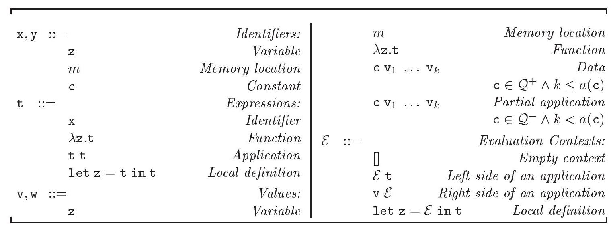

Figure 1-1: Syntax of ML-the-calculus

图1-1：ML-计算-calculus的语法

## ML-the-calculus

The syntax of ML-the-calculus is defined in Figure 1-1. It is made up of several syntactic categories.

ML-λ-演算的语法定义在图1-1中。它由几个语法类别组成。

Identifiers group several kinds of names that may be referenced in a program: variables, memory locations, and constants. We let $\mathrm{x}$ and $\mathrm{y}$ range over identifiers. Variables-sometimes called program variables to avoid ambiguity — are names that may be bound to values using $\lambda$ or let binding forms; in other words, they are names for function parameters or local definitions. We let $z$ and $f$ range over program variables. We sometimes write _ for a program variable that does not occur free within its scope: for instance, $\lambda\_.t$ stands for $\lambda z.t$, provided $\mathrm{z}$ is fresh for $t$. Memory locations are names that represent memory addresses. By convention, memory locations never appear in source programs, that is, programs that are submitted to a compiler. They only appear during execution, when new memory blocks are allocated. Constants are fixed names for primitive values and operations, such as integer literals and integer arithmetic operations. Constants are elements of a finite or infinite set $\mathcal{Q}$. They are never subject to $\alpha$-conversion. Program variables, memory locations, and constants belong to distinct syntactic classes and may never be confused.

标识符将可能在程序中引用的几种名称分组：变量、内存位置和常量。我们让 $\mathrm{x}$ 和 $\mathrm{y}$ 表示标识符。变量（有时为了避免歧义被称为程序变量）是可以使用 $\lambda$ 或 let 绑定形式绑定到值的名称；换句话说，它们是函数参数或局部定义的名称。我们让 $z$ 和 $f$ 表示程序变量。有时我们用 _ 表示在其作用域内没有自由出现的程序变量：例如，$\lambda\_.t$ 表示 $\lambda z.t$，前提是 $\mathrm{z}$ 对 $t$ 来说是新鲜的。内存位置是表示内存地址的名称。按照约定，内存位置永远不会出现在源程序中，即提交给编译器的程序。它们只在执行期间出现，当分配新的内存块时。常量是为原始值和操作固定的名称，例如整数字面量和整数算术操作。常量是有限或无限集合 $\mathcal{Q}$ 的元素。它们从不接受 $\alpha$-转换。程序变量、内存位置和常量属于不同的语法类别，绝不能混淆。

The set of constants $\mathcal{Q}$ is kept abstract, so most of our development is independent of its concrete definition. We assume that every constant $\mathrm{c}$ has a nonnegative integer arity $a(\mathrm{c})$. We further assume that $\mathcal{Q}$ is partitioned into subsets of constructors $\mathcal{Q}^{+}$and destructors $\mathcal{Q}^{-}$. Constructors and destructors differ in that the former are used to form values, while the latter are used to
operate on values.

常量集合 $\mathcal{Q}$ 保持抽象，因此我们的大部分开发与它的具体定义独立。我们假设每个常量 $\mathrm{c}$ 都有一个非负整数序数 $a(\mathrm{c})$。我们进一步假设 $\mathcal{Q}$ 被划分为构造器子集 $\mathcal{Q}^{+}$ 和析构器子集 $\mathcal{Q}^{-}$。构造器和析构器的区别在于，前者用于形成值，而后者用于对值进行操作。

1.2.1 ExAmple [IntEgERs]: For every integer $n$, one may introduce a nullary constructor $\hat{n}$. In addition, one may introduce a binary destructor $\hat{+}$, whose applications are written infix, so $t_{1} \hat{+} t_{2}$ stands for the double application $\hat{+} t_{1} t_{2}$ of the destructor $\hat{+}$ to the expressions $t_{1}$ and $t_{2}$.

1.2.1 示例 [整数]：对于每一个整数 $n$，可以引入一个零元构造器 $\hat{n}$。此外，可以引入一个二元析构器 $\hat{+}$，其应用以中缀形式书写，因此 $t_{1} \hat{+} t_{2}$ 表示析构器 $\hat{+}$ 对表达式 $t_{1}$ 和 $t_{2}$ 的双重应用 $\hat{+} t_{1} t_{2}$。

Expressions - also known as program terms or programs - are the main syntactic category. Indeed, unlike procedural languages such as $\mathrm{C}$ and Java, functional languages, including ML-the-programming-language, suppress the distinction between expressions and statements. Expressions include identifiers, $\lambda$-abstractions, applications, and local definitions. The $\lambda$-abstraction $\lambda$ z.t represents the function of one parameter named $z$ whose result is the expression $t$, or, in other words, the function that maps $z$ to $t$. Note that the variable $z$ is bound within the term $t$, so (for instance) $\lambda z_{1} \cdot z_{1}$ and $\lambda z_{2} \cdot z_{2}$ are the same object. The application $t_{1} t_{2}$ represents the result of calling the function $t_{1}$ with actual parameter $t_{2}$, or, in other words, the result of applying $t_{1}$ to $t_{2}$. Application is left-associative, that is, $t_{1} t_{2} t_{3}$ stands for $\left(t_{1} t_{2}\right) t_{3}$. The construct let $z=t_{1}$ in $t_{2}$ represents the result of evaluating $t_{2}$ after binding the variable $z$ to $t_{1}$. Note that the variable $z$ is bound within $t_{2}$, but not within $t_{1}$, so for instance let $z_{1}=z_{1}$ in $z_{1}$ and let $z_{2}=z_{1}$ in $z_{2}$ are the same object. The construct let $z=t_{1}$ in $t_{2}$ has the same meaning as $\left(\lambda z . t_{2}\right) t_{1}$, but is dealt with in a more flexible way by ML-the-type-system. To sum up, the syntax of ML-the-calculus is that of the pure $\lambda$-calculus, extended with memory locations, constants, and the let construct.

表达式——也称为程序项或程序——是主要的语法类别。实际上，与诸如C和Java这样的过程式语言不同，包括ML编程语言在内的函数式语言取消了表达式和语句之间的区别。表达式包括标识符、λ-抽象、应用和局部定义。λ-抽象 λz.t 表示一个名为z的单个参数的函数，其结果是表达式t，换句话说，就是将z映射到t的函数。注意变量z在项t中是绑定的，因此（例如）λz1.z1和λz2.z2是相同的对象。应用 t1 t2 表示调用函数t1的实际参数t2的结果，或者换句话说，是应用t1到t2的结果。应用是左结合的，即t1 t2 t3代表(t1 t2) t3。构造 let z=t1 in t2 表示在将变量z绑定到t1之后评估t2的结果。注意变量z在t2中是绑定的，但在t1中不是，因此例如let z1=z1 in z1和let z2=z1 in z2是相同的对象。构造 let z=t1 in t2 与 (λz.t2) t1 含义相同，但ML类型系统以更灵活的方式处理它。总之，ML-演算的语法是纯λ-演算的语法，扩展了内存位置、常量和let构造。

Values form a subset of expressions. They are expressions whose evaluation is completed. Values include identifiers, $\lambda$-abstractions, and applications of constants, of the form $\mathrm{c} \mathrm{v}_{1} \ldots \mathrm{v}_{k}$, where $k$ does not exceed $\mathrm{c}$ 's arity if $\mathrm{c}$ is a constructor, and $k$ is smaller than c's arity if $\mathrm{c}$ is a destructor. In what follows, we are often interested in closed values, that is, values that do not contain any free program variables. We use the meta-variables $v$ and $w$ for values.

值是表达式的子集。它们是计算已经完成的表达式。值包括标识符、λ-抽象以及常量的应用，形式为c v1 ... vk，其中k不超过c的元数（如果c是构造器），如果c是析构器，k小于c的元数。在接下来的讨论中，我们通常对闭值感兴趣，即不包含任何自由程序变量的值。我们使用元变量v和w表示值。

1.2.2 Example: The integer literals $\ldots, \widehat{-1}, \hat{0}, \hat{1}, \ldots$ are nullary constructors, so they are values. Integer addition $\hat{+}$ is a binary destructor, so it is a value, and so is every partial application $\hat{+} \mathrm{v}$. Thus, both $\hat{+} \hat{1}$ and $\hat{+} \hat{+}$ are values. An application of $\hat{+}$ to two values, such as $\hat{2} \hat{+} \hat{2}$, is not a value.

1.2.2 示例：整数字面量 $\ldots, \widehat{-1}, \hat{0}, \hat{1}, \ldots$ 是零元构造器，因此它们是值。整数加法 $\hat{+}$ 是二元析构器，所以它是一个值，每个部分应用 $\hat{+} \mathrm{v}$ 也是值。因此，$\hat{+} \hat{1}$ 和 $\hat{+} \hat{+}$ 都是值。将 $\hat{+}$ 应用于两个值，如 $\hat{2} \hat{+} \hat{2}$，不是值。

1.2.3 EXAmple [Pairs]: Let $(\cdot, \cdot)$ be a binary constructor. If $t_{1}$ are $t_{2}$ are expressions, then the double application $(\cdot, \cdot) t_{1} t_{2}$ may be called the pair of $t_{1}$ and $t_{2}$, and may be written $\left(t_{1}, t_{2}\right)$. By the definition above, $\left(t_{1}, t_{2}\right)$ is a value if and only if $t_{1}$ and $t_{2}$ are both values.

1.2.3 示例 [配对]：让 $(\cdot, \cdot)$ 成为二进制构造器。如果 $t_{1}$ 和 $t_{2}$ 都是表达式，那么双重应用 $(\cdot, \cdot) t_{1} t_{2}$ 可以称为 $t_{1}$ 和 $t_{2}$ 的配对，并且可以写成 $\left(t_{1}, t_{2}\right)$。根据上述定义，$\left(t_{1}, t_{2}\right)$ 是一个值当且仅当 $t_{1}$ 和 $t_{2}$ 都是值。

Stores are finite mappings from memory locations to closed values. A store $\mu$ represents what is usually called a heap, that is, a collection of data structures,
each of which is allocated at a particular address in memory and may contain pointers to other elements of the heap. ML-the-programming-language allows overwriting the contents of an existing memory block-an operation sometimes referred to as a side effect. In the operational semantics, this effect is achieved by mapping an existing memory location to a new value. We write $\varnothing$ for the empty store. We write $\mu[m \mapsto \mathrm{v}]$ for the store that maps $m$ to $\mathrm{v}$ and otherwise coincides with $\mu$. When $\mu$ and $\mu^{\prime}$ have disjoint domains, we write $\mu \mu^{\prime}$ for their union. We write $\operatorname{dom}(\mu)$ for the domain of $\mu$ and range $(\mu)$ for the set of memory locations that appear in its codomain.

存储是内存位置到封闭值的有限映射。一个存储 $\mu$ 通常代表被称为堆的东西，即一组数据结构，每个数据结构在内存中都有一个特定的地址，并且可能包含指向堆中其他元素的指针。编程语言 ML 允许覆盖现有内存块的内容，这种操作有时被称为副作用。在操作语义中，这种效果通过将现有内存位置映射到新值来实现。我们用 $\varnothing$ 表示空存储。我们用 $\mu[m \mapsto \mathrm{v}]$ 表示将 $m$ 映射到 $\mathrm{v}$ 并在其他方面与 $\mu$ 一致的存储。当 $\mu$ 和 $\mu^{\prime}$ 具有不相交的定义域时，我们用 $\mu \mu^{\prime}$ 表示它们的并集。我们用 $\operatorname{dom}(\mu)$ 表示 $\mu$ 的定义域，用范围 $(\mu)$ 表示出现在其值域中的内存位置集合。

The operational semantics of a purely functional language, such as the pure $\lambda$-calculus, may be defined as a rewriting system on expressions. Because MLthe-calculus has side effects, however, we define its operational semantics as a rewriting system on configurations. A configuration $t / \mu$ is a pair of an expression $t$ and a store $\mu$. The memory locations in the domain of $\mu$ are considered bound within $t / \mu$, so (for instance) $m_{1} /\left(m_{1} \mapsto \hat{0}\right)$ and $m_{2} /\left(m_{2} \mapsto \hat{0}\right)$ are the same object. In what follows, we are often interested in closed configurations, that is, configurations $t / \mu$ such that $t$ has no free program variables and every memory location that appears within $t$ or within the range of $\mu$ is in the domain of $\mu$. If $t$ is a source program, its evaluation begins within an empty store-that is, with the configuration $t / \varnothing$. Because, by convention, source programs do not contain memory locations, this is a closed configuration. Furthermore, we shall see that all reducts of a closed configuration are closed as well. Please note that, instead of separating expressions and stores, it is possible to make store fragments part of the syntax of expressions; this idea, proposed in (Crank and Felleisen, 1991), is reminiscent of the encoding of reference cells in process calculi (Turner, 1995; Fournet and Gonthier, 1996).

纯函数式语言的运算语义，比如纯λ-演算，可以作为表达式上的重写系统来定义。但是由于ML演算具有副作用，因此我们将其运算语义定义为配置上的重写系统。一个配置$t / \mu$是由一个表达式$t$和一个存储$\mu$组成的对。在$\mu$域中的内存位置被认为在$t / \mu$中是已绑定的，因此（例如）$m_{1} /\left(m_{1} \mapsto \hat{0}\right)$和$m_{2} /\left(m_{2} \mapsto \hat{0}\right)$是相同的对象。在下面的讨论中，我们通常对封闭配置感兴趣，即$t / \mu$这样的配置，使得$t$没有自由程序变量，并且$t$中或$\mu$范围内出现的每个内存位置都在$\mu$的域中。如果$t$是一个源程序，它的求值开始于一个空存储中——即，从配置$t / \varnothing$开始。按照惯例，源程序不包含内存位置，这是一个封闭配置。此外，我们将会看到，一个封闭配置的所有简化形式也都是封闭的。请注意，分离表达式和存储不是唯一的方法，也可以将存储片段作为表达式语法的一部分；这个想法，由（Crank和Felleisen, 1991）提出，类似于在进程演算中对引用单元的编码（Turner, 1995; Fournet和Gonthier, 1996）。

A context is an expression where a single subexpression has been replaced with a hole, written [. Evaluation contexts form a strict subset of contexts. In an evaluation context, the hole is meant to highlight a point in the program where it is valid to apply a reduction rule. Thus, the definition of evaluation contexts determines a reduction strategy: it tells where and in what order reduction steps may occur. For instance, the fact that $\lambda z$. $]$ is not an evaluation context means that the body of a function is never evaluated-that is, not until the function is applied, see R-BETA below. The fact that $t \mathcal{E}$ is an evaluation context only if $t$ is a value means that, to evaluate an application $t_{1} t_{2}$, one should fully evaluate $t_{1}$ before attempting to evaluate $t_{2}$. More generally, in the case of a multiple application, it means that arguments should be evaluated from left to right. Of course, other choices could be made: for instance, defining $\mathcal{E}::=\ldots|\mathrm{t} \mathcal{E}| \mathcal{E} \mathrm{v} \mid \ldots$ would enforce a right-to-left evaluation order, while defining $\mathcal{E}::=\ldots \mid$ t $\mathcal{E}|\mathcal{E} \mathrm{t}| \ldots$ would leave the evaluation order unspecified, effectively allowing reduction to alternate between

上下文是一个表达式，其中单个子表达式被替换成了一个洞，用[.]表示。评估上下文是上下文的一个严格子集。在评估上下文中，洞用来突出程序中可以应用简化规则的有效点。因此，评估上下文的定义确定了一个简化策略：它指出了简化步骤可能发生的位置和顺序。例如，$\lambda z$. $]$ 不是一个评估上下文的事实意味着函数体永远不会被评估——也就是说，除非函数被应用，见下面的R-BETA。事实上的 $t \mathcal{E}$ 只有当 $t$ 是一个值时才是一个评估上下文，这意味着，在评估应用 $t_{1} t_{2}$ 时，应该完全评估 $t_{1}$ 然后再尝试评估 $t_{2}$。更一般地说，在多重应用的情况下，这意味着应该从左到右评估参数。当然，也可以选择其他方案：例如，定义 $\mathcal{E}::=\ldots|\mathrm{t} \mathcal{E}| \mathcal{E} \mathrm{v} \mid \ldots$ 将强制从右到左的评估顺序，而定义 $\mathcal{E}::=\ldots \mid$ t $\mathcal{E}|\mathcal{E} \mathrm{t}| \ldots$ 会使得评估顺序未指定，实际上允许简化在两者之间交替进行。

| let $z=v$ in $t \longrightarrow[z \mapsto v] t$ | (R-BETA) <br> (R-LET) | $\mathrm{t} / \mu \longrightarrow \mathrm{t}^{\prime} / \mu^{\prime}$ <br> $\operatorname{dom}\left(\mu^{\prime \prime}\right) \# \operatorname{dom}\left(\mu^{\prime}\right)$ <br> $\frac{\operatorname{range}\left(\mu^{\prime \prime}\right) \# \operatorname{dom}\left(\mu^{\prime} \backslash \mu\right)}{\mathrm{t} / \mu \mu^{\prime \prime} \longrightarrow \mathrm{t}^{\prime} / \mu^{\prime} \mu^{\prime \prime}}$ | (R-ExtEnd) |
| :---: | :---: | :---: | :---: |
| $\frac{\mathrm{t} / \mu \xrightarrow{\delta} \mathrm{t}^{\prime} / \mu^{\prime}}{\mathrm{t} / \mu \longrightarrow \mathrm{t}^{\prime} / \mu^{\prime}}$ | (R-Delta) | $\frac{\mathrm{t} / \mu \longrightarrow \mathrm{t}^{\prime} / \mu^{\prime}}{\mathcal{E}[\mathrm{t}] / \mu \longrightarrow \mathcal{E}\left[\mathrm{t}^{\prime}\right] / \mu^{\prime}}$ | (R-CONTEXT) |

Figure 1-2: Semantics of ML-the-calculus

图1-2：ML-λ-演算的语义

both subexpressions, and making evaluation nondeterministic. The fact that let $\mathrm{z}=\mathrm{v}$ in $\mathcal{E}$ is not an evaluation context means that the body of a local definition is never evaluated - that is, not until the definition itself is reduced, see R-LET below. We write $\mathcal{E}[\mathrm{t}]$ for the expression obtained by replacing the hole in $\mathcal{E}$ with the expression $t$.

两个子表达式，并使求值成为非确定性的。事实上，让 $\mathrm{z}=\mathrm{v}$ 在 $\mathcal{E}$ 中不是一个求值上下文，意味着局部定义的主体永远不会被求值 - 也就是说，直到定义本身被简化，见下面的 R-LET。我们用 $\mathcal{E}[\mathrm{t}]$ 表示用表达式 $t$ 替换 $\mathcal{E}$ 中的空位得到的表达式。

Figure 1-2 defines first a relation $\longrightarrow$ between configurations, then a relation $\longrightarrow$ between closed configurations. If $\mathrm{t} / \mu \longrightarrow \mathrm{t}^{\prime} / \mu^{\prime}$ or $\mathrm{t} / \mu \longrightarrow \mathrm{t}^{\prime} / \mu^{\prime}$ holds, then we say that the configuration $\mathrm{t} / \mu$ reduces to the configuration $\mathrm{t}^{\prime} / \mu^{\prime}$; the ambiguity involved in this definition is benign. If $t / \mu \longrightarrow t^{\prime} / \mu$ holds for every store $\mu$, then we write $\mathrm{t} \longrightarrow \mathrm{t}^{\prime}$ and say that the reduction is pure.

图1-2首先定义了配置之间的关系$\longrightarrow$，然后定义了封闭配置之间的关系。如果$\mathrm{t} / \mu \longrightarrow \mathrm{t}^{\prime} / \mu^{\prime}$或$\mathrm{t} / \mu \longrightarrow \mathrm{t}^{\prime} / \mu^{\prime}$成立，那么我们说配置$\mathrm{t} / \mu$简化为配置$\mathrm{t}^{\prime} / \mu^{\prime}$；这个定义中涉及的歧义是良性的。如果对于每个存储$\mu$，都有$t / \mu \longrightarrow t^{\prime} / \mu$成立，那么我们写作$\mathrm{t} \longrightarrow \mathrm{t}^{\prime}$，并且说这种简化是纯的。

The key reduction rule is $\mathrm{R}$-BETA, which states that a function application $(\lambda z . t) v$ reduces to the function body, namely $t$, where every occurrence of the formal argument $z$ has been replaced with the actual argument $v$. The $\lambda$ construct, which prevented the function body t from being evaluated, disappears, so the new term may (in general) be further reduced. Because ML-the-calculus adopts a call-by-value strategy, rule R-BETA is applicable only if the actual argument is a value v. In other words, a function cannot be invoked until its actual argument has been fully evaluated. Rule R-LET is very similar to $\mathrm{R}$-BETA. Indeed, it specifies that let $\mathrm{z}=\mathrm{v}$ in $\mathrm{t}$ has the same behavior, with respect to reduction, as $(\lambda z . t) v$. We remark that substitution of a value for a program variable throughout a term is expensive, so R-BETA and R-LET are never implemented literally: they are only a simple specification. Actual implementations usually employ runtime environments, which may be understood as a form of explicit substitutions (Abadi, Cardelli, Curien, and Lévy, 1991). Please note that our choice of a call-by-value reduction strategy is fairly arbitrary, and has essentially no impact on the type system; the programming language Haskell (Hudak, Peyton Jones, Wadler, Boutel, Fairbairn, Fasel, Guzman, Hammond, Hughes, Johnsson, Kieburtz,

关键简化规则是 $\mathrm{R}$-BETA，该规则指出函数应用 $(\lambda z . t) v$ 可简化为函数体，即 $t$，其中每个形式参数 $z$ 出现的地方都被实际参数 $v$ 替换。防止函数体 $t$ 被评估的 $\lambda$ 构造消失，因此新的项（通常）可以进一步简化。因为 ML-演算采用了按值调用策略，规则 R-BETA 只有在实际参数是一个值 $v$ 时才适用。换句话说，一个函数在其实际参数完全评估之前不能被调用。规则 R-LET 与 $\mathrm{R}$-BETA 非常相似。实际上，它规定 let $\mathrm{z}=\mathrm{v}$ in $\mathrm{t}$ 在简化方面与 $(\lambda z . t) v$ 具有相同的行为。我们注意到，在整个项中对程序变量进行值替换是昂贵的，因此 R-BETA 和 R-LET 从不按字面意思实现：它们只是一个简单的规范。实际实现通常使用运行时环境，这可以理解为一种显式替换形式（Abadi, Cardelli, Curien, 和 Lévy, 1991）。请注意，我们选择按值简化策略是相当任意的，并且对类型系统实质上没有影响；编程语言 Haskell （Hudak, Peyton Jones, Wadler, Boutel, Fairbairn, Fasel, Guzman, Hammond, Hughes, Johnsson, Kieburtz,）也是如此。

Nikhil, Partain, and Peterson, 1992), whose reduction strategy is known as lazy or call-by-need, also relies on Hindley and Milner's type discipline.

尼希尔、帕特恩和彼得森，1992年），其简化策略被称为懒惰或按需调用，也依赖于亨德利和米尔纳的类型纪律。

Rule R-DELTA describes the semantics of constants. It merely states that a certain relation $\xrightarrow{\delta}$ is a subset of $\longrightarrow$. Of course, since the set of constants is unspecified, the relation $\xrightarrow{\delta}$ must be kept abstract as well. We require that, if $\mathrm{t} / \mu \xrightarrow{\delta} \mathrm{t}^{\prime} / \mu^{\prime}$ holds, then

规则R-DELTA描述了常量的语义。它仅指出某个关系$\xrightarrow{\delta}$是$\longrightarrow$的一个子集。当然，由于常量集合未指定，关系$\xrightarrow{\delta}$也必须保持抽象。我们要求，如果$\mathrm{t} / \mu \xrightarrow{\delta} \mathrm{t}^{\prime} / \mu^{\prime}$成立，那么


(i) $\mathrm{t}$ is of the form $\mathrm{c} \mathrm{v}_{1} \ldots \mathrm{v}_{n}$, where $\mathrm{c}$ is a destructor of arity $n$; and

（i）t具有形式cv1…vn，其中c是一个n元析构函数；以及

(ii) $\operatorname{dom}(\mu)$ is a subset of $\operatorname{dom}\left(\mu^{\prime}\right)$.

（ii） μ的定义域是μ'定义域的子集。

Condition (i) ensures that $\delta$-reduction concerns full applications of destructors only, and that these are evaluated in accordance with the call-by-value strategy. Condition (ii) ensures that $\delta$-reduction may allocate new memory locations, but not deallocate existing locations. In particular, a "garbage collection" operator, which destroys unreachable memory cells, cannot be made available as a constant. Doing so would not make much sense anyway in the presence of R-EXTEND, which states that any valid reduction is also valid in a larger store. Condition (ii) allows proving that, if $t / \mu$ reduces to $t^{\prime} / \mu^{\prime}$, then $\operatorname{dom}(\mu)$ is a subset of $\operatorname{dom}\left(\mu^{\prime}\right)$; this is left as an exercise to the reader.

条件（i）确保 $\delta$-约简只涉及完全的应用析构函数，并且这些函数是根据按值调用策略进行求值的。条件（ii）确保 $\delta$-约简可以分配新的内存位置，但不能释放现有的位置。特别是，不能将“垃圾回收”运算符作为常量提供，因为它销毁不可达的内存单元。无论如何，在存在R-EXTEND的情况下这样做没有太大意义，R-EXTEND指出任何有效的约简在更大的存储中也是有效的。条件（ii）允许证明，如果 $t / \mu$ 约简到 $t^{\prime} / \mu^{\prime}$，那么 $\operatorname{dom}(\mu)$ 是 $\operatorname{dom}\left(\mu^{\prime}\right)$ 的一个子集；这留给读者作为一个练习。

1.2.4 Example [Integers, Continued]: The operational semantics of integer addition may be defined as follows:

1.2.4 示例 [整数，继续]: 整数加法的操作语义可以定义如下：

$$
\begin{equation*}
\hat{k}_{1} \hat{+} \hat{k}_{2} \xrightarrow{\delta} \widehat{k_{1}+k_{2}} \tag{R-ADD}
\end{equation*}
$$

The left-hand term is the double application $\hat{+} \hat{k}_{1} \hat{k}_{2}$, while the right-hand term is the integer literal $\hat{k}$, where $k$ is the sum of $k_{1}$ and $k_{2}$. The distinction between object level and meta level (that is, between $\hat{k}$ and $k$ ) is needed here to avoid ambiguity.

左边的项是双重应用 $\hat{+} \hat{k}_{1} \hat{k}_{2}$，而右边的项是整数字面量 $\hat{k}$，其中 $k$ 是 $k_{1}$ 和 $k_{2}$ 的和。在这里需要区分对象级别和元级别（即 $\hat{k}$ 和 $k$ 之间的区别）以避免歧义。

1.2.5 Example [Pairs, continued]: In addition to the pair constructor defined in Example 1.2.3, we may introduce two destructors $\pi_{1}$ and $\pi_{2}$ of arity 1 . We may define their operational semantics as follows, for $i \in\{1,2\}$ :

1.2.5 示例 [对，继续]：除了在示例1.2.3中定义的对构造函数之外，我们可以引入两个一元析构函数 $\pi_{1}$ 和 $\pi_{2}$。我们可以按以下方式定义它们的操作语义，对于 $i \in\{1,2\}$ ：

$$
\begin{equation*}
\pi_{i}\left(\mathrm{v}_{1}, \mathrm{v}_{2}\right) \xrightarrow{\delta} \mathrm{v}_{i} \tag{R-PROJ}
\end{equation*}
$$

Thus, our treatment of constants is general enough to account for pair construction and destruction; we need not build these features explicitly into the language.

因此，我们对常量的处理足够通用，能够解释成对构造和销毁；我们无需将这些特性明确地构建到语言中。

1.2.6 Exercise [Booleans, Recommended, $\star \star$ ]: Let true and false be nullary constructors. Let if be a ternary destructor. Extend the operational semantics with

1.2.6 练习 [布尔值，推荐，$\star \star$ ]：让true和false成为零元构造器。让if成为一个三元分解器。扩展操作语义。

$$
\begin{equation*}
\text { if true } \mathrm{v}_{1} \mathrm{v}_{2} \xrightarrow{\delta} \mathrm{v}_{1} \tag{R-TRUE}
\end{equation*}
$$

$$
\begin{equation*}
\text { if false } \mathrm{v}_{1} \mathrm{v}_{2} \xrightarrow{\delta} \mathrm{v}_{2} \tag{R-FALSE}
\end{equation*}
$$

Let us use the syntactic sugar if $t_{0}$ then $t_{1}$ else $t_{2}$ for the triple application of if $t_{0} t_{1} t_{2}$. Explain why these definitions do not quite provide the expected behavior. Without modifying the semantics of if, suggest a new definition of the syntactic sugar if $t_{0}$ then $t_{1}$ else $t_{2}$ that corrects the problem.

让我们使用语法糖 if $t_{0}$ then $t_{1}$ else $t_{2}$ 来表示 if $t_{0} t_{1} t_{2}$ 的三次应用。解释一下这些定义为何没有提供预期行为。在不修改 if 的语义的情况下，建议一个新的语法糖 if $t_{0}$ then $t_{1}$ else $t_{2}$ 的定义，以纠正问题。

1.2.7 Example [Sums]: Booleans may in fact be viewed as a special case of the more general concept of sum. Let $i n j_{1}$ and $i n j_{2}$ be unary constructors, called respectively left and right injections. Let case be a ternary destructor, whose semantics is defined as follows, for $i \in\{1,2\}$ :

1.2.7 示例[和类型]：布尔值实际上可以看作是更一般和类型概念的一个特例。设 $inj_{1}$ 和 $inj_{2}$ 是一元构造器，分别称为左注入和右注入。设 case 是一个三元分解器，其语义定义如下，对于 $i \in \{1,2\}$ ：

$$
\begin{equation*}
\operatorname{case}\left(\mathrm{inj}_{i} \mathrm{v}\right) \mathrm{v}_{1} \mathrm{v}_{2} \xrightarrow{\delta} \mathrm{v}_{i} \mathrm{v} \tag{R-CASE}
\end{equation*}
$$

Here, the value $i n j_{i} \mathrm{v}$ is being scrutinized, while the values $\mathrm{v}_{1}$ and $\mathrm{v}_{2}$, which are typically functions, represent the two arms of a standard case construct. The rule selects an appropriate arm (here, $\mathrm{v}_{i}$ ) based on whether the value under scrutiny was formed using a left or right injection. The arm $\mathrm{v}_{i}$ is executed and given access to the data carried by the injection (here, v).

在这里，正在仔细审查值 $i n j_{i} \mathrm{v}$，而通常作为函数的值 $\mathrm{v}_{1}$ 和 $\mathrm{v}_{2}$ 代表标准情况构造的两个分支。规则根据审查的值是否是通过左注入或右注入形成的来选择适当的分支（此处为 $\mathrm{v}_{i}$）。分支 $\mathrm{v}_{i}$ 被执行，并被赋予访问注入携带的数据（此处为 v）的权限。

1.2.8 EXERcISE $[\boldsymbol{\star}, \nrightarrow]$ : Explain how to encode true, $f$ al se and the if construct in terms of sums. Check that the behavior of R-TRUE and R-FALSE is properly emulated.

1.2.8 练习 $[\boldsymbol{\star}, \nrightarrow]$ ：解释如何用求和的方式编码真、假和if构造。检查R-TRUE和R-FALSE的行为是否被适当地模拟。

1.2.9 ExAmple [REFEREnces]: Let ref and ! be unary destructors. Let $:=$ be a binary destructor. We write $t_{1}:=t_{2}$ for the double application $:=t_{1} t_{2}$. Define the operational semantics of these three destructors as follows:

1.2.9 示例 [参考文献]：设 ref 和 ! 为一元析构器。设 $:=$ 为二元析构器。我们写 $t_{1}:=t_{2}$ 表示双重应用 $:=t_{1} t_{2}$。以下定义这三个析构器的操作语义：

$$
\begin{array}{rr}
\text { ref } \mathrm{v} / \varnothing \xrightarrow{\delta} m /(m \mapsto \mathrm{v}) \text { if } m \text { is fresh for } \mathrm{v} & (\mathrm{R}-\mathrm{REF}) \\
! m /(m \mapsto \mathrm{v}) \xrightarrow{\delta} \mathrm{v} /(m \mapsto \mathrm{v}) & \text { (R-DEREF) } \\
m:=\mathrm{v} /\left(m \mapsto \mathrm{v}_{0}\right) \xrightarrow{\delta} \mathrm{v} /(m \mapsto \mathrm{v}) & \text { (R-AssiGN) } \tag{R-AssiGN}
\end{array}
$$

According to R-REF, evaluating ref $v$ allocates a fresh memory location $m$ and binds $\mathrm{v}$ to it. Because configurations are considered equal up to $\alpha-$ conversion of memory locations, the choice of the name $m$ is irrelevant, provided it is chosen fresh for $\mathrm{v}$, so as to prevent inadvertent capture of the memory locations that appear free within v. By R-DEREF, evaluating $! m$ returns the value bound to the memory location $m$ within the current store. By $\mathrm{R}$-Assign, evaluating $m:=\mathrm{v}$ discards the value $\mathrm{v}_{0}$ currently bound to $m$ and produces a new store where $m$ is bound to v. Here, the value returned by the assignment $m:=\mathrm{v}$ is $\mathrm{v}$ itself; in ML-the-programming-language, it is usually a nullary constructor (), pronounced unit.

根据R-REF规则，评估引用$v$时会分配一个全新的内存位置$m$并将$v$绑定到它上面。由于配置被认为是内存位置通过$\alpha$-转换相等，只要为$v$选择了新的名字$m$，这个名字的选择就是无关紧要的，这样可以防止意外捕获$v$中出现的自由内存位置。通过R-DEREF规则，评估$!m$将返回当前存储中绑定到内存位置$m$的值。通过$\mathrm{R}$-Assign规则，评估$m:=\mathrm{v}$会丢弃当前绑定到$m$的值$v_0$并生成一个新存储，其中$m$绑定到$v$。在这里，赋值$m:=\mathrm{v}$返回的值是$\mathrm{v}$本身；在ML编程语言中，它通常是一个无参构造器()，发音为unit。

1.2.10 EXAmple [REcursion]: Let fix be a binary destructor, whose operational semantics is:

1.2.10 示例[递归]：设fix是一个二元析构器，其操作语义为：

$$
\begin{equation*}
\mathrm{fixv}_{1} \mathrm{v}_{2} \xrightarrow{\delta} \mathrm{v}_{1}\left(\mathrm{fix}_{1}\right) \mathrm{v}_{2} \tag{R-FIX}
\end{equation*}
$$

fix is a fixpoint combinator: it effectively allows recursive definitions of functions. Indeed, the construct letrec $f=\lambda$ z. $_{1}$ in $t_{2}$ provided by MLthe-programming-language may be viewed as syntactic sugar for let $f=$ fix $\left(\lambda f . \lambda z . t_{1}\right)$ in $t_{2}$.

fix是一个不动点组合子：它有效地允许函数的递归定义。实际上，ML编程语言提供的letrec $f=\lambda$ z. $_{1}$ in $t_{2}$构造可以被看作是语法糖，等价于let $f=$ fix $\left(\lambda f . \lambda z . t_{1}\right)$ in $t_{2}$。

Rule R-CONTEXT completes the definition of the operational semantics by defining $\longrightarrow$, a relation between closed configurations, in terms of $\longrightarrow$. The rule states that reduction may take place not only at the term's root, but also deep inside it, provided the path from the root to the point where reduction occurs forms an evaluation context. This is how evaluation contexts determine an evaluation strategy. As a purely technical point, because $\longrightarrow$ relates closed configurations only, we do not need to require that the memory locations in $\operatorname{dom}\left(\mu^{\prime} \backslash \mu\right)$ be fresh for $\mathcal{E}$ : indeed, every memory location that appears within $\mathcal{E}$ must be a member of $\operatorname{dom}(\mu)$.

规则R-CONTEXT通过定义闭配置之间的$\longrightarrow$关系来完成操作语义的定义，该关系是关于$\longrightarrow$的。该规则指出，规约不仅可以在项的根部发生，还可以在其深处发生，前提是从根部到规约发生点的路径形成了一个求值上下文。这就是求值上下文确定求值策略的方式。作为一个纯粹的技术点，由于$\longrightarrow$只与闭配置有关，我们不需要要求$\operatorname{dom}\left(\mu^{\prime} \backslash \mu\right)$中的内存位置对于$\mathcal{E}$来说是新的：实际上，在$\mathcal{E}$中出现的每个内存位置必须是$\operatorname{dom}(\mu)$的成员。

1.2.11 Exercise $[\star \star \star$, Recommended, $\rightarrow$ a $]$ : Assuming the availability of Booleans and conditionals, integer literals, subtraction, multiplication, integer comparison, and a fixpoint combinator, most of which were defined in previous examples, define a function that computes the factorial of its integer argument, and apply it to $\hat{3}$. Determine, step by step, how this expression reduces to a value.

1.2.11 练习 $[\star \star \star$, 推荐, $\rightarrow$ a $]$ ：假设有布尔值和条件语句、整数字面量、减法、乘法、整数比较以及一个固定点组合子，其中大部分在之前的示例中定义过，定义一个计算其整数参数阶乘的函数，并将其应用于 $\hat{3}$。逐步确定这个表达式如何简化为一个值。

It is straightforward to check that, if $t / \mu$ reduces to $t^{\prime} / \mu^{\prime}$, then $t$ is not a value. In other words, values are irreducible: they represent a completed computation. The proof is left as an exercise to the reader. The converse, however, does not hold: if $t / \mu$ is irreducible with respect to $\longrightarrow$, then $t$ is not necessarily a value. In that case, the configuration $t / \mu$ is said to be stuck. It represents a runtime error, that is, a situation that does not allow computation to proceed, yet is not considered a valid outcome. A closed source program $\mathrm{t}$ is said to go wrong if and only if the configuration $\mathrm{t} / \varnothing$ reduces to a stuck configuration.

如果 $t / \mu$ 简化成 $t^{\prime} / \mu^{\prime}$，那么很容易检查出 $t$ 不是一个值。换句话说，值是不可简化的：它们代表一个完成的计算。证明留给读者作为一个练习。然而，反命题并不成立：如果 $t / \mu$ 关于 $\longrightarrow$ 是不可简化的，那么 $t$ 不一定是一个值。在这种情况下，配置 $t / \mu$ 称为卡住。它表示一个运行时错误，即一个不允许计算继续进行的情况，但并不被视为有效的结果。一个闭源程序 $\mathrm{t}$ 如果且仅当配置 $\mathrm{t} / \varnothing$ 简化成一个卡住的配置，才被认为是出错的。

1.2.12 ExAmple: Runtime errors typically arise when destructors are applied to arguments of an unexpected nature. For instance, the expressions $+1 \mathrm{~m}$ and $\pi_{1} \quad 2$ and $! 3$ are stuck, regardless of the current store. The program let $\mathbf{z}=$ $\hat{+} \hat{+}$ in $z$ is not stuck, because $\hat{+} \hat{+}$ is a value. However, its reduct through $\mathrm{R}$-LET is $\hat{+} \hat{+}$, which is stuck, so this program goes wrong. The primary purpose of type systems is to prevent such situations from arising.

1.2.12 示例：运行时错误通常发生在对预期之外的性质的参数应用析构器时。例如，表达式 $+1 \mathrm{~m}$ 和 $\pi_{1} \quad 2$ 以及 $! 3$ 无论当前存储状态如何都是卡住的。程序 let $\mathbf{z}=$ $\hat{+} \hat{+}$ in $z$ 并没有卡住，因为 $\hat{+} \hat{+}$ 是一个值。然而，通过 $\mathrm{R}$-LET 的简化是 $\hat{+} \hat{+}$，这是卡住的，所以这个程序出错。类型系统的主要目的是防止此类情况发生。

1.2.13 Example: The configuration $! m / \mu$ is stuck if $m$ is not in the domain of $\mu$. In that case, however, $! m / \mu$ is not closed. Because we consider $\longrightarrow$ as a relation between closed configurations only, this situation cannot arise. In other
words, the semantics of ML-the-calculus never allows the creation of dangling pointers. As a result, no particular precautions need be taken to guard against them. Several strongly typed programming languages do nevertheless allow dangling pointers in a controlled fashion (Tofte and Talpin, 1997; Crary, Walker, and Morrisett, 1999b; DeLine and Fähndrich, 2001; Grossman, Morrisett, Jim, Hicks, Wang, and Cheney, 2002a).

1.2.13 示例：如果$m$不在$\mu$的域中，那么配置$! m / \mu$就会卡住。然而在这种情况下，$! m / \mu$并不是闭合的。因为我们只将$\longrightarrow$视为闭合配置之间的关系，这种情况不可能出现。换句话说，ML-演算的语义决不允许悬空指针的产生。因此，无需采取特别的预防措施来防范它们。然而，一些强类型编程语言还是在受控的方式下允许悬空指针的存在（Tofte和Talpin，1997年；Crary，Walker和Morrisett，1999b年；DeLine和Fähndrich，2001年；Grossman，Morrisett，Jim，Hicks，Wang和Cheney，2002a年）。

## Damas and Milner's type system

ML-the-type-system was originally defined by Milner (1978). Here, we reproduce the definition given a few years later by Damas and Milner (1982), which is written in a more standard style: typing judgements are defined inductively by a collection of typing rules. We refer to this type system as DM.

ML-类型系统最初由Milner（1978年）定义。在这里，我们重现了Damas和Milner（1982年）给出的定义，这个定义采用了更标准的风格：类型判断是通过一组类型规则归纳定义的。我们将这个类型系统称为DM。

To begin, we must define types. In DM, like in the simply-typed $\lambda$-calculus, types are first-order terms built out of type constructors and type variables. We begin with several considerations concerning the specification of type constructors.

首先，我们必须定义类型。在DM中，就像在简单类型的λ-演算中，类型是由类型构造器和类型变量构成的一阶项。我们从关于类型构造器的规范化的几个考虑开始。

First, we do not wish to fix the set of type constructors. Certainly, since MLthe-calculus has functions, we need to be able to form an arrow type $\mathrm{T} \rightarrow \mathrm{T}^{\prime}$ out of arbitrary types $\mathrm{T}$ and $\mathrm{T}^{\prime}$; that is, we need a binary type constructor $\rightarrow$. However, because ML-the-calculus includes an unspecified set of constants, we cannot say much else in general. If constants include integer literals and integer operations, as in Example 1.2.1, then a nullary type constructor int is needed; if they include pair construction and destruction, as in Examples 1.2.3 and 1.2.5, then a binary type constructor $\times$ is needed; and so on.

首先，我们并不希望固定类型构造器的集合。当然，由于ML演算中有函数，我们需要能够用任意类型T和T'形成一个箭头类型T → T'；也就是说，我们需要一个二元类型构造器→。然而，由于ML演算包括一个未指明的常量集合，我们通常无法说得更具体。如果常量包括整数字面量和整数操作，如示例1.2.1中那样，那么需要一个零元类型构造器int；如果它们包括对构造和销毁，如示例1.2.3和1.2.5中那样，那么需要一个二元类型构造器×；依此类推。

Second, it is common to refer to the parameters of a type constructor by position, that is, by numeric index. For instance, when one writes $\mathrm{T} \rightarrow \mathrm{T}^{\prime}$, it is understood that the type constructor $\rightarrow$ has arity 2, that $\mathrm{T}$ is its first parameter, known as its domain, and that $\mathrm{T}^{\prime}$ is its second parameter, known as its codomain. Here, however, we refer to parameters by names, known as directions. For instance, we define two directions domain and codomain and let the type constructor $\rightarrow$ have arity $\{$ domain, codomain $\}$. The extra generality afforded by directions is exploited in the definition of nonstructural subtyping (Example 1.3.9) and in the definition of rows (Section 1.11).

其次，按位置引用类型构造器的参数是很常见的，也就是说，通过数字索引。例如，当人们写出 $\mathrm{T} \rightarrow \mathrm{T}^{\prime}$ 时，理解类型构造器 $\rightarrow$ 的元数为2，$\mathrm{T}$ 是它的第一个参数，称为它的域，而 $\mathrm{T}^{\prime}$ 是它的第二个参数，称为它的陪域。然而，在这里，我们通过名称引用参数，这些名称称为方向。例如，我们定义了两个方向：域和陪域，并让类型构造器 $\rightarrow$ 具有元数 $\{$ 域，陪域 $\}$。在非结构子类型的定义（示例1.3.9）和行的定义（第1.11节）中利用了方向的这种额外的通用性。

Last, we allow types to be classified using kinds. As a result, every type constructor must come not only with an arity, but with a richer signature, which describes the kinds of the types to which it is applicable and the kind of the type that it produces. A distinguished kind $\star$ is associated with "normal" types, that is, types that are directly ascribed to expressions and values. For instance, the signature of the type constructor $\rightarrow$ is $\{$ domain $\mapsto \star$, codomain $\mapsto \star\} \Rightarrow \star$, because it is applicable to two "normal" types and produces a "normal" type.

最后，我们允许使用种类（kinds）对类型进行分类。因此，每个类型构造器不仅要有一个参数数量（arity），还要有一个更丰富的签名，描述它适用的类型的种类以及它产生的类型的种类。一个特殊的种类 $\star$ 与“正常”类型相关联，也就是说，这些类型是直接归因于表达式和值的。例如，类型构造器 $\rightarrow$ 的签名是 $\{$ domain $\mapsto \star$，codomain $\mapsto \star\}$ $\Rightarrow$ $\star$，因为它适用于两个“正常”类型并产生一个“正常”类型。

Introducing kinds other than $\star$ allows viewing some terms as ill-formed types; this is illustrated, for instance, in Section 1.11. In the simplest case, however, $\star$ is really the only kind, so the signature of a type constructor is nothing but its arity (a set of directions), and every term is a well-formed type, provided every application of a type constructor respects its arity.

引入除 $\star$ 以外的种类允许我们将某些项视为不良形的类型；例如，在1.11节中说明了这一点。然而，在最简单的情况下，$\star$ 真的是唯一的种类，因此类型构造函数的签名不过是其元数（一组方向），只要每个类型构造函数的应用尊重其元数，每个项都是一个良好形成的类型。

1.2.14 Definition: Let $d$ range over a finite or denumerable set of directions. Let $\kappa$ range over a finite or denumerable set of kinds. Let $\star$ be a distinguished kind. Let $K$ range over partial mappings from directions to kinds. Let $F$ range over a finite or denumerable set of type constructors, each of which has a signature of the form $K \Rightarrow \kappa$. The domain of $K$ is referred to as the arity of $F$, while $\kappa$ is referred to as its image kind. We write $\kappa$ instead of $K \Rightarrow \kappa$ when $K$ is empty. Let $\rightarrow$ be a type constructor of signature $\{$ domain $\mapsto \star$, codomain $\mapsto \star\} \Rightarrow \star$.

1.2.14 定义：令 $d$ 在有限或可数方向集合中取值。令 $\kappa$ 在有限或可数种类集合中取值。令 $\star$ 是一种特殊的种类。令 $K$ 在从方向到种类的部分映射集合中取值。令 $F$ 在有限或可数类型构造器的集合中取值，每个类型构造器都具有形如 $K \Rightarrow \kappa$ 的签名。$K$ 的定义域被称为 $F$ 的元数（arity），而 $\kappa$ 被称为它的像种类（image kind）。当 $K$ 为空时，我们写作 $\kappa$ 而不是 $K \Rightarrow \kappa$。令 $\rightarrow$ 是一个具有签名 $\{$ 域 $\mapsto \star$，陪域 $\mapsto \star\} \Rightarrow \star$ 的类型构造器。

（译者注：这里的domain域不是什么特殊的东西，只是表示参数位置的标识。 $K$ 其实可以看作一个元组，从一个标识参数位置的domain映射到参数的类型集合。）

The type constructors and their signatures collectively form a signature $\mathcal{S}$. In the following, we assume that a fixed signature $\mathcal{S}$ is given and that every type constructor in it has finite arity, so as to ensure that types are machine representable. However, in Section 1.11, we shall explicitly work with several distinct signatures, some of which involve type constructors of denumerable arity.

类型构造器和它们的签名共同构成了一个签名集 $\mathcal{S}$。在以下内容中，我们假设给定的一个固定签名 $\mathcal{S}$ 中的每个类型构造器都具有有限的元数，以确保类型可以被机器表示。然而，在1.11节中，我们将明确地处理几个不同的签名，其中一些涉及可枚举元的类型构造器。

A type variable is a name that is used to stand for a type. For simplicity, we assume that every type variable is branded with a kind, or, in other words, that type variables of distinct kinds are drawn from disjoint sets. Each of these sets of type variables is individually subject to $\alpha$-conversion: that is, renamings must preserve kinds. Attaching kinds to type variables is only a technical convenience: in practice, every operation performed during type inference preserves the property that every type is well-kinded, so it is not necessary to keep track of the kind of every type variable. It is only necessary to check that all types supplied by the user, within type declarations, type annotations, or module interfaces, are well-kinded.

类型变量是一个用来代表类型的名字。为了简单起见，我们认为每个类型变量都有一个种类标识，或者说，不同种类的类型变量来自于不重叠的集合。这些类型变量的每一个集合都单独受到α转换的约束：即，重命名必须保持种类不变。将种类附加到类型变量只是一个技术上的便利：实际上，在类型推断过程中执行的每个操作都保持了每个类型都是良好种类的属性，因此没有必要跟踪每个类型变量的种类。只需要检查用户提供的所有类型，在类型声明、类型注解或模块接口中，都是良好种类的。

（译者注：这里的类型变量代表的是一个具体类型。种类是类型/类型变量的种类。）

1.2.15 Definition: For every kind $\kappa$, let $\mathcal{V}_{\kappa}$ be a disjoint, denumerable set of type variables. Let $\mathrm{X}, \mathrm{Y}$, and $\mathrm{Z}$ range over the set $\mathcal{V}$ of all type variables. Let $\overline{\mathrm{X}}$ and $\bar{Y}$ range over finite sets of type variables. We write $\bar{X} \bar{Y}$ for the set $\bar{X} \cup \bar{Y}$ and often write $\mathrm{X}$ for the singleton set $\{\mathrm{X}\}$. We write $f t v(o)$ for the set of free type variables of an object $o$.

1.2.15 定义：对于每一个种类$\kappa$，令$\mathcal{V}_{\kappa}$是一个不相交的可数类型变量集合。令$\mathrm{X}, \mathrm{Y}$和$\mathrm{Z}$在所有类型变量的集合$\mathcal{V}$中取值。令$\overline{\mathrm{X}}$和$\bar{Y}$在类型变量的有限集合中取值。我们用$\bar{X} \bar{Y}$表示集合$\bar{X} \cup \bar{Y}$，并且经常将$\mathrm{X}$表示单元素集合$\{\mathrm{X}\}$。我们用$f t v(o)$表示对象$o$的自由类型变量集合。

The set of types, ranged over by $\mathrm{T}$, is the free many-kinded term algebra that arises out of the type constructors and type variables.

类型集合，由 $\mathrm{T}$ 表示，是自由多类型项代数，它源于类型构造器和类型变量。

1.2.16 Definition: A type of kind $\kappa$ is either a member of $\mathcal{V}_{\kappa}$, or a term of the form $F\left\{d_{1} \mapsto \mathrm{T}_{1}, \ldots, d_{n} \mapsto \mathrm{T}_{n}\right\}$, where $F$ has signature $\left\{d_{1} \mapsto \kappa_{1}, \ldots, d_{n} \mapsto \kappa_{n}\right\} \Rightarrow$ $\kappa$ and $\mathrm{T}_{1}, \ldots, \mathrm{T}_{n}$ are types of kind $\kappa_{1}, \ldots, \kappa_{n}$, respectively.

1.2.16 定义：类型种类 $\kappa$ 里的类型 要么是 $\mathcal{V}_{\kappa}$ 的一个成员，要么是形式为 $F\left\{d_{1} \mapsto \mathrm{T}_{1}, \ldots, d_{n} \mapsto \mathrm{T}_{n}\right\}$ 的项，其中 $F$ 的签名是 $\left\{d_{1} \mapsto \kappa_{1}, \ldots, d_{n} \mapsto \kappa_{n}\right\} \Rightarrow$ $\kappa$ 并且 $\mathrm{T}_{1}, \ldots, \mathrm{T}_{n}$ 分别是种类 $\kappa_{1}, \ldots, \kappa_{n}$ 的类型。

As a notational convention, we assume that, for every type constructor $F$, the directions that form the arity of $F$ are implicitly ordered, so that we may say that $F$ has signature $\kappa_{1} \otimes \ldots \otimes \kappa_{n} \Rightarrow \kappa$ and employ the syntax $F \mathrm{~T}_{1} \ldots \mathrm{T}_{n}$ for applications of $F$. Applications of the type constructor $\rightarrow$ are written infix and associate to the right, so $\mathrm{T} \rightarrow \mathrm{T}^{\prime} \rightarrow \mathrm{T}^{\prime \prime}$ stands for $\mathrm{T} \rightarrow\left(\mathrm{T}^{\prime} \rightarrow \mathrm{T}^{\prime \prime}\right)$.

作为一种记号约定，我们假设对于每个类型构造器$F$，构成$F$的箭头 arity 是隐含有序的，因此我们可以说$F$具有签名$\kappa_{1} \otimes \ldots \otimes \kappa_{n} \Rightarrow \kappa$，并使用语法$F \mathrm{~T}_{1} \ldots \mathrm{T}_{n}$来表示$F$的应用。类型构造器$\rightarrow$的应用写成中缀形式，并且与右侧结合，所以$\mathrm{T} \rightarrow \mathrm{T}^{\prime} \rightarrow \mathrm{T}^{\prime \prime}$代表$\mathrm{T} \rightarrow\left(\mathrm{T}^{\prime} \rightarrow \mathrm{T}^{\prime \prime}\right)$。

In order to give meaning to the free type variables of a type, or, more generally, of a typing judgement, traditional presentations of ML-the-typesystem, including Damas and Milner's, employ type substitutions. Most of our presentation avoids substitutions and uses constraints instead. However, we do need substitutions on a few occasions, especially when relating our presentation to Damas and Milner's.

为了给类型中的自由类型变量，或者更一般地说，类型判断中的自由类型变量赋予意义，包括Damas和Milner在内的传统ML类型系统表示法都采用了类型替换。我们的大部分表示法避免了替换，转而使用约束。然而，在某些情况下，我们确实需要替换，特别是在将我们的表示法与Damas和Milner的相联系时。

1.2.17 Definition: A type substitution $\theta$ is a total, kind-preserving mapping of type variables to types that is the identity everywhere but on a finite subset of $\mathcal{V}$, which we call the domain of $\theta$ and write $\operatorname{dom}(\theta)$. The range of $\theta$, which we write range $(\theta)$, is the set $\operatorname{ftv}(\theta(\operatorname{dom}(\theta)))$. A type substitution may naturally be viewed as a total, kind-preserving mapping of types to types. In the following, we write $\overline{\mathrm{X}} \# \theta$ for $\overline{\mathrm{X}} \#(\operatorname{dom}(\theta) \cup$ range $(\theta))$. We write $\theta \backslash \overline{\mathrm{X}}$ for the restriction of $\theta$ outside $\overline{\mathrm{X}}$, that is, the restriction of $\theta$ to $\mathcal{V} \backslash \overline{\mathrm{X}}$. We sometimes let $\varphi$ denote a type substitution.

1.2.17 定义：类型替换 $\theta$ 是一种全局的、保持类型的映射，它将类型变量映射到类型上，在除了 $\mathcal{V}$ 的一个有限子集外的所有地方都是恒等映射，我们将这个子集称为 $\theta$ 的定义域，记作 $\operatorname{dom}(\theta)$。$\theta$ 的值域，我们记作 range $(\theta)$，是集合 $\operatorname{ftv}(\theta(\operatorname{dom}(\theta)))$。类型替换可以自然地被视为一种全局的、保持种类的映射，将类型映射到类型上。在以下内容中，我们记 $\overline{\mathrm{X}} \# \theta$ 为 $\overline{\mathrm{X}} \#(\operatorname{dom}(\theta) \cup$ range $(\theta))$。我们记 $\theta \backslash \overline{\mathrm{X}}$ 为 $\theta$ 在 $\overline{\mathrm{X}}$ 外的限制，即 $\theta$ 在 $\mathcal{V} \backslash \overline{\mathrm{X}}$ 上的限制。有时我们让 $\varphi$ 表示一个类型替换。

If $\vec{X}$ and $\vec{T}$ are respectively a vector of distinct type variables and a vector of types of the same (finite) length, such that, for every index $i, \mathrm{x}_{i}$ and $\mathrm{T}_{i}$ have the same kind, then $[\overrightarrow{\mathrm{X}} \mapsto \overrightarrow{\mathrm{T}}]$ denotes the substitution that maps $\mathrm{X}_{i}$ to $\mathrm{T}_{i}$ for every index $i$. The domain of $[\overrightarrow{\mathrm{X}} \mapsto \overrightarrow{\mathrm{T}}]$ is a subset of $\overline{\mathrm{X}}$, the set underlying the vector $\overrightarrow{\mathrm{X}}$. Its range is a subset of $f t v(\overline{\mathrm{T}})$, where $\overline{\mathrm{T}}$ is the set underlying the vector $\vec{T}$. Every substitution $\theta$ may be written under the form $[\vec{X} \mapsto \vec{T}]$, where $\overline{\mathrm{X}}=\operatorname{dom}(\theta)$. Then, $\theta$ is idempotent if and only if $\overline{\mathrm{X}} \# \mathrm{ftv}(\overline{\mathrm{T}})$ holds.

如果$\vec{X}$和$\vec{T}$分别是不同**类型变量的向量**和相同（有限）长度的**类型的向量**，使得对于每个索引$i$，$\mathrm{x}_{i}$和$\mathrm{T}_{i}$具有相同的种类，那么$[\overrightarrow{\mathrm{X}} \mapsto \overrightarrow{\mathrm{T}}]$表示将$\mathrm{X}_{i}$替换为$\mathrm{T}_{i}$的替换，对于每个索引$i$。$[\overrightarrow{\mathrm{X}} \mapsto \overrightarrow{\mathrm{T}}]$的定义域是向量$\overrightarrow{\mathrm{X}}$底层集合$\overline{\mathrm{X}}$的子集。其值域是$f t v(\overline{\mathrm{T}})$的子集，其中$\overline{\mathrm{T}}$是向量$\vec{T}$底层集合。每个替换$\theta$可以写成$[\vec{X} \mapsto \vec{T}]$的形式，其中$\overline{\mathrm{X}}=\operatorname{dom}(\theta)$。然后，$\theta$是幂等的当且仅当$\overline{\mathrm{X}} \# \mathrm{ftv}(\overline{\mathrm{T}})$成立。

As pointed out earlier, types are first-order terms; that is, in the grammar of types, none of the productions binds a type variable. As a result, every type variable that appears within a type $\mathrm{T}$ appears free within $\mathrm{T}$. This situation is identical to that of the simply-typed $\lambda$-calculus. Things become more interesting when we introduce type schemes. As its name implies, a type scheme may describe an entire family of types; this effect is achieved via universal quantification over a set of type variables.

正如早先所指出的，类型是一阶项；也就是说，在类型的语法中，没有任何产生式绑定类型变量。因此，在类型T中出现每个类型变量在T中都是自由出现的。这种情况与简单类型λ-演算中的情况完全相同。当我们引入类型方案时，事情变得更加有趣。顾名思义，类型方案可能描述整个类型族；这种效果是通过类型变量的全体量化来实现的。

1.2.18 Definition: A type scheme $\mathrm{S}$ is an object of the form $\forall \overline{\mathrm{X}}$. $\mathrm{T}$, where $\mathrm{T}$ is a type of kind $\star$ and the type variables $\overline{\mathrm{X}}$ are considered bound within $\mathrm{T}$.

1.2.18 定义：类型方案 $\mathrm{S}$ 是形如 $\forall \overline{\mathrm{X}}$. $\mathrm{T}$ 的对象，其中 $\mathrm{T}$ 是种类为 $\star$ 的类型，类型变量 $\overline{\mathrm{X}}$ 在 $\mathrm{T}$ 中被视为绑定。

（译者注，这里的类型方案可以看作泛型函数。例如，假设有一个恒等函数的类型方案 σ = ∀X. X -> X，当类型方案被应用的时候，X被赋值为具体变量，比如Number。然后类型方案得到一个Number -> Number的函数类型。）

One may view the type $\mathrm{T}$ as the trivial type scheme $\forall \varnothing$. $\mathrm{T}$, where no type variables are universally quantified, so types may be viewed as a subset of type schemes. The type scheme $\forall \bar{X} . T$ may be viewed as a finite way of describing the possibly infinite family of types of the form $[\overrightarrow{\mathrm{X}} \mapsto \overrightarrow{\mathrm{T}}] \mathrm{T}$, where $\overrightarrow{\mathrm{T}}$ is arbitrary. Such types are called instances of the type scheme $\forall \bar{X}$.T. Note that, throughout most of this chapter, we work with constrained type schemes, a generalization of DM type schemes (Definition 1.3.2).


可以将类型$\mathrm{T}$视为平凡的类型方案$\forall \varnothing$。$\mathrm{T}$中没有普遍量化类型变量，因此类型可以被看作是类型方案的一个子集。类型方案$\forall \bar{X} . T$可以被视为描述可能形式为 $[\overrightarrow{\mathrm{X}} \mapsto \overrightarrow{\mathrm{T}}] \mathrm{T}$ 的无限类型家族的一种有限方式，其中$\overrightarrow{\mathrm{T}}$是任意的。这类类型被称为类型方案 $\forall \bar{X}$.T 的实例。请注意，在本章的大部分内容中，我们处理的是受限类型方案，这是 DM 类型方案（定义 1.3.2）的泛化。

译者注：类型方案有点类似lambda的为函数定义变量，但是这里定义的是类型变量。这里的意思是普通类型可以看作没有变量的类型方案。即后面提到类型方案的时候，也隐含了普通类型。

| $\Gamma(\mathrm{x})=\mathrm{S}$ | $(\mathrm{DM}-\mathrm{VAR})$ | $\Gamma \vdash \mathrm{t}_{1}: \mathrm{s}$ | $\Gamma ; \mathrm{z}: \mathrm{S} \vdash \mathrm{t}_{2}: \mathrm{T}$ | (DM-LET) |
| :---: | :---: | :---: | :---: | :---: |
| $\overline{\Gamma \vdash \mathrm{x}: \mathrm{S}}$ |  | $\overline{\Gamma \vdash \text { let } z=t_{1} \text { in } t_{2}: T}$ |  |  |
| $\Gamma ; \mathrm{z}: \mathrm{T} \vdash \mathrm{t}: \mathrm{T}^{\prime}$ | $(\mathrm{DM}-\mathrm{ABS})$ | $\Gamma \vdash \mathrm{t}: \mathrm{T}$ | $\overline{\mathrm{x}} \# \mathrm{ftv}(\Gamma)$ | (DM-GEN) |
| $\overline{\Gamma \vdash \lambda z . t: \mathrm{T} \rightarrow \mathrm{T}^{\prime}}$ |  | {$\Gamma \vdash \mathrm{t}: \forall \mathrm{X} . \mathrm{T}$ <br> $\Gamma \vdash \mathrm{t}: \forall \overline{\mathrm{X}} . \mathrm{T}$ <br> $\Gamma \vdash \mathrm{t}:[\overrightarrow{\mathrm{X}} \mapsto \overrightarrow{\mathrm{T}}] \mathrm{T}$} |  |  |
|  | (DM-APP) |  |  | (DM-INST) |
| $\Gamma \vdash \mathrm{t}_{1} \mathrm{t}_{2}: \mathrm{T}^{\prime}$ |  |  |  |  |

Figure 1-3: Typing rules for DM

图1-3：DM的输入规则

Typing environments, or environments for short, are used to collect assumptions about an expression's free identifiers.

输入环境，或简称环境，用于收集关于表达式自由标识符的假设。

1.2.19 Definition: An environment $\Gamma$ is a finite ordered sequence of pairs of a program identifier and a type scheme. We write $\varnothing$ for the empty environment and ; for the concatenation of environments. An environment may be viewed as a finite mapping from program identifiers to type schemes by letting $\Gamma(\mathrm{x})=\mathrm{S}$ if and only if $\Gamma$ is of the form $\Gamma_{1} ; \mathrm{x}: \mathrm{S} ; \Gamma_{2}$, where $\Gamma_{2}$ contains no assumption about $\mathrm{x}$. The set of defined program identifiers of an environment $\Gamma$, written $d p i(\Gamma)$, is defined by $d p i(\varnothing)=\varnothing$ and $d p i(\Gamma ; \mathrm{x}: \mathrm{S})=d p i(\Gamma) \cup\{\mathrm{x}\}$.

1.2.19 定义：环境 $\Gamma$ 是一个有限的有序对序列，每对由程序标识符和类型方案组成。我们用 $\varnothing$ 表示空环境，用 ; 表示环境的连接。环境可以被视为一个从程序标识符到类型模式的有限映射，如果 $\Gamma$ 是形如 $\Gamma_{1} ; \mathrm{x}: \mathrm{S} ; \Gamma_{2}$ 的形式，并且 $\Gamma_{2}$ 中没有关于 $\mathrm{x}$ 的假设，则记作 $\Gamma(\mathrm{x})=\mathrm{S}$。环境 $\Gamma$ 的已定义程序标识符集合，记作 $d p i(\Gamma)$，定义为 $d p i(\varnothing)=\varnothing$ 和 $d p i(\Gamma ; \mathrm{x}: \mathrm{S})=d p i(\Gamma) \cup\{\mathrm{x}\}$。

译者注：这里的环境里提到的类型方案就包括了普通类型。

To complete the definition of Damas and Milner's type system, there remains to define typing judgements. A typing judgement takes the form $\Gamma \vdash \mathrm{t}: \mathrm{S}$, where $\mathrm{t}$ is an expression of interest, $\Gamma$ is an environment, which typically contains assumptions about t's free program identifiers, and $\mathrm{S}$ is a type scheme. Such a judgement may be read: under assumptions $\Gamma$, the expression $\mathrm{t}$ has the type scheme $\mathrm{S}$. By abuse of language, it is sometimes said that $\mathrm{t}$ has type $\mathrm{S}$. A typing judgement is valid (or holds) if and only if it may be derived using the rules that appear in Figure 1-3. An expression t is well-typed within the environment $\Gamma$ if and only if some judgement of the form $\Gamma \vdash t: S$ holds; it is ill-typed within $\Gamma$ otherwise.

为了完成Damas和Milner的类型系统的定义，还需要定义类型判断。一个类型判断具有形式 $\Gamma \vdash \mathrm{t}: \mathrm{S}$，其中 $\mathrm{t}$ 是我们关注的表达式，$\Gamma$ 是一个环境，通常包含关于 t 的自由程序标识符的假设，而 $\mathrm{S}$ 是一个类型方案。这样的判断可以这样读：在假设 $\Gamma$ 下，表达式 $\mathrm{t}$ 具有类型方案 $\mathrm{S}$。语言上的滥用，有时会说 $\mathrm{t}$ 有类型 $\mathrm{S}$。类型判断是有效的（或成立），当且仅当它可以使用图1-3中出现的规则来推导。表达式 t 在环境 $\Gamma$ 中是良类型的，当且仅当存在某种形式的 $\Gamma \vdash t: S$ 成立；否则，它在 $\Gamma$ 中是类型不正确的。

Rule DM-VAR allows fetching a type scheme for an identifier $\mathrm{x}$ from the environment. It is equally applicable to program variables, memory locations, and constants. If no assumption concerning $\mathrm{x}$ appears in the environment $\Gamma$, then the rule isn't applicable. In that case, the expression $x$ is ill-typed within $\Gamma$ - can you prove it? Assumptions about constants are usually collected in
a so-called initial environment $\Gamma_{0}$. It is the environment under which closed programs are typechecked, so every subexpression is typechecked under some extension $\Gamma$ of $\Gamma_{0}$. Of course, the type schemes assigned by $\Gamma_{0}$ to constants must be consistent with their operational semantics; we say more about this later (Section 1.7). Rule DM-ABS specifies how to typecheck a $\lambda$-abstraction $\lambda$ z.t. Its premise requires the body of the function, namely $t$, to be well-typed under an extra assumption, which causes all free occurrences of $z$ within $t$ to receive a common type $\mathrm{T}$. Its conclusion forms the arrow type $\mathrm{T} \rightarrow \mathrm{T}^{\prime}$ out of the types of the function's formal parameter, namely $\mathrm{T}$, and result, namely $\mathrm{T}^{\prime}$. It is worth noting that this rule always augments the environment with a type $\mathrm{T}$ - recall that, by convention, types form a subset of type schemesbut never with a nontrivial type scheme. DM-APP states that the type of a function application is the codomain of the function's type, provided that the domain of the function's type is a valid type for the actual argument. DMLET closely mirrors the operational semantics: whereas the semantics of the local definition let $\mathrm{z}=\mathrm{t}_{1}$ in $\mathrm{t}_{2}$ is to augment the runtime environment by binding $\mathrm{z}$ to the value of $\mathrm{t}_{1}$ prior to evaluating $\mathrm{t}_{2}$, the effect of DM-LET is to augment the typing environment by binding $\mathrm{z}$ to a type scheme for $t_{1}$ prior to typechecking $t_{2}$. DM-GEN turns a type into a type scheme by universally quantifying over a set of type variables that do not appear free in the environment; this restriction is discussed in Example 1.2.20 below. DMINST, on the contrary, turns a type scheme into one of its instances, which may be chosen arbitrarily. These two operations are referred to as generalization and instantiation. The notion of type scheme and the rules DM-GEN and DMINsT are characteristic of ML-the-type-system: they distinguish it from the simply-typed $\lambda$-calculus.

规则DM-VAR允许从环境中获取标识符$x$的类型方案。它同样适用于程序变量、内存位置和常数。如果环境中$\Gamma$没有关于$x$的假设，那么该规则不适用。在这种情况下，表达式$x$在$\Gamma$中是类型错误的——你能证明吗？关于常数的假设通常收集在一个所谓的初始环境$\Gamma_{0}$中。这是在封闭程序类型检查下的环境，因此每个子表达式都是在$\Gamma_{0}$的扩展$\Gamma$下进行类型检查的。当然，$\Gamma_{0}$分配给常数的类型方案必须与它们的操作语义一致；我们稍后会更多讨论这个问题（第1.7节）。规则DM-ABS指定了如何检查$\lambda$抽象$\lambda$ z.t的类型。其前提要求函数体$t$在额外的假设下是类型正确的，这导致$t$中所有自由出现的$z$接收一个共同的类型$\mathrm{T}$。其结论形成了函数形式参数（即$\mathrm{T}$）和结果（即$\mathrm{T}^{\prime}$）的类型箭头类型$\mathrm{T} \rightarrow \mathrm{T}^{\prime}$。值得注意的是，这个规则总是用类型$\mathrm{T}$来增强环境——请记住，按照惯例，类型是类型方案的一个子集，但绝不使用非平凡的类型方案。DM-APP规定，函数应用类型是函数类型的值域，前提是函数类型的域对实际参数是有效的类型。DMLET与操作语义紧密对应：而操作语义中局部定义let $z=t_{1}$ in $t_{2}$是在评估$t_{2}$之前，通过将$z$绑定到$t_{1}$的值来增强运行时环境；DM-LET的效果是在类型检查$t_{2}$之前，通过将$z$绑定到$t_{1}$的类型方案来增强类型检查环境。DM-GEN通过普遍量化一个不在环境中自由出现的类型变量集合，将一个类型转换成类型方案；这个限制在下面的例子1.2.20中进行讨论。相反，DMINST将类型方案转换为其一个实例，可以任意选择。这两操作被称为泛化和实例化。类型方案的概念以及规则DM-GEN和DMINST是ML类型系统的特点：它们将它与简单类型的$\lambda$-演算区分开来。

1.2.20 EXAMPLE: It is unsound to allow generalizing type variables that appear free in the environment. For instance, consider the typing judgement $\mathbf{z}: \mathrm{X} \vdash \mathbf{z}$ : X (1), which, according to DM-VAR, is valid. Applying an unrestricted version of DM-GEN to it, we obtain $\mathrm{z}: \mathrm{X} \vdash \mathrm{z}: \forall \mathrm{X} . \mathrm{X}$ (2), whence, by DM-INST, z : X $\vdash$ z : Y (3). By DM-ABS and DM-GEN, we then have $\varnothing \vdash \lambda z . z: \forall X Y . X \rightarrow Y$. In other words, the identity function has unrelated argument and result types! Then, the expression $(\lambda z . z) \hat{0} \hat{0}$, which reduces to the stuck expression $\hat{0} \hat{0}$, has type scheme $\forall z . z$. So, well-typed programs may cause runtime errors: the type system is unsound.

1.2.20 示例：允许在环境中自由出现的类型变量进行泛化是不合理的。例如，考虑类型判断 $\mathbf{z}: \mathrm{X} \vdash \mathbf{z}$ : X (1)，根据DM-VAR规则，这是有效的。将无限制的DM-GEN版本应用于它，我们得到 $\mathrm{z}: \mathrm{X} \vdash \mathrm{z}: \forall \mathrm{X} . \mathrm{X}$ (2)，由此，根据DM-INST，z : X $\vdash$ z : Y (3)。通过DM-ABS和DM-GEN，我们接着有 $\varnothing \vdash \lambda z . z: \forall X Y . X \rightarrow Y$。换句话说，恒等函数的参数类型和结果类型不相关！然后，表达式 $(\lambda z . z) \hat{0} \hat{0}$，它简化为卡住的表达式 $\hat{0} \hat{0}$，具有类型方案 $\forall z . z$。因此，类型正确的程序可能会导致运行时错误：类型系统是不健全的。

What happened? It is clear that the judgement (1) is correct only because the type assigned to $\mathrm{z}$ is the same in its assumption and in its right-hand side. For the same reason, the judgements (2) and (3)-the former of which may be written $z: X \vdash z: \forall Y . Y$-are incorrect. Indeed, such judgements defeat the very purpose of environments, since they disregard their assumption.

发生了什么？很明显，判断（1）是正确的，仅仅是因为分配给z的类型在其假设和其右侧是相同的。由于同样的原因，判断（2）和（3）是错误的——前者可以写成 $z: X \vdash z: \forall Y . Y$。实际上，这样的判断违背了环境存在的根本目的，因为它们忽视了它们的假设。

By universally quantifying over $\mathrm{x}$ in the right-hand side only, we break the connection between occurrences of $\mathrm{X}$ in the assumption, which remain free, and occurrences in the right-hand side, which become bound. This is correct only if there are in fact no free occurrences of $\mathrm{X}$ in the assumption.

通过只在右侧普遍量化 $\mathrm{x}$，我们打破了假设中$\mathrm{X}$出现之间的联系，这些出现保持自由状态，而右侧的出现则变为绑定状态。这只有在假设中实际上没有自由出现的$\mathrm{X}$时才是正确的。

It is a key feature of ML-the-type-system that DM-ABS may only introduce a type $\mathrm{T}$, rather than a type scheme, into the environment. Indeed, this allows the rule's conclusion to form the arrow type $\mathrm{T} \rightarrow \mathrm{T}^{\prime}$. If instead the rule were to introduce the assumption $\mathrm{z}: \mathrm{S}$ into the environment, then its conclusion would have to form $\mathrm{S} \rightarrow \mathrm{T}^{\prime}$, which is not a well-formed type. In other words, this restriction is necessary to preserve the stratification between types and type schemes. If we were to remove this stratification, thus allowing universal quantifiers to appear deep inside types, we would obtain an implicitly-typed version of System F (TAPL Chapter 23). Type inference for System F is undecidable (Wells, 1999), while type inference for ML-the-type-system is decidable, as we show later, so this design choice has a rather drastic impact.

ML类型系统的关键特性是DM-ABS只能将类型T引入环境，而不是类型方案。实际上，这允许规则的结论形成箭头类型T → T'。如果规则改为将假设z: S引入环境，那么其结论就必须形成S → T'，这并不是一个良好形成的类型。换句话说，这个限制是必要的，以保持类型与类型方案之间的分层。如果我们去掉这种分层，从而允许全称量词深入到类型的内部，我们将得到System F的隐式类型版本（TAPL第23章）。System F的类型推论是不可判定的（Wells, 1999），而ML类型系统的类型推论是可判定的，我们稍后会证明这一点，所以这个设计选择具有相当大的影响。

译者注：DM-ABS负责构建函数类型的抽象。这意味着，这里函数参数类型不能是一个泛型。

1.2.21 Exercise [ $\star$, Recommended]: Build a type derivation for the expression $\lambda z_{1}$. let $z_{2}=z_{1}$ in $z_{2}$ within DM.

1.2.21 练习 [\star, 推荐]：在DM中为表达式 $\lambda z_{1}$ 建立一个类型推导，令 $z_{2}=z_{1}$ 在 $z_{2}$ 中。

1.2.22 Exercise $[\star$, Recommended]: Let int be a nullary type constructor of signature $\star$. Let $\Gamma_{0}$ consist of the bindings $\hat{+}:$ int $\rightarrow$ int $\rightarrow$ int and $\hat{k}:$ int, for every integer $k$. Can you find derivations of the following valid typing judgements? Which of these judgements are valid in the simply-typed $\lambda$-calculus, where let $z=t_{1}$ in $t_{2}$ is syntactic sugar for $\left(\lambda z . t_{2}\right) t_{1}$ ?

1.2.22 练习 [$\star$, 推荐]：设 int 是一个签名 $\star$ 的零元类型构造器。设 $\Gamma_{0}$ 包含绑定 $\hat{+}:$ int $\rightarrow$ int $\rightarrow$ int 和 $\hat{k}:$ int，对于每个整数 $k$。你能找到以下有效类型判断的推导吗？这些判断在简单类型的 $\lambda$-演算中哪些是有效的，其中令 $z=t_{1}$ 在 $t_{2}$ 中是语法糖 $\left(\lambda z . t_{2}\right) t_{1}$ 吗？

$$
\begin{gathered}
\Gamma_{0} \vdash \lambda z . z: \operatorname{int} \rightarrow \operatorname{int} \\
\Gamma_{0} \vdash \lambda z . z: \forall x . x \rightarrow x \\
\Gamma_{0} \vdash \text { et } f=\lambda z . z \hat{+} \hat{1} \text { in } f \hat{2}: \operatorname{int} \\
\Gamma_{0} \vdash \text { let } f=\lambda z . z \text { inf } f \hat{2}: \operatorname{int}
\end{gathered}
$$

Show that the expressions $\hat{1} \hat{2}$ and $\lambda f$.(f $f$ ) are ill-typed within $\Gamma_{0}$. Could these expressions be well-typed in a more powerful type system?

显示表达式 $\hat{1} \hat{2}$ 和 $\lambda f$.(f $f$ ) 在 $\Gamma_{0}$ 中类型不正确。这些表达式在更强大的类型系统中可能类型正确吗？

1.2.23 EXERCISE $[\star \star \star]$ : In fact, the rules shown in Figure 1-3 are not exactly Damas and Milner's original rules. In (Damas and Milner, 1982), the generalization and instantiation rules are:

1.2.23 练习 [$[\star \star \star]$]：实际上，图1-3中显示的规则并不完全是Damas和Milner原始的规则。在（Damas和Milner，1982）中，泛化和实例化规则是：

$$
\begin{gather*}
\frac{\Gamma \vdash \mathrm{t}: \mathrm{S} \quad \mathrm{X} \notin f t v(\Gamma)}{\Gamma \vdash \mathrm{t}: \forall \mathrm{X} . \mathrm{S}}  \tag{DM-GEN'}\\
\frac{\Gamma \vdash \mathrm{t}: \forall \overline{\mathrm{X}} . \mathrm{T} \quad \overline{\mathrm{Y}} \# f t v(\forall \overline{\mathrm{X}} . \mathrm{T})}{\Gamma \vdash \mathrm{t}: \forall \overline{\mathrm{Y}} .[\overrightarrow{\mathrm{X}} \mapsto \overrightarrow{\mathrm{T}}] \mathrm{T}} \tag{DM-INST'}
\end{gather*}
$$

where $\forall$ X.S stands for $\forall X \bar{X}$.T if $S$ stands for $\forall \bar{X}$.T. Show that the combination of DM-GEN' and DM-INST' is equivalent to the combination of DM-GEN and DM-INST.

哪里 $\forall$ X.S 表示 $\forall X \bar{X}$.T 如果 $S$ 表示 $\forall \bar{X}$.T。证明 DM-GEN' 和 DM-INST' 的组合等价于 DM-GEN 和 DM-INST 的组合。

DM enjoys a number of nice theoretical properties, which have practical implications. First, under suitable hypotheses about the semantics of constants, about the type schemes that they receive in the initial environment, and - in the presence of side effects - under a slight restriction of the syntax of let constructs, it is possible to show that the type system is sound: that is, well-typed (closed) programs do not go wrong. This essential property ensures that programs that are accepted by the typechecker may be compiled without runtime checks. Furthermore, it is possible to show that there exists an algorithm that, given a (closed) environment $\Gamma$ and a program $t$, tells whether $t$ is well-typed with respect to $\Gamma$, and if so, produces a principal type scheme $\mathrm{S}$. A principal type scheme is such that (i) it is valid, that is, $\Gamma \vdash \mathrm{t}: \mathrm{S}$ holds, and (ii) it is most general, that is, every judgement of the form $\Gamma \vdash t: S^{\prime}$ follows from $\Gamma \vdash \mathrm{t}: \mathrm{S}$ by DM-InsT and DM-GEN. (For the sake of simplicity, we have stated the properties of the type inference algorithm only in the case of a closed environment $\Gamma$; the specification is slightly heavier in the general case.) This implies that type inference is decidable: the compiler does not require expressions to be annotated with types. It also implies that, under a fixed environment $\Gamma$, all of the type information associated with an expression $t$ may be summarized in the form of a single (principal) type scheme, which is very convenient.

DM拥有许多良好的理论性质，这些性质具有实际意义。首先，在关于常量语义的适当假设下，关于它们在初始环境中接收的类型方案，以及在有副作用的情况下，通过对let结构语法稍加限制，可以证明类型系统是健全的：也就是说，类型正确（封闭）的程序不会出错。这一基本性质确保了类型检查器接受的程序可以在没有运行时检查的情况下编译。此外，可以证明存在一个算法，给定一个（封闭的）环境$\Gamma$和一个程序$t$，该算法可以判断$t$是否相对于$\Gamma$类型正确，如果正确，会产生一个主要类型方案$\mathrm{S}$。一个主要类型方案是这样的：（i）它是有效的，即$\Gamma \vdash \mathrm{t}: \mathrm{S}$成立；（ii）它是最一般的，即形式为$\Gamma \vdash t: S^{\prime}$的每个判断都可以从$\Gamma \vdash \mathrm{t}: \mathrm{S}$通过DM-InsT和DM-GEN推导出来。（为了简单起见，我们只在封闭环境$\Gamma$的情况下陈述了类型推断算法的性质；在一般情况下的规格说明稍显复杂。）这意味着类型推断是可决定的：编译器不需要表达式用类型注解。这也意味着，在固定环境$\Gamma$下，与表达式$t$相关的所有类型信息都可以用一个单一（主要的）类型方案来总结，这非常方便。

## Road map

Before proving the above claims, we first generalize our presentation by moving to a constraint-based setting. The necessary tools, namely the constraint language, its interpretation, and a number of constraint equivalence laws, are introduced in Section 1.3. In Section 1.4, we describe the standard constraintbased type system $\operatorname{HM}(X)$ (Odersky, Sulzmann, and Wehr, 1999a; Sulzmann, Müller, and Zenger, 1999; Sulzmann, 2000). We prove that, when constraints are made up of equations between free, finite terms, $\operatorname{HM}(X)$ is a reformulation of DM. In the presence of a more powerful constraint language, $\operatorname{HM}(X)$ is an extension of DM. In Section 1.5, we propose an original reformulation of $\operatorname{HM}(X)$, dubbed $\operatorname{PCB}(X)$, whose distinctive feature is to exploit type scheme introduction and instantiation constraints. In Section 1.6, we show that, thanks to the extra expressive power afforded by these constraint forms, type inference may be viewed as a combination of constraint generation and constraint solving, as promised earlier. Indeed, we define a constraint generator and relate it with $\operatorname{PCB}(X)$. Then, in Section 1.7, we give a type soundness
theorem. It is stated purely in terms of constraints, but-thanks to the results developed in the previous sections - applies equally to $\operatorname{PCB}(X), \operatorname{HM}(X)$, and DM.

在证明上述主张之前，我们首先通过转向基于约束的环境来推广我们的表述。必要的工具，即约束语言、其解释以及若干约束等价法则，在1.3节中介绍。在1.4节中，我们描述了标准的基于约束的类型系统 $\operatorname{HM}(X)$ （Odersky, Sulzmann, 和 Wehr, 1999a; Sulzmann, Müller, 和 Zenger, 1999; Sulzmann, 2000）。我们证明了，当约束由自由有限项之间的等式构成时，$\operatorname{HM}(X)$ 是 DM 的重新表述。在更强大的约束语言的存在下，$\operatorname{HM}(X)$ 是 DM 的扩展。在1.5节中，我们提出了对 $\operatorname{HM}(X)$ 的原始重新表述，称为 $\operatorname{PCB}(X)$，其独特之处在于利用类型方案引入和实例化约束。在1.6节中，我们展示了，由于这些约束形式提供的额外表现力，类型推断可以被视为约束生成和约束解决的组合，正如之前所承诺的。实际上，我们定义了一个约束生成器，并将其与 $\operatorname{PCB}(X)$ 关联起来。然后，在1.7节中，我们给出了一个类型安全定理。它是纯粹用约束来表述的，但是——得益于之前各节发展的结果——同样适用于 $\operatorname{PCB}(X), \operatorname{HM}(X)$ 和 DM。

Throughout this core material, the syntax and interpretation of constraints are left partly unspecified. Thus, the development is parameterized with respect to them-hence the unknown $X$ in the names $\operatorname{HM}(X)$ and $\operatorname{PCB}(X)$. We really describe a family of constraint-based type systems, all of which share a common constraint generator and a common type soundness proof. Constraint solving, however, cannot be independent of $X$ : on the contrary, the design of an efficient solver is heavily dependent on the syntax and interpretation of constraints. In Section 1.8, we consider constraint solving in the particular case where constraints are made up of equations interpreted in a free tree model, and define a constraint solver on top of a standard first-order unification algorithm.

在整个核心材料中，约束的语法和解释部分未作具体规定。因此，发展是相对于它们参数化的——因此名称中的未知数$X$，如$\operatorname{HM}(X)$和$\operatorname{PCB}(X)$。我们实际上描述了一个基于约束的类型系统家族，它们共享一个共同的约束生成器和共同的类型健全性证明。然而，约束求解不能独立于$X$：相反，一个高效求解器的设计严重依赖于约束的语法和解释。在1.8节中，我们考虑在约束由自由树模型中的方程组成的具体情况下进行约束求解，并在标准一阶统一算法之上定义一个约束求解器。

The remainder of this chapter deals with extensions of the framework. In Section 1.9, we explain how to extend ML-the-calculus with a number of features, including data structures, pattern matching, and type annotations. In Section 1.10, we extend the constraint language with universal quantification and describe a number of extra features that require this extension, including a different flavor of type annotations, polymorphic recursion, and first-class universal and existential types. Last, in Section 1.11, we extend the constraint language with rows and describe their applications, which include extensible variants and records.

本章的其余部分涉及框架的扩展。在1.9节中，我们将解释如何通过包括数据结构、模式匹配和类型注释在内的一系列特性来扩展ML-计算 calculus。在1.10节中，我们将扩展约束语言，引入全称量化，并描述需要此扩展的一些额外特性，包括不同类型的类型注释、多态递归以及一等全称和存在类型。最后，在1.11节中，我们将通过行来扩展约束语言，并描述它们的应用，这些应用包括可扩展的变体和记录。

### 1.3 Constraints

In this section, we define the syntax and logical meaning of constraints. Both are partly unspecified. Indeed, the set of type constructors (Definition 1.2.14) must contain at least the binary type constructor $\rightarrow$, but might contain more. Similarly, the syntax of constraints involves a set of so-called predicates on types, which we require to contain at least a binary subtyping predicate $\leq$, but might contain more. Furthermore, the logical interpretation of type constructors and of predicates is left almost entirely unspecified. This freedom allows reasoning not only about Damas and Milner's type system, but also about a family of constraint-based extensions of it.

在本节中，我们定义了约束的语法和逻辑含义。这两者都是部分未指定的。实际上，类型构造器集合（定义1.2.14）必须至少包含二元类型构造器 $\rightarrow$，但可能还包含更多。同样，约束的语法涉及一组所谓的类型上的谓词，我们要求它至少包含一个二元子类型谓词 $\leq$，但可能还包含更多。此外，类型构造器和谓词的逻辑解释几乎完全未指定。这种自由度使得不仅可以推理Damas和Milner的类型系统，还可以推理基于约束的一系列扩展系统。

Type constructors other than $\rightarrow$ and predicates other than $\leq$ will never explicitly appear in the definition of our constraint-based type systems, precisely because the definition is parametric with respect to them. They can (and usually do) appear in the type schemes assigned to constructors and destructors by the initial environment $\Gamma_{0}$.

除了 $\rightarrow$ 以外的类型构造符和除了 $\leq$ 以外的谓词永远不会在我们基于约束的类型系统的定义中明确出现，这是因为定义是关于它们参数化的。它们可以在（通常也是）初始环境 $\Gamma_{0}$ 分配给构造器和析构器的类型方案中出现。

The introduction of subtyping has little impact on the complexity of our proofs, yet increases the framework's expressive power. When subtyping is not desired, we interpret the predicate $\leq$ as equality.

子类型的引入对我们证明的复杂性的影响很小，却又增加了框架的表达能力。当不希望使用子类型时，我们将谓词 $\leq$ 解释为等式。

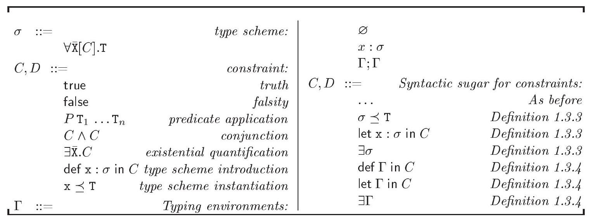

Figure 1-4: Syntax of type schemes and constraints

图1-4：类型方案和约束的语法

(译者注，下面的内容开始变得非常难以理解，所以这里先复习一些基础概念。同时也作为一个术语的速查表，方便对照理解。)

- $\backslash$ 表示集合的减。 例如： ℝ∖ℕ={x∈ℝ; x∉ℕ}
- $\bar{z}_{1} \# \bar{z}_{2}$ 作为简写表示 $\overline{\mathrm{z}}_{1} \cap \overline{\mathrm{z}}_{2}=\varnothing$ 即不相交
- 类型变量 （X, Y, Z）：类型的变量，最后还是代表具体类型，不要和种类kind弄混。
- 类型变量集合（ $\overline{\mathrm{X}}$ , $\bar{Y}$ ）
  - 并集的简写：$\bar{X} \bar{Y}$ 表示集合 $\bar{X} \cup \bar{Y}$
  - $\mathcal{V}_{\kappa}$ 表示种类 $\kappa$ 中类型变量的集合，不同种类的类型变量集合不相交。
- 类型集合 $\mathrm{T}$ ：
- 类型种类 $\kappa$ ：
  - $\star$ : 正常的类型，即直接代表一类表达式和值的类型，比如字符串，函数。
- 类型构造器（type constructor, $F$ ）: 基于类型构造出新的类型。比如函数的箭头构造器，输入参数和返回值类型，返回函数类型。
- 环境 $\Gamma$ 表示了一个环境，有一些类型变量的取值。从类型变量映射到类型方案。 $d p i(\Gamma)$ 表示类型方案中已定义变量的集合。
- 类型判断 $\Gamma \vdash \mathrm{t}: \mathrm{S}$ 如果是有效的（成立），则在假设 $\Gamma$ 下，表达式 $\mathrm{t}$ 有类型方案 $\mathrm{S}$
- $\preceq$ 表示实例关系。 $\sigma \preceq \mathrm{T}^{\prime}$（读作：类型 $\mathrm{T}^{\prime}$ 是 类型方案 $\sigma$ 的一个实例）
- $\forall \overline{\mathrm{X}}[C] . \mathrm{T}$ 是一个类型方案(类似泛型)，表示，在类型T中，可以使用 $\overline{\mathrm{X}}$ 集合中的变量，同时需要满足约束C。
- def $\mathrm{x}: \sigma$ in $C$ 意思是在约束C中使用泛型变量x表示类型方案 $\sigma$ 。
- 类型方案 $\sigma$ 和约束 $C$ 的自由程序标识符集合，分别记作 $f p i(\sigma)$ 和 $f p i(C)$

## Syntax

We now define the syntax of constrained type schemes and of constraints, and introduce some extra constraint forms as syntactic sugar.

我们现将约束类型方案的语法以及约束进行定义，并引入一些额外的约束形式作为语法糖。

1.3.1 Definition: Let $P$ range over a finite or denumerable set of predicates, each of which has a signature of the form $\kappa_{1} \otimes \ldots \otimes \kappa_{n} \Rightarrow \cdot$, where $n \geq 0$. Let $\leq$ be a distinguished predicate of signature $\star \otimes \star \Rightarrow \bullet$

1.3.1 定义：设$P$涵盖一个有限的或可枚举的谓词集合，其中每个谓词的签名形式为$\kappa_{1} \otimes \ldots \otimes \kappa_{n} \Rightarrow \cdot$，其中$n \geq 0$。设$\leq$是一个具有签名$\star \otimes \star \Rightarrow \bullet$的特殊谓词。

(注：这里的谓词可能和函数类型挺像的，但是返回值可能通常是bool类型？这里的小于等于可能就是普通的小于等于？)

1.3.2 Definition: The syntax of type schemes and constraints is given in Figure 1-4. It is further restricted by the following requirements. In the type scheme $\forall \overline{\mathrm{X}}[C] . \mathrm{T}$ and in the constraint $\mathrm{x} \preceq \mathrm{T}$, the type $\mathrm{T}$ must have kind $\star$. In the constraint $P \mathrm{~T}_{1} \ldots \mathrm{T}_{n}$, the types $\mathrm{T}_{1}, \ldots, \mathrm{T}_{n}$ must have kind $\kappa_{1}, \ldots, \kappa_{n}$, respectively, if $P$ has signature $\kappa_{1} \otimes \ldots \otimes \kappa_{n} \Rightarrow \cdot$. We write $\forall \overline{\mathrm{X}}$.T for $\forall \overline{\mathrm{x}}[$ true].T, which allows viewing DM type schemes as a subset of constrained type schemes.

1.3.2 定义：类型方案和约束的语法在图1-4中给出，并受以下要求的进一步限制。在类型方案 $\forall \overline{\mathrm{X}}[C] . \mathrm{T}$ 和约束 $\mathrm{x} \preceq \mathrm{T}$ 中，类型 $\mathrm{T}$ 必须具有种类 $\star$。在约束 $P \mathrm{~T}_{1} \ldots \mathrm{T}_{n}$ 中，如果 $P$ 有签名 $\kappa_{1} \otimes \ldots \otimes \kappa_{n} \Rightarrow \cdot$，则类型 $\mathrm{T}_{1}, \ldots, \mathrm{T}_{n}$ 必须分别具有种类 $\kappa_{1}, \ldots, \kappa_{n}$。我们用 $\forall \overline{\mathrm{X}}$.T 表示 $\forall \overline{\mathrm{x}}[$ true].T，这允许将DM类型方案视为受限类型方案的一个子集。

(注：$\forall \overline{\mathrm{X}}[C] . \mathrm{T}$：这是一个类型方案的表示，其中：
$\forall \overline{\mathrm{X}}$ 表示所有的类型变量 $\overline{\mathrm{X}}$，这可以是一个或多个类型变量。
$[C]$ 表示类型约束，它是一个逻辑表达式，定义了类型变量 $\overline{\mathrm{X}}$ 必须满足的条件。
$\mathrm{T}$ 是方案定义的类型本身。)

( $P \mathrm{~T}{1} \ldots \mathrm{T}{n}$：这是一个谓词约束，表示类型 $\mathrm{T}1, \ldots, \mathrm{T}n$ 符合某个谓词 $P$ 的要求。如果 $P$ 的签名是 $\kappa{1} \otimes \ldots \otimes \kappa{n} \Rightarrow \cdot$，那么每个 $\mathrm{T}_i$ 必须分别有 $\kappa_i$ 类型。)

(总之意思可能是：DM类型方案里面有一些谓词，但是我们约束系统里用约束P表示，和谓词是对应的)

We write $\mathrm{T}_{1} \leq \mathrm{T}_{2}$ for the binary predicate application $\leq \mathrm{T}_{1} \mathrm{~T}_{2}$, and call it a subtyping constraint. By convention, $\exists$ and def bind tighter than $\wedge$; that is, $\exists \overline{\mathrm{x}} . C \wedge D$ is $(\exists \overline{\mathrm{x}} . C) \wedge D$ and def $\mathrm{x}: \sigma$ in $C \wedge D$ is $(\operatorname{def} \mathrm{x}: \sigma$ in $C) \wedge D$. In $\forall \overline{\mathrm{x}}[C] . \mathrm{T}$, the type variables $\overline{\mathrm{X}}$ are bound within $C$ and $\mathrm{T}$. In $\exists \overline{\mathrm{X}}$. $C$, the type variables $\overline{\mathrm{X}}$ are bound within $C$. The sets of free type variables of a type scheme $\sigma$ and of a constraint $C$, written $f t v(\sigma)$ and $f t v(C)$, respectively, are defined accordingly. In def $\mathrm{x}: \sigma$ in $C$, the identifier $\mathrm{x}$ is bound within $C$. The sets of free program identifiers of a type scheme $\sigma$ and of a constraint $C$, written $f p i(\sigma)$ and $f p i(C)$, respectively, are defined accordingly. Please note that $\mathrm{x}$ occurs free in the constraint $\mathrm{x} \preceq \mathrm{T}$.

我们用 $\mathrm{T}_{1} \leq \mathrm{T}_{2}$ 来表示二元谓词应用 $\leq \mathrm{T}_{1} \mathrm{~T}_{2}$，并将其称为子类型约束。按照惯例，$\exists$ 和 def 的绑定比 $\wedge$ 更紧；即，$\exists \overline{\mathrm{x}} . C \wedge D$ 等于 $(\exists \overline{\mathrm{x}} . C) \wedge D$，而 def $\mathrm{x}: \sigma$ in $C \wedge D$ 等于 $(\operatorname{def} \mathrm{x}: \sigma$ in $C) \wedge D$。在 $\forall \overline{\mathrm{x}}[C] . \mathrm{T}$ 中，类型变量 $\overline{\mathrm{X}}$ 在 $C$ 和 $\mathrm{T}$ 中绑定。在 $\exists \overline{\mathrm{X}}$. $C$ 中，类型变量 $\overline{\mathrm{X}}$ 在 $C$ 中绑定。类型方案 $\sigma$ 和约束 $C$ 的自由类型变量集合，分别记作 $f t v(\sigma)$ 和 $f t v(C)$，相应地定义。在 def $\mathrm{x}: \sigma$ in $C$ 中，标识符 $\mathrm{x}$ 在 $C$ 中绑定。类型方案 $\sigma$ 和约束 $C$ 的自由程序标识符集合，分别记作 $f p i(\sigma)$ 和 $f p i(C)$，也相应地定义。请注意，$\mathrm{x}$ 在约束 $\mathrm{x} \preceq \mathrm{T}$ 中是自由出现的。

译者注，这里的 $\exists$ 可能和 $[\overrightarrow{\mathrm{X}} \mapsto \overrightarrow{\mathrm{T}}] \mathrm{T}$ 这种具体的类型替换类似，表示存在一些实例化的类型。

We immediately introduce a number of derived constraint forms:

我们立即引入一些派生的约束形式：

1.3.3 Definition: Let $\sigma$ be $\forall \overline{\mathrm{X}}[C]$.T. If $\overline{\mathrm{X}} \# \operatorname{ftv}\left(\mathrm{T}^{\prime}\right)$ holds, then $\sigma \preceq \mathrm{T}^{\prime}$ (read: $\mathrm{T}^{\prime}$ is an instance of $\sigma)$ stands for the constraint $\exists \overline{\mathrm{X}}$. $\left(C \wedge \mathrm{T} \leq \mathrm{T}^{\prime}\right)$. We write $\exists \sigma$ (read: $\sigma$ has an instance) for $\exists \overline{\mathrm{x}} . C$ and let $\mathrm{x}: \sigma$ in $C$ for $\exists \sigma \wedge \operatorname{def} \mathrm{x}: \sigma$ in $C$.

1.3.3 定义：令 $\sigma$ 为 $\forall \overline{\mathrm{X}}[C]$.T。如果 $\overline{\mathrm{X}} \# \operatorname{ftv}\left(\mathrm{T}^{\prime}\right)$ 成立，那么 $\sigma \preceq \mathrm{T}^{\prime}$（读作：$\mathrm{T}^{\prime}$ 是 $\sigma$ 的一个实例）表示约束 $\exists \overline{\mathrm{X}}$. $\left(C \wedge \mathrm{T} \leq \mathrm{T}^{\prime}\right)$。我们简写 $\exists \sigma$（读作：$\sigma$ 有一个实例）以表示 $\exists \overline{\mathrm{x}} . C$，并简写 let $\mathrm{x}: \sigma$ in $C$ 表示 $\exists \sigma \wedge \operatorname{def} \mathrm{x}: \sigma$ in $C$ 。

译者注：这个定义首先解释了带有约束的类型方案的实例化。 $\forall \overline{\mathrm{X}}[C]$.T 有一个实例 $\mathrm{T}^{\prime}$ 。首先直观理解，类型方案就是泛型的类型，主要就是T，但是因为T里有一些类型变量，所以写一个 $\forall \overline{\mathrm{X}}$。而 $\mathrm{T}^{\prime}$ 就是一个具体的类型，把类型方案里的类型实例变量替换成了具体的类型。 但是因为我们引入了子类型关系，所以不说 T 等于 $\mathrm{T}^{\prime}$，而是说 $\left(\mathrm{T} \leq \mathrm{T}^{\prime}\right)$ 。最后，因为要满足约束，所以我们写 $\left(C \wedge \mathrm{T} \leq \mathrm{T}^{\prime}\right)$ 。

注意到变量的绑定关系：

- 在 $\exists \overline{\mathrm{X}}$. $C$ 中，类型变量 $\overline{\mathrm{X}}$ 在 $C$ 中绑定。 $\exists \overline{\mathrm{X}}$. $C$ 的意思是存在一些实例的类型变量取值，使得约束C成立。
- 在 $\forall \overline{\mathrm{x}}[C] . \mathrm{T}$ 中，类型变量 $\overline{\mathrm{X}}$ 在 $C$ 和 $\mathrm{T}$ 中绑定。

意味着C里也可能使用到 $\overline{\mathrm{X}}$ 里的类型变量，并做出约束。

最后，let $\mathrm{x}: \sigma$ in $C$ 直观上理解，如果约束里要用到什么类型方案的变量，则一般会用def，而不是用let。这里定义了let的用法，除了起到def的作用，同时要求存在一个满足这个类型方案的实例。

Constrained type schemes generalize Damas and Milner's type schemes, while our definition of instantiation constraints generalizes Damas and Milner's instance relation (Definition 1.2.18). Let us draw a comparison. First, Damas and Milner's instance relation yields a "yes/no" answer, and is purely syntactic: for instance, the type $\mathrm{Y} \rightarrow \mathrm{Z}$ is not an instance of $\forall \mathrm{X}$. $\mathrm{X} \rightarrow \mathrm{X}$ in Damas and Milner's sense, because $\mathrm{Y}$ and $\mathrm{Z}$ are distinct type variables. In our presentation, on the other hand, $\forall \mathrm{X} . \mathrm{X} \rightarrow \mathrm{X} \preceq \mathrm{Y} \rightarrow \mathrm{Z}$ is not an assertion; rather, it is a constraint, which by definition is $\exists \mathrm{X}$. (true $\wedge \mathrm{X} \rightarrow \mathrm{X} \leq \mathrm{Y} \rightarrow \mathrm{Z}$ ). We later prove that it is equivalent to $\exists \mathrm{X}$. $(\mathrm{Y} \leq \mathrm{X} \wedge \mathrm{X} \leq \mathrm{Z})$ and to $\mathrm{Y} \leq \mathrm{Z}$, or, if subtyping is interpreted as equality, to $\mathrm{Y}=\mathrm{Z}$. That is, $\sigma \preceq \mathrm{T}^{\prime}$ represents a condition on (the types denoted by) the type variables in $f t v\left(\sigma, \mathrm{T}^{\prime}\right)$ for $\mathrm{T}^{\prime}$ to be an instance of $\sigma$, in a logical, rather than purely syntactic, sense. Second, the definition of instantiation constraints involves subtyping, so as to ensure that any supertype of an instance of $\sigma$ is again an instance of $\sigma$ (see rule C-ExTrans in Figure 1-6 and Lemma 1.3.17). This is consistent with the purpose of subtyping, which is to allow supplying a subtype where a supertype is expected (TAPL Chapter 15). Third and last, every type scheme now carries a constraint. The constraint $C$, whose free type variables may or may not be members of $\overline{\mathrm{x}}$, restricts the instances of the type scheme $\forall \overline{\mathrm{x}}[C]$.T. This is expressed in the instantiation constraint $\exists \overline{\mathrm{X}}$. $\left(C \wedge \mathrm{T} \leq \mathrm{T}^{\prime}\right)$, where the values that $\overline{\mathrm{X}}$ may assume are restricted by the requirement that $C$ be satisfied. This requirement vanishes in the case of DM type schemes, where $C$ is true. Our notions of constrained type scheme and of instantiation constraint are standard: they are exactly those of $\operatorname{HM}(X)$ (Odersky, Sulzmann, and Wehr, 1999a).

受限类型方案推广了Damas和Milner的类型方案，而我们对于实例化约束的定义推广了Damas和Milner的实例关系（定义1.2.18）。让我们进行比较。首先，Damas和Milner的实例关系提供了一个“是/否”的答案，并且是纯语法的：例如，类型 $\mathrm{Y} \rightarrow \mathrm{Z}$ 不是 $\forall \mathrm{X}$. $\mathrm{X} \rightarrow \mathrm{X}$ 在Damas和Milner意义上的实例，因为 $\mathrm{Y}$ 和 $\mathrm{Z}$ 是不同的类型变量。而在我们的表述中，$\forall \mathrm{X} . \mathrm{X} \rightarrow \mathrm{X} \preceq \mathrm{Y} \rightarrow \mathrm{Z}$ 不是一个断言；而是一个约束，按照定义是 $\exists \mathrm{X}$. (true $\wedge \mathrm{X} \rightarrow \mathrm{X} \leq \mathrm{Y} \rightarrow \mathrm{Z}$ )。我们后面证明它与 $\exists \mathrm{X}$. $(\mathrm{Y} \leq \mathrm{X} \wedge \mathrm{X} \leq \mathrm{Z})$ 以及 $\mathrm{Y} \leq \mathrm{Z}$ 等价，或者，如果子类型被解释为等价，那么与 $\mathrm{Y}=\mathrm{Z}$ 等价。也就是说，$\sigma \preceq \mathrm{T}^{\prime}$ 表示了一个关于类型变量在 $f t v\left(\sigma, \mathrm{T}^{\prime}\right)$ 中的（表示的类型）的条件，以便 $\mathrm{T}^{\prime}$ 能够在逻辑上而非纯语法的意义上成为 $\sigma$ 的一个实例。第二，实例化约束的定义涉及子类型，以确保任何实例的 $\sigma$ 的超类型再次成为 $\sigma$ 的实例（参见图1-6中的C-ExTrans规则和引理1.3.17）。这与子类型的目的是一致的，即允许在预期超类型的地方提供子类型（TAPL第15章）。第三，也是最后一点，现在每个类型方案都带有一个约束。约束 $C$ ，其自由类型变量可能是也可能不是 $\overline{\mathrm{x}}$ 的成员，限制了类型方案 $\forall \overline{\mathrm{x}}[C]$.T的实例。这在实例化约束 $\exists \overline{\mathrm{X}}$. $\left(C \wedge \mathrm{T} \leq \mathrm{T}^{\prime}\right)$ 中表达，其中 $\overline{\mathrm{X}}$ 可能取的值受到 $C$ 必须满足的要求的限制。在DM类型方案中，这个要求消失了，因为 $C$ 是真的。我们的受限类型方案和实例化约束的概念是标准的：它们正是 $\operatorname{HM}(X)$ （Odersky，Sulzmann和Wehr，1999a）中定义的。

译者注：

- 类型 $\mathrm{Y} \rightarrow \mathrm{Z}$ 表示函数类型，参数是Y，返回值是Z。
- 而 $\forall \mathrm{X}$. $\mathrm{X} \rightarrow \mathrm{X}$ 表示一个泛型函数类型，参数和返回值类型相同，这里可以想象一个泛型的恒等函数，把参数直接返回。
- $\forall \mathrm{X} . \mathrm{X} \rightarrow \mathrm{X} \preceq \mathrm{Y} \rightarrow \mathrm{Z}$ 表示，函数类型 $\mathrm{Y} \rightarrow \mathrm{Z}$ 是泛型类型方案 $\forall \mathrm{X}$. $\mathrm{X} \rightarrow \mathrm{X}$ 的实例。
  - 通过这个实例关系的定义，我们得到 $\exists \mathrm{X}$. ( true $\wedge \mathrm{X} \rightarrow \mathrm{X} \leq \mathrm{Y} \rightarrow \mathrm{Z}$ ) 。表示，存在实例类型X，满足约束true （因为没有约束C，所以表示为true）同时满足 函数类型 $\mathrm{Y} \rightarrow \mathrm{Z}$ 是 函数类型 $\mathrm{Y} \rightarrow \mathrm{Z}$ 的子类型 。 
    - 首先回忆子类型的定义，子类型能安全代换父类型。 
    - 根据函数类型的子类型关系定义，函数的子类型，参数需要是原参数的父类型（接受能力更强），返回值需要是原函数的子类型。 
    - 因此简化为了 $\exists \mathrm{X}$. $(\mathrm{Y} \leq \mathrm{X} \wedge \mathrm{X} \leq \mathrm{Z})$ 以及 $\mathrm{Y} \leq \mathrm{Z}$。
  - 这里注意到，实例化这个约束时，首先会假设存在类型变量的一些实例，这些实例会被约束里用到。
- 这里也反映了约束可能的复杂性。约束里面可能有这种实例关系，实例关系里面又涉及至少一个泛型。

译者注：再解释一下第三点。原来 $\forall \overline{\mathrm{x}}[C]$.T  意味着类型方案里的变量需要满足C的约束，实例化表示为 $\exists \overline{\mathrm{X}}$. $\left(C \wedge \mathrm{T} \leq \mathrm{T}^{\prime}\right)$ ，意思是存在类型变量集合 $\overline{\mathrm{x}}$ 使得。当没有任何约束的时候，

The constraint true, which is always satisfied, mainly serves to indicate the absence of a nontrivial constraint, while false, which has no solution, may be understood as the indication of a type error. Composite constraints include conjunction and existential quantification, which have their standard meaning, as well as type scheme introduction and type scheme instantiation constraints, which are similar to Gustavsson and Svenningsson's constraint abstractions (2001b). In short, the construct def $\mathrm{x}: \sigma$ in $C$ binds the name $\mathrm{x}$ to the type scheme $\sigma$ within the constraint $C$. If $C$ contains a subconstraint of
the form $\mathrm{x} \preceq \mathrm{T}$, where this occurrence of $\mathrm{x}$ is free in $C$, then this subconstraint acquires the meaning $\sigma \preceq \mathrm{T}$. Thus, the constraint $\mathrm{x} \preceq \mathrm{T}$ is indeed an instantiation constraint, where the type scheme that is being instantiated is referred to by name. The constraint def $\mathrm{x}: \sigma$ in $C$ may be viewed as an explicit substitution of the type scheme $\sigma$ for the name x within $C$. Later (Section 1.5), we use such explicit substitutions to supplant typing environments. That is, where Damas and Milner's type system augments the current typing environment (DM-ABS, DM-LET), we introduce a new def binding in the current constraint; where it looks up the current typing environment (DM-VAR), we employ an instantiation constraint. The point is that it is then up to a constraint solver to choose a strategy for reducing explicit substitutions-for instance, one might wish to simplify $\sigma$ before substituting it for $\mathrm{x}$ within $C$-whereas the use of environments in standard type systems such as DM and $\mathrm{HM}(X)$ imposes an eager substitution strategy, which is inefficient and thus never literally implemented. The use of type scheme introduction and instantiation constraints allows separating constraint generation and constraint solving without compromising efficiency, or, in other words, without introducing a gap between the description of the type inference algorithm and its actual implementation. Although the algorithm that we plan to describe is not new, its description in terms of constraints is: to the best of our knowledge, the only close relative of our def constraints is to be found in (Gustavsson and Svenningsson, 2001b). Fähndrich, Rehof, and Das's instantiation constraints (2000) are also related, but may be recursive and are meant to be solved using a semi-unification procedure, as opposed to a unification algorithm extended with facilities for creating and instantiating type schemes, as in our case.

约束“true”，总是得到满足，主要用于指示不存在非平凡约束，而“false”，没有解决方案，可以理解为类型错误的指示。复合约束包括合取和存在量化，它们具有标准含义，以及类型方案引入和类型方案实例化约束，与Gustavsson和Svenningsson的约束抽象（2001b）相似。简而言之，在$C$中的构造def $\mathrm{x}: \sigma$将名字$\mathrm{x}$绑定到约束$C$内的类型方案$\sigma$。如果$C$包含形如$\mathrm{x} \preceq \mathrm{T}$的子约束，其中此出现的$\mathrm{x}$在$C$中是自由的，则此子约束获得含义$\sigma \preceq \mathrm{T}$。因此，约束$\mathrm{x} \preceq \mathrm{T}$确实是一个实例化约束，其中被实例化的类型方案通过名称引用。约束def $\mathrm{x}: \sigma$在$C$中可以看作是将类型方案$\sigma$显式替换为$C$中的名字x。稍后（第1.5节），我们使用这样的显式替换来替换类型环境。也就是说，在Damas和Milner的类型系统增强当前类型环境（DM-ABS，DM-LET）的地方，我们在当前约束中引入一个新的def绑定；在它查找当前类型环境（DM-VAR）的地方，我们使用实例化约束。关键是，然后由约束求解器选择减少显式替换的策略——例如，人们可能希望简化$\sigma$，然后再将其替换为$C$中的$\mathrm{x}$——而标准类型系统（如DM和$\mathrm{HM}(X)$）中的环境强制了一种急替换的策略（eager substitution），这种策略效率低下，因此从未真正实现。类型方案引入和实例化约束的使用允许在不牺牲效率的情况下分离约束生成和约束求解，换句话说，就是没有在类型推断算法的描述和其实际实现之间引入差距。尽管我们计划描述的算法并不是新的，但其关于约束的描述是：据我们所知，我们def约束的唯一近亲可以在（Gustavsson和Svenningsson，2001b）中找到。Fähndrich、Rehof和Das的实例化约束（2000）也与之相关，但可能是递归的，并且旨在使用半统一程序求解，而不是扩展了创建和实例化类型方案功能的合一算法，就像我们这种情况。

One consequence of introducing constraints inside type schemes is that some type schemes have no instances at all, or have instances only if a certain constraint holds. For instance, the type scheme $\sigma=\forall x[$ bool $=$ int].X, where the nullary type constructors int and bool have distinct interpretations, has no instances; that is, no constraint of the form $\sigma \preceq \mathrm{T}^{\prime}$ has a solution. The type scheme $\sigma=\forall \mathrm{Z}[\mathrm{X}=\mathrm{Y} \rightarrow \mathrm{Z}] . \mathrm{Z}$ has an instance only if $\mathrm{X}=\mathrm{Y} \rightarrow \mathrm{Z}$ holds for some Z; in other words, for every $\mathrm{T}^{\prime}, \sigma \preceq \mathrm{T}^{\prime}$ entails $\exists \mathrm{Z}$. $(\mathrm{X}=\mathrm{Y} \rightarrow \mathrm{Z})$. (We define entailment on page 29.) We later prove that the constraint $\exists \sigma$ is equivalent to $\exists \mathrm{Z} . \sigma \preceq \mathrm{Z}$, where $\mathrm{Z} \notin f t v(\sigma)$ (Exercise 1.3.23). That is, $\exists \sigma$ expresses the requirement that $\sigma$ have an instance. Type schemes that do not have an instance indicate a type error, so in many situations, one wishes to avoid them; for this reason, we often use the constraint form let $\mathrm{x}: \sigma$ in $C$, which requires $\sigma$ to have an instance and at the same time associates it with the name $\mathrm{x}$. Because the def form is more primitive, it is easier to work with at a low level, but it is no longer explicitly used after Section 1.3; we always use let instead.

在类型方案中引入约束的一个后果是，某些类型方案根本没有实例，或者只在某个特定约束成立时才有实例。例如，类型方案 $\sigma=\forall x[ bool = int].X$ ，其中零元类型构造子int和bool具有不同的解释，没有实例；也就是说，没有形式的约束 $\sigma \preceq \mathrm{T}^{\prime}$ 有解。类型方案 $\sigma=\forall \mathrm{Z}[\mathrm{X}=\mathrm{Y} \rightarrow \mathrm{Z}] . \mathrm{Z}$ 只有当 $\mathrm{X}=\mathrm{Y} \rightarrow \mathrm{Z}$ 对某些Z成立时才有实例；换句话说，对于每个 $\mathrm{T}^{\prime}$，$\sigma \preceq \mathrm{T}^{\prime}$ 蕴含着 $\exists \mathrm{Z}$. $(\mathrm{X}=\mathrm{Y} \rightarrow \mathrm{Z})$。（我们在第29页定义蕴涵。）我们后来证明，约束 $\exists \sigma$ 等价于 $\exists \mathrm{Z} . \sigma \preceq \mathrm{Z}$，其中 $\mathrm{Z} \notin f t v(\sigma)$ （练习1.3.23）。也就是说，$\exists \sigma$ 表达了要求 $\sigma$ 有实例的需求。没有实例的类型方案指示了类型错误，因此在许多情况下，人们希望避免它们；为此，我们经常使用约束形式 let $\mathrm{x}: \sigma$ in $C$，这要求 $\sigma$ 有实例，并同时将其与名称 $\mathrm{x}$ 相关联。由于def形式更为原始，它在低层次上更容易处理，但在1.3节之后不再显式使用；我们总是使用let。

1.3.4 Definition: Environments $\Gamma$ remain as in Definition 1.2.19, except DM type schemes S are replaced with constrained type schemes $\sigma$. We write $d f p i(\Gamma)$ for $d p i(\Gamma) \cup f p i(\Gamma)$. We define def $\varnothing$ in $C=C$ and $\operatorname{def} \Gamma ; \mathrm{x}: \sigma$ in $C=$ def $\Gamma$ in def $\mathrm{x}: \sigma$ in $C$. Similarly, we define let $\varnothing$ in $C=C$ and let $\Gamma ; \mathrm{x}$ : $\sigma$ in $C=$ let $\Gamma$ in let $\mathrm{x}: \sigma$ in $C$. We define $\exists \varnothing=$ true and $\exists(\Gamma ; \mathrm{x}: \sigma)=$ $\exists \Gamma \wedge \operatorname{def} \Gamma$ in $\exists \sigma$.

1.3.4 定义：环境 $\Gamma$ 保持与定义1.2.19中一样，不同的是DM类型方案S被限制类型方案 $\sigma$ 替换。我们用 $d f p i(\Gamma)$ 表示 $d p i(\Gamma) \cup f p i(\Gamma)$。我们定义 def $\varnothing$ in $C=C$ 和 $\operatorname{def} \Gamma ; \mathrm{x}: \sigma$ in $C=$ def $\Gamma$ in def $\mathrm{x}: \sigma$ in $C$。同样，我们定义 let $\varnothing$ 在 $C=C$ 和 let $\Gamma ; \mathrm{x}$ : $\sigma$ 在 $C=$ let $\Gamma$ 在 let $\mathrm{x}: \sigma$ 中的 $C$。我们定义 $\exists \varnothing=$ true 和 $\exists(\Gamma ; \mathrm{x}: \sigma)=$ $\exists \Gamma \wedge \operatorname{def} \Gamma$ 在 $\exists \sigma$ 中。

译者注：这里引入了环境 $\Gamma$ ，dpi表示定义的标识符（变量名）， fpi表示自由的标识符（变量名）。然后引入了一些简写：

- def $\varnothing$ in $C$ 直接简写为 $C$，
- $\operatorname{def} \Gamma ; \mathrm{x}: \sigma$ in $C$ ，这里在环境中使用了拼接，作为一个语法糖，表示层叠的def：  def $\Gamma$ in def $\mathrm{x}: \sigma$ in $C$
- let同理。
- $\exists(\Gamma ; \mathrm{x}: \sigma)$ 简写为 $\exists \Gamma \wedge \operatorname{def} \Gamma$ in $\exists \sigma$ 。主要的意思是，环境和新增的都取实例。 而且， $\sigma$ 里面可以用到环境里的变量。

In order to establish or express certain laws of equivalence between constraints, we need constraint contexts. A context is a constraint with zero, one, or several holes, written []. The syntax of contexts is as follows:

为了建立或表达约束之间的某些等价定律，我们需要约束上下文。上下文是一个带有零个、一个或多个孔的约束，写成[]. 上下文的语法如下：

$$
\mathcal{C}::= [] |C| \mathcal{C} \wedge \mathcal{C}|\exists \overline{\mathrm{x}} . \mathcal{C}| \operatorname{def} \mathrm{x}: \sigma \text { in } \mathcal{C} \mid \operatorname{def} \mathrm{x}: \forall \overline{\mathrm{x}}[\mathcal{C}] . \mathrm{T} \text { in } C
$$

The application of a constraint context $\mathcal{C}$ to a constraint $C$, written $\mathcal{C}[C]$, is defined in the usual way. Because a context may have any number of holes, $C$ may disappear or be duplicated in the process. Because a hole may appear in the scope of a binder, some of $C$ 's free type variables and free program identifiers may become bound in $\mathcal{C}[C]$. We write $\operatorname{dtv}(\mathcal{C})$ and $\operatorname{dpi}(\mathcal{C})$ for the sets of type variables and program identifiers, respectively, that $\mathcal{C}$ may thus capture. We write let $\mathrm{x}: \forall \overline{\mathrm{x}}[\mathcal{C}] . T$ in $C$ for $\exists \overline{\mathrm{x}} . \mathcal{C} \wedge \operatorname{def} \mathrm{x}: \forall \overline{\mathrm{x}}[\mathcal{C}] . T$ in $C$. Being able to state such a definition is why we require multi-hole contexts. We let range over existential constraint contexts, defined by $\mathcal{X}::=[] \mid \exists \overline{\mathrm{X}} . \mathcal{X}$.

约束上下文$\mathcal{C}$应用于约束$C$的方式通常定义，记作$\mathcal{C}[C]$。由于上下文可能有任意数量的孔洞，$C$在过程中可能会消失或被复制。由于孔洞可能出现在绑定器的范围内，$C$的一些自由类型变量和自由程序标识符在$\mathcal{C}[C]$中可能变为绑定。我们分别用$\operatorname{dtv}(\mathcal{C})$和$\operatorname{dpi}(\mathcal{C})$来表示$\mathcal{C}$可能捕获的类型变量集和程序标识符集。我们写let $\mathrm{x}: \forall \overline{\mathrm{x}}[\mathcal{C}] . T$在$C$中，代表$\exists \overline{\mathrm{x}} . \mathcal{C} \wedge \operatorname{def} \mathrm{x}: \forall \overline{\mathrm{x}}[\mathcal{C}] . T$在$C$中。能够表述这样的定义是我们需要多孔洞上下文的原因。我们让范围遍历存在性约束上下文，由$\mathcal{X}::=[] \mid \exists \overline{\mathrm{X}} . \mathcal{X}$定义。

译者注：约束上下文也有点像函数，就是带有洞的约束，然后可以有一个应用，把另外一个“参数”约束填进去，得到结果。然后类似地定义了约束上下文遇到let的定义，即也是一个简写，和之前一样就是额外要求了有实例。

## Meaning

We have defined the syntax of constraints and given an informal description of their meaning. We now give a formal definition of the interpretation of constraints. We begin with the definition of a model:

我们已经定义了约束的语法并给出了它们含义的非正式描述。现在我们给出约束解释的正式定义。我们从模型定义开始：

1.3.5 Definition: For every kind $\kappa$, let $\mathcal{M}_{\kappa}$ be a nonempty set, whose elements are the ground types of kind $\kappa$. In the following, $t$ ranges over $\mathcal{M}_{\kappa}$, for some $\kappa$ that may be determined from the context. For every type constructor $F$ of signature $K \Rightarrow \kappa$, let $F$ denote a total function from $\mathcal{M}_{K}$ into $\mathcal{M}_{\kappa}$, where the indexed product $\mathcal{M}_{K}$ is the set of all mappings of domain $\operatorname{dom}(K)$ that map every $d \in \operatorname{dom}(K)$ to an element of $\mathcal{M}_{K(d)}$. For every predicate $P$ of signature $\kappa_{1} \otimes \ldots \otimes \kappa_{n} \Rightarrow \cdot$, let $P$ denote a predicate on $\mathcal{M}_{\kappa_{1}} \times \ldots \times \mathcal{M}_{\kappa_{n}}$. We require the predicate $\leq$ on $\mathcal{M}_{\star} \times \mathcal{M}_{\star}$ to be a partial order.

1.3.5 定义：对于每种种类 $\kappa$，令 $\mathcal{M}_{\kappa}$ 是一个非空集合，其元素是种类 $\kappa$ 的基本类型。以下，$t$ 在 $\mathcal{M}_{\kappa}$ 中取值，对于某个可能从上下文中确定的 $\kappa$。对于每个类型构造器 $F$，其签名是 $K \Rightarrow \kappa$，令 $F$ 表示从 $\mathcal{M}_{K}$ 到 $\mathcal{M}_{\kappa}$ 的全函数，这里的索引积 $\mathcal{M}_{K}$ 是所有将域 $\operatorname{dom}(K)$ 映射到 $\mathcal{M}_{K(d)}$ 的元素的映射的集合。对于每个签名 $\kappa_{1} \otimes \ldots \otimes \kappa_{n} \Rightarrow \cdot$ 的谓词 $P$，令 $P$ 表示在 $\mathcal{M}_{\kappa_{1}} \times \ldots \times \mathcal{M}_{\kappa_{n}}$ 上的谓词。我们要求在 $\mathcal{M}_{\star} \times \mathcal{M}_{\star}$ 上的谓词 $\leq$ 是一个偏序关系。

译者注：

- 复习一下种类Kind的概念。种类类似是类型的集合的概念。各种表达式有类型，类型分为具体类型和其他非具体类型。
  - 比如 $\star$ 就是一个表示所有具体类型的种类。 
- 这里 $\mathcal{M}_{\kappa}$ 也是一个类型的集合，表示种类 ${\kappa}$ 里面基本类型的集合。
  - “我们要求在 $\mathcal{M}_{\star} \times \mathcal{M}_{\star}$ 上的谓词 $\leq$ 是一个偏序关系。” 这里看这句话隐含表达的事实：子类型关系，作为一个谓词，是定义在 $\mathcal{M}_{\star} \times \mathcal{M}_{\star}$ 上的。我们知道子类型关系是定义在普通的具体类型上的，所以这里 $\mathcal{M}_{\star}$ 就表示普通基本类型的集合。
- 类型构造器（type constructor, $F$ ）: 基于类型构造出新的类型。比如函数的箭头构造器，输入参数和返回值类型，返回函数类型。
- 大写的 $K$ 其实可以理解为种类的元组，从一个递增的下标映射到种类。
- $\mathcal{M}_{K}$ ：这里的K是大写。我们知道 $\mathcal{M}_{\kappa}$ 是 ${\kappa}$ 里面具体类型的集合。K理解为种类的元组。那么同理我们可以猜测 $\mathcal{M}_{K}$ 就是具体类型集合的元组，构成的集合。这里的域就直接理解为下标。这里从原来K里的下标，映射到 $\mathcal{M}_{K(d)}$ 就是把元组里下标d的取出来，然后取里面的具体类型的集合。这里的映射，因为key，domain，就是下标，所以映射就直接当作元组理解。
- “令 $F$ 表示从 $\mathcal{M}_{K}$ 到 $\mathcal{M}_{\kappa}$ 的全函数。”
  - 全函数其实就是普通函数，表示强调，定义域里没有任何元素没有定义。
  - F表示，从具体类型集合的元组，映射到具体类型集合。而定义域里没有任何元素没有定义，意味着，对应任意的具体类型集合的元组，都能构造出新的具体类型。
- 

For the sake of convenience, we abuse notation and write $F$ for both the type constructor and its interpretation; similarly for predicates. We freely assume that a binary equality predicate, whose interpretation is equality on $\mathcal{M}_{\kappa}$, is available at every kind $\kappa$, so $\mathrm{T}_{1}=\mathrm{T}_{2}$, where $\mathrm{T}_{1}$ and $\mathrm{T}_{2}$ have kind $\kappa$, is a well-formed constraint.

为了方便起见，我们不严格使用符号，并用$F$表示类型构造器和其解释；对于谓词也同样处理。我们自由地假定在每个种类$\kappa$上都有一个二元等性谓词，其在$\mathcal{M}_{\kappa}$上的解释是等价性，因此，如果$\mathrm{T}_{1}$和$\mathrm{T}_{2}$具有种类$\kappa$，那么$\mathrm{T}_{1}=\mathrm{T}_{2}$是一个良构的约束。

By varying the set of type constructors, the set of predicates, the set of ground types, and the interpretation of type constructors and predicates, one may define an entire family of related type systems. We informally refer to the collection of these choices as $X$. Thus, the type systems $\operatorname{HM}(X)$ and $\operatorname{PCB}(X)$, described in Sections 1.4 and 1.5, are parameterized by $X$.

通过改变类型构造器的集合、谓词的集合、基础类型（ground types）的集合以及类型构造器和谓词的解释，可以定义一整个相关类型系统的家族。我们非正式地将这些选择的集合称为$X$。因此，在1.4节和1.5节中描述的类型系统$\operatorname{HM}(X)$和$\operatorname{PCB}(X)$，都是由$X$参数化的。

译者注：这两段开始把很多原来类型系统的东西抽象出来。

- 类型构造器的集合：比如函数的箭头，输入参数和返回值类型，给出函数类型，就是类型构造器。还有数组类型构造器，输入成员类型，构造出具体的数组类型。
- 谓词的集合：比如子类型关系。类型的相等关系。
- 基础类型（ground types）的集合：字符串类型，数字类型。
- 类型构造器和谓词的解释：TODO

The following examples give standard ways of defining the set of ground types and the interpretation of type constructors.

以下示例给出了定义具体类型(ground types)集合以及类型构造器解释的标准方法。

1.3.6 Example [Syntactic models]: For every kind $\kappa$, let $\mathcal{M}_{\kappa}$ consist of the closed types of kind $\kappa$. Then, ground types are types that do not have any free type variables, and form the so-called Herbrand universe. Let every type constructor $F$ be interpreted as itself. Models that define ground types and interpret type constructors in this manner are referred to as syntactic.

1.3.6 示例[语法模型]：对于每种种类 $\kappa$，令 $\mathcal{M}_{\kappa}$ 由种类 $\kappa$ 的闭合类型组成。那么，基本类型是没有自由类型变量的类型，并构成了所谓的Herbrand宇宙。令每个类型构造器 $F$ 被解释为其自身。以这种方式定义基本类型并解释类型构造器的模型被称为语法的。

译者注： “令每个类型构造器 $F$ 被解释为其自身” 这句话很抽象。在很多类型系统中可能类型构造器代表了一些操作，通过操作构造出新的类型。这里“解释为自身”的意思就是没什么操作，只要按照我的定义把语法写出来，就是一个新的类型。比如`List`构造器，把数字类型应用进来`List[Number]`就是一个新的数字列表类型。

1.3.7 Example [Tree models]: Let a path $\pi$ be a finite sequence of directions. The empty path is written $\epsilon$ and the concatenation of the paths $\pi$ and $\pi^{\prime}$ is written $\pi \cdot \pi^{\prime}$. Let a tree be a partial function $t$ from paths to type constructors whose domain is nonempty and prefix-closed and such that, for every path $\pi$ in the domain of $t$, if the type constructor $t(\pi)$ has signature $K \Rightarrow \kappa$, then $\pi \cdot d \in \operatorname{dom}(t)$ is equivalent to $d \in \operatorname{dom}(K)$ and, furthermore, for every $d \in \operatorname{dom}(K)$, the type constructor $t(\pi \cdot d)$ has image kind $K(d)$. If $\pi$ is in the domain of $t$, then the subtree of $t$ rooted at $\pi$, written $t / \pi$, is the partial function $\pi^{\prime} \mapsto t\left(\pi \cdot \pi^{\prime}\right)$. A tree is finite if and only if it has finite domain. A tree is regular if and only if it has a finite number of distinct subtrees. Every finite tree is thus regular. Let $\mathcal{M}_{\kappa}$ consist of the finite (resp. regular) trees $t$ such that $t(\epsilon)$ has image kind $\kappa$ : then, we have a finite (resp. regular) tree model.

1.3.7 示例[树模型]：设路径π为方向的有穷序列。空路径记作ε，路径π和π'的连接记作π·π'。设树t为从路径到类型构造器的部分函数，其定义域非空且前缀封闭，且对于t定义域中的每条路径π，如果类型构造器t(π)的签名是K => κ，那么π·d属于t的定义域等价于d属于K的定义域，此外，对于每个d属于K的定义域，类型构造器t(π·d)的像种类为K(d)。如果π属于t的定义域，则以π为根的t的子树，记作t/π，是部分函数π'映射到t(π·π')。树是有限的当且仅当它具有有限定义域。树是规则的当且仅当它具有有限数量的不同子树。每个有限树因此都是规则的。设 $\mathcal{M}_{\kappa}$ 由那些t(ε)的像种类为κ的有限（分别地，规则）树t组成：那么，我们有一个有限（分别地，规则）的树模型。

译者注：

- 这里的“像”，“Image”就是值域。
- 首先引入了路径path的概念，然后引入了路径的连接运算。
- 树，被定义为从路径到类型构造器的映射。树t关于路径 $\pi$ 的类型构造器是 $t(\pi)$ 。
  - 定义域非空。
  - 前缀封闭 prefix-closed，表示如果某个路径在树的定义域中，则所有前缀也在定义域中，保证没有凭空悬挂的节点。
- “ $\pi \cdot d \in \operatorname{dom}(t)$ is equivalent to $d \in \operatorname{dom}(K)$ ” 意思是，假如类型构造器 $t(\pi)$ 有签名 $K \Rightarrow \kappa$ 。 $K$ 理解为类型种类的元组，定义域是下标。对于每个 $K$ 的定义域上的元素，在树上都有一个这样的路径。
  - 画出来的整个树代表一个类型，而不是某个路径代表一个类型。
  - 例如：我有个Pair类型。树的根节点是Pair类型。路径1是Int类型，路径2是String类型。整个树代表了 Pair(Int, String) 类型。
    - 这里Pair类型的签名 $K$ 是`{0: Int, 1: String}`。这里对每个K的定义域d=0/1都有对应的路径，即 $\pi \cdot d \in \operatorname{dom}(t)$ 。因为之前没有路径，这里的 $\pi$ 等于 $\epsilon$ 。然后对于每个节点上的类型构造器，  $t(\pi \cdot d)$ 都有着 $K(d)$ 相同的类型。 比如这里的 $t(\epsilon \cdot 0)$ 有着类型 Int，所以得和类型构造器的签名一致 K(d) ，后面的叶子节点也得是Int类型。
- 子树的概念：以路径 $\pi$ 为根的子树，记作 $t / \pi$, 和树一样是一个映射，但是映射结果加了一个 $\pi$ 的前缀。
- 有限的树：有限这个概念指定义域有限。即路径的数量有限。
- 规则的树：子树的数量有限。这里可能主要是允许了无限长的List类型，因为虽然路径数量无限，内部节点子树都是一样的。

树到底是什么？这里说树只不过是一个从路径到类型构造器的映射。这里没有参数的类型构造器可能就表示普通类型。这里的路径可能表示访问类型内部成员时会出现的可能情况。总之一个树就表示了一个复杂类型。

If $F$ has signature $K \Rightarrow \kappa$, one may interpret $F$ as the function that maps $T \in \mathcal{M}_{K}$ to the ground type $t \in \mathcal{M}_{\kappa}$ defined by $t(\epsilon)=F$ and $t / d=T(d)$ for $d \in \operatorname{dom}(T)$, that is, the unique ground type whose head symbol is $F$ and whose subtree rooted at $d$ is $T(d)$. Then, we have a free tree model. Please note that free finite tree models coincide with syntactic models, as defined in the previous example.

如果$F$具有签名$K \Rightarrow \kappa$，可以将$F$解释为将$\mathcal{M}_{K}$中的$T$映射到由$t(\epsilon)=F$和对于$\operatorname{dom}(T)$中的$d$，$t / d=T(d)$定义的地基层类型$t \in \mathcal{M}_{\kappa}$的函数，即头部符号为$F$且以$d$为根的子树为$T(d)$的唯一地基层类型。然后，我们得到了一个自由树模型。请注意，自由的有限树模型与前面示例中定义的语法模型是一致的。

译者注：这里的自由free指，就按照这些规则，不受到额外的其他约束。这一段话把树模型和原来的语义模型对应起来了，树最终可能的构造和语法得到的是一样的。所以是一致的。

Rows (Section 1.11) are interpreted in a tree model, albeit not a free one. The following examples suggest different ways of interpreting the subtyping predicate.

行（第1.11节）在树模型中解释，尽管不是自由模型。以下示例提出了不同的解释子类型谓词的方式。

1.3.8 Example [Equality models]: The simplest way of interpreting the subtyping predicate is to let $\leq$ denote equality on every $\mathcal{M}_{\kappa}$. Models that do so are referred to as equality models. When no predicate other than equality is available, we say that the model is equality-only.

1.3.8 示例 [等价性模型]：解释子类型谓词的最简单方式是让 $\leq$ 在每个 $\mathcal{M}_{\kappa}$ 上表示等价性。这样做 的模型被称为等价性模型。当除了等价性之外没有其他谓词可用时，我们称该模型仅为等价性模型。

1.3.9 Example [Structural, Nonstructural Subtyping]: Let a variance $\nu$ be a nonempty subset of $\{-,+\}$, written - (contravariant), + (covariant), or $\pm$ (invariant) for short. Define the composition of two variances as an associative commutative operation with + as neutral element and such that $--=+$ and $\pm-= \pm \pm= \pm$. Now, consider a free (finite or regular) tree model, where every direction $d$ comes with a fixed variance $\nu(d)$. Define the variance $\nu(\pi)$ of a path $\pi$ as the composition of the variances of its elements. Let $\leqslant$ be a partial order on type constructors such that (i) if $F_{1} \leqslant F_{2}$ holds and $F_{1}$ and $F_{2}$ have signature $K_{1} \Rightarrow \kappa_{1}$ and $K_{2} \Rightarrow \kappa_{2}$, respectively, then $K_{1}$ and $K_{2}$ agree on the intersection of their domains and $\kappa_{1}$ and $\kappa_{2}$ coincide; and (ii) $F_{0} \leqslant F_{1} \leqslant F_{2}$ implies $\operatorname{dom}\left(F_{0}\right) \cap \operatorname{dom}\left(F_{2}\right) \subseteq \operatorname{dom}\left(F_{1}\right)$. Let $\leqslant^{+}, \leqslant^{-}$, and $\leqslant^{ \pm}$stand for $\leqslant, \geqslant$, and $=$, respectively. Then, define the interpretation of subtyping as follows: if $t_{1}, t_{2} \in \mathcal{M}_{\kappa}$, let $t_{1} \leq t_{2}$ hold if and only if, for every path $\pi \in \operatorname{dom}\left(t_{1}\right) \cap \operatorname{dom}\left(t_{2}\right), t_{1}(\pi) \leqslant^{\nu(\pi)} t_{2}(\pi)$ holds. It is not difficult to check that $\leq$ is a partial order on every $\mathcal{M}_{\kappa}$. The reader is referred to (Kozen, Palsberg, and Schwartzbach., 1995) for more details about this construction. Models that define subtyping in this manner are referred to as nonstructural subtyping models.

1.3.9 示例[结构化，非结构化子类型]：设一个变化量$\nu$是集合$\{-,+\}$的一个非空子集，简写为-（逆变），+（协变）或$\pm$（不变）。定义两个变化量的组合作为一个结合交换运算，其中+是中性元素，且满足$--=+$和$\pm-= \pm \pm= \pm$。现在，考虑一个自由（有限或正则）树模型，其中每个方向$d$都附有一个固定的变化量$\nu(d)$。定义路径$\pi$的变化量$\nu(\pi)$为其元素变化量的组合。设$\leqslant$是类型构造器的偏序关系，使得（i）如果$F_{1} \leqslant F_{2}$成立，且$F_{1}$和$F_{2}$分别具有签名$K_{1} \Rightarrow \kappa_{1}$和$K_{2} \Rightarrow \kappa_{2}$，那么$K_{1}$和$K_{2}$在它们的域的交上相同，并且$\kappa_{1}$和$\kappa_{2}$相同；以及（ii）$F_{0} \leqslant F_{1} \leqslant F_{2}$意味着$\operatorname{dom}\left(F_{0}\right) \cap \operatorname{dom}\left(F_{2}\right) \subseteq \operatorname{dom}\left(F_{1}\right)$。设$\leqslant^{+}, \leqslant^{-}$，和$\leqslant^{\pm}$分别表示$\leqslant, \geqslant$和$=$。然后，以下定义子类型的解释：如果$t_{1}, t_{2} \in \mathcal{M}_{\kappa}$，那么仅当对于每个路径$\pi \in \operatorname{dom}\left(t_{1}\right) \cap \operatorname{dom}\left(t_{2}\right)$，$t_{1}(\pi) \leqslant^{\nu(\pi)} t_{2}(\pi)$成立时，才有$t_{1} \leq t_{2}$。不难验证$\leq$在每一个$\mathcal{M}_{\kappa}$上都是一个偏序关系。关于这种构造的更多细节，请参考（Kozen, Palsberg, 和 Schwartzbach., 1995）。以这种方式定义子类型的模型称为非结构化子类型模型。

译者注：

- 子类型关系：子类型可以安全代换父类型。所以父类型是通用的，或者字段少的类型，子类型更具体，或者有更多字段。
- 逆变和协变的概念。这里向着子类型方向走，如果某个类型构造器是协变的，则内部类型变成了子类型，则构造后的类型也是原来的子类型。
  - 函数类型 Function，其参数类型逆变，返回类型协变。可以说 Function[Any => Object] 是 Function[Int => String] 的超类型，因为 Any 是 Int 的超类型（参数逆变），String 是 Object 的子类型（返回协变）。
- 逆变和协变的组合，这里有点类似数学里面的单调函数叠加。协变看作递增函数，逆变看作递减函数
  - `++ = +`: 两个协变组合还是协变。两个单调递增函数嵌套还是单增。
  - `-- = +`: 两个逆变组合成协变。两个单调递减函数嵌套得到单调递增函数
  - `+- = -`: 协变和逆变组合成逆变。单调递增和单调递减嵌套还是递减。
  - `±- = ±± = ±`: 任何与不变组合都保持不变。这里不太一样了。不变把要求卡死，不能增也不能减了。
- 类型构造器的偏序关系：注意不是类型的偏序关系。

A simple nonstructural subtyping model is obtained by letting the directions domain and codomain be contra- and covariant, respectively, and introducing, in addition to the type constructor $\rightarrow$, two type constructors $\perp$ and $T$ of signature $\star$. This gives rise to a model where $\perp$ is the least ground type, $T$ is the greatest ground type, and the arrow type constructor is, as usual, contravariant in its domain and covariant in its codomain.

通过让方向域和共域分别是逆变和协变，并除了类型构造器$\rightarrow$之外，引入两个具有签名$\star$的类型构造器$\perp$和$T$，可以得到一个简单的非结构子类型模型。这产生了一个模型，其中$\perp$是最小的基本类型，$T$是最大的基本类型，而箭头类型构造器在其域中是逆变的，在其共域中是协变的，一如往常。

A typical use of nonstructural subtyping is in type systems for records. One may, for instance, introduce a covariant direction content of kind $\star$, a kind $\diamond$, a type constructor abs of signature $\diamond$, a type constructor pre of signature $\{$ content $\mapsto \star\} \Rightarrow \diamond$, and let pre $\leqslant$ abs. This gives rise to a model where pre $t \leq$ abs holds for every $t \in \mathcal{M}_{\star}$. This form of subtyping is called nonstructural because comparable ground types may have different shapes, such as $\perp$ and $\perp \rightarrow \top$, or pre $T$ and abs. Nonstructural subtyping has been studied, for example, in (Kozen, Palsberg, and Schwartzbach., 1995; Palsberg, Wand, and O'Keefe, 1997; Pottier, 2001b; Niehren and Priesnitz, 2003). Section 1.11 says more about typechecking operations on records.

非结构子类型的一个典型应用是在记录的类型系统中。例如，可以引入一个协变方向的内容种类 $\star$，一个种类 $\diamond$，一个类型构造器abs，其签名是 $\diamond$，一个类型构造器pre，其签名是 $\{$ 内容 $\mapsto \star\} \Rightarrow \diamond$，并且让 pre $\leqslant$ abs。这产生了一个模型，其中对于每个 $t \in \mathcal{M}_{\star}$，都有 pre $t \leq$ abs 成立。这种子类型称为非结构子类型，因为可比较的底层类型可能有不同的形状，比如 $\perp$ 和 $\perp \rightarrow \top$，或者 pre $T$ 和 abs。非结构子类型已经在（Kozen, Palsberg, 和 Schwartzbach., 1995; Palsberg, Wand, 和 O'Keefe, 1997; Pottier, 2001b; Niehren 和 Priesnitz, 2003）等文献中被研究。第1.11节更详细地介绍了记录上的类型检查操作。

An important particular case arises when any two type constructors related by $\leqslant$ have the same arity. In that case, it is not difficult to show that any two ground types related by subtyping must have the same shape, that is, if $t_{1} \leq t_{2}$ holds, then $\operatorname{dom}\left(t_{1}\right)$ and $\operatorname{dom}\left(t_{2}\right)$ coincide. For this reason, such an interpretation of subtyping is usually referred to as atomic or structural subtyping. It has been studied in the finite (Mitchell, 1984, 1991b; Frey, 1997; Rehof, 1997; Kuncak and Rinard, 2003; Simonet, 2003) and regular (Tiuryn and Wand,

当一个重要的特例出现时，任何两个通过$\leqslant$相关联的类型构造器具有相同的元数。在这种情况下，不难证明，任何通过子类型化相关联的两个地类型必须具有相同的形状，即如果$t_{1} \leq t_{2}$成立，那么$\operatorname{dom}\left(t_{1}\right)$和$\operatorname{dom}\left(t_{2}\right)$是相同的。因此，这种子类型的解释通常被称为原子子类型或结构子类型。它已经在有限（Mitchell, 1984, 1991b; Frey, 1997; Rehof, 1997; Kuncak和Rinard, 2003; Simonet, 2003）和正则（Tiuryn和Wand,）中进行了研究。

1)    cases. Structural subtyping is often used in automated program analyses that enrich standard types with atomic annotations without altering their shape.

1993)案例。结构子类型通常用于自动程序分析中，这种分析通过添加原子注释来丰富标准类型，而不改变它们的形状。

Our last example suggests a predicate other than equality and subtyping.

我们的最后一个例子提出了除等价性和子类型之外的其他谓词。

1.3.10 Example [Conditional Constraints]: Consider a nonstructural subtyping model. For every type constructor $F$ of image kind $\kappa$ and for every kind $\kappa^{\prime}$, let $(F \leqslant \cdot \Rightarrow \cdot \leq \cdot)$ be a predicate of signature $\kappa \otimes \kappa^{\prime} \otimes \kappa^{\prime} \Rightarrow \cdot$. Thus, if $\mathrm{T}_{0}$ has kind $\kappa$ and $\mathrm{T}_{1}, \mathrm{~T}_{2}$ have the same kind, then $F \leqslant \mathrm{~T}_{0} \Rightarrow \mathrm{T}_{1} \leq \mathrm{T}_{2}$ is a wellformed constraint, called a conditional subtyping constraint. Its interpretation is defined as follows: if $t_{0} \in \mathcal{M}_{\kappa}$ and $t_{1}, t_{2} \in \mathcal{M}_{\kappa^{\prime}}$, then $F \leqslant t_{0} \Rightarrow t_{1} \leq t_{2}$ holds if and only if $F \leqslant t_{0}(\epsilon)$ implies $t_{1} \leq t_{2}$. In other words, if $t_{0}$ 's head symbol exceeds $F$ according to the ordering on type constructors, then the subtyping constraint $t_{1} \leq t_{2}$ must hold; otherwise, the conditional constraint holds vacuously. Conditional constraints have been studied e.g. in (Reynolds, 1969a; Heintze, 1993; Aiken, Wimmers, and Lakshman, 1994; Pottier, 2000; Su and Aiken, 2001).

1.3.10 示例[条件约束]：考虑一个非结构子类型模型。对于每个图像种类 $\kappa$ 的类型构造器 $F$ 和每个种类 $\kappa^{\prime}$，令 $(F \leqslant \cdot \Rightarrow \cdot \leq \cdot)$ 为具有签名 $\kappa \otimes \kappa^{\prime} \otimes \kappa^{\prime} \Rightarrow \cdot$ 的谓词。因此，如果 $\mathrm{T}_{0}$ 的种类是 $\kappa$ 并且 $\mathrm{T}_{1}, \mathrm{~T}_{2}$ 具有相同的种类，那么 $F \leqslant \mathrm{~T}_{0} \Rightarrow \mathrm{T}_{1} \leq \mathrm{T}_{2}$ 是一个良好形式的约束，称为条件子类型约束。其解释定义如下：如果 $t_{0} \in \mathcal{M}_{\kappa}$ 和 $t_{1}, t_{2} \in \mathcal{M}_{\kappa^{\prime}}$，那么当且仅当 $F \leqslant t_{0}(\epsilon)$ 时 $t_{1} \leq t_{2}$ 成立。换句话说，如果 $t_{0}$ 的头符号根据类型构造器的顺序超过 $F$，则子类型约束 $t_{1} \leq t_{2}$ 必须成立；否则，条件约束空缺成立。条件约束已在例如 (Reynolds, 1969a; Heintze, 1993; Aiken, Wimmers, 和 Lakshman, 1994; Pottier, 2000; Su 和 Aiken, 2001) 中被研究。

Many other kinds of constraints exist; see e.g. (Comon, 1993).

存在许多其他类型的约束；例如参见（Comon, 1993）。

Throughout this chapter, we assume (unless stated otherwise) that the set of type constructors, the set of predicates, and the model-which, together, form the parameter $X$-are arbitrary and fixed.

在本章中，我们假设（除非另有说明）类型构造器集合、谓词集合以及模型，这些共同构成了参数$X$，是任意且固定的。

As usual, the meaning of a constraint is a function of the meaning of its free type variables, which is given by a ground assignment. The meaning of free program identifiers may be defined as part of the constraint, if desired, using a def prefix, so it need not be given by a separate assignment.

如同往常，一个约束的含义是其自由类型变量的含义的函数，这由一个具体赋值给出。如果需要，可以使用def前缀，将自由程序标识符的含义定义为约束的一部分，因此不必通过单独的赋值来给出。

1.3.11 Definition: A ground assignment $\phi$ is a total, kind-preserving mapping from $\mathcal{V}$ into $\mathcal{M}$. Ground assignments are extended to types by $\phi\left(F \mathrm{~T}_{1} \ldots \mathrm{T}_{n}\right)=$ $F\left(\phi\left(\mathrm{T}_{1}\right), \ldots, \phi\left(\mathrm{T}_{n}\right)\right)$. Then, for every type $\mathrm{T}$ of kind $\kappa, \phi(\mathrm{T})$ is a ground type of kind $\kappa$. Whether a constraint $C$ holds under a ground assignment $\phi$, written $\phi \vdash C$ (read: $\phi$ satisfies $C$ ), is defined by the rules in Figure 1-5. A constraint $C$ is satisfiable if and only if $\phi \vdash C$ holds for some $\phi$. It is false if and only if $\phi \vdash \operatorname{def} \Gamma$ in $C$ holds for no ground assignment $\phi$ and environment $\Gamma$.

1.3.11 定义：一个地面赋值 $\phi$ 是从 $\mathcal{V}$ 到 $\mathcal{M}$ 的一个总映射，保持种类不变。地面赋值通过 $\phi(F \mathrm{~T}_{1} \ldots \mathrm{T}_{n})= F(\phi(\mathrm{T}_{1}), \ldots, \phi(\mathrm{T}_{n}))$ 扩展到类型。然后，对于每种种类 $\kappa$ 的类型 $\mathrm{T}$，$\phi(\mathrm{T})$ 是种类 $\kappa$ 的一个地面类型。一个约束 $C$ 在地面赋值 $\phi$ 下是否成立，记作 $\phi \vdash C$（读作：$\phi$ 满足 $C$），由图1-5中的规则定义。一个约束 $C$ 是可满足的，当且仅当存在某个 $\phi$ 使得 $\phi \vdash C$ 成立。它是假的，当且仅当对于任何地面赋值 $\phi$ 和环境 $\Gamma$，都不成立 $\phi \vdash \operatorname{def} \Gamma$ 中的 $C$。

Let us now explain the rules that define constraint satisfaction (Figure 15). They are syntax-directed: that is, to a given constraint, at most one rule applies. It is determined by the nature of the first construct that appears under a maximal def prefix. CM-TRUE states that a constraint of the form def $\Gamma$ in true is a tautology, that is, holds under every ground assignment. No rule matches constraints of the form def $\Gamma$ in false, which means that such constraints do not have a solution. CM-PREDICATE states that the meaning

让我们现在解释定义约束满足的规则（图15）。它们是语法指导的：也就是说，对于一个给定的约束，最多只有一个规则适用。它由最大def前缀下出现的第一个构造的性质决定。CM-TRUE规则表明，形式为def $\Gamma$ in true的约束是一个重言式，即在任何赋值下都成立。没有规则匹配形式为def $\Gamma$ in false的约束，这意味着这样的约束没有解决方案。CM-PREDICATE规则指出含义

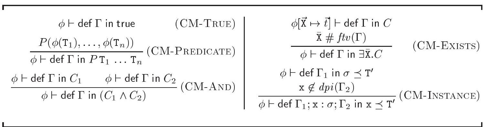

Figure 1-5: Meaning of constraints

图1-5：约束的含义

of a predicate application is given by the predicate's interpretation within the model. More specifically, if $P$ 's signature is $\kappa_{1} \otimes \ldots \otimes \kappa_{n} \Rightarrow \cdot$, then, by wellformedness of the constraint, every $\mathrm{T}_{i}$ is of kind $\kappa_{i}$, so $\phi\left(\mathrm{T}_{i}\right)$ is a ground type in $\mathcal{M}_{\kappa_{i}}$. By Definition 1.3.5, $P$ denotes a predicate on $\mathcal{M}_{\kappa_{1}} \times \ldots \times \mathcal{M}_{\kappa_{n}}$, so the rule's premise is mathematically well-formed. It is independent of $\Gamma$, which is natural, since a predicate application has no free program identifiers. CMAND requires each of the conjuncts to be valid in isolation. The information in $\Gamma$ is made available to each branch. CM-ExisTs allows the type variables $\overrightarrow{\mathrm{X}}$ to denote arbitrary ground types $\vec{t}$ within $C$, independently of their image through $\phi$. We implicitly require $\overrightarrow{\mathrm{X}}$ and $\vec{t}$ to have matching kinds, so that $\phi[\overrightarrow{\mathrm{X}} \mapsto \vec{t}]$ remains a kind-preserving ground assignment. The side condition $\overline{\mathrm{x}} \# \mathrm{ftv}(\Gamma)$ - which may always be satisfied by suitable $\alpha$-conversion of the constraint $\exists \overline{\mathrm{X}} . C$ - prevents free occurrences of the type variables $\overline{\mathrm{X}}$ within $\Gamma$ from being unduly affected. CM-INSTANCE concerns constraints of the form def $\Gamma$ in $\mathrm{x} \preceq \mathrm{T}^{\prime}$. The constraint $\mathrm{x} \preceq \mathrm{T}^{\prime}$ is turned into $\sigma \preceq \mathrm{T}^{\prime}$, where, according to the second premise, $\sigma$ is $\Gamma(\mathrm{x})$. Please recall that constraints of such a form were introduced in Definition 1.3.3. The environment $\Gamma$ is replaced with a suitable prefix of itself, namely $\Gamma_{1}$, so that the free program identifiers of $\sigma$ retain their meaning.

谓词应用的意义由模型中谓词的解释给出。更具体地说，如果$P$的签名是$\kappa_{1} \otimes \ldots \otimes \kappa_{n} \Rightarrow \cdot$，那么，根据约束的良好形式，每个$\mathrm{T}_{i}$都是$\kappa_{i}$类型的，所以$\phi\left(\mathrm{T}_{i}\right)$是$\mathcal{M}_{\kappa_{i}}$中的地类型。根据定义1.3.5，$P$表示$\mathcal{M}_{\kappa_{1}} \times \ldots \times \mathcal{M}_{\kappa_{n}}$上的一个谓词，因此规则的的前提在数学上是良好形成的。它与$\Gamma$无关，这是很自然的，因为谓词应用没有自由程序标识符。CMAND要求每个连词在没有上下文的情况下都是有效的。$\Gamma$中的信息对每个分支都是可用的。CM-ExisTs允许类型变量$\overrightarrow{\mathrm{X}}$在$C$中表示任意地类型$\vec{t}$，与其通过$\phi$的映像无关。我们隐式地要求$\overrightarrow{\mathrm{X}}$和$\vec{t}$具有匹配的种类，以便$\phi[\overrightarrow{\mathrm{X}} \mapsto \vec{t}]$保持类型保存的地赋值。侧条件$\overline{\mathrm{x}} \# \mathrm{ftv}(\Gamma)$可以通过适当的$\alpha$-转换约束$\exists \overline{\mathrm{X}} . C$来满足，这防止了$\Gamma$中的类型变量$\overline{\mathrm{X}}$的自由出现受到不适当的影响。CM-INSTANCE涉及形如def $\Gamma$ in $\mathrm{x} \preceq \mathrm{T}^{\prime}$的约束。将约束$\mathrm{x} \preceq \mathrm{T}^{\prime}$转换为$\sigma \preceq \mathrm{T}^{\prime}$，其中，根据第二个前提，$\sigma$是$\Gamma(\mathrm{x})$。请回想一下，此类形式的约束在定义1.3.3中引入。环境$\Gamma$被替换为其本身的适当前缀，即$\Gamma_{1}$，以便$\sigma$的自由程序标识符保持其含义。

It is intuitively clear that the constraints def $\mathrm{x}: \sigma$ in $C$ and $[\mathrm{x} \mapsto \sigma] C$ have the same meaning, where the latter denotes the capture-avoiding substitution of $\sigma$ for x throughout $C$. As a matter of fact, it would have been possible to use this equivalence as a definition of the meaning of def constraints, but the present style is pleasant as well. This confirms our (informal) claim that the def form is an explicit substitution form.

直观上很明显，约束 def x: σ 在 C 中和 [x ↦ σ] C 的含义是相同的，其中后者表示在 C 中将 σ 代入 x 的捕获避免替换。实际上，完全可以使用这种等价性作为 def 约束意义的定义，但当前的表述方式也很令人愉快。这证实了我们的（非正式）说法，即 def 形式是一种显式的替换形式。

It is possible for a constraint to be neither satisfiable nor false. Consider, for instance, the constraint $\exists \mathrm{Z} \cdot \mathrm{x} \preceq \mathrm{z}$. Because the identifier $\mathrm{x}$ is free, CMINSTANCE is not applicable, so the constraint is not satisfiable. Furthermore,
placing it within the context let $\mathrm{x}: \forall \mathrm{X} . \mathrm{X}$ in $\square$ makes it satisfied by every ground assignment, so it is not false. Here, the assertions " $C$ is satisfiable" and " $C$ is false" are opposite when $f p i(C)=\varnothing$ holds, whereas in a standard first-order logic, they always are.

约束可能既不满足也不为假。例如，考虑约束 $\exists \mathrm{Z} \cdot \mathrm{x} \preceq \mathrm{z}$。因为标识符 $\mathrm{x}$ 是自由的，CMINSTANCE 不适用，所以该约束不满足。此外，将其置于上下文 let $\mathrm{x}: \forall \mathrm{X} . \mathrm{X}$ in $\square$ 中，它通过每个地面赋值都成立，因此它也不为假。在这里，当 $f p i(C)=\varnothing$ 成立时，“$C$ 可满足”和“$C$ 为假”的断言是相反的，而在标准的一阶逻辑中，它们始终是相反的。

In a judgement of the form $\phi \vdash C$, the ground assignment $\phi$ applies to the free type variables of $C$. This is made precise by the following statements. In the second one, $\circ$ is composition and $\theta(C)$ is the capture-avoiding application of the type substitution $\theta$ to $C$.

在形如 $\phi \vdash C$ 的判断中，底层赋值 $\phi$ 适用于 $C$ 的自由类型变量。以下陈述精确地描述了这一点。在第二个陈述中，$\circ$ 表示组合，而 $\theta(C)$ 是将捕获避免的类型替换 $\theta$ 应用于 $C$ 的结果。

1.3.12 Lemma: If $\overline{\mathrm{x}} \# \operatorname{ftv}(C)$ holds, then $\phi \vdash C$ and $\phi[\overrightarrow{\mathrm{x}} \mapsto \vec{t}] \vdash C$ are equivalent.

1.3.12 引理：如果 $\overline{\mathrm{x}} \# \operatorname{ftv}(C)$ 成立，那么 $\phi \vdash C$ 和 $\phi[\overrightarrow{\mathrm{x}} \mapsto \vec{t}] \vdash C$ 是等价的。

1.3.13 Lemma: $\phi \circ \theta \vdash C$ and $\phi \vdash \theta(C)$ are equivalent.

1.3.13 引理：$\phi \circ \theta \vdash C$ 和 $\phi \vdash \theta(C)$ 是等价的。

## Reasoning with constraints

## 带约束的推理

Because constraints lie at the heart of our treatment of ML-the-type-system, most of our proofs involve establishing logical properties of constraints, that is, entailment or equivalence assertions. Let us first define these notions.

因为约束是我们处理ML类型系统核心，我们的大部分证明都涉及建立约束的逻辑性质，即蕴含或等价断言。让我们首先定义这些概念。

1.3.14 Definition: We write $C_{1} \Vdash C_{2}$, and say that $C_{1}$ entails $C_{2}$, if and only if, for every ground assignment $\phi$ and for every environment $\Gamma, \phi \vdash \operatorname{def} \Gamma$ in $C_{1}$ implies $\phi \vdash \operatorname{def} \Gamma$ in $C_{2}$. We write $C_{1} \equiv C_{2}$, and say that $C_{1}$ and $C_{2}$ are equivalent, if and only if $C_{1} \Vdash C_{2}$ and $C_{2} \Vdash C_{1}$ hold.

1.3.14 定义：我们写作 $C_{1} \Vdash C_{2}$，并且说 $C_{1}$蕴涵$C_{2}$，当且仅当，对于每一个赋值$\phi$以及每一个环境$\Gamma$，$\phi \vdash \operatorname{def} \Gamma$在$C_{1}$中意味着$\phi \vdash \operatorname{def} \Gamma$在$C_{2}$中也成立。我们写作$C_{1} \equiv C_{2}$，并且说$C_{1}$和$C_{2}$是等价的，当且仅当$C_{1} \Vdash C_{2}$和$C_{2} \Vdash C_{1}$同时成立。

This definition measures the strength of a constraint by the set of pairs $(\phi, \Gamma)$ that satisfy it, and considers a constraint stronger if fewer such pairs satisfy it. In other words, $C_{1}$ entails $C_{2}$ when $C_{1}$ imposes stricter requirements on its free type variables and program identifiers than $C_{2}$ does. We remark that $C$ is false if and only if $C \equiv$ false holds. It is straightforward to check that entailment is reflexive and transitive and that $\equiv$ is indeed an equivalence relation.

这个定义通过满足它的二元组集合 $(\phi, \Gamma)$ 来衡量约束的强度，并且认为如果满足的这样的二元组越少，则约束越强。换句话说，当$C_{1}$对其自由类型变量和程序标识符施加比$C_{2}$更严格的要求时，$C_{1}$蕴含$C_{2}$。我们指出，当且仅当$C \equiv$假时，$C$是假的。容易验证蕴含关系是自反的、传递的，并且$\equiv$确实是一个等价关系。

We immediately exploit the notion of constraint equivalence to define what it means for a type constructor to be covariant, contravariant, or invariant with respect to one of its parameters. Let $F$ be a type constructor of signature $\kappa_{1} \otimes$ $\ldots \otimes \kappa_{n} \Rightarrow \kappa$. Let $i \in\{1, \ldots, n\} . F$ is covariant (resp. contravariant, invariant) with respect to its $i^{\text {th }}$ parameter if and only if, for all types $\mathrm{T}_{1}, \ldots, \mathrm{T}_{n}$ and $\mathrm{T}_{i}^{\prime}$ of appropriate kinds, the constraint $F \mathrm{~T}_{1} \ldots \mathrm{T}_{i} \ldots \mathrm{T}_{n} \leq F \mathrm{~T}_{1} \ldots \mathrm{T}_{i}^{\prime} \ldots \mathrm{T}_{n}$ is equivalent to $\mathrm{T}_{i} \leq \mathrm{T}_{i}^{\prime}$ (resp. $\mathrm{T}_{i}^{\prime} \leq \mathrm{T}_{i}, \mathrm{~T}_{i}=\mathrm{T}_{i}^{\prime}$ ). We let the reader check the following facts: (i) in an equality model, these three notions coincide; (ii) in an equality free tree model, every type constructor is invariant with respect to each of its parameters; and (iii) in a nonstructural subtyping model, if the direction $d$ has been declared covariant (resp. contravariant, invariant), then every type constructor whose arity includes $d$ is covariant (resp. contravariant,
invariant) with respect to $d$. In the following, we require the type constructor $\rightarrow$ to be contravariant with respect to its domain and covariant with respect to its codomain - a standard requirement in type systems with subtyping (TAPL Chapter 15). These properties are summed up by the following equivalence law:

我们立即利用约束等价的概念来定义类型构造器关于其一个参数是协变、逆变或不变的意义。设$F$是具有签名$\kappa_{1} \otimes \ldots \otimes \kappa_{n} \Rightarrow \kappa$的类型构造器。设$i \in\{1, \ldots, n\}$。$F$关于其第$i$个参数是协变（相应地，逆变，不变）当且仅当，对于所有适当种类的类型$\mathrm{T}_{1}, \ldots, \mathrm{T}_{n}$和$\mathrm{T}_{i}^{\prime}$，约束$F \mathrm{~T}_{1} \ldots \mathrm{T}_{i} \ldots \mathrm{T}_{n} \leq F \mathrm{~T}_{1} \ldots \mathrm{T}_{i}^{\prime} \ldots \mathrm{T}_{n}$等价于$\mathrm{T}_{i} \leq \mathrm{T}_{i}^{\prime}$（相应地，$\mathrm{T}_{i}^{\prime} \leq \mathrm{T}_{i}$，$\mathrm{~T}_{i}=\mathrm{T}_{i}^{\prime}$）。我们让读者验证以下事实：（i）在等式模型中，这三个概念是相同的；（ii）在无等式的树模型中，每个类型构造器关于其每个参数都是不变的；（iii）在非结构性的子类型模型中，如果方向$d$已被声明为协变（相应地，逆变，不变），那么包含$d$的每个类型构造器关于$d$是协变（相应地，逆变，不变）的。以下，我们要求类型构造器$\rightarrow$关于其域是逆变的，关于其陪域是协变的——这是具有子类型的类型系统中的标准要求（TAPL第15章）。这些性质被以下等价定律总结：

$$
\begin{equation*}
\mathrm{T}_{1} \rightarrow \mathrm{T}_{2} \leq \mathrm{T}_{1}^{\prime} \rightarrow \mathrm{T}_{2}^{\prime} \equiv \mathrm{T}_{1}^{\prime} \leq \mathrm{T}_{1} \wedge \mathrm{T}_{2} \leq \mathrm{T}_{2}^{\prime} \tag{C-ARrow}
\end{equation*}
$$

Please note that this is a high-level requirement about the interpretation of types and of the subtyping predicate. In an equality free tree model, for instance, it is always satisfied. In a nonstructural subtyping model, it boils down to requiring that the directions domain and codomain be declared contravariant and covariant, respectively. In the general case, we do not have any knowledge of the model, and cannot formulate a more precise requirement. Thus, it is up to the designer of the model to ensure that C-ARrow holds.

请注意，这是关于类型解释和子类型谓词的高级要求。例如，在无等式的树模型中，它总是得到满足。在非结构化子类型模型中，它归结为要求方向域和共域分别被声明为逆变和协变。在一般情况下，我们对模型没有任何了解，无法制定更精确的要求。因此，模型设计者有责任确保C-ARrow成立。

We also exploit the notion of constraint equivalence to define what it means for two type constructors to be incompatible. Two type constructors $F_{1}$ and $F_{2}$ with the same image kind are incompatible if and only if all constraints of the form $F_{1} \overrightarrow{\mathrm{T}}_{1} \leq F_{2} \overrightarrow{\mathrm{T}}_{2}$ and $F_{2} \overrightarrow{\mathrm{T}}_{2} \leq F_{1} \overrightarrow{\mathrm{T}}_{1}$ are false; then, we write $F_{1} \bowtie F_{2}$. Please note that in an equality free tree model, any two distinct type constructors are incompatible. In the following, we often indicate that a newly introduced type constructor must be isolated. We implicitly require that, whenever each of $F_{1}$ and $F_{2}$ is isolated, $F_{1}$ and $F_{2}$ be incompatible. Thus, the notion of "isolation" provides a concise and modular way of stating a collection of incompatibility requirements. We consider the type constructor $\rightarrow$ isolated.

我们还利用约束等价的概念来定义两个类型构造器不兼容的含义。如果两个具有相同像类的类型构造器$F_{1}$和$F_{2}$对所有形式的约束$F_{1} \overrightarrow{\mathrm{T}}_{1} \leq F_{2} \overrightarrow{\mathrm{T}}_{2}$和$F_{2} \overrightarrow{\mathrm{T}}_{2} \leq F_{1} \overrightarrow{\mathrm{T}}_{1}$都是假的，则它们是不兼容的；在这种情况下，我们写作$F_{1} \bowtie F_{2}$。请注意，在一个无等号树模型中，任何两个不同的类型构造器都是不兼容的。在以下内容中，我们经常指出新引入的类型构造器必须是孤立的。我们隐式地要求，每当$F_{1}$和$F_{2}$中的每一个都是孤立的时候，$F_{1}$和$F_{2}$是不兼容的。因此，“孤立”的概念提供了一种简洁且模块化的方式来陈述一系列不兼容要求。我们认为类型构造器$\rightarrow$是孤立的。

Entailment is preserved by arbitrary constraint contexts, as stated by the following theorem. As a result, constraint equivalence is a congruence. Throughout this chapter, these facts are often used implicitly.

蕴含性由任意约束上下文保持，如下定理所述。因此，约束等价是一种同余关系。在本章中，这些事实经常被隐含地使用。

1.3.15 Theorem [Congruence]: $C_{1} \Vdash C_{2}$ implies $\mathcal{C}\left[C_{1}\right] \Vdash \mathcal{C}\left[C_{2}\right]$.

1.3.15 定理 [同余]：$C_{1} \Vdash C_{2}$ 推出 $\mathcal{C}\left[C_{1}\right] \Vdash \mathcal{C}\left[C_{2}\right]$.

We now give a series of lemmas that provide useful entailment laws.

我们现将给出一系列提供有用蕴含法则的引理。

The following is a standard property of existential quantification.

以下是存在量词的一个标准属性。

1.3.16 Lemma: $C \Vdash \exists \overline{\mathrm{x}}$. $C$.

1.3.16 引理：$C \Vdash \exists \overline{\mathrm{x}}$. $C$.

The following lemma states that any supertype of an instance of $\sigma$ is also an instance of $\sigma$.

以下引理表明，任何$\sigma$实例的超类型也是$\sigma$的一个实例。

1.3.17 Lemma: $\sigma \preceq \mathrm{T} \wedge \mathrm{T} \leq \mathrm{T}^{\prime} \Vdash \sigma \preceq \mathrm{T}^{\prime}$.

1.3.17 引理：若 $\sigma \preceq \mathrm{T}$ 且 $\mathrm{T} \leq \mathrm{T}^{\prime}$，则 $\sigma \preceq \mathrm{T}^{\prime}$。

The next lemma gives another interesting simplification law.

下一个引理给出了另一个有趣的简化法则。

1.3.18 Lemma: $\mathrm{X} \notin f t v(\mathrm{~T})$ implies $\exists \mathrm{X} .(\mathrm{X}=\mathrm{T}) \equiv$ true.

1.3.18 引理：若 $\mathrm{X} \notin f t v(\mathrm{~T})$，则 $\exists \mathrm{X} .(\mathrm{X}=\mathrm{T})$ 成立。

The following lemma states that, provided $D$ is satisfied, the type $\mathrm{T}$ is an instance of the constrained type scheme $\forall \overline{\mathrm{x}}[D]$.T.

以下引理指出，如果满足$D$，那么类型$\mathrm{T}$是受限类型方案$\forall \overline{\mathrm{x}}[D]$的一个实例。

1.3.19 Lemma: $D \Vdash \forall \overline{\mathrm{X}}[D] . \mathrm{T} \preceq \mathrm{T}$.

1.3.19 引理：$D \Vdash \forall \overline{\mathrm{X}}[D] . \mathrm{T} \preceq \mathrm{T}$. 

（注意：由于数学符号在英文和中文中的通用性，上述翻译保留了原始的数学符号。）

This technical lemma helps justify Definition 1.3.21 below.

这个技术性引理有助于证明下面定义1.3.21的正确性。

1.3.20 Lemma: Let $\mathrm{Z} \notin \operatorname{ftv}(C, \sigma, \mathrm{T})$. Then, $C \Vdash \sigma \preceq \mathrm{T}$ holds if and only if $C \wedge \mathrm{T} \leq$ $\mathrm{Z} \Vdash \sigma \preceq \mathrm{Z}$ holds.

1.3.20 引理：设 $\mathrm{Z} \notin \operatorname{ftv}(C, \sigma, \mathrm{T})$。那么，$C \Vdash \sigma \preceq \mathrm{T}$ 成立当且仅当 $C \wedge \mathrm{T} \leq$ $\mathrm{Z} \Vdash \sigma \preceq \mathrm{Z}$ 成立。

It is useful to define what it means for a type scheme $\sigma_{1}$ to be more general than a type scheme $\sigma_{2}$. Our informal intent is for $\sigma_{1} \preceq \sigma_{2}$ to mean: every instance of $\sigma_{2}$ is an instance of $\sigma_{1}$. In Definition 1.3.3, we have introduced the constraint form $\sigma \preceq \mathrm{T}$ as syntactic sugar. Similarly, one might wish to make $\sigma_{1} \preceq \sigma_{2}$ a derived constraint form; however, this is impossible, because neither universal quantification nor implication are available in the constraint language. We can, however, exploit the fact that these logical connectives are implicit in entailment assertions by defining a judgement of the form $C \Vdash \sigma_{1} \preceq \sigma_{2}$, whose meaning is: under the constraint $C$, $\sigma_{1}$ is more general than $\sigma_{2}$.

定义类型方案$\sigma_{1}$比类型方案$\sigma_{2}$更通用是有用的。我们非正式的意图是让$\sigma_{1} \preceq \sigma_{2}$意味着：$\sigma_{2}$的每一个实例都是$\sigma_{1}$的实例。在定义1.3.3中，我们引入了约束形式$\sigma \preceq \mathrm{T}$作为语法糖。同样，人们可能希望将$\sigma_{1} \preceq \sigma_{2}$作为一个派生约束形式；然而，这是不可能的，因为在约束语言中没有通用量化也没有蕴含。然而，我们可以利用这些逻辑连接词在蕴含断言中是隐含的这一事实，通过定义一个形如$C \Vdash \sigma_{1} \preceq \sigma_{2}$的判断，其含义是：在约束$C$下，$\sigma_{1}$比$\sigma_{2}$更通用。

1.3.21 Definition: We write $C \Vdash \sigma_{1} \preceq \sigma_{2}$ if and only if $\mathrm{Z} \notin \operatorname{ftv}\left(C, \sigma_{1}, \sigma_{2}\right)$ implies $C \wedge \sigma_{2} \preceq \mathrm{Z} \Vdash \sigma_{1} \preceq \mathrm{z}$. We write $C \Vdash \sigma_{1} \equiv \sigma_{2}$ when both $C \Vdash \sigma_{1} \preceq \sigma_{2}$ and $C \Vdash \sigma_{2} \preceq \sigma_{1}$ hold.

1.3.21 定义：我们写 $C \Vdash \sigma_{1} \preceq \sigma_{2}$ 当且仅当 $\mathrm{Z} \notin \operatorname{ftv}(C, \sigma_{1}, \sigma_{2})$ 时意味着 $C \wedge \sigma_{2} \preceq \mathrm{Z} \Vdash \sigma_{1} \preceq \mathrm{z}$。我们写 $C \Vdash \sigma_{1} \equiv \sigma_{2}$ 当 $C \Vdash \sigma_{1} \preceq \sigma_{2}$ 和 $C \Vdash \sigma_{2} \preceq \sigma_{1}$ 同时成立。

This notation is not ambiguous because the assertion $C \Vdash \sigma \preceq \mathrm{T}$, whose meaning was initially given by Definitions 1.3 .3 and 1.3.14, retains the same meaning under the new definition - this is shown by Lemma 1.3.20 above.

这种表示法并不含糊，因为断言 $C \Vdash \sigma \preceq \mathrm{T}$ 的含义最初由定义1.3.3和1.3.14给出，在新的定义下保留了相同的含义——这由上面的引理1.3.20所示。

The next lemma provides a way of exploiting the ordering between type schemes introduced by Definition 1.3.21. It states that a type scheme occurs in contravariant position when it is within a def prefix. In other words, the more general the type scheme, the weaker the entire constraint.

下一个引理提供了一种利用定义1.3.21引入的类型方案之间的排序关系的方法。它指出，当一个类型方案位于def前缀内部时，它出现在逆变位置。换句话说，类型方案越通用，整个约束就越弱。

1.3.22 Lemma: $C \Vdash \sigma_{1} \preceq \sigma_{2}$ implies $C \wedge \operatorname{def} \mathrm{x}: \sigma_{2}$ in $D \Vdash \operatorname{def} \mathrm{x}: \sigma_{1}$ in $D$.

1.3.22 引理：如果 $C \Vdash \sigma_{1} \preceq \sigma_{2}$，那么 $C \wedge \operatorname{def} \mathrm{x}: \sigma_{2}$ 在 $D \Vdash \operatorname{def} \mathrm{x}: \sigma_{1}$ 中。

The following exercise generalizes this result to let forms.

以下练习将这个结果推广到let形式。

1.3.23 EXERcISE $[\star \star, \nrightarrow]$ : Prove that $\mathrm{Z} \notin f t v(\sigma)$ implies $\exists \sigma \equiv \exists \mathrm{Z} . \sigma \preceq \mathrm{Z}$. Explain why, as a result, $C \Vdash \sigma_{1} \preceq \sigma_{2}$ implies $C \wedge \exists \sigma_{2} \Vdash \exists \sigma_{1}$. Use this fact to prove that $C \Vdash \sigma_{1} \preceq \sigma_{2}$ implies $C \wedge$ let x : $\sigma_{2}$ in $D \Vdash$ let $\mathrm{x}: \sigma_{1}$ in $D$.

1.3.23练习 $[\star \star, \nrightarrow]$ ：证明 $\mathrm{Z} \notin f t v(\sigma)$ 意味着 $\exists \sigma \equiv \exists \mathrm{Z} . \sigma \preceq \mathrm{Z}$。解释为什么，结果上，$C \Vdash \sigma_{1} \preceq \sigma_{2}$ 意味着 $C \wedge \exists \sigma_{2} \Vdash \exists \sigma_{1}$。利用这个事实证明 $C \Vdash \sigma_{1} \preceq \sigma_{2}$ 意味着 $C \wedge$ 让 x : $\sigma_{2}$ 在 $D \Vdash$ 让 $\mathrm{x}: \sigma_{1}$ 在 $D$。

The next lemma states that, modulo equivalence, the only constraint that constrains $\mathrm{x}$ without explicitly referring to it is false.

下一个引理指出，在模等价的前提下，唯一不显式提及 $\mathrm{x}$ 却约束它的约束是假的。

1.3.24 Lemma: $C \Vdash \mathrm{x} \preceq \mathrm{T}$ and $\mathrm{x} \notin f p i(C)$ imply $C \equiv$ false.

1.3.24 引理：若 $C \Vdash \mathrm{x} \preceq \mathrm{T}$ 且 $\mathrm{x} \notin f p i(C)$，则意味着 $C \equiv$ 假。

The following lemma states that the more universal quantifiers are present, the more general the type scheme.

以下引理表明，存在的全称量化符越多，类型方案的普遍性越强。

1.3.25 Lemma: let $\mathrm{x}: \forall \overline{\mathrm{x}}\left[C_{1}\right] . \mathrm{T}$ in $C_{2} \Vdash$ let $\mathrm{x}: \forall \overline{\mathrm{x}} \overline{\mathrm{Y}}\left[C_{1}\right] . \mathrm{T}$ in $C_{2}$.

1.3.25 引理：令 $\mathrm{x}: \forall \overline{\mathrm{x}}[C_{1}]. \mathrm{T}$ 在 $C_{2} \Vdash$ 令 $\mathrm{x}: \forall \overline{\mathrm{x}} \overline{\mathrm{Y}}[C_{1}]. \mathrm{T}$ 在 $C_{2}$ 中。

Conversely, and perhaps surprisingly, it is sometimes possible to remove some type variables from the universal quantifier prefix of a type scheme without compromising its generality. This is the case when the value of these type variables is determined in a unique way. In short, $C$ determines $\overline{\mathrm{Y}}$ if and only if, given the values of $f t v(C) \backslash \overline{\mathrm{Y}}$ and given that $C$ holds, it is possible to reconstruct, in a unique way, the values of $\bar{Y}$.

相反，或许令人惊讶的是，有时可以从类型方案的普遍量化前缀中移除某些类型变量，而不损害其普遍性。这种情况发生在这些类型变量的值以一种唯一的方式确定时。简而言之，$C$ 决定 $\overline{\mathrm{Y}}$ 当且仅当，在给定 $f t v(C) \backslash \overline{\mathrm{Y}}$ 的值以及给定 $C$ 成立的情况下，可以以唯一的方式重建 $\bar{Y}$ 的值。

1.3.26 Definition: $C$ determines $\overline{\mathrm{Y}}$ if and only if, for every environment $\Gamma$, two ground assignments that satisfy def $\Gamma$ in $C$ and that coincide outside $\bar{Y}$ must coincide on $\bar{Y}$ as well.

1.3.26 定义：当且仅当对于每个环境 $\Gamma$，在 $C$ 中满足 def $\Gamma$ 的两个地面赋值在 $\bar{Y}$ 外部相同时，它们也必须在 $\bar{Y}$ 上相同，此时 $C$ 确定的是 $\overline{\mathrm{Y}}$。

Two concrete instances of determinacy, one of which is valid only in free tree models, are given by Lemma 1.8.7 on page 82. Determinacy is exploited by the equivalence law C-LETALL in Figure 1-6.

第82页的引理1.8.7给出了两个确定性实例，其中只有一个在自由树模型中有效。确定性在图1-6中的等价法则C-LETALL中被利用。

We now give a toolbox of constraint equivalence laws. It is worth noting that they do not form a complete axiomatization of constraint equivalencein fact, they cannot, since the syntax and meaning of constraints is partly unspecified.

我们现将一组约束等价性法则的工具箱呈现出来。值得注意的是，它们并不构成约束等价性的完整公理化体系，实际上也不可能，因为约束的语法和含义部分未指定。

1.3.27 Theorem: All equivalence laws in Figure 1-6 hold.

1.3.27 定理：图1-6中的所有等价律成立。

Let us explain. C-AND and C-ANDAnd state that conjunction is commutative and associative. C-DuP states that redundant conjuncts may be freely added or removed, where a conjunct is redundant if and only if it is entailed by another conjunct. Throughout this chapter, these three laws are often used implicitly. C-ExEx and C-Ex* allow grouping consecutive existential quantifiers and suppressing redundant ones, where a quantifier is redundant if and only if it does not occur free within its scope. C-ExAnd allows conjunction and existential quantification to commute, provided no capture occurs; it is known as a scope extrusion law. When the rule is oriented from left to right, its side-condition may always be satisfied by suitable $\alpha$-conversion. C-ExTrans states that it is equivalent for a type $\mathrm{T}^{\prime}$ to be an instance of $\sigma$ or to be a supertype of some instance of $\sigma$. We remark that the instances of a monotype are its supertypes, that is, by Definition 1.3.3, $\mathrm{T} \preceq \mathrm{T}^{\prime}$ and $\mathrm{T} \leq \mathrm{T}^{\prime}$ are equivalent. As a result, specializing C-ExTRans to the case where $\sigma$ is a monotype, we find that $\mathrm{T} \leq \mathrm{T}^{\prime}$ is equivalent to $\exists \mathrm{Z}$. $\left(\mathrm{T} \leq \mathrm{Z} \wedge \mathrm{Z} \leq \mathrm{T}^{\prime}\right.$ ), for fresh $\mathrm{Z}$, a standard equivalence law. When oriented from left to right, it becomes an interesting simplification law: in a chain of subtyping constraints, an intermediate variable such as Z may be suppressed, provided it is local, as witnessed by the existential quantifier $\exists \mathrm{Z}$. C-INID states that, within the scope of the binding $\mathrm{x}: \sigma$, every free occurrence of $\mathrm{x}$ may be safely replaced with $\sigma$. The restriction to free occurrences stems from the side-condition $\mathrm{x} \notin d p i(\mathcal{C})$. When the

让我们解释一下。C-AND和C-ANDAnd规则表明连词是可交换和结合的。C-DuP规则指出可以自由地添加或删除冗余的连词，其中只有当一个连词被另一个连词所蕴含时，它才是冗余的。在本章中，这三个定律经常被隐含地使用。C-ExEx和C-Ex*允许将连续的存在量词分组并省略冗余的量词，其中只有当量词在其作用域内不是自由出现时，它才是冗余的。C-ExAnd允许连词和存在量词在不会发生捕获的情况下交换，这被称为作用域扩展定律。当这个规则从左到右定向时，其侧条件总是可以通过适当的α-转换来满足。C-ExTrans规则指出，对于类型$\mathrm{T}^{\prime}$来说，是$\sigma$的一个实例或者是一些$\sigma$实例的超类型是等价的。我们注意到，单型实例是它的超类型，即按照定义1.3.3，$\mathrm{T} \preceq \mathrm{T}^{\prime}$和$\mathrm{T} \leq \mathrm{T}^{\prime}$是等价的。因此，将C-ExTrans规则特化到$\sigma$是单型的情况，我们发现$\mathrm{T} \leq \mathrm{T}^{\prime}$等价于$\exists \mathrm{Z}$. $\left(\mathrm{T} \leq \mathrm{Z} \wedge \mathrm{Z} \leq \mathrm{T}^{\prime}\right.$)，对于新鲜的$\mathrm{Z}$，这是一个标准的等价定律。当从左到右定向时，它变成了一条有趣的简化定律：在子类型约束链中，可以省略像Z这样的中间变量，只要它是局部的，由存在量词$\exists \mathrm{Z}$作证。C-INID规则指出，在绑定$\mathrm{x}: \sigma$的作用域内，$\mathrm{x}$的每个自由出现都可以安全地替换为$\sigma$。对自由出现的限制源于侧条件$\mathrm{x} \notin d p i(\mathcal{C})$。当规则定向时，这个条件适用。

$$
\begin{aligned}
& C_{1} \wedge C_{2} \equiv C_{2} \wedge C_{1} \\
& \left(C_{1} \wedge C_{2}\right) \wedge C_{3} \equiv C_{1} \wedge\left(C_{2} \wedge C_{3}\right) \\
& C_{1} \wedge C_{2} \equiv C_{1} \quad \text { if } C_{1} \Vdash C_{2} \\
& \exists \overline{\mathrm{X}} \cdot \exists \overline{\mathrm{Y}} \cdot C \equiv \exists \overline{\mathrm{X}} \overline{\mathrm{Y}} \cdot C \\
& \exists \overline{\mathrm{x}} . C \equiv C \\
& \left(\exists \overline{\mathrm{X}} \cdot C_{1}\right) \wedge C_{2} \equiv \exists \overline{\mathrm{X}} \cdot\left(C_{1} \wedge C_{2}\right) \\
& \text { (C-DuP) } \\
& (\mathrm{C}-\mathrm{ExEx}) \\
& \left(\mathrm{C}-\mathrm{Ex}^{*}\right) \\
& \exists \mathrm{Z} .\left(\sigma \preceq \mathrm{Z} \wedge \mathrm{Z} \leq \mathrm{T}^{\prime}\right) \equiv \sigma \preceq \mathrm{T}^{\prime} \\
& \text { if } \overline{\mathrm{x}} \# \mathrm{ftv}(C) \\
& \text { if } \overline{\mathrm{x}} \# \mathrm{ftv}\left(C_{2}\right) \\
& \text { (C-ExAnd) } \\
& \text { let } \mathrm{x}: \sigma \text { in } \mathcal{C}\left[\mathrm{x} \preceq \mathrm{T}^{\prime}\right] \equiv \text { let } \mathrm{x}: \sigma \text { in } \mathcal{C}\left[\sigma \preceq \mathrm{T}^{\prime}\right] \\
& \text { if } \mathrm{x} \notin d p i(\mathcal{C}) \text { and } \operatorname{dtv}(\mathcal{C}) \# f \operatorname{tv}(\sigma) \text { and }\{\mathrm{x}\} \cup d p i(\mathcal{C}) \# f p i(\sigma) \\
& \text { let } \Gamma \text { in } C \equiv \exists \Gamma \wedge C \quad \text { if } d p i(\Gamma) \# f p i(C) \\
& \text { (C-ExTrans) } \\
& \text { if } \mathbf{z} \notin f t v\left(\sigma, \mathrm{T}^{\prime}\right) \\
& \text { let } \Gamma ; \mathrm{x}: \forall \overline{\mathrm{x}}\left[C_{1}\right] . \mathrm{T} \text { in } C_{2} \equiv \text { let } \Gamma ; \mathrm{x}: \forall \overline{\mathrm{x}}\left[\text { let } \Gamma \text { in } C_{1}\right] . \mathrm{T} \text { in } C_{2} \\
& \text { if } \overline{\mathrm{X}} \# f t v(\Gamma) \text { and } d p i(\Gamma) \# f p i(\Gamma) \\
& \text { if } \overline{\mathrm{Y}} \# \operatorname{ftv}(\mathrm{T}) \\
& \text { true } \equiv \exists \overline{\mathrm{X}} \cdot(\overrightarrow{\mathrm{X}}=\overrightarrow{\mathrm{T}})
\end{aligned}
$$

Figure 1-6: Constraint equivalence laws
rule is oriented from left to right, its other side-conditions, which require the context let $\mathrm{x}: \sigma$ in $\mathcal{C}$ not to capture $\sigma$ 's free type variables or free program identifiers, may always be satisfied by suitable $\alpha$-conversion. C-IN* complements the previous rule by allowing redundant let bindings to be simplified. We remark that C-INID and C-IN* provide a simple procedure for eliminating let forms. C-INAND states that the let form commutes with conjunction; CINAND* spells out a common particular case. C-INEX states that it commutes with existential quantification. When the rule is oriented from left to right, its side-condition may always be satisfied by suitable $\alpha$-conversion. C-LETLET states that let forms may commute, provided they bind distinct program identifiers and provided no free program identifiers are captured in the process. C-LETAnd allows the conjunct $C_{1}$ to be moved outside of the constrained type scheme $\forall \overline{\mathrm{x}}\left[C_{1} \wedge C_{2}\right]$.T, provided it does not involve any of the universally quantified type variables $\overline{\mathrm{X}}$. When oriented from left to right, the rule yields an important simplification law: indeed, taking an instance of $\forall \overline{\mathrm{X}}\left[C_{2}\right]$. T is less expensive than taking an instance of $\forall \overline{\mathrm{x}}\left[C_{1} \wedge C_{2}\right]$. T, since the latter involves creating a copy of $C_{1}$, while the former does not. C-LETDUP allows pushing a series of let bindings into a constrained type scheme, provided no capture occurs in the process. It is not used as a simplification law but as a tool in some proofs. C-LETEx states that it does not make any difference for a set of type variables $\bar{Y}$ to be existentially quantified inside a constrained type scheme or part of the type scheme's universal quantifiers. Indeed, in either case, taking an instance of the type scheme means producing a constraint where $\bar{Y}$ is existentially quantified. C-LETALL provides a restricted converse of Lemma 1.3.25. Together, C-LETEx and C-LETALL allow-in some situations only - to hoist existential quantifiers out of the left-hand side of a let form.

图1-6：约束等价法则
规则从左至右排列，其它的边界条件，即要求上下文中的let $\mathrm{x}: \sigma$在$\mathcal{C}$中不捕获$\sigma$的自由类型变量或自由程序标识符，可以通过适当的$\alpha$-转换始终得到满足。C-IN*通过允许简化多余的let绑定来补充前面的规则。我们注意到C-INID和C-IN*为消除let形式提供了一个简单的过程。C-INAND指出let形式与合取（conjunction）可以交换；CINAND*详细说明了一个常见的特例。C-INEX指出它与世界量化（existential quantification）可以交换。当规则从左至右排列时，其边界条件可以通过适当的$\alpha$-转换始终得到满足。C-LETLET指出，只要let形式绑定不同的程序标识符，并且在过程中没有捕获自由程序标识符，let形式就可以交换。C-LETAnd允许将合取$C_{1}$移到普遍量化类型变量$\overline{\mathrm{X}}$之外的约束类型方案$\forall \overline{\mathrm{x}}\left[C_{1} \wedge C_{2}\right]$.T中，前提是它不涉及任何普遍量化的类型变量$\overline{\mathrm{X}}$。当从左至右排列时，该规则产生一个重要的简化法则：实际上，取$\forall \overline{\mathrm{X}}\left[C_{2}\right]$.T的实例比取$\forall \overline{\mathrm{x}}\left[C_{1} \wedge C_{2}\right]$.T的实例要便宜，因为后者涉及创建$C_{1}$的副本，而前者则不涉及。C-LETDUP允许将一系列let绑定推入一个约束类型方案中，前提是在此过程中没有发生捕获。它不作为一个简化法则使用，而是作为某些证明中的工具。C-LETEx指出，对于一组类型变量$\bar{Y}$而言，在约束类型方案内部或作为类型方案的普遍量化部分进行存在量化没有任何区别。实际上，在任一情况下，取类型方案的实例意味着产生一个$\bar{Y}$存在量化的约束。C-LETALL提供了引理1.3.25的一个受限的逆命题。一起，C-LETEx和C-LETALL在一些情况下允许将存在量化提升到let形式的左侧。

1.3.28 Example: C-LetAll would be invalid without the condition that $\exists \overline{\mathrm{X}} . C_{1}$ determines $\bar{Y}$. Consider, for instance, the constraint let $\mathrm{x}: \forall \mathrm{Y} . \mathrm{Y} \rightarrow \mathrm{Y}$ in $(\mathrm{x} \preceq$ int $\rightarrow$ int $\wedge \mathrm{x} \preceq$ bool $\rightarrow$ bool) (1), where int and bool are incompatible nullary type constructors. By C-INID and C-IN*, it is equivalent to $\exists \mathrm{Y}$. $\mathrm{Y} \rightarrow$ $\mathrm{Y} \leq$ int $\rightarrow$ int $) \wedge \exists \mathrm{Y}$. $\mathrm{Y} \rightarrow \mathrm{Y} \leq$ bool $\rightarrow$ bool $)$, that is, true. Now, if C-LETALL was valid without its side-condition, then (1) would also be equivalent to $\exists \mathrm{Y}$.let $\mathrm{x}: \mathrm{Y} \rightarrow \mathrm{Y}$ in $(\mathrm{x} \preceq$ int $\rightarrow$ int $\wedge \mathrm{x} \preceq$ bool $\rightarrow$ bool), which by C-INID and C-IN* is $\exists \mathrm{Y}$.(Y $\rightarrow \mathrm{Y} \leq$ int $\rightarrow$ int $\wedge \mathrm{Y} \rightarrow \mathrm{Y} \leq$ bool $\rightarrow$ bool). By C-ARROW and C-ExTrans, this is int $=$ bool, that is, false. Thus, the law is invalid in this case. It is easy to see why: when the type scheme $\sigma$ contains a $\forall \mathrm{Y}$ quantifier, every instance of $\sigma$ receives its own $\exists \mathrm{Y}$ quantifier, making Y a distinct (local) type variable; when $\mathrm{Y}$ is not universally quantified, however, all instances of $\sigma$ share references to a single (global) type variable Y. This corresponds to the
intuition that, in the former case, $\sigma$ is polymorphic in Y, while in the latter case, it is monomorphic in Y. Lemma 1.3.25 states that, when deprived of its sidecondition, C-LETALL is only an entailment law, as opposed to an equivalence law. Similarly, it is in general invalid to hoist an existential quantifier out of the left-hand side of a let form. To see this, one may study the (equivalent) constraint let $\mathrm{x}: \forall \mathrm{X}[\exists \mathrm{Y} . \mathrm{X}=\mathrm{Y} \rightarrow \mathrm{Y}] . \mathrm{X}$ in $(\mathrm{x} \preceq$ int $\rightarrow$ int $\wedge \mathrm{x} \preceq$ bool $\rightarrow$ bool).

1.3.28 示例：如果没有条件 $\exists \overline{\mathrm{X}} . C_{1}$ 确定 $\bar{Y}$，那么 C-LetAll 将是无效的。例如，考虑约束 let $\mathrm{x}: \forall \mathrm{Y} . \mathrm{Y} \rightarrow \mathrm{Y}$ 在 $(\mathrm{x} \preceq$ int $\rightarrow$ int $\wedge \mathrm{x} \preceq$ bool $\rightarrow$ bool)$ (1)$ 中，其中 int 和 bool 是不兼容的零元类型构造器。通过 C-INID 和 C-IN*，它等价于 $\exists \mathrm{Y}$. $\mathrm{Y} \rightarrow$ $\mathrm{Y} \leq$ int $\rightarrow$ int $) \wedge \exists \mathrm{Y}$. $\mathrm{Y} \rightarrow \mathrm{Y} \leq$ bool $\rightarrow$ bool $)$，即真。现在，如果 C-LETALL 没有它的附带条件就是有效的，那么 (1) 也应等价于 $\exists \mathrm{Y}$.let $\mathrm{x}: \mathrm{Y} \rightarrow \mathrm{Y}$ 在 $(\mathrm{x} \preceq$ int $\rightarrow$ int $\wedge \mathrm{x} \preceq$ bool $\rightarrow$ bool)$ 中，通过 C-INID 和 C-IN* 这是 $\exists \mathrm{Y}$。(Y $\rightarrow \mathrm{Y} \leq$ int $\rightarrow$ int $\wedge \mathrm{Y} \rightarrow \mathrm{Y} \leq$ bool $\rightarrow$ bool)$。通过 C-ARROW 和 C-ExTrans，这是 int $=$ bool，即假。因此，在这种情况下该法则无效。很容易看出原因：当类型方案 $\sigma$ 包含一个 $\forall \mathrm{Y}$ 量词时，$\sigma$ 的每个实例都获得自己的 $\exists \mathrm{Y}$ 量词，使 Y 成为一个不同的（局部）类型变量；然而，当 $\mathrm{Y}$ 没有被普遍量化时，所有 $\sigma$ 的实例都共享对一个单一的（全局）类型变量 Y 的引用。这对应于这样的直觉：在前一种情况下，$\sigma$ 在 Y 上是多态的，而在后一种情况下，它在 Y 上是单态的。引理 1.3.25 表明，在没有其附带条件的情况下，C-LETALL 只是一个蕴含法则，而不是等价法则。同样，一般来说，将存在量词从 let 形式的左手边提取出来是无效的。为了看到这一点，可以研究（等价的）约束 let $\mathrm{x}: \forall \mathrm{X}[\exists \mathrm{Y} . \mathrm{X}=\mathrm{Y} \rightarrow \mathrm{Y}] . \mathrm{X}$ 在 $(\mathrm{x} \preceq$ int $\rightarrow$ int $\wedge \mathrm{x} \preceq$ bool $\rightarrow$ bool)$ 中。

Naturally, in the above examples, the side-condition "true determines $\mathrm{Y}$ " does not hold: by Definition 1.3.26, it is equivalent to "two ground assignments that coincide outside Y must coincide on Y as well', which is false as soon as $\mathcal{M}_{\star}$ contains two distinct elements, such as int and bool here. There are cases, however, where the side-condition does hold. For instance, we later prove that $\exists X . Y=$ int determines $Y$; see Lemma 1.8.7. As a result, C-LETALL states that let $\mathrm{x}: \forall \mathrm{XY}[\mathrm{Y}=$ int]. $\mathrm{Y} \rightarrow \mathrm{X}$ in $C$ (1) is equivalent to $\exists \mathrm{Y}$.let $\mathrm{x}: \forall \mathrm{X}[\mathrm{Y}=\operatorname{int}] . \mathrm{Y} \rightarrow$ $\mathrm{X}$ in $C$ (2), provided $\mathrm{Y} \notin f t v(C)$. The intuition is simple: because $\mathrm{Y}$ is forced to assume the value int by the equation $\mathrm{Y}=$ int, it makes no difference whether $Y$ is or isn't universally quantified. We remark that, by C-LETAND, (2) is equivalent to $\exists \mathrm{Y}$. $\mathrm{Y}=\operatorname{int} \wedge$ let $\mathrm{x}: \forall \mathrm{X} . \mathrm{Y} \rightarrow \mathrm{X}$ in $C$ ) (3). In an efficient constraint solver, simplifying (1) into (3) before using C-INID to eliminate the let form is worthwhile, since doing so obviates the need for copying the type variable $\mathrm{Y}$ and the equation $\mathrm{Y}=$ int at every free occurrence of $\mathrm{x}$ inside $C$.

当然，在上述例子中，边条件“true 确定Y”并不成立：根据定义1.3.26，它等价于“在Y之外相同的两个地面赋值必须在Y上也相同”，一旦$\mathcal{M}_{\star}$包含两个不同的元素，如这里的int和bool，这就变成错误的了。然而，有些情况下边条件是成立的。例如，我们后来证明了$\exists X . Y=$ int 确定Y；见引理1.8.7。因此，C-LETALL规则表明 let $\mathrm{x}: \forall \mathrm{XY}[\mathrm{Y}=$ int]. $\mathrm{Y} \rightarrow \mathrm{X}$ 在C中（1）等价于 $\exists \mathrm{Y}$.let $\mathrm{x}: \forall \mathrm{X}[\mathrm{Y}=\operatorname{int}] . \mathrm{Y} \rightarrow$ $\mathrm{X}$ 在C中（2），前提是$\mathrm{Y} \notin f t v(C)$。这个直观很简单：因为方程$\mathrm{Y}=$ int 强迫Y取值int，无论Y是否被普遍量化都没有区别。我们注意到，通过C-LETAND规则，（2）等价于 $\exists \mathrm{Y}$. $\mathrm{Y}=\operatorname{int} \wedge$ let $\mathrm{x}: \forall \mathrm{X} . \mathrm{Y} \rightarrow \mathrm{X}$ 在C中（3）。在一个高效的约束求解器中，在使用C-INID消除let形式之前将（1）简化为（3）是值得的，因为这样做可以省去在每个C中$\mathrm{x}$的自由出现处复制类型变量$\mathrm{Y}$和方程$\mathrm{Y}=$ int的需要。

C-LETSuB is the analogue of an environment strengthening lemma: roughly speaking, it states that, if a constraint holds under the assumption that $\mathrm{x}$ has type $\mathrm{X}$, where $\mathrm{X}$ is some supertype of $\mathrm{T}$, then it also holds under the assumption that $\mathrm{x}$ has type $\mathrm{T}$. The last three rules deal with the equality predicate. $\mathrm{C}-\mathrm{EQ}$ states that it is valid to replace equals with equals; note the absence of a side-condition. When oriented from left to right, C-NAME allows introducing fresh names $\overrightarrow{\mathrm{X}}$ for the types $\overrightarrow{\mathrm{T}}$. As always, $\overrightarrow{\mathrm{X}}$ stands for a vector of distinct type variables. Of course, this makes sense only if the definition is not circular, that is, if the type variables $\overline{\mathrm{X}}$ do not occur free within the terms $\overline{\mathrm{T}}$. When oriented from right to left, C-NAME may be viewed as a simplification law: it allows eliminating type variables whose value has been determined. C-NAMEEQ is a combination of $\mathrm{C}-\mathrm{EQ}$ and $\mathrm{C}-\mathrm{NAME}$. It shows that applying an idempotent substitution to a constraint $C$ amounts to placing $C$ within a certain context. This immediately yields a proof of the following fact:

C-LETSuB 是一个环境强化引理的类似物：大致来说，它表明，如果在一个假设 $\mathrm{x}$ 具有类型 $\mathrm{X}$ 的条件下约束成立，其中 $\mathrm{X}$ 是 $\mathrm{T}$ 的某个超类型，那么在假设 $\mathrm{x}$ 具有类型 $\mathrm{T}$ 的条件下约束也同样成立。最后三条规则处理等价谓词。$\mathrm{C}-\mathrm{EQ}$ 规定用等价物替换等价物是有效的；请注意没有附带条件。当从左到右定向时，C-NAME 允许引入新的名字 $\overrightarrow{\mathrm{X}}$ 用于类型 $\overrightarrow{\mathrm{T}}$。像往常一样，$\overrightarrow{\mathrm{X}}$ 代表一组不同的类型变量。当然，只有当定义不是循环的，即类型变量 $\overline{\mathrm{X}}$ 在项 $\overline{\mathrm{T}}$ 中没有自由出现时，这才是有意义的。当从右到左定向时，C-NAME 可以被视为简化法则：它允许消除已经确定了值的类型变量。C-NAMEEQ 是 $\mathrm{C}-\mathrm{EQ}$ 和 $\mathrm{C}-\mathrm{NAME}$ 的结合。它显示，将幂等代换应用于约束 $C$ 等同于将 $C$ 放入某个特定上下文中。这立即导致以下事实的证明：

1.3.29 Lemma: $C \Vdash D$ implies $\theta(C) \Vdash \theta(D)$.

1.3.29 引理：$C \Vdash D$ 意味着 $\theta(C) \Vdash \theta(D)$。

It is important to stress that, because the effect of a type substitution may be emulated using equations, conjunction, and existential quantification, there is no need ever to employ type substitutions in the definition of a constraintbased type system - it is possible, instead, to express every concept in terms
of constraints. In this chapter, we follow this route, and use type substitutions only when dealing with the type system DM, whose historical formulation is substitution-based.

强调这一点很重要，因为可以使用方程式、连接词和存在量化来模拟类型替换的效果，所以在定义基于约束的类型系统时，永远不需要使用类型替换——反而可以完全用约束来表达每个概念。在本章中，我们遵循这一路线，仅在处理基于替换的历史表述的类型系统DM时使用类型替换。

So far, we have considered def a primitive constraint form and defined the let form in terms of def, conjunction, and existential quantification. The motivation for this approach was to simplify the proof of several constraint equivalence laws. However, in the remainder of this chapter, we work with let forms exclusively and never employ the def construct. As a result, it is possible, from here on, to discard def and pretend that let is primitive. This change in perspective offers us a few extra properties, stated in the next two lemmas. First, every constraint that contains a false subconstraint must be false. Second, no satisfiable constraint has a free program identifier.

到目前为止，我们考虑了将def视为一个原始的约束形式，并从def、联结和存在量化的角度定义了let形式。这种方法的目标是为了简化几个约束等价法则的证明。然而，在本章的剩余部分，我们将专门使用let形式，而不再使用def构造。因此，从这里开始，可以丢弃def，假装let是原始的。这种观点的变化为我们提供了几个额外的属性，将在接下来的两个引理中陈述。首先，每个包含假子约束的约束都必须是假的。其次，没有可满足的约束具有自由程序标识符。

1.3.30 Lemma: $\mathcal{C}[$ false $] \equiv$ false.

1.3.30 引理：$\mathcal{C}[$ 假 $] \equiv$ 假。

1.3.31 Lemma: If $C$ is satisfiable, then $f p i(C)=\varnothing$.

1.3.31 引理：如果C是可满足的，那么$f p i(C)=\varnothing$。

## Reasoning with constraints in an equality-only syntactic model

## 在仅限等式的句法模型中进行约束推理

We have given a number of equivalence laws that are valid with respect to any interpretation of constraints, that is, within any model. However, an important special case is that of equality-only syntactic models. Indeed, in that specific setting, our constraint-based type systems are in close correspondence with DM. In short, we aim to prove that every satisfiable constraint admits a canonical solved form, to show that this notion corresponds to the standard concept of a most general unifier, and to establish a few technical properties of most general unifiers.

我们已经给出了一些等价定律，这些定律对于任何约束解释都是有效的，也就是说，在任何一个模型内部都适用。然而，一个重要的特殊情况是仅限于等式的句法模型。实际上，在那个特定的设置中，我们的基于约束的类型系统与DM紧密相关。简而言之，我们的目标是证明每个可满足的约束都有一个规范解的形式，展示这一概念与最一般合一器的一般概念相对应，并确立最一般合一器的一些技术特性。

Thus, let us now assume that constraints are interpreted in an equality-only syntactic model. Let us further assume that, for every kind $\kappa$, (i) there are at least two type constructors of image kind $\kappa$ and (ii) for every type constructor $F$ of image kind $\kappa$, there exists $t \in \mathcal{M}_{\kappa}$ such that $t(\epsilon)=F$. We refer to models that violate (i) or (ii) as degenerate; one may argue that such models are of little interest. The assumption that the model is nondegenerate is used in the proof of Lemmas 1.3.32 and 1.3.39.

因此，现在让我们假设约束在仅平等语法的模型中被解释。让我们进一步假设，对于每一种类型$\kappa$，（i）至少有两个图像类型为$\kappa$的类型构造器，以及（ii）对于每个图像类型为$\kappa$的类型构造器$F$，存在一个$t \in \mathcal{M}_{\kappa}$使得$t(\epsilon)=F$。我们将违反（i）或（ii）的模型称为退化模型；有人可能会认为这样的模型没什么兴趣。在证明引理1.3.32和1.3.39时使用了模型非退化的假设。

Under these new assumptions, the interpretation of equality coincides with its syntax: every equation that holds in the model is in fact a syntactic truism. The converse, of course, holds in every model.

在这些新假设下，平等的解释与其语法是一致的：模型中成立的每一个等式实际上都是一个语法上的真理。反之，当然也适用于每一个模型。

1.3.32 Lemma: If true $\Vdash \mathrm{T}=\mathrm{T}^{\prime}$ holds, then $\mathrm{T}$ and $\mathrm{T}^{\prime}$ coincide.

1.3.32 引理：如果真 $\Vdash \mathrm{T}=\mathrm{T}^{\prime}$ 成立，那么 $\mathrm{T}$ 和 $\mathrm{T}^{\prime}$ 重合。

In a syntactic model, ground types are finite trees. As a result, cyclic equations, such as $\mathrm{X}=$ int $\rightarrow \mathrm{X}$, are false.

在语法模型中，基本类型是有限的树形结构。因此，像 $\mathrm{X}=$ int $\rightarrow \mathrm{X}$ 这样的循环等式是错误的。

1.3.33 Lemma: $\mathrm{X} \in f t v(\mathrm{~T})$ and $\mathrm{T} \notin \mathcal{V}$ imply $(\mathrm{X}=\mathrm{T}) \equiv$ false.

1.3.33 引理：$\mathrm{X} \in f t v(\mathrm{~T})$ 且 $\mathrm{T} \notin \mathcal{V}$ 意味着 $(\mathrm{X}=\mathrm{T})$ 蕴含为假。

A solved form is a conjunction of equations, where the left-hand sides are distinct type variables that do not appear in the right-hand sides, possibly surrounded by a number of existential quantifiers. Our definition is identical to Lassez, Maher and Marriott's solved forms (1988) and to Jouannaud and Kirchner's tree solved forms (1991), except we allow for prenex existential quantifiers, which are made necessary by our richer constraint language. Jouannaud and Kirchner also define $d a g$ solved forms, which may be exponentially smaller. Because we define solved forms only for proof purposes, we need not take performance into account at this point. The efficient constraint solver presented in Section 1.8 does manipulate graphs, rather than trees. Type scheme introduction and instantiation constructs cannot appear within solved forms; indeed, provided the constraint at hand has no free program identifiers, they can be expanded away. For this reason, their presence in the constraint language has no impact on the results contained in this section.

一个解的形式是由方程的联结组成的，其中左手边是不同类型的变量，这些变量不出现在右手边，可能还包含一些存在量词。我们的定义与Lassez、Maher和Marriott（1988年）的解形式以及Jouannaud和Kirchner（1991年）的树解形式完全相同，不同之处在于我们允许使用前缀存在量词，这是由我们更丰富的约束语言所必需的。Jouannaud和Kirchner还定义了$d a g$解形式，这种形式可能小到指数级别。因为我们仅为了证明目的而定义解形式，所以在这一点上无需考虑性能。第1.8节中提出的有效约束求解器实际上操作的是图而不是树。类型方案引入和实例化构造不能出现在解形式中；实际上，如果当前处理的约束没有自由程序标识符，它们可以被展开掉。因此，它们在约束语言中的存在对本文节中的结果没有影响。

1.3 .34 Definition: A solved form is of the form $\exists \overline{\mathrm{Y}} .(\overrightarrow{\mathrm{X}}=\overrightarrow{\mathrm{T}})$, where $\overline{\mathrm{X}} \# \mathrm{ftv}(\overline{\mathrm{T}})$.

1.3 .34 定义：一个解的形式是 $\exists \overline{\mathrm{Y}} .(\overrightarrow{\mathrm{X}}=\overrightarrow{\mathrm{T}})$，其中 $\overline{\mathrm{X}} \# \mathrm{ftv}(\overline{\mathrm{T}})$。

Solved forms offer a convenient way of reasoning about constraints because every satisfiable constraint is equivalent to one. In other words, every constraint is equivalent to either a solved form or false. This property is established by the following lemma, whose proof provides a simple but effective procedure to rewrite a constraint to either a solved form or false.

解决了的形式为推理约束提供了一种便捷方式，因为每个可满足的约束都等价于一个解决了的形式。换句话说，每个约束都等价于一个解决了的形式或假。这个性质由以下引理确立，其证明提供了一个简单但有效的过程，将一个约束重写为一个解决了的形式或假。

1.3.35 Lemma: Let $f p i(C)=\varnothing$. Then, $C$ is equivalent to either a solved form or false.

1.3.35 引理：设 $f p i(C)=\varnothing$。那么，$C$ 等价于解的形式或假。

Proof: We first establish that every conjunction of equations is equivalent to either a solved form or false. To do so, we present Robinson's unification algorithm (1971) as a rewriting system. The system's invariant is to operate on constraints of the form either $\overrightarrow{\mathrm{X}}=\overrightarrow{\mathrm{T}} ; C$, where $\overline{\mathrm{X}} \# \operatorname{tv}(\overline{\mathrm{T}}, C)$ and the semicolon is interpreted as a distinguished conjunction, or false. We identify equations in $C$ up to commutativity. The system is defined as follows:

证明：我们首先确立每个方程的连结都等价于一个已解形式或假。为此，我们将鲁宾逊统一算法（1971年）呈现为一个重写系统。该系统的不变量是操作形如 $\overrightarrow{\mathrm{X}}=\overrightarrow{\mathrm{T}} ; C$ 的约束，其中 $\overline{\mathrm{X}} \# \operatorname{tv}(\overline{\mathrm{T}}, C)$；冒号被视为一个特殊的连结，或者是假的。我们根据交换性识别 $C$ 中的方程。系统定义如下：

$$
\begin{array}{rrll}
\overrightarrow{\mathrm{X}}=\overrightarrow{\mathrm{T}} ; & \mathrm{X}=\mathrm{X} \wedge C \rightarrow & \overrightarrow{\mathrm{x}}=\overrightarrow{\mathrm{T}} ; C \\
\overrightarrow{\mathrm{x}}= & \overrightarrow{\mathrm{T}} ; & F \overrightarrow{\mathrm{T}}_{1}=F \overrightarrow{\mathrm{T}}_{2} \wedge C \rightarrow & \rightarrow \overrightarrow{\mathrm{x}}=\overrightarrow{\mathrm{T}} ; \overrightarrow{\mathrm{T}}_{1}=\overrightarrow{\mathrm{T}}_{2} \wedge C \\
\overrightarrow{\mathrm{X}}=\overrightarrow{\mathrm{T}} ; & F_{1} \overrightarrow{\mathrm{T}}_{1}=F_{2} \overrightarrow{\mathrm{T}}_{2} \wedge C \rightarrow & \rightarrow & \text { false } \\
& & & \text { if } F_{1} \neq F_{2} \\
\overrightarrow{\mathrm{X}}= & \overrightarrow{\mathrm{T}} ; & \mathrm{X}=\mathrm{T} \wedge C \rightarrow & \rightarrow \overrightarrow{\mathrm{X}}=[\mathrm{X} \mapsto \mathrm{T}] \overrightarrow{\mathrm{T}} \wedge \mathrm{X}=\mathrm{T} ;[\mathrm{X} \mapsto \mathrm{T}] C \\
& & & \text { if } \mathrm{X} \notin f t v(\mathrm{~T}) \\
\overrightarrow{\mathrm{x}}= & \overrightarrow{\mathrm{T}} ; & \mathrm{X}=\mathrm{T} \wedge C \rightarrow & \text { false } \\
& & & \text { if } \mathrm{X} \in f t v(\mathrm{~T}) \text { and } \mathrm{T} \notin \mathcal{V}
\end{array}
$$

It is straightforward to check that the above invariant is indeed preserved by the rewriting system. Let us check that constraint equivalence is also preserved. For the first rule, this is immediate. For the second and third rules, it
follows from the fact that we have assumed a free tree model; for the fourth rule, a consequence of $\mathrm{C}-\mathrm{EQ}$; for the last rule, a consequence of Lemma 1.3.33. Furthermore, the system is terminating; this is witnessed by an ordering where false is the least element and where constraints of the form $\overrightarrow{\mathrm{X}}=\overrightarrow{\mathrm{T}} ; C$ are ordered lexicographically, first by the number of type variables that appear free within $C$, second by the size of $C$. Last, a normal form for this rewriting system must be of the form either $\overrightarrow{\mathrm{X}}=\overrightarrow{\mathrm{T}}$; true, where (by the invariant) $\overline{\mathrm{X}} \# \mathrm{ftv}(\overline{\mathrm{T}})$ - that is, a solved form, or false.

上述不变量确实由重写系统保持是很容易检查的。让我们也检查一下约束等价是否也被保持。对于第一条规则，这是显而易见的。对于第二和第三条规则，这是由于我们假设了一个自由树模型；对于第四条规则，是 $\mathrm{C}-\mathrm{EQ}$ 的结果；对于最后一条规则，是引理1.3.33的后果。此外，该系统是终止的；这可以通过一个顺序来证明，其中假是最小的元素，而形如 $\overrightarrow{\mathrm{X}}=\overrightarrow{\mathrm{T}} ; C$ 的约束按词典顺序排列，首先按在 $C$ 中自由出现的类型变量的数量，其次按 $C$ 的大小。最后，这个重写系统的范式必须是以下形式之一：$\overrightarrow{\mathrm{X}}=\overrightarrow{\mathrm{T}}$; 真，其中（根据不变量）$\overline{\mathrm{X}} \# \mathrm{ftv}(\overline{\mathrm{T}})$ —— 也就是说，是一个已解的形式，或者是假。

Next, we show that the present lemma holds when $C$ is built out of equations, conjunction, and existential quantification. Orienting C-ExAnd from left to right yields a terminating rewriting system that preserves constraint equivalence. The normal form of $C$ must be $\exists \overline{\mathrm{Y}}$. $C^{\prime}$, where $C^{\prime}$ is a conjunction of equations. By the previous result, $C^{\prime}$ is equivalent to either a solved form or false. Because solved forms are preserved by existential quantification and because $\exists \bar{Y}$.false is false, the same holds of $C$.

接下来，我们将证明当前引理在$C$由方程、合取和存在量词构成时成立。将C-ExAnd从左到右定向产生一个终止的重写系统，该系统保持约束等价性。$C$的正常形式必须是$\exists \overline{\mathrm{Y}}$。$C^{\prime}$，其中$C^{\prime}$是方程的合取。根据之前的结果，$C^{\prime}$等价于一个已解形式或假。由于已解形式由存在量词保持，且$\exists \bar{Y}$.假是假的，因此$C$也同理。

Last, we establish the result in the general case. We assume $f p i(C)=\varnothing$ (1). Orienting C-INID and C-IN* from left to right yields a terminating rewriting system that preserves constraint equivalence. The normal form $C^{\prime}$ of $C$ cannot contain any type scheme introduction forms; given (1), it cannot contain any instantiation forms either. Thus, $C^{\prime}$ is built out of equations, conjunction, and existential quantification only. By the previous result, it is equivalent to either a solved form or false, which implies that the same holds of $C$.

最后，我们在一般情况下建立结果。我们假设 $f p i(C)=\varnothing$ (1)。将C-INID和C-IN*从左到右定向产生一个保持约束等价的终止重写系统。$C$的正常形式$C^{\prime}$不能包含任何类型方案引入形式；根据（1），它也不能包含任何实例化形式。因此，$C^{\prime}$仅由等式、合取和存在量化构成。根据之前的结果，它等价于一个已解决的形式或假，这意味着$C$也是如此。

It is possible to impose further restrictions on solved forms. A solved form $\exists \overline{\mathrm{Y}} .(\overrightarrow{\mathrm{X}}=\overrightarrow{\mathrm{T}})$ is canonical if and only if its free type variables are exactly $\overline{\mathrm{X}}$. This is stated, in an equivalent way, by the following definition.

可以对已解决的形式施加进一步的限制。一个解形 $\exists \overline{\mathrm{Y}} .(\overrightarrow{\mathrm{X}}=\overrightarrow{\mathrm{T}})$ 是典范的当且仅当其自由类型变量正好是 $\overline{\mathrm{X}}$。以下定义以等价方式表述了这一点。

1.3.36 Definition: A canonical solved form is a constraint of the form $\exists \overline{\mathrm{Y}}$. $(\overrightarrow{\mathrm{X}}=\overrightarrow{\mathrm{T}})$, where $f t v(\overline{\mathrm{T}}) \subseteq \overline{\mathrm{Y}}$ and $\overline{\mathrm{X}} \# \overline{\mathrm{Y}}$.

1.3.36 定义：一个规范解形式是形如 $\exists \overline{\mathrm{Y}}$. $(\overrightarrow{\mathrm{X}}=\overrightarrow{\mathrm{T}})$ 的约束，其中 $f t v(\overline{\mathrm{T}}) \subseteq \overline{\mathrm{Y}}$ 且 $\overline{\mathrm{X}} \# \overline{\mathrm{Y}}$。

1.3.37 Lemma: Every solved form is equivalent to a canonical solved form.

1.3.37 引理：每个已解的形式都与一个规范已解形式等价。

It is easy to describe the solutions of a canonical solved form: they are the ground refinements of the substitution $[\overrightarrow{\mathrm{X}} \mapsto \overrightarrow{\mathrm{T}}]$.

很容易描述规范解形式的解：它们是替换$[\overrightarrow{\mathrm{X}} \mapsto \overrightarrow{\mathrm{T}}]$的基本细化。

1.3.38 Lemma: A ground assignment $\phi$ satisfies a canonical solved form $\exists \overline{\mathrm{Y}}$. $(\overrightarrow{\mathrm{X}}=\overrightarrow{\mathrm{T}})$ if and only if there exists a ground assignment $\phi^{\prime}$ such that $\phi(\overrightarrow{\mathrm{X}})=\phi^{\prime}(\overrightarrow{\mathrm{T}})$. As a result, every canonical solved form is satisfiable.

1.3.38 引理：如果地面赋值 $\phi$ 满足规范解形式 $\exists \overline{\mathrm{Y}}$. $(\overrightarrow{\mathrm{X}}=\overrightarrow{\mathrm{T}})$，那么当且仅当存在一个地面赋值 $\phi^{\prime}$ 使得 $\phi(\overrightarrow{\mathrm{X}})=\phi^{\prime}(\overrightarrow{\mathrm{T}})$。因此，每个规范解形式都是可满足的。

Proof: Let $\exists \overline{\mathrm{Y}}$. $(\overrightarrow{\mathrm{X}}=\overrightarrow{\mathrm{T}})$ be a canonical solved form. By CM-ExisTs and CMPredicate, $\phi$ satisfies $\exists \overline{\mathrm{Y}}$. $(\overrightarrow{\mathrm{X}}=\overrightarrow{\mathrm{T}})$ if and only if there exists $\vec{t}$ such that $\phi[\overrightarrow{\mathrm{Y}} \mapsto$ $\vec{t}](\overrightarrow{\mathrm{X}})=\phi[\overrightarrow{\mathrm{Y}} \mapsto \vec{t}](\overrightarrow{\mathrm{T}})$. Thanks to the hypotheses $\overline{\mathrm{X}} \# \overline{\mathrm{Y}}$ and $f t v(\overline{\mathrm{T}}) \subseteq \overline{\mathrm{Y}}$, this is equivalent to the existence of a ground assignment $\phi^{\prime}$ such that $\phi(\overrightarrow{\vec{X}})=\phi^{\prime}(\overrightarrow{\mathrm{T}})$.

证明：设存在$\exists \overline{\mathrm{Y}}$。$(\overrightarrow{\mathrm{X}}=\overrightarrow{\mathrm{T}})$为一个典型解形式。根据CM-Exists和CMPredicate，$\phi$满足$\exists \overline{\mathrm{Y}}$。$(\overrightarrow{\mathrm{X}}=\overrightarrow{\mathrm{T}})$当且仅当存在$\vec{t}$使得$\phi[\overrightarrow{\mathrm{Y}} \mapsto$ $\vec{t}](\overrightarrow{\mathrm{X}})=\phi[\overrightarrow{\mathrm{Y}} \mapsto \vec{t}](\overrightarrow{\mathrm{T}})$。得益于假设$\overline{\mathrm{X}} \# \overline{\mathrm{Y}}$和$ftv(\overline{\mathrm{T}}) \subseteq \overline{\mathrm{Y}}$，这等价于存在一个地面赋值$\phi^{\prime}$使得$\phi(\overrightarrow{\vec{X}})=\phi^{\prime}(\overrightarrow{\mathrm{T}})$。

Thus, for every ground assignment $\phi^{\prime}, \phi^{\prime}\left[\overrightarrow{\mathrm{X}} \mapsto \phi^{\prime}(\overrightarrow{\mathrm{T}})\right]$ satisfies $\exists \overline{\mathrm{Y}}$. $(\overrightarrow{\mathrm{X}}=\overrightarrow{\mathrm{T}})$, which proves that this constraint is satisfiable.

因此，对于每个地面赋值 $\phi^{\prime}$，$\phi^{\prime}\left[\overrightarrow{\mathrm{X}} \mapsto \phi^{\prime}(\overrightarrow{\mathrm{T}})\right]$ 满足 $\exists \overline{\mathrm{Y}}$. $(\overrightarrow{\mathrm{X}}=\overrightarrow{\mathrm{T}})$，这证明了这一约束是可满足的。

Together, Lemmas 1.3.37 and 1.3.38 imply that every solved form is satisfiable. Our interest in canonical solved forms stems from the following fundamental property, which provides a syntactic characterization of entailment between canonical solved forms: if $\exists \bar{Y}_{1} \cdot\left(\vec{X}=\vec{T}_{1}\right)$ is more specific than $\exists \bar{Y}_{2} \cdot\left(\vec{X}=\vec{T}_{2}\right)$, in a logical sense, then $\vec{T}_{1}$ refines $\overrightarrow{\mathrm{T}}_{2}$, in a syntactic sense. The converse also holds (can you prove it?), but is not needed here.

联合引理1.3.37和1.3.38表明，每个解的形式都是可满足的。我们对规范解形式的兴趣源于以下基本性质，它提供了规范解形式间蕴涵关系的语法刻画：如果从逻辑意义上说，$\exists \bar{Y}_{1} \cdot\left(\vec{X}=\vec{T}_{1}\right)$比$\exists \bar{Y}_{2} \cdot\left(\vec{X}=\vec{T}_{2}\right)$更具体，那么在语法意义上，$\vec{T}_{1}$细化了$\overrightarrow{\mathrm{T}}_{2}$。反之亦然（你能证明吗？），但这里不需要。

1.3.39 LEMma: If $\exists \overline{\mathrm{Y}}_{1} \cdot\left(\overrightarrow{\mathrm{X}}=\overrightarrow{\mathrm{T}}_{1}\right) \Vdash \exists \overline{\mathrm{Y}}_{2} \cdot\left(\overrightarrow{\mathrm{X}}=\overrightarrow{\mathrm{T}}_{2}\right)$, where both sides are canonical solved forms, then there exists a type substitution $\varphi$ such that $\overrightarrow{\mathrm{T}}_{1}=\varphi\left(\overrightarrow{\mathrm{T}}_{2}\right)$.

1.3.39 引理：如果存在 $\overline{\mathrm{Y}}_{1}$ 使得 $(\overrightarrow{\mathrm{X}}=\overrightarrow{\mathrm{T}}_{1})$ 成立蕴含存在 $\overline{\mathrm{Y}}_{2}$ 使得 $(\overrightarrow{\mathrm{X}}=\overrightarrow{\mathrm{T}}_{2})$ 成立，其中两边都是规范解形式，那么存在一个类型代换 $\varphi$ 使得 $\overrightarrow{\mathrm{T}}_{1}=\varphi(\overrightarrow{\mathrm{T}}_{2})$。

As a corollary, we find that canonical solved forms are unique up to $\alpha$ conversion and up to $\mathrm{C}$-Ex*, provided the set $\overline{\mathrm{X}}$ of their free type variables is fixed.

作为推论，我们发现，在固定它们的自由类型变量集合$\overline{\mathrm{X}}$的条件下，规范解形式在$\alpha$转换和$\mathrm{C}$-Ex*下是唯一的。

1.3.40 LEMma: If the canonical solved forms $\exists \bar{Y}_{1} \cdot\left(\overrightarrow{\mathrm{X}}=\overrightarrow{\mathrm{T}}_{1}\right)$ and $\exists \overline{\mathrm{Y}}_{2} \cdot\left(\overrightarrow{\mathrm{X}}=\overrightarrow{\mathrm{T}}_{2}\right)$ are equivalent, then there exists a renaming $\rho$ such that $\overrightarrow{\mathrm{T}}_{1}=\rho\left(\overrightarrow{\mathrm{T}}_{2}\right)$.

1.3.40 引理：如果规范解形式 $\exists \bar{Y}_{1} \cdot(\overrightarrow{\mathrm{X}}=\overrightarrow{\mathrm{T}}_{1})$ 和 $\exists \overline{\mathrm{Y}}_{2} \cdot(\overrightarrow{\mathrm{X}}=\overrightarrow{\mathrm{T}}_{2})$ 是等价的，那么存在一个重命名 $\rho$ 使得 $\overrightarrow{\mathrm{T}}_{1}=\rho(\overrightarrow{\mathrm{T}}_{2})$。

Please note that the fact that the canonical solved forms $\exists \overline{\mathrm{Y}}_{1} \cdot\left(\overrightarrow{\mathrm{X}}_{1}=\overrightarrow{\mathrm{T}}_{1}\right)$ and $\exists \overline{\mathrm{Y}}_{2} \cdot\left(\overrightarrow{\mathrm{X}}_{2}=\overrightarrow{\mathrm{T}}_{2}\right)$ are equivalent does not imply that $\overline{\mathrm{X}}_{1}$ and $\overline{\mathrm{X}}_{2}$ coincide. Consider, for example, the canonical solved forms true and $\exists \mathrm{Y} .(\mathrm{X}=\mathrm{Y})$, which by C-NAMEEQ are equivalent. One might wish to further restrict canonical solved forms by requiring $\overline{\mathrm{X}}$ to be the set of essential type variables of the constraint $\exists \overline{\mathrm{Y}} .(\overrightarrow{\mathrm{X}}=\overrightarrow{\mathrm{T}})$, that is, the set of the type variables that appear free in all equivalent constraints. However, as far our technical development is concerned, it seems more convenient not to do so. Instead, we show that it is possible to explicitly restrict or extend $\overline{\mathrm{X}}$ when needed (Lemma 1.3.43).

请注意，规范解形式 $\exists \overline{\mathrm{Y}}_{1} \cdot(\overrightarrow{\mathrm{X}}_{1}=\overrightarrow{\mathrm{T}}_{1})$ 和 $\exists \overline{\mathrm{Y}}_{2} \cdot(\overrightarrow{\mathrm{X}}_{2}=\overrightarrow{\mathrm{T}}_{2})$ 的等价性并不意味着 $\overline{\mathrm{X}}_{1}$ 和 $\overline{\mathrm{X}}_{2}$ 相同。例如，考虑规范解形式真和 $\exists \mathrm{Y} .(\mathrm{X}=\mathrm{Y})$，根据 C-NAMEEQ，它们是等价的。人们可能希望进一步限制规范解形式，要求 $\overline{\mathrm{X}}$ 是约束 $\exists \overline{\mathrm{Y}} .(\overrightarrow{\mathrm{X}}=\overrightarrow{\mathrm{T}})$ 的基本类型变量的集合，即出现在所有等价约束中的自由类型变量的集合。然而，就我们的技术发展而言，似乎不这样做更为方便。相反，我们证明了在需要时可以明确地限制或扩展 $\overline{\mathrm{X}}$（引理1.3.43）。

The following definition allows entertaining a dual view of canonical solved forms, either as constraints or as idempotent type substitutions. The latter view is commonly found in standard treatments of unification (Lassez, Maher, and Marriott, 1988; Jouannaud and Kirchner, 1991) and in classic presentations of ML-the-type-system.

以下定义允许以双重视角看待规范解形式，既可以视为约束，也可以视为幂等类型替换。后者在统一性处理的标准方法（Lassez、Maher 和 Marriott，1988；Jouannaud 和 Kirchner，1991）和 ML 类型系统的经典介绍中较为常见。

1.3.41 Definition: If $[\overrightarrow{\mathrm{X}} \mapsto \overrightarrow{\mathrm{T}}]$ is an idempotent substitution of domain $\overline{\mathrm{X}}$, let $\exists[\overrightarrow{\mathrm{X}} \mapsto \overrightarrow{\mathrm{T}}]$ denote the canonical solved form $\exists \overline{\mathrm{Y}} .(\overrightarrow{\mathrm{X}}=\overrightarrow{\mathrm{T}})$, where $\overline{\mathrm{Y}}=\operatorname{ftv}(\overline{\mathrm{T}})$. An idempotent substitution $\theta$ is a most general unifier of the constraint $C$ if and only if $\exists \theta$ and $C$ are equivalent.

1.3.41 定义：如果 $[\overrightarrow{\mathrm{X}} \mapsto \overrightarrow{\mathrm{T}}]$ 是域 $\overline{\mathrm{X}}$ 的幂等代换，那么让 $\exists[\overrightarrow{\mathrm{X}} \mapsto \overrightarrow{\mathrm{T}}]$ 表示典范解形式 $\exists \overline{\mathrm{Y}} .(\overrightarrow{\mathrm{X}}=\overrightarrow{\mathrm{T}})$，其中 $\overline{\mathrm{Y}}=\operatorname{ftv}(\overline{\mathrm{T}})$。幂等代换 $\theta$ 是约束 $C$ 的最一般合一者，当且仅当 $\exists \theta$ 和 $C$ 是等价的。

By definition, equivalent constraints admit the same most general unifiers. Many properties of canonical solved forms may be reformulated in terms of most general unifiers. By Lemmas 1.3.31, 1.3.35, and 1.3.37, every satisfiable constraint admits a most general unifier. By Lemma 1.3.40, if $\left[\overrightarrow{\mathrm{X}} \mapsto \overrightarrow{\mathrm{T}}_{1}\right]$ and
$\left[\overrightarrow{\mathrm{X}} \mapsto \overrightarrow{\mathrm{T}}_{2}\right]$ are most general unifiers of $C$, then $\overrightarrow{\mathrm{T}}_{1}$ and $\overrightarrow{\mathrm{T}}_{2}$ coincide up to a renaming. Conversely, if $[\overrightarrow{\mathrm{X}} \mapsto \overrightarrow{\mathrm{T}}]$ is a most general unifier of $C$ and if $\overline{\mathrm{X}} \# \rho$ holds, then $[\overrightarrow{\mathrm{X}} \mapsto \rho \overrightarrow{\mathrm{T}}]$ is also a most general unifier of $C$; indeed, these two substitutions correspond to $\alpha$-equivalent canonical solved forms.

按定义，等价的约束承认相同的最一般统一器。许多规范解决形式的性质可以用最一般统一器的术语来重新表述。根据引理1.3.31、1.3.35和1.3.37，每个可满足的约束都承认一个最一般统一器。根据引理1.3.40，如果 $\left[\overrightarrow{\mathrm{X}} \mapsto \overrightarrow{\mathrm{T}}_{1}\right]$ 和 $\left[\overrightarrow{\mathrm{X}} \mapsto \overrightarrow{\mathrm{T}}_{2}\right]$ 是$C$的最一般统一器，那么 $\overrightarrow{\mathrm{T}}_{1}$ 和 $\overrightarrow{\mathrm{T}}_{2}$ 在重命名的情况下是一致的。反之，如果 $[\overrightarrow{\mathrm{X}} \mapsto \overrightarrow{\mathrm{T}}]$ 是$C$的最一般统一器，且如果 $\overline{\mathrm{X}} \# \rho$ 成立，那么 $[\overrightarrow{\mathrm{X}} \mapsto \rho \overrightarrow{\mathrm{T}}]$ 也是$C$的最一般统一器；实际上，这两个替换对应于$\alpha$-等价的规范解决形式。

The following result relates the substitution $\theta$ to the canonical solved form $\exists \theta$, stating that every ground refinement of the former satisfies the latter.

以下结果将替换 $\theta$ 与规范解决形式 $\exists \theta$ 相关联，说明前者的每个地面细化都满足后者。

1.3.42 Lemma: $\theta(\exists \theta) \equiv$ true.

1.3.42 引理：$\theta(\存在 \theta) \equiv$ 真实。

The following lemma offers two technical results: the domain of a most general unifier of $C$ may be restricted so as to become a subset of $f t v(C)$; it may also be extended to include arbitrary fresh variables. The next lemma is a simple corollary.

以下引理提供了两个技术结果：最泛统一器$C$的定义域可以限制，使其成为$f t v(C)$的一个子集；它也可以扩展到包括任意新变量。下一个引理是一个简单的推论。

1.3.43 Lemma: Let $\theta$ be a most general unifier of $C$. If $\overline{\mathrm{Z}} \# f \operatorname{tv}(C)$, then $\theta \backslash \overline{\mathrm{z}}$ is also a most general unifier of $C$. If $\overline{\mathrm{z}} \# \theta$, then there exists a most general unifier of $C$ that extends $\theta$ and whose domain is $\operatorname{dom}(\theta) \cup \overline{\mathrm{z}}$.

1.3.43 引理：设 $\theta$ 是 $C$ 的一个最一般合一者。如果 $\overline{\mathrm{Z}} \# f \operatorname{tv}(C)$，那么 $\theta \backslash \overline{\mathrm{z}}$ 也是 $C$ 的一个最一般合一者。如果 $\overline{\mathrm{z}} \# \theta$，那么存在一个扩展了 $\theta$ 的 $C$ 的最一般合一者，其定义域是 $\operatorname{dom}(\theta) \cup \overline{\mathrm{z}}$。

1.3.44 Lemma: Let $\theta_{1}$ and $\theta_{2}$ be most general unifiers of $C$. Let $\overline{\mathrm{x}}=\operatorname{dom}\left(\theta_{1}\right) \cap$ $\operatorname{dom}\left(\theta_{2}\right)$. Then, $\theta_{1}(\overline{\mathrm{X}})$ and $\theta_{2}(\overline{\mathrm{X}})$ coincide up to a renaming.

1.3.44 引理：设$\theta_{1}$和$\theta_{2}$是$C$的最一般合一者。令$\overline{\mathrm{x}}=\operatorname{dom}\left(\theta_{1}\right) \cap \operatorname{dom}\left(\theta_{2}\right)$。那么，$\theta_{1}(\overline{\mathrm{X}})$和$\theta_{2}(\overline{\mathrm{X}})$在重命名的情况下是一致的。

Our last technical result relates the most general unifiers of $C$ with the most general unifiers of $\exists$ X.C. It states that the former are extensions of the latter. Furthermore, under a few freshness conditions, every most general unifier of $\exists$ x. $C$ may be extended to yield a most general unifier of $C$.

我们的最后一个技术结果将最一般的$C$统一项与最一般的$\exists$ X.C统一项相关联。它指出，前者是后者的扩展。此外，在某些新鲜度条件下，$\exists$ x. $C$的每一个最一般统一项都可以扩展为$C$的最一般统一项。

1.3.45 Lemma: If $\theta$ is a most general unifier of $C$, then $\theta \backslash \mathrm{X}$ is a most general unifier of $\exists \mathrm{x} . C$. Conversely, if $\theta$ is a most general unifier of $\exists \mathrm{X} . C$ and $\mathrm{x} \# \theta$ and $f t v(\exists$ X.C $C) \operatorname{dom}(\theta)$, then there exists a type substitution $\theta^{\prime}$ such that $\theta^{\prime}$ extends $\theta, \theta^{\prime}$ is a most general unifier of $C$, and $\operatorname{dom}\left(\theta^{\prime}\right)=\operatorname{dom}(\theta) \cup \mathrm{X}$.

1.3.45 引理：如果 $\theta$ 是 $C$ 的最一般合一者，那么 $\theta \backslash \mathrm{X}$ 是 $\exists \mathrm{x} . C$ 的最一般合一者。反之，如果 $\theta$ 是 $\exists \mathrm{X} . C$ 的最一般合一者且 $\mathrm{x} \# \theta$ 以及 $f t v(\exists$ X.C $C) \operatorname{dom}(\theta)$，则存在一个类型代换 $\theta^{\prime}$ 使得 $\theta^{\prime}$ 扩展了 $\theta$，$\theta^{\prime}$ 是 $C$ 的最一般合一者，且 $\operatorname{dom}\left(\theta^{\prime}\right)=\operatorname{dom}(\theta) \cup \mathrm{X}$。

## $1.4 \operatorname{HM}(X)$

## 1.4 HM(X)

Constraint-based type systems appeared during the 1980s (Mitchell, 1984; Fuh and Mishra, 1988) and were widely studied during the following decade (Curtis, 1990; Aiken and Wimmers, 1993; Jones, 1994a; Smith, 1994; Palsberg, 1995; Trifonov and Smith, 1996; Fähndrich, 1999; Pottier, 2001b). We now present one such system, baptized $\operatorname{HM}(X)$ because it is a parameterized extension of Hindley and Milner's type discipline; the meaning of the parameter $X$ was explained on page 24. Its original description is due to Odersky, Sulzmann, and Wehr (1999a). Since then, it has been completed in a number of works (Sulzmann, Müller, and Zenger, 1999; Sulzmann, 2000; Pottier, 2001a;

基于约束的类型系统出现在20世纪80年代（Mitchell, 1984; Fuh和Mishra, 1988），并在随后的十年里被广泛研究（Curtis, 1990; Aiken和Wimmers, 1993; Jones, 1994a; Smith, 1994; Palsberg, 1995; Trifonov和Smith, 1996; Fähndrich, 1999; Pottier, 2001b）。我们现在介绍这样一个系统，命名为$\operatorname{HM}(X)$，因为它是Hindley和Milner类型纪律的一个参数化扩展；参数$X$的含义在第24页解释。其原始描述归功于Odersky，Sulzmann和Wehr（1999a）。从那时起，它在一篇多篇工作中得到了完善（Sulzmann，Müller和Zenger, 1999; Sulzmann, 2000; Pottier, 2001a;）。

Skalka and Pottier, 2002). Each of these presentations introduces minor variations. Here, we follow (Pottier, 2001a), which is itself inspired by (Sulzmann, Müller, and Zenger, 1999).

Skalka和Pottier，2002年）。这些演示每个都引入了较小的变化。在这里，我们遵循（Pottier，2001a），其本身受到（Sulzmann，Müller和Zenger，1999年）的启发。

## Definition

Our presentation of $\operatorname{HM}(X)$ relies on the constraint language introduced in section 1.3. Technically, our approach of constraints is more direct than that of (Odersky, Sulzmann, and Wehr, 1999a). We interpret constraints within a model, give conjunction and existential quantification their standard meaning, and derive a number of equivalence laws (Section 1.3). Odersky et al., on the other hand, do not explicitly rely on a logical interpretation; instead, they axiomatize constraint equivalence, that is, they consider a number of equivalence laws as axioms. Thus, they ensure that their high-level proofs, such as type soundness and correctness and completeness of type inference, are independent of the low-level details of the logical interpretation of constraints. Their approach is also more general, since it allows dealing with other logical interpretations - such as "open-world" interpretations, where constraints are interpreted not within a fixed model, but within a family of extensions of a "current" model. In this chapter, we have avoided this extra layer of abstraction, for the sake of definiteness; however, the changes required to adopt Odersky et al.'s approach would not be extensive, since the forthcoming proofs do indeed rely mostly on constraint equivalence laws, rather than on low-level details of the logical interpretation of constraints.

我们的 $\operatorname{HM}(X)$ 表示依赖于第1.3节中引入的约束语言。从技术上来说，我们处理约束的方法比（Odersky, Sulzmann, 和 Wehr, 1999a）更为直接。我们在一个模型内解释约束，给合取和存在量化赋予它们标准的意义，并推导出一系列等价定律（第1.3节）。另一方面，Odersky 等人并没有明确依赖于逻辑解释；相反，他们把约束等价公理化，也就是说，他们将一系列等价定律视为公理。因此，他们确保了高级证明，如类型安全和类型推断的正确性和完整性，独立于对约束的逻辑解释的低级细节。他们的方法更具普遍性，因为它允许处理其他的逻辑解释——例如“开放世界”解释，在这种解释中，约束不是在一个固定的模型内解释，而是在“当前”模型的扩展系列内解释。为了明确起见，在本章中我们避免了这一额外的抽象层次；然而，采用 Odersky 等人的方法所需的更改并不会很大，因为即将到来的证明确实主要依赖于约束等价定律，而不是约束的逻辑解释的低级细节。

Another slight departure from Odersky et al.'s work lies in the fact that we have enriched the constraint language with type scheme introduction and instantiation forms, which were absent in the original presentation of $\operatorname{HM}(X)$. To prevent this addition from affecting $\operatorname{HM}(X)$, we require the constraints that appear in $\operatorname{HM}(X)$ typing judgements to have no free program identifiers. Please note that this does not prevent them from containing let forms; we shall in fact exploit this feature when establishing an equivalence between $\operatorname{HM}(X)$ and the type system presented in section 1.5 , where the new constraint forms are effectively used.

我们的工作与Odersky等人的工作另一个轻微的不同之处在于，我们丰富了约束语言，引入了类型方案介绍和实例化形式，这在$\operatorname{HM}(X)$的最初表述中是没有的。为了防止这个添加影响到$\operatorname{HM}(X)$，我们要求在$\operatorname{HM}(X)$类型判断中出现的约束不能含有自由程序标识符。请注意，这并不阻止它们包含let形式；实际上，在建立$\operatorname{HM}(X)$与第1.5节中提出的类型系统之间的等价性时，我们将利用这个特性，其中新的约束形式被有效使用。

The type system $\operatorname{HM}(X)$ consists of a four-place judgement whose parameters are a constraint $C$, an environment $\Gamma$, an expression $t$, and a type scheme $\sigma$. A judgement is written $C, \Gamma \vdash \mathrm{t}: \sigma$ and is read: under the assumptions $C$ and $\Gamma$, the expression $t$ has type $\sigma$. One may view $C$ as an assumption about the judgement's free type variables and $\Gamma$ as an assumption about t's free program identifiers. Please recall that $\Gamma$ now contains constrained type schemes, and that $\sigma$ is a constrained type scheme.

类型系统 $\operatorname{HM}(X)$ 由一个四元判断组成，其参数是一个约束 $C$，一个环境 $\Gamma$，一个表达式 $t$，以及一个类型方案 $\sigma$。一个判断写作 $C, \Gamma \vdash \mathrm{t}: \sigma$，其读法是：在假设 $C$ 和 $\Gamma$ 的条件下，表达式 $t$ 具有类型 $\sigma$。可以把 $C$ 看作是关于判断的自由类型变量的假设，而 $\Gamma$ 看作是关于 $t$ 的自由程序标识符的假设。请记住，$\Gamma$ 现在包含受约束的类型方案，并且 $\sigma$ 也是一个受约束的类型方案。

We would like the validity of a typing judgement to depend not on the

我们希望打字判断的有效性不是取决于

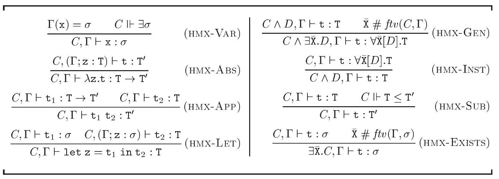

Figure 1-7: Typing rules for $\operatorname{HM}(X)$

图1-7：$\operatorname{HM}(X)$ 的输入规则

syntax, but only on the meaning of its constraint assumption. We enforce this point of view by considering judgements equal modulo equivalence of their constraint assumptions. In other words, the typing judgements $C, \Gamma \vdash \mathrm{t}: \sigma$ and $D, \Gamma \vdash \mathrm{t}: \sigma$ are considered identical when $C \equiv D$ holds. As a result, it does not make sense to analyze the syntax of a judgement's constraint assumption. A judgement is valid, or holds, if and only if it is derivable via the rules given in Figure 1-7. Please note that a valid judgement may involve an unsatisfiable constraint. A program t is well-typed within the environment $\Gamma$ if and only if a judgement of the form $C, \Gamma \vdash \mathrm{t}: \sigma$ holds for some satisfiable constraint $C$.

语法，但仅限于其约束假设的意义。我们通过认为在约束假设等价的情况下，判断是相等的来强化这一观点。换句话说，类型判断 $C, \Gamma \vdash \mathrm{t}: \sigma$ 和 $D, \Gamma \vdash \mathrm{t}: \sigma$ 被认为是相同的，当 $C \equiv D$ 成立时。因此，分析判断的约束假设的语法是没有意义的。一个判断是有效的，或者成立，当且仅当它是通过图1-7中给出的规则可推导的。请注意，一个有效的判断可能涉及一个不可满足的约束。一个程序 t 在环境 $\Gamma$ 中是良好类型的，当且仅当存在某个可满足的约束 $C$ 使得形如 $C, \Gamma \vdash \mathrm{t}: \sigma$ 的判断成立。

Let us now explain the rules. Like DM-VAR, HMX-VAR looks up the environment to determine the type scheme associated with the program identifier $\mathrm{x}$. The constraint $C$ that appears in the conclusion must be strong enough to guarantee that $\sigma$ has an instance; this is expressed by the second premise. This technical requirement is used in the proof of Lemma 1.4.1. HMX-ABS, HMX-APP, and HMX-LET are identical to DM-ABS, DM-APP, and DM-LET, respectively, except that the assumption $C$ is made available to every subderivation. We recall that the type $\mathrm{T}$ may be viewed as the type scheme $\forall \varnothing$ [true].T (Definitions 1.2.18 and 1.3.2). As a result, types form a subset of type schemes, which implies that $\Gamma ; z: \mathrm{T}$ is a well-formed environment and $C, \Gamma \vdash \mathrm{t}: \mathrm{T}$ a well-formed typing judgement. To understand HMX-GEN, it is best to first consider the particular case where $C$ is true. This yields the following, simpler rule:

让我们现在解释规则。与DM-VAR类似，HMX-VAR查找环境以确定与程序标识符$x$关联的类型方案。结论中出现的约束$C$必须足够强，以确保$\sigma$有一个实例；这是由第二个前提表达的。这个技术要求用于引理1.4.1的证明中。HMX-ABS、HMX-APP和HMX-LET分别与DM-ABS、DM-APP和DM-LET相同，不同之处在于假设$C$对每个子推导都是可用的。我们回忆一下，类型$\mathrm{T}$可以被视为类型方案$\forall \varnothing$ [真]。T（定义1.2.18和1.3.2）。因此，类型是类型方案的一个子集，这意味着$\Gamma ; z: \mathrm{T}$是一个良好形成的环境，$C, \Gamma \vdash \mathrm{t}: \mathrm{T}$是一个良好形成的类型判断。为了理解HMX-GEN，最好先考虑$C$为真的特殊情况。这产生了以下更简单的规则：

$$
\begin{equation*}
\frac{D, \Gamma \vdash \mathrm{t}: \mathrm{T} \quad \overline{\mathrm{x}} \# f t v(\Gamma)}{\exists \overline{\mathrm{x}} \cdot D, \Gamma \vdash \mathrm{t}: \forall \overline{\mathrm{X}}[D] . \mathrm{T}} \tag{HMX-GEN'}
\end{equation*}
$$

The second premise is identical to that of DM-GEN: the type variables that are generalized must not occur free within the environment. The conclusion forms the type scheme $\forall \overline{\mathrm{X}}[D]$.T, where the type variables $\overline{\mathrm{X}}$ have become universally quantified, but are still subject to the constraint $D$. Please note that the type variables that occur free in $D$ may include not only $\overline{\mathrm{X}}$, but also other type variables, typically free in $\Gamma$. The rule's conclusion carries the constraint $\exists \overline{\mathrm{X}} . D$, thus recording the requirement that the newly formed type scheme should have an instance; again, this is used in the proof of Lemma 1.4.1. HMX-GEN may be viewed as a more liberal version of HMX-GEN', whereby part of the current constraint, namely $C$, need not be copied if it does not concern the type variables that are being generalized, namely $\overline{\mathrm{X}}$. This optimization is important in practice, because $C$ may be very large. An intuitive explanation for its correctness is given by the constraint equivalence law $\mathrm{C}$ LETAND, which expresses the same optimization in terms of let constraints. Because $\operatorname{HM}(X)$ does not use let constraints, the optimization is hard-wired into the typing rule. HMX-INST allows taking an instance of a type scheme. The reader may be surprised to find that, contrary to DM-INST, it does not involve a type substitution. Instead, the rule merely drops the universal quantifier, which amounts to applying the identity substitution $\overrightarrow{\mathrm{X}} \mapsto \overrightarrow{\mathrm{X}}$. One should recall, however, that type schemes are considered equal modulo $\alpha$-conversion, so it is possible to rename the type scheme's universal quantifiers prior to using HMX-INST. The reason why this provides sufficient expressive power appears in the proof of Theorem 1.4.7 below. The constraint $D$ carried by the type scheme is recorded as part of the current constraint in HMX-INST's conclusion. The subsumption rule HMX-SUB allows a type $\mathrm{T}$ to be replaced at any time with an arbitrary supertype $\mathrm{T}^{\prime}$. Because both $\mathrm{T}$ and $\mathrm{T}^{\prime}$ may have free type variables, whether $\mathrm{T} \leq \mathrm{T}^{\prime}$ holds depends on the current assumption $C$, which is why the rule's second premise is an entailment assertion. An operational explanation of HMX-SUB is that it requires all uses of subsumption to be explicitly recorded in the current constraint. Please note that HMX-SUB remains a useful and necessary rule even when subtyping is interpreted as equality: then, it allows exploiting the type equations found in $C$. Last, HMXEXISTS allows the type variables that occur only within the current constraint to become existentially quantified. As a result, these type variables no longer occur free in the rule's conclusion; in other words, they have become local to the subderivation rooted at the premise. One may prove that the presence of HMX-EXISTS in the type system does not augment the set of well-typed programs, but does augment the set of valid typing judgements; it is a pleasant technical convenience. Indeed, because judgements are considered equal modulo constraint equivalence, constraints may be transparently simplified at any time. (By simplifying a constraint, we mean replacing it with an equiva-
lent constraint whose syntactic representation is considered simpler.) Bearing this fact in mind, one finds that an effect of rule HMX-Exists is to enable more simplifications: because constraint equivalence is a congruence, $C \equiv D$ implies $\exists \overline{\mathrm{X}} . C \equiv \exists \overline{\mathrm{X}} . D$, but the converse does not hold in general. For instance, there is in general no way of simplifying the judgement $\mathrm{X} \leq \mathrm{Y} \leq \mathrm{Z}, \Gamma \vdash \mathrm{t}: \sigma$, but if it is known that $\mathrm{Y}$ does not appear free in $\Gamma$ or $\sigma$, then HMX-EXISTS allows deriving $\exists \mathrm{Y} .(\mathrm{X} \leq \mathrm{Y} \leq \mathrm{Z}), \Gamma \vdash \mathrm{t}: \sigma$, which is the same judgement as $\mathrm{x} \leq \mathrm{Z}, \Gamma \vdash \mathrm{t}: \sigma$. Thus, an interesting simplification has been enabled. Please note that $\mathrm{X} \leq \mathrm{Y} \leq \mathrm{Z} \equiv \mathrm{X} \leq \mathrm{Z}$ does not hold, while, according to C-ExTRans, $\exists \mathrm{Y}$. $\mathrm{X} \leq \mathrm{Y} \leq \mathrm{Z}) \equiv \mathrm{X} \leq \mathrm{Z}$ does.

第二个前提与DM-GEN相同：被泛化的类型变量不能在环境中自由出现。结论形成类型方案 $\forall \overline{\mathrm{X}}[D]$.T，其中类型变量$\overline{\mathrm{X}}$已经普遍量化，但仍然受到约束$D$的限制。请注意，在$D$中自由出现的类型变量可能不仅包括$\overline{\mathrm{X}}$，还包括在$\Gamma$中通常自由的其他类型变量。规则的结论带有约束$\exists \overline{\mathrm{X}} . D$，从而记录了新形成的类型方案应该有一个实例的要求；这同样用于引理1.4.1的证明中。HMX-GEN可以被视为HMX-GEN'的一个更宽松版本，其中当前约束的一部分，即$C$，如果它不关心正在泛化的类型变量，即$\overline{\mathrm{X}}$，则不需要复制。这种优化在实践中很重要，因为$C$可能非常大。其正确性的直观解释由约束等价法则$\mathrm{C}$ LETAND给出，该法则以let约束的术语表达了相同的优化。因为$\operatorname{HM}(X)$不使用let约束，所以优化被硬编码到类型规则中。HMX-INST允许取类型方案的实例。读者可能会惊讶地发现，与DM-INST相反，它并不涉及类型替换。相反，规则只是去掉普遍量化符，这等同于应用恒等替换$\overrightarrow{\mathrm{X}} \mapsto \overrightarrow{\mathrm{X}}$。然而，应该记住，类型方案被认为在$\alpha$-转换下是相等的，因此在使用HMX-INST之前，可以重命名类型方案的普遍量化符。这样做足够表达力的原因在下面的定理1.4.7的证明中出现。类型方案携带的约束$D$作为HMX-INST结论中当前约束的一部分被记录下来。子类型规则HMX-SUB允许在任何时候用任意超类型$\mathrm{T}^{\prime}$替换类型$\mathrm{T}$。因为$\mathrm{T}$和$\mathrm{T}^{\prime}$都可能含有自由类型变量，所以$\mathrm{T} \leq \mathrm{T}^{\prime}$是否成立取决于当前假设$C$，这就是规则第二个前提是一个蕴含断言的原因。HMX-SUB的操作解释是，它要求所有子类型的使用都必须显式记录在当前约束中。请注意，即使将子类型解读为等价，HMX-SUB仍然是一个有用且必要的规则：然后，它允许利用在$C$中找到的类型方程。最后，HMXEXISTS允许在当前约束中出现的类型变量成为存在性量化。结果，这些类型变量不再在规则的结论中自由出现；换句话说，它们变成了以前提为根的子推导的局部变量。可以证明，类型系统中存在HMX-EXISTS不会增加良好类型程序集，但会增加有效类型判断集；这是一种令人愉快的技术便利。实际上，由于判断被认为在约束等价下是相等的，因此可以在任何时间透明地简化约束。（通过简化约束，我们的意思是将其替换为在句法表示上被认为更简单的等价约束。）考虑到这一点，发现规则HMX-Exists的一个效果是启用更多的简化：因为约束等价是一个同态，$C \equiv D$意味着$\exists \overline{\mathrm{X}} . C \equiv \exists \overline{\mathrm{X}} . D$，但反之通常不成立。例如，通常无法简化判断$\mathrm{X} \leq \mathrm{Y} \leq \mathrm{Z}, \Gamma \vdash \mathrm{t}: \sigma$，但如果已知$\mathrm{Y}$在$\Gamma$或$\sigma$中没有自由出现，那么HMX-EXISTS允许推导出$\exists \mathrm{Y} .(\mathrm{X} \leq \mathrm{Y} \leq \mathrm{Z}), \Gamma \vdash \mathrm{t}: \sigma$，这与$\mathrm{x} \leq \mathrm{Z}, \Gamma \vdash \mathrm{t}: \sigma$的判断相同。因此，已经启用了有趣的简化。请注意，$\mathrm{X} \leq \mathrm{Y} \leq \mathrm{Z} \equiv \mathrm{X} \leq \mathrm{Z}$不成立，而根据C-ExTRans，$\exists \mathrm{Y}$. $\mathrm{X} \leq \mathrm{Y} \leq \mathrm{Z}) \equiv \mathrm{X} \leq \mathrm{Z}$是成立的。

We now establish a few simple properties of the type system $\operatorname{HM}(X)$. Our first lemma is a minor technical property.

我们现将建立类型系统 $\operatorname{HM}(X)$ 的几个简单性质。我们的第一个引理是一个小的技术性质。

1.4.1 Lemma: $C, \Gamma \vdash \mathrm{t}: \sigma$ implies $C \Vdash \exists \sigma$.

1.4.1 引理：如果 $C, \Gamma \vdash \mathrm{t}: \sigma$，那么 $C \Vdash \exists \sigma$。

The next lemma states that strengthening a judgement's constraint assumption preserves its validity. In other words, weakening a judgement preserves its validity. It is worth noting that in traditional presentations, which rely more heavily on type substitutions, the analogue of this result is a type substitution lemma; see for instance (Tofte, 1988, Lemma 2.7), (Leroy, 1992, Proposition 1.2), (Skalka and Pottier, 2002, Lemma 3.4). Here, the lemma further states that weakening a judgement does not alter the shape of its derivation, a useful property when reasoning by induction on type derivations.

下一个引理表明，加强判断的约束假设保持其有效性。换句话说，弱化判断保持其有效性。值得注意的是，在更依赖于类型替换的传统表述中，这一结果的类比是一个类型替换引理；例如参见（Tofte，1988，引理2.7），（Leroy，1992，命题1.2），（Skalka和Pottier，2002，引理3.4）。在这里，该引理进一步指出，弱化判断不会改变其推导的形状，在通过类型推导进行归纳推理时这是一个有用的性质。

1.4.2 Lemma [Weakening]: If $C^{\prime} \Vdash C$, then every derivation of $C, \Gamma \vdash \mathrm{t}: \sigma$ may be turned into a derivation of $C^{\prime}, \Gamma \vdash \mathrm{t}: \sigma$ with the same shape.

1.4.2 引理[弱化]：如果 $C^{\prime} \Vdash C$，那么每个 $C, \Gamma \vdash \mathrm{t}: \sigma$ 的推导都可以转换成具有相同结构的 $C^{\prime}, \Gamma \vdash \mathrm{t}: \sigma$ 的推导。

Proof: The proof is by structural induction on a derivation of $C, \Gamma \vdash \mathrm{t}: \sigma$. In each proof case, we adopt the notations of Figure 1-7.

证明：证明是对 $C, \Gamma \vdash \mathrm{t}: \sigma$ 的推导进行结构归纳。在每个证明情形中，我们采用图1-7中的记号。

- Case HMX-VAR. The rule's conclusion is $C, \Gamma \vdash \mathrm{x}: \sigma$. Its premises are $\Gamma(\mathrm{x})=\sigma$ (1) and $C \Vdash \exists \sigma$ (2). By hypothesis, we have $C^{\prime} \Vdash C$ (3). By transitivity of entailment, (3) and (2) imply $C^{\prime} \Vdash \exists \sigma$ (4). By HMX-VAR, (1) and (4) yield $C^{\prime}, \Gamma \vdash \mathrm{x}: \sigma$.
- Cases HMX-ABS, HMX-App, HMX-LET. By the induction hypothesis and by HMX-ABS, HMX-APP, or HMX-LET, respectively.
- Case HMX-GEn. The rule's conclusion is $C \wedge \exists \overline{\mathrm{x}} . D, \Gamma \vdash \mathrm{t}: \forall \overline{\mathrm{x}}[D]$.T. Its premises are $C \wedge D, \Gamma \vdash \mathrm{t}: \mathrm{T}$ (1) and $\overline{\mathrm{x}} \# f t v(C, \Gamma)$ (2). By hypothesis, we have $C^{\prime} \Vdash C \wedge \exists \overline{\mathrm{X}} . D$ (3). We may assume, w.l.o.g., $\overline{\mathrm{X}} \# \mathrm{ftv}\left(C^{\prime}\right)$ (4). Applying the induction hypothesis to (1) and to the entailment assertion $C^{\prime} \wedge C \wedge D \Vdash C \wedge D$, we obtain $C^{\prime} \wedge C \wedge D, \Gamma \vdash \mathrm{t}: \mathrm{T}$ (5). By HMX-GEN, applied to (5), (2) and (4), we get $C^{\prime} \wedge C \wedge \exists \overline{\mathrm{x}} . D, \Gamma \vdash \mathrm{t}: \forall \overline{\mathrm{x}}[D] . \mathrm{T}$ (6). By (3) and C-Dup, the constraints $C^{\prime} \wedge C \wedge \exists \overline{\mathrm{x}} . D$ and $C^{\prime}$ are equivalent, so (6) is the goal $C^{\prime}, \Gamma \vdash \mathrm{t}: \forall \overline{\mathrm{x}}[D]$. .T.
- Case HmX-Inst. The rule's conclusion is $C \wedge D, \Gamma \vdash \mathrm{t}$ : T. Its premise is $C, \Gamma \vdash \mathrm{t}: \forall \overline{\mathrm{X}}[D] . \mathrm{T}$ (1). By hypothesis, $C^{\prime}$ entails $C \wedge D$ (2). Because (2) implies $C^{\prime} \Vdash C$, the induction hypothesis may be applied to (1), yielding $C^{\prime}, \Gamma \vdash \mathrm{t}: \forall \overline{\mathrm{x}}[D] . \mathrm{T}$ (3). By HmX-Inst, we obtain $C^{\prime} \wedge D, \Gamma \vdash \mathrm{t}: \mathrm{T}$ (4). Because (2) implies $C^{\prime} \equiv C^{\prime} \wedge D$, (4) is the goal $C^{\prime}, \Gamma \vdash \mathrm{t}: \mathrm{T}$.
- Case HmX-Sub. The rule's conclusion is $C, \Gamma \vdash \mathrm{t}: \mathrm{T}^{\prime}$. Its premises are $C, \Gamma \vdash \mathrm{t}: \mathrm{T}$ (1) and $C \Vdash \mathrm{T} \leq \mathrm{T}^{\prime}$ (2). By hypothesis, we have $C^{\prime} \Vdash C$ (3). Applying the induction hypothesis to (1) and (3) yields $C^{\prime}, \Gamma \vdash \mathrm{t}: \mathrm{T}$ (4). By transitivity of entailment, (3) and (2) imply $C^{\prime} \Vdash \mathrm{T} \leq \mathrm{T}^{\prime}$ (5). By HMX-SuB, (4) and (5) yield $C^{\prime}, \Gamma \vdash \mathrm{t}: \mathrm{T}^{\prime}$.
- Case HmX-Exists. The rule's conclusion is $\exists \overline{\mathrm{x}} . C, \Gamma \vdash \mathrm{t}: \sigma$. Its premises are $C, \Gamma \vdash \mathrm{t}: \sigma(\mathbf{1})$ and $\overline{\mathrm{x}} \# f t v(\Gamma, \sigma)(\mathbf{2})$. By hypothesis, we have $C^{\prime} \Vdash$ $\exists \overline{\mathrm{X}} . C$ (3). We may assume, w.l.o.g., $\overline{\mathrm{x}} \# \mathrm{ftv}\left(C^{\prime}\right)$ (4). Applying the induction hypothesis to (1) and to the entailment assertion $C^{\prime} \wedge C \Vdash C$, we obtain $C^{\prime} \wedge C, \Gamma \vdash \mathrm{t}: \sigma$ (5). By HmX-Exists, (5) and (2) yield $\exists \overline{\mathrm{X}} .\left(C^{\prime} \wedge C\right), \Gamma \vdash$ $\mathrm{t}: \sigma$ (6). By (4) and C-ExAnd, the constraint $\exists \overline{\mathrm{X}}$. $\left(C^{\prime} \wedge C\right)$ is equivalent to $C^{\prime} \wedge \exists \overline{\mathrm{X}}$. $C$, which, by (3) and C-Dup, is equivalent to $C^{\prime}$. Thus, (6) is the goal $C^{\prime}, \Gamma \vdash \mathrm{t}: \sigma$.

- 情形HMX-VAR。该规则的结论是$C, \Gamma \vdash \mathrm{x}: \sigma$。它的前提是$\Gamma(\mathrm{x})=\sigma$（1）和$C \Vdash \exists \sigma$（2）。根据假设，我们有$C^{\prime} \Vdash C$（3）。通过蕴含的传递性，（3）和（2）意味着$C^{\prime} \Vdash \exists \sigma$（4）。根据HMX-VAR，（1）和（4）得出$C^{\prime}, \Gamma \vdash \mathrm{x}: \sigma$。
- 情形HMX-ABS、HMX-App、HMX-LET。根据归纳假设，分别根据HMX-ABS、HMX-APP或HMX-LET。
- 情形HMX-GEn。该规则的结论是$C \wedge \exists \overline{\mathrm{x}} . D, \Gamma \vdash \mathrm{t}: \forall \overline{\mathrm{x}}[D]$.T。它的前提是$C \wedge D, \Gamma \vdash \mathrm{t}: \mathrm{T}$（1）和$\overline{\mathrm{x}} \# f t v(C, \Gamma)$（2）。根据假设，我们有$C^{\prime} \Vdash C \wedge \exists \overline{\mathrm{X}} . D$（3）。我们可以假设，不失一般性，$\overline{\mathrm{X}} \# \mathrm{ftv}\left(C^{\prime}\right)$（4）。将归纳假设应用于（1）和蕴含断言$C^{\prime} \wedge C \wedge D \Vdash C \wedge D$，我们得到$C^{\prime} \wedge C \wedge D, \Gamma \vdash \mathrm{t}: \mathrm{T}$（5）。通过将HMX-GEN应用于（5）、（2）和（4），我们得到$C^{\prime} \wedge C \wedge \exists \overline{\mathrm{x}} . D, \Gamma \vdash \mathrm{t}: \forall \overline{\mathrm{x}}[D] . \mathrm{T}$（6）。根据（3）和C-Dup，约束$C^{\prime} \wedge C \wedge \exists \overline{\mathrm{x}} . D$和$C^{\prime}$是等价的，所以（6）是目标$C^{\prime}, \Gamma \vdash \mathrm{t}: \forall \overline{\mathrm{x}}[D]$.T。
- 情形HmX-Inst。该规则的结论是$C \wedge D, \Gamma \vdash \mathrm{t}$ : T。它的前提是$C, \Gamma \vdash \mathrm{t}: \forall \overline{\mathrm{X}}[D] . \mathrm{T}$（1）。根据假设，$C^{\prime}$蕴含$C \wedge D$（2）。因为（2）意味着$C^{\prime} \Vdash C$，归纳假设可以应用于（1），得出$C^{\prime}, \Gamma \vdash \mathrm{t}: \forall \overline{\mathrm{x}}[D] . \mathrm{T}$（3）。通过HmX-Inst，我们得到$C^{\prime} \wedge D, \Gamma \vdash \mathrm{t}: \mathrm{T}$（4）。因为（2）意味着$C^{\prime} \equiv C^{\prime} \wedge D$，（4）是目标$C^{\prime}, \Gamma \vdash \mathrm{t}: \mathrm{T}$。
- 情形HmX-Sub。该规则的结论是$C, \Gamma \vdash \mathrm{t}: \mathrm{T}^{\prime}$。它的前提是$C, \Gamma \vdash \mathrm{t}: \mathrm{T}$（1）和$C \Vdash \mathrm{T} \leq \mathrm{T}^{\prime}$（2）。根据假设，我们有$C^{\prime} \Vdash C$（3）。将归纳假设应用于（1）和（3）得出$C^{\prime}, \Gamma \vdash \mathrm{t}: \mathrm{T}$（4）。通过蕴含的传递性，（3）和（2）意味着$C^{\prime} \Vdash \mathrm{T} \leq \mathrm{T}^{\prime}$（5）。根据HMX-SuB，（4）和（5）得出$C^{\prime}, \Gamma \vdash \mathrm{t}:

We do not give a direct type soundness proof for $\operatorname{HM}(X)$. Instead, in section 1.5 , we prove that it is equivalent to another type system, which later is itself proven sound. A direct type soundness result, based on a denotational semantics, may be found in (Odersky, Sulzmann, and Wehr, 1999a). Another type soundness proof, which follows Wright and Felleisen's syntactic approach (1994b), appears in (Skalka and Pottier, 2002). Last, a hybrid approach, which combines some of the advantages of the previous two, is given in (Pottier, 2001a).

我们不直接为 $\operatorname{HM}(X)$ 提供类型健全性的证明。相反，在1.5节中，我们证明了它与另一个类型系统等价，后者本身后来被证明是健全的。基于语义定义的直接类型健全性结果可以在（Odersky, Sulzmann, 和 Wehr, 1999a）中找到。另一种遵循 Wright 和 Felleisen（1994b）句法方法的类型健全性证明出现在（Skalka 和 Pottier, 2002）中。最后，在（Pottier, 2001a）中提出了一种混合方法，该方法结合了前两种方法的一些优点。

## An alternate presentation of $\mathrm{HM}(\boldsymbol{X})$

## $\mathrm{HM}(\boldsymbol{X})$ 的另一种呈现方式

The presentation of $\mathrm{HM}(X)$ given in Figure 1-7 has only four syntax-directed rules out of eight. It is a good specification of the type system, but it is far from an algorithmic description. As a first step towards such a description, we provide an alternate presentation of $\operatorname{HM}(X)$, where generalization is performed only at let expressions and instantiation takes place only at references to program identifiers (Figure 1-8). It has the property that all judgements are of the form $C, \Gamma \vdash \mathrm{t}: \mathrm{T}$, rather than $C, \Gamma \vdash \mathrm{t}: \sigma$. The following theorem states that the two presentations are indeed equivalent.

图1-7中给出的$\mathrm{HM}(X)$的呈现只有八条语法指导规则中的四条。它是类型系统的一个很好的规范，但远不是一个算法描述。作为朝向这种描述的第一步，我们提供了$\operatorname{HM}(X)$的另一种呈现，其中泛化只在let表达式中执行，而实例化只发生在对程序标识符的引用处（图1-8）。它的特点是所有判断都具有形式$C, \Gamma \vdash \mathrm{t}: \mathrm{T}$，而不是$C, \Gamma \vdash \mathrm{t}: \sigma$。以下定理说明这两种呈现实际上是等价的。

1.4.3 Theorem: $C, \Gamma \vdash \mathrm{t}: \mathrm{T}$ is derivable via the rules of Figure 1-8 if and only if it is a valid $\operatorname{HM}(X)$ judgement.

1.4.3 定理：如果且仅当 $C, \Gamma \vdash \mathrm{t}: \mathrm{T}$ 可以通过图1-8的规则推导出来，那么它是一个有效的 $\operatorname{HM}(X)$ 判断。

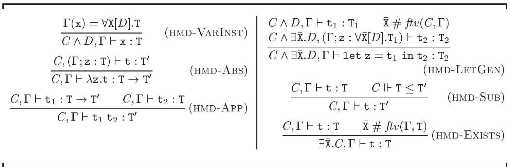

Figure 1-8: An alternate presentation of $\mathbf{H M}(X)$

图1-8：$\mathbf{H M}(X)$ 的另一种表示方式

This theorem shows that the rule sets of Figures 1-7 and 1-8 derive the same monomorphic judgements, that is, the same judgements of the form $C, \Gamma \vdash \mathrm{t}: \mathrm{T}$. The fact that judgements of the form $C, \Gamma \vdash \mathrm{t}: \sigma$, where $\sigma$ is a not a monotype, cannot be derived using the new rule set is a technical simplification, without deep significance; the first two exercises below shed some light on this issue.

这个定理表明，图1-7和1-8的规则集导出相同的单态判断，即形式为 $C, \Gamma \vdash \mathrm{t}: \mathrm{T}$ 的相同判断。事实上，不能使用新的规则集推导出形式为 $C, \Gamma \vdash \mathrm{t}: \sigma$ 的判断，其中 $\sigma$ 不是一个单型，这只是一个技术上的简化，并没有深远的意义；下面前两个练习对这个议题提供了一些启示。

1.4.4 EXERCISE $[\star \star]$ : Show that both rule sets lead to the same set of well-typed programs.

1.4.4 练习 $[**]$ ：证明这两个规则集导致相同的类型正确程序集合。

1.4.5 ExERcISE $[\star \star$ ]: Show that, if HMX-GEN is added to the rule set of Figure 18 , then both rule sets derive exactly the same judgements.

1.4.5练习[$\star \star$]：证明，如果将HMX-GEN添加到图18的规则集中，那么这两个规则集将得出完全相同的判断。

1.4.6 EXERCISE $[\star \star \star, \nrightarrow]$ : Show that it is possible to simplify the presentation of Damas and Milner's type system in an analogous manner. That is, define an alternate set of typing rules for DM, which allows deriving judgements of the form $\Gamma \vdash \mathrm{t}: \mathrm{T}$; then, show that this new rule set is equivalent to the previous one, in the same sense as above. Which auxiliary properties of DM does your proof require? A solution is given in (Clément, Despeyroux, Despeyroux, and Kahn, 1986).

1.4.6 练习 $[\star \star \star, \nrightarrow]$ ：证明可以以类似的方式简化Damas和Milner的类型系统的呈现。即，为DM定义一组替代的类型规则，这组规则允许推导出形如 $\Gamma \vdash \mathrm{t}: \mathrm{T}$ 的判断；然后，证明这个新规则集与之前的规则集是等价的，如上所述。你的证明需要DM的哪些辅助性质？一个解决方案在（Clément, Despeyroux, Despeyroux, 和 Kahn, 1986）中给出。

## Relating $\mathrm{HM}(X)$ with Damas and Milner's type system

## 将 $\mathrm{HM}(X)$ 与Damas和Milner的类型系统相关联

In order to explain our interest in $\operatorname{HM}(X)$, we wish to show that it is more general than Damas and Milner's type system. Since $\operatorname{HM}(X)$ really is a family of type systems, we must make this statement more precise. First, every member of the $\mathrm{HM}(X)$ family contains DM. Conversely, DM contains $\mathrm{HM}(=)$, the
constraint-based type system obtained by specializing $\operatorname{HM}(X)$ to the setting of an equality-only syntactic model.

为了解释我们对$\operatorname{HM}(X)$的兴趣，我们希望展示它比Damas和Milner的类型系统更具普遍性。由于$\operatorname{HM}(X)$实际上是一系列类型系统的家族，我们必须使这个陈述更精确。首先，$\mathrm{HM}(X)$家族的每个成员都包含DM。相反，DM包含$\mathrm{HM}(=)$，这是通过将$\operatorname{HM}(X)$专门化为仅基于等式的语法模型设置而获得的基于约束的类型系统。

The first of these assertions is easy to prove, because the mapping from DM judgements to $\operatorname{HM}(X)$ judgements is essentially the identity: every valid DM judgement may be viewed as a valid $\operatorname{HM}(X)$ judgement under the trivial assumption true. This statement relies on the fact that the DM type scheme $\forall \overline{\mathrm{X}}$. $\mathrm{T}$ is identified with the constrained type scheme $\forall \overline{\mathrm{X}}$ [true].T, so DM type schemes (resp. environments) form a subset of $\operatorname{HM}(X)$ type schemes (resp. environments). Its proof is routine, except perhaps in the case of DM-INST, where it is shown how the effect of applying a substitution in DM is emulated by strengthening the current constraint in $\operatorname{HM}(X)$.

这些主张中的第一个很容易证明，因为从DM判断到$\operatorname{HM}(X)$判断的映射实质上是身份映射：在真实假设下，每个有效的DM判断都可以被视为有效的$\operatorname{HM}(X)$判断。这一说法依赖于这样一个事实，即DM类型方案$\forall \overline{\mathrm{X}}$。$\mathrm{T}$与受限类型方案$\forall \overline{\mathrm{X}}$ [true]。T相同，因此DM类型方案（相应地，环境）是$\operatorname{HM}(X)$类型方案（相应地，环境）的一个子集。其证明是例行的，除了可能在DM-INST的情况下，其中展示了在DM中应用替换的效果是如何通过在$\operatorname{HM}(X)$中加强当前约束来模拟的。

1.4.7 Theorem: If $\Gamma \vdash \mathrm{t}: \mathrm{S}$ holds in $\mathrm{DM}$, then true, $\Gamma \vdash \mathrm{t}: \mathrm{S}$ holds in $\operatorname{HM}(X)$.

1.4.7 定理：如果在DM中成立 $\Gamma \vdash \mathrm{t}: \mathrm{S}$，那么在 $\operatorname{HM}(X)$ 中也成立 $\Gamma \vdash \mathrm{t}: \mathrm{S}$。

Proof: The proof is by structural induction on a derivation of $\Gamma \vdash t: S$. In each proof case, we adopt the notations of Figure 1-3.

证明：证明是对 $\Gamma \vdash t: S$ 的推导进行结构归纳。在每个证明情形中，我们采用图1-3中的记号。

- Case DM-VAR. The rule's conclusion is $\Gamma \vdash \mathrm{x}: \mathrm{S}$. Its premise is $\Gamma(\mathrm{x})=$ $\mathrm{S}$ (1). By definition and by $\mathrm{C}-\mathrm{Ex} *$, the constraint $\exists \mathrm{S}$ is equivalent to true. By applying HMX-VAR to (1) and to the assertion true $\Vdash$ true, we obtain true, $\Gamma \vdash \mathrm{x}: \mathrm{S}$.
- Cases DM-ABS, DM-ApP, DM-LET. By the induction hypothesis and by HMX-ABS, HMX-APP or HMX-LET, respectively.

- 案例DM-VAR。规则的结论是 $\Gamma \vdash \mathrm{x}: \mathrm{S}$。其前提是 $\Gamma(\mathrm{x})=$ $\mathrm{S}$ (1)。根据定义和 $\mathrm{C}-\mathrm{Ex} *$，约束 $\exists \mathrm{S}$ 等价于真。将HMX-VAR应用于(1)和真 $\Vdash$ 真的断言，我们得到真，$\Gamma \vdash \mathrm{x}: \mathrm{S}$。
- 案例DM-ABS，DM-ApP，DM-LET。根据归纳假设以及分别对应的HMX-ABS，HMX-APP或HMX-LET。

$\circ$ Case DM-GEn. The rule's conclusion is $\Gamma \vdash \mathrm{t}: \forall \overline{\mathrm{x}}$.T. Its premises are $\Gamma \vdash \mathrm{t}: \mathrm{T}(\mathbf{1})$ and $\overline{\mathrm{X}} \# \mathrm{ftv}(\Gamma)$ (2). Applying the induction hypothesis to (1) yields true, $\Gamma \vdash \mathrm{t}: \mathrm{T}$ (3). Furthermore, (2) implies $\overline{\mathrm{X}} \# \mathrm{ftv}(\mathrm{true}, \Gamma)$ (4). By HMX-GEN, (3) and (4) yield true, $\Gamma \vdash \mathrm{t}: \forall \overline{\mathrm{x}}[$ true].T.

情形DM-GEn。规则的结论是 $\Gamma \vdash \mathrm{t}: \forall \overline{\mathrm{x}}$.T。它的前提是 $\Gamma \vdash \mathrm{t}: \mathrm{T}(\mathbf{1})$ 和 $\overline{\mathrm{X}} \# \mathrm{ftv}(\Gamma)$ (2)。将归纳假设应用于(1)得到真，$\Gamma \vdash \mathrm{t}: \mathrm{T}$ (3)。此外，(2)意味着 $\overline{\mathrm{X}} \# \mathrm{ftv}(\mathrm{true}, \Gamma)$ (4)。根据HMX-GEN，(3)和(4)得出真，$\Gamma \vdash \mathrm{t}: \forall \overline{\mathrm{x}}[$ true].T。

- Case Dm-Inst. The rule's conclusion is $\Gamma \vdash \mathrm{t}:[\overrightarrow{\mathrm{x}} \mapsto \overrightarrow{\mathrm{T}}] \mathrm{T}$. Its premise is $\Gamma \vdash \mathrm{t}: \forall \overline{\mathrm{X}} . \mathrm{T}$ (1). We may assume, w.l.o.g., $\overline{\mathrm{X}} \# \mathrm{ftv}(\Gamma, \overline{\mathrm{T}})$ (2). Applying the induction hypothesis to (1) yields true, $\Gamma \vdash \mathrm{t}: \forall \overline{\mathrm{X}}[$ true].T (3). By HMXInst, (3) implies true, $\Gamma \vdash \mathrm{t}: \mathrm{T}$ (4). By Lemma 1.4.2, we may weaken this judgement so as to obtain $\overrightarrow{\mathrm{x}}=\overrightarrow{\mathrm{T}}, \Gamma \vdash \mathrm{t}: \mathrm{T}$ (5). Using C-EQ, C-ExTrans, and C-ExAnd, it is possible to establish $\overrightarrow{\mathrm{X}}=\overrightarrow{\mathrm{T}} \Vdash \mathrm{T}=[\overrightarrow{\mathrm{X}} \mapsto \overrightarrow{\mathrm{T}}] \mathrm{T}$ (6). Applying HMX-SuB to (5) and (6), we find $\overrightarrow{\mathrm{x}}=\overrightarrow{\mathrm{T}}, \Gamma \vdash \mathrm{t}:[\overrightarrow{\mathrm{X}} \mapsto \overrightarrow{\mathrm{T}}] \mathrm{T}$ (7). Last, (2) implies $\overline{\mathrm{X}} \# f t v(\Gamma,[\overrightarrow{\mathrm{X}} \mapsto \overrightarrow{\mathrm{T}}] \mathrm{T})$ (8). Applying HMX-EXisTs to (7) and (8), we obtain $\exists \overline{\mathrm{X}} .(\overrightarrow{\mathrm{X}}=\overrightarrow{\mathrm{T}}), \Gamma \vdash \mathrm{t}:[\overrightarrow{\mathrm{X}} \mapsto \overrightarrow{\mathrm{T}}] \mathrm{T}$ (9). By (2) and C-NAME, the constraint $\exists \overline{\mathrm{X}} .(\overrightarrow{\mathrm{X}}=\overrightarrow{\mathrm{T}})$ is equivalent to true, so (9) is the goal.

- 案例Dm-Inst。规则的结论是 $\Gamma \vdash \mathrm{t}:[\overrightarrow{\mathrm{x}} \mapsto \overrightarrow{\mathrm{T}}] \mathrm{T}$。它的前提是 $\Gamma \vdash \mathrm{t}: \forall \overline{\mathrm{X}} . \mathrm{T}$ (1)。我们可以假设，不失一般性，$\overline{\mathrm{X}} \# \mathrm{ftv}(\Gamma, \overline{\mathrm{T}})$ (2)。将归纳假设应用于(1)得到真，$\Gamma \vdash \mathrm{t}: \forall \overline{\mathrm{X}}[$ 真].T (3)。根据HMXInst，(3)意味着真，$\Gamma \vdash \mathrm{t}: \mathrm{T}$ (4)。根据引理1.4.2，我们可以弱化这个判断，以便得到 $\overrightarrow{\mathrm{x}}=\overrightarrow{\mathrm{T}}, \Gamma \vdash \mathrm{t}: \mathrm{T}$ (5)。使用C-EQ，C-ExTrans和C-ExAnd，可以建立 $\overrightarrow{\mathrm{X}}=\overrightarrow{\mathrm{T}} \Vdash \mathrm{T}=[\overrightarrow{\mathrm{X}} \mapsto \overrightarrow{\mathrm{T}}] \mathrm{T}$ (6)。将HMX-SuB应用于(5)和(6)，我们得到 $\overrightarrow{\mathrm{x}}=\overrightarrow{\mathrm{T}}, \Gamma \vdash \mathrm{t}:[\overrightarrow{\mathrm{X}} \mapsto \overrightarrow{\mathrm{T}}] \mathrm{T}$ (7)。最后，(2)意味着 $\overline{\mathrm{X}} \# f t v(\Gamma,[\overrightarrow{\mathrm{X}} \mapsto \overrightarrow{\mathrm{T}}] \mathrm{T})$ (8)。将HMX-EXisTs应用于(7)和(8)，我们得到 $\exists \overline{\mathrm{X}} .(\overrightarrow{\mathrm{X}}=\overrightarrow{\mathrm{T}}), \Gamma \vdash \mathrm{t}:[\overrightarrow{\mathrm{X}} \mapsto \overrightarrow{\mathrm{T}}] \mathrm{T}$ (9)。根据(2)和C-NAME，约束 $\exists \overline{\mathrm{X}} .(\overrightarrow{\mathrm{X}}=\overrightarrow{\mathrm{T}})$ 等价于真，所以(9)是目标。

We are now interested in proving that $\mathrm{HM}(=)$, as defined above, is contained within DM. To this end, we must translate every $\mathrm{HM}(=)$ judgement to a DM judgement. It quickly turns out that this is possible if the original judgement's constraint assumption is satisfiable.

我们目前感兴趣的是证明上面定义的$\mathrm{HM}(=)$包含在DM中。为此，我们必须将每个$\mathrm{HM}(=)$判断翻译成DM判断。很快就会发现，如果原始判断的约束假设是可以满足的，那么这是可能的。

We begin by explaining how an $\mathrm{HM}(=)$ is translated into a DM type scheme. Such a translation is made possible by the fact that the definition of $\operatorname{HM}(=)$ assumes an equality-only syntactic model. Indeed, in that setting, every satisfiable constraint admits a most general unifier (Definition 1.3.41), whose properties we make essential use of.

我们首先解释如何将$\mathrm{HM}(=)$翻译成DM类型方案。这样的翻译之所以可能，是因为$\operatorname{HM}(=)$的定义假设了一个仅包含等式的语法模型。实际上，在这种设置中，每个可满足的约束都承认一个最一般的统一器（定义1.3.41），我们对其特性进行了充分利用。

In fact, we must not only translate a type scheme, but also apply a type substitution to it. Instead of separating these steps, we perform both at once, and parameterize the translation by a type substitution $\theta$. (It does not appear that separating them would help.) The definition of $\llbracket \sigma \rrbracket_{\theta}$ is somewhat involved: it is given in the statement of the following lemma, whose proof establishes that the definition is indeed well-formed.

事实上，我们不仅要翻译一个类型方案，还必须对其应用类型替换。不是将这两步分开进行，而是同时执行，并通过类型替换θ参数化翻译。（分开它们似乎并没有帮助。）θ下[σ]的定义有些复杂：它在本节以下引理的陈述中给出，该引理的证明确实证明了该定义是良好形成的。

1.4.8 Lemma: Consider a type scheme $\sigma$ and an idempotent type substitution $\theta$ such that $f t v(\sigma) \subseteq \operatorname{dom}(\theta)$ (1) and $\exists \theta \Vdash \exists \sigma$ (2). Write $\sigma=\forall \overline{\mathrm{x}}[D]$.T, where $\overline{\mathrm{x}} \# \theta$ (3). Then, there exists a type substitution $\theta^{\prime}$ such that $\theta^{\prime}$ extends $\theta, \operatorname{dom}\left(\theta^{\prime}\right)$ is $\operatorname{dom}(\theta) \cup \overline{\mathrm{X}}$, and $\theta^{\prime}$ is a most general unifier of $\exists \theta \wedge D$. Let $\overline{\mathrm{Y}}=f \operatorname{tv}\left(\theta^{\prime}(\overline{\mathrm{X}})\right) \backslash \operatorname{range}(\theta)$. Then, the translation of $\sigma$ under $\theta$, written $\llbracket \sigma \rrbracket_{\theta}$, is the DM type scheme $\forall \overline{\mathrm{Y}} \cdot \theta^{\prime}(\mathrm{T})$. This is a well-formed definition. Furthermore, $f t v\left(\llbracket \sigma \rrbracket_{\theta}\right) \subseteq \operatorname{range}(\theta)$ holds.

1.4.8 引理：考虑一个类型方案 $\sigma$ 和一个幂等类型替换 $\theta$ ，使得 $f t v(\sigma) \subseteq \operatorname{dom}(\theta)$ （1）且 $\exists \theta \Vdash \exists \sigma$ （2）。记 $\sigma=\forall \overline{\mathrm{x}}[D]$.T，其中 $\overline{\mathrm{x}} \# \theta$ （3）。那么，存在一个类型替换 $\theta^{\prime}$ 使得 $\theta^{\prime}$ 扩展 $\theta$ ，$\operatorname{dom}\left(\theta^{\prime}\right)$ 是 $\operatorname{dom}(\theta) \cup \overline{\mathrm{X}}$ ，并且 $\theta^{\prime}$ 是 $\exists \theta \wedge D$ 的最一般统一器。设 $\overline{\mathrm{Y}}=f \operatorname{tv}\left(\theta^{\prime}(\overline{\mathrm{X}})\right) \backslash \operatorname{range}(\theta)$ 。那么， $\sigma$ 在 $\theta$ 下的翻译，记作 $\llbracket \sigma \rrbracket_{\theta}$ ，是 DM 类型方案 $\forall \overline{\mathrm{Y}} \cdot \theta^{\prime}(\mathrm{T})$ 。这是一个良好形成的定义。此外， $f t v\left(\llbracket \sigma \rrbracket_{\theta}\right) \subseteq \operatorname{range}(\theta)$ 成立。

Proof: By (2), $\exists \theta$ is equivalent to $\exists \theta \wedge \exists \sigma$, which may be written $\exists \theta \wedge \exists \overline{\mathrm{X}} . D$. By (3) and C-ExAnd, this is $\exists \overline{\mathrm{x}}$. $(\exists \theta \wedge D)$. Thus, because $\theta$ is a most general unifier of $\exists \theta, \theta$ is also a most general unifier of $\exists \overline{\mathrm{X}}$. $(\exists \theta \wedge D)$ (4). Furthermore, $\operatorname{ftv}(\exists \overline{\mathrm{X}} .(\exists \theta \wedge D))$ is $\operatorname{ftv}(\exists \theta \wedge \exists \sigma)$, which by definition of $\exists \theta$ and by (1) is a subset of $\operatorname{dom}(\theta)(\mathbf{5})$. By (4), (3), (5), and Lemma 1.3.45, there exists a type substitution $\theta^{\prime}$ such that $\theta^{\prime}$ extends $\theta(6)$ and $\theta^{\prime}$ is a most general unifier of $\exists \theta \wedge D(\mathbf{7})$ and $\operatorname{dom}\left(\theta^{\prime}\right)=\operatorname{dom}(\theta) \cup \overline{\mathrm{X}}(\mathbf{8})$.

证明：由（2），存在θ等价于存在θ且存在σ，这可以写成存在θ且存在X的补集.D。由（3）和C-ExAnd规则，这是存在X的补集。(θ且D)。因此，因为θ是存在θ的最一般合一者，θ也是存在X的补集的最一般合一者(θ且D)（4）。此外，ftv(存在X.(θ且D))是ftv(存在θ且存在σ)，根据存在θ的定义和（1），它是θ的域的子集（5）。由（4），（3），（5）和引理1.3.45，存在一个类型代换θ'，使得θ'扩展了θ（6），且θ'是存在θ且D的最一般合一者（7），且θ'的域是θ的域和X的补集的并集（8）。

Let us now define $\overline{\mathrm{Y}}=f t v\left(\theta^{\prime}(\overline{\mathrm{X}})\right) \backslash \operatorname{range}(\theta)$ and $\llbracket \sigma \rrbracket_{\theta}=\forall \overline{\mathrm{Y}} \cdot \theta^{\prime}(\mathrm{T})$. By (1), we have $f t v(\mathrm{~T}) \subseteq \overline{\mathrm{X}} \cup \operatorname{dom}(\theta)$. Applying $\theta^{\prime}$ and exploiting (6), we find $f t v\left(\theta^{\prime}(\mathrm{T})\right) \subseteq$ $f t v\left(\theta^{\prime}(\overline{\mathrm{X}})\right) \cup \operatorname{range}(\theta)$, which by definition of $\overline{\mathrm{Y}}$ may be written $f t v\left(\theta^{\prime}(\mathrm{T})\right) \subseteq$ $\overline{\mathrm{Y}} \cup$ range $(\theta)$. Subtracting $\overline{\mathrm{Y}}$ on each side, we find $\operatorname{ftv}\left(\llbracket \sigma \rrbracket_{\theta}\right) \subseteq \operatorname{range}(\theta) \mathbf{( 9 )}$.

让我们定义 $\overline{\mathrm{Y}}=f t v\left(\theta^{\prime}(\overline{\mathrm{X}})\right) \backslash \operatorname{range}(\theta)$ 和 $\llbracket \sigma \rrbracket_{\theta}=\forall \overline{\mathrm{Y}} \cdot \theta^{\prime}(\mathrm{T})$。根据(1)，我们有 $f t v(\mathrm{~T}) \subseteq \overline{\mathrm{X}} \cup \operatorname{dom}(\theta)$。应用 $\theta^{\prime}$ 并利用(6)，我们发现 $f t v\left(\theta^{\prime}(\mathrm{T})\right) \subseteq f t v\left(\theta^{\prime}(\overline{\mathrm{X}})\right) \cup \operatorname{range}(\theta)$，根据 $\overline{\mathrm{Y}}$ 的定义，可以写成 $f t v\left(\theta^{\prime}(\mathrm{T})\right) \subseteq \overline{\mathrm{Y}} \cup$ range $(\theta)$。两边减去 $\overline{\mathrm{Y}}$，我们发现 $\operatorname{ftv}\left(\llbracket \sigma \rrbracket_{\theta}\right) \subseteq \operatorname{range}(\theta) \mathbf{( 9 )}$。

To show that the definition of $\llbracket \sigma \rrbracket_{\theta}$ is valid, there remains to show that it does not depend on the choice of $\overline{\mathrm{X}}$ or $\theta^{\prime}$. To prove the former, it suffices to establish $\overline{\mathrm{X}} \# \mathrm{ftv}\left(\llbracket \sigma \rrbracket_{\theta}\right)$, which indeed follows from (3) and (9). As for the latter, because of the constraints imposed by (6), (7), and (8), and by Lemma 1.3.44, distinct choices of $\theta^{\prime}$ may differ only by a renaming of $f t v\left(\theta^{\prime}(\overline{\mathrm{X}})\right) \backslash \operatorname{range}(\theta)$, that is, $\overline{\mathrm{Y}}$. So, we must check $\overline{\mathrm{Y}} \# \mathrm{ftv}\left(\llbracket \sigma \rrbracket_{\theta}\right)$, which holds by definition.

为了证明$\llbracket \sigma \rrbracket_{\theta}$的定义是有效的，还需要证明它不依赖于$\overline{\mathrm{X}}$或$\theta^{\prime}$的选择。为了证明前者，只需建立$\overline{\mathrm{X}} \# \mathrm{ftv}\left(\llbracket \sigma \rrbracket_{\theta}\right)$，这实际上是由（3）和（9）得出的。至于后者，由于（6）、（7）和（8）施加的限制，以及引理1.3.44，不同的$\theta^{\prime}$选择可能只相差一个重命名$f t v\left(\theta^{\prime}(\overline{\mathrm{X}})\right) \backslash \operatorname{range}(\theta)$，即$\overline{\mathrm{Y}}$。因此，我们必须检查$\overline{\mathrm{Y}} \# \mathrm{ftv}\left(\llbracket \sigma \rrbracket_{\theta}\right)$，这根据定义是成立的。

Please note that if $\sigma$ is in fact a type $\mathrm{T}$, where $f t v(\mathrm{~T}) \subseteq \operatorname{dom}(\theta)$, then $\overline{\mathrm{X}}$ is empty, so $\theta^{\prime}$ is $\theta, \overline{\mathrm{Y}}$ is empty, and $\llbracket \mathrm{T} \rrbracket_{\theta}=\theta(\mathrm{T})$. In other words, the translation of a type under $\theta$ is its image through $\theta$. More generally, the translation of an unconstrained type scheme (that is, a type scheme whose constraint is true) is its image through $\theta$, as stated by the following exercise.

请注意，如果 $\sigma$ 实际上是一个类型 $\mathrm{T}$，其中 $f t v(\mathrm{~T}) \subseteq \operatorname{dom}(\theta)$，那么 $\overline{\mathrm{X}}$ 是空的，所以 $\theta^{\prime}$ 是 $\theta, \overline{\mathrm{Y}}$ 是空的，并且 $\llbracket \mathrm{T} \rrbracket_{\theta}=\theta(\mathrm{T})$。换句话说，类型在 $\theta$ 下的翻译是通过 $\theta$ 的它的像。更一般地说，如下练习所陈述的，未受约束的类型方案（即约束为真的类型方案）的翻译是通过 $\theta$ 的它的像。

1.4.9 EXERCISE $[\star \star, \nrightarrow]$ : Prove that $\llbracket \forall \overline{\mathrm{X}} . \mathrm{T} \rrbracket_{\theta}$, when defined, is $\theta(\forall \overline{\mathrm{X}} . \mathrm{T})$.

1.4.9 练习 $[\star \star, \nrightarrow]$: 证明当定义明确时，$\llbracket \forall \overline{\mathrm{X}} . \mathrm{T} \rrbracket_{\theta}$ 是 $\theta(\forall \overline{\mathrm{X}} . \mathrm{T})$。

The translation becomes more than a mere type substitution when applied to a nontrivial constrained type scheme. Some examples of this situation are given below.

当应用于非平凡的限制类型方案时，翻译就不仅仅是一种简单的类型替换。下面给出这种情况的一些例子。

1.4.10 Example: Let $\sigma=\forall \mathrm{XY}[\mathrm{X}=\mathrm{Y} \rightarrow \mathrm{Y}]$.X. Let $\theta$ be the identity substitution. The type scheme $\sigma$ is closed and the constraint $\exists \sigma$ is equivalent to true, so $\llbracket \sigma \rrbracket_{\theta}$ is defined. We must find a type substitution $\theta^{\prime}$ whose domain is XY and that is a most general unifier of $X=Y \rightarrow Y$. All such substitutions are of the form $[\mathrm{X} \mapsto(\mathrm{Z} \rightarrow \mathrm{Z}), \mathrm{Y} \mapsto \mathrm{Z}]$, where $\mathrm{Z}$ is fresh. We have $f t v\left(\theta^{\prime}(\mathrm{XY})\right)=\mathrm{Z}$, whence $\llbracket \sigma \rrbracket_{\theta}=\forall \mathrm{Z} . \mathrm{Z} \rightarrow \mathrm{Z}$. Note that the choice of $\mathrm{Z}$ does not matter, since it is bound in $\llbracket \sigma \rrbracket_{\theta}$. Roughly speaking, the effect of the translation was to replace the body $\mathrm{X}$ of the constrained type scheme with its most general solution under the constraint $\mathrm{X}=\mathrm{Y} \rightarrow \mathrm{Y}$.

1.4.10 示例：设 $\sigma=\forall \mathrm{XY}[\mathrm{X}=\mathrm{Y} \rightarrow \mathrm{Y}]$.X。设 $\theta$ 为恒等替换。类型模式 $\sigma$ 是闭合的，约束 $\exists \sigma$ 等价于真，因此 $\llbracket \sigma \rrbracket_{\theta}$ 是有定义的。我们必须找到一个类型替换 $\theta^{\prime}$，其域为 XY，且是最一般的 $X=Y \rightarrow Y$ 的统一者。所有这样的替换都是形式为 $[\mathrm{X} \mapsto(\mathrm{Z} \rightarrow \mathrm{Z}), \mathrm{Y} \mapsto \mathrm{Z}]$ 的，其中 $\mathrm{Z}$ 是新的。我们有 $f t v\left(\theta^{\prime}(\mathrm{XY})\right)=\mathrm{Z}$，从而 $\llbracket \sigma \rrbracket_{\theta}=\forall \mathrm{Z} . \mathrm{Z} \rightarrow \mathrm{Z}$。注意，选择 $\mathrm{Z}$ 并不重要，因为它在 $\llbracket \sigma \rrbracket_{\theta}$ 中是绑定变量。大致来说，翻译的效果是用在约束 $\mathrm{X}=\mathrm{Y} \rightarrow \mathrm{Y}$ 下的最一般解替换了受约束类型模式 $\mathrm{X}$ 的主体。

Let $\sigma=\forall \mathrm{XY}_{1}\left[\mathrm{X}=\mathrm{Y}_{1} \rightarrow \mathrm{Y}_{2}\right]$.X. Let $\theta=\left[\mathrm{Y}_{2} \mapsto \mathrm{Z}_{2}\right]$. We have $f t v(\sigma)=$ $\mathrm{Y}_{2} \subseteq \operatorname{dom}(\theta)$. The constraint $\exists \sigma$ is equivalent to true, so $\llbracket \sigma \rrbracket_{\theta}$ is defined. We must find a type substitution $\theta^{\prime}$ whose domain is $\mathrm{XY}_{1} \mathrm{Y}_{2}$ that extends $\theta$ and that is a most general unifier of $\mathrm{X}=\mathrm{Y}_{1} \rightarrow \mathrm{Y}_{2}$. All such substitutions are of the form $\left[\mathrm{X} \mapsto\left(\mathrm{Z}_{1} \rightarrow \mathrm{Z}_{2}\right), \mathrm{Y}_{1} \mapsto \mathrm{Z}_{1}, \mathrm{Y}_{2} \mapsto \mathrm{Z}_{2}\right]$, where $\mathrm{Z}_{1}$ is fresh. We have $\operatorname{ftv}\left(\theta^{\prime}\left(\mathrm{XY}_{1}\right)\right) \backslash \operatorname{range}(\theta)=\mathrm{Z}_{1} \mathrm{Z}_{2} \backslash \mathrm{Z}_{2}=\mathrm{Z}_{1}$, whence $\llbracket \sigma \rrbracket_{\theta}=\forall \mathrm{Z}_{1} \cdot \mathrm{Z}_{1} \rightarrow \mathrm{Z}_{2}$. The type variable $\mathrm{Z}_{2}$ is not universally quantified - even though it appears in the image of $\mathrm{X}$, which was universally quantified in $\sigma$-because $\mathrm{Z}_{2}$ is the image of $\mathrm{Y}_{2}$, which was free in $\sigma$.

令 $\sigma=\forall \mathrm{XY}_{1}[\mathrm{X}=\mathrm{Y}_{1} \rightarrow \mathrm{Y}_{2}]$.X. 令 $\theta=[\mathrm{Y}_{2} \mapsto \mathrm{Z}_{2}]$. 我们有 $f t v(\sigma)=\mathrm{Y}_{2} \subseteq \operatorname{dom}(\theta)$. 约束 $\exists \sigma$ 等价于真，因此 $\llbracket \sigma \rrbracket_{\theta}$ 是有定义的。我们必须找到一个类型代换 $\theta^{\prime}$，其定义域为 $\mathrm{XY}_{1} \mathrm{Y}_{2}$，它扩展了 $\theta$ 并且是 $\mathrm{X}=\mathrm{Y}_{1} \rightarrow \mathrm{Y}_{2}$ 的最一般统一器。所有这样的代换都具有形式 $\left[\mathrm{X} \mapsto\left(\mathrm{Z}_{1} \rightarrow \mathrm{Z}_{2}\right), \mathrm{Y}_{1} \mapsto \mathrm{Z}_{1}, \mathrm{Y}_{2} \mapsto \mathrm{Z}_{2}\right]$，其中 $\mathrm{Z}_{1}$ 是新鲜的。我们有 $\operatorname{ftv}\left(\theta^{\prime}\left(\mathrm{XY}_{1}\right)\right) \backslash \operatorname{range}(\theta)=\mathrm{Z}_{1} \mathrm{Z}_{2} \backslash \mathrm{Z}_{2}=\mathrm{Z}_{1}$，从而 $\llbracket \sigma \rrbracket_{\theta}=\forall \mathrm{Z}_{1} \cdot \mathrm{Z}_{1} \rightarrow \mathrm{Z}_{2}$. 类型变量 $\mathrm{Z}_{2}$ 并没有全称量化——尽管它出现在 $\mathrm{X}$ 的象中，而 $\mathrm{X}$ 在 $\sigma$ 中是全称量化的——因为 $\mathrm{Z}_{2}$ 是 $\mathrm{Y}_{2}$ 的象，而 $\mathrm{Y}_{2}$ 在 $\sigma$ 中是自由的。

Before attacking the main theorem, let us establish a couple of technical properties of the translation. First, $\llbracket \sigma \rrbracket_{\theta}$ is insensitive to the behavior of $\theta$ outside $\operatorname{ftv}(\sigma)$, a natural property, since our informal intent is for $\theta$ to be applied to $\sigma$.

在攻击主要定理之前，让我们建立翻译的一些技术性质。首先，$\llbracket \sigma \rrbracket_{\theta}$ 对于 $\theta$ 在 $\operatorname{ftv}(\sigma)$ 外部的行为不敏感，这是一个自然性质，因为我们的非正式意图是让 $\theta$ 应用于 $\sigma$。

1.4.11 Lemma: If $\theta_{1}$ and $\theta_{2}$ coincide on $f t v(\sigma)$, then $\llbracket \sigma \rrbracket_{\theta_{1}}$ and $\llbracket \sigma \rrbracket_{\theta_{2}}$ are either both undefined, or both defined and identical.

1.4.11 引理：如果 $\theta_{1}$ 和 $\theta_{2}$ 在 $f t v(\sigma)$ 上重合，那么 $\llbracket \sigma \rrbracket_{\theta_{1}}$ 和 $\llbracket \sigma \rrbracket_{\theta_{2}}$ 要么都未定义，要么都已定义且相同。

Second, if $C \Vdash \sigma \preceq \mathrm{T}^{\prime}$ holds, then the translations of $\sigma$ and $\mathrm{T}^{\prime}$ under a most general unifier of $C$ are in Damas and Milner's instance relation. One might say, roughly speaking, that the instance relation is preserved by the translation.

其次，如果$C \Vdash \sigma \preceq \mathrm{T}^{\prime}$成立，那么在$C$的最一般统一器下，$\sigma$和$\mathrm{T}^{\prime}$的翻译满足Damas和Milner的实例关系。可以大致说，实例关系在翻译过程中得到了保持。

1.4.12 Lemma: Let $f t v\left(\sigma, \mathrm{T}^{\prime}\right) \subseteq \operatorname{dom}(\theta)$ (1) and $\exists \theta \Vdash \exists \sigma$ (2). Let $\exists \theta \Vdash \sigma \preceq \mathrm{T}^{\prime}$ (3). Then, $\theta\left(\mathrm{T}^{\prime}\right)$ is an instance of the DM type scheme $\llbracket \sigma \rrbracket_{\theta}$.

1.4.12 引理：设 $f t v\left(\sigma, \mathrm{T}^{\prime}\right) \subseteq \operatorname{dom}(\theta)$ (1) 且 $\exists \theta \Vdash \exists \sigma$ (2)。设 $\exists \theta \Vdash \sigma \preceq \mathrm{T}^{\prime}$ (3)。那么，$\theta\left(\mathrm{T}^{\prime}\right)$ 是 DM 类型方案 $\llbracket \sigma \rrbracket_{\theta}$ 的一个实例。

Proof: Write $\sigma=\forall \overline{\mathrm{X}}[D] . \mathrm{T}$, where $\overline{\mathrm{X}} \# \theta$ (4) and $\overline{\mathrm{X}} \# f t v\left(\mathrm{~T}^{\prime}\right)$ (5). By (1), $(2)$, and (4), one may define $\theta^{\prime}, \overline{\mathrm{Y}}$, and $\llbracket \sigma \rrbracket_{\theta}$ exactly as in the statement of Lemma 1.4.8. By (5) and Definition 1.3.3, (3) is synonymous with $\exists \theta \Vdash \exists \overline{\mathrm{X}}$.( $D \wedge$
$\mathrm{T}=\mathrm{T}^{\prime}$ ). Reasoning in the same manner as in the first paragraph of the proof of Lemma 1.4.8, we find that there exists a type substitution $\theta^{\prime \prime}$ such that $\theta^{\prime \prime}$ extends $\theta, \operatorname{dom}\left(\theta^{\prime \prime}\right)$ is $\operatorname{dom}(\theta) \cup \overline{\mathrm{X}}$, and $\theta^{\prime \prime}$ is a most general unifier of $\exists \theta \wedge D \wedge \mathrm{T}=\mathrm{T}^{\prime}$.

证明：记 $\sigma=\forall \overline{\mathrm{X}}[D] . \mathrm{T}$，其中 $\overline{\mathrm{X}} \# \theta$ （4）和 $\overline{\mathrm{X}} \# f t v\left(\mathrm{~T}^{\prime}\right)$ （5）。由（1），（2）和（4），可以像引理1.4.8中所陈述的那样准确地定义 $\theta^{\prime}, \overline{\mathrm{Y}}$ 和 $\llbracket \sigma \rrbracket_{\theta}$。根据（5）和定义1.3.3，（3）与 $\exists \theta \Vdash \exists \overline{\mathrm{X}}$。（$D \wedge \mathrm{T}=\mathrm{T}^{\prime}$）是同义的。按照引理1.4.8的证明第一段的方式进行推理，我们发现存在一个类型代换 $\theta^{\prime \prime}$ 使得 $\theta^{\prime \prime}$ 扩展了 $\theta, \operatorname{dom}\left(\theta^{\prime \prime}\right)$ 是 $\operatorname{dom}(\theta) \cup \overline{\mathrm{X}}$，并且 $\theta^{\prime \prime}$ 是 $\exists \theta \wedge D \wedge \mathrm{T}=\mathrm{T}^{\prime}$ 的最一般统一器。

We have $\operatorname{dom}\left(\theta^{\prime}\right)=\operatorname{dom}\left(\theta^{\prime \prime}\right)(\mathbf{6})$. Furthermore, $\theta^{\prime}$ is a most general unifier of $\exists \theta \wedge D$, while $\theta^{\prime \prime}$ is a most general unifier of $\exists \theta \wedge D \wedge \mathrm{T}=\mathrm{T}^{\prime}$, which implies $\exists \theta^{\prime \prime} \Vdash \exists \theta^{\prime}(\mathbf{7})$. By Lemma 1.3.39, $\theta^{\prime \prime}$ refines $\theta^{\prime}$. That is, there exists a type substitution $\varphi$ such that $\theta^{\prime \prime}$ is the restriction of $\varphi \circ \theta^{\prime}$ to $\operatorname{dom}(\theta) \cup \overline{\mathrm{x}}(\mathbf{8})$. We may require $\operatorname{dom}(\varphi) \subseteq \operatorname{range}(\theta) \cup f t v\left(\theta^{\prime}(\overline{\mathrm{X}})\right)(\mathbf{9})$ without compromising (8).

我们有 $\operatorname{dom}\left(\theta^{\prime}\right)=\operatorname{dom}\left(\theta^{\prime \prime}\right)(\mathbf{6})$。此外，$\theta^{\prime}$ 是 $\exists \theta \wedge D$ 的最一般统一项，而 $\theta^{\prime \prime}$ 是 $\exists \theta \wedge D \wedge \mathrm{T}=\mathrm{T}^{\prime}$ 的最一般统一项，这意味着 $\exists \theta^{\prime \prime} \Vdash \exists \theta^{\prime}(\mathbf{7})$。根据引理1.3.39，$\theta^{\prime \prime}$ 改进了 $\theta^{\prime}$。也就是说，存在一个类型代换 $\varphi$ 使得 $\theta^{\prime \prime}$ 是 $\varphi \circ \theta^{\prime}$ 限制在 $\operatorname{dom}(\theta) \cup \overline{\mathrm{x}}(\mathbf{8})$ 上的结果。我们可以要求 $\operatorname{dom}(\varphi) \subseteq \operatorname{range}(\theta) \cup f t v\left(\theta^{\prime}(\overline{\mathrm{X}})\right)(\mathbf{9})$ 而不损害（8）。

Consider $\mathrm{X} \in \operatorname{dom}(\theta)$. Because $\theta^{\prime \prime}$ extends $\theta$, we have $\theta^{\prime \prime}(\mathrm{X})=\theta(\mathrm{X})(\mathbf{1 0})$. Furthermore, by (8), we have $\theta^{\prime \prime}(\mathrm{X})=\left(\varphi \circ \theta^{\prime}\right)(\mathrm{x})=(\varphi \circ \theta)(\mathrm{X})(\mathbf{1 1})$. Using (10) and (11), we find $\theta(\mathrm{X})=\varphi(\theta(\mathrm{X}))$. Because this holds for every $\mathrm{X} \in \operatorname{dom}(\theta)$, $\varphi$ must be the identity over range $(\theta)$; that is, $\operatorname{dom}(\varphi)$ \# range $(\theta)$ (12) holds. Combining (9) and (12), we find $\operatorname{dom}(\varphi) \subseteq f t v\left(\theta^{\prime}(\overline{\mathrm{X}})\right) \backslash \operatorname{range}(\theta)$, that is, $\operatorname{dom}(\varphi) \subseteq \overline{\mathrm{Y}}(\mathbf{1 3})$.

考虑 $\mathrm{X} \in \operatorname{dom}(\theta)$。因为 $\theta^{\prime \prime}$ 扩展了 $\theta$，我们有 $\theta^{\prime \prime}(\mathrm{X})=\theta(\mathrm{X})(\mathbf{1 0})$。此外，由（8），我们有 $\theta^{\prime \prime}(\mathrm{X})=\left(\varphi \circ \theta^{\prime}\right)(\mathrm{x})=(\varphi \circ \theta)(\mathrm{X})(\mathbf{1 1})$。使用（10）和（11），我们发现 $\theta(\mathrm{X})=\varphi(\theta(\mathrm{X}))$。因为这对于每个 $\mathrm{X} \in \operatorname{dom}(\theta)$ 都成立，所以 $\varphi$ 必须是范围 $(\theta)$ 上的恒等映射；即，$\operatorname{dom}(\varphi)$ \# 范围 $(\theta)$（12）成立。结合（9）和（12），我们发现 $\operatorname{dom}(\varphi) \subseteq f t v\left(\theta^{\prime}(\overline{\mathrm{X}})\right) \backslash \operatorname{range}(\theta)$，即 $\operatorname{dom}(\varphi) \subseteq \overline{\mathrm{Y}}(\mathbf{1 3})$。

By construction of $\theta^{\prime \prime}$, we have $\exists \theta^{\prime \prime} \Vdash \mathrm{T}=\mathrm{T}^{\prime}$. By Lemma 1.3.29, this implies $\theta^{\prime \prime}\left(\exists \theta^{\prime \prime}\right) \Vdash \theta^{\prime \prime}(\mathrm{T})=\theta^{\prime \prime}\left(\mathrm{T}^{\prime}\right)$, which by Lemma 1.3.42 may be read true $\Vdash \theta^{\prime \prime}(\mathrm{T})=$ $\theta^{\prime \prime}\left(\mathrm{T}^{\prime}\right)$. By Lemma 1.3.32, $\theta^{\prime \prime}(\mathrm{T})$ and $\theta^{\prime \prime}\left(\mathrm{T}^{\prime}\right)$ coincide. Because by (1) $f t v(\mathrm{~T})$ is a subset of $\operatorname{dom}(\theta) \cup \overline{\mathrm{X}}$ and by (8), the former may be written $\varphi\left(\theta^{\prime}(\mathrm{T})\right)$. By (1) and because $\theta^{\prime \prime}$ extends $\theta$, the latter is $\theta\left(\mathrm{T}^{\prime}\right)$. Thus, we have $\varphi\left(\theta^{\prime}(\mathrm{T})\right)=\theta\left(\mathrm{T}^{\prime}\right)$. Together with (13), this establishes that $\theta\left(\mathrm{T}^{\prime}\right)$ is an instance of $\forall \overline{\mathrm{Y}} . \theta^{\prime}(\mathrm{T})$, that is, $\llbracket \sigma \rrbracket_{\theta}$.

通过构造 $\theta^{\prime \prime}$，我们得到 $\exists \theta^{\prime \prime} \Vdash \mathrm{T}=\mathrm{T}^{\prime}$。根据引理1.3.29，这意味着 $\theta^{\prime \prime}\left(\exists \theta^{\prime \prime}\right) \Vdash \theta^{\prime \prime}(\mathrm{T})=\theta^{\prime \prime}\left(\mathrm{T}^{\prime}\right)$，根据引理1.3.42，这可以理解为真 $\Vdash \theta^{\prime \prime}(\mathrm{T})=$ $\theta^{\prime \prime}\left(\mathrm{T}^{\prime}\right)$。根据引理1.3.32，$\theta^{\prime \prime}(\mathrm{T})$ 和 $\theta^{\prime \prime}\left(\mathrm{T}^{\prime}\right)$ 是一致的。因为根据（1）$f t v(\mathrm{~T})$ 是 $\operatorname{dom}(\theta) \cup \overline{\mathrm{X}}$ 的子集，并且根据（8），前者可以写作 $\varphi\left(\theta^{\prime}(\mathrm{T})\right)$。根据（1）并且因为 $\theta^{\prime \prime}$ 扩展了 $\theta$，后者是 $\theta\left(\mathrm{T}^{\prime}\right)$。因此，我们得到 $\varphi\left(\theta^{\prime}(\mathrm{T})\right)=\theta\left(\mathrm{T}^{\prime}\right)$。结合（13），这证明了 $\theta\left(\mathrm{T}^{\prime}\right)$ 是 $\forall \overline{\mathrm{Y}} . \theta^{\prime}(\mathrm{T})$ 的一个实例，即 $\llbracket \sigma \rrbracket_{\theta}$。

We extend the translation to environments as follows. $\llbracket \varnothing \rrbracket_{\theta}$ is $\varnothing$. If $\exists \theta \Vdash \exists \sigma$ holds, then $\llbracket \Gamma ; \mathrm{x}: \sigma \rrbracket_{\theta}$ is $\llbracket \Gamma \rrbracket_{\theta} ; \mathrm{x}: \llbracket \sigma \rrbracket_{\theta}$, otherwise it is $\llbracket \Gamma \rrbracket_{\theta}$. Notice that $\llbracket \Gamma \rrbracket_{\theta}$ contains fewer bindings than $\Gamma$, which ensures that bindings $x: \sigma$ for which $\exists \theta \Vdash \exists \sigma$ does not hold will not be used in the translation. Please note that $\llbracket \Gamma \rrbracket_{\theta}$ is defined when $f t v(\Gamma) \subseteq \operatorname{dom}(\theta)$ holds.

我们将翻译扩展到以下环境。$\llbracket \varnothing \rrbracket_{\theta}$ 是 $\varnothing$。如果 $\exists \theta \Vdash \exists \sigma$ 成立，那么 $\llbracket \Gamma ; \mathrm{x}: \sigma \rrbracket_{\theta}$ 是 $\llbracket \Gamma \rrbracket_{\theta} ; \mathrm{x}: \llbracket \sigma \rrbracket_{\theta}$，否则它是 $\llbracket \Gamma \rrbracket_{\theta}$。请注意，$\llbracket \Gamma \rrbracket_{\theta}$ 包含的绑定比 $\Gamma$ 少，这确保了当 $\exists \theta \Vdash \exists \sigma$ 不成立时，不会在翻译中使用绑定 $x: \sigma$。请记住，当 $f t v(\Gamma) \subseteq \operatorname{dom}(\theta)$ 成立时，$\llbracket \Gamma \rrbracket_{\theta}$ 是有定义的。

We are now ready to prove the main theorem. Please note that, by requiring $\theta$ to be a most general unifier of $C$, we also require $C$ to be satisfiable. Judgements that carry an unsatisfiable constraint cannot be translated.

我们现在准备证明主要定理。请注意，通过要求 $\theta$ 是 $C$ 的一个最一般统一器，我们也要求 $C$ 是可满足的。带有不可满足约束的判断不能被翻译。

1.4.13 Theorem: Let $C, \Gamma \vdash \mathrm{t}: \sigma$ hold in $\operatorname{HM}(=)$. Let $\theta$ be a most general unifier of $C$ such that $f t v(\Gamma, \sigma) \subseteq \operatorname{dom}(\theta)$. Then, $\llbracket \Gamma \rrbracket_{\theta} \vdash \mathrm{t}: \llbracket \sigma \rrbracket_{\theta}$ holds in DM.

1.4.13 定理：设 $C, \Gamma \vdash \mathrm{t}: \sigma$ 在 $\operatorname{HM}(=)$ 中成立。设 $\theta$ 是 $C$ 的一个最一般合一器，使得 $f t v(\Gamma, \sigma) \subseteq \operatorname{dom}(\theta)$。那么，在 DM 中，$\llbracket \Gamma \rrbracket_{\theta} \vdash \mathrm{t}: \llbracket \sigma \rrbracket_{\theta}$ 成立。

Proof: Let us first remark that, by Lemma 1.4.1, we have $C \Vdash \exists \sigma$. This may be written $\exists \theta \Vdash \exists \sigma$, which guarantees that $\llbracket \sigma \rrbracket_{\theta}$ is defined. The proof is by structural induction on an $\operatorname{HM}(=)$ typing derivation. We assume that the derivation is expressed in terms of the rules of Figure 1-8, but split HMDLETGEN into HMX-LET and HMX-GEN for the sake of readability.

证明：首先，根据引理1.4.1，我们有 $C \Vdash \exists \sigma$。这可以写作 $\exists \theta \Vdash \exists \sigma$，这保证了 $\llbracket \sigma \rrbracket_{\theta}$ 是有定义的。证明是基于对 $\operatorname{HM}(=)$ 类型推导的结构归纳法。我们假设推导是用图1-8中的规则表达的，但为了可读性，将 HMDLETGEN 分裂为 HMX-LET 和 HMX-GEN。

- Case HmD-VARInst. The rule's conclusion is $C \wedge D, \Gamma \vdash \mathrm{x}: \mathrm{T}$. By hypothesis, $\theta$ is a most general unifier of $C \wedge D(\mathbf{1})$, and $\operatorname{ftv}(\mathrm{T}) \subseteq \operatorname{dom}(\theta)$ (2)
holds. The rule's premise is $\Gamma(\mathrm{x})=\sigma$ (3), where $\sigma$ stands for $\forall \overline{\mathrm{x}}[D]$.T. By (1), we have $\exists \theta \equiv C \wedge D \Vdash D \Vdash \exists \overline{\mathrm{x}} . D \equiv \exists \sigma$ (4). Furthermore, we have $f t v(\sigma) \subseteq f t v(\Gamma) \subseteq \operatorname{dom}(\theta)$ (5). These facts show that $\llbracket \sigma \rrbracket_{\theta}$ is defined. Together with (3), this implies $\llbracket \Gamma \rrbracket_{\theta}(\mathrm{x})=\llbracket \sigma \rrbracket_{\theta}$. By DM-VAR, $\llbracket \Gamma \rrbracket_{\theta} \vdash \mathrm{x}: \llbracket \sigma \rrbracket_{\theta}$ (6) follows. Now, by Lemma 1.3.19, we have $D \Vdash \sigma \preceq \mathrm{T}$, which, combined with $\exists \theta \Vdash D$, yields $\exists \theta \Vdash \sigma \preceq \mathrm{T}$ (7). By (7), (4), (5), (2), and Lemma 1.4.12, we find that $\theta(\mathrm{T})$ is an instance of $\llbracket \sigma \rrbracket_{\theta}$. Thus, applying DM-INsT to (6) yields $\llbracket \Gamma \rrbracket_{\theta} \vdash \mathrm{t}: \theta(\mathrm{T})$.
- Case HmD-ABs. The rule's conclusion is $C, \Gamma \vdash \lambda z . t: \mathrm{T} \rightarrow \mathrm{T}^{\prime}$. Its premise is $C,(\Gamma ; \mathrm{z}: \mathrm{T}) \vdash \mathrm{t}: \mathrm{T}^{\prime}$. Applying the induction hypothesis to it yields $\llbracket \Gamma \rrbracket_{\theta} ; \mathrm{z}$ : $\theta(\mathrm{T}) \vdash \mathrm{t}: \theta\left(\mathrm{T}^{\prime}\right)$. By DM-ABS, this implies $\llbracket \Gamma \rrbracket_{\theta} \vdash \lambda$ z.t $: \theta(\mathrm{T}) \rightarrow \theta\left(\mathrm{T}^{\prime}\right)$, that is, $\llbracket \Gamma \rrbracket_{\theta} \vdash \lambda z . t: \theta\left(\mathrm{T} \rightarrow \mathrm{T}^{\prime}\right)$.
- Case HMd-Apr. By an extension of $\operatorname{dom}(\theta)$ to include $f t v(T)$, by the induction hypothesis, and by DM-APP.
- Case HMX-Let. By an extension of $\operatorname{dom}(\theta)$ to include $f t v(\sigma)$, by the induction hypothesis, and by DM-LET.
- Case HmX-GEn. The rule's conclusion is $C \wedge \exists \sigma, \Gamma \vdash \mathrm{t}: \sigma$, where $\sigma$ stands for $\forall \overline{\mathrm{X}}[D]$.T. By hypothesis, $\theta$ is a most general unifier of $C \wedge \exists \sigma$ (1), and $f t v(\Gamma, \sigma) \subseteq \operatorname{dom}(\theta) \mathbf{( 2 )}$ holds. The rule's premises are $C \wedge D, \Gamma \vdash \mathrm{t}: \mathrm{T}(\mathbf{3})$ and $\overline{\mathrm{X}} \# \mathrm{ftv}(C, \Gamma)$ (4). We may further assume, w.l.o.g., $\overline{\mathrm{X}} \# \theta$ (5). Given (1), (2), and (5), we may define $\theta^{\prime}$ and $\bar{Y}$ exactly as in Lemma 1.4.8. Then, $\theta^{\prime}$ is a most general unifier of $\exists \theta \wedge D$, that is, $C \wedge D$. Furthermore, $\operatorname{dom}\left(\theta^{\prime}\right)$ is $\operatorname{dom}(\theta) \cup \overline{\mathrm{x}}$, which by (2) is a superset of $f t v(\Gamma, \mathrm{T})$. Thus, the induction hypothesis applies to $\theta^{\prime}$ and to (3), yielding $\llbracket \Gamma \rrbracket_{\theta^{\prime}} \vdash \mathrm{t}: \theta^{\prime}(\mathrm{T})$. Because $\theta^{\prime}$ extends $\theta$, by (2) and by Lemma 1.4.11, this may be read $\llbracket \Gamma \rrbracket_{\theta} \vdash \mathrm{t}: \theta^{\prime}(\mathrm{T})$ (6). According to Lemma 1.4.8, we have $f t v\left(\llbracket \Gamma \rrbracket_{\theta}\right) \subseteq$ range $(\theta)$, which by construction of $\bar{Y}$ implies $\overline{\mathrm{Y}} \# \operatorname{ftv}\left(\llbracket \Gamma \rrbracket_{\theta}\right)$ (7). By DM-GEN, (6) and (7) yield $\llbracket \Gamma \rrbracket_{\theta} \vdash \mathrm{t}: \forall \overline{\mathrm{Y}} \cdot \theta^{\prime}(\mathrm{T})$, that is, $\llbracket \Gamma \rrbracket_{\theta} \vdash \mathrm{t}: \llbracket \sigma \rrbracket_{\theta}$.
- Case HmD-Sub. The rule's conclusion is $C, \Gamma \vdash \mathrm{t}: \mathrm{T}^{\prime}$. By hypothesis, $\theta$ is a most general unifier of $C \mathbf{( 1 )}$, and $f t v\left(\Gamma, \mathrm{T}^{\prime}\right) \subseteq \operatorname{dom}(\theta)$ (2) holds. The goal is $\llbracket \Gamma \rrbracket_{\theta} \vdash \mathrm{t}: \theta\left(\mathrm{T}^{\prime}\right)(\mathbf{3})$. The rule's premises are $C, \Gamma \vdash \mathrm{t}: \mathrm{T} \mathbf{( 4 )}$ and $C \Vdash \mathrm{T}=\mathrm{T}^{\prime}$ (5). We may assume, w.l.o.g., ftv $(\mathrm{T}) \# \operatorname{range}(\theta)$ (6). Then, by (6) and Lemma 1.3.43, we may extend the domain of $\theta$, so as to achieve $f t v(\mathrm{~T}) \subseteq \operatorname{dom}(\theta)(7)$, without compromising (1) or (2) or affecting the goal (3). By (1), (2), and (7), the induction hypothesis applies to (4), yielding $\llbracket \Gamma \rrbracket_{\theta} \vdash \mathrm{t}: \theta(\mathrm{T})(8)$. Now, thanks to (1), (5) may be $\operatorname{read} \exists \theta \Vdash \mathrm{T}=\mathrm{T}^{\prime}$, which by Lemmas 1.3 .29 and 1.3.42 implies true $\Vdash \theta(\mathrm{T})=\theta\left(\mathrm{T}^{\prime}\right)$. Then, Lemma 1.3.32 shows that $\theta(\mathrm{T})$ and $\theta\left(\mathrm{T}^{\prime}\right)$ coincide. As a result, (8) is the goal (3).

- 情况HmD-VARInst。规则的结论是 $C \wedge D, \Gamma \vdash \mathrm{x}: \mathrm{T}$。根据假设，$\theta$ 是 $C \wedge D(\mathbf{1})$ 的最一般统一者，且 $\operatorname{ftv}(\mathrm{T}) \subseteq \operatorname{dom}(\theta)$ (2) 成立。规则的前提是 $\Gamma(\mathrm{x})=\sigma$ (3)，其中 $\sigma$ 代表 $\forall \overline{\mathrm{x}}[D]$.T。由 (1)，我们有 $\exists \theta \equiv C \wedge D \Vdash D \Vdash \exists \overline{\mathrm{x}} . D \equiv \exists \sigma$ (4)。此外，我们有 $f t v(\sigma) \subseteq f t v(\Gamma) \subseteq \operatorname{dom}(\theta)$ (5)。这些事实表明 $\llbracket \sigma \rrbracket_{\theta}$ 是定义良好的。结合 (3)，这意味着 $\llbracket \Gamma \rrbracket_{\theta}(\mathrm{x})=\llbracket \sigma \rrbracket_{\theta}$。根据DM-VAR，$\llbracket \Gamma \rrbracket_{\theta} \vdash \mathrm{x}: \llbracket \sigma \rrbracket_{\theta}$ (6)。现在，根据引理1.3.19，我们有 $D \Vdash \sigma \preceq \mathrm{T}$，这结合 $\exists \theta \Vdash D$，得出 $\exists \theta \Vdash \sigma \preceq \mathrm{T}$ (7)。由 (7)，(4)，(5)，(2)，以及引理1.4.12，我们发现 $\theta(\mathrm{T})$ 是 $\llbracket \sigma \rrbracket_{\theta}$ 的一个实例。因此，将DM-INsT应用于 (6) 得出 $\llbracket \Gamma \rrbracket_{\theta} \vdash \mathrm{t}: \theta(\mathrm{T})$。

- 情况HmD-ABs。规则的结论是 $C, \Gamma \vdash \lambda z . t: \mathrm{T} \rightarrow \mathrm{T}^{\prime}$。其前提是 $C,(\Gamma ; \mathrm{z}: \mathrm{T}) \vdash \mathrm{t}: \mathrm{T}^{\prime}$。将其应用于归纳假设得出 $\llbracket \Gamma \rrbracket_{\theta} ; \mathrm{z}$ : $\theta(\mathrm{T}) \vdash \mathrm{t}: \theta\left(\mathrm{T}^{\prime}\right)$。根据DM-ABS，这意味着 $\llbracket \Gamma \rrbracket_{\theta} \vdash \lambda$ z.t $: \theta(\mathrm{T}) \rightarrow \theta\left(\mathrm{T}^{\prime}\right)$，即 $\llbracket \Gamma \rrbracket_{\theta} \vdash \lambda z . t: \theta\left(\mathrm{T} \rightarrow \mathrm{T}^{\prime}\right)$。

- 情况HMd-Apr。通过将 $\operatorname{dom}(\theta)$ 扩展到包括 $f t v(T)$，根据归纳假设，以及DM-APP。
- 情况HMX-Let。通过将 $\operatorname{dom}(\theta)$ 扩展到包括 $f t v(\sigma)$，根据归纳假设，以及DM-LET。
- 情况HmX-GEn。规则的结论是 $C \wedge \exists \sigma, \Gamma \vdash \mathrm{t}: \sigma$，其中 $\sigma$ 代表 $\forall \overline{\mathrm{X}}[D]$.T。根据假设，$\theta$ 是 $C \wedge \exists \sigma$ (1) 的最一般统一者，且 $f t v(\Gamma, \sigma) \subseteq \operatorname{dom}(\theta) \mathbf{( 2 )}$ 成立。规则的前提是 $C \wedge D, \Gamma \vdash \mathrm{t}: \mathrm{T}(\mathbf{3})$ 和 $\overline{\mathrm{X}} \# \mathrm{ftv}(C, \Gamma)$ (4)。我们可以进一步假设，不妨碍 $\overline{\mathrm{X}} \# \theta$ (5)。给定 (1)，(2)，和 (5)，我们可以像引理1.4.8中那样定义 $\theta^{\prime}$ 和 $\bar{Y}$。那么，$\theta^{\prime}$ 是 $\exists \theta \wedge D$ 的最

$\circ$ Case HmD-ExisTs. The rule's conclusion is $\exists \overline{\mathrm{X}} . C, \Gamma \vdash \mathrm{t}$ : T. By hypothesis, $\theta$ is a most general unifier of $\exists \overline{\mathrm{X}} . C(\mathbf{1})$, and $f t v(\Gamma, \mathrm{T}) \subseteq \operatorname{dom}(\theta)$ (2) holds. The
rule's premises are $C, \Gamma \vdash \mathrm{t}: \mathrm{T}(\mathbf{3})$ and $\overline{\mathrm{X}} \# f t v(\Gamma, \mathrm{T})$. We may assume, w.l.o.g., $\overline{\mathrm{x}} \# \theta$ (4). As in the previous case, we may extend the domain of $\theta$ to guarantee $\operatorname{ftv}(\exists \overline{\mathrm{X}} . C) \subseteq \operatorname{dom}(\theta)$ (5). By (1), (4), (5), and Lemma 1.3.45, there exists a type substitution $\theta^{\prime}$ such that $\theta^{\prime}$ extends $\theta$ (6) and $\theta^{\prime}$ is a most general unifier of $C$. Applying the induction hypothesis to $\theta^{\prime}$ and to (3) yields $\llbracket \Gamma \rrbracket_{\theta^{\prime}} \vdash \mathrm{t}: \theta^{\prime}(\mathrm{T})$. By (2), (6), and Lemma 1.4.11, this may be read $\llbracket \Gamma \rrbracket_{\theta} \vdash \mathrm{t}: \theta(\mathrm{T})$.

案例 HmD-Exists。规则的结论是 $\exists \overline{\mathrm{X}} . C, \Gamma \vdash \mathrm{t}$ ：T。根据假设，$\theta$ 是 $\exists \overline{\mathrm{X}} . C(\mathbf{1})$ 的最一般合一器，并且 (2) 中的 $f t v(\Gamma, \mathrm{T}) \subseteq \operatorname{dom}(\theta)$ 成立。规则的的前提是 $C, \Gamma \vdash \mathrm{t}: \mathrm{T}$ （3）以及 $\overline{\mathrm{X}} \# f t v(\Gamma, \mathrm{T})$。我们可以假设，不失一般性，$\overline{\mathrm{x}} \# \theta$ （4）。与之前的案例一样，我们可以扩展 $\theta$ 的定义域以保障 $\operatorname{ftv}(\exists \overline{\mathrm{X}} . C) \subseteq \operatorname{dom}(\theta)$ （5）。由 (1)，(4)，(5) 和引理 1.3.45，存在一个类型代换 $\theta^{\prime}$ 使得 $\theta^{\prime}$ 扩展 $\theta$ （6）且 $\theta^{\prime}$ 是 $C$ 的最一般合一器。将归纳假设应用于 $\theta^{\prime}$ 和 (3) 得到 $\llbracket \Gamma \rrbracket_{\theta^{\prime}} \vdash \mathrm{t}: \theta^{\prime}(\mathrm{T})$。由 (2)，(6) 和引理 1.4.11，这可以解读为 $\llbracket \Gamma \rrbracket_{\theta} \vdash \mathrm{t}: \theta(\mathrm{T})$。

Together, Theorems 1.4.7 and 1.4.13 yield a precise correspondence between $\mathrm{DM}$ and $\operatorname{HM}(=)$ : there exists a compositional translation from each to the other. In other words, they may be viewed as two equivalent formulations of a single type system. One might also say that $\mathrm{HM}(=)$ is a constraint-based formulation of DM. Furthermore, Theorem 1.4.7 states that every member of the $\operatorname{HM}(X)$ family is an extension of DM. This explains our double interest in $\mathrm{HM}(X)$, as an alternate formulation of $\mathrm{DM}$, which we believe is more pleasant, for reasons already discussed, and as a more expressive framework.

定理1.4.7和1.4.13共同揭示了$\mathrm{DM}$与$\operatorname{HM}(=)$之间的精确对应关系：存在一种组合转换使二者相互转化。换句话说，它们可以被视为单一类型系统的两种等价表述。也可以说$\mathrm{HM}(=)$是基于约束的DM表述。此外，定理1.4.7指出，$\operatorname{HM}(X)$家族中的每个成员都是DM的扩展。这解释了我们对$\mathrm{HM}(X)$的双重兴趣，一方面作为$\mathrm{DM}$的一种替代表述，我们认为它更为愉悦，原因已经讨论过；另一方面作为一个更具表现力的框架。

### 1.5 A purely constraint-based type system: $\operatorname{PCB}(X)$

### 1.5 一个纯粹基于约束的类型系统：$\operatorname{PCB}(X)$

In the previous section, we have presented $\operatorname{HM}(X)$, an elegant constraintbased extension of Damas and Milner's type system. However, $\operatorname{HM}(X)$, as described there, suffers from a drawback. A typing judgement involves both a constraint, which represents an assumption about its free type variables, and an environment, which represents an assumption about its free program identifiers. At a let node, HMD-LETGEN turns a part of the current constraint, namely $D$, into a type scheme, namely $\forall \overline{\mathrm{x}}[D] . \mathrm{T}$, and stores it into the environment. Then, at every occurrence of the let-bound variable, HMD-VARINST retrieves this type scheme from the environment and adds a copy of $D$ back to the current constraint. In practice, it is important to simplify the type scheme $\forall \overline{\mathrm{X}}[D] . \mathrm{T}$ before it is stored in the environment, because it would be inefficient to copy an unsimplified constraint. In other words, it appears that, in order to preserve efficiency, constraint generation and constraint simplification cannot be separated.

在前一部分，我们提出了$\operatorname{HM}(X)$，这是Damas和Milner类型系统的一个优雅的基于约束的扩展。然而，正如那里所描述的，$\operatorname{HM}(X)$有一个缺点。一个类型判断涉及到一个约束，它代表对其自由类型变量的假设，以及一个环境，它代表对其自由程序标识符的假设。在let节点处，HMD-LETGEN将当前约束的一部分，即$D$，转换为一个类型方案，即$\forall \overline{\mathrm{x}}[D] . \mathrm{T}$，并将其存储到环境中。然后，在每次遇到let绑定变量的地方，HMD-VARINST从环境中检索这个类型方案，并将$D$的一个副本添加回当前约束中。实际上，在将类型方案$\forall \overline{\mathrm{X}}[D] . \mathrm{T}$存储在环境之前简化它是非常重要的，因为复制一个未简化的约束将是低效的。换句话说，为了保持效率，看起来约束生成和约束简化不能分开进行。

Of course, in practice, it is not difficult to intermix these phases, so the problem is not technical, but pedagogical. Indeed, we argued earlier that it is natural and desirable to separate them. Type scheme introduction and elimination constraints, which we introduced in Section 1.3 but did not use in the specification of $\operatorname{HM}(X)$, are intended as a means of solving this problem. In the present section, we exploit them to give a novel formulation of $\mathrm{HM}(X)$, which no longer requires copying constraints back and forth between the environment and the constraint assumption. In fact, the environment is

当然，在实际操作中，将这些阶段相互混合并不困难，所以问题不在于技术，而在于教学。实际上，我们之前就认为自然且可取地将它们分开。我们在第1.3节中引入了类型方案引入和消除约束，但在指定$\operatorname{HM}(X)$时并没有使用它们，目的是作为解决此问题的手段。在本节中，我们利用它们来给出$\mathrm{HM}(X)$的一种新颖表述，这种表述不再需要在环境和约束假设之间来回复制约束。实际上，环境是……（此处原文未提供后续内容）

| $\frac{C \Vdash \mathrm{x} \preceq \mathrm{T}}{C \vdash \mathrm{x}: \mathrm{T}}$ | $(\mathrm{VAR})$ | $\frac{C_{1} \vdash \mathrm{t}_{1}: \mathrm{T}_{1} \quad C_{2} \vdash \mathrm{t}_{2}: \mathrm{T}_{2}}{\text { let } \mathrm{z}: \forall \mathcal{V}\left[C_{1}\right] \cdot \mathrm{T}_{1} \text { in } C_{2}}$ | (LET) |
| :---: | :---: | :---: | :---: |
| $\frac{C \vdash \mathrm{t}: \mathrm{T}^{\prime}}{}$ |  |  |  |
| $\frac{\text { let } \mathrm{z}=\mathrm{t}_{1} \text { in } \mathrm{t}_{2}: \mathrm{T}_{2}}{}$ |  |  |  |
| $\frac{C_{1} \vdash \mathrm{t}_{1}: \mathrm{T} \rightarrow \mathrm{T}^{\prime} \quad C_{2} \vdash \mathrm{t}_{2}: \mathrm{T}}{C_{1} \wedge C_{2} \vdash \mathrm{t}_{1} \mathrm{t}_{2}: \mathrm{T}^{\prime}}$ | $(\mathrm{APP})$ | $\frac{C \vdash \mathrm{t}: \mathrm{T}}{C \wedge \mathrm{T} \leq \mathrm{T}^{\prime} \vdash \mathrm{t}: \mathrm{T}^{\prime}}$ | (SUB) |
|  |  | $\frac{C \vdash \mathrm{t}: \mathrm{T} \quad \overline{\mathrm{x}} \# f t v(\mathrm{~T})}{\exists \overline{\mathrm{x}} \cdot C \vdash \mathrm{t}: \mathrm{T}}$ | (ExISTS) |

Figure 1-9: Typing rules for $\operatorname{PCB}(X)$

图1-9：$\operatorname{PCB}(X)$ 的键入规则

suppressed altogether: taking advantage of the new constraint forms, we encode information about program identifiers within the constraint assumption.

完全抑制：利用新的约束形式，我们在约束假设中编码有关程序标识符的信息。

## Presentation

We now employ the full constraint language (Section 1.3). Typing judgements take the form $C \vdash \mathrm{t}$ : $\mathrm{T}$, where $C$ may have free type variables and free program identifiers. The rules that allow deriving such judgements appear in Figure 1-9. As before, we identify judgements up to constraint equivalence.

我们现在使用完整的约束语言（第1.3节）。类型判断采用形式 $C \vdash \mathrm{t}$ : $\mathrm{T}$，其中 $C$ 可以有自由的类型变量和自由的程序标识符。允许导出此类判断的规则出现在图1-9中。与之前一样，我们根据约束等价性来识别判断。

Let us review the rules. VAR states that $\mathrm{x}$ has type $\mathrm{T}$ under any constraint that entails $\mathrm{x} \preceq \mathrm{T}$. Note that we no longer consult the type scheme associated with $\mathrm{x}$ in the environment-indeed, there is no environment. Instead, we let the constraint assumption record the fact that the type scheme should admit $\mathrm{T}$ as one of its instances. Thus, in a judgement $C \vdash \mathrm{t}: \mathrm{T}$, any program identifier that occurs free within $t$ typically also occurs free within $C$. ABs requires the body $\mathrm{t}$ of a $\lambda$-abstraction to have type $\mathrm{T}^{\prime}$ under assumption $C$. Although no explicit assumption about $\mathrm{z}$ appears in the premise, $C$ typically contains a number of instantiation constraints bearing on $z$, of the form $z \preceq T_{i}$. In the rule's conclusion, $C$ is wrapped within the prefix let $\mathrm{z}: \mathrm{T}$ in $[$, where $\mathrm{T}$ is the type assigned to $z$. This effectively requires every $T_{i}$ to denote a supertype of $\mathrm{T}$, as desired. Please note that $\mathbf{z}$ does not occur free in the constraint let $\mathrm{z}: \mathrm{T}$ in $C$, which is natural, since it does not occur free in $\lambda$ z.t. App exhibits a minor stylistic difference with respect to HMX-APP: its constraint assumption is split between its premises. It is not difficult to prove that, when weakening holds (see Lemma 1.5.2 below), this choice does not affect the set of valid judgements. This new presentation encourages reading the rules in Figure 1-9 as the specification of an algorithm, which, given $t$ and $T$, pro-
duces $C$ such that $C \vdash \mathrm{t}: \mathrm{T}$ holds. In the case of App, the algorithm invokes itself recursively for each of the two subexpressions, yielding the constraints $C_{1}$ and $C_{2}$, then constructs their conjunction. LET is analogous to ABS: by wrapping $C_{2}$ within a let prefix, it gives meaning to the instantiation constraints bearing on $\mathrm{z}$ within $C_{2}$. The difference is that $\mathrm{z}$ may now be assigned a type scheme, as opposed to a monotype. An appropriate type scheme is built in the most straightforward manner from the constraint $C_{1}$ and the type $\mathrm{T}_{1}$ that describe $t_{1}$. All of the type variables that appear free in the left-hand premise are generalized, hence the notation $\forall \mathcal{V}\left[C_{1}\right] . \mathrm{T}_{1}$, which is a convenient shorthand for $\forall \operatorname{ftv}\left(C_{1}, \mathrm{~T}_{1}\right)\left[C_{1}\right] . \mathrm{T}_{1}$. The side-condition that "type variables that occur free in the environment must not be generalized", which was present in $\mathrm{DM}$ and $\operatorname{HM}(X)$, naturally disappears, since judgements no longer involve an environment. SUB again exhibits a minor stylistic difference with respect to HMX-SUB: the comments made about APp above apply here as well. ExISTS is essentially identical to HMX-EXISTS.

让我们回顾一下规则。VAR规则表明，在任何意味着$x \preceq T$的约束下，$x$具有类型$T$。请注意，我们不再咨询环境中与$x$关联的类型方案——实际上，没有环境。相反，我们让约束假设记录下类型方案应该将$T$作为其一个实例的事实。因此，在判断$C \vdash t: T$中，通常程序标识符在$t$中自由出现也在$C$中自由出现。ABS要求$\lambda$-抽象的体$t$在假设$C$下具有类型$T'$。尽管在前提中没有关于$z$的明确假设，但$C$通常包含一些关于$z$的实例化约束，形式为$z \preceq T_i$。在规则的结论中，$C$被包裹在let前缀$z: T$ in $[$内，其中$T$是分配给$z$的类型。这有效地要求每个$T_i$表示$T$的超类型，正如所希望的。请注意，$z$在约束let $z: T$ in $C$中不自由出现，这是很自然的，因为它在$\lambda z.t$中也不自由出现。App与HMX-APP在风格上有轻微差异：其约束假设在其前提之间分割。不难证明，当弱化成立时（见下面的引理1.5.2），这个选择不会影响有效判断集。这种新的表述鼓励将图1-9的规则读作一个算法的规范，该算法给定$t$和$T$，产生$C$使得$C \vdash t: T$成立。在App的情况下，算法递归地对自己为每个子表达式调用，产生约束$C_1$和$C_2$，然后构建它们的联结。LET与ABS相似：通过将$C_2$包裹在let前缀中，它赋予了$C_2$中关于$z$的实例化约束意义。不同之处在于$z$现在可以分配一个类型方案，而不是单型。从描述$t_1$的约束$C_1$和类型$T_1$中最直接的方式构建一个适当的类型方案。在左侧前提中自由出现的所有类型变量都被泛化，因此记号$\forall \mathcal{V}[C_1]. T_1$是一个方便的简写，代表$\forall \operatorname{ftv}(C_1, T_1)[C_1]. T_1$。在$\mathrm{DM}$和$\operatorname{HM}(X)$中存在的“环境中自由出现的类型变量不得泛化”的附加条件自然消失了，因为判断不再涉及环境。SUB再次与HMX-SUB在风格上有轻微差异：上面关于App的评论同样适用于这里。EXISTS本质上与HMX-EXISTS相同。

In the standard specification of $\operatorname{HM}(X)$, HMD-ABS and HMD-LET GEN accumulate information in the environment. Through the environment, this information is made available to HMD-VARINST, which retrieves and copies it. Here, instead, no information is explicitly transmitted. Where a program identifier is bound, a type scheme introduction constraint is built; where a program identifier is used, a type scheme instantiation constraint is produced. The two are related only by our definition of the meaning of constraints.

在 $\operatorname{HM}(X)$ 的标准规范中，HMD-ABS 和 HMD-LET GEN 在环境中积累信息。通过环境，这些信息对 HMD-VARINST 可用，它检索并复制这些信息。然而在这里，没有明确传递任何信息。在程序标识符被绑定的地方，构建了一个类型方案引入约束；在程序标识符被使用的地方，产生了一个类型方案实例化约束。这两者仅通过我们对约束含义的定义相关联。

The reader may be puzzled by the fact that LET allows all type variables that occur free in its left-hand premise to be generalized. The following exercise sheds some light on this issue.

读者可能会对LET允许其左侧前提中出现的所有自由类型变量被泛化的事实感到困惑。以下练习有助于阐明这个问题。

1.5.1 Exercise [ $\star$, Recommended]: Build a type derivation for the expression $\lambda z_{1}$. let $z_{2}=z_{1}$ in $z_{2}$ within $\operatorname{PCB}(X)$. Draw a comparison with the solution of Exercise 1.2.21.

1.5.1 练习 [ $\star$, 推荐]：为表达式 $\lambda z_{1}$ 建立类型推导。在 $\operatorname{PCB}(X)$ 中令 $z_{2}=z_{1}$，推导 $z_{2}$。与练习 1.2.21 的解法进行比较。

The following lemma is an analogue of Lemma 1.4.2.

以下引理是引理1.4.2的一个类似物。

1.5.2 Lemma [Weakening]: If $C^{\prime} \Vdash C$, then every derivation of $C \vdash \mathrm{t}: \mathrm{T}$ may be turned into a derivation of $C^{\prime} \vdash \mathrm{t}: \mathrm{T}$ with the same shape.

1.5.2 引理[弱化]：如果 $C^{\prime} \Vdash C$，那么每个 $C \vdash \mathrm{t}: \mathrm{T}$ 的推导都可以转换成具有相同结构的 $C^{\prime} \vdash \mathrm{t}: \mathrm{T}$ 的推导。

Proof: The proof is by structural induction on a derivation of $C \vdash t: T$. In each proof case, we adopt the notations of Figure 1-9.

证明：证明是对推导 $C \vdash t: T$ 的结构归纳。在每个证明案例中，我们采用图1-9中的记法。

- Case VAR. By transitivity of entailment.
- Case ABs. The rule's conclusion is let $\mathrm{z}: \mathrm{T}$ in $C \vdash \lambda$ z.t : $\mathrm{T} \rightarrow \mathrm{T}^{\prime}(\mathbf{1})$. By hypothesis, we have $C^{\prime} \Vdash$ let $\mathrm{z}: \mathrm{T}$ in $C$ (2). We may assume, w.l.o.g., $\mathrm{z} \notin f p i\left(C^{\prime}\right)(\mathbf{3})$. The rule's premise is $C \vdash \mathrm{t}: \mathrm{T}^{\prime}(\mathbf{4})$. Applying the induction hypothesis to (4) yields $C \wedge C^{\prime} \vdash \mathrm{t}: \mathrm{T}^{\prime}$, which by ABs implies let $\mathrm{z}: \mathrm{T}$ in $(C \wedge$
$\left.C^{\prime}\right) \vdash \lambda$ z.t : $\mathrm{T} \rightarrow \mathrm{T}^{\prime} \mathbf{( 5 )}$. By (3) and C-INAND*, let $\mathrm{z}: \mathrm{T}$ in $\left(C \wedge C^{\prime}\right)$ is equivalent to (let $\mathrm{z}: \mathrm{T}$ in $C$ ) $\wedge C^{\prime}$, which by (2) and $\mathrm{C}$-Dup is equivalent to $C^{\prime}$. Thus, (5) is the goal $C^{\prime} \vdash \lambda z$.t : $\mathrm{T} \rightarrow \mathrm{T}^{\prime}$.
- Case APp. By applying the induction hypothesis to each premise, using the fact that $C^{\prime} \Vdash C_{1} \wedge C_{2}$ implies $C^{\prime} \Vdash C_{1}$ and $C^{\prime} \Vdash C_{2}$.
- Case LET. Analogous to the case of ABS. The induction hypothesis is applied to the second premise only.
- Case Sub. Analogous to the case of Apr.
- Case ExISTs. See the corresponding case in the proof of Lemma 1.4.2.

-情况VAR。由于蕴含的传递性。
-情况ABs。规则的结论是令 $\mathrm{z}: \mathrm{T}$ 在 $C \vdash \lambda$ z.t : $\mathrm{T} \rightarrow \mathrm{T}^{\prime}(\mathbf{1})$。根据假设，我们有 $C^{\prime} \Vdash$ 令 $\mathrm{z}: \mathrm{T}$ 在 $C$ (2)。我们可以假设，不失一般性，$\mathrm{z} \notin f p i\left(C^{\prime}\right)(\mathbf{3})$。规则的前提是 $C \vdash \mathrm{t}: \mathrm{T}^{\prime}(\mathbf{4})$。将归纳假设应用于(4)得到 $C \wedge C^{\prime} \vdash \mathrm{t}: \mathrm{T}^{\prime}$，根据ABs，这意味着令 $\mathrm{z}: \mathrm{T}$ 在 $(C \wedge$
$\left.C^{\prime}\right) \vdash \lambda$ z.t : $\mathrm{T} \rightarrow \mathrm{T}^{\prime} \mathbf{( 5 )}$。根据(3)和C-INAND*，令 $\mathrm{z}: \mathrm{T}$ 在 $\left(C \wedge C^{\prime}\right)$ 等价于 (令 $\mathrm{z}: \mathrm{T}$ 在 $C$ ) $\wedge C^{\prime}$，根据(2)和 $\mathrm{C}$-Dup，这等价于 $C^{\prime}$。因此，(5)是目标 $C^{\prime} \vdash \lambda z$.t : $\mathrm{T} \rightarrow \mathrm{T}^{\prime}$。
-情况APp。通过对每个前提应用归纳假设，使用 $C^{\prime} \Vdash C_{1} \wedge C_{2}$ 意味着 $C^{\prime} \Vdash C_{1}$ 和 $C^{\prime} \Vdash C_{2}$ 的事实。
-情况LET。与ABS情况类似。归纳假设仅应用于第二个前提。
-情况Sub。与Apr情况类似。
-情况ExISTs。参见Lemma 1.4.2证明中相应的情况。


## Relating $\operatorname{PCB}(X)$ with $\operatorname{HM}(X)$

## 关联 $\operatorname{PCB}(X)$ 与 $\operatorname{HM}(X)$

Let us now provide evidence for our claim that $\operatorname{PCB}(X)$ is an alternate presentation of $\operatorname{HM}(X)$. The next two theorems define an effective translation from $\operatorname{HM}(X)$ to $\operatorname{PCB}(X)$ and back.

让我们现在为我们的主张提供证据，即 $\operatorname{PCB}(X)$ 是 $\operatorname{HM}(X)$ 的另一种表示形式。接下来的两个定理定义了从 $\operatorname{HM}(X)$ 到 $\operatorname{PCB}(X)$ 以及返回的有效转换。

The first theorem states that if, within $\operatorname{HM}(X)$, $\mathrm{t}$ has type $\mathrm{T}$ under assumptions $C$ and $\Gamma$, then, within $\operatorname{PCB}(X)$, $\mathrm{t}$ also has type $\mathrm{T}$, under some assumption $C^{\prime}$. The relationship $C \Vdash$ let $\Gamma$ in $C^{\prime}$ states that $C$ entails the residual constraint obtained by confronting $\Gamma$, which provides information about the free program identifiers in $t$, with $C^{\prime}$, which contains instantiation constraints bearing on these program identifiers. The statement requires $C$ and $\Gamma$ to have no free program identifiers, which is natural, since they are part of an $\operatorname{HM}(X)$ judgement. The hypothesis $C \Vdash \exists \Gamma$ excludes the somewhat pathological situation where $\Gamma$ contains constraints not apparent in $C$. This hypothesis vanishes when $\Gamma$ is the initial environment; see Definition 1.7.3.

第一个定理表明，如果在 $\operatorname{HM}(X)$ 中，在假设 $C$ 和 $\Gamma$ 下，$\mathrm{t}$ 具有类型 $\mathrm{T}$，那么在 $\operatorname{PCB}(X)$ 中，$\mathrm{t}$ 也在某些假设 $C^{\prime}$ 下具有类型 $\mathrm{T}$。关系 $C \Vdash$ 让 $\Gamma$ 在 $C^{\prime}$ 中表示 $C$ 包含通过将 $\Gamma$ 与 $C^{\prime}$ 对抗得到的剩余约束，$\Gamma$ 提供关于 $\mathrm{t}$ 中的自由程序标识符的信息，而 $C^{\prime}$ 包含关于这些程序标识符的具体化约束。该陈述要求 $C$ 和 $\Gamma$ 不含自由程序标识符，这是很自然的，因为它们是 $\operatorname{HM}(X)$ 判断的一部分。假设 $C \Vdash \exists \Gamma$ 排除了在 $C$ 中未明显出现的 $\Gamma$ 中含有约束的某种病态情况。当 $\Gamma$ 是初始环境时，这个假设消失；见定义 1.7.3。

1.5.3 Theorem: Let $C \Vdash \exists \Gamma$. Assume $f p i(C, \Gamma)=\varnothing$. If $C, \Gamma \vdash \mathrm{t}: \mathrm{T}$ holds in $\operatorname{HM}(X)$, then there exists a constraint $C^{\prime}$ such that $C^{\prime} \vdash \mathrm{t}: \mathrm{T}$ holds in $\operatorname{PCB}(X)$ and $C$ entails let $\Gamma$ in $C^{\prime}$.

1.5.3 定理：设 \( C \Vdash \exists \Gamma \)。假设 \( f p i(C, \Gamma)=\varnothing \)。如果 \( C, \Gamma \vdash \mathrm{t}: \mathrm{T} \) 在 \( \operatorname{HM}(X) \) 中成立，那么存在一个约束 \( C' \)，使得 \( C' \vdash \mathrm{t}: \mathrm{T} \) 在 \( \operatorname{PCB}(X) \) 中成立，并且 \( C \) 使得 \( \Gamma \) 在 \( C' \) 中被包含。

Proof: The proof is by structural induction on a derivation of $C, \Gamma \vdash \mathrm{t}: \mathrm{T}$. In each proof case, we adopt the notations of Figure 1-8.

证明：证明是对推导 $C, \Gamma \vdash \mathrm{t}: \mathrm{T}$ 的结构归纳。在每个证明案例中，我们采用图1-8中的记法。

- Case HmD-VarInst. The rule's conclusion is $C \wedge D, \Gamma \vdash \mathrm{x}: \mathrm{T}$. By hypothesis, we have $C \wedge D \Vdash \exists \Gamma$ (1) and $f p i(C, D, \Gamma)=\varnothing$ (2). The rule's premise is $\Gamma(\mathrm{x})=\forall \overline{\mathrm{x}}[D] . \mathrm{T}$ (3). By VAR, we have $\mathrm{x} \preceq \mathrm{T} \vdash \mathrm{x}: \mathrm{T}$, so there remains to establish $C \wedge D \Vdash$ let $\Gamma$ in $\mathrm{x} \preceq \mathrm{T}$ (4). By (3), (2), and C-INID, the constraint let $\Gamma$ in $\mathrm{x} \preceq \mathrm{T}$ is equivalent to let $\Gamma$ in $\forall \overline{\mathrm{x}}[D]$. $\mathrm{T} \preceq \mathrm{T}$, which, by (2) and C-IN*, is itself equivalent to $\exists \Gamma \wedge \forall \overline{\mathrm{x}}[D] . \mathrm{T} \preceq \mathrm{T}$ (5). By (1) and Lemma 1.3.19, $C \wedge D$ entails (5). We have established (4).
- Case HmD-ABs. The rule's conclusion is $C, \Gamma \vdash \lambda z . \mathrm{t}: \mathrm{T} \rightarrow \mathrm{T}^{\prime}$. Its premise is $C,(\Gamma ; \mathbf{z}: \mathrm{T}) \vdash \mathrm{t}: \mathrm{T}^{\prime}(\mathbf{1})$. The constraints $\exists \Gamma$ and $\exists(\Gamma ; \mathbf{z}: \mathrm{T})$ are equivalent,
so the induction hypothesis applies to (1) and yields a constraint $C^{\prime}$ such that $C^{\prime} \vdash \mathrm{t}: \mathrm{T}^{\prime}(\mathbf{2})$ and $C \Vdash$ let $\Gamma ; \mathrm{z}: \mathrm{T}$ in $C^{\prime}$ (3). Applying ABs to (2) yields let $\mathrm{z}: \mathrm{T}$ in $C^{\prime} \vdash \lambda$ z.t : $\mathrm{T} \rightarrow \mathrm{T}^{\prime}$. There remains to check that $C$ entails let $\Gamma$ in let $\mathrm{z}: \mathrm{T}$ in $C^{\prime}$ —but that is precisely (3).
- Case HMD-App. The rule's conclusion is $C, \Gamma \vdash \mathrm{t}_{1} \mathrm{t}_{2}: \mathrm{T}^{\prime}$. Its premises are $C, \Gamma \vdash \mathrm{t}_{1}: \mathrm{T} \rightarrow \mathrm{T}^{\prime}(\mathbf{1})$ and $C, \Gamma \vdash \mathrm{t}_{2}: \mathrm{T}$ (2). Applying the induction hypothesis to (1) and (2), we obtain constraints $C_{1}^{\prime}$ and $C_{2}^{\prime}$ such that $C_{1}^{\prime} \vdash$ $\mathrm{t}_{1}: \mathrm{T} \rightarrow \mathrm{T}^{\prime}(\mathbf{3})$ and $C_{2}^{\prime} \vdash \mathrm{t}_{2}: \mathrm{T}(4)$ and $C \Vdash$ let $\Gamma$ in $C_{1}^{\prime}(\mathbf{5})$ and $C \Vdash$ let $\Gamma$ in $C_{2}^{\prime}(\mathbf{6})$. By App, (3) and (4) imply $C_{1}^{\prime} \wedge C_{2}^{\prime} \vdash \mathrm{t}_{1} \mathrm{t}_{2}: \mathrm{T}^{\prime}$. Furthermore, by C-InAnd, (5) and (6) yield $C \Vdash$ let $\Gamma$ in $C_{1}^{\prime} \wedge C_{2}^{\prime}$.
- Case hmd-LetGen. The rule's conclusion is $C \wedge \exists \overline{\mathrm{x}} . D, \Gamma \vdash$ let $\mathrm{z}=$ $\mathrm{t}_{1}$ in $\mathrm{t}_{2}: \mathrm{T}_{2}$. By hypothesis, we have $C \wedge \exists \overline{\mathrm{x}} . D \Vdash \exists \Gamma(\mathbf{1})$ and $f p i(C, D, \Gamma)=$ $\varnothing$ (2). The rule's premises are $C \wedge D, \Gamma \vdash \mathrm{t}_{1}: \mathrm{T}_{1}$ (3) and $\overline{\mathrm{x}} \# f t v(C, \Gamma)$ (4) and $C \wedge \exists \overline{\mathrm{X}} . D, \Gamma^{\prime} \vdash \mathrm{t}_{2}: \mathrm{T}_{2}$ (5), where $\Gamma^{\prime}$ is $\Gamma ; \mathrm{z}: \forall \overline{\mathrm{x}}[D] . \mathrm{T}_{1}$. Applying the induction hypothesis to (3) yields a constraint $C_{1}^{\prime}$ such that $C_{1}^{\prime} \vdash \mathrm{t}_{1}: \mathrm{T}_{1}$ (6) and $C \wedge D \Vdash$ let $\Gamma$ in $C_{1}^{\prime}(\mathbf{7})$. By (1), (2), and C-IN*, we have $C \wedge \exists \overline{\mathrm{x}} . D \Vdash \exists \Gamma^{\prime}$. Thus, the induction hypothesis applies to (5) and yields a constraint $C_{2}^{\prime}$ such that $C_{2}^{\prime} \vdash \mathrm{t}_{2}: \mathrm{T}_{2}$ (8) and $C \wedge \exists \overline{\mathrm{x}}$. $D \Vdash$ let $\Gamma^{\prime}$ in $C_{2}^{\prime}$ (9). By LET, (6) and (8) imply let $\mathrm{z}: \forall \mathcal{V}\left[C_{1}^{\prime}\right] \cdot \mathrm{T}_{1}$ in $C_{2}^{\prime} \vdash$ let $\mathrm{z}=\mathrm{t}_{1}$ in $\mathrm{t}_{2}: \mathrm{T}_{2}$ (10). By Lemmas 1.3 .25 and 1.5.2, (10) yields let $\mathrm{z}: \forall \overline{\mathrm{x}}\left[C_{1}^{\prime}\right] \cdot \mathrm{T}_{1}$ in $C_{2}^{\prime} \vdash$ let $\mathrm{z}=\mathrm{t}_{1}$ in $\mathrm{t}_{2}: \mathrm{T}_{2}$ (11), where the universal quantification is over $\overline{\mathrm{X}}$ only. There remains to establish that $C \wedge \exists \overline{\mathrm{x}} . D$ entails let $\Gamma ; \mathrm{z}: \forall \overline{\mathrm{x}}\left[C_{1}^{\prime}\right] . \mathrm{T}_{1}$ in $C_{2}^{\prime}$ (12). By (4), (2), and CLETDup, the constraint (12) is equivalent to let $\Gamma ; \mathbf{z}: \forall \overline{\mathrm{X}}\left[\right.$ let $\Gamma$ in $\left.C_{1}^{\prime}\right] . \mathrm{T}_{1}$ in $C_{2}^{\prime}$. By (7), this constraint is entailed by let $\Gamma ; \mathrm{z}: \forall \overline{\mathrm{x}}[C \wedge D] . \mathrm{T}_{1}$ in $C_{2}^{\prime}$, which by (4) and C-LetAnd, is equivalent to $C \wedge$ let $\Gamma ; \mathbf{z}: \forall \overline{\mathrm{x}}[D] . \mathrm{T}_{1}$ in $C_{2}^{\prime}$, that is, $C \wedge$ let $\Gamma^{\prime}$ in $C_{2}^{\prime}$. By (9), this constraint is entailed by $C \wedge \exists \overline{\mathrm{x}}$. $D$.
- Case HmD-Sub. The rule's conclusion is $C, \Gamma \vdash \mathrm{t}: \mathrm{T}^{\prime}$. Its premises are $C, \Gamma \vdash \mathrm{t}: \mathrm{T}$ (1) and $C \Vdash \mathrm{T} \leq \mathrm{T}^{\prime} \mathbf{( 2 )}$. Applying the induction hypothesis to (1) yields a constraint $C^{\prime}$ such that $C^{\prime} \vdash \mathrm{t}: \mathrm{T}$ (3) and $C \Vdash$ let $\Gamma$ in $C^{\prime}$ (4). By Sub, (3) implies $C^{\prime} \wedge \mathrm{T} \leq \mathrm{T}^{\prime} \vdash \mathrm{t}: \mathrm{T}^{\prime}$. There remains to establish $C \Vdash$ let $\Gamma$ in $\left(C^{\prime} \wedge \mathrm{T} \leq \mathrm{T}^{\prime}\right)$, which follows from (4) and (2) by C-InAnd*.

- 情况HmD-VarInst。规则的结论是 $C \wedge D, \Gamma \vdash \mathrm{x}: \mathrm{T}$。根据假设，我们有 $C \wedge D \Vdash \exists \Gamma$（1）以及 $f p i(C, D, \Gamma)=\varnothing$（2）。规则的前提是 $\Gamma(\mathrm{x})=\forall \overline{\mathrm{x}}[D] . \mathrm{T}$（3）。根据VAR，我们有 $\mathrm{x} \preceq \mathrm{T} \vdash \mathrm{x}: \mathrm{T}$，因此还需要证明 $C \wedge D \Vdash$ let $\Gamma$ in $\mathrm{x} \preceq \mathrm{T}$（4）。根据（3）、（2）和C-INID，约束let $\Gamma$ in $\mathrm{x} \preceq \mathrm{T}$等价于let $\Gamma$ in $\forall \overline{\mathrm{x}}[D]$. $\mathrm{T} \preceq \mathrm{T}$，根据（2）和C-IN*，这本身等价于 $\exists \Gamma \wedge \forall \overline{\mathrm{x}}[D] . \mathrm{T} \preceq \mathrm{T}$（5）。根据（1）和引理1.3.19，$C \wedge D$蕴含（5）。我们已经证明了（4）。

- 情况HmD-ABs。规则的结论是 $C, \Gamma \vdash \lambda z . \mathrm{t}: \mathrm{T} \rightarrow \mathrm{T}^{\prime}$。其前提是 $C,(\Gamma ; \mathbf{z}: \mathrm{T}) \vdash \mathrm{t}: \mathrm{T}^{\prime}(\mathbf{1})$。约束 $\exists \Gamma$ 和 $\exists(\Gamma ; \mathbf{z}: \mathrm{T})$ 是等价的，因此归纳假设适用于（1）并得到一个约束 $C^{\prime}$ 使得 $C^{\prime} \vdash \mathrm{t}: \mathrm{T}^{\prime}(\mathbf{2})$ 和 $C \Vdash$ let $\Gamma ; \mathrm{z}: \mathrm{T}$ in $C^{\prime}$（3）。将ABs应用于（2）得到let $\mathrm{z}: \mathrm{T}$ in $C^{\prime} \vdash \lambda$ z.t : $\mathrm{T} \rightarrow \mathrm{T}^{\prime}$。还需要验证 $C$ 蕴含 let $\Gamma$ in let $\mathrm{z}: \mathrm{T}$ in $C^{\prime}$ —这正是（3）。

- 情况HMD-App。规则的结论是 $C, \Gamma \vdash \mathrm{t}_{1} \mathrm{t}_{2}: \mathrm{T}^{\prime}$。其前提是 $C, \Gamma \vdash \mathrm{t}_{1}: \mathrm{T} \rightarrow \mathrm{T}^{\prime}(\mathbf{1})$ 和 $C, \Gamma \vdash \mathrm{t}_{2}: \mathrm{T}$（2）。将归纳假设应用于（1）和（2），我们得到约束 $C_{1}^{\prime}$ 和 $C_{2}^{\prime}$ 使得 $C_{1}^{\prime} \vdash$ $\mathrm{t}_{1}: \mathrm{T} \rightarrow \mathrm{T}^{\prime}(\mathbf{3})$ 和 $C_{2}^{\prime} \vdash \mathrm{t}_{2}: \mathrm{T}(4)$ 和 $C \Vdash$ let $\Gamma$ in $C_{1}^{\prime}(\mathbf{5})$ 和 $C \Vdash$ let $\Gamma$ in $C_{2}^{\prime}(\mathbf{6})$。根据App，（3）和（4）意味着 $C_{1}^{\prime} \wedge C_{2}^{\prime} \vdash \mathrm{t}_{1} \mathrm{t}_{2}: \mathrm{T}^{\prime}$。此外，根据C-InAnd，（5）和（6）导致 $C \Vdash$ let $\Gamma$ in $C_{1}^{\prime} \wedge C_{2}^{\prime}$。

- 情况hmd-LetGen。规则的结论是 $C \wedge \exists \overline{\mathrm{x}} . D, \Gamma \vdash$ let $\mathrm{z}=$ $\mathrm{t}_{1}$ in $\mathrm{t}_{2}: \mathrm{T}_{2}$。根据假设

$\circ$ Case HmD-Exists. The rule's conclusion is $\exists \overline{\mathrm{x}} . C, \Gamma \vdash \mathrm{t}: \mathrm{T}$. Its premises are $C, \Gamma \vdash \mathrm{t}: \mathrm{T}(\mathbf{1})$ and $\overline{\mathrm{x}} \# f t v(\Gamma, \mathrm{T})(\mathbf{2})$. By hypothesis, we have $\exists \overline{\mathrm{x}} . C \Vdash$ $\exists \Gamma$, which by Lemma 1.3.16 implies $C \Vdash \exists \Gamma$. Thus, the induction hypothesis applies to (1) and yields a constraint $C^{\prime}$ such that $C^{\prime} \vdash \mathrm{t}: \mathrm{T}$ (3) and $C \Vdash$ let $\Gamma$ in $C^{\prime}$ (4). By Exists, (3) and (2) imply $\exists \overline{\mathrm{x}} . C^{\prime} \vdash \mathrm{t}$ : T. There remains to establish $\exists \overline{\mathrm{X}} . C \Vdash$ let $\Gamma$ in $\exists \overline{\mathrm{x}} . C^{\prime}$. By congruence of entailment, (4) implies $\exists \overline{\mathrm{X}} . C \Vdash \exists \overline{\mathrm{X}}$.let $\Gamma$ in $C^{\prime}$. The result follows by (2) and C-InEx.

$\circ$ 案例HmD-Exists。规则的结论是 $\exists \overline{\mathrm{x}} . C, \Gamma \vdash \mathrm{t}: \mathrm{T}$。其前提是 $C, \Gamma \vdash \mathrm{t}: \mathrm{T}(\mathbf{1})$ 和 $\overline{\mathrm{x}} \# f t v(\Gamma, \mathrm{T})(\mathbf{2})$。根据假设，我们有 $\exists \overline{\mathrm{x}} . C \Vdash$ $\exists \Gamma$，根据引理1.3.16，这意味着 $C \Vdash \exists \Gamma$。因此，归纳假设适用于（1），并产生一个约束 $C^{\prime}$ 使得 $C^{\prime} \vdash \mathrm{t}: \mathrm{T}$（3）以及 $C \Vdash$ 让 $\Gamma$ 在 $C^{\prime}$ 中（4）。根据Exists，（3）和（2）意味着 $\exists \overline{\mathrm{x}} . C^{\prime} \vdash \mathrm{t}$ : T。还需要证明 $\exists \overline{\mathrm{X}} . C \Vdash$ 让 $\Gamma$ 在 $\exists \overline{\mathrm{x}} . C^{\prime}$ 中。根据蕴含的等价性，（4）意味着 $\exists \overline{\mathrm{X}} . C \Vdash \exists \overline{\mathrm{X}}$.let $\Gamma$ in $C^{\prime}$。结果遵循（2）和C-InEx。

The second theorem states that if, within $\operatorname{PCB}(X), \mathrm{t}$ has type $\mathrm{T}$ under assumption $C$, then, within $\operatorname{HM}(X)$, $\mathrm{t}$ also has type $\mathrm{T}$, under assumptions
let $\Gamma$ in $C$ and $\Gamma$. The idea is simple: the constraint $C$ represents a combined assumption about the initial judgement's free type variables and free program identifiers. In $\operatorname{HM}(X)$, these two kinds of assumptions must be maintained separately. So, we split them into a pair of an environment $\Gamma$, which may be chosen arbitrarily, provided it satisfies $f p i(C) \subseteq d p i(\Gamma)$-that is, provided it defines all program variables of interest, and the residual constraint let $\Gamma$ in $C$, which has no free program identifiers, thus represents an assumption about the new judgement's type variables only. Distinct choices of $\Gamma$ give rise to distinct $\operatorname{HM}(X)$ judgements, which may be incomparable; this is related to the fact that ML-the-type-system does not have principal typings (Jim, 1995). Again, the hypothesis $f p i(\Gamma)=f p i($ let $\Gamma$ in $C)=\varnothing$ is natural, since we wish $\Gamma$ and let $\Gamma$ in $C$ to appear in an $\operatorname{HM}(X)$ judgement.

第二个定理表明，如果在 $\operatorname{PCB}(X)$ 中，在假设 $C$ 下，$\mathrm{t}$ 具有类型 $\mathrm{T}$，那么在 $\operatorname{HM}(X)$ 中，在假设 $\Gamma$ 在 $C$ 中以及 $\Gamma$ 下，$\mathrm{t}$ 也具有类型 $\mathrm{T}$。这个想法很简单：约束 $C$ 表示关于初始判断的自由类型变量和自由程序标识符的联合假设。在 $\operatorname{HM}(X)$ 中，这两种假设必须分别保持。因此，我们将它们分解为一对环境 $\Gamma$ 和剩余约束 let $\Gamma$ in $C$，其中 $\Gamma$ 可以任意选择，只要它满足 $f p i(C) \subseteq d p i(\Gamma)$——即，只要它定义了所有相关的程序变量，而剩余的约束 let $\Gamma$ in $C$ 没有自由程序标识符，因此它只代表关于新判断类型变量的假设。不同的 $\Gamma$ 选择会导致不同的 $\operatorname{HM}(X)$ 判断，这些判断可能不可比较；这与ML类型系统没有主要类型（Jim，1995）的事实有关。同样，假设 $f p i(\Gamma)=f p i($ let $\Gamma$ in $C)=\varnothing$ 是很自然的，因为我们希望 $\Gamma$ 和 let $\Gamma$ in $C$ 出现在 $\operatorname{HM}(X)$ 判断中。

1.5.4 Theorem: Assume $f p i(\Gamma)=f p i($ let $\Gamma$ in $C)=\varnothing$ and $C \not \equiv$ false. If $C \vdash \mathrm{t}: \mathrm{T}$ holds in $\operatorname{PCB}(X)$, then let $\Gamma$ in $C, \Gamma \vdash \mathrm{t}: \mathrm{T}$ holds in $\operatorname{HM}(X)$.

1.5.4 定理：假设 $f p i(\Gamma)=f p i($ 让 $\Gamma$ 在 $C)=\varnothing$ 且 $C \not \equiv$ 假。如果 $C \vdash \mathrm{t}: \mathrm{T}$ 在 $\operatorname{PCB}(X)$ 中成立，那么让 $\Gamma$ 在 $C, \Gamma \vdash \mathrm{t}: \mathrm{T}$ 在 $\operatorname{HM}(X)$ 中也成立。

Proof: The proof is by structural induction on a derivation of $C \vdash \mathrm{t}: \mathrm{T}$. In each proof case, we adopt the notations of Figure 1-9.

证明：证明是基于对 $C \vdash \mathrm{t}: \mathrm{T}$ 的推导结构归纳的。在每一个证明情形中，我们采用图1-9的记号。

By Lemma 1.3.30, the hypothesis $C \not \equiv$ false is preserved whenever the induction hypothesis is invoked. It is explicitly used only in case VAR, where it guarantees that the identifier at hand is bound in $\Gamma$.

根据引理1.3.30，每次调用归纳假设时，前提条件 $C \not \equiv$ false 都会被保留。它只在情况VAR中明确使用，那里它保证手中的标识符在 $\Gamma$ 中是绑定的。

- Case VAR. The rule's conclusion is $C \vdash \mathrm{x}$ : T. Its premise is $C \Vdash \mathrm{x} \preceq$ T (1). By Lemma 1.3.24, (1) and the hypothesis $C \not \equiv$ false imply $\mathrm{x} \in f p i(C)$. Because let $\Gamma$ in $C$ has no free program identifiers, this implies $\mathrm{x} \in d p i(\Gamma)$, that is, the environment $\Gamma$ must define $\mathrm{x}$. Let $\Gamma(\mathrm{x})=\forall \overline{\mathrm{x}}[D] \cdot \mathrm{T}^{\prime}$ (2), where $\overline{\mathrm{X}} \# \operatorname{ftv}(\Gamma, \mathrm{T})$ (3). By (2), HMD-VARInst, and HMD-SuB, we have $D \wedge \mathrm{T}^{\prime} \leq$ $\mathrm{T}, \Gamma \vdash \mathrm{x}: \mathrm{T}$. By (3) and HMD-ExisTs, this implies $\exists \overline{\mathrm{X}} .\left(D \wedge \mathrm{T}^{\prime} \leq \mathrm{T}\right), \Gamma \vdash \mathrm{x}: \mathrm{T}$ (4). Now, by (3), the constraint $\exists \overline{\mathrm{X}} .\left(D \wedge \mathrm{T}^{\prime} \leq \mathrm{T}\right)$ may be written $\forall \overline{\mathrm{X}}[D] . \mathrm{T}^{\prime} \preceq \mathrm{T}$ (5). The hypothesis $f p i(\Gamma)=\varnothing$ implies $f p i(D)=\varnothing$ (6). By (6), C-InID and C$\mathrm{IN}^{*},(5)$ is equivalent to let $\Gamma$ in $\mathrm{x} \preceq \mathrm{T}$. Thus, (4) may be written let $\Gamma$ in $\mathrm{x} \preceq$ $\mathrm{T}, \Gamma \vdash \mathrm{x}: \mathrm{T}$. By (1), by congruence of entailment, and by Lemma 1.4.2, this implies let $\Gamma$ in $C, \Gamma \vdash \mathrm{x}: \mathrm{T}$.
- Case ABs. The rule's conclusion is let z : $\mathrm{T}$ in $C \vdash \lambda$ z.t : $\mathrm{T} \rightarrow \mathrm{T}^{\prime}$. Its premise is $C \vdash \mathrm{t}: \mathrm{T}^{\prime} \mathbf{( 1 )}$. Let $\Gamma^{\prime}$ stand for $\Gamma ; \mathrm{z}: \mathrm{T}$. Applying the induction hypothesis to (1) yields let $\Gamma^{\prime}$ in $C, \Gamma^{\prime} \vdash \mathrm{t}: \mathrm{T}^{\prime}$. By HMD-ABS, this implies let $\Gamma^{\prime}$ in $C, \Gamma \vdash \lambda z$.t : $\mathrm{T} \rightarrow \mathrm{T}^{\prime}$.
- Case App. The rule's conclusion is $C_{1} \wedge C_{2} \vdash \mathrm{t}_{1} \mathrm{t}_{2}: \mathrm{T}^{\prime}$. Its premises are $C_{1} \vdash \mathrm{t}_{1}: \mathrm{T} \rightarrow \mathrm{T}^{\prime}$ and $C_{2} \vdash \mathrm{t}_{2}: \mathrm{T}$. Applying the induction hypothesis yields respectively let $\Gamma$ in $C_{1}, \Gamma \vdash \mathrm{t}_{1}: \mathrm{T} \rightarrow \mathrm{T}^{\prime}$ and let $\Gamma$ in $C_{2}, \Gamma \vdash \mathrm{t}_{2}: \mathrm{T}$, which by Lemma 1.4.2 and HMD-APP imply let $\Gamma$ in $\left(C_{1} \wedge C_{2}\right), \Gamma \vdash \mathrm{t}_{1} \mathrm{t}_{2}: \mathrm{T}^{\prime}$.

-情形VAR。规则的结论是 $C \vdash \mathrm{x}$ : T。它的前提是 $C \Vdash \mathrm{x} \preceq$ T (1)。根据引理1.3.24，(1)和假设 $C \not \equiv$ false意味着 $\mathrm{x} \in f p i(C)$。因为让 $\Gamma$ 在 $C$ 中没有自由程序标识符，这暗示着 $\mathrm{x} \in d p i(\Gamma)$，也就是说，环境 $\Gamma$ 必须定义 $\mathrm{x}$。设 $\Gamma(\mathrm{x})=\forall \overline{\mathrm{x}}[D] \cdot \mathrm{T}^{\prime}$ (2)，其中 $\overline{\mathrm{X}} \# \operatorname{ftv}(\Gamma, \mathrm{T})$ (3)。由(2)，HMD-VARInst，和HMD-SuB，我们得到 $D \wedge \mathrm{T}^{\prime} \leq$ $\mathrm{T},\Gamma \vdash \mathrm{x}: \mathrm{T}$。由(3)和HMD-ExisTs，这意味着 $\exists \overline{\mathrm{X}} .\left(D \wedge \mathrm{T}^{\prime} \leq \mathrm{T}\right), \Gamma \vdash \mathrm{x}: \mathrm{T}$ (4)。现在，由(3)，约束 $\exists \overline{\mathrm{X}} .\left(D \wedge \mathrm{T}^{\prime} \leq \mathrm{T}\right)$ 可以写成 $\forall \overline{\mathrm{X}}[D] . \mathrm{T}^{\prime} \preceq \mathrm{T}$ (5)。假设 $f p i(\Gamma)=\varnothing$ 暗示 $f p i(D)=\varnothing$ (6)。由(6)，C-InID和C$\mathrm{IN}^{*},(5)$ 等价于让 $\Gamma$ 在 $\mathrm{x} \preceq \mathrm{T}$ 中。因此，(4)可以写成让 $\Gamma$ 在 $\mathrm{x} \preceq$ $\mathrm{T}, \Gamma \vdash \mathrm{x}: \mathrm{T}$ 中。由(1)，根据蕴含的相等性，和引理1.4.2，这意味着让 $\Gamma$ 在 $C, \Gamma \vdash \mathrm{x}: \mathrm{T}$ 中。

-情形ABs。规则的结论是让 z : $\mathrm{T}$ 在 $C \vdash \lambda$ z.t : $\mathrm{T} \rightarrow \mathrm{T}^{\prime}$ 中。它的前提是 $C \vdash \mathrm{t}: \mathrm{T}^{\prime}$ (1)。设 $\Gamma^{\prime}$ 代表 $\Gamma ; \mathrm{z}: \mathrm{T}$。将归纳假设应用于(1)得到让 $\Gamma^{\prime}$ 在 $C, \Gamma^{\prime} \vdash \mathrm{t}: \mathrm{T}^{\prime}$ 中。由HMD-ABS，这意味着让 $\Gamma^{\prime}$ 在 $C, \Gamma \vdash \lambda z$.t : $\mathrm{T} \rightarrow \mathrm{T}^{\prime}$ 中。

-情形App。规则的结论是 $C_{1} \wedge C_{2} \vdash \mathrm{t}_{1} \mathrm{t}_{2}: \mathrm{T}^{\prime}$。它的前提是 $C_{1} \vdash \mathrm{t}_{1}: \mathrm{T} \rightarrow \mathrm{T}^{\prime}$ 和 $C_{2} \vdash \mathrm{t}_{2}: \mathrm{T}$。应用归纳假设分别得到让 $\Gamma$ 在 $C_{1}, \Gamma \vdash \mathrm{t}_{1}: \mathrm{T} \rightarrow \mathrm{T}^{\prime}$ 和让 $\Gamma$ 在 $C_{2}, \Gamma \vdash \mathrm{t}_{2}: \mathrm{T}$ 中，这由引理1.4.2和HMD-APP暗示让 $\Gamma$ 在 $\left(C_{1} \wedge C_{2}\right), \Gamma \vdash \mathrm{t}_{1} \mathrm{t}_{2}: \mathrm{T}^{\prime}$ 中。

$\circ$ Case LET. The rule's conclusion is let $\mathrm{z}: \forall \mathcal{V}\left[C_{1}\right] \cdot \mathrm{T}_{1}$ in $C_{2} \vdash$ let $\mathrm{z}=$
$\mathrm{t}_{1}$ in $\mathrm{t}_{2}: \mathrm{T}_{2}$. Its premises are $C_{1} \vdash \mathrm{t}_{1}: \mathrm{T}_{1} \mathbf{( 1 )}$ and $C_{2} \vdash \mathrm{t}_{2}: \mathrm{T}_{2} \mathbf{( 2 )}$. Let $\overline{\mathrm{X}}$ stand for $f t v\left(C_{1}, \mathrm{~T}_{1}\right)$. We may require, w.l.o.g., $\overline{\mathrm{X}} \# f t v\left(\Gamma, C_{2}\right)$ (3). By hypothesis, we have $f p i(\Gamma)=\varnothing(4)$. We also have $f p i\left(\right.$ let $\Gamma ; \mathbf{z}: \forall \mathcal{V}\left[C_{1}\right] . \mathrm{T}_{1}$ in $\left.C_{2}\right)=\varnothing$, which implies $f p i\left(\right.$ let $\Gamma$ in $\left.C_{1}\right)=\varnothing$. Thus, the induction hypothesis applies to (1) and yields let $\Gamma$ in $C_{1}, \Gamma \vdash \mathrm{t}_{1}: \mathrm{T}_{1}$ (5). Now, let $\sigma$ stand for $\forall \overline{\mathrm{X}}\left[\right.$ let $\Gamma$ in $\left.C_{1}\right] . \mathrm{T}_{1}$ and $\Gamma^{\prime}$ stand for $\Gamma ; \mathbf{z}: \sigma$. We have $f p i\left(\Gamma^{\prime}\right)=$ $f p i\left(\right.$ let $\Gamma^{\prime}$ in $\left.C_{2}\right)=\varnothing$. Thus, the induction hypothesis applies to (2) and yields let $\Gamma^{\prime}$ in $C_{2}, \Gamma^{\prime} \vdash \mathrm{t}_{2}: \mathrm{T}_{2}$ (6). Let us now weaken (5) and (6) so as to make them suitable premises for HMD-LETGEN. Applying Lemma 1.4.2 to (5) yields (let $\Gamma^{\prime}$ in $C_{2}$ ) $\wedge\left(\right.$ let $\Gamma$ in $C_{1}$ ), $\Gamma \vdash \mathrm{t}_{1}: \mathrm{T}_{1}$ (7). Applying Lemma 1.4.2 to (6) yields (let $\Gamma^{\prime}$ in $C_{2}$ ) $\neg \exists \overline{\mathrm{X}}$. (let $\Gamma$ in $C_{1}$ ), $\Gamma^{\prime} \vdash \mathrm{t}_{2}: \mathrm{T}_{2}$ (8). Last, (3) implies $\overline{\mathrm{X}} \# f t v\left(\Gamma\right.$, let $\Gamma^{\prime}$ in $C_{2}$ ) (9). Applying Hmd-LetGen to (7), (9) and (8), we obtain (let $\Gamma^{\prime}$ in $\left.C_{2}\right) \wedge \exists \overline{\mathrm{x}}$. (let $\Gamma$ in $C_{1}$ ), $\Gamma \vdash$ let z $=\mathrm{t}_{1}$ in $\mathrm{t}_{2}: \mathrm{T}_{2}$ (10). Now, by (4), (3), and C-LetDup, let $\Gamma^{\prime}$ in $C_{2}$ is equivalent to let $\Gamma ; \mathbf{z}: \forall \overline{\mathrm{X}}\left[C_{1}\right] . \mathrm{T}_{1}$ in $C_{2}$. Using this fact, as well as (3), C-InEx, and C-InAnd, we find that the constraint (let $\Gamma^{\prime}$ in $C_{2}$ ) $\neg \exists \overline{\mathrm{x}}$. (let $\Gamma$ in $C_{1}$ ) is equivalent to let $\Gamma$ in (let $\mathrm{z}$ : $\forall \overline{\mathrm{X}}\left[C_{1}\right] . \mathrm{T}_{1}$ in $C_{2} \wedge \exists \overline{\mathrm{x}} . C_{1}$ ), which by definition of the let form, is itself equivalent to let $\Gamma ; z: \forall \overline{\mathrm{X}}\left[C_{1}\right] . \mathrm{T}_{1}$ in $C_{2}$. Last, by definition of $\overline{\mathrm{X}}$, this constraint is let $\Gamma ; \mathbf{z}: \forall \mathcal{V}\left[C_{1}\right]$. $\mathrm{T}_{1}$ in $C_{2}$. Thus, (10) is the goal.

情形LET。规则的结论是令 $\mathrm{z}: \forall \mathcal{V}[C_{1}] \cdot \mathrm{T}_{1}$ 在 $C_{2} \vdash$ 令 $\mathrm{z}=$ $\mathrm{t}_{1}$ 在 $\mathrm{t}_{2}: \mathrm{T}_{2}$ 中。它的前提是 $C_{1} \vdash \mathrm{t}_{1}: \mathrm{T}_{1} (1)$ 和 $C_{2} \vdash \mathrm{t}_{2}: \mathrm{T}_{2} (2)$。令 $\overline{\mathrm{X}}$ 代表 $f t v(C_{1}, \mathrm{~T}_{1})$。我们可以要求，不失一般性，$\overline{\mathrm{X}} \# f t v(\Gamma, C_{2})$ (3)。根据假设，我们有 $f p i(\Gamma)=\varnothing(4)$。我们还知道 $f p i($ 令 $\Gamma ; \mathbf{z}: \forall \mathcal{V}[C_{1}] . \mathrm{T}_{1}$ 在 $C_{2})=\varnothing$，这意味着 $f p i($ 令 $\Gamma$ 在 $C_{1})=\varnothing$。因此，归纳假设适用于 (1) 并得出令 $\Gamma$ 在 $C_{1}$ 中，$\Gamma \vdash \mathrm{t}_{1}: \mathrm{T}_{1}$ (5)。现在，令 $\sigma$ 代表 $\forall \overline{\mathrm{X}}($ 令 $\Gamma$ 在 $C_{1}] . \mathrm{T}_{1}$ 和 $\Gamma^{\prime}$ 代表 $\Gamma ; \mathbf{z}: \sigma$。我们有 $f p i(\Gamma^{\prime})=$ $f p i($ 令 $\Gamma^{\prime}$ 在 $C_{2})=\varnothing$。因此，归纳假设适用于 (2) 并得出令 $\Gamma^{\prime}$ 在 $C_{2}$ 中，$\Gamma^{\prime} \vdash \mathrm{t}_{2}: \mathrm{T}_{2}$ (6)。现在让我们弱化 (5) 和 (6)，使它们成为 HMD-LETGEN 的合适前提。将引理 1.4.2 应用于 (5) 得到 ($\Gamma^{\prime}$ 在 $C_{2}$ 中) $\wedge$ ($\Gamma$ 在 $C_{1}$ 中)，$\Gamma \vdash \mathrm{t}_{1}: \mathrm{T}_{1}$ (7)。将引理 1.4.2 应用于 (6) 得到 ($\Gamma^{\prime}$ 在 $C_{2}$ 中) $\neg \exists \overline{\mathrm{X}}$ ($\Gamma$ 在 $C_{1}$ 中)，$\Gamma^{\prime} \vdash \mathrm{t}_{2}: \mathrm{T}_{2}$ (8)。最后，(3) 意味着 $\overline{\mathrm{X}} \# f t v(\Gamma, \Gamma^{\prime}$ 在 $C_{2}$ 中) (9)。应用 Hmd-LetGen 到 (7)，(9) 和 (8)，我们得到 ($\Gamma^{\prime}$ 在 $C_{2}$ 中) $\wedge \exists \overline{\mathrm{x}}$ ($\Gamma$ 在 $C_{1}$ 中)，$\Gamma \vdash$ 令 $z = \mathrm{t}_{1}$ 在 $\mathrm{t}_{2}: \mathrm{T}_{2}$ 中 (10)。现在，通过 (4)，(3)，以及 C-LetDup，令 $\Gamma^{\prime}$ 在 $C_{2}$ 中等价于令 $\Gamma ; \mathbf{z}: \forall \overline{\mathrm{X}}[C_{1}] . \mathrm{T}_{1}$ 在 $C_{2}$ 中。利用这个事实，以及 (3)，C-InEx 和 C-InAnd，我们发现约束条件 ($\Gamma^{\prime}$ 在 $C_{2}$ 中) $\neg \exists \overline{\mathrm{x}}$ ($\Gamma$ 在 $C_{1}$ 中) 等价于令 $\Gamma$ 在 (令 $\mathrm{z}$: $\forall \overline{\mathrm{X}}[C_{1}] . \mathrm{T}_{1}$ 在 $C_{2} \wedge \exists \overline{\mathrm{x}} . C_{1}$ 中)，根据 let 形式的定义，这本身等价于令 $\Gamma ; z: \forall \overline{\mathrm{X}}[C_{1}] . \mathrm{T}_{1}$ 在 $C_{2}$ 中。最后，根据 $\overline{\mathrm{X

- Case Sub. The rule's conclusion is $C \wedge \mathrm{T} \leq \mathrm{T}^{\prime} \vdash \mathrm{t}: \mathrm{T}^{\prime}$. Its premise is $C \vdash \mathrm{t}$ : $\mathrm{T}$ (1). Applying the induction hypothesis to (1) yields let $\Gamma$ in $C, \Gamma \vdash \mathrm{t}: \mathrm{T}$ (2). By Lemma 1.4.2 and HMD-Sub, (2) implies (let $\Gamma$ in $C$ ) $\wedge \mathrm{T} \leq \mathrm{T}^{\prime}, \Gamma \vdash \mathrm{t}: \mathrm{T}^{\prime}$, which by C-InAnd* may be written let $\Gamma$ in $\left(C \wedge \mathrm{T} \leq \mathrm{T}^{\prime}\right), \Gamma \vdash \mathrm{t}: \mathrm{T}^{\prime}$.

- 案例子。规则的结论是 $C \wedge T \leq T' \vdash t: T'$。它的前提是 $C \vdash t$ : $T$ (1)。将归纳假设应用于(1)得到 let $\Gamma$ in $C, \Gamma \vdash t: T$ (2)。根据引理1.4.2和HMD-Sub，(2)意味着（let $\Gamma$ in $C$）$\wedge T \leq T', \Gamma \vdash t: T'$，通过C-InAnd*可以写成 let $\Gamma$ in $(C \wedge T \leq T'), \Gamma \vdash t: T'$。

$\circ$ Case ExIsTs. The rule's conclusion is $\exists \overline{\mathrm{x}} . C \vdash \mathrm{t}$ : T. Its premises are $C \vdash$ $\mathrm{t}: \mathrm{T}$ (1) and $\overline{\mathrm{X}} \# \mathrm{ftv}(\mathrm{T})$ (2). We may further require, w.l.o.g., $\overline{\mathrm{X}} \# \mathrm{ftv}(\Gamma)$ (3). Applying the induction hypothesis to (1) yields let $\Gamma$ in $C, \Gamma \vdash \mathrm{t}: \mathrm{T}$ (4). Applying HmD-Exists to (2), (3), and (4), we find $\exists \overline{\mathrm{X}}$.let $\Gamma$ in $C, \Gamma \vdash \mathrm{t}: \mathrm{T}$, which, by (3) and C-INEx, may be written let $\Gamma$ in $\exists \overline{\mathrm{x}} . C, \Gamma \vdash \mathrm{t}: \mathrm{T}$.

$\circ$ 存在案例。规则的结论是 $\exists \overline{\mathrm{x}} . C \vdash \mathrm{t}$ ：T。它的前提是 $C \vdash$ $\mathrm{t}: \mathrm{T}$ （1）和 $\overline{\mathrm{X}} \# \mathrm{ftv}(\mathrm{T})$ （2）。我们还可以进一步要求，不失一般性， $\overline{\mathrm{X}} \# \mathrm{ftv}(\Gamma)$ （3）。将归纳假设应用于（1）得到 let $\Gamma$ in $C, \Gamma \vdash \mathrm{t}: \mathrm{T}$ （4）。将 HmD-Exists 应用于（2），（3）和（4），我们发现 $\exists \overline{\mathrm{X}}$.let $\Gamma$ in $C, \Gamma \vdash \mathrm{t}: \mathrm{T}$，通过（3）和 C-INEx，可以写成 let $\Gamma$ in $\exists \overline{\mathrm{x}} . C, \Gamma \vdash \mathrm{t}: \mathrm{T}$。

As a corollary, we find that, for closed programs, the type systems $\operatorname{HM}(X)$ and $\operatorname{PCB}(X)$ coincide. In particular, a program is well-typed with respect to one if and only if it is well-typed with respect to the other. This supports the view that $\operatorname{PCB}(X)$ is an alternate formulation of $\operatorname{HM}(X)$.

作为推论，我们发现对于封闭程序，类型系统$\operatorname{HM}(X)$和$\operatorname{PCB}(X)$是重合的。特别是，一个程序如果在一个系统中是良好类型的，那么它在另一个系统中也是良好类型的。这支持了这样的观点，即$\operatorname{PCB}(X)$是$\operatorname{HM}(X)$的一种替代表述。

1.5.5 Theorem: Assume $f p i(C)=\varnothing$ and $C \not \equiv$ false. Then, $C, \varnothing \vdash \mathrm{t}: \mathrm{T}$ holds in $\mathrm{HM}(X)$ if and only if $C \vdash \mathrm{t}: \mathrm{T}$ holds in $\operatorname{PCB}(X)$.

1.5.5 定理：假设 $f p i(C)=\varnothing$ 且 $C \not \equiv$ false。那么，在 $\mathrm{HM}(X)$ 中，$C, \varnothing \vdash \mathrm{t}: \mathrm{T}$ 成立当且仅当在 $\operatorname{PCB}(X)$ 中 $C \vdash \mathrm{t}: \mathrm{T}$ 成立。

### 1.6 Constraint generation

1.6 约束生成

We now explain how to reduce type inference problems for $\operatorname{PCB}(X)$ to constraint solving problems. A type inference problem consists of an expression

我们现在解释如何将$\operatorname{PCB}(X)$的类型推断问题简化为约束求解问题。一个类型推断问题由一个表达式组成。

$$
\begin{aligned}
\llbracket \mathrm{x}: \mathrm{T} \rrbracket & =\mathrm{x} \preceq \mathrm{T} \\
\llbracket \lambda \mathrm{z} \cdot \mathrm{t}: \mathrm{T} \rrbracket & =\exists \mathrm{x}_{1} \mathrm{X}_{2} \cdot\left(\text { let } \mathrm{z}: \mathrm{x}_{1} \text { in } \llbracket \mathrm{t}: \mathrm{x}_{2} \rrbracket \wedge \mathrm{X}_{1} \rightarrow \mathrm{x}_{2} \leq \mathrm{T}\right) \\
\llbracket \mathrm{t}_{1} \mathrm{t}_{2}: \mathrm{T} \rrbracket & =\exists \mathrm{x}_{2} \cdot\left(\llbracket \mathrm{t}_{1}: \mathrm{x}_{2} \rightarrow \mathrm{T} \rrbracket \wedge \llbracket \mathrm{t}_{2}: \mathrm{x}_{2} \rrbracket\right) \\
\llbracket \text { let } \mathrm{z}=\mathrm{t}_{1} \text { in } \mathrm{t}_{2}: \mathrm{T} \rrbracket & =\text { let } \mathrm{z}: \forall \mathrm{x}\left[\llbracket \mathrm{t}_{1}: \mathrm{x} \rrbracket\right] \cdot \mathrm{X} \text { in } \llbracket \mathrm{t}_{2}: \mathrm{T} \rrbracket
\end{aligned}
$$

Figure 1-10: Constraint generation

图1-10：约束生成

$t$ and a type $T$ of kind $\star$. The problem is to determine whether $t$ is well-typed with type $\mathrm{T}$, that is, whether there exists a satisfiable constraint $C$ such that $C \vdash \mathrm{t}: \mathrm{T}$ holds. This formulation of the problem may seem to require an appropriate type $\mathrm{T}$ to be known in advance; this is not really the case, since $\mathrm{T}$ may be a type variable. A constraint solving problem consists of a constraint $C$. The problem is to determine whether $C$ is satisfiable. To reduce a type inference problem ( $\mathrm{t}, \mathrm{T})$ to a constraint solving problem, we must produce a constraint $C$ that is both sufficient and necessary for $C \vdash \mathrm{t}: \mathrm{T}$ to hold. Below, we explain how to compute such a constraint, which we write $\llbracket t: T \rrbracket$. We check that it is indeed sufficient by proving $\llbracket \mathrm{t}: \mathrm{T} \rrbracket \vdash \mathrm{t}: \mathrm{T}$. That is, the constraint $\llbracket t: T \rrbracket$ is specific enough to guarantee that $t$ has type $T$. We say that constraint generation is sound. We check that it is indeed necessary by proving that, for every constraint $C, C \vdash \mathrm{t}: \mathrm{T}$ implies $C \Vdash \llbracket \mathrm{t}: \mathrm{T} \rrbracket$. That is, every constraint that guarantees that $\mathrm{t}$ has type $\mathrm{T}$ is at least as specific as $\llbracket \mathrm{t}: \mathrm{T} \rrbracket$. We say that constraint generation is complete. Together, these properties mean that $\llbracket \mathrm{t}: \mathrm{T} \rrbracket$ is the least specific constraint that guarantees that $\mathrm{t}$ has type $\mathrm{T}$.

给定一个项 $t$ 和一个种类为 $\star$ 的类型 $T$。问题是要确定 $t$ 是否与类型 $\mathrm{T}$ 类型兼容，即是否存在一个可满足的约束 $C$ 使得 $C \vdash \mathrm{t}: \mathrm{T}$ 成立。这个问题的表述似乎要求我们事先知道一个合适的类型 $\mathrm{T}$；但实际上并非如此，因为 $\mathrm{T}$ 可以是一个类型变量。约束求解问题由一个约束 $C$ 组成。问题是要确定 $C$ 是否可满足。为了将类型推断问题（$\mathrm{t}, \mathrm{T}$）转化为约束求解问题，我们必须产生一个约束 $C$，它对于 $C \vdash \mathrm{t}: \mathrm{T}$ 成立既是充分的也是必要的。下面，我们解释如何计算这样的约束，我们将其写为 $\llbracket t: T \rrbracket$。我们通过证明 $\llbracket \mathrm{t}: \mathrm{T} \rrbracket \vdash \mathrm{t}: \mathrm{T}$ 来检查它确实是充分的，即，约束 $\llbracket t: T \rrbracket$ 是足够具体的，以确保 $t$ 具有类型 $T$。我们说约束生成是健全的。我们通过证明对于每个约束 $C$，如果 $C \vdash \mathrm{t}: \mathrm{T}$，则 $C \Vdash \llbracket \mathrm{t}: \mathrm{T} \rrbracket$ 来检查它确实是必要的。即，每个保证 $\mathrm{t}$ 有类型 $\mathrm{T}$ 的约束至少与 $\llbracket \mathrm{t}: \mathrm{T} \rrbracket$ 一样具体。我们说约束生成是完整的。这些性质共同意味着 $\llbracket \mathrm{t}: \mathrm{T} \rrbracket$ 是保证 $\mathrm{t}$ 有类型 $\mathrm{T}$ 的最不具体的约束。

We now see how to reduce a type inference problem to a constraint solving problem. Indeed, if there exists a satisfiable constraint $C$ such that $C \vdash \mathrm{t}: \mathrm{T}$ holds, then, by the completeness property, $C \Vdash \llbracket t: \mathrm{T} \rrbracket$ holds, so $\llbracket \mathrm{t}: \mathrm{T} \rrbracket$ is satisfiable. Conversely, the soundness property states that $\llbracket \mathrm{t}: \mathrm{T} \rrbracket \vdash \mathrm{t}: \mathrm{T}$ holds, so, if $\llbracket \mathrm{t}: \mathrm{T} \rrbracket$ is satisfiable, then there exists a satisfiable constraint $C$ such that $C \vdash \mathrm{t}: \mathrm{T}$ holds. In other words, $\mathrm{t}$ is well-typed with type $\mathrm{T}$ if and only if $\llbracket t: T \rrbracket$ is satisfiable.

我们现在来看看如何将类型推断问题转化为约束求解问题。实际上，如果存在一个可满足的约束C，使得C推导出t属于T成立，那么，根据完整性性质，C证明[t:T]成立，所以[t:T]是可满足的。反之，健全性性质表明[t:T]推导出t属于T成立，因此，如果[t:T]是可满足的，那么存在一个可满足的约束C使得C推导出t属于T成立。换句话说，如果且仅如果[t:T]是可满足的，t才具有类型T。

The existence of such a constraint is the analogue of the existence of principal type schemes in classic presentations of ML-the-type-system (Damas and Milner, 1982). Indeed, a principal type scheme is least specific in the sense that all valid types are substitution instances of it. Here, the constraint $\llbracket t: T \rrbracket$ is least specific in the sense that all valid constraints entail it. Earlier, we have established a connection between constraint entailment and refinement of type substitutions, in the specific case of equality constraints interpreted over a free algebra of finite types; see Lemma 1.3.39.

此类约束的存在类似于ML类型系统（Damas和Milner，1982年）的经典表示中主体类型方案的存在。实际上，主体类型方案在意义上是最不具体的，因为所有有效的类型都是它的替换实例。在这里，约束 $\llbracket t: T \rrbracket$ 在意义上是最不具体的，因为所有有效的约束都蕴含它。早期，我们已经建立了约束蕴含与类型替换细化的联系，特别是在解释有限类型自由代数的等式约束的情况下；参见引理1.3.39。

The constraint $\llbracket t: T \rrbracket$ is defined in Figure 1-10 by induction on the structure of the expression $t$. We refer to these defining equations as the constraint generation rules. The definition is quite terse. It is perhaps even simpler than the declarative specification of $\operatorname{PCB}(X)$ given in Figure 1-9; yet, we prove below that the two are equivalent.

约束 $\llbracket t: T \rrbracket$ 在图1-10中根据表达式 $t$ 的结构通过归纳定义。我们将这些定义方程称为约束生成规则。这个定义相当简洁。它甚至可能比图1-9中给出的 $\operatorname{PCB}(X)$ 的声明性规范还要简单；然而，我们将在下面证明这两者实际上是等价的。

Before explaining the definition, we state the requirements that bear on the type variables $\mathrm{X}_{1}, \mathrm{X}_{2}$, and $\mathrm{X}$, which appear bound in the right-hand sides of the second, third, and fourth equations. These type variables must have kind $\star$. They must be chosen distinct (that is, $\mathrm{X}_{1} \neq \mathrm{X}_{2}$ in the second equation) and fresh in the following sense: type variables that appear bound in an equation's right-hand side must not appear free in the equation's left-hand side. Provided this restriction is obeyed, different choices of $\mathrm{X}_{1}, \mathrm{X}_{2}$, and $\mathrm{X}$ lead to $\alpha$-equivalent constraints - that is, to the same constraint, since we identify objects up to $\alpha$-conversion - which guarantees that the above equations make sense. We remark that, since expressions do not have free type variables, the freshness requirement may be simplified to: type variables that appear bound in an equation's right-hand side must not appear free in T. However, this simplification is rendered invalid by the introduction of type annotations within expressions (page 102). Please note that we are able to state a formal freshness requirement. This is made possible by the fact that $\llbracket t: T \rrbracket$ has no free type variables other than those of $\mathrm{T}$, which in turn depends on our explicit use of existential quantification.

在解释定义之前，我们提出了与类型变量 $\mathrm{X}_{1}, \mathrm{X}_{2}$ 和 $\mathrm{X}$ 相关的要求，这些类型变量出现在第二、第三和第四个方程式的右侧绑定位置。这些类型变量必须有种类 $\star$。它们必须被选为不同的（即，在第二个方程式中 $\mathrm{X}_{1} \neq \mathrm{X}_{2}$）并且在以下意义上是新鲜的：出现在方程式右侧绑定的类型变量不能在方程式的左侧自由出现。只要遵守这个限制，选择不同的 $\mathrm{X}_{1}, \mathrm{X}_{2}$ 和 $\mathrm{X}$ 会导致 $\alpha$-等价的约束 - 也就是说，相同的约束，因为我们把经过 $\alpha$-转换后相同的对象视为等价 - 这确保了上述方程是有意义的。我们注意到，由于表达式没有自由类型变量，新鲜性的要求可以简化为：出现在方程式右侧绑定的类型变量不能在 T 中自由出现。然而，这种简化由于在表达式中引入类型注释（第102页）而变得无效。请注意，我们能够提出正式的新鲜性要求。这是由于 $\llbracket t: T \rrbracket$ 除了 $\mathrm{T}$ 的类型变量外没有自由类型变量，这又依赖于我们对存在量词的明确使用。

Let us now review the four equations. The first one simply mirrors VAR. The second one requires $t$ to have type $x_{2}$ under the hypothesis that $z$ has type $\mathrm{X}_{1}$, and forms the arrow type $\mathrm{X}_{1} \rightarrow \mathrm{X}_{2}$; this corresponds to ABs. Here, $\mathrm{X}_{1}$ and $X_{2}$ must be fresh type variables, because we cannot in general guess the expected types of $z$ and $t$. The expected type $\mathrm{T}$ is required to be a supertype of $\mathrm{X}_{1} \rightarrow \mathrm{X}_{2}$; this corresponds to SUB. We must bind the fresh type variables $\mathrm{X}_{1}$ and $\mathrm{X}_{2}$, so as to guarantee that the generated constraint is unique up to $\alpha$-conversion. Furthermore, we must bind them existentially, because we intend the constraint solver to choose some appropriate value for them. This is justified by Exists. The third equation uses the fresh type variable $\mathrm{X}_{2}$ to stand for the unknown type of $t_{2}$. The subexpression $t_{1}$ is expected to have type $\mathrm{X}_{2} \rightarrow \mathrm{T}$. This corresponds to APP. The fourth equation, which corresponds to LET, is most interesting. It summons a fresh type variable $\mathrm{X}$ and produces $\llbracket t_{1}: x \rrbracket$. This constraint, whose sole free type variable is $\mathrm{X}$, is the least specific constraint that must be imposed on $\mathrm{X}$ so as to make it a valid type for $\mathrm{t}_{1}$. As a result, the type scheme $\forall \mathrm{x}\left[\llbracket \mathrm{t}_{1}: \mathrm{x} \rrbracket\right] . \mathrm{X}$, abbreviated $\sigma$ in the following, is a principal type scheme for $t_{1}$. There remains to place $\llbracket \mathrm{t}_{2}: \mathrm{T} \rrbracket$ inside the context let $\mathrm{z}: \sigma$ in $\square$. Indeed, when placed inside this context, an instantiation constraint of the form $\mathrm{z} \preceq \mathrm{T}^{\prime}$ acquires the meaning
$\sigma \preceq \mathrm{T}^{\prime}$, which by definition of $\sigma$ and by Lemma 1.6.4 (see below) is equivalent to $\llbracket t_{1}: T^{\prime} \rrbracket$. Thus, the constraint produced by the fourth equation simulates a textual expansion of the let construct, whereby every occurrence of $z$ would be replaced with $t_{1}$. Thanks to type scheme introduction and instantiation constraints, however, this effect is achieved without duplication of source code or constraints. In other words, constraint generation has linear time and space complexity; duplication may take place during constraint solving only.

让我们现在回顾一下这四个方程。第一个方程简单地反映了VAR。第二个方程在假设 $z$ 具有类型 $\mathrm{X}_{1}$ 的情况下，要求 $t$ 具有类型 $x_{2}$，并形成箭头类型 $\mathrm{X}_{1} \rightarrow \mathrm{X}_{2}$；这与ABs相对应。在这里，$\mathrm{X}_{1}$ 和 $X_{2}$ 必须是新的类型变量，因为我们通常无法猜测 $z$ 和 $t$ 的预期类型。预期的类型 $\mathrm{T}$ 需要是 $\mathrm{X}_{1} \rightarrow \mathrm{X}_{2}$ 的超类型；这与SUB相对应。我们必须绑定新的类型变量 $\mathrm{X}_{1}$ 和 $\mathrm{X}_{2}$，以确保生成的约束在 $\alpha$-转换下是唯一的。此外，我们必须以存在性方式绑定它们，因为我们希望约束求解器为它们选择一些适当的值。这由Exists证明是合理的。第三个方程使用新的类型变量 $\mathrm{X}_{2}$ 来表示 $t_{2}$ 的未知类型。子表达式 $t_{1}$ 预期具有类型 $\mathrm{X}_{2} \rightarrow \mathrm{T}$。这与APP相对应。第四个方程，对应于LET，是最有趣的。它引入了一个新的类型变量 $\mathrm{X}$ 并产生 $\llbracket t_{1}: x \rrbracket$。这个约束，其唯一的自由类型变量是 $\mathrm{X}$，是必须对 $\mathrm{X}$ 强加的最不具体的约束，以便使它成为 $\mathrm{t}_{1}$ 的有效类型。因此，类型方案 $\forall \mathrm{x}\left[\llbracket \mathrm{t}_{1}: \mathrm{x} \rrbracket\right] . \mathrm{X}$，以下简称为 $\sigma$，是 $t_{1}$ 的主要类型方案。剩下的是将 $\llbracket \mathrm{t}_{2}: \mathrm{T} \rrbracket$ 放在语境 let $\mathrm{z}: \sigma$ in $\square$ 中。实际上，当放在这个语境中时，形式为 $\mathrm{z} \preceq \mathrm{T}^{\prime}$ 的实例化约束获得了含义
$\sigma \preceq \mathrm{T}^{\prime}$，根据 $\sigma$ 的定义和下面提到的引理1.6.4，这等价于 $\llbracket t_{1}: T^{\prime} \rrbracket$。因此，第四个方程产生的约束模拟了let构造的文本展开，即每个出现的 $z$ 都会被替换为 $t_{1}$。由于类型方案引入和实例化约束，这种效果在不复制源代码或约束的情况下实现。换句话说，约束生成具有线性时间和空间复杂性；只有在约束求解过程中可能会发生复制。

1.6.1 EXERCISE $[\star, \nrightarrow]$ : Define the size of an expression, of a type, and of a constraint, viewed as abstract syntax trees. Check that the size of $\llbracket t: T \rrbracket$ is linear in the sum of the sizes of $t$ and $T$.

1.6.1 练习 $[\star, \nrightarrow]$ ：定义表达式、类型和约束的大小，视为抽象语法树。检查 $\llbracket t: T \rrbracket$ 的大小是否与 $t$ 和 $T$ 大小之和成线性关系。

We now establish several properties of constraint generation. We begin with soundness, whose proof is straightforward.

我们现在建立约束生成的几个性质。我们从完整性开始，其证明是直接的。

1.6.2 Theorem [Soundness]: $\mathrm{t}: \mathrm{T} \rrbracket \vdash \mathrm{t}: \mathrm{T}$.

1.6.2 定理 [可靠性]：$\mathrm{t}: \mathrm{T} \rrbracket \vdash \mathrm{t}: \mathrm{T}$。

Proof: By induction on the structure of $t$.

证明：通过对$t$的结构进行归纳。

- Case $\mathrm{x}$. The goal $\mathrm{x} \preceq \mathrm{T} \vdash \mathrm{x}: \mathrm{T}$ follows from VAR.
- Case $\lambda$ z.t. By the induction hypothesis, we have $\llbracket t: \mathrm{x}_{2} \rrbracket \vdash \mathrm{t}: \mathrm{x}_{2}$. By ABs, this implies let $\mathrm{z}: \mathrm{x}_{1}$ in $\llbracket \mathrm{t}: \mathrm{x}_{2} \rrbracket \vdash \lambda z$. $\mathrm{t}: \mathrm{x}_{1} \rightarrow \mathrm{X}_{2}$. By SuB, this implies let $\mathrm{z}: \mathrm{X}_{1}$ in $\llbracket \mathrm{t}: \mathrm{X}_{2} \rrbracket \wedge \mathrm{X}_{1} \rightarrow \mathrm{X}_{2} \leq \mathrm{T} \vdash \lambda \mathrm{z} . \mathrm{t}: \mathrm{T}$. Lastly, because $\mathrm{X}_{1} \mathrm{X}_{2} \# \operatorname{ftv}(\mathrm{T})$ holds, ExISTS applies and yields $\llbracket \lambda z . t: \mathrm{T} \rrbracket \vdash \lambda z . t: \mathrm{T}$.
- Case $\mathrm{t}_{1} \mathrm{t}_{2}$. By the induction hypothesis, we have $\llbracket \mathrm{t}_{1}: \mathrm{x}_{2} \rightarrow \mathrm{T} \rrbracket \vdash \mathrm{t}_{1}$ : $\mathrm{x}_{2} \rightarrow \mathrm{T}$ and $\llbracket \mathrm{t}_{2}: \mathrm{x}_{2} \rrbracket \vdash \mathrm{t}_{2}: \mathrm{x}_{2}$. By APP, this implies $\llbracket \mathrm{t}_{1}: \mathrm{x}_{2} \rightarrow \mathrm{T} \rrbracket \wedge$ $\llbracket \mathrm{t}_{2}: \mathrm{X}_{2} \rrbracket \vdash \mathrm{t}_{1} \mathrm{t}_{2}: \mathrm{T}$. Because $\mathrm{X}_{2} \notin f t v(\mathrm{~T})$ holds, ExISTs applies and yields $\llbracket \mathrm{t}_{1} \mathrm{t}_{2}: \mathrm{T} \rrbracket \vdash \mathrm{t}_{1} \mathrm{t}_{2}: \mathrm{T}$.
- Case let $\mathrm{z}=\mathrm{t}_{1}$ in $\mathrm{t}_{2}$. By the induction hypothesis, we have $\llbracket \mathrm{t}_{1}$ : $\mathrm{x} \rrbracket \vdash \mathrm{t}_{1}: \mathrm{x}$ and $\llbracket \mathrm{t}_{2}: \mathrm{T} \rrbracket \vdash \mathrm{t}_{2}:$ T. By LET, these imply let $\mathrm{z}: \forall \mathcal{V}\left[\llbracket \mathrm{t}_{1}:\right.$ $\mathrm{x} \rrbracket] . \mathrm{X}$ in $\llbracket \mathrm{t}_{2}: \mathrm{T} \rrbracket \vdash$ let $\mathrm{z}=\mathrm{t}_{1}$ in $\mathrm{t}_{2}: \mathrm{T}$. Because $\mathrm{ftv}\left(\llbracket \mathrm{t}_{1}: \mathrm{X} \rrbracket\right)$ is $\mathrm{X}$, the universal quantification on $\mathcal{V}$ really bears on $X$ alone. We have proved $\llbracket l$ et $z=t_{1}$ in $t_{2}$ : $\mathrm{T} \rrbracket \vdash$ let $\mathrm{z}=\mathrm{t}_{1}$ in $\mathrm{t}_{2}: \mathrm{T}$.

- 情况 $\mathrm{x}$。目标 $\mathrm{x} \preceq \mathrm{T} \vdash \mathrm{x}: \mathrm{T}$ 来自于 VAR。
- 情况 $\lambda$ z.t. 根据归纳假设，我们有 $\llbracket t: \mathrm{x}_{2} \rrbracket \vdash \mathrm{t}: \mathrm{x}_{2}$。通过 ABs，这意味着 let $\mathrm{z}: \mathrm{x}_{1}$ in $\llbracket \mathrm{t}: \mathrm{x}_{2} \rrbracket \vdash \lambda z$。$\mathrm{t}: \mathrm{x}_{1} \rightarrow \mathrm{X}_{2}$。通过 SuB，这意味着 let $\mathrm{z}: \mathrm{X}_{1}$ in $\llbracket \mathrm{t}: \mathrm{X}_{2} \rrbracket \wedge \mathrm{X}_{1} \rightarrow \mathrm{X}_{2} \leq \mathrm{T} \vdash \lambda \mathrm{z} . \mathrm{t}: \mathrm{T}$。最后，因为 $\mathrm{X}_{1} \mathrm{X}_{2} \# \operatorname{ftv}(\mathrm{T})$ 成立，ExISTS 适用并得到 $\llbracket \lambda z . t: \mathrm{T} \rrbracket \vdash \lambda z . t: \mathrm{T}$。
- 情况 $\mathrm{t}_{1} \mathrm{t}_{2}$。根据归纳假设，我们有 $\llbracket \mathrm{t}_{1}: \mathrm{x}_{2} \rightarrow \mathrm{T} \rrbracket \vdash \mathrm{t}_{1}$ : $\mathrm{x}_{2} \rightarrow \mathrm{T}$ 和 $\llbracket \mathrm{t}_{2}: \mathrm{x}_{2} \rrbracket \vdash \mathrm{t}_{2}: \mathrm{x}_{2}$。通过 APP，这意味着 $\llbracket \mathrm{t}_{1}: \mathrm{x}_{2} \rightarrow \mathrm{T} \rrbracket \wedge$ $\llbracket \mathrm{t}_{2}: \mathrm{X}_{2} \rrbracket \vdash \mathrm{t}_{1} \mathrm{t}_{2}: \mathrm{T}$。因为 $\mathrm{X}_{2} \notin f t v(\mathrm{~T})$ 成立，ExISTs 适用并得到 $\llbracket \mathrm{t}_{1} \mathrm{t}_{2}: \mathrm{T} \rrbracket \vdash \mathrm{t}_{1} \mathrm{t}_{2}: \mathrm{T}$。
- 情况 let $\mathrm{z}=\mathrm{t}_{1}$ in $\mathrm{t}_{2}$。根据归纳假设，我们有 $\llbracket \mathrm{t}_{1}$ : $\mathrm{x} \rrbracket \vdash \mathrm{t}_{1}: \mathrm{x}$ 和 $\llbracket \mathrm{t}_{2}: \mathrm{T} \rrbracket \vdash \mathrm{t}_{2}:$ T。通过 LET，这些意味着 let $\mathrm{z}: \forall \mathcal{V}\left[\llbracket \mathrm{t}_{1}:\right.$ $\mathrm{x} \rrbracket] . \mathrm{X}$ in $\llbracket \mathrm{t}_{2}: \mathrm{T} \rrbracket \vdash$ let $\mathrm{z}=\mathrm{t}_{1}$ in $\mathrm{t}_{2}: \mathrm{T}$。因为 $\mathrm{ftv}\left(\llbracket \mathrm{t}_{1}: \mathrm{X} \rrbracket\right)$ 是 $\mathrm{X}$，对 $\mathcal{V}$ 的全称量化实际上只针对 $X$。我们已经证明了 $\llbracket l$ et $z=t_{1}$ in $t_{2}$ : $\mathrm{T} \rrbracket \vdash$ let $\mathrm{z}=\mathrm{t}_{1}$ in $\mathrm{t}_{2}: \mathrm{T}$。

The following lemmas are used in the proof of the completeness property and in a number of other occasions. The first two state that $\llbracket t: T \rrbracket$ is covariant with respect to $\mathrm{T}$. Roughly speaking, this means that enough subtyping constraints are generated to achieve completeness with respect to SUB.

以下引理在证明完备性属性以及在许多其他场合被使用。前两个陈述了 $\llbracket t: T \rrbracket$ 关于 $\mathrm{T}$ 是协变的。粗略地说，这意味着生成了足够的子类型约束以达到关于SUB的完备性。

1.6.3 Lemma: $\llbracket \mathrm{t}: \mathrm{T} \rrbracket \wedge \mathrm{T} \leq \mathrm{T}^{\prime}$ entails $\llbracket \mathrm{t}: \mathrm{T}^{\prime} \rrbracket$.

1.6.3 引理：$\llbracket \mathrm{t}: \mathrm{T} \rrbracket \wedge \mathrm{T} \leq \mathrm{T}^{\prime}$ 推出 $\llbracket \mathrm{t}: \mathrm{T}^{\prime} \rrbracket$.

1.6.4 Lemma: $\mathrm{X} \notin f t v(\mathrm{~T})$ implies $\exists \mathrm{X} .(\llbracket \mathrm{t}: \mathrm{X} \rrbracket \wedge \mathrm{X} \leq \mathrm{T}) \equiv \llbracket \mathrm{t}: \mathrm{T} \rrbracket$.

1.6.4 引理：$\mathrm{X} \notin ftv(\mathrm{~T})$ 意味着 $\exists \mathrm{X} .(\llbracket \mathrm{t}: \mathrm{X} \rrbracket \wedge \mathrm{X} \leq \mathrm{T})$ 等价于 $\llbracket \mathrm{t}: \mathrm{T} \rrbracket$.

The next lemma gives a simplified version of the second constraint generation rule, in the specific case where the expected type is an arrow type. Then, fresh type variables need not be generated; one may directly use the arrow's domain and codomain instead.

下一个引理给出了在期望类型为箭头类型的特定情况下第二个约束生成规则的简化版本。在这种情况下，不需要生成新的类型变量；可以直接使用箭头的域和余域。

Lemma: $\llbracket \lambda$ z.t : $\mathrm{T}_{1} \rightarrow \mathrm{T}_{2} \rrbracket$ is equivalent to let $\mathrm{z}: \mathrm{T}_{1}$ in $\llbracket \mathrm{t}: \mathrm{T}_{2} \rrbracket$.

引理：$\llbracket \lambda$ z.t : $\mathrm{T}_{1} \rightarrow \mathrm{T}_{2} \rrbracket$ 等价于让 $\mathrm{z}: \mathrm{T}_{1}$ 在 $\llbracket \mathrm{t}: \mathrm{T}_{2} \rrbracket$ 中。

We conclude with the completeness property.

我们以完备性属性作结。

1.6.6 Theorem [Completeness]: if $C \vdash \mathrm{t}: \mathrm{T}$, then $C \Vdash \llbracket \mathrm{t}: \mathrm{T} \rrbracket$.

1.6.6 定理 [完整性]：如果 $C \vdash \mathrm{t}: \mathrm{T}$，那么 $C \Vdash \llbracket \mathrm{t}: \mathrm{T} \rrbracket$.

Proof: By induction on the derivation of $C \vdash \mathrm{t}: \mathrm{T}$.

证明：通过对$C \vdash \mathrm{t}: \mathrm{T}$的推导进行归纳。

๑ Case VAR. The rule's conclusion is $C \vdash \mathrm{x}$ : T. Its premise is $C \Vdash \mathrm{x} \preceq \mathrm{T}$, which is also the goal.

案例 VAR。规则的结论是 $C \vdash \mathrm{x}$ : T。其前提是 $C \Vdash \mathrm{x} \preceq \mathrm{T}$，这也是目标。

- Case ABs. The rule's conclusion is let z : $\mathrm{T}$ in $C \vdash \lambda z . t: \mathrm{T} \rightarrow \mathrm{T}^{\prime}$. Its premise is $C \vdash \mathrm{t}: \mathrm{T}^{\prime}$. By the induction hypothesis, we have $C \Vdash \llbracket \mathrm{t}: \mathrm{T}^{\prime} \rrbracket$. By congruence of entailment, this implies let $\mathrm{z}: \mathrm{T}$ in $C \Vdash$ let $\mathrm{z}: \mathrm{T}$ in $\llbracket \mathrm{t}: \mathrm{T}^{\prime} \rrbracket$, which, by Lemma 1.6.5, may be written let $\mathrm{z}: \mathrm{T}$ in $C \Vdash \llbracket \lambda z . \mathrm{t}: \mathrm{T} \rightarrow \mathrm{T}^{\prime} \rrbracket$.
- Case App. The rule's conclusion is $C_{1} \wedge C_{2} \vdash \mathrm{t}_{1} \mathrm{t}_{2}: \mathrm{T}^{\prime}$. Its premises are $C_{1} \vdash \mathrm{t}_{1}: \mathrm{T} \rightarrow \mathrm{T}^{\prime}$ and $C_{2} \vdash \mathrm{t}_{2}: \mathrm{T}$. By the induction hypothesis, we have $C_{1} \Vdash$ $\llbracket \mathrm{t}_{1}: \mathrm{T} \rightarrow \mathrm{T}^{\prime} \rrbracket$ and $C_{2} \Vdash \llbracket \mathrm{t}_{2}: \mathrm{T} \rrbracket$. Thus, $C_{1} \wedge C_{2}$ entails $\llbracket \mathrm{t}_{1}: \mathrm{T} \rightarrow \mathrm{T}^{\prime} \rrbracket \wedge \llbracket \mathrm{t}_{2}: \mathrm{T} \rrbracket$, which, by C-NAMEEQ, may be written $\exists \mathrm{X}_{2} \cdot\left(\mathrm{X}_{2}=\mathrm{T} \wedge \llbracket \mathrm{t}_{1}: \mathrm{X}_{2} \rightarrow \mathrm{T}^{\prime} \rrbracket \wedge \llbracket \mathrm{t}_{2}: \mathrm{X}_{2} \rrbracket\right)$, where $\mathrm{X}_{2} \notin f t v\left(\mathrm{~T}, \mathrm{~T}^{\prime}\right)$. Forgetting about the equation $\mathrm{X}_{2}=\mathrm{T}$, we find that $C_{1} \wedge C_{2}$ entails $\exists \mathrm{X}_{2} \cdot\left(\llbracket \mathrm{t}_{1}: \mathrm{X}_{2} \rightarrow \mathrm{T}^{\prime} \rrbracket \wedge \llbracket \mathrm{t}_{2}: \mathrm{X}_{2} \rrbracket\right)$, which is precisely $\llbracket \mathrm{t}_{1} \mathrm{t}_{2}: \mathrm{T}^{\prime} \rrbracket$.
- Case Let. The rule's conclusion is let $\mathrm{z}: \forall \mathcal{V}\left[C_{1}\right] . \mathrm{T}_{1}$ in $C_{2} \vdash$ let $\mathrm{z}=$ $\mathrm{t}_{1}$ in $\mathrm{t}_{2}: \mathrm{T}_{2}$. Its premises are $C_{1} \vdash \mathrm{t}_{1}: \mathrm{T}_{1}$ and $C_{2} \vdash \mathrm{t}_{2}: \mathrm{T}_{2}$. By the induction hypothesis, we have $C_{1} \Vdash \llbracket \mathrm{t}_{1}: \mathrm{T}_{1} \rrbracket$ and $C_{2} \Vdash \llbracket \mathrm{t}_{2}: \mathrm{T}_{2} \rrbracket$, which implies let $\mathrm{z}: \forall \mathcal{V}\left[C_{1}\right] . \mathrm{T}_{1}$ in $C_{2} \Vdash$ let $\mathrm{z}: \forall \mathcal{V}\left[\llbracket \mathrm{t}_{1}: \mathrm{T}_{1} \rrbracket\right] . \mathrm{T}_{1}$ in $\llbracket \mathrm{t}_{2}: \mathrm{T}_{2} \rrbracket$ (1).

- AB案例。规则的结论是令 $z : \mathrm{T}$ 在 $C \vdash \lambda z . t: \mathrm{T} \rightarrow \mathrm{T}^{\prime}$。其前提是 $C \vdash \mathrm{t}: \mathrm{T}^{\prime}$。根据归纳假设，我们有 $C \Vdash \llbracket \mathrm{t}: \mathrm{T}^{\prime} \rrbracket$。根据蕴含的等价性，这意味着令 $z : \mathrm{T}$ 在 $C \Vdash$ 令 $z : \mathrm{T}$ 在 $\llbracket \mathrm{t}: \mathrm{T}^{\prime} \rrbracket$，根据引理1.6.5，可以写成令 $z : \mathrm{T}$ 在 $C \Vdash \llbracket \lambda z . \mathrm{t}: \mathrm{T} \rightarrow \mathrm{T}^{\prime} \rrbracket$。
- App案例。规则的结论是 $C_{1} \wedge C_{2} \vdash \mathrm{t}_{1} \mathrm{t}_{2}: \mathrm{T}^{\prime}$。其前提是 $C_{1} \vdash \mathrm{t}_{1}: \mathrm{T} \rightarrow \mathrm{T}^{\prime}$ 和 $C_{2} \vdash \mathrm{t}_{2}: \mathrm{T}$。根据归纳假设，我们有 $C_{1} \Vdash \llbracket \mathrm{t}_{1}: \mathrm{T} \rightarrow \mathrm{T}^{\prime} \rrbracket$ 和 $C_{2} \Vdash \llbracket \mathrm{t}_{2}: \mathrm{T} \rrbracket$。因此，$C_{1} \wedge C_{2}$ 蕴含 $\llbracket \mathrm{t}_{1}: \mathrm{T} \rightarrow \mathrm{T}^{\prime} \rrbracket \wedge \llbracket \mathrm{t}_{2}: \mathrm{T} \rrbracket$，根据C-NAMEEQ，可以写成 $\exists \mathrm{X}_{2} \cdot\left(\mathrm{X}_{2}=\mathrm{T} \wedge \llbracket \mathrm{t}_{1}: \mathrm{X}_{2} \rightarrow \mathrm{T}^{\prime} \rrbracket \wedge \llbracket \mathrm{t}_{2}: \mathrm{X}_{2} \rrbracket\right)$，其中 $\mathrm{X}_{2} \notin f t v\left(\mathrm{~T}, \mathrm{~T}^{\prime}\right)$。忽略方程 $\mathrm{X}_{2}=\mathrm{T}$，我们发现 $C_{1} \wedge C_{2}$ 蕴含 $\exists \mathrm{X}_{2} \cdot\left(\llbracket \mathrm{t}_{1}: \mathrm{X}_{2} \rightarrow \mathrm{T}^{\prime} \rrbracket \wedge \llbracket \mathrm{t}_{2}: \mathrm{X}_{2} \rrbracket\right)$，这正是 $\llbracket \mathrm{t}_{1} \mathrm{t}_{2}: \mathrm{T}^{\prime} \rrbracket$。
- Let案例。规则的结论是令 $\mathrm{z}: \forall \mathcal{V}\left[C_{1}\right] . \mathrm{T}_{1}$ 在 $C_{2} \vdash$ 令 $\mathrm{z}=$ $\mathrm{t}_{1}$ 在 $\mathrm{t}_{2}: \mathrm{T}_{2}$。其前提是 $C_{1} \vdash \mathrm{t}_{1}: \mathrm{T}_{1}$ 和 $C_{2} \vdash \mathrm{t}_{2}: \mathrm{T}_{2}$。根据归纳假设，我们有 $C_{1} \Vdash \llbracket \mathrm{t}_{1}: \mathrm{T}_{1} \rrbracket$ 和 $C_{2} \Vdash \llbracket \mathrm{t}_{2}: \mathrm{T}_{2} \rrbracket$，这意味着令 $\mathrm{z}: \forall \mathcal{V}\left[C_{1}\right] . \mathrm{T}_{1}$ 在 $C_{2} \Vdash$ 令 $\mathrm{z}: \forall \mathcal{V}\left[\llbracket \mathrm{t}_{1}: \mathrm{T}_{1} \rrbracket\right] . \mathrm{T}_{1}$ 在 $\llbracket \mathrm{t}_{2}: \mathrm{T}_{2} \rrbracket$ (1)。

Now, let us establish true $\Vdash \forall \mathrm{x}\left[\llbracket \mathrm{t}_{1}: \mathrm{x} \rrbracket\right] . \mathrm{x} \preceq \forall \mathcal{V}\left[\llbracket \mathrm{t}_{1}: \mathrm{T}_{1} \rrbracket\right] . \mathrm{T}_{1}$ (2). By definition, this requires proving $\exists \overline{\mathrm{X}}_{1} \cdot\left(\llbracket \mathrm{t}_{1}: \mathrm{T}_{1} \rrbracket \wedge \mathrm{T}_{1} \leq \mathrm{Z}\right) \Vdash \exists \mathrm{X} .\left(\llbracket \mathrm{t}_{1}: \mathrm{x} \rrbracket \wedge \mathrm{X} \leq\right.$ Z) (3), where $\overline{\mathrm{X}}_{1}=f t v\left(\mathrm{~T}_{1}\right)$ and $\mathrm{Z} \notin \mathrm{X} \overline{\mathrm{X}}_{1}$ (4). By Lemma 1.6.3, (4), and CEx*, the left-hand side of (3) entails $\llbracket t_{1}: \mathrm{z} \rrbracket$. By (4) and Lemma 1.6.4, the right-hand side of (3) is $\llbracket t_{1}: z \rrbracket$. Thus, (3) holds, and so does (2).

现在，让我们证明真正的 $\Vdash \forall \mathrm{x}\left[\llbracket \mathrm{t}_{1}: \mathrm{x} \rrbracket\right] . \mathrm{x} \preceq \forall \mathcal{V}\left[\llbracket \mathrm{t}_{1}: \mathrm{T}_{1} \rrbracket\right] . \mathrm{T}_{1}$ (2)。根据定义，这需要证明 $\exists \overline{\mathrm{X}}_{1} \cdot\left(\llbracket \mathrm{t}_{1}: \mathrm{T}_{1} \rrbracket \wedge \mathrm{T}_{1} \leq \mathrm{Z}\right) \Vdash \exists \mathrm{X} .\left(\llbracket \mathrm{t}_{1}: \mathrm{x} \rrbracket \wedge \mathrm{X} \leq\right.$ Z) (3)，其中 $\overline{\mathrm{X}}_{1}=f t v\left(\mathrm{~T}_{1}\right)$ 且 $\mathrm{Z} \notin \mathrm{X} \overline{\mathrm{X}}_{1}$ (4)。根据引理1.6.3、(4)和CEx*，(3)式的左边蕴含 $\llbracket t_{1}: \mathrm{z} \rrbracket$。由(4)和引理1.6.4，(3)式的右边是 $\llbracket t_{1}: z \rrbracket$。因此，(3)成立，(2)也成立。

By $(2)$ and Lemma 1.3.22, we have let $\mathrm{z}: \forall \mathcal{V}\left[\llbracket \mathrm{t}_{1}: \mathrm{T}_{1} \rrbracket\right] . \mathrm{T}_{1}$ in $\llbracket \mathrm{t}_{2}: \mathrm{T}_{2} \rrbracket \Vdash$ let $\mathrm{z}: \forall \mathrm{X}\left[\llbracket \mathrm{t}_{1}: \mathrm{X} \rrbracket\right] \cdot \mathrm{X}$ in $\llbracket \mathrm{t}_{2}: \mathrm{T}_{2} \rrbracket$ (5). By transitivity of entailment, (1) and (5) yield let $\mathrm{z}: \forall \mathcal{V}\left[C_{1}\right] . \mathrm{T}_{1}$ in $C_{2} \Vdash \llbracket$ let $\mathrm{z}=\mathrm{t}_{1}$ in $\mathrm{t}_{2}: \mathrm{T}_{2} \rrbracket$.

由 $(2)$ 和引理1.3.22，我们得到 $\mathrm{z}: \forall \mathcal{V}\left[\llbracket \mathrm{t}_{1}: \mathrm{T}_{1} \rrbracket\right] . \mathrm{T}_{1}$ 在 $\llbracket \mathrm{t}_{2}: \mathrm{T}_{2} \rrbracket$ 中成立，即 let $\mathrm{z}: \forall \mathrm{X}\left[\llbracket \mathrm{t}_{1}: \mathrm{X} \rrbracket\right] \cdot \mathrm{X}$ 在 $\llbracket \mathrm{t}_{2}: \mathrm{T}_{2} \rrbracket$ 中（5）。由于蕴含的传递性，（1）和（5）得出 let $\mathrm{z}: \forall \mathcal{V}\left[C_{1}\right] . \mathrm{T}_{1}$ 在 $C_{2}$ 中成立，即 $\Vdash \llbracket$ let $\mathrm{z}=\mathrm{t}_{1}$ in $\mathrm{t}_{2}: \mathrm{T}_{2} \rrbracket$。

- Case Sub. The rule's conclusion is $C \wedge \mathrm{T} \leq \mathrm{T}^{\prime} \vdash \mathrm{t}: \mathrm{T}^{\prime}$. Its premise is $C \vdash \mathrm{t}: \mathrm{T}$. By the induction hypothesis, we have $C \Vdash \llbracket \mathrm{t}: \mathrm{T} \rrbracket$, which implies $C \wedge \mathrm{T} \leq \mathrm{T}^{\prime} \Vdash \llbracket \mathrm{t}: \mathrm{T} \rrbracket \wedge \mathrm{T} \leq \mathrm{T}^{\prime}$. By lemma 1.6.3 and by transitivity of entailment, we obtain $C \wedge \mathrm{T} \leq \mathrm{T}^{\prime} \Vdash \llbracket \mathrm{t}: \mathrm{T}^{\prime} \rrbracket$.

- 案例子。规则的结论是 $C \wedge T \leq T' \vdash t: T'$。它的前提是 $C \vdash t: T$。根据归纳假设，我们得到 $C \Vdash \llbracket t: T \rrbracket$，这意味着 $C \wedge T \leq T' \Vdash \llbracket t: T \rrbracket \wedge T \leq T'$。根据引理1.6.3和蕴含的传递性，我们得到 $C \wedge T \leq T' \Vdash \llbracket t: T' \rrbracket$。

$\circ$ Case Exists. The rule's conclusion is $\exists \overline{\mathrm{x}} . C \vdash \mathrm{t}$ : $\mathrm{T}$. Its premises are $C \vdash \mathrm{t}: \mathrm{T}$ and $\overline{\mathrm{x}} \# f t v(\mathrm{~T})$ (1). By the induction hypothesis, we have $C \Vdash \llbracket \mathrm{t}: \mathrm{T} \rrbracket$.

存在案例。规则的结论是 $\exists \overline{\mathrm{x}} . C \vdash \mathrm{t}$ ： $\mathrm{T}$。它的前提是 $C \vdash \mathrm{t}: \mathrm{T}$ 和 $\overline{\mathrm{x}} \# f t v(\mathrm{~T})$ (1)。根据归纳假设，我们有 $C \Vdash \llbracket \mathrm{t}: \mathrm{T} \rrbracket$。

By congruence of entailment, this implies $\exists \overline{\mathrm{X}} . C \Vdash \exists \overline{\mathrm{X}}$. $\mathrm{t}: \mathrm{T} \rrbracket$ (2). Furthermore, (1) implies $\overline{\mathrm{X}}$ \# ftv( $\llbracket \mathrm{t}: \mathrm{T} \rrbracket)$ (3). By (3) and C-Ex*, (2) may be written $\exists \overline{\mathrm{x}} . C \Vdash \llbracket \mathrm{t}: \mathrm{T} \rrbracket$.

通过蕴含的同一性，这暗示存在 $\exists \overline{\mathrm{X}} . C \Vdash \exists \overline{\mathrm{X}}$. $\mathrm{t}: \mathrm{T} \rrbracket$ (2)。此外，（1）意味着 $\overline{\mathrm{X}}$ \# ftv( $\llbracket \mathrm{t}: \mathrm{T} \rrbracket)$ (3)。由（3）和C-Ex*，（2）可以写作 $\exists \overline{\mathrm{x}} . C \Vdash \llbracket \mathrm{t}: \mathrm{T} \rrbracket$。

### 1.7 Type soundness

### 1.7 类型安全性能

We are now ready to establish type soundness for our type system. The statement that we wish to prove is sometimes known as Milner's slogan: well-typed programs do not go wrong (Milner, 1978). Below, we define well-typedness in terms of our constraint generation rules, for the sake of convenience, and establish type soundness with respect to that particular definition. Theorems 1.4.7, 1.5.4, and 1.6.6 imply that type soundness also holds when well-typedness is defined with respect to the typing judgements of $\mathrm{DM}, \operatorname{HM}(X)$, or $\mathrm{PCB}(X)$. We establish type soundness by following Wright and Felleisen's so-called syntactic approach (1994b). The approach consists in isolating two independent properties. Subject reduction, whose exact statement will be given below, implies that well-typedness is preserved by reduction. Progress states that no stuck configuration is well-typed. It is immediate to check that, if both properties hold, then no well-typed program can reduce to a stuck configuration. Subject reduction itself depends on a key lemma, usually known as a (term) substitution lemma. We immediately give two versions of this lemma: the former is stated in terms of $\operatorname{PCB}(X)$ judgements, while the latter is stated in terms of the constraint generation rules.

我们现在准备为我们的类型系统建立类型健全性。我们希望证明的陈述有时被称为Milner的口号：良好类型化的程序不会出错（Milner，1978年）。下面，我们为了方便起见，根据我们的约束生成规则来定义良好类型性，并基于那个特定的定义建立类型健全性。定理1.4.7、1.5.4和1.6.6表明，当良好类型性是相对于$\mathrm{DM}$、$\operatorname{HM}(X)$或$\mathrm{PCB}(X)$的类型判断定义时，类型健全性同样成立。我们通过遵循Wright和Felleisen所谓的句法方法（1994b）来建立类型健全性。这种方法包括隔离两个独立属性。主题还原，其确切陈述将在下面给出，意味着良好类型性通过还原得到保持。进展性陈述没有陷入困境的配置是良好类型化的。立即可以验证，如果这两个属性都成立，那么没有良好类型化的程序可以还原到陷入困境的配置。主题还原本身依赖于一个关键引理，通常称为（项）替换引理。我们立即给出这个引理的两个版本：前者是用$\operatorname{PCB}(X)$判断来陈述的，而后者是用约束生成规则来陈述的。

1.7.1 Lemma [Substitution]: $C \vdash \mathrm{t}: \mathrm{T}$ and $C_{0} \vdash \mathrm{t}_{0}: \mathrm{T}_{0}$ imply let $\mathrm{z}_{0}$ : $\forall \overline{\mathrm{x}}_{0}\left[C_{0}\right] . \mathrm{T}_{0}$ in $C \vdash\left[\mathrm{z}_{0} \mapsto \mathrm{t}_{0}\right] \mathrm{t}: \mathrm{T}$.

1.7.1 引理 [替换]：若 $C \vdash \mathrm{t}: \mathrm{T}$ 和 $C_{0} \vdash \mathrm{t}_{0}: \mathrm{T}_{0}$，则令 $\mathrm{z}_{0}$ : $\forall \overline{\mathrm{x}}_{0}\left[C_{0}\right] . \mathrm{T}_{0}$ 在 $C \vdash\left[\mathrm{z}_{0} \mapsto \mathrm{t}_{0}\right] \mathrm{t}: \mathrm{T}$.

Proof: The proof is by structural induction on the derivation of $C \vdash \mathrm{t}: \mathrm{T}$. In each proof case, we adopt the notations of Figure 1-9. We write $\sigma_{0}$ for $\forall \overline{\mathrm{x}}_{0}\left[C_{0}\right] . \mathrm{T}_{0}$. We refer to the hypothesis $C_{0} \vdash \mathrm{t}_{0}: \mathrm{T}_{0}$ as (1). We assume, w.l.o.g., $\overline{\mathrm{X}}_{0} \# \operatorname{ftv}(C, \mathrm{~T})(\mathbf{2})$ and $\mathrm{z}_{0} \notin f p i\left(\sigma_{0}\right)$ (3).

证明：证明是对 $C \vdash \mathrm{t}: \mathrm{T}$ 的推导结构归纳。在每个证明情形中，我们采用图1-9的记号。我们用 $\sigma_{0}$ 表示 $\forall \overline{\mathrm{x}}_{0}\left[C_{0}\right] . \mathrm{T}_{0}$。我们将假设 $C_{0} \vdash \mathrm{t}_{0}: \mathrm{T}_{0}$ 称为（1）。我们假设，不失一般性，$\overline{\mathrm{X}}_{0} \# \operatorname{ftv}(C, \mathrm{~T})$（2）以及 $\mathrm{z}_{0} \notin f p i\left(\sigma_{0}\right)$ （3）。

○ Case VAR. The rule's conclusion is $C \vdash \mathrm{x}: \mathrm{T}$ (4). Its premise is $C \Vdash \mathrm{x} \preceq$ $\mathrm{T}$ (5). Two subcases arise.

案件VAR。规则的结论是 $C \vdash \mathrm{x}: \mathrm{T}$ (4)。其前提是 $C \Vdash \mathrm{x} \preceq$ $\mathrm{T}$ (5)。分为两种子情况。

Subcase $\mathrm{x}$ is $\mathrm{z}_{0}$. Applying Sub to (1) yields $C_{0} \wedge \mathrm{T}_{0} \leq \mathrm{T} \vdash \mathrm{t}_{0}$ : T. By (2) and ExISTS, this implies $\exists \overline{\mathrm{X}}_{0} \cdot\left(C_{0} \wedge \mathrm{T}_{0} \leq \mathrm{T}\right) \vdash \mathrm{t}_{0}: \mathrm{T}$ (6). Furthermore, by (2) again, the constraint $\exists \overline{\mathrm{X}}_{0} \cdot\left(C_{0} \wedge \mathrm{T}_{0} \leq \mathrm{T}\right)$ is $\sigma_{0} \preceq \mathrm{T}$, which is equivalent to let $\mathrm{z}_{0}: \sigma_{0}$ in $\mathrm{z}_{0} \preceq \mathrm{T}$. As a result, (6) may be written let $\mathrm{z}_{0}: \sigma_{0}$ in $\mathrm{x} \preceq \mathrm{T} \vdash$ $\left[\mathrm{z}_{0} \mapsto \mathrm{t}_{0}\right] \mathrm{x}: \mathrm{T}(\mathbf{7})$.

子案例 $\mathrm{x}$ 是 $\mathrm{z}_{0}$。将Sub应用于(1)得到 $C_{0} \wedge \mathrm{T}_{0} \leq \mathrm{T} \vdash \mathrm{t}_{0}$ : T。根据(2)和存在量词，这意味着 $\exists \overline{\mathrm{X}}_{0} \cdot\left(C_{0} \wedge \mathrm{T}_{0} \leq \mathrm{T}\right) \vdash \mathrm{t}_{0}: \mathrm{T}$ (6)。再者，根据(2)的再次应用，约束 $\exists \overline{\mathrm{X}}_{0} \cdot\left(C_{0} \wedge \mathrm{T}_{0} \leq \mathrm{T}\right)$ 是 $\sigma_{0} \preceq \mathrm{T}$，这等同于让 $\mathrm{z}_{0}: \sigma_{0}$ 使得 $\mathrm{z}_{0} \preceq \mathrm{T}$。因此，(6)可以写成让 $\mathrm{z}_{0}: \sigma_{0}$ 使得 $\mathrm{x} \preceq \mathrm{T} \vdash$ $\left[\mathrm{z}_{0} \mapsto \mathrm{t}_{0}\right] \mathrm{x}: \mathrm{T}(\mathbf{7})$。

Subcase $\mathrm{x}$ isn't $\mathrm{z}_{0}$. Then, $\left[\mathrm{z}_{0} \mapsto \mathrm{t}_{0}\right] \mathrm{x}$ is $\mathrm{x}$. Thus, VAR yields $\exists \sigma_{0} \wedge \mathrm{x} \preceq \mathrm{T} \vdash$ $\left[\mathrm{z}_{0} \mapsto \mathrm{t}_{0}\right] \mathrm{x}: \mathrm{T}$. By C-IN*, this may be read let $\mathrm{z}_{0}: \sigma_{0}$ in $\mathrm{x} \preceq \mathrm{T} \vdash\left[\mathrm{z}_{0} \mapsto \mathrm{t}_{0}\right] \mathrm{x}$ : $\mathrm{T}$, that is, again (7).

子情况 $\mathrm{x}$ 不是 $\mathrm{z}_{0}$。那么，$\left[\mathrm{z}_{0} \mapsto \mathrm{t}_{0}\right] \mathrm{x}$ 就是 $\mathrm{x}$。因此，VAR引出 $\exists \sigma_{0} \wedge \mathrm{x} \preceq \mathrm{T} \vdash$ $\left[\mathrm{z}_{0} \mapsto \mathrm{t}_{0}\right] \mathrm{x}: \mathrm{T}$。根据C-IN*，这可以读作让 $\mathrm{z}_{0}: \sigma_{0}$ 在 $\mathrm{x} \preceq \mathrm{T} \vdash\left[\mathrm{z}_{0} \mapsto \mathrm{t}_{0}\right] \mathrm{x}$ ：$\mathrm{T}$，即，再次（7）。

In either subcase, by (5), by congruence of entailment, and by Lemma 1.5.2, (7) implies let $\mathrm{z}_{0}: \sigma_{0}$ in $C \vdash\left[\mathrm{z}_{0} \mapsto \mathrm{t}_{0}\right] \mathrm{t}: \mathrm{T}$.

在任一子情况中，根据（5），根据蕴含的相等性，以及根据引理1.5.2，（7）意味着令 $\mathrm{z}_{0}: \sigma_{0}$ 在 $C \vdash\left[\mathrm{z}_{0} \mapsto \mathrm{t}_{0}\right] \mathrm{t}: \mathrm{T}$。

- Case ABs. The rule's conclusion is let $\mathrm{z}: \mathrm{T}$ in $C \vdash \lambda$ z.t : $\mathrm{T} \rightarrow \mathrm{T}^{\prime}$. Its premise is $C \vdash \mathrm{t}: \mathrm{T}^{\prime}(\mathbf{8})$. We may assume, w.l.o.g., that $\mathrm{z}$ is distinct from $\mathrm{z}_{0}$ and does not occur free within $t_{0}$ or $\sigma_{0}(9)$. Applying the induction hypothesis to (8) yields let $\mathrm{z}_{0}: \sigma_{0}$ in $C \vdash\left[\mathrm{z}_{0} \mapsto \mathrm{t}_{0}\right] \mathrm{t}: \mathrm{T}^{\prime}$, which, by ABs, implies let $\mathrm{z}: \mathrm{T}$ in (let $\mathrm{z}_{0}: \sigma_{0}$ in $\left.C\right) \vdash \lambda \mathrm{z}$. $\left[\mathrm{z}_{0} \mapsto \mathrm{t}_{0}\right] \mathrm{t}: \mathrm{T} \rightarrow \mathrm{T}^{\prime}$. By (9) and C-LETLet, this may be written let $\mathrm{z}_{0}: \sigma_{0}$ in (let $\mathrm{z}: \mathrm{T}$ in $\left.C\right) \vdash\left[\mathrm{z}_{0} \mapsto \mathrm{t}_{0}\right](\lambda \mathrm{z} . \mathrm{t}): \mathrm{T} \rightarrow \mathrm{T}^{\prime}$.
- Case APp. By the induction hypothesis, by APP, and by C-InAnd.
- Case LET. The rule's conclusion is let $\mathrm{z}: \forall \overline{\mathrm{x}}_{1}\left[C_{1}\right] . \mathrm{T}_{1}$ in $C_{2} \vdash$ let $\mathrm{z}=$ $\mathrm{t}_{1}$ in $\mathrm{t}_{2}: \mathrm{T}_{2}$, where $\overline{\mathrm{x}}_{1}=\operatorname{ftv}\left(C_{1}, \mathrm{~T}_{1}\right)$. Its premises are $C_{1} \vdash \mathrm{t}_{1}: \mathrm{T}_{1}(\mathbf{1 0})$ and $C_{2} \vdash \mathrm{t}_{2}: \mathrm{T}_{2}$ (11). We may assume, w.l.o.g., that $\mathrm{z}$ is distinct from $\mathrm{z}_{0}$ and does not occur free within $\mathrm{t}_{0}$ or $\sigma_{0}$ (12). We may also assume, w.l.o.g., $\overline{\mathrm{x}}_{1} \#$ $f t v\left(\sigma_{0}\right)$ (13). Applying the induction hypothesis to (10) and (11) respectively yields let $\mathrm{z}_{0}: \sigma_{0}$ in $C_{1} \vdash\left[\mathrm{z}_{0} \mapsto \mathrm{t}_{0}\right] \mathrm{t}_{1}: \mathrm{T}_{1}(\mathbf{1 4})$ and let $\mathrm{z}_{0}: \sigma_{0}$ in $C_{2} \vdash\left[\mathrm{z}_{0} \mapsto\right.$ $\left.\mathrm{t}_{0}\right] \mathrm{t}_{2}: \mathrm{T}_{2}$ (15). Applying LET to (14) and (15) produces let $\mathrm{z}: \forall \mathcal{V}\left[\right.$ let $\mathrm{z}_{0}:$ $\sigma_{0}$ in $\left.C_{1}\right] . \mathrm{T}_{1}$ in let $\mathrm{z}_{0}: \sigma_{0}$ in $C_{2} \vdash\left[\mathrm{z}_{0} \mapsto \mathrm{t}_{0}\right]$ (let $\mathrm{z}=\mathrm{t}_{1}$ in $\left.\mathrm{t}_{2}\right): \mathrm{T}_{2}$ (16). Now, we have

- ABs案例。规则的结论是让 $\mathrm{z}: \mathrm{T}$ 在 $C \vdash \lambda$ z.t : $\mathrm{T} \rightarrow \mathrm{T}^{\prime}$。其前提是 $C \vdash \mathrm{t}: \mathrm{T}^{\prime}(\mathbf{8})$。我们可以假设，不失一般性，$\mathrm{z}$ 与 $\mathrm{z}_{0}$ 不同，并且不自由出现在 $t_{0}$ 或 $\sigma_{0}(9)$ 中。将归纳假设应用于（8）得到让 $\mathrm{z}_{0}: \sigma_{0}$ 在 $C \vdash\left[\mathrm{z}_{0} \mapsto \mathrm{t}_{0}\right] \mathrm{t}: \mathrm{T}^{\prime}$，通过 ABs，这意味着让 $\mathrm{z}: \mathrm{T}$ 在（让 $\mathrm{z}_{0}: \sigma_{0}$ 在 $\left.C\right)$ 中 $\vdash \lambda \mathrm{z}$. $\left[\mathrm{z}_{0} \mapsto \mathrm{t}_{0}\right] \mathrm{t}: \mathrm{T} \rightarrow \mathrm{T}^{\prime}$。通过（9）和 C-LETLet，这可以写成让 $\mathrm{z}_{0}: \sigma_{0}$ 在（让 $\mathrm{z}: \mathrm{T}$ 在 $\left.C\right)$ 中 $\vdash\left[\mathrm{z}_{0} \mapsto \mathrm{t}_{0}\right](\lambda \mathrm{z} . \mathrm{t}): \mathrm{T} \rightarrow \mathrm{T}^{\prime}$。
- APP案例。根据归纳假设、APP 规则和 C-InAnd。
- LET案例。规则的结论是让 $\mathrm{z}: \forall \overline{\mathrm{x}}_{1}\left[C_{1}\right] . \mathrm{T}_{1}$ 在 $C_{2} \vdash$ 让 $\mathrm{z}=$ $\mathrm{t}_{1}$ 在 $\mathrm{t}_{2}: \mathrm{T}_{2}$，其中 $\overline{\mathrm{x}}_{1}=\operatorname{ftv}\left(C_{1}, \mathrm{~T}_{1}\right)$。其前提是 $C_{1} \vdash \mathrm{t}_{1}: \mathrm{T}_{1}(\mathbf{1 0})$ 和 $C_{2} \vdash \mathrm{t}_{2}: \mathrm{T}_{2}$ (11)。我们可以假设，不失一般性，$\mathrm{z}$ 与 $\mathrm{z}_{0}$ 不同，并且不自由出现在 $\mathrm{t}_{0}$ 或 $\sigma_{0}$ (12) 中。我们还可以假设，不失一般性，$\overline{\mathrm{x}}_{1} \#$ $f t v\left(\sigma_{0}\right)$ (13)。将归纳假设分别应用于（10）和（11）得到让 $\mathrm{z}_{0}: \sigma_{0}$ 在 $C_{1} \vdash\left[\mathrm{z}_{0} \mapsto \mathrm{t}_{0}\right] \mathrm{t}_{1}: \mathrm{T}_{1}(\mathbf{1 4})$ 和让 $\mathrm{z}_{0}: \sigma_{0}$ 在 $C_{2} \vdash\left[\mathrm{z}_{0} \mapsto\right.$ $\left.\mathrm{t}_{0}\right] \mathrm{t}_{2}: \mathrm{T}_{2}$ (15)。将 LET 规则应用于（14）和（15）产生让 $\mathrm{z}: \forall \mathcal{V}\left[\right.$ 让 $\mathrm{z}_{0}:$ $\sigma_{0}$ 在 $\left.C_{1}\right] . \mathrm{T}_{1}$ 在让 $\mathrm{z}_{0}: \sigma_{0}$ 在 $C_{2} \vdash\left[\mathrm{z}_{0} \mapsto \mathrm{t}_{0}\right]$ (让 $\mathrm{z}=\mathrm{t}_{1}$ 在 $\left.\mathrm{t}_{2}\right): \mathrm{T}_{2}$ (16)。现在，我们有

$$
\begin{array}{ll} 
& \text { let } \mathrm{z}_{0}: \sigma_{0} ; \mathrm{z}: \forall \overline{\mathrm{X}}_{1}\left[C_{1}\right] \cdot \mathrm{T}_{1} \text { in } C_{2} \\
\equiv & \text { let } \mathrm{z}_{0}: \sigma_{0} ; \mathrm{z}: \forall \overline{\mathrm{X}}_{1}\left[\text { let } \mathrm{z}_{0}: \sigma_{0} \text { in } C_{1}\right] \cdot \mathrm{T}_{1} \text { in } C_{2} \\
\equiv & \text { let } \mathrm{z}: \forall \overline{\mathrm{X}}_{1}\left[\text { let } \mathrm{z}_{0}: \sigma_{0} \text { in } C_{1}\right] \cdot \mathrm{T}_{1} ; \mathrm{z}_{0}: \sigma_{0} \text { in } C_{2} \\
\Vdash & \text { let } \mathrm{z}: \forall \mathcal{V}\left[\text { let } \mathrm{z}_{0}: \sigma_{0} \text { in } C_{1}\right] \cdot \mathrm{T}_{1} ; \mathrm{z}_{0}: \sigma_{0} \text { in } C_{2} \tag{19}
\end{array}
$$

where (17) follows from (13), (3), and C-LETDup; (18) follows from (12) and C-LetLet; and (19) is by Lemma 1.3.25. Thus, applying Lemma 1.5.2 to (16) yields let $\mathrm{z}_{0}: \sigma_{0} ; \mathrm{z}: \forall \overline{\mathrm{x}}_{1}\left[C_{1}\right] . \mathrm{T}_{1}$ in $C_{2} \vdash\left[\mathrm{z}_{0} \mapsto \mathrm{t}_{0}\right]$ (let $\mathrm{z}=\mathrm{t}_{1}$ in $\left.\mathrm{t}_{2}\right): \mathrm{T}_{2}$.

其中（17）由（13）、（3）和C-LETDup得出；（18）由（12）和C-LetLet得出；而（19）根据引理1.3.25。因此，将引理1.5.2应用于（16）得到 let $\mathrm{z}_{0}: \sigma_{0} ; \mathrm{z}: \forall \overline{\mathrm{x}}_{1}\left[C_{1}\right] . \mathrm{T}_{1}$ 在 $C_{2} \vdash\left[\mathrm{z}_{0} \mapsto \mathrm{t}_{0}\right]$ （在 $\left.\mathrm{t}_{2}\right)$ 中 let $\mathrm{z}=\mathrm{t}_{1}$ ): $\mathrm{T}_{2}$。

- Case Sub. By the induction hypothesis, by Sub, and by C-InAnd*.
- Case Exists. The rule's conclusion is $\exists \overline{\mathrm{x}} . C \vdash \mathrm{t}$ : T. Its premises are $C \vdash$ $\mathrm{t}: \mathrm{T}$ (20) and $\overline{\mathrm{X}} \# \mathrm{ftv}(\mathrm{T})$ (21). We may assume, w.l.o.g., $\overline{\mathrm{X}} \# \mathrm{ftv}\left(\sigma_{0}\right)$ (22). Applying the induction hypothesis to (20) yields let $\mathrm{z}_{0}: \sigma_{0}$ in $C \vdash\left[\mathrm{z}_{0} \mapsto \mathrm{t}_{0}\right] \mathrm{t}$ : $\mathrm{T}$, which, by (21) and ExisTs, implies $\exists \overline{\mathrm{x}}$. let $\mathrm{z}_{0}: \sigma_{0}$ in $C \vdash\left[\mathrm{z}_{0} \mapsto \mathrm{t}_{0}\right] \mathrm{t}: \mathrm{T}$ (23). By (22) and C-InEx, (23) is let $\mathrm{z}_{0}: \sigma_{0}$ in $\exists \overline{\mathrm{x}} . C \vdash\left[\mathrm{z}_{0} \mapsto \mathrm{t}_{0}\right] \mathrm{t}: \mathrm{T}$.

- 子情况。根据归纳假设，根据子情况，以及根据C-InAnd*。
- 存在情况。规则的结论是 $\exists \overline{\mathrm{x}} . C \vdash \mathrm{t}$ : T。它的前提是 $C \vdash$ $\mathrm{t}: \mathrm{T}$ (20) 和 $\overline{\mathrm{X}} \# \mathrm{ftv}(\mathrm{T})$ (21)。我们可以假设，不失一般性，$\overline{\mathrm{X}} \# \mathrm{ftv}\left(\sigma_{0}\right)$ (22)。将归纳假设应用于(20)得到 let $\mathrm{z}_{0}: \sigma_{0}$ in $C \vdash\left[\mathrm{z}_{0} \mapsto \mathrm{t}_{0}\right] \mathrm{t}$ : $\mathrm{T}$，这由(21)和ExisTs，意味着 $\exists \overline{\mathrm{x}}$。let $\mathrm{z}_{0}: \sigma_{0}$ in $C \vdash\left[\mathrm{z}_{0} \mapsto \mathrm{t}_{0}\right] \mathrm{t}: \mathrm{T}$ (23)。由(22)和C-InEx，(23)是 let $\mathrm{z}_{0}: \sigma_{0}$ in $\exists \overline{\mathrm{x}} . C \vdash\left[\mathrm{z}_{0} \mapsto \mathrm{t}_{0}\right] \mathrm{t}: \mathrm{T}$。

1.7.2 Lemma: let $\mathrm{z}: \forall \overline{\mathrm{X}}\left[\llbracket \mathrm{t}_{2}: \mathrm{T}_{2} \rrbracket\right] \cdot \mathrm{T}_{2}$ in $\llbracket \mathrm{t}_{1}: \mathrm{T}_{1} \rrbracket$ entails $\llbracket\left[\mathrm{z} \mapsto \mathrm{t}_{2}\right] \mathrm{t}_{1}: \mathrm{T}_{1} \rrbracket$.

1.7.2 引理：令 $\mathrm{z}: \forall \overline{\mathrm{X}}\left[\llbracket \mathrm{t}_{2}: \mathrm{T}_{2} \rrbracket\right] \cdot \mathrm{T}_{2}$ 在 $\llbracket \mathrm{t}_{1}: \mathrm{T}_{1} \rrbracket$ 中蕴含 $\llbracket\left[\mathrm{z} \mapsto \mathrm{t}_{2}\right] \mathrm{t}_{1}: \mathrm{T}_{1} \rrbracket$。

Before going on, let us give a few definitions and formulate several requirements. First, we must define an initial environment $\Gamma_{0}$, which assigns a type scheme to every constant. A couple of requirements must be made to ensure that $\Gamma_{0}$ is consistent with the semantics of constants, as specified by $\xrightarrow{\delta}$. Second, we must extend constraint generation and well-typedness to configurations, as opposed to programs, since reduction operates on configurations.

在继续之前，让我们给出几个定义并制定几项要求。首先，我们必须定义一个初始环境 $\Gamma_{0}$，它为每个常数分配一个类型方案。必须提出一些要求以确保 $\Gamma_{0}$ 与常数的语义一致，如 $\xrightarrow{\delta}$ 所指定。其次，我们必须将约束生成和类型健全性扩展到配置，而不是程序，因为简化操作是在配置上进行的。

Last, we must formulate a restriction to tame the interaction between side effects and let-polymorphism, which is unsound if unrestricted.

最后，我们必须制定一个限制来控制副作用之间的交互以及let多态性，如果不受限制，这是不健全的。

1.7.3 Definition: Let $\Gamma_{0}$ be an environment whose domain is the set of constants $\mathcal{Q}$. We require $f t v\left(\Gamma_{0}\right)=\varnothing$, fpi $\left(\Gamma_{0}\right)=\varnothing$, and $\exists \Gamma_{0} \equiv$ true. We refer to $\Gamma_{0}$ as the initial typing environment.

1.7.3 定义：设 $\Gamma_{0}$ 是一个环境，其域是常数集合 $\mathcal{Q}$。我们需要 $f t v\left(\Gamma_{0}\right)=\varnothing$，fpi $\left(\Gamma_{0}\right)=\varnothing$，以及 $\exists \Gamma_{0} \equiv$ true。我们将 $\Gamma_{0}$ 称为初始类型环境。

1.7.4 Definition: Let ref be an isolated, invariant type constructor of signature $\star \Rightarrow \star$. A store type $M$ is a finite mapping from memory locations to types. We write ref $M$ for the environment that maps $m$ to $\operatorname{ref} M(m)$ when $m$ is in the domain of $M$. Assuming $\operatorname{dom}(\mu)$ and $\operatorname{dom}(M)$ coincide, the constraint $\llbracket \mu: M \rrbracket$ is defined as the conjunction of the constraints $\llbracket \mu(m): M(m) \rrbracket$, where $m$ ranges over $\operatorname{dom}(\mu)$. Under the same assumption, the constraint $\llbracket \mathrm{t} / \mu: \mathrm{T} / M \rrbracket$ is defined as $\llbracket \mathrm{t}: \mathrm{T} \rrbracket \wedge \llbracket \mu: M \rrbracket$. A configuration $\mathrm{t} / \mu$ is well-typed if and only if there exist a type $\mathrm{T}$ and a store type $M$ such that $\operatorname{dom}(\mu)=\operatorname{dom}(M)$ and the constraint let $\Gamma_{0} ;$ ref $M$ in $\llbracket \mathrm{t} / \mu: \mathrm{T} / M \rrbracket$ is satisfiable.

1.7.4 定义：设ref是一个孤立的、不变的类型构造器，其签名是 $\star \Rightarrow \star$。存储类型$M$是从内存位置到类型的有限映射。当$m$在$M$的定义域内时，我们用ref $M$表示将$m$映射到$\operatorname{ref} M(m)$的环境。假设$\operatorname{dom}(\mu)$和$\operatorname{dom}(M)$相同，约束$\llbracket \mu: M \rrbracket$被定义为约束$\llbracket \mu(m): M(m) \rrbracket$的连结，其中$m$遍历$\operatorname{dom}(\mu)$。在相同假设下，约束$\llbracket \mathrm{t} / \mu: \mathrm{T} / M \rrbracket$被定义为$\llbracket \mathrm{t}: \mathrm{T} \rrbracket \wedge \llbracket \mu: M \rrbracket$。配置$\mathrm{t} / \mu$是类型正确的当且仅当存在一个类型$\mathrm{T}$和一个存储类型$M$使得$\operatorname{dom}(\mu)=\operatorname{dom}(M)$并且约束let $\Gamma_{0} ;$ ref $M$ in $\llbracket \mathrm{t} / \mu: \mathrm{T} / M \rrbracket$是可满足的。

The type ref $\mathrm{T}$ is the type of references (that is, memory locations) that store data of type T. It must be invariant in its parameter, reflecting the fact that references may be read and written.

类型引用 $\mathrm{T}$ 是存储类型 T 数据的引用（即内存位置）的类型。它在参数上必须是不变的，反映了引用可能被读取和写入的事实。

A store is a complex object: it may contain values that indirectly refer to each other via memory locations. In fact, it is a representation of the graph formed by objects and pointers in memory, which may contain cycles. We rely on store types to deal with such cycles. In the definition of well-typedness, the store type $M$ imposes a constraint on the contents of the store - the value $\mu(m)$ must have type $M(m)$-but also plays the role of a hypothesis: by placing the constraint $\llbracket \mathrm{t} / \mu: \mathrm{T} / M \rrbracket$ within the context let ref $M$ in [], we give meaning to free occurrences of memory locations within $\llbracket \mathrm{t} / \mu: \mathrm{T} / M \rrbracket$, and stipulate that it is valid to assume that $m$ has type $M(m)$. In other words, we essentially view the store as a large, mutually recursive binding of locations to values. Since no satisfiable constraint may have a free program identifier (Lemma 1.3.31), every well-typed configuration must be closed. The context let $\Gamma_{0}$ in [] gives meaning to occurrences of constants within $\llbracket \mathrm{t} / \mu: \mathrm{T} / M \rrbracket$.

一个存储是一个复杂的对象：它可能包含通过内存位置间接引用彼此的值。实际上，它是内存中对象和指针形成的图的表示，可能包含循环。我们依赖存储类型来处理这样的循环。在良好类型定义中，存储类型$M$对存储内容施加了一个约束——值$\mu(m)$必须有类型$M(m)$——但也扮演着假设的角色：通过在上下文let ref $M$ in []中放置约束$\llbracket \mathrm{t} / \mu: \mathrm{T} / M \rrbracket$，我们给出了内存位置在$\llbracket \mathrm{t} / \mu: \mathrm{T} / M \rrbracket$中自由出现的含义，并规定假设$m$有类型$M(m)$是有效的。换句话说，我们基本上将存储看作是位置到值的大的相互递归绑定。由于没有可满足的约束可能包含自由程序标识符（引理1.3.31），每个良好类型的配置必须是封闭的。上下文let $\Gamma_{0}$ in []给出了常量在$\llbracket \mathrm{t} / \mu: \mathrm{T} / M \rrbracket$中出现含义。

We now define a relation between configurations that plays a key role in the statement of the subject reduction property. The point of subject reduction is to guarantee that well-typedness is preserved by reduction. However, such a simple statement is too weak to be amenable to inductive proof. Thus, for the purposes of the proof, we must be more specific. To begin, let us consider the simpler case of a pure semantics, that is, a semantics without stores. Then, we must state that if an expression $t$ has type $T$ under a certain constraint, then its reduct $t^{\prime}$ has type $\mathrm{T}$ under the same constraint. In terms of generated constraints, this statement becomes: let $\Gamma_{0}$ in $\llbracket t: T \rrbracket$ entails let $\Gamma_{0}$ in $\llbracket t^{\prime}: \mathrm{T} \rrbracket$.

我们现在定义了一个配置之间的关系，这在主题约简属性的陈述中扮演了关键角色。主题约简的要点是保证类型正确性通过约简得到保持。然而，这样一个简单的陈述对于归纳证明来说过于薄弱。因此，为了证明的目的，我们必须更加具体。首先，让我们考虑一个更简单的情况，即纯语义，也就是没有存储的语义。然后，我们必须陈述，如果在一定的约束下表达式$t$具有类型$T$，那么它的约简形式$t^{\prime}$在相同的约束下也具有类型$T$。在生成约束的表述中，这个陈述变成了：令$\Gamma_{0}$在$\llbracket t: T \rrbracket$中蕴含着令$\Gamma_{0}$在$\llbracket t^{\prime}: T \rrbracket$中。

Let us now return to the general case, where a store is present. Then, the statement of well-typedness for a configuration $t / \mu$ involves a store type $M$ whose domain is that of $\mu$. So, the statement of well-typedness for its reduct $\mathrm{t}^{\prime} / \mu^{\prime}$ must involve a store type $M^{\prime}$ whose domain is that of $\mu^{\prime}$-which is larger if allocation occurred. The types of existing memory locations must not change: we must request that $M$ and $M^{\prime}$ agree on $\operatorname{dom}(M)$, that is, $M^{\prime}$ must extend $M$. Furthermore, the types assigned to new memory locations in $\operatorname{dom}\left(M^{\prime}\right) \backslash \operatorname{dom}(M)$ might involve new type variables, that is, variables that do not appear free in $M$ or T. We must allow these variables to be hidden-that is, existentially quantified - otherwise the entailment assertion cannot hold. These considerations lead us to the following definition:

让我们现在回到一般情况，其中存在一个商店。那么，配置 $t / \mu$ 的良好类型声明涉及一个存储类型 $M$，其域是 $\mu$ 的域。因此，其简化 $\mathrm{t}^{\prime} / \mu^{\prime}$ 的良好类型声明必须涉及一个存储类型 $M^{\prime}$，其域是 $\mu^{\prime}$ 的域——如果发生了分配，这个域会更大。现有内存位置的类型不得更改：我们必须要求 $M$ 和 $M^{\prime}$ 在 $\operatorname{dom}(M)$ 上达成一致，即 $M^{\prime}$ 必须扩展 $M$。此外，分配给 $\operatorname{dom}\left(M^{\prime}\right) \backslash \operatorname{dom}(M)$ 中新内存位置的类型可能涉及新的类型变量，即那些在 $M$ 或 $T$ 中没有自由出现的变量。我们必须允许这些变量被隐藏——即存在性地量化——否则蕴含断言无法成立。这些考虑引导我们得到以下定义：

1.7.5 Definition: $\mathrm{t} / \mu \sqsubseteq \mathrm{t}^{\prime} / \mu^{\prime}$ holds if and only if, for every type $\mathrm{T}$ and for every store type $M$ such that $\operatorname{dom}(\mu)=\operatorname{dom}(M)$, there exist a set of type variables $\overline{\mathrm{Y}}$ and a store type $M^{\prime}$ such that $\overline{\mathrm{Y}} \# f t v(\mathrm{~T}, M)$ and $f t v\left(M^{\prime}\right) \subseteq \overline{\mathrm{Y}} \cup f t v(M)$ and $\operatorname{dom}\left(M^{\prime}\right)=\operatorname{dom}\left(\mu^{\prime}\right)$ and $M^{\prime}$ extends $M$ and

1.7.5 定义：$\mathrm{t} / \mu \sqsubseteq \mathrm{t}^{\prime} / \mu^{\prime}$ 成立当且仅当，对于任意类型 $\mathrm{T}$ 和任意存储类型 $M$ 使得 $\operatorname{dom}(\mu)=\operatorname{dom}(M)$，存在一组类型变量 $\overline{\mathrm{Y}}$ 和一个存储类型 $M^{\prime}$ 使得 $\overline{\mathrm{Y}} \# f t v(\mathrm{~T}, M)$ 和 $f t v\left(M^{\prime}\right) \subseteq \overline{\mathrm{Y}} \cup f t v(M)$ 并且 $\operatorname{dom}\left(M^{\prime}\right)=\operatorname{dom}\left(\mu^{\prime}\right)$ 且 $M^{\prime}$ 扩展自 $M$ 以及

$$
\begin{gathered}
\text { let } \Gamma_{0} ; \operatorname{ref} M \text { in } \llbracket \mathrm{t} / \mu: \mathrm{T} / M \rrbracket \\
\Vdash \exists \overline{\mathrm{Y}} \text {.let } \Gamma_{0} ; \operatorname{ref} M^{\prime} \text { in } \llbracket \mathrm{t}^{\prime} / \mu^{\prime}: \mathrm{T} / M^{\prime} \rrbracket
\end{gathered}
$$

The relation $\sqsubseteq$ is intended to express a connection between a configuration and its reduct. Thus, subject reduction may be stated as: $(\longrightarrow) \subseteq(\sqsubseteq)$, that is, $\sqsubseteq$ is indeed a conservative description of reduction.

关系 $\sqsubseteq$ 旨在表达配置与其约简之间的联系。因此，主题约简可以表述为：$(\longrightarrow) \subseteq(\sqsubseteq)$，即 $\sqsubseteq$ 实际上是对约简的保守描述。

We have introduced an initial environment $\Gamma_{0}$ and used it in the definition of well-typedness, but we haven't yet ensured that the type schemes assigned to constants are an adequate description of their semantics. We now formulate two requirements that relate $\Gamma_{0}$ with $\xrightarrow{\delta}$. They are specializations of the subject reduction and progress properties to configurations that involve an application of a constant. They represent proof obligations that must be discharged when concrete definitions of $\mathcal{Q}, \xrightarrow{\delta}$, and $\Gamma_{0}$ are given.

我们已经引入了一个初始环境 $\Gamma_{0}$，并在类型良构性的定义中使用了它，但我们还没有确保分配给常量的类型方案能够充分描述它们的语义。现在我们制定了两个要求，将 $\Gamma_{0}$ 与 $\xrightarrow{\delta}$ 相关联。它们是主题还原和进步性质针对涉及常量应用配置的特殊化。它们表示在给出 $\mathcal{Q}, \xrightarrow{\delta}$ 和 $\Gamma_{0}$ 的具体定义时必须履行证明义务。

1.7.6 Definition: We require (i) $(\xrightarrow{\delta}) \subseteq(\sqsubseteq)$; and (ii) if the configuration $\mathrm{c} \mathrm{v}_{1} \ldots \mathrm{v}_{k} / \mu$ (where $k \geq 0$ ) is well-typed, then either it is reducible, or c $\mathrm{v}_{1} \ldots \mathrm{v}_{k}$ is a value.

1.7.6 定义：我们需要（i）$(\xrightarrow{\delta}) \subseteq(\sqsubseteq)$；以及（ii）如果配置 $\mathrm{c} \mathrm{v}_{1} \ldots \mathrm{v}_{k} / \mu$（其中 $k \geq 0$）是良类型的，那么它要么是可约的，要么 c $\mathrm{v}_{1} \ldots \mathrm{v}_{k}$ 是一个值。

The last point that remains to be settled before proving type soundness is the interaction between side effects and let-polymorphism. The following example illustrates the problem:

在证明类型安全之前，最后一个需要解决的问题是副作用与let多态性之间的交互。以下示例说明了这个问题：

$$
\text { let } r=\text { ref } \lambda z . z \text { in let }{ }_{-}=(r:=\lambda z \cdot(z \hat{+} \hat{1})) \text { in } ! \text { true }
$$

This expression reduces to true $\hat{+} \hat{1}$, so it must not be well-typed. Yet, if natural type schemes are assigned to ref, !, and $:=$ (see Example 1.9.5), then
it is well-typed with respect to the rules given so far, because $\mathrm{r}$ receives the polymorphic type scheme $\forall \mathrm{X}$. $\operatorname{ref}(\mathrm{X} \rightarrow \mathrm{X})$, which allows writing a function of type int $\rightarrow$ int into $\mathrm{r}$ and reading it back with type bool $\rightarrow$ bool. The problem is that let-polymorphism simulates a textual duplication of the letbound expression ref $\lambda z . z$, while the semantics first reduces it to a value $m$, causing a new binding $m \mapsto \lambda z . z$ to appear in the store, then duplicates the address $m$. The new store binding is not duplicated: both copies of $m$ refer to the same memory cell. For this reason, generalization is unsound in this case, and must be restricted. Many authors have attempted to come up with a sound type system that accepts all pure programs and remains flexible enough in the presence of side effects (Tofte, 1988; Leroy, 1992). These proposals are often complex, which is why they have been abandoned in favor of an extremely simple syntactic restriction, known as the value restriction (Wright, 1995).

这个表达式简化为真的 $\hat{+} \hat{1}$，所以它必须是类型良好的。然而，如果将自然的类型方案分配给ref、! 和 $:=$（参见示例1.9.5），那么根据到目前为止给出的规则，它是类型良好的，因为 $\mathrm{r}$ 接收到了多态类型方案 $\forall \mathrm{X}$. $\operatorname{ref}(\mathrm{X} \rightarrow \mathrm{X})$，这允许将类型为int $\rightarrow$ int的函数写入 $\mathrm{r}$ 并以类型bool $\rightarrow$ bool读取它。问题是，let多态模拟了letbound表达式ref $\lambda z . z$的文本复制，而语义首先将其简化为值$m$，导致在存储中出现了新的绑定 $m \mapsto \lambda z . z$，然后复制了地址$m$。新的存储绑定没有复制：$m$的两个副本都指向同一个内存单元。因此，在这种情况下，泛化是不健全的，必须受到限制。许多作者试图提出一个健全的类型系统，接受所有纯程序，并在副作用存在时保持足够的灵活性（Tofte，1988；Leroy，1992）。这些提议通常很复杂，这就是为什么它们被放弃，转而支持一种极为简单的语法限制，称为值限制（Wright，1995）。

1.7.7 Definition: A program satisfies the value restriction if and only if all subexpressions of the form let $z=t_{1}$ in $t_{2}$ are in fact of the form let $z=v_{1}$ in $t_{2}$. In the following, we assume that either all constants have pure semantics, or all programs satisfy the value restriction.

1.7.7 定义：一个程序满足值限制，当且仅当所有形如 let $z=t_{1}$ in $t_{2}$ 的子表达式实际上都是形如 let $z=v_{1}$ in $t_{2}$ 的形式。在以下内容中，我们假设所有常量都具有纯语义，或者所有程序都满足值限制。

Put slightly differently, the value restriction states that only values may be generalized. This eliminates the problem altogether, since duplicating values does not affect a program's semantics. Note that any program that does not satisfy the value restriction can be turned into one that does and has the same semantics: it suffices to change let $z=t_{1}$ in $t_{2}$ into $\left(\lambda z . t_{2}\right) t_{1}$ when $t_{1}$ is not a value. Of course, such a transformation may cause the program to become ill-typed. In other words, the value restriction causes some perfectly safe programs to be rejected. In particular, as stated above, it prevents generalizing applications of the form $\mathrm{c} \mathrm{v}_{1} \ldots \mathrm{v}_{k}$, where $\mathrm{c}$ is a destructor of arity $k$. This is excessive, because many destructors have pure semantics; only a few, such as ref, allocate new mutable storage. Furthermore, we use pure destructors to encode numerous language features (Section 1.9). Fortunately, it is easy to relax the restriction to allow generalizing not only values, but also a more general class of nonexpansive expressions, whose syntax guarantees that such expressions cannot allocate new mutable storage (that is, expand the domain of the store). The term nonexpansive was coined by Tofte (1988). Nonexpansive expressions may include applications of the form $\mathrm{c} \mathrm{t}_{1} \ldots \mathrm{t}_{k}$, where $\mathrm{c}$ is a pure destructor of arity $k$ and $t_{1}, \ldots, t_{k}$ are nonexpansive. Experience shows that this slightly relaxed restriction is acceptable in practice. Some other improvements to the value restriction exist; see e.g. Exercise (Garrigue, 2002). Another frequent limitation of the value restriction are constructor functions, that is, functions that only build values, which are treated as ordinary functions and not as constructors, and their applications are not considered to be
values. For instance, in the expression let $f=c v$ in let $z=f$ w in $t$ where $\mathrm{c}$ is a constructor of arity 2, the partial application $\mathrm{c} v$ bound to $f$ is a constructor function (of arity 1 ), but $f \mathrm{w}$ is treated as a regular application and cannot be generalized. Technically, the effect of the (strict) value restriction is summarized by the following result.

换种说法，值限制规定只能将值泛化。这完全消除了问题，因为复制值不会影响程序的语义。请注意，任何不满足值限制的程序都可以转换为满足值限制且具有相同语义的程序：只需将 $t_{2}$ 中的 let $z=t_{1}$ 改为 $\left(\lambda z . t_{2}\right) t_{1}$，其中 $t_{1}$ 不是值。当然，这种转换可能导致程序变成类型不正确。换句话说，值限制导致一些完全安全的程序被拒绝。特别是，如上所述，它阻止了形如 $\mathrm{c} \mathrm{v}_{1} \ldots \mathrm{v}_{k}$ 的应用的一般化，其中 $\mathrm{c}$ 是 arity $k$ 的析构函数。这是过度的，因为许多析构函数具有纯语义；只有少数，如 ref，分配新的可变存储。此外，我们使用纯析构函数来编码许多语言特性（第1.9节）。幸运的是，放宽限制以允许不仅泛化值，还允许泛化不能分配新的可变存储（即扩展存储域）的非扩展表达式是很容易的。这一术语由Tofte（1988）提出。非扩展表达式可能包括形如 $\mathrm{c} \mathrm{t}_{1} \ldots \mathrm{t}_{k}$ 的应用，其中 $\mathrm{c}$ 是 arity $k$ 的纯析构函数，而 $t_{1}, \ldots, t_{k}$ 是非扩展的。经验表明，这种稍微放宽的限制在实践中是可以接受的。还有一些对值限制的其他改进；例如，参见练习（Garrigue，2002）。值限制的另一个常见限制是构造函数，即只构建值的函数，这些函数被视为普通函数而不是构造函数，它们的应用也不被认为是值。例如，在表达式 let $f=c v$ in let $z=f$ w in $t$ 中，其中 $\mathrm{c}$ 是 arity 2 的构造函数，绑定到 $f$ 的部分应用 $\mathrm{c} v$ 是一个构造函数（arity 1），但 $f \mathrm{w}$ 被视为常规应用，不能被泛化。技术上，(严格)值限制的效果可以通过以下结果来总结。

1.7.8 Lemma: Under the value restriction, the production $\mathcal{E}::=$ let $\mathrm{z}=\mathcal{E}$ in $\mathrm{t}$ may be suppressed from the grammar of evaluation contexts (Figure 1-1) without altering the operational semantics.

1.7.8 引理：在值限制下，产生式 $\mathcal{E}::=$ let $\mathrm{z}=\mathcal{E}$ in $\mathrm{t}$ 可以从评估上下文语法（图1-1）中省略，而不会改变操作语义。

We are done with definitions and requirements. We now come to the bulk of the type soundness proof.

我们已经完成了定义和要求的讨论。现在我们来到了类型健全性证明的核心部分。

1.7.9 THEOREM [SUBJECT REDUCTION]: $(\longrightarrow) \subseteq(\sqsubseteq)$.

1.7.9 定理 [主题简化]：$(\longrightarrow) \subseteq(\sqsubseteq)$。

Proof: Because $\longrightarrow$ and $\longrightarrow$ are the smallest relations that satisfy the rules of Figure 1-2, it suffices to prove that $\sqsubseteq$ satisfies these rules as well. We remark that if, for every type $\mathrm{T}, \llbracket \mathrm{t}: \mathrm{T} \rrbracket \Vdash \llbracket \mathrm{t}^{\prime}: \mathrm{T} \rrbracket$ holds, then $\mathrm{t} / \mu \sqsubseteq \mathrm{t}^{\prime} / \mu$ holds. (Take $\overline{\mathrm{Y}}=\varnothing$ and $M^{\prime}=M$ and use the fact that entailment is a congruence to check that the conditions of Definition 1.7.5 are met.) We make use of this fact in cases R-BETA and R-LET below.

证明：因为 $\longrightarrow$ 和 $\longrightarrow$ 是满足图1-2规则的最小关系，因此只需证明 $\sqsubseteq$ 也满足这些规则。我们注意到，如果对于每种类型 $\mathrm{T}$ ， $\llbracket \mathrm{t}: \mathrm{T} \rrbracket \Vdash \llbracket \mathrm{t}^{\prime}: \mathrm{T} \rrbracket$ 成立，那么 $\mathrm{t} / \mu \sqsubseteq \mathrm{t}^{\prime} / \mu$ 也成立。（取 $\overline{\mathrm{Y}}=\varnothing$ 和 $M^{\prime}=M$ ，并利用蕴含是一种同余关系的事实来检查定义1.7.5的条件是否满足。）我们在下面的情况 R-BETA 和 R-LET 中利用这个事实。

- Case R-Beta. We have

- R-贝塔案例。我们有了

$$
\begin{align*}
& \llbracket(\lambda z . t) \mathrm{v}: \mathrm{T} \rrbracket \\
\equiv & \exists \mathrm{x} .(\llbracket \lambda \mathrm{z} . \mathrm{t}: \mathrm{X} \rightarrow \mathrm{T} \rrbracket \wedge \llbracket \mathrm{v}: \mathrm{x} \rrbracket)  \tag{1}\\
\equiv & \exists \mathrm{x} .(\text { let } \mathrm{z}: \mathrm{X} \text { in } \llbracket \mathrm{t}: \mathrm{T} \rrbracket \wedge \llbracket \mathrm{v}: \mathrm{x} \rrbracket)  \tag{2}\\
\equiv & \exists \mathrm{x} . \text { let } \mathrm{z}: \forall \varnothing[\llbracket \mathrm{v}: \mathrm{x} \rrbracket] . \mathrm{X} \text { in } \llbracket \mathrm{t}: \mathrm{T} \rrbracket  \tag{3}\\
\Vdash & \llbracket[\mathrm{z} \mapsto \mathrm{v}] \mathrm{t}: \mathrm{T} \rrbracket \tag{4}
\end{align*}
$$

where (1) is by definition of constraint generation; (2) is by Lemma 1.6.5; (3) is by C-LetAnd; (4) is by Lemma 1.7.2 and C-Ex*.

其中（1）是根据约束生成的定义；（2）是根据引理1.6.5；（3）是根据C-LetAnd；（4）是根据引理1.7.2和C-Ex*。

- Case R-LEt. We have

- R-LET案例。我们有

$$
\begin{align*}
& \llbracket \text { let } \mathrm{z}=\mathrm{v} \text { in } \mathrm{t}: \mathrm{T} \rrbracket \\
= & \text { let } \mathrm{z}: \forall \mathrm{x}[\llbracket \mathrm{v}: \mathrm{x} \rrbracket] \cdot \mathrm{X} \text { in } \llbracket \mathrm{t}: \mathrm{T} \rrbracket  \tag{1}\\
\mathbb{} & \llbracket[\mathrm{z} \mapsto \mathrm{v}] \mathrm{t}: \mathrm{T} \rrbracket \tag{2}
\end{align*}
$$

where (1) is by definition of constraint generation and (2) is by Lemma 1.7.2.

其中（1）是根据约束生成的定义，（2）是根据引理1.7.2。

- Case R-Delta. This case is exactly requirement (i) in Definition 1.7.6.
- Case R-Extend. Our hypotheses are $\mathrm{t} / \mu \sqsubseteq \mathrm{t}^{\prime} / \mu^{\prime}(\mathbf{1})$ and $\operatorname{dom}\left(\mu^{\prime \prime}\right) \#$ $\operatorname{dom}\left(\mu^{\prime}\right)$ (2) and range( $\left.\mu^{\prime \prime}\right) \# \operatorname{dom}\left(\mu^{\prime} \backslash \mu\right)$ (3). Because $\operatorname{dom}(\mu)$ must be a subset of $\operatorname{dom}\left(\mu^{\prime}\right)$, it is also disjoint with $\operatorname{dom}\left(\mu^{\prime \prime}\right)$. Our goal is $\mathrm{t} / \mu \mu^{\prime \prime} \sqsubseteq$ $\mathrm{t}^{\prime} / \mu^{\prime} \mu^{\prime \prime}(4)$. Thus, let us introduce a type $\mathrm{T}$ and a store type of domain
$\operatorname{dom}\left(\mu \mu^{\prime \prime}\right)$, or (equivalently) two store types $M$ and $M^{\prime \prime}$ whose domains are respectively $\operatorname{dom}(\mu)$ and $\operatorname{dom}\left(\mu^{\prime \prime}\right)$. By (1), there exist type variables $\overline{\mathrm{Y}}$ and a store type $M^{\prime}$ such that $\overline{\mathrm{Y}} \# f t v(\mathrm{~T}, M)$ (5) and $f t v\left(M^{\prime}\right) \subseteq \overline{\mathrm{Y}} \cup f t v(M)$ and $\operatorname{dom}\left(M^{\prime}\right)=\operatorname{dom}\left(\mu^{\prime}\right)$ and $M^{\prime}$ extends $M$ (6) and let $\Gamma_{0}$; ref $M$ in $\llbracket \mathrm{t} / \mu$ : $\mathrm{T} / M \rrbracket \Vdash \exists \overline{\mathrm{Y}}$.let $\Gamma_{0}$; ref $M^{\prime}$ in $\llbracket \mathrm{t}^{\prime} / \mu^{\prime}: \mathrm{T} / M^{\prime} \rrbracket$. We may further require, w.l.o.g. $\overline{\mathrm{Y}} \# \operatorname{ftv}\left(M^{\prime \prime}\right)(7)$. Let us now add the conjunct let $\Gamma_{0} ; \operatorname{ref} M$ in $\llbracket \mu^{\prime \prime}: M^{\prime \prime} \rrbracket$ to each side of this entailment assertion. On the left-hand side, by C-InAnd and by Definition 1.7.4, we obtain let $\Gamma_{0}$; ref $M$ in $\llbracket \mathrm{t} / \mu \mu^{\prime \prime}: \mathrm{T} / M M^{\prime \prime} \rrbracket$ (8). On the right-hand side, by (5), (7), C-ExAnd, and C-InAnd, we obtain $\exists \overline{\mathrm{Y}}$.let $\Gamma_{0}$ in (let ref $M^{\prime}$ in $\llbracket \mathrm{t}^{\prime} / \mu^{\prime}: \mathrm{T} / M^{\prime} \rrbracket \wedge$ let ref $M$ in $\left.\llbracket \mu^{\prime \prime}: M^{\prime \prime} \rrbracket\right)$ (9). Now, recall that $M^{\prime}$ extends $M$ (6) and, furthermore, (3) implies $f p i\left(\llbracket \mu^{\prime \prime}\right.$ : $\left.M^{\prime \prime}\right)$ \# $d p i\left(M^{\prime} \backslash M\right)$ (10). By (10), C-InAnd*, and C-InAnd, (9) is equivalent to $\exists \bar{Y}$.let $\Gamma_{0} ;$ ref $M^{\prime}$ in $\left(\llbracket \mathrm{t}^{\prime} / \mu^{\prime}: \mathrm{T} / M^{\prime} \rrbracket \wedge \llbracket \mu^{\prime \prime}: M^{\prime \prime} \rrbracket\right)$, that is, $\exists \bar{Y}$.let $\Gamma_{0}$; ref $M^{\prime}$ in $\llbracket \mathrm{t}^{\prime} / \mu^{\prime} \mu^{\prime \prime}: \mathrm{T} / M^{\prime} M^{\prime \prime} \rrbracket$ (11). Thus, we have established that (8) entails (11). Let us now place this entailment assertion within the constraint context let ref $M^{\prime \prime}$ in $\square$. On the left-hand side, because $f p i\left(\Gamma_{0}, M, M^{\prime \prime}\right)=\varnothing$ and $d p i\left(M^{\prime \prime}\right) \cap d p i\left(\Gamma_{0}, M\right) \subseteq \operatorname{dom}\left(\mu^{\prime \prime}\right) \cap(\mathcal{Q} \cup \operatorname{dom}(\mu))=$ $\varnothing$, C-LetLet applies, yielding let $\Gamma_{0}$; ref $M M^{\prime \prime}$ in $\llbracket \mathrm{t} / \mu \mu^{\prime \prime}: \mathrm{T} / M M^{\prime \prime} \rrbracket(\mathbf{1 2})$. On the right-hand side, by (7), C-InEx, and by analogous reasoning, we obtain $\exists \overline{\mathrm{Y}}$.let $\Gamma_{0}$; ref $M^{\prime} M^{\prime \prime}$ in $\llbracket \mathrm{t}^{\prime} / \mu^{\prime} \mu^{\prime \prime}: \mathrm{T} / M^{\prime} M^{\prime \prime} \rrbracket$ (13). Thus, (12) entails (13). Given (5), (7), given $f t v\left(M^{\prime} M^{\prime \prime}\right) \subseteq \overline{\mathrm{Y}} \cup f t v\left(M M^{\prime \prime}\right)$, and given that $M^{\prime} M^{\prime \prime}$ extends $M M^{\prime \prime}$, this establishes the goal (4).
- Case R-Context. The hypothesis is $\mathrm{t} / \mu \sqsubseteq \mathrm{t}^{\prime} / \mu^{\prime}$. The goal is $\mathcal{E}[\mathrm{t}] / \mu \sqsubseteq$ $\mathcal{E}\left[\mathrm{t}^{\prime}\right] / \mu^{\prime}$. Because $\longrightarrow$ relates closed configurations only, we may assume that the configuration $\mathcal{E}[\mathrm{t}] / \mu$ is closed, so the memory locations that appear free within $\mathcal{E}$ are members of $\operatorname{dom}(\mu)$. Let us now reason by induction on the structure of $\mathcal{E}$.

- R-Delta案例。这个案例正好符合定义1.7.6中的要求(i)。
- R-Extend案例。我们的假设是 $\mathrm{t} / \mu \sqsubseteq \mathrm{t}^{\prime} / \mu^{\prime}(\mathbf{1})$ 和 $\operatorname{dom}\left(\mu^{\prime \prime}\right) \#$ $\operatorname{dom}\left(\mu^{\prime}\right)$ (2) 以及 range( $\left.\mu^{\prime \prime}\right) \# \operatorname{dom}\left(\mu^{\prime} \backslash \mu\right)$ (3)。因为 $\operatorname{dom}(\mu)$ 必须是 $\operatorname{dom}\left(\mu^{\prime}\right)$ 的子集，所以它也与 $\operatorname{dom}\left(\mu^{\prime \prime}\right)$ 不相交。我们的目标是 $\mathrm{t} / \mu \mu^{\prime \prime} \sqsubseteq$ $\mathrm{t}^{\prime} / \mu^{\prime} \mu^{\prime \prime}(4)$。因此，让我们引入一个类型 $\mathrm{T}$ 和一个域为 $\operatorname{dom}\left(\mu \mu^{\prime \prime}\right)$ 的存储类型，或者（等价地）两个存储类型 $M$ 和 $M^{\prime \prime}$，它们的域分别是 $\operatorname{dom}(\mu)$ 和 $\operatorname{dom}\left(\mu^{\prime \prime}\right)$。根据(1)，存在类型变量 $\overline{\mathrm{Y}}$ 和一个存储类型 $M^{\prime}$ 使得 $\overline{\mathrm{Y}} \# f t v(\mathrm{~T}, M)$ (5) 和 $f t v\left(M^{\prime}\right) \subseteq \overline{\mathrm{Y}} \cup f t v(M)$ 以及 $\operatorname{dom}\left(M^{\prime}\right)=\operatorname{dom}\left(\mu^{\prime}\right)$ 和 $M^{\prime}$ 扩展 $M$ (6) 并设 $\Gamma_{0}$; ref $M$ 在 $\llbracket \mathrm{t} / \mu$ : $\mathrm{T} / M \rrbracket \Vdash \exists \overline{\mathrm{Y}}$。设 $\Gamma_{0}$; ref $M^{\prime}$ 在 $\llbracket \mathrm{t}^{\prime} / \mu^{\prime}: \mathrm{T} / M^{\prime} \rrbracket$ 中。我们可以进一步要求，不妨 $\overline{\mathrm{Y}} \# \operatorname{ftv}\left(M^{\prime \prime}\right)(7)$。现在，让我们在蕴含声明的每一边添加conjunct let $\Gamma_{0} ; \operatorname{ref} M$ in $\llbracket \mu^{\prime \prime}: M^{\prime \prime} \rrbracket$。在左侧，通过C-InAnd和定义1.7.4，我们得到 let $\Gamma_{0}$; ref $M$ in $\llbracket \mathrm{t} / \mu \mu^{\prime \prime}: \mathrm{T} / M M^{\prime \prime} \rrbracket$ (8)。在右侧，通过(5)，(7)，C-ExAnd和C-InAnd，我们得到 $\exists \overline{\mathrm{Y}}$。let $\Gamma_{0}$ in (let ref $M^{\prime}$ in $\llbracket \mathrm{t}^{\prime} / \mu^{\prime}: \mathrm{T} / M^{\prime} \rrbracket \wedge$ let ref $M$ in $\left.\llbracket \mu^{\prime \prime}: M^{\prime \prime} \rrbracket\right)$ (9)。现在，回想一下 $M^{\prime}$ 扩展 $M$ (6) 并且，此外，(3) 意味着 $f p i\left(\llbracket \mu^{\prime \prime}\right.$ : $\left.M^{\prime \prime}\right)$ \# $d p i\left(M^{\prime} \backslash M\right)$ (10)。通过(10)，C-InAnd*和C-InAnd，(9) 等价于 $\exists \bar{Y}$.let $\Gamma_{0} ;$ ref $M^{\prime}$ in $\left(\llbracket \mathrm{t}^{\prime} / \mu^{\prime}: \mathrm{T} / M^{\prime} \rrbracket \wedge

Subcase $\mathcal{E}=[]$. The hypothesis and the goal coincide.

子情况 $\mathcal{E}=[]$。假设和目标一致。

Subcase $\mathcal{E}=\mathcal{E}_{1} \mathrm{t}_{1}$. The induction hypothesis is $\mathcal{E}_{1}[\mathrm{t}] / \mu \sqsubseteq \mathcal{E}_{1}\left[\mathrm{t}^{\prime}\right] / \mu^{\prime}$ (1). Let us introduce a type $\mathrm{T}$ and a store type $M$ such that $\operatorname{dom}(M)=\operatorname{dom}(\mu)$. Consider the constraint let $\Gamma_{0} ; \operatorname{ref} M$ in $\llbracket \mathcal{E}[\mathrm{t}] / \mu: \mathrm{T} / M \rrbracket(2)$. By definition of constraint generation, C-ExAnd, C-InEx, and C-InAnd, it is equivalent to

子情况 $\mathcal{E}=\mathcal{E}_{1} \mathrm{t}_{1}$. 归纳假设是 $\mathcal{E}_{1}[\mathrm{t}] / \mu \sqsubseteq \mathcal{E}_{1}\left[\mathrm{t}^{\prime}\right] / \mu^{\prime}$ (1)。让我们引入一个类型 $\mathrm{T}$ 和一个存储类型 $M$ 使得 $\operatorname{dom}(M)=\operatorname{dom}(\mu)$。考虑约束 let $\Gamma_{0} ; \operatorname{ref} M$ 在 $\llbracket \mathcal{E}[\mathrm{t}] / \mu: \mathrm{T} / M \rrbracket$(2)。根据约束生成的定义，C-ExAnd，C-InEx，和C-InAnd，它等价于

## $\exists \mathrm{X}$.(let $\Gamma_{0} ; \operatorname{ref} M$ in $\llbracket \mathcal{E}_{1}[\mathrm{t}] / \mu: \mathrm{X} \rightarrow \mathrm{T} / M \rrbracket \wedge$ let $\Gamma_{0} ; \operatorname{ref} M$ in $\left.\llbracket \mathrm{t}_{1}: \mathrm{X} \rrbracket\right)(\mathbf{3})$

## 存在X。（令 $\Gamma_{0} ; \operatorname{ref} M$ 在 $\llbracket \mathcal{E}_{1}[\mathrm{t}] / \mu: \mathrm{X} \rightarrow \mathrm{T} / M \rrbracket$ 中且令 $\Gamma_{0} ; \operatorname{ref} M$ 在 $\left.\llbracket \mathrm{t}_{1}: \mathrm{X} \rrbracket\right)(\mathbf{3})$ 中）

where $\mathrm{X} \notin f t v(\mathrm{~T}, M)$ (4). By (1), there exist type variables $\overline{\mathrm{Y}}$ and a store type $M^{\prime}$ such that $\overline{\mathrm{Y}} \# f t v(\mathrm{X}, \mathrm{T}, M)$ (5) and $f t v\left(M^{\prime}\right) \subseteq \overline{\mathrm{Y}} \cup f t v(M)$ (6) and $\operatorname{dom}\left(M^{\prime}\right)=\operatorname{dom}\left(\mu^{\prime}\right)$ and $M^{\prime}$ extends $M$ and (3) entails

在哪里，$\mathrm{X}$ 不属于 $ftv(\mathrm{T}, M)$ (4)。根据 (1)，存在类型变量 $\overline{\mathrm{Y}}$ 和一个存储类型 $M^{\prime}$ 使得 $\overline{\mathrm{Y}}$ 与 $ftv(\mathrm{X}, \mathrm{T}, M)$ 不相干 (5) 且 $ftv(M^{\prime})$ 是 $\overline{\mathrm{Y}} \cup ftv(M)$ 的子集 (6) 且 $\operatorname{dom}(M^{\prime}) = \operatorname{dom}(\mu^{\prime})$，$M^{\prime}$ 扩展了 $M$ 并且 (3) 包含。

$$
\exists \mathrm{X} .\left(\exists \overline{\mathrm{Y}} . \text { let } \Gamma_{0} ; \operatorname{ref} M^{\prime} \text { in } \llbracket \mathcal{E}_{1}\left[\mathrm{t}^{\prime}\right] / \mu^{\prime}: \mathrm{X} \rightarrow \mathrm{T} / M^{\prime} \rrbracket \wedge \text { let } \Gamma_{0} ; \operatorname{ref} M \text { in } \llbracket \mathrm{t}_{1}: \mathrm{X} \rrbracket\right)(7)
$$

We pointed out earlier that the memory locations that appear free in $t_{1}$ are members of $\operatorname{dom}(M)$, which implies let ref $M$ in $\llbracket \mathrm{t}_{1}: \mathrm{x} \rrbracket \equiv$ let ref $M^{\prime}$ in $\llbracket \mathrm{t}_{1}$ :

我们之前指出，在$t_{1}$中出现的看似自由的内存位置是$\operatorname{dom}(M)$的成员，这意味着 let ref $M$ in $\llbracket \mathrm{t}_{1}: \mathrm{x} \rrbracket$ 等价于 let ref $M^{\prime}$ in $\llbracket \mathrm{t}_{1}$ :。

X】 (8). By (5), C-ExAnd, (8), C-InAnd, and by definition of constraint generation, we find that (7) is equivalent to

由（5）可知，C-ExAnd，（8），C-InAnd，以及根据约束生成的定义，我们发现（7）等价于
```plaintext
由（5）可得 C-ExAnd，（8），C-InAnd，并根据约束生成的定义，我们得出（7）等价于
```

$$
\exists \mathrm{x} \bar{Y} \text {.let } \Gamma_{0} ; \operatorname{ref} M^{\prime} \text { in }\left(\llbracket \mathcal{E}_{1}\left[\mathrm{t}^{\prime}\right]: \mathrm{X} \rightarrow \mathrm{T} \rrbracket \wedge \llbracket \mathrm{t}_{1}: \mathrm{X} \rrbracket \wedge \llbracket \mu^{\prime}: M^{\prime} \rrbracket\right)(\mathbf{9}) \text {. }
$$

(4), (5) and (6) imply $\mathrm{X} \notin f t v\left(M^{\prime}\right)$. Thus, by C-InEx and C-ExAnd, (9) may be written

(4)、(5)和(6)意味着 $\mathrm{X} \notin f t v\left(M^{\prime}\right)$。因此，根据C-InEx和C-ExAnd，(9)可以写成


$$
\exists \overline{\mathrm{Y}} \text {.let } \Gamma_{0} ; \operatorname{ref} M^{\prime} \text { in }\left(\exists \mathrm{x} .\left(\llbracket \mathcal{E}_{1}\left[\mathrm{t}^{\prime}\right]: \mathrm{X} \rightarrow \mathrm{T} \rrbracket \wedge \llbracket \mathrm{t}_{1}: \mathrm{X} \rrbracket\right) \wedge \llbracket \mu^{\prime}: M^{\prime} \rrbracket\right) \text {, }
$$

which, by definition of constraint generation, is

根据约束生成的定义，它是

$$
\exists \bar{Y} \text {.let } \Gamma_{0} ; \operatorname{ref} M^{\prime} \text { in } \llbracket \mathcal{E}\left[\mathrm{t}^{\prime}\right] / \mu^{\prime}: \mathrm{T} / M^{\prime} \rrbracket(\mathbf{1 0}) \text {. }
$$

Thus, we have proved that (2) entails (10). By Definition 1.7.5, this establishes $\mathcal{E}[\mathrm{t}] / \mu \sqsubseteq \mathcal{E}\left[\mathrm{t}^{\prime}\right] / \mu^{\prime}$.

因此，我们已经证明了(2)蕴含(10)。根据定义1.7.5，这确立了 $\mathcal{E}[\mathrm{t}] / \mu \sqsubseteq \mathcal{E}\left[\mathrm{t}^{\prime}\right] / \mu^{\prime}$。

Subcase $\mathcal{E}=\mathrm{v} \mathcal{E}_{1}$. Analogous to the previous subcase.

子情况 $\mathcal{E}=\mathrm{v} \mathcal{E}_{1}$. 类似于前一个子情况。

Subcase $\mathcal{E}=$ let $\mathrm{z}=\mathcal{E}_{1}$ in $\mathrm{t}_{1}$. The induction hypothesis is $\mathcal{E}_{1}[\mathrm{t}] / \mu \sqsubseteq$ $\mathcal{E}_{1}\left[\mathrm{t}^{\prime}\right] / \mu^{\prime}(\mathbf{1})$. This subcase is particularly interesting, because it is where let-polymorphism and side effects interact. In the previous two subcases, we relied on the fact that the $\exists \bar{Y}$ quantifier, which hides the types of the memory cells created by the reduction step, commutes with the connectives $\exists$ and $\wedge$ introduced by application contexts. However, it does not in general (left)commute with the let connective (Example 1.3.28). Fortunately, under the value restriction, this subcase never arises (Lemma 1.7.8). By Definition 1.7.7, this subcase may arise only if all constants have pure semantics, which implies $\mu=\mu^{\prime}=\varnothing$. Then, we have

子情况 $\mathcal{E}=$ 让 $\mathrm{z}=\mathcal{E}_{1}$ 在 $\mathrm{t}_{1}$ 中。归纳假设是 $\mathcal{E}_{1}[\mathrm{t}] / \mu \sqsubseteq$ $\mathcal{E}_{1}\left[\mathrm{t}^{\prime}\right] / \mu^{\prime}(\mathbf{1})$。这个子情况特别有趣，因为它是让多态和副作用相互作用的地方。在前面两个子情况中，我们依赖于 $\exists \bar{Y}$ 量词，它隐藏了由归约步骤创建的内存单元的类型，与由应用上下文引入的连接词 $\exists$ 和 $\wedge$ 可交换。然而，一般来说，它不（左）与 let 连接词交换（示例 1.3.28）。幸运的是，在值限制下，这个子情况永远不会出现（引理 1.7.8）。根据定义 1.7.7，只有当所有常数都具有纯语义时，这个子情况才可能发生，这意味着 $\mu=\mu^{\prime}=\varnothing$。然后，我们有

$$
\begin{align*}
& \text { let } \Gamma_{0} \text { in } \llbracket \mathcal{E}[\mathrm{t}]: \mathrm{T} \rrbracket \\
= & \text { let } \Gamma_{0} ; \mathrm{z}: \forall \mathrm{X}\left[\llbracket \mathcal{E}_{1}[\mathrm{t}]: \mathrm{X} \rrbracket\right] . \mathrm{X} \text { in } \llbracket \mathrm{t}_{1}: \mathrm{T} \rrbracket  \tag{2}\\
\equiv & \text { let } \Gamma_{0} ; \mathrm{z}: \forall \mathrm{X}\left[\text { let } \Gamma_{0} \text { in } \llbracket \mathcal{E}_{1}[\mathrm{t}]: \mathrm{x} \rrbracket\right] . \mathrm{X} \text { in } \llbracket \mathrm{t}_{1}: \mathrm{T} \rrbracket  \tag{3}\\
\Vdash & \text { let } \Gamma_{0} ; \mathrm{z}: \forall \mathrm{X}\left[\text { let } \Gamma_{0} \text { in } \llbracket \mathcal{E}_{1}\left[\mathrm{t}^{\prime}\right]: \mathrm{X} \rrbracket\right] . \mathrm{X} \text { in } \llbracket \mathrm{t}_{1}: \mathrm{T} \rrbracket  \tag{4}\\
\equiv & \text { let } \Gamma_{0} \text { in } \llbracket \mathcal{E}\left[\mathrm{t}^{\prime}\right]: \mathrm{T} \rrbracket \tag{5}
\end{align*}
$$

where (2) is by definition of constraint generation; (3) follows from $f t v\left(\Gamma_{0}\right)=$ $f p i\left(\Gamma_{0}\right)=\varnothing$ and C-LETDup; (4) follows from (1), specialized to the case of a pure semantics; and (5) is obtained by performing these steps in reverse.

其中（2）是根据约束生成的定义；（3）根据 $f t v\left(\Gamma_{0}\right)=$ $f p i\left(\Gamma_{0}\right)=\varnothing$ 和 C-LETDup 而得；（4）是从（1）推演而来，专门针对纯语义的情况；而（5）则是通过逆向执行这些步骤而获得的。

1.7.10 Exercise [Recommended, $\star \star \star$ ]: Try to carry out the last subcase of the above proof in the case of an impure semantics and in the absence of the value restriction. Find out why it fails. Show that it succeeds if $\bar{Y}$ is assumed to be empty. Use this fact to prove that generalization is still safe when restricted to nonexpansive expressions, provided (i) evaluating a nonexpansive expression
cannot cause new memory cells to be allocated, (ii) nonexpansive expressions are stable by substitution of values for variables, and (iii) nonexpansive expressions are preserved by reduction.

1.7.10 练习（推荐，三星级）：尝试在非纯语义情况下，且在没有值限制的情况下执行上述证明的最后一个小案例。找出它为何失败。证明如果假设 $\bar{Y}$ 为空，它会成功。利用这个事实来证明，只要将泛化限制在非扩张表达式上，泛化仍然是安全的，条件是：（i）计算一个非扩张表达式不能导致新的内存单元被分配，（ii）非扩张表达式通过值替换变量是稳定的，以及（iii）非扩张表达式通过约简保持不变。

Subject reduction ensures that well-typedness is preserved by reduction.

主题减少确保了类型良好的性质通过减少得到保持。

1.7.11 Lemma: Let $t / \mu \longrightarrow t^{\prime} / \mu^{\prime}$. If $t / \mu$ is well-typed, then so is $t^{\prime} / \mu^{\prime}$.

1.7.11 引理：设 $t / \mu \longrightarrow t^{\prime} / \mu^{\prime}$。如果 $t / \mu$ 类型良好，那么 $t^{\prime} / \mu^{\prime}$ 也是类型良好的。

Proof: Assume $t / \mu \longrightarrow t^{\prime} / \mu^{\prime}$ (1) and $t / \mu$ is well-typed (2). By (2) and Definition 1.7.4, there exist a type $\mathrm{T}$ and a store type $M$ such that $\operatorname{dom}(\mu)=$ $\operatorname{dom}(M)$ and the constraint let $\Gamma_{0} ; \operatorname{ref} M$ in $\llbracket \mathrm{t} / \mu: \mathrm{T} / M \rrbracket(3)$ is satisfiable. By Theorem 1.7.9 and Definition 1.7.5, (1) implies that there exist a set of type variables $\overline{\mathrm{Y}}$ and a store type $M^{\prime}$ such that $\operatorname{dom}\left(M^{\prime}\right)=\operatorname{dom}\left(\mu^{\prime}\right)(\mathbf{4})$ and the constraint (3) entails $\exists \overline{\mathrm{Y}}$.let $\Gamma_{0}$; ref $M^{\prime}$ in $\llbracket \mathrm{t}^{\prime} / \mu^{\prime}: \mathrm{T} / M^{\prime} \rrbracket$ (5). Because (3) is satisfiable, so is (5), which implies that let $\Gamma_{0}$; ref $M^{\prime}$ in $\llbracket \mathrm{t}^{\prime} / \mu^{\prime}: \mathrm{T} / M^{\prime} \rrbracket$ is satisfiable (6). By (4) and (6) and Definition 1.7.4, $t^{\prime} / \mu^{\prime}$ is well-typed.

证明：假设 $t / \mu \longrightarrow t^{\prime} / \mu^{\prime}$ （1）且 $t / \mu$ 是类型正确的（2）。由（2）和定义1.7.4，存在一个类型 $\mathrm{T}$ 和一个存储类型 $M$ 使得 $\operatorname{dom}(\mu) = \operatorname{dom}(M)$ 并且约束 let $\Gamma_{0} ; \operatorname{ref} M$ in $\llbracket \mathrm{t} / \mu: \mathrm{T} / M \rrbracket$ （3）是可满足的。由定理1.7.9和定义1.7.5，（1）意味着存在一组类型变量 $\overline{\mathrm{Y}}$ 和一个存储类型 $M^{\prime}$ 使得 $\operatorname{dom}\left(M^{\prime}\right) = \operatorname{dom}\left(\mu^{\prime}\right)$ （4）且约束（3）蕴含 $\exists \overline{\mathrm{Y}}$. let $\Gamma_{0}$; ref $M^{\prime}$ in $\llbracket \mathrm{t}^{\prime} / \mu^{\prime}: \mathrm{T} / M^{\prime} \rrbracket$ （5）。因为（3）是可满足的，所以（5）也是可满足的，这意味着 let $\Gamma_{0}$; ref $M^{\prime}$ in $\llbracket \mathrm{t}^{\prime} / \mu^{\prime}: \mathrm{T} / M^{\prime} \rrbracket$ 是可满足的（6）。由（4）和（6）及定义1.7.4，$t^{\prime} / \mu^{\prime}$ 是类型正确的。

Let us now establish the progress property.

让我们现在建立进度属性。

1.7.12 Lemma: If $t_{1} t_{2}$ is well-typed, then $t_{1} / \mu$ and $t_{2} / \mu$ are well-typed. If let $z=$ $t_{1}$ in $t_{2} / \mu$ is well-typed, then $t_{1} / \mu$ is well-typed.

1.7.12 引理：如果 $t_{1} t_{2}$ 类型正确，那么 $t_{1} / \mu$ 和 $t_{2} / \mu$ 也是类型正确的。如果令 $z=$ $t_{1}$ 在 $t_{2} / \mu$ 中是类型正确的，那么 $t_{1} / \mu$ 也是类型正确的。

1.7.13 Theorem [Progress]: If $t / \mu$ is well-typed, then either it is reducible, or $t$ is a value.

1.7.13 定理 [进展]：如果 $t / \mu$ 类型正确，那么要么它是可还原的，要么 $t$ 是一个值。

Proof: The proof is by induction on the structure of $t$.

证明：通过归纳$t$的结构进行证明。

- Case $\mathrm{t}=\mathrm{z}$. Well-typed configurations are closed: this case cannot occur.
- Case $\mathrm{t}=m$. $\mathrm{t}$ is a value.
- Case $\mathrm{t}=\mathrm{c}$. By requirement (ii) of Definition 1.7.6.

- 情况 $\mathrm{t}=\mathrm{z}$。良好类型的配置是封闭的：这种情况不可能发生。
- 情况 $\mathrm{t}=m$。$\mathrm{t}$ 是一个值。
- 情况 $\mathrm{t}=\mathrm{c}$。根据定义1.7.6的要求（ii）。

$\circ$ Case $\mathrm{t}=\lambda$ z.t $\mathrm{t}_{1} . \mathrm{t}$ is a value.

病例 $\mathrm{t}=\lambda$ z.t $\mathrm{t}_{1} . \mathrm{t}$ 是一个值。

- Case $\mathrm{t}=\mathrm{t}_{1} \mathrm{t}_{2}$. By Lemma 1.7.12, $\mathrm{t}_{1} / \mu$ is well-typed. By the induction hypothesis, either it is reducible, or $\mathrm{t}_{1}$ is a value. If the former, by $\mathrm{R}$-CONTEXT and because every context of the form $\mathcal{E} t_{2}$ is an evaluation context, the configuration $t / \mu$ is reducible as well. Thus, let us assume $t_{1}$ is a value. By Lemma 1.7.12, $\mathrm{t}_{2} / \mu$ is well-typed. By the induction hypothesis, either it is reducible, or $t_{2}$ is a value. If the former, by $\mathrm{R}$-CONTEXT and because every context of the form $t_{1} \mathcal{E}$ - where $t_{1}$ is a value - is an evaluation context, the configuration $t / \mu$ is reducible as well. Thus, let us assume $t_{2}$ is a value. Let us now reason by cases on the structure of $t_{1}$.

- 情况 $\mathrm{t}=\mathrm{t}_{1} \mathrm{t}_{2}$。根据引理1.7.12，$\mathrm{t}_{1} / \mu$ 是类型良好的。根据归纳假设，要么它是可约的，要么 $\mathrm{t}_{1}$ 是一个值。如果是前者，由于 $\mathrm{R}$-CONTEXT 以及任何形如 $\mathcal{E} t_{2}$ 的上下文都是求值上下文，配置 $t / \mu$ 也是可约的。因此，让我们假设 $t_{1}$ 是一个值。根据引理1.7.12，$\mathrm{t}_{2} / \mu$ 是类型良好的。根据归纳假设，要么它是可约的，要么 $t_{2}$ 是一个值。如果是前者，由于 $\mathrm{R}$-CONTEXT 以及任何形如 $t_{1} \mathcal{E}$ ——其中 $t_{1}$ 是一个值——的上下文都是求值上下文，配置 $t / \mu$ 也是可约的。因此，让我们假设 $t_{2}$ 是一个值。现在让我们根据 $t_{1}$ 的结构进行分类讨论。

Subcase $\mathrm{t}_{1}=\mathrm{z}$. Again, this subcase cannot occur.

子情况 $\mathrm{t}_{1}=\mathrm{z}$。同样，这种子情况不可能发生。

Subcase $t_{1}=m$. Because $t / \mu$ is well-typed, a constraint of the form let $\Gamma_{0}$; ref $M$ in $\left(\exists \mathrm{x} .\left(m \preceq \mathrm{X} \rightarrow \mathrm{T} \wedge \llbracket \mathrm{t}_{2}: \mathrm{x} \rrbracket\right) \wedge \llbracket \mu: M \rrbracket\right)$ must be satisfiable. This implies that $m$ is a member of $\operatorname{dom}(M)$ and that the constraint
ref $M(m) \leq \mathrm{X} \rightarrow \mathrm{T}$ is satisfiable. Because the type constructors ref and $\rightarrow$ are incompatible, this is a contradiction. So, this subcase cannot occur.

子情况 $t_{1}=m$。因为 $t / \mu$ 类型良好，必须满足形式的约束 let $\Gamma_{0}$; ref $M$ in $\left(\exists x .(m \preceq X \rightarrow T \wedge \llbracket t_{2}: x \rrbracket) \wedge \llbracket \mu: M \rrbracket\right)$。这意味着 $m$ 是 $\operatorname{dom}(M)$ 的成员，并且约束
ref $M(m) \leq X \rightarrow T$ 是可以满足的。因为类型构造器 ref 和 $\rightarrow$ 不兼容，这是矛盾的。所以，这个子情况不可能发生。

Subcase $\mathrm{t}_{1}=\lambda \mathrm{z} \mathrm{t}_{1}^{\prime}$. By R-BETA, $\mathrm{t} / \mu$ is reducible.

子情况 $t_{1}=\lambda z t_{1}^{\prime}$. 根据R-BETA，$t / \mu$ 是可约的。

Subcase $\mathrm{t}_{1}=\mathrm{cv}_{1} \ldots \mathrm{v}_{k}$. Then, $\mathrm{t}$ is of the form $\mathrm{c}_{1} \ldots \mathrm{v}_{k+1}$. The result follows by requirement (ii) of Definition 1.7.6.

子情况 $\mathrm{t}_{1}=\mathrm{cv}_{1} \ldots \mathrm{v}_{k}$. 然后，$\mathrm{t}$ 的形式为 $\mathrm{c}_{1} \ldots \mathrm{v}_{k+1}$. 结果根据定义1.7.6的要求（ii）得出。

- Case $\mathrm{t}=$ let $\mathrm{z}=\mathrm{t}_{1}$ in $\mathrm{t}_{2}$. By Lemma 1.7.12, $\mathrm{t}_{1} / \mu$ is well-typed. By the induction hypothesis, either $t_{1} / \mu$ is reducible, or $t_{1}$ is a value. If the former, by $\mathrm{R}$-CONTEXT and because every context of the form let $\mathrm{z}=\mathcal{E}$ in $\mathrm{t}_{2}$ is an evaluation context, the configuration $t / \mu$ is reducible as well. If the latter, then $t / \mu$ is reducible by $\mathrm{R}$-LET.

- 情况 $\mathrm{t}=$ 让 $\mathrm{z}=\mathrm{t}_{1}$ 在 $\mathrm{t}_{2}$ 中。根据引理1.7.12，$\mathrm{t}_{1} / \mu$ 是类型正确的。根据归纳假设，要么 $t_{1} / \mu$ 可约，要么 $t_{1}$ 是一个值。如果是前者，由于 $\mathrm{R}$-上下文以及每个形如 let $\mathrm{z}=\mathcal{E}$ in $\mathrm{t}_{2}$ 的上下文都是求值上下文，配置 $t / \mu$ 也是可约的。如果是后者，那么 $t / \mu$ 通过 $\mathrm{R}$-LET 也是可约的。

We may now conclude:

我们可能现在可以得出结论：

1.7.14 Theorem [Type Soundness]: Well-typed source programs do not go wrong.

1.7.14 定理 [类型安全]：类型正确的源程序不会出错。

Proof: We say that a source program $t$ is well-typed if and only if the configuration $t / \varnothing$ is well-typed, that is, if and only if $\exists \mathrm{X}$.let $\Gamma_{0}$ in $\llbracket t: \mathrm{x} \rrbracket \equiv$ true holds. By Lemma 1.7.11, all reducts of $t / \varnothing$ are well-typed. By Theorem 1.7.13, none is stuck.

证明：我们说一个源程序$t$是类型良好的当且仅当配置$t / \varnothing$是类型良好的，也就是说，当且仅当存在$\mathrm{X}$使得$\Gamma_{0}$中的$\llbracket t: \mathrm{x} \rrbracket \equiv$真成立。根据引理1.7.11，$t / \varnothing$的所有约简都是类型良好的。根据定理1.7.13，没有一个会陷入停滞。

Let us recall that this result holds only if the requirements of Definition 1.7.6 are met. In other words, some proof obligations remain to be discharged when concrete definitions of $\mathcal{Q}, \xrightarrow{\delta}$, and $\Gamma_{0}$ are given. This is illustrated by several examples in the next section.

让我们回想一下，这个结果仅在满足定义1.7.6的要求时才成立。换句话说，当给出$\mathcal{Q}, \xrightarrow{\delta}$ 和 $\Gamma_{0}$的具体定义时，还需要完成一些证明义务。下一节将通过几个例子来说明这一点。

### 1.8 Constraint solving

### 1.8 约束求解

We have introduced a parameterized constraint language, given equivalence laws that describe the interaction between its logical connectives, and exploited them to prove theorems about type inference and type soundness, which are valid independently of the nature of primitive constraints- the socalled predicate applications. However, there would be little point in proposing a parameterized constraint solver, because much of the difficulty of designing an efficient constraint solver precisely lies in the treatment of primitive constraints and in its interaction with let-polymorphism. For this reason, in this section, we focus on constraint solving in the setting of an equality-only free tree model. Thus, the constraint solver developed here allows performing type inference for $\mathrm{HM}(=)$ (that is, for Damas and Milner's type system) and for its extension with recursive types. Of course, some of its mechanisms may be useful in other settings. Other constraint solvers used in program analysis or type inference are described e.g. in (Aiken and Wimmers, 1992; Niehren,

我们引入了一种参数化的约束语言，给出了描述其逻辑连接词之间交互作用的等价定律，并利用它们来证明关于类型推断和类型安全性的定理，这些定理独立于原始约束的性质——所谓谓词应用。然而，提出一个参数化的约束求解器意义不大，因为设计高效约束求解器的困难之处很大程度上在于处理原始约束及其与let多态性的交互。因此，在本节中，我们关注在仅限等式的自由树模型设置下的约束求解。因此，这里开发的约束求解器可以执行$\mathrm{HM}(=)$（即，为Damas和Milner的类型系统）以及带有递归类型扩展的类型推断。当然，其中一些机制可能在其他设置中也有用。程序分析或类型推断中使用的其他约束求解器在例如（Aiken和Wimmers，1992；Niehren）中有所描述。

Müller, and Podelski, 1997; Fähndrich, 1999; Melski and Reps, 2000; Müller, Niehren, and Treinen, 2001; Pottier, 2001b; Nielson, Nielson, and Seidl, 2002; McAllester, 2002, 2003).

穆勒，波德尔斯基，1997年；法恩德里希，1999年；梅尔斯基和雷普斯，2000年；穆勒，尼伦，特雷因，2001年；波蒂耶，2001年b；尼尔森，尼尔森，塞德尔，2002年；麦克阿勒斯特，2002年，2003年）。

We begin with a rule-based presentation of a standard, efficient first-order unification algorithm. This yields a constraint solver for a subset of the constraint language, deprived of type scheme introduction and instantiation forms. On top of it, we build a full constraint solver, which corresponds to the code that accompanies this chapter.

我们从一个基于规则的标准、高效的一阶统一算法的展示开始。这产生了一个约束求解器，用于一个约束语言的子集，这个子集去掉了类型方案引入和实例化形式。在此基础上，我们构建了一个完整的约束求解器，它对应于伴随本章的代码。

## Unification

Unification is the process of solving equations between terms. We now present a unification algorithm due to Huet (1976) as a (nondeterministic) system of constraint rewriting rules. The specification is almost the same in the case of finite and regular tree models: only one rule, which implements the occurs check, must be removed in the latter case. In other words, the algorithm works with possibly cyclic terms, and does not rely in an essential way on the occurs check. In order to accurately reflect the behavior of the actual algorithm, which relies on a union-find data structure (Tarjan, 1975), we modify the syntax of constraints by replacing equations with multi-equations. A multi-equation is an equation that involves an arbitrary number of types, as opposed to exactly two.

统一是解决项之间方程的过程。我们现在呈现一个由Huet（1976）提出的统一算法，作为一个（非确定性）约束重写规则系统。在有限和正规树模型的情况下，规范几乎相同：在后一种情况下，只需移除实现出现检查的一个规则。换句话说，该算法可以处理可能带有循环的项，并且本质上不依赖于出现检查。为了准确反映实际算法的行为，该算法依赖于联合查找数据结构（Tarjan，1975），我们通过将等式替换为多元等式来修改约束的语法。多元等式是一个涉及任意数量的类型的等式，而不是恰好两个。

1.8.1 Definition: Let there be, for every kind $\kappa$ and for every $n \geq 1$, a predicate ${ }_{\kappa}^{n}$, of signature $\kappa^{n} \Rightarrow \cdot$, whose interpretation is ( $n$-ary) equality. The predicate constraint $={ }_{\kappa}^{n} \mathrm{~T}_{1} \ldots \mathrm{T}_{n}$ is written $\mathrm{T}_{1}=\ldots=\mathrm{T}_{n}$, and called a multi-equation. We consider the constraint true as a multi-equation of length 0 . In the following, we identify multi-equations up to permutations of their members, so a multi-equation $\epsilon$ of kind $\kappa$ may be viewed as a finite multiset of types of kind $\kappa$. We write $\epsilon=\epsilon^{\prime}$ for the multi-equation obtained by concatenating $\epsilon$ and $\epsilon^{\prime}$.

1.8.1 定义：对于每种类型 $\kappa$ 和每个 $n \geq 1$，存在一个谓词 ${ }_{\kappa}^{n}$，其签名是 $\kappa^{n} \Rightarrow \cdot$，其解释是（$n$ 元）相等性。谓词约束 $={ }_{\kappa}^{n} \mathrm{~T}_{1} \ldots \mathrm{T}_{n}$ 写作 $\mathrm{T}_{1}=\ldots=\mathrm{T}_{n}$，称为多元方程。我们将长度为 0 的多元方程视为真。以下，我们将多元方程按其成员的排列进行识别，因此，类型为 $\kappa$ 的多元方程 $\epsilon$ 可以被视为类型为 $\kappa$ 的有限多重集合。我们写作 $\epsilon=\epsilon^{\prime}$ 表示通过连接 $\epsilon$ 和 $\epsilon^{\prime}$ 而得到的多元方程。

Thus, we are interested in the following subset of the constraint language:

因此，我们对约束语言以下子集感兴趣：

$$
U::=\text { true } \mid \text { false }|\epsilon| U \wedge U \mid \exists \overline{\mathrm{X}} . U
$$

Equations are replaced with multi-equations; no other predicates are available. Type scheme introduction and instantiation forms are absent.

方程被替换为多方程；没有其他谓词可用。类型方案引入和实例化形式不存在。

1.8.2 Definition: A multi-equation is standard if and only if its variable members are distinct and it has at most one nonvariable member. A constraint $U$ is standard if and only if every multi-equation inside $U$ is standard and every variable that occurs (free or bound) in $U$ is a member of at most one multiequation inside $U$.

1.8.2 定义：一个多方程是标准的，当且仅当其变量成员是不同的，并且它最多只有一个非变量成员。一个约束$U$是标准的，当且仅当$U$内的每个多方程都是标准的，且在$U$中出现（自由或约束）的每个变量最多是$U$内一个多方程的成员。

A union-find algorithm maintains equivalence classes (that is, disjoint sets) of variables, and associates, with each class, a descriptor, which in our case is either absent or a nonvariable term. Thus, a standard constraint represents a state of the union-find algorithm. A constraint that is not standard may be viewed as a superposition of a state of the union-find algorithm, on the one hand, and of control information, on the other hand. For instance, a multi-equation of the form $\epsilon=\mathrm{T}_{1}=\mathrm{T}_{2}$, where $\mathrm{T}_{1}$ and $\mathrm{T}_{2}$ are nonvariable terms, may be viewed, roughly speaking, as the equivalence class $\epsilon=\mathrm{T}_{1}$, together with a pending request to solve $\mathrm{T}_{1}=\mathrm{T}_{2}$ and to update the class's descriptor accordingly. Because multi-equations encode both state and control, our specification of unification is rather high-level. It would be possible to give a lower-level description, where state (standard conjunctions of multiequations) and control (pending binary equations) are distinguished.

联合查找算法维护变量的一致性类（即不相交的集合），并为每个类关联一个描述符，在我们的情况下，描述符要么不存在，要么是一个非变量项。因此，一个标准约束表示联合查找算法的状态。一个非标准的约束可以看作是联合查找算法状态和控制信息的叠加。例如，形如 $\epsilon=\mathrm{T}_{1}=\mathrm{T}_{2}$ 的多方程，其中 $\mathrm{T}_{1}$ 和 $\mathrm{T}_{2}$ 是非变量项，大致可以看作是等价类 $\epsilon=\mathrm{T}_{1}$，以及一个待处理的请求，解决 $\mathrm{T}_{1}=\mathrm{T}_{2}$ 并相应地更新类的描述符。因为多方程编码了状态和控制，我们对于统一的规格说明相当高阶。可能给出一个低级描述，其中状态（多方程的标准连接）和控制（待处理的二元方程）是区分开的。

1.8.3 Definition: Let $U$ be a conjunction of multi-equations. $\mathrm{Y}$ is dominated by $\mathrm{X}$ with respect to $U$ (written: $\mathrm{Y} \prec_{U} \mathrm{X}$ ) if and only if $U$ contains a conjunct of the form $\mathrm{X}=F \overrightarrow{\mathrm{T}}=\epsilon$, where $\mathrm{Y} \in f t v(\overline{\mathrm{T}}) . U$ is cyclic if and only if the graph of $\prec_{U}$ exhibits a cycle.

1.8.3 定义：令$U$为多个方程的合取。若$U$中包含形如$\mathrm{X}=F \overrightarrow{\mathrm{T}}=\epsilon$的合取，其中$\mathrm{Y} \in f t v(\overline{\mathrm{T}})$，则称$\mathrm{Y}$在$U$关系下被$\mathrm{X}$支配（记作：$\mathrm{Y} \prec_{U} \mathrm{X}$）。$U$是循环的，当且仅当$\prec_{U}$的图表现出一个循环。

The specification of the unification algorithm consists of a set of constraint rewriting rules, given in Figure 1-11. Rewriting is performed modulo $\alpha$-conversion, modulo permutations of the members of a multi-equation, modulo commutativity and associativity of conjunction, and under an arbitrary context. The specification is nondeterministic: several rule instances may be simultaneously applicable.

统一算法的规范由一组约束重写规则组成，如图1-11所示。重写是在考虑到$\alpha$-转换、多方程成员的排列、连词的交换性和结合性的情况下进行的，并且可以在任意上下文中进行。该规范是非确定性的：可能有几个规则实例同时适用。

S-ExAnd is a directed version of C-ExAnd, whose effect is to float up all existential quantifiers. In the process, all multi-equations become part of a single conjunction, possibly causing rules whose left-hand side is a conjunction of multi-equations, namely S-FUSE and S-CYCLE, to become applicable. S-FUSE identifies two multi-equations that share a common variable $\mathrm{X}$, and fuses them. The new multi-equation is not necessarily standard, even if the two original multi-equations were. Indeed, it may have repeated variables or contain two nonvariable terms. The purpose of the next few rules, whose lefthand side consists of a single multi-equation, is to deal with these situations. S-STUTTER eliminates redundant variables. It only deals with variables, as opposed to terms of arbitrary size, so as to have constant time cost. The comparison of nonvariable terms is implemented by S-DECOMPOSE and SClash. S-Decompose decomposes an equation between two terms whose head symbols match. It produces a conjunction of equations between their subterms, namely $\overrightarrow{\mathrm{X}}=\overrightarrow{\mathrm{T}}$. Only one of the two terms remains in the original multi-equation, which may thus become standard. The terms $\overrightarrow{\mathrm{X}}$ are copiedthere are two occurrences of $\overrightarrow{\mathrm{X}}$ on the right-hand side. For this reason, we

S-ExAnd是C-ExAnd的有向版本，其作用是提升所有的存在量词。在这个过程中，所有的多方程都变成了单个合取的一部分，这可能导致左端是多个方程合取的规则，即S-FUSE和S-CYCLE变得适用。S-FUSE识别两个共享公共变量X的多方程并将它们融合。新的多方程不一定标准，即使两个原始多方程是标准的。实际上，它可能含有重复的变量或包含两个非变量项。接下来几条规则的目的是处理这些情况，这些规则的左端只包含一个多方程。S-STUTTER消除冗余变量。它只处理变量，而不是任意大小的项，以使耗时恒定。非变量项的比较是通过S-DECOMPOSE和SClash实现的。S-Decompose分解两个头部符号匹配的项之间的方程。它生成它们子项之间的方程合取，即X向量=T向量。两个项中只有一个保留在原始多方程中，这样原始多方程可能变为标准。项X向量被复制——右侧有两个X向量的出现。因此，我们……（此处原文未提供完整句子，故翻译亦无法提供完整句意）。

$$
\begin{aligned}
& \left(\exists \overline{\mathrm{X}} \cdot U_{1}\right) \wedge U_{2} \quad \rightarrow \quad \exists \overline{\mathrm{x}} \cdot\left(U_{1} \wedge U_{2}\right) \\
& \text { if } \overline{\mathrm{x}} \# \operatorname{ftv}\left(U_{2}\right) \\
& \mathrm{X}=\epsilon \wedge \mathrm{X}=\epsilon^{\prime} \quad \rightarrow \quad \mathrm{X}=\epsilon=\epsilon^{\prime} \\
& \mathrm{X}=\mathrm{X}=\epsilon \quad \rightarrow \quad \mathrm{X}=\epsilon \\
& F \overrightarrow{\mathrm{x}}=F \overrightarrow{\mathrm{T}}=\epsilon \quad \rightarrow \quad \overrightarrow{\mathrm{x}}=\overrightarrow{\mathrm{T}} \wedge F \overrightarrow{\mathrm{x}}=\epsilon \\
& F \mathrm{~T}_{1} \ldots \mathrm{T}_{i} \ldots \mathrm{T}_{n}=\epsilon \quad \rightarrow \quad \exists \mathrm{X} .\left(\mathrm{X}=\mathrm{T}_{i} \wedge F \mathrm{~T}_{1} \ldots \mathrm{X} \ldots \mathrm{T}_{n}=\epsilon\right) \\
& \text { if } \mathrm{T}_{i} \notin \mathcal{V} \wedge \mathrm{X} \notin f t v\left(\mathrm{~T}_{1}, \ldots, \mathrm{T}_{n}, \epsilon\right) \\
& F \overrightarrow{\mathrm{T}}=F^{\prime} \overrightarrow{\mathrm{T}}^{\prime}=\epsilon \quad \rightarrow \quad \text { false } \\
& \text { if } F \neq F^{\prime} \\
& \mathrm{T} \rightarrow \text { true } \\
& \text { if } \mathrm{T} \notin \mathcal{V} \\
& U \wedge \text { true } \rightarrow U \\
& U \rightarrow \text { false } \\
& \text { if the model is syntactic and } U \text { is cyclic } \\
& \mathcal{U}[\text { false }] \rightarrow \text { false } \\
& \text { if } \mathcal{U} \neq[]
\end{aligned}
$$

## Figure 1-11: Unification

## 图1-11：统一性

require them to be type variables, as opposed to terms of arbitrary size. (We slightly abuse notation by using $\overrightarrow{\mathrm{x}}$ to denote a vector of type variables whose elements are not necessarily distinct.) By doing so, we allow explicitly reasoning about sharing: since a variable represents a pointer to an equivalence class, we explicitly specify that only pointers, not whole terms, are copied. As a result of this decision, $\mathrm{S}$-DECOMPOSE is not applicable when both terms at hand have a nonvariable subterm. S-NAME- 1 remedies this problem by introducing a fresh variable that stands for one such subterm. When repeatedly applied, S-NAME-1 yields a unification problem composed of so-called small terms only - that is, where sharing has been made fully explicit. S-CLASH complements S-DECOmpose by dealing with the case where two terms with different head symbols are equated; in a free tree model, such an equation is false, so failure is signaled. S-SingLE and S-TRUE suppress multi-equations of size 1 and 0 , respectively, which are tautologies. S-SINGLE is restricted to nonvariable terms so as not to break the property that every variable is a member
of exactly one multi-equation (Definition 1.8.2). S-CYCLE is the occurs check: that is, it signals failure if the constraint is cyclic. It is applicable only in the case of syntactic unification, that is, when ground types are finite trees. It is a global check: its left-hand side is an entire conjunction of multi-equations.

要求它们是类型变量，而不是任意大小的项。（我们通过使用$\overrightarrow{\mathrm{x}}$来表示一个类型变量向量，其元素不一定是唯一的，从而稍微滥用了一下表示法。）这样做，我们允许显式地推理共享：由于变量代表一个等价类的指针，我们明确指出只有指针被复制，而不是整个项。由于这个决定，当两个项中都有非变量子项时，$\mathrm{S}$-DECOMPOSE就无法适用。S-NAME-1通过引入一个代表这样一个子项的新变量来纠正这个问题。当反复应用S-NAME-1时，得到的是一个由所谓的小项组成的统一问题 - 也就是说，共享已经被完全显式化。S-CLASH通过处理两个具有不同头部符号的项相等的情况来补充S-DECOMPOSE；在一个自由树模型中，这样的等式是错误的，因此会发出失败信号。S-SingLE和S-TRUE分别抑制大小为1和0的多方程，这些多方程是同义反复。S-SINGLE仅限于非变量项，以免破坏每个变量恰好是其中一个多方程成员的性质（定义1.8.2）。S-CYCLE是循环检查：也就是说，如果约束是循环的，它会发出失败信号。它仅在语法统一的情况下适用，即当地面类型是有限树时。它是一个全局检查：它的左侧是一个多方程的整个合取。

S-FAIL propagates failure; $\mathcal{U}$ ranges over unification constraint contexts.

S-FAIL传播失败；$\mathcal{U}$ 范围涵盖统一约束上下文。

The constraint rewriting system in Figure 1-11 enjoys the following properties. First, rewriting is strongly normalizing, so the rules define a (nondeterministic) algorithm. Second, rewriting is meaning-preserving. Third, every normal form is either false or of the form $\exists \overline{\mathrm{X}} . U$, where $U$ is satisfiable. The latter two properties indicate that the algorithm is indeed a constraint solver.

图1-11中的约束重写系统具有以下性质。首先，重写是强规范化的，因此这些规则定义了一个（非确定性）算法。其次，重写是保持意义的。第三，每个规范形式要么是假的，要么是形如 $\exists \overline{\mathrm{X}} . U$ 的形式，其中 $U$ 是可满足的。后两个性质表明该算法确实是一个约束求解器。

1.8.4 Lemma: The rewriting system $\rightarrow$ is strongly normalizing.

1.8.4 引理：重写系统 → 是强归约的。

1.8.5 Lemma: $U_{1} \rightarrow U_{2}$ implies $U_{1} \equiv U_{2}$.

1.8.5 引理：$U_{1} \rightarrow U_{2}$ 意味着 $U_{1} \equiv U_{2}$。

1.8.6 Lemma: Every normal form is either false or of the form $\mathcal{X}[U]$, where $\mathcal{X}$ is an existential constraint context, $U$ is a standard conjunction of multi-equations and, if the model is syntactic, $U$ is acyclic. These conditions imply that $U$ is satisfiable.

1.8.6 引理：每个范式要么是假的，要么是形如 $\mathcal{X}[U]$ 的形式，其中 $\mathcal{X}$ 是一个存在量词约束上下文，$U$ 是多方程的标准合取，如果模型是句法的，$U$ 是非循环的。这些条件意味着 $U$ 是可满足的。

## A constraint solver

## 一个约束求解器

On top of the unification algorithm, we now define a constraint solver. Its specification is independent of the rules and strategy employed by the unification algorithm. However, the structure of the unification algorithm's normal forms, as well as the logical properties of multi-equations, are exploited when performing generalization, that is, when creating and simplifying type schemes. Like the unification algorithm, the constraint solver is specified in terms of a reduction system. However, the objects that are subject to rewriting are not just constraints: they have more complex structure. Working with such richer states allows distinguishing the solver's external language - namely, the full constraint language, which is used to express the problem that one wishes to solve - and an internal language, introduced below, which is used to describe the solver's private data structures. In the following, $C$ and $D$ range over external constraints, that is, constraints that were part of the solver's input. External constraints are to be viewed as abstract syntax trees, subject to no implicit laws other than $\alpha$-conversion. As a simplifying assumption, we require external constraints not to contain any occurrence of false-otherwise the problem at hand is clearly false. Internal data structures include unification constraints $U$, as previously studied, and stacks. Stacks form a subset of constraint contexts, defined on page 24. Their syntax is as follows:

在统一算法的基础上，我们现在定义了一个约束求解器。它的规格独立于统一算法所采用的规则和策略。然而，在执行泛化时，即创建和简化类型方案时，会利用统一算法正常形式的结构以及多方程的逻辑属性。与统一算法一样，约束求解器也是根据一个缩减系统来指定的。但是，需要进行重写的对象不仅仅是约束：它们具有更复杂的结构。处理这种更丰富的状态允许我们区分求解器的外部语言——即完整的约束语言，用于表达人们希望解决的问题——以及下面介绍的内部语言，用于描述求解器的私有数据结构。以下内容中，$C$ 和 $D$ 范围为外部约束，即作为求解器输入部分的约束。外部约束被视为抽象语法树，除了 $\alpha$-转换之外，不受任何隐含法则的约束。作为一个简化的假设，我们要求外部约束不包含任何假的表达式——否则手头上的问题显然是假的。内部数据结构包括前面研究过的统一约束$U$以及栈。栈是第24页定义的约束上下文的一个子集。它们的语法如下：

$$
S::=\square|S[[] \wedge C]| S[\exists \overline{\mathrm{x}} .[]] \mid S[\text { let } \mathrm{x}: \forall \overline{\mathrm{x}}[[]] . \mathrm{T} \text { in } C] \mid S[\text { let } \mathrm{x}: \sigma \text { in []] }
$$

In the second and fourth productions, $C$ is an external constraint. In the last production, we require $\sigma$ to be of the form $\forall \overline{\mathrm{X}}[U]$.X, and we demand $\exists \sigma \equiv$ true. A stack may be viewed as a list of frames. Frames may be added and deleted at the inner end of a stack, that is, near the hole of the constraint context that it represents. We refer to the four kinds of frames as conjunction, existential, let, and environment frames, respectively. A state of the constraint solver is a triple $S ; U ; C$, where $S$ is a stack, $U$ is a unification constraint, and $C$ is an external constraint. The state $S ; U ; C$ is to be understood as a representation of the constraint $S[U \wedge C]$. The notion of $\alpha$-equivalence between states is defined accordingly. In particular, one may rename type variables in $d t v(S)$, provided $U$ and $C$ are renamed as well. In short, the three components of a state play the following roles. $C$ is an external constraint that the solver intends to examine next. $U$ is the internal state of the underlying unification algorithm: one might think of it as the knowledge that has been obtained so far. $S$ tells where the type variables that occur free in $U$ and $C$ are bound, associates type schemes with the program variables that occur free in $C$, and records what should be done after $C$ is solved. The solver's initial state is usually of the form []; true; $C$, where $C$ is the external constraint that one wishes to solve-that is, whose satisfiability one wishes to determine. For simplicity, we make the (unessential) assumption that states have no free type variables.

在第二个和第四个生成中，$C$ 是一个外部约束。在最后一个生成中，我们要求 $\sigma$ 具有形如 $\forall \overline{\mathrm{X}}[U]X$ 的形式，并且我们要求 $\exists \sigma \equiv$ 真实。堆栈可以被视为帧的列表。帧可以在堆栈内部的末端添加和删除，即靠近它表示的约束上下文的孔。我们分别将四种帧称为连词、存在、let和环境帧。约束求解器的状态是一个三元组 $S ; U ; C$，其中 $S$ 是一个堆栈，$U$ 是一个统一约束，$C$ 是一个外部约束。状态 $S ; U ; C$ 应被理解为约束 $S[U \wedge C]$ 的表示。据此定义了状态之间的 $\alpha$-等价性。特别地，可以在 $d t v(S)$ 中重命名类型变量，前提是 $U$ 和 $C$ 也被重命名。简而言之，状态的三部分扮演以下角色。$C$ 是求解器打算接下来检查的外部约束。$U$ 是底层统一算法的内部状态：可以将其视为到目前为止已获得的知识。$S$ 告诉在 $U$ 和 $C$ 中自由出现的类型变量在哪里绑定，将类型方案与在 $C$ 中自由出现的程序变量关联起来，并记录在解决 $C$ 之后应该做什么。求解器的初始状态通常是 []; true; $C$ 的形式，其中 $C$ 是人们希望解决的的外部约束，即其可满足性人们希望确定。为了简单起见，我们做出了（非本质的）假设，即状态没有自由类型变量。

The solver consists of a (nondeterministic) state rewriting system, given in Figure 1-12. Rewriting is performed modulo $\alpha$-conversion. S-UNIFY makes the unification algorithm a component of the constraint solver, and allows the current unification problem $U$ to be solved at any time. Rules S-Ex-1 to SEx-4 float existential quantifiers out of the unification problem into the stack, and through the stack up to the nearest enclosing let frame, if there is any, or to the outermost level, otherwise. Their side-conditions prevent capture of type variables, and may always be satisfied by suitable $\alpha$-conversion of the left-hand state. If $S ; U ; C$ is a normal form with respect to the above five rules, then every type variable in $d t v(S)$ is either universally quantified at a let frame, or existentially bound at the outermost level. (Recall that, by assumption, states have no free type variables.) In other words, provided these rules are applied in an eager fashion, there is no need for existential frames to appear in the machine representation of stacks. Instead, it suffices to maintain, at every let frame and at the outermost level, a list of the type variables that are bound at this point; and, conversely, to annotate every type variable in $d t v(S)$ with an integer rank, which allows telling, in constant time, where the variable is bound: type variables of rank 0 are bound at the outermost level, and type variables of rank $k \geq 1$ are bound at the $k^{\text {th }}$ let frame down in the stack $S$. The code that accompanies this chapter adopts this convention. Ranks were

求解器由一个（非确定性的）状态重写系统组成，如图1-12所示。重写是在模 $\alpha$-转换的情况下进行的。S-UNIFY将统一算法作为约束求解器的一个组件，并允许当前的统一问题$U$随时被解决。规则S-Ex-1至SEx-4将存在量词从统一问题中提取出来，放到栈中，如果存在的话，通过栈传递到最近的封闭let框架，否则放到最外层。它们的副作用条件防止了类型变量的捕获，并且总是可以通过对左手状态进行适当的$\alpha$-转换来满足。如果$S ; U ; C$相对于上述五条规则是正常形式，那么在$d t v(S)$中的每个类型变量要么在let框架中普遍量化，要么在最外层存在性地绑定。（回想一下，根据假设，状态没有自由类型变量。）换句话说，只要这些规则以急切的方式应用，机器表示中的栈就不需要出现存在性框架。相反，只需在每个let框架和最外层维护一个列表，列出在此处绑定的类型变量；反之，在$d t v(S)$中的每个类型变量上注上一个整数等级，这样可以在常数时间内判断变量绑定在何处：等级为0的类型变量在最外层绑定，等级为$k \geq 1$的类型变量在栈$S$中向下第$k^{\text {th }}$个let框架处绑定。本章附带的代码采用了这个约定。等级曾是

| $S ; U ; C$ | $\rightarrow$ | $S ; U^{\prime} ; C$ <br> if $U \rightarrow U^{\prime}$ | (S-UNIFY) |
| :---: | :---: | :---: | :---: |
| $S ; \exists \overline{\mathrm{x}} . U ; C$ | $\rightarrow$ | $S[\exists \overline{\mathrm{X}} .[]] ; U ; C$ <br> if $\overline{\mathrm{x}} \# \operatorname{ftv}(C)$ | $(\mathrm{S}-\mathrm{Ex}-1)$ |
| $S[(\exists \overline{\mathrm{x}} \cdot \square) \wedge C]$ | $\rightarrow$ | $S[\exists \overline{\mathrm{X}} .(\square \wedge C)]$ <br> if $\overline{\mathrm{x}} \# \operatorname{ftv}(C)$ | $(\mathrm{S}-\mathrm{Ex}-2)$ |
| $S[$ let x : $\forall \overline{\mathrm{X}}[\exists \overline{\mathrm{Y}} .[]] . \mathrm{T}$ in $C]$ | $\rightarrow$ | $S[$ let $\mathrm{x}: \forall \overline{\mathrm{X}} \overline{\mathrm{Y}}[[]] \cdot \mathrm{T}$ in $C]$ <br> if $\overline{\mathrm{Y}} \# \operatorname{ftv}(\mathrm{T})$ | $(\mathrm{S}-\mathrm{Ex}-3)$ |
| $S[$ let $\mathrm{x}: \sigma$ in $\exists \overline{\mathrm{x}} .[]]$ | $\rightarrow$ | $S[\exists \overline{\mathrm{X}}$.let $\mathrm{x}: \sigma$ in []$]$ <br> if $\overline{\mathrm{x}} \# \operatorname{ftv}(\sigma)$ | $(\mathrm{S}-\mathrm{Ex}-4)$ |
| $S ; U ; \mathrm{T}_{1}=\mathrm{T}_{2}$ | $\rightarrow$ | $S ; U \wedge \mathrm{T}_{1}=\mathrm{T}_{2} ;$ true | (S-SolvE-EQ) |
| $S ; U ; \mathrm{x} \preceq \mathrm{T}$ | $\rightarrow$ | $S ; U ; S(\mathrm{x}) \preceq \mathrm{T}$ | (S-SoLVE-ID) |
| $S ; U ; C_{1} \wedge C_{2}$ | $\rightarrow$ | $S\left[[] \wedge C_{2}\right] ; U ; C_{1}$ | (S-SolvE-And) |
| $S ; U ; \exists \overline{\mathrm{X}} . C$ | $\rightarrow$ | $S[\exists \overline{\mathrm{X}} .[]] ; U ; C$ <br> if $\overline{\mathrm{x}} \# \operatorname{ftv}(U)$ | (S-SOLVE-Ex) |
| $S ; U ;$ let $\mathrm{x}: \forall \overline{\mathrm{x}}[D] . \mathrm{T}$ in $C$ | $\rightarrow$ | $S[$ let $\mathrm{x}: \forall \overline{\mathrm{X}}[\mathrm{\square}] . \mathrm{T}$ in $C] ; U ; D$ <br> if $\overline{\mathrm{x}} \# \operatorname{ftv}(U)$ | (S-SOLVE-LET) |
| $S[\square \wedge C] ; U ;$ true | $\rightarrow$ | $S ; U ; C$ | (S-POP-AND) |
| $S[$ let $\mathrm{x}: \forall \overline{\mathrm{x}}[\mathrm{[]}] \mathrm{T}$ in $C] ; U$; true | $\rightarrow$ | $S[$ let $\mathrm{x}: \forall \overline{\mathrm{x}} \mathrm{X}[[]] \mathrm{X}$ in $C]$ <br> $U \wedge \mathrm{X}=\mathrm{T} ;$ true <br> if $\mathrm{x} \notin \operatorname{ftv}(U, \mathrm{~T}) \wedge \mathrm{T} \notin \mathcal{V}$ | $(\mathrm{S}-\mathrm{NAME}-2)$ |
| $S[$ let $\mathrm{x}: \forall \overline{\mathrm{X}} \mathrm{Y}[[]] . \mathrm{X}$ in $C] ; \mathrm{Y}=\mathrm{Z}=\epsilon \wedge U$; true | $\rightarrow$ | $S[$ let $\mathrm{x}: \forall \overline{\mathrm{X}} \mathrm{Y}[[]] . \theta(\mathrm{X})$ in $C]$ <br> $\mathrm{Y} \wedge \mathrm{Z}=\theta(\epsilon) \wedge \theta(U) ;$ true <br> if $\mathrm{Y} \neq \mathrm{Z} \wedge \theta=[\mathrm{Y} \mapsto \mathrm{Z}]$ | (S-COMpREss) |
| $S[$ let $\mathrm{x}: \forall \overline{\mathrm{X}} \mathrm{Y}[\mathrm{[}] . \mathrm{X}$ in $C] ; \mathrm{Y}=\epsilon \wedge U$; true | $\rightarrow$ | $S[$ let $\mathrm{x}: \forall \overline{\mathrm{X}}[\mathrm{]}] \cdot \mathrm{X}$ in $C] ; \epsilon \wedge U$; true <br> if $\mathrm{Y} \notin \mathrm{x} \cup \operatorname{ftv}(\epsilon, U)$ | (S-UnNAME) |
| $S[$ let $\mathrm{x}: \forall \overline{\mathrm{X}} \overline{\mathrm{Y}}[[]] . \mathrm{X}$ in $C] ; U ;$ true | $\rightarrow$ | $S[\exists \overline{\mathrm{Y}}$.let $\mathrm{x}: \forall \overline{\mathrm{X}}[\square] . \mathrm{X}$ in $C] ; U ;$ true <br> if $\overline{\mathrm{Y}} \# \operatorname{ftv}(C) \wedge \exists \overline{\mathrm{X}} . U$ determines $\overline{\mathrm{Y}}$ | (S-LETALL) |
| $S[$ let x : $\forall \overline{\mathrm{x}}[[]] . \mathrm{x}$ in $C] ; U_{1} \wedge U_{2} ;$ true | $\rightarrow$ | $S\left[\right.$ let x : $\forall \overline{\mathrm{x}}\left[U_{2}\right] \cdot \mathrm{X}$ in $\left.\square\right] ; U_{1} ; C$ <br> if $\overline{\mathrm{x}} \# \operatorname{ftv}\left(U_{1}\right) \wedge \exists \overline{\mathrm{x}} \cdot U_{2} \equiv$ true | (S-POP-LET) |
| $S[$ let $\mathrm{x}: \sigma$ in []$] ; U$; true | $\rightarrow$ | $S ; U ;$ true | (S-Pop-Env) |

Figure 1-12: A constraint solver
initially described in (Rémy, 1992a), and also appear in (McAllester, 2003).

图1-12：一个约束求解器最初在（Rémy，1992a）中描述，也出现在（McAllester，2003）中。

Rules S-Solve-EQ to S-SoLVE-LET encode an analysis of the structure of the third component of the current state. There is one rule for each possible case, except false, which by assumption cannot arise, and true, which is dealt with further on. S-SolvE-EQ discovers an equation and makes it available to the unification algorithm. S-SOLVE-ID discovers an instantiation constraint $\mathrm{x} \preceq \mathrm{T}$ and replaces it with $\sigma \preceq \mathrm{T}$, where the type scheme $\sigma=S(\mathrm{x})$ is the type scheme carried by the nearest environment frame that defines $\mathrm{x}$ in the stack $S$. It is defined as follows:

规则 S-Solve-EQ 到 S-SoLVE-LET 编码了对当前状态第三组件结构的分析。除虚假情况外，每种可能的情况都有一条规则，按假设虚假情况不会出现，而真实情况将在后面处理。S-SolvE-EQ 发现一个方程并将其提供给统一算法。S-SOLVE-ID 发现一个实例化约束 x ≼ T 并用 σ ≼ T 替换它，其中类型方案 σ=S(x) 是在堆栈 S 中定义 x 的最近环境框架所携带的类型方案。它的定义如下：

$$
\begin{aligned}
& S[[] \wedge C](\mathrm{x})=S(\mathrm{x}) \\
& S[\exists \overline{\mathrm{x}} . \square](\mathrm{x})=S(\mathrm{x}) \text { if } \overline{\mathrm{x}} \# \operatorname{ftv}(S(\mathrm{x})) \\
& S[\text { let y }: \forall \overline{\mathrm{x}}[\mathrm{\square}] . \mathrm{T} \text { in } C](\mathrm{x})=S(\mathrm{x}) \text { if } \overline{\mathrm{x}} \# \operatorname{ftv}(S(\mathrm{x})) \\
& S[\text { let } \mathrm{y}: \sigma \text { in } \square](\mathrm{x})=S(\mathrm{x}) \text { if } \mathrm{x} \neq \mathrm{y} \\
& S[\text { let } \mathrm{x}: \sigma \text { in } \square](\mathrm{x})=\sigma
\end{aligned}
$$

If $\mathrm{x} \in d p i(S)$ does not hold, then $S(\mathrm{x})$ is undefined and the rule is not applicable. If it does hold, then the rule may always be made applicable by suitable $\alpha$-conversion of the left-hand state. Please recall that, if $\sigma$ is of the form $\forall \overline{\mathrm{X}}[U] . \mathrm{X}$, where $\overline{\mathrm{X}} \# \operatorname{ftv}(\mathrm{T})$, then $\sigma \preceq \mathrm{T}$ stands for $\exists \overline{\mathrm{X}} .(U \wedge \mathrm{X}=\mathrm{T})$. The process of constructing this constraint is informally referred to as "taking an instance of $\sigma$ ". It involves taking fresh copies of the type variables $\overline{\mathrm{X}}$, of the unification constraint $U$, and of the body $\mathrm{X}$. In the worst case, this process is just as inefficient as textually expanding the corresponding let construct in the program's source code, and leads to exponential time complexity (Mairson, Kanellakis, and Mitchell, 1991). In practice, however, the unification constraint $U$ is often compact, because it was simplified before the environment frame let $\mathrm{x}: \sigma$ in [] was created. which is why the solver usually performs well. (The creation of environment frames, performed by S-POP-LET, is discussed below.) S-SOLVEAND discovers a conjunction. It arbitrarily chooses to explore the left branch first, and pushes a conjunction frame onto the stack, so as to record that the right branch should be explored afterwards. S-SOLVE-Ex discovers an existential quantifier and enters it, creating a new existential frame to record its existence. Similarly, S-SOLVE-LET discovers a let form and enters its left-hand side, creating a new let frame to record its existence. The choice of examining the left-hand side first is not arbitrary. Indeed, examining the right-hand side first would require creating an environment frame-but environment frames must contain simplified type schemes of the form $\forall \overline{\mathrm{X}}[U] . \mathrm{X}$, whereas the type scheme $\forall \overline{\mathrm{X}}[D] . T$ is arbitrary. In other words, our strategy is to simplify type schemes prior to allowing them to be copied by S-SOLVE-ID, so as to avoid any duplication of effort. The side-conditions of S-SOLVE-Ex and S-SOLVE-LET may always be satisfied by suitable $\alpha$-conversion of the left-hand state.

如果 $\mathrm{x} \in d p i(S)$ 不成立，那么 $S(\mathrm{x})$ 是未定义的，规则不适用。如果成立，那么通过适当转换左手状态的 $\alpha$-转换，规则可能总是适用。请记住，如果 $\sigma$ 是形如 $\forall \overline{\mathrm{X}}[U] . \mathrm{X}$ 的形式，其中 $\overline{\mathrm{X}} \# \operatorname{ftv}(\mathrm{T})$，那么 $\sigma \preceq \mathrm{T}$ 表示 $\exists \overline{\mathrm{X}} .(U \wedge \mathrm{X}=\mathrm{T})$。构建此约束的过程非正式地称为“取 $\sigma$ 的一个实例”。它涉及取类型变量 $\overline{\mathrm{X}}$，合一约束 $U$ 和主体 $\mathrm{X}$ 的新副本。在最坏的情况下，这个过程与在程序源代码中逐字展开相应的 let 构造一样低效，并且会导致指数时间复杂度（Mairson, Kanellakis 和 Mitchell, 1991年）。然而，在实际中，合一约束 $U$ 通常很紧凑，因为它在创建环境框架 let $\mathrm{x}: \sigma$ in [] 之前被简化了，这就是求解器通常表现良好的原因。（由 S-POP-LET 执行的环境框架创建将在下面讨论。）S-SOLVEAND 发现了一个合取。它任意选择先探索左分支，并将合取框架推入栈中，以便记录随后应探索右分支。S-SOLVE-Ex 发现了一个存在量词并进入其中，创建一个新的存在框架以记录其存在。同样，S-SOLVE-LET 发现了一个 let 形式并进入其左侧，创建一个新的 let 框架以记录其存在。先检查左侧的选择不是任意的。实际上，先检查右侧将需要创建一个环境框架，但环境框架必须包含简化后的类型方案，形式为 $\forall \overline{\mathrm{X}}[U] . \mathrm{X}$，而类型方案 $\forall \overline{\mathrm{X}}[D] . T$ 是任意的。换句话说，我们的策略是在允许它们通过 S-SOLVE-ID 复制之前简化类型方案，以避免任何重复工作。S-SOLVE-Ex 和 S-SOLVE-LET 的附加条件总是可以通过适当转换左手状态来满足。

Rules S-Solve-EQ to S-Solve-LEt may be referred to as forward rules, because they "move down into" the external constraint, causing the stack to grow. This process stops when the external constraint at hand becomes true. Then, part of the work has been finished, and the solver must examine the stack in order to determine what to do next. This task is performed by the last series of rules, which may be referred to as backward rules, because they "move back out", causing the stack to shrink, and possibly scheduling new external constraints for examination. These rules encode an analysis of the structure of the innermost stack frame. There are three cases, corresponding to conjunction, let, and environment frames. The case of existential stack frames need not be considered, because rules S-Ex-2 to S-Ex-4 allow either fusing them with let frames or floating them up to the outermost level, where they shall remain inert. S-POP-And deals with conjunction frames. The frame is popped, and the external constraint that it carries is scheduled for examination. S-Pop-Env deals with environment frames. Because the right-hand side of the let construct at hand has been solved - that is, turned into a unification constraint $U$-it cannot contain an occurrence of $\mathrm{x}$. Furthermore, by assumption, $\exists \sigma$ is true. Thus, this environment frame is no longer useful: it is destroyed. The remaining rules deal with let frames. Roughly speaking, their purpose is to change the state $S[$ let $\mathrm{x}: \forall \overline{\mathrm{x}}[[]] . T$ in $C] ; U$; true into $S[$ let $\mathrm{x}: \forall \overline{\mathrm{x}}[U] . T$ in []$]$; true; $C$, that is, to turn the current unification constraint $U$ into a type scheme, turn the let frame into an environment frame, and schedule the right-hand side of the let construct (that is, the external constraint $C$ ) for examination. In fact, the process is more complex, because the type scheme $\forall \overline{\mathrm{X}}[U]$.T must be simplified before becoming part of an environment frame. The simplification process is described by rules S-NAME-2 to S-Pop-LET. In the following, we refer to type variables in $\overline{\mathrm{X}}$ as young and to type variables in $d t v(S) \backslash \overline{\mathrm{X}}$ as old. The former are the universal quantifiers of the type scheme that is being created; the latter are its free type variables.

S-Solve-EQ到S-Solve-LET的规则可以被称为前向规则，因为它们“深入”到外部约束中，导致堆栈增长。当当前的外部约束变为真时，这个过程停止。这时，部分工作已经完成，求解器必须检查堆栈以确定下一步该做什么。这一任务由最后一系列规则执行，这些规则可以被称为后向规则，因为它们“退回出来”，导致堆栈缩小，并可能安排新的外部约束进行检查。这些规则编码了对最内层堆栈帧结构的分析。有三种子情况，分别对应于连接、let和环境帧。存在栈帧的情况不需要考虑，因为规则S-Ex-2到S-Ex-4允许将它们与let帧融合，或者将它们浮动到最外层，在那里它们将保持不活动。S-POP-And处理连接帧。该帧被弹出，它携带的外部约束被安排进行检查。S-Pop-Env处理环境帧。由于当前let构造的右侧已经被解决——也就是说，变成了一个统一约束U——它不能包含x的出现。此外，根据假设，∃σ为真。因此，这个环境帧不再有用：它被销毁。剩下的规则处理let帧。粗略地说，它们的目的是将状态S[let x:∀x[[]].T in C];U;true变为S[let x:∀x[U].T in []]$];true;C，即把当前的统一约束U变成一个类型方案，把let帧变成环境帧，并安排let构造的右侧（即外部约束C）进行检查。实际上，这个过程更为复杂，因为类型方案∀x[U].T在成为环境帧的一部分之前必须被简化。简化过程由规则S-NAME-2到S-Pop-LET描述。在以下内容中，我们将∀x中的类型变量称为年轻，将dtv(S)\x中的类型变量称为年老。前者是正在创建的类型方案的全局量词；后者是它的自由类型变量。

S-NAME-2 ensures that the body $T$ of the type scheme that is being created is a type variable, as opposed to an arbitrary term. If it isn't, then it is replaced with a fresh variable $\mathrm{X}$, and the equation $\mathrm{X}=\mathrm{T}$ is added so as to recall that $\mathrm{X}$ stands for $\mathrm{T}$. Thus, the rule moves the term $\mathrm{T}$ into the current unification problem, where it potentially becomes subject to S-NAME-1. This ensures that sharing is made explicit everywhere. S-COMPRESS determines that the (young) type variable $\mathrm{Y}$ is an alias for the type variable $\mathrm{Z}$. Then, every free occurrence of Y other than its defining occurrence is replaced with Z. In an actual implementation, this occurs transparently when the union-find algorithm performs path compression (Tarjan, 1975, 1979), provided we are careful never to create a link from a variable to a variable of higher rank. This requires making the unification algorithm aware of ranks, but is otherwise
easily achieved. S-UNNAME determines that the (young) type variable Y has no occurrences other than its defining occurrence in the current type scheme. (This occurs, in particular, when S-Compress has just been applied.) Then, $\mathrm{Y}$ is suppressed altogether. In the particular case where the remaining multiequation $\epsilon$ has cardinal 1, it may then be suppressed by S-SingLE. In other words, the combination of S-UNNAME and S-SINGLE is able to suppress young unused type variables as well as the term that they stand for. This may, in turn, cause new type variables to become eligible for elimination by $\mathrm{S}$ UNNAME. In fact, assuming the current unification constraint is acyclic, an inductive argument shows that every young type variable may be suppressed unless it is dominated either by $\mathrm{X}$ or by an old type variable. (In the setting of a regular tree model, it is possible to extend the rule so that young cycles that are not dominated either by $\mathrm{X}$ or by an old type variable are suppressed as well.) S-LETALL is a directed version of C-LETALL. It turns the young type variables $\overline{\mathrm{Y}}$ into old variables. How to tell whether $\exists \overline{\mathrm{X}} . U$ determines $\overline{\mathrm{Y}}$ is discussed later (see Lemma 1.8.7). Why S-LETALL is an interesting and important rule will be explained shortly. S-POP-LET is meant to be applied when the current state has become a normal form with respect to S-UNIFY, SName-2, S-Compress, S-UnName, and S-LetAll, that is, when the type scheme that is about to be created is fully simplified. It splits the current unification constraint into two components $U_{1}$ and $U_{2}$, where $U_{1}$ is made up entirely of old variables - as expressed by the side-condition $\overline{\mathrm{X}} \# \operatorname{ftv}\left(U_{1}\right)$ and $U_{2}$ constrains young variables only-as expressed by the side-condition $\exists \overline{\mathrm{X}} \cdot U_{2} \equiv$ true. Please note that $U_{2}$ may still contain free occurrences of old type variables, so the type scheme $\forall \overline{\mathrm{X}}\left[U_{2}\right]$. $\mathrm{X}$ that appears on the right-hand side is not necessarily closed. It is not obvious why such a decomposition must exist; the proof of Lemma 1.8.11 sheds more light on this issue. Let us say, for now, that S-LETALL plays a role in guaranteeing its existence, whence part of its importance. Once the decomposition $U_{1} \wedge U_{2}$ is obtained, the behavior of $\mathrm{S}$ POP-LET is simple. The unification constraint $U_{1}$ concerns old variables only, that is, variables that are not quantified in the current let frame; thus, it need not become part of the new type scheme, and may instead remain part of the current unification constraint. This is justified by C-LETAnd and C-InAnd* (see the proof of Lemma 1.8.10) and corresponds to the difference between HMX-GEN' and HMX-GEN discussed in Section 1.4. The unification constraint $U_{2}$, on the other hand, becomes part of the newly built type scheme $\forall \overline{\mathrm{X}}\left[U_{2}\right]$.X. The property $\exists \overline{\mathrm{X}} . U_{2} \equiv$ true guarantees that the newly created environment frame meets the requirements imposed on such frames. Please note that, the more type variables are considered old, the larger $U_{1}$ may become, and the smaller $U_{2}$. This is another reason why S-LETALL is interesting: by allowing more variables to be considered old, it decreases the size of the type scheme
$\forall \overline{\mathrm{X}}\left[U_{2}\right] . \mathrm{X}$, making it cheaper to take instances of.

S-NAME-2确保正在创建的类型方案中的主体$T$是一个类型变量，而不是任意项。如果不是，则用一个新的变量$\mathrm{X}$替换它，并添加方程$\mathrm{X}=\mathrm{T}$以记住$\mathrm{X}$代表$\mathrm{T}$。这样，规则将项$\mathrm{T}$移动到当前统一问题中，在那里它可能受到S-NAME-1的影响。这确保了共享在所有地方都明确。S-COMPRESS确定（年轻的）类型变量$\mathrm{Y}$是类型变量$\mathrm{Z}$的别名。然后，除了定义出现之外，Y的每个自由出现都被替换为Z。在实际实现中，当联合查找算法执行路径压缩（Tarjan, 1975, 1979）时，这种情况会透明地发生，前提是我们小心不要创建从变量到高级别变量的链接。这需要让统一算法知道等级，但除此之外很容易实现。S-UNNAME确定（年轻的）类型变量Y在当前类型方案中除了定义出现之外没有其他出现。（这发生在特别是S-Compress刚刚应用之后。）然后，$\mathrm{Y}$被完全抑制。在剩余的多方程$\epsilon$的基数为一的特殊情况下，它可以通过S-SingLE被抑制。换句话说，S-UNNAME和S-SINGLE的结合能够抑制年轻的未使用的类型变量以及它们所代表的项。这反过来可能导致新的类型变量被S UNNAME消除的资格。实际上，假设当前的统一约束是无环的，归纳论证表明，除非被$\mathrm{X}$或老类型变量所支配，否则每个年轻的类型变量都可以被抑制。（在正规树模型的背景下，可以扩展规则，使得未被$\mathrm{X}$或老类型变量支配的年轻循环也被抑制。）S-LETALL是C-LETALL的有向版本。它将年轻的类型变量$\overline{\mathrm{Y}}$变成老变量。如何判断$\exists \overline{\mathrm{X}} . U$确定$\overline{\mathrm{Y}}$将在后面讨论（参见引理1.8.7）。为什么S-LETALL是一个有趣且重要的规则将很快解释。S-POP-LET旨在在当前状态关于S-UNIFY、SName-2、S-Compress、S-UnName和S-LetAll达到正常形式时应用，即，即将创建的类型方案完全简化时。它将当前的统一约束分解为两个组件$U_{1}$和$U_{2}$，其中$U_{1}$完全由老变量组成 - 如侧条件$\overline{\mathrm{X}} \# \operatorname{ftv}\left(U_{1}\right)$所表达，而$U_{2}$只约束年轻变量 - 如侧条件$\exists \overline{\mathrm{X}} \cdot U_{2} \equiv$ true所表达。请注意，$U_{2}$可能仍包含老类型变量的自由出现，所以类型方案$\forall \overline{\mathrm{X}}\left[U_{2}\right]$. $\mathrm{X}$在右侧出现不一定闭合。这种分解必须存在的原因尚不明显；引理1.8.11的证明为这个问题提供了更多的启示。现在我们说，S-LETALL在保证其存在方面发挥作用，因此它的重要性部分来自于此。一旦获得分解$U_{1} \wedge U_{2}$，S-POP-LET的行为就很简单了。统一约束$U_{1}$只涉及老变量，即那些在当前let框架中没有量化的变量；因此，它不必成为新类型方案的一部分，而可以保留为当前统一约束的一部分。这由C-LETAnd和C-InAnd*（参见引理1.8.10的证明）证明是合理的，并且与第1.4节中讨论的HMX-GEN'和HMX-GEN之间的区别相对应。另一方面，统一约束$U_{2}$成为新构建的类型方案$\forall \overline{\mathrm{X}}\left[U_{2}\right]$.X的一部分。属性$\exists \overline{\mathrm{X}} . U_{2} \equiv$ true保证了新创建的环境框架符合对这类框架的要求。请注意，被认为是老的类型变量越多，$U_{1}$可能变得越大，而$U_{2}$越小。这是S-LETALL有趣的另一个原因：通过允许更多的变量被认为是老的，它减少了类型方案$\forall \overline{\mathrm{X}}\left[U_{2}\right] . \mathrm{X}$的大小，使其更便宜地获取实例。

To complete our description of the constraint solver, there remains to explain how to decide when $\exists \overline{\mathrm{X}} . U$ determines $\overline{\mathrm{Y}}$, since this predicate occurs in the side-condition of S-LETALL. The following lemma describes two important situations where, by examining the structure of an equation, it is possible to discover that a constraint $C$ determines some of its free type variables $\bar{Y}$ (Definition 1.3.26). In the first situation, the type variables $\overline{\mathrm{Y}}$ are equated with or dominated by a distinct type variable X that occurs free in $C$. In that case, because the model is a free tree model, the values of the type variables $\bar{Y}$ are determined by the value of $X$ - they are subtrees of it at specific positions. For instance, $\mathrm{X}=\mathrm{Y}_{1} \rightarrow \mathrm{Y}_{2}$ determines $\mathrm{Y}_{1} \mathrm{Y}_{2}$, while $\exists \mathrm{Y}_{1} .\left(\mathrm{X}=\mathrm{Y}_{1} \rightarrow \mathrm{Y}_{2}\right)$ determines $\mathrm{Y}_{2}$. In the second situation, the type variables $\overline{\mathrm{Y}}$ are equated with a term T, all of whose free type variables are free in $C$. Again, the value of the type variables $\overline{\mathrm{Y}}$ is then determined by the values of the type variables $f t v(T)$-indeed, the term $\mathrm{T}$ itself defines a function that maps the latter to the former. For instance, $\mathrm{X}=\mathrm{Y}_{1} \rightarrow \mathrm{Y}_{2}$ determines $\mathrm{X}$, while $\exists \mathrm{Y}_{1}$. $\left(\mathrm{X}=\mathrm{Y}_{1} \rightarrow \mathrm{Y}_{2}\right)$ does not. In the second situation, no assumption is in fact made about the model. Please note that $\mathrm{X}=\mathrm{Y}_{1} \rightarrow \mathrm{Y}_{2}$ determines $\mathrm{Y}_{1} \mathrm{Y}_{2}$ and determines $\mathrm{X}$, but does not simultaneously determine $\mathrm{XY}_{1} \mathrm{Y}_{2}$.

为了完整描述约束求解器，还剩下解释何时 $\exists \overline{\mathrm{X}} . U$ 能够确定 $\overline{\mathrm{Y}}$ 的问题，因为这个谓词出现在 S-LETALL 的附加条件中。以下引理描述了两种重要情况，通过检查等式的结构，可以发现约束 $C$ 确定了其中的一些自由类型变量 $\bar{Y}$ （定义1.3.26）。在第一种情况下，类型变量 $\overline{\mathrm{Y}}$ 与 $C$ 中自由出现的不同类型变量 X 相等或被其支配。在这种情况下，因为模型是一个自由树模型，类型变量 $\bar{Y}$ 的值由 $X$ 的值确定——它们是特定位置的其子树。例如，$\mathrm{X}=\mathrm{Y}_{1} \rightarrow \mathrm{Y}_{2}$ 确定 $\mathrm{Y}_{1} \mathrm{Y}_{2}$，而 $\exists \mathrm{Y}_{1} .\left(\mathrm{X}=\mathrm{Y}_{1} \rightarrow \mathrm{Y}_{2}\right)$ 确定 $\mathrm{Y}_{2}$。在第二种情况下，类型变量 $\overline{\mathrm{Y}}$ 与一个项 T 相等，T 的所有自由类型变量都在 $C$ 中自由。同样，类型变量 $\overline{\mathrm{Y}}$ 的值然后由类型变量 $f t v(T)$ 的值确定——实际上，项 $\mathrm{T}$ 本身定义了一个将后者映射到前者的函数。例如，$\mathrm{X}=\mathrm{Y}_{1} \rightarrow \mathrm{Y}_{2}$ 确定 $\mathrm{X}$，而 $\exists \mathrm{Y}_{1}$. $\left(\mathrm{X}=\mathrm{Y}_{1} \rightarrow \mathrm{Y}_{2}\right)$却不可以。在第二种情况下，实际上并没有关于模型做出任何假设。请注意，$\mathrm{X}=\mathrm{Y}_{1} \rightarrow \mathrm{Y}_{2}$ 确定 $\mathrm{Y}_{1} \mathrm{Y}_{2}$ 同时也确定 $\mathrm{X}$，但不同时确定 $\mathrm{XY}_{1} \mathrm{Y}_{2}$。

1.8.7 Lemma: Let $\overline{\mathrm{X}} \# \overline{\mathrm{Y}}$. Assume either $\epsilon$ is $\mathrm{X}=\epsilon^{\prime}$, where $\mathrm{X} \notin \overline{\mathrm{X}} \overline{\mathrm{Y}}$ and $\overline{\mathrm{Y}} \subseteq f t v\left(\epsilon^{\prime}\right)$, or $\epsilon$ is $\overline{\mathrm{Y}}=\mathrm{T}=\epsilon^{\prime}$, where $\operatorname{ftv}(\mathrm{T}) \# \overline{\mathrm{X}} \overline{\mathrm{Y}}$. Then, $\exists \overline{\mathrm{X}}$. $(C \wedge \epsilon)$ determines $\overline{\mathrm{Y}}$.

1.8.7 引理：设 $\overline{\mathrm{X}} \# \overline{\mathrm{Y}}$。假设要么 $\epsilon$ 是 $\mathrm{X}=\epsilon^{\prime}$，其中 $\mathrm{X} \notin \overline{\mathrm{X}} \overline{\mathrm{Y}}$ 且 $\overline{\mathrm{Y}} \subseteq f t v(\epsilon^{\prime})$，要么 $\epsilon$ 是 $\overline{\mathrm{Y}}=\mathrm{T}=\epsilon^{\prime}$，其中 $\operatorname{ftv}(\mathrm{T}) \# \overline{\mathrm{X}} \overline{\mathrm{Y}}$。那么，$\exists \overline{\mathrm{X}}$。$(C \wedge \epsilon)$ 确定 $\overline{\mathrm{Y}}$。

Proof: Let $\overline{\mathrm{X}} \# \overline{\mathrm{Y}}$ (1). Let $\phi \vdash \operatorname{def} \Gamma$ in $\exists \overline{\mathrm{X}}$. $(C \wedge \epsilon)$ (2) and $\phi^{\prime} \vdash$ def $\Gamma$ in $\exists \overline{\mathrm{X}}$. $(C \wedge \epsilon)(3)$, where $\phi$ and $\phi^{\prime}$ coincide outside of $\overline{\mathrm{Y}}$. We may assume, w.l.o.g., $\overline{\mathrm{x}} \# \mathrm{ftv}(\Gamma)$ (4). By (2), (4), CM-Exists, and CM-And, we obtain $\phi_{1} \vdash \operatorname{def} \Gamma$ in $\epsilon(5)$, where $\phi$ and $\phi_{1}$ coincide outside $\overline{\mathrm{x}}$. By CM-Predicate, (5) implies that all members of $\epsilon$ have the same image through $\phi_{1}$. Similarly, exploiting (3) and (4), we find that all members of $\epsilon$ have the same image through $\phi_{1}^{\prime}$, where $\phi^{\prime}$ and $\phi_{1}^{\prime}$ coincide outside $\overline{\mathrm{X}}$. Now, we claim that $\phi_{1}$ and $\phi_{1}^{\prime}$ coincide on $\overline{\mathrm{Y}}$. Once the claim is established, by (1), there follows that $\phi$ and $\phi^{\prime}$ must coincide on $\bar{Y}$ as well, which is the goal. So, there only remains to establish the claim; we distinguish two subcases.

证明：设 $\overline{\mathrm{X}} \# \overline{\mathrm{Y}}$ (1)。设 $\phi \vdash \operatorname{def} \Gamma$ 在 $\exists \overline{\mathrm{X}}$ 中。$(C \wedge \epsilon)$ (2) 以及 $\phi^{\prime} \vdash$ def $\Gamma$ 在 $\exists \overline{\mathrm{X}}$ 中。$(C \wedge \epsilon)(3)$，其中 $\phi$ 和 $\phi^{\prime}$ 在 $\overline{\mathrm{Y}}$ 外部是一致的。我们可以假设，不失一般性，$\overline{\mathrm{x}} \# \mathrm{ftv}(\Gamma)$ (4)。由(2)，(4)，CM-Exists 和 CM-And，我们得到 $\phi_{1} \vdash \operatorname{def} \Gamma$ 在 $\epsilon(5)$ 中，其中 $\phi$ 和 $\phi_{1}$ 在 $\overline{\mathrm{x}}$ 外部是一致的。根据 CM-Predicate，(5) 意味着 $\epsilon$ 的所有成员通过 $\phi_{1}$ 有相同的像。同样地，利用(3)和(4)，我们发现 $\epsilon$ 的所有成员通过 $\phi_{1}^{\prime}$ 也有相同的像，其中 $\phi^{\prime}$ 和 $\phi_{1}^{\prime}$ 在 $\overline{\mathrm{X}}$ 外部是一致的。现在，我们声称 $\phi_{1}$ 和 $\phi_{1}^{\prime}$ 在 $\overline{\mathrm{Y}}$ 上是一致的。一旦建立这个主张，由(1)可知，$\phi$ 和 $\phi^{\prime}$ 也必须在 $\bar{Y}$ 上是一致的，这正是我们的目标。因此，只剩下证明这一主张；我们区分两种子情况。

Subcase $\epsilon$ is $\mathrm{X}=\epsilon^{\prime}$ and $\mathrm{X} \notin \overline{\mathrm{X}} \overline{\mathrm{Y}}(\mathbf{6})$ and $\overline{\mathrm{Y}} \subseteq f t v\left(\epsilon^{\prime}\right)$ (7). Because $\phi_{1}$ and $\phi_{1}^{\prime}$ coincide outside $\overline{\mathrm{X}} \overline{\mathrm{Y}}$ and by (6), we have $\phi_{1}(\mathrm{X})=\phi_{1}^{\prime}(\mathrm{X})$. As a result, all members of $\epsilon^{\prime}$ have the same image through $\phi_{1}$ and $\phi_{1}^{\prime}$. In a free tree model, where decomposition is valid, a simple inductive argument shows that $\phi_{1}$ and $\phi_{1}^{\prime}$ must coincide on $f t v\left(\epsilon^{\prime}\right)$, hence - by (7) - also on $\overline{\mathrm{Y}}$.

子情况 $\epsilon$ 是 $\mathrm{X}=\epsilon^{\prime}$ 且 $\mathrm{X} \notin \overline{\mathrm{X}} \overline{\mathrm{Y}}(\mathbf{6})$ 且 $\overline{\mathrm{Y}} \subseteq f t v\left(\epsilon^{\prime}\right)$ (7)。因为 $\phi_{1}$ 和 $\phi_{1}^{\prime}$ 在 $\overline{\mathrm{X}} \overline{\mathrm{Y}}$ 外部重合，且由（6）可知，我们有 $\phi_{1}(\mathrm{X})=\phi_{1}^{\prime}(\mathrm{X})$。因此，$\epsilon^{\prime}$ 的所有成员通过 $\phi_{1}$ 和 $\phi_{1}^{\prime}$ 有相同的像。在一个自由的树形模型中，分解是有效的，一个简单的归纳论证表明 $\phi_{1}$ 和 $\phi_{1}^{\prime}$ 必须在 $f t v\left(\epsilon^{\prime}\right)$ 上重合，因此 - 由（7）- 也在 $\overline{\mathrm{Y}}$ 上。

Subcase $\epsilon$ is $\overline{\mathrm{Y}}=\mathrm{T}=\epsilon^{\prime}$ and $f t v(\mathrm{~T}) \# \overline{\mathrm{X}} \overline{\mathrm{Y}}(8)$. Because $\phi_{1}$ and $\phi_{1}^{\prime}$ coincide outside $\bar{X} \bar{Y}$ and by (8), we have $\phi_{1}(T)=\phi_{1}^{\prime}(T)$. Thus, for every $Y \in \bar{Y}$, we have $\phi_{1}(\mathrm{Y})=\phi_{1}(\mathrm{~T})=\phi_{1}^{\prime}(\mathrm{T})=\phi_{1}^{\prime}(\mathrm{Y})$. That is, $\phi_{1}$ and $\phi_{1}^{\prime}$ coincide on $\overline{\mathrm{Y}}$.

子情况 $\epsilon$ 是 $\overline{\mathrm{Y}}=\mathrm{T}=\epsilon^{\prime}$ 且 $f t v(\mathrm{~T}) \# \overline{\mathrm{X}} \overline{\mathrm{Y}}(8)$. 因为 $\phi_{1}$ 和 $\phi_{1}^{\prime}$ 在 $\bar{X} \bar{Y}$ 外部重合，并且由（8），我们有 $\phi_{1}(T)=\phi_{1}^{\prime}(T)$. 因此，对于每个 $Y \in \bar{Y}$，我们有 $\phi_{1}(\mathrm{Y})=\phi_{1}(\mathrm{~T})=\phi_{1}^{\prime}(\mathrm{T})=\phi_{1}^{\prime}(\mathrm{Y})$. 也就是说，$\phi_{1}$ 和 $\phi_{1}^{\prime}$ 在 $\overline{\mathrm{Y}}$ 上重合。

Thanks to Lemma 1.8.7, a straightforward implementation of S-LETALL
comes to mind. The problem is, given a constraint $\exists \overline{\mathrm{X}} . U$, where $U$ is a standard conjunction of multi-equations, to determine the greatest subset $\bar{Y}$ of $\bar{X}$ such that $\exists(\overline{\mathrm{X}} \backslash \overline{\mathrm{Y}}) . U$ determines $\overline{\mathrm{Y}}$. By the first part of the lemma, it is safe for $\overline{\mathrm{Y}}$ to include all members of $\overline{\mathrm{X}}$ that are directly or indirectly dominated (with respect to $U$ ) by some free variable of $\exists \overline{\mathrm{x}} . U$. Those can be found, in time linear in the size of $U$, by a top-down traversal of the graph of $\prec_{U}$. By the second part of the lemma, it is safe to close $\overline{\mathrm{Y}}$ under the closure law $\mathrm{X} \in$ $\overline{\mathrm{X}} \wedge\left(\forall \mathrm{Y} \quad \mathrm{Y} \prec_{U} \mathrm{X} \Rightarrow \mathrm{Y} \in \overline{\mathrm{Y}}\right) \Rightarrow \mathrm{X} \in \overline{\mathrm{Y}}$. That is, it is safe to also include all members of $\overline{\mathrm{X}}$ whose descendants (with respect to $U$ ) have already been found to be members of $\bar{Y}$. This closure computation may be performed, again in linear time, by a bottom-up traversal of the graph of $\prec_{U}$. When $U$ is acyclic, it is possible to show that this procedure is complete, that is, does compute the greatest subset $\bar{Y}$ that meets our requirement. This is the topic of the following exercise.

得益于引理1.8.7，我们可以直接实现S-LETALL。问题是，给定一个约束 $\exists \overline{\mathrm{X}} . U$，其中$U$是一组多方程的标准连结，要确定最大的子集$\bar{Y}$，使得$\exists(\overline{\mathrm{X}} \backslash \overline{\mathrm{Y}}) . U$能够确定$\overline{\mathrm{Y}}$。根据引理的第一部分，$\overline{\mathrm{Y}}$可以安全地包括所有直接或间接受某个自由变量（关于$U$）支配的$\overline{\mathrm{X}}$成员。这些可以通过以$U$的大小为线性时间对$\prec_{U}$的图进行自顶向下的遍历来找到。根据引理的第二部分，按照闭包法则$\mathrm{X} \in \overline{\mathrm{X}} \wedge\left(\forall \mathrm{Y} \quad \mathrm{Y} \prec_{U} \mathrm{X} \Rightarrow \mathrm{Y} \in \overline{\mathrm{Y}}\right) \Rightarrow \mathrm{X} \in \overline{\mathrm{Y}}$关闭$\overline{\mathrm{Y}}$是安全的。也就是说，还可以安全地包括所有那些其子孙（关于$U$）已经被发现是$\bar{Y}$成员的$\overline{\mathrm{X}}$成员。这种闭包计算可以通过对$\prec_{U}$的图进行自底向上的遍历再次在线性时间内完成。当$U$是无环时，可以证明这个程序是完整的，即它确实计算出了满足我们要求的最小子集$\bar{Y}$。这是下面练习的主题。

1.8.8 EXERcise $[\star \star \star, \nrightarrow]$ : Assuming $U$ is acyclic, prove that the above procedure computes the greatest subset $\overline{\mathrm{Y}}$ of $\overline{\mathrm{X}}$ such that $\exists(\overline{\mathrm{X}} \backslash \overline{\mathrm{Y}}) \cdot U$ determines $\overline{\mathrm{Y}}$. In the setting of a regular tree model, exhibit a satisfiable constraint $U$ such that the above procedure is incomplete. Can you define a complete procedure in that setting?

1.8.8练习 $[\star \star \star, \nrightarrow]$ ：假设 $U$ 是无环的，证明以上过程计算的是最大的子集 $\overline{\mathrm{Y}}$ 使得存在 $(\overline{\mathrm{X}} \backslash \overline{\mathrm{Y}}) \cdot U$ 确定 $\overline{\mathrm{Y}}$ 。在正规树模型的设置中，展示一个可满足的约束 $U$ 使得以上过程是不完整的。你能否在该设置中定义一个完整的过程？

The above discussion has shown that when $\mathrm{Y}$ and $\mathrm{Z}$ are equated, if $\mathrm{Y}$ is young and $\mathrm{Z}$ is old, then $\mathrm{S}$-LetAlL allows making $\mathrm{Y}$ old as well. If binding information is encoded in terms of integer ranks, as suggested earlier, then this remark may be formulated as follows: when $\mathrm{Y}$ and $\mathrm{Z}$ are equated, if the rank of $Y$ exceeds that of $Z$, then it may be decreased so that both ranks match. As a result, it is possible to attach ranks with multi-equations, rather than with variables. When two multi-equations are fused, the smaller rank is kept.

上述讨论已经表明，当Y和Z相等时，如果Y年轻而Z年老，那么S-LetAlL允许也使Y变老。如果绑定信息以整数值的等级来编码，正如之前所建议的，那么这个评论可以表述如下：当Y和Z相等时，如果Y的等级超过Z的等级，那么它可以被降低，以便两个等级相匹配。因此，有可能将等级与多方程式关联，而不是与变量关联。当两个多方程式融合时，保留较小的等级。

S-SOLVE-LET and S-NAME-2 to S-POP-LET are unnecessarily complex when $\mathrm{x}$ is assigned a monotype $\mathrm{T}$, rather than an arbitrary type scheme $\forall \overline{\mathrm{X}}[D]$.T. In that case, the combined effect of these rules may be obtained directly via the following two new rules, which may be implemented in a more efficient way:

当将$x$分配给单一类型$T$，而不是任意的类型方案$\forall \overline{X}[D].T$时，S-SOLVE-LET和S-NAME-2到S-POP-LET显得不必要复杂。在这种情况下，可以通过以下两条新规则直接获得这些规则的组合效果，这些规则可以以更高效的方式实现：

$$
\begin{array}{rll}
S ; U ; \text { let } \mathrm{x}: \mathrm{T} \text { in } C \rightarrow & S[\exists \mathrm{x} .[]] ; U \wedge \mathrm{x}=\mathrm{T} \text {; let } \mathrm{x}: \mathrm{x} \text { in } C \\
& & \text { if } \mathrm{x} \notin f t v(U, \mathrm{~T}, C) \wedge \mathrm{T} \notin \mathcal{V} \\
& & \\
S ; U ; \text { let } \mathrm{x}: \mathrm{x} \text { in } C \rightarrow & & S[\text { let } \mathrm{x}: \mathrm{x} \text { in }[]] ; U ; C \quad \text { (S-Solve-LET-Mono) }
\end{array}
$$

If $\mathrm{T}$ isn't a variable, it is replaced with a fresh variable $\mathrm{X}$, together with the equation $\mathrm{X}=\mathrm{T}$. This corresponds to the effect of S-NAME-2. Then, we directly
create an environment frame for $\mathrm{x}$, without bothering to create and discard a let frame, since there is no way the type scheme X may be further simplified.

如果 $\mathrm{T}$ 不是一个变量，它将被替换为一个新的变量 $\mathrm{X}$，同时伴随方程 $\mathrm{X}=\mathrm{T}$。这对应于 S-NAME-2 的效果。然后，我们直接为 $\mathrm{x}$ 创建一个环境框架，而无需费心创建并丢弃一个 let 框架，因为类型方案 X 不可能进一步简化。

Let us now state and establish the properties of the constraint solver. First, the reduction system is terminating, so it defines an algorithm.

让我们现在陈述并建立约束求解器的特性。首先，归约系统是终结的，因此它定义了一个算法。

1.8.9 Lemma: The reduction system $\rightarrow$ is strongly normalizing.

1.8.9 引理：约简系统 $\rightarrow$ 是强归约正常的。

Second, every rewriting step preserves the meaning of the constraint that the current state represents. We recall that the state $S ; U ; C$ is meant to represent the constraint $S[U \wedge C]$.

其次，每个重写步骤都保留了当前状态所表示的约束的意义。我们回顾一下，状态 $S ; U ; C$ 旨在表示约束 $S[U \wedge C]$。

1.8.10 Lemma: $S ; U ; C \rightarrow S^{\prime} ; U^{\prime} ; C^{\prime}$ implies $S[U \wedge C] \equiv S^{\prime}\left[U^{\prime} \wedge C^{\prime}\right]$.

1.8.10 引理：$S ; U ; C \rightarrow S^{\prime} ; U^{\prime} ; C^{\prime}$ 意味着 $S[U \wedge C] \equiv S^{\prime}[U^{\prime} \wedge C^{\prime}]$.

Proof: By examination of every rule.

证明：通过检查每一条规则。

- Case S-Unify. By Lemma 1.8.5.
- Case S-Ex-1, S-Ex-2, S-Solve-Ex. By C-ExAnd.
- Case S-Ex-3. By C-LETEx.
- Case S-Ex-4. By C-InEx.
- Case S-Solve-Eq, S-Pop-And. By C-Dup.
- Case S-Solve-ID. Because $\sigma$ is of the form $\forall \overline{\mathrm{x}}[U] . \mathrm{X}$, we have $f p i(\sigma)=\varnothing$. The result follows by C-INID.
- Case S-Solve-And. By C-AndAnd.
- Case S-Solve-Let. By C-LetAnd.
- Case S-NAme-2. By Definition 1.3.21 and C-NAmeEq, $\mathrm{X} \notin f t v(U, \mathrm{~T}) \mathrm{im}-$ plies true $\Vdash \forall \overline{\mathrm{X}}[U] . \mathrm{T} \equiv \forall \overline{\mathrm{X}} \mathrm{X}[U \wedge \mathrm{X}=\mathrm{T}] . \mathrm{X}$. The result follows by Lemma 1.3.22.
- Case S-Compress. Let $\theta=[\mathrm{Y} \mapsto \mathrm{Z}]$. By Definition 1.3.21 and CNAMEEQ, $\mathrm{Y} \neq \mathrm{Z}$ implies true $\Vdash \forall \overline{\mathrm{X}}[\mathrm{Y}=\mathrm{Z}=\epsilon \wedge U] . \mathrm{X} \equiv \forall \overline{\mathrm{X}} \mathrm{Y}[\mathrm{Y} \wedge \mathrm{Z}=$ $\theta(\epsilon) \wedge \theta(U)] . \theta(\mathrm{X})$. The result follows by Lemma 1.3.22.
- Case S-UnName. Using Lemma 1.3.18, it is straightforward to check that $\mathrm{Y} \notin f t v(\epsilon)$ implies $\exists \mathrm{Y}$. $(\mathrm{Y}=\epsilon) \equiv \epsilon$. The result follows by C-ExAnD and C-LETEx.
- Case S-LetAll. By C-LetAll.
- Case S-Pop-Let. By C-LetAnd and C-InAnd*.
- Case S-Pop-Env. By C-IN*, recalling that $\exists \sigma$ must be true.

-情形S-Unify。根据引理1.8.5。
-情形S-Ex-1，S-Ex-2，S-Solve-Ex。根据C-ExAnd。
-情形S-Ex-3。根据C-LETEx。
-情形S-Ex-4。根据C-InEx。
-情形S-Solve-Eq，S-Pop-And。根据C-Dup。
-情形S-Solve-ID。因为$\sigma$具有形式$\forall \overline{\mathrm{x}}[U] . \mathrm{X}$，我们有$f p i(\sigma)=\varnothing$。结果遵循C-INID。
-情形S-Solve-And。根据C-AndAnd。
-情形S-Solve-Let。根据C-LetAnd。
-情形S-NAme-2。根据定义1.3.21和C-NAmeEq，$\mathrm{X} \notin f t v(U, \mathrm{~T})$意味着真$\Vdash \forall \overline{\mathrm{X}}[U] . \mathrm{T} \equiv \forall \overline{\mathrm{X}} \mathrm{X}[U \wedge \mathrm{X}=\mathrm{T}] . \mathrm{X}$。结果遵循引理1.3.22。
-情形S-Compress。设$\theta=[\mathrm{Y} \mapsto \mathrm{Z}]$。根据定义1.3.21和CNAMEEQ，$\mathrm{Y} \neq \mathrm{Z}$意味着真$\Vdash \forall \overline{\mathrm{X}}[\mathrm{Y}=\mathrm{Z}=\epsilon \wedge U] . \mathrm{X} \equiv \forall \overline{\mathrm{X}} \mathrm{Y}[\mathrm{Y} \wedge \mathrm{Z}=$ $\theta(\epsilon) \wedge \theta(U)] . \theta(\mathrm{X})$。结果遵循引理1.3.22。
-情形S-UnName。使用引理1.3.18，可以容易地检查$\mathrm{Y} \notin f t v(\epsilon)$意味着$\exists \mathrm{Y}$. $(\mathrm{Y}=\epsilon) \equiv \epsilon$。结果遵循C-ExAnD和C-LETEx。
-情形S-LetAll。根据C-LetAll。
-情形S-Pop-Let。根据C-LetAnd和C-InAnd*。
-情形S-Pop-Env。根据C-IN*，回忆$\exists \sigma$必须是真。

Last, we classify the normal forms of the reduction system:

最后，我们对还原系统的范式进行分类：

1.8.11 Lemma: A normal form for the reduction system $\rightarrow$ is one of (i) $S ; U ; \mathrm{x} \preceq \mathrm{T}$, where $\mathrm{x} \notin d p i(S)$; (ii) $S$; false; true; or (iii) $\mathcal{X}$; $U$; true, where $\mathcal{X}$ is an existential constraint context and $U$ a satisfiable conjunction of multi-equations.

1.8.11 引理：约简系统 $\rightarrow$ 的一个正规形式是以下之一：(i) $S ; U ; \mathrm{x} \preceq \mathrm{T}$，其中 $\mathrm{x} \notin \text{dpi}(S)$；（ii）$S$；假；真；或者（iii）$\mathcal{X}$；$U$；真，其中 $\mathcal{X}$ 是一个存在量词约束上下文，$U$ 是一个可满足的多方程连结。

Proof: Because, by definition, $S ; U$; false is not a valid state, a normal form for S-Solve-Eq, S-Solve-Id, S-Solve-And, S-Solve-Ex, and S-SolveLET must be either an instance of the left-hand side of S-SOLVE-ID, with $\mathrm{x} \notin d p i(S)$, which corresponds to case (i), or of the form $S$; $U$; true. Let us consider the latter case. Because $S ; U$; true is a normal form with respect to S-UNIFY, by Lemma 1.8.6, $U$ must be either false of the form $\mathcal{X}\left[U^{\prime}\right]$, where $U^{\prime}$ is a standard conjunction of multi-equations and, if the model is syntactic, $U^{\prime}$ is acyclic. The former case corresponds to (ii); thus, let us consider the latter case. Because $S ; \mathcal{X}\left[U^{\prime}\right]$; true is a normal form with respect to $\mathrm{S}$-EX1 , the context $\mathcal{X}$ must in fact be empty, and $U^{\prime}$ is $U$. If $S$ is an existential constraint context, then we are in situation (iii). Otherwise, because $S ; U$; true is a normal form with respect to S-Ex-2, S-Ex-3, and S-Ex-4, the stack $S$ does not end with an existential frame. Because $S ; U$; true is a normal form with respect to S-Pop-And and S-Pop-Env, $S$ must then be of the form $S^{\prime}[$ let $\mathrm{x}: \forall \overline{\mathrm{X}}[\mathrm{[I}] \mathrm{T}$ in $C]$. Because $S ; U$; true is a normal form with respect to S-NAME-2, T must be a type variable $\mathrm{X}$. Let us write $U$ as $U_{1} \wedge U_{2}$, where $\overline{\mathrm{X}} \# \operatorname{ftv}\left(U_{1}\right)$, and where $U_{1}$ is maximal for this criterion. Then, consider a multi-equation $\epsilon \in U$. By the first part of Lemma 1.8.7, if one variable member of $\epsilon$ is free (that is, outside $\overline{\mathrm{X}}$ ), then $\exists \overline{\mathrm{X}} . U$ determines all other variables in $f t v(\epsilon)$. Because $S ; U$; true is a normal form with respect to S-LETALL, all variables in $f t v(\epsilon)$ must then be free (that is, outside $\overline{\mathrm{X}}$ ). By definition of $U_{1}$, this implies $\epsilon \in U_{1}$. By contraposition, for every multi-equation $\epsilon \in U_{2}$, all variable members of $\epsilon$ are in $\overline{\mathrm{X}}$. Furthermore, let us recall that $U_{2}$ is a standard conjunction of multi-equations and, if the model is syntactic, $U_{2}$ is acyclic. We let the reader check that this implies $\exists \overline{\mathrm{x}} . U_{2} \equiv$ true; the proof is a slight generalization of the last part of that of Lemma 1.8.6. Then, $S ; U$; true is reducible via S-PoP-LET. This is a contradiction, so this last case cannot arise.

证明：由于按照定义，$S ; U$; false 不是一个有效的状态，S-Solve-Eq、S-Solve-Id、S-Solve-And、S-Solve-Ex 和 S-SolveLET 的正规形式必须是 S-SOLVE-ID 左侧实例的形式，且 $\mathrm{x} \notin d p i(S)$，这对应于情况 (i)，或者是 $S$; $U$; true 的形式。让我们考虑后一种情况。因为 $S ; U$; true 关于 S-UNIFY 是一个正规形式，根据引理 1.8.6，$U$ 必须是 false 或 $\mathcal{X}\left[U^{\prime}\right]$ 的形式，其中 $U^{\prime}$ 是多方程的标准联接，如果模型是句法的，$U^{\prime}$ 是非循环的。前者对应于 (ii)；因此，让我们考虑后一种情况。因为 $S ; \mathcal{X}\left[U^{\prime}\right]$; true 关于 $\mathrm{S}$-EX1 是一个正规形式，上下文 $\mathcal{X}$ 实际上必须是空的，而 $U^{\prime}$ 就是 $U$。如果 $S$ 是一个存在约束上下文，那么我们处于情况 (iii)。否则，因为 $S ; U$; true 关于 S-Ex-2、S-Ex-3 和 S-Ex-4 是一个正规形式，堆栈 $S$ 不会以存在帧结束。因为 $S ; U$; true 关于 S-Pop-And 和 S-Pop-Env 是一个正规形式，所以 $S$ 必须是 $S^{\prime}[$ let $\mathrm{x}: \forall \overline{\mathrm{X}}[\mathrm{[I}] \mathrm{T}$ in $C]$ 的形式。因为 $S ; U$; true 关于 S-NAME-2 是一个正规形式，T 必须是一个类型变量 $\mathrm{X}$。让我们将 $U$ 写成 $U_{1} \wedge U_{2}$ 的形式，其中 $\overline{\mathrm{X}} \# \operatorname{ftv}\left(U_{1}\right)$，并且 $U_{1}$ 是满足这一标准的最大项。那么，考虑一个多方程 $\epsilon \in U$。根据引理 1.8.7 的第一部分，如果 $\epsilon$ 中的某个变量成员是自由的（即不在 $\overline{\mathrm{X}}$ 中），那么 $\exists \overline{\mathrm{X}} . U$ 确定了 $f t v(\epsilon)$ 中所有其他变量。因为 $S ; U$; true 关于 S-LETALL 是一个正规形式，$f t v(\epsilon)$ 中的所有变量必须是自由的（即不在 $\overline{\mathrm{X}}$ 中）。根据 $U_{1}$ 的定义，这意味着 $\epsilon \in U_{1}$。通过逆否，对于 $U_{2}$ 中的每个多方程 $\epsilon$，$\epsilon$ 中的所有变量成员都在 $\overline{\mathrm{X}}$ 中。此外，让我们回忆一下 $U_{2}$ 是多方程的标准联接，如果模型是句法的，$U_{2}$ 是非循环的。我们让读者验证这暗示了 $\exists \overline{\mathrm{x}} . U_{2} \equiv$ true；这个证明是引理 1.8.6 最后部分的略微推广。那么，$S ; U$; true 可以通过 S-PoP-LET 进行简化。这是一个矛盾，所以这种情况不可能出现。

In case (i), the constraint $S[U \wedge C]$ has a free program identifier x, so it is not satisfiable. In other words, the source program contains an unbound program identifier. Such an error could of course be detected prior to constraint solving, if desired. In case (ii), the unification algorithm failed. By Lemma 1.3.30, the constraint $S[U \wedge C]$ is then false. In case (iii), the constraint $S[U \wedge C]$ is equivalent to $\mathcal{X}[U]$, where $U$ is satisfiable, so it is satisfiable as well. Thus, each of the three classes of normal forms may be immediately identified as denoting success or failure. Thus, Lemmas 1.8.10 and 1.8.11 indeed prove that the algorithm is a constraint solver.

在情况（i）中，约束$S[U \wedge C]$有一个自由的程序标识符x，因此它不可满足。换句话说，源程序包含一个未绑定的程序标识符。当然，如果需要，这种错误可以在约束求解之前被检测到。在情况（ii）中，统一算法失败了。根据引理1.3.30，约束$S[U \wedge C]$则为假。在情况（iii）中，约束$S[U \wedge C]$等价于$\mathcal{X}[U]$，其中$U$是可满足的，因此它也是可满足的。因此，这三类正规形式中的每一种都可以立即被识别为表示成功或失败。因此，引理1.8.10和1.8.11确实证明了该算法是一个约束求解器。

### 1.9 From ML-the-calculus to ML-the-programming-language

### 1.9 从ML微积分到ML编程语言

In this section, we explain how to extend the framework developed so far to accommodate operations on values of base type (such as integers), pairs, sums, references, and recursive function definitions. Then, we describe more complex extensions, namely algebraic data type definitions, pattern matching, and type annotations. Last, the issues associated with recursive types are briefly discussed. Exceptions are not discussed; the reader is referred to (TAPL Chapter 14).

在本节中，我们说明了如何扩展到目前为止开发的框架以容纳基本类型（如整数）的值、对、和、引用以及递归函数定义的操作。然后，我们描述了更复杂的扩展，即代数数据类型定义、模式匹配和类型注解。最后，简要讨论了与递归类型相关的问题。异常处理没有讨论；读者可以参考（TAPL第14章）。

## Simple extensions

## 简单扩展

Many features of ML-the-programming-language may be introduced into MLthe-calculus by introducing new constants and extending $\xrightarrow{\delta}$ and $\Gamma_{0}$ appropriately. In each case, it is necessary to check that the requirements of Definition 1.7 .6 are met, that is, the new initial environment faithfully reflects the nature of the new constants as well as the behavior of the new reduction rules. Below, we describe several such extensions in isolation.

通过引入新的常量并适当地扩展 $\xrightarrow{\delta}$ 和 $\Gamma_{0}$，可以将编程语言ML的许多特性引入到ML演算中。在每种情况下，都有必要检查是否满足定义1.7.6的要求，即新的初始环境是否真实反映了新常量的本质以及新简化规则的行为。下面，我们单独描述了几个这样的扩展。

1.9.1 Exercise [Integers, Recommended, $\star \star$ ]: Integer literals and integer addition have been introduced and given an operational semantics in Examples 1.2.1, 1.2.2 and 1.2.4. Let us now introduce an isolated type constructor int of signature $\star$ and extend the initial environment $\Gamma_{0}$ with the bindings $\hat{n}$ : int, for every integer $n$, and $\hat{+}:$ int $\rightarrow$ int $\rightarrow$ int. Check that these definitions meet the requirements of Definition 1.7.6.

1.9.1 练习 [整数，推荐，$\star \star$ ]：整数字面量和整数加法在例子1.2.1、1.2.2和1.2.4中已经介绍并赋予了操作语义。现在让我们引入一个独立的类型构造器int，其签名是$\star$，并用对每个整数$n$的绑定$\hat{n}$ : int以及$\hat{+}:$ int $\rightarrow$ int $\rightarrow$ int来扩展初始环境$\Gamma_{0}$。检查这些定义是否符合定义1.7.6的要求。

1.9.2 Exercise [Booleans, Recommended, $\star \star, \nrightarrow$ ]: Booleans and conditionals have been introduced and given an operational semantics in Exercise 1.2.6. Introduce an isolated type constructor bool to represent Boolean values and explain how to extend the initial environment. Check that your definitions meet the requirements of Definition 1.7.6. What is the constraint generation rule for the syntactic sugar if $t_{0}$ then $t_{1}$ else $t_{2}$ ?

1.9.2 练习 [布尔值，推荐，$\star \star, \nrightarrow$ ]：布尔值和条件语句在练习1.2.6中已经介绍并给出了操作语义。引入一个独立的类型构造器bool来表示布尔值，并解释如何扩展初始环境。检查你的定义是否符合定义1.7.6的要求。对于语法糖 if $t_{0}$ then $t_{1}$ else $t_{2}$ 的约束生成规则是什么？

1.9.3 ExERcISE [PaIrs, $\star \star, \nrightarrow]$ : Pairs and pair projections have been introduced and given an operational semantics in Examples 1.2.3 and 1.2.5. Let us now introduce an isolated type constructor $\times$ of signature $\star \otimes \star \Rightarrow \star$, covariant in both of its parameters, and extend the initial environment $\Gamma_{0}$ with the following bindings:

1.9.3 练习 [对偶, $\star \star, \nrightarrow$]：对偶及其对偶投影已在例子1.2.3和1.2.5中引入并赋予了操作语义。现在让我们引入一个孤立的类型构造器 $\times$，其签名是 $\star \otimes \star \Rightarrow \star$，在其两个参数上都是协变的，并扩展初始环境 $\Gamma_{0}$ 以包含以下绑定：

$$
\begin{aligned}
(\cdot, \cdot): & \forall \mathrm{XY} . \mathrm{X} \rightarrow \mathrm{Y} \rightarrow \mathrm{X} \times \mathrm{Y} \\
\pi_{1}: & \forall \mathrm{XY} . \mathrm{X} \times \mathrm{Y} \rightarrow \mathrm{X} \\
\pi_{2}: & \forall \mathrm{XY} . \mathrm{X} \times \mathrm{Y} \rightarrow \mathrm{Y}
\end{aligned}
$$

Check that these definitions meet the requirements of Definition 1.7.6.

检查这些定义是否符合1.7.6定义的要求。

1.9.4 ExERcise [Sums, $\star \star, \nrightarrow$ ]: Sums have been introduced and given an operational semantics in Example 1.2.7. Let us now introduce an isolated type constructor + of signature $\star \otimes \star \Rightarrow \star$, covariant in both of its parameters, and extend the initial environment $\Gamma_{0}$ with the following bindings:

1.9.4 练习 [和, $\star \star, \nrightarrow$ ]：和已在例1.2.7中引入并赋予了操作语义。现在让我们引入一个孤立的类型构造器+，其签名是 $\star \otimes \star \Rightarrow \star$，在其两个参数中都是协变的，并用以下绑定扩展初始环境 $\Gamma_{0}$：

$$
\begin{aligned}
\operatorname{inj}_{1}: & \forall X Y . X \rightarrow \mathrm{X}+\mathrm{Y} \\
\mathrm{inj}_{2}: & \forall \mathrm{XY.Y} \rightarrow \mathrm{X}+\mathrm{Y} \\
\text { case }: & \forall \mathrm{XYZ} .(\mathrm{X}+\mathrm{Y}) \rightarrow(\mathrm{X} \rightarrow \mathrm{Z}) \rightarrow(\mathrm{Y} \rightarrow \mathrm{Z}) \rightarrow \mathrm{Z}
\end{aligned}
$$

Check that these definitions meet the requirements of Definition 1.7.6.

检查这些定义是否符合1.7.6定义的要求。

1.9.5 EXERcise [REfEREnces, $\star \star \star$ ]: References have been introduced and given an operational semantics in Example 1.2.9. The type constructor ref has been introduced in Definition 1.7.4. Let us now extend the initial environment $\Gamma_{0}$ with the following bindings:

1.9.5 练习 [参考文献，***]：参考文献已在例1.2.9中介绍并赋予了操作语义。类型构造器ref已在定义1.7.4中引入。现在让我们用以下绑定扩展初始环境$\Gamma_{0}$：

$$
\begin{aligned}
\text { ref }: & \forall X . X \rightarrow \operatorname{ref} X \\
!: & \forall X . \operatorname{ref} X \rightarrow X \\
:=: & \forall X . \operatorname{ref} X \rightarrow X \rightarrow X
\end{aligned}
$$

Check that these definitions meet the requirements of Definition 1.7.6.

检查这些定义是否符合1.7.6定义的要求。

1.9.6 Exercise [Recursion, Recommended, $\star \star \star$ ]: The fixpoint combinator fix has been introduced and given an operational semantics in Example 1.2.10. Let us now extend the initial environment $\Gamma_{0}$ with the following binding:

1.9.6 练习[递归，推荐，$\star \star \star$]：在示例1.2.10中引入了固定点组合子fix，并给出了其操作语义。现在让我们用以下绑定扩展初始环境$\Gamma_{0}$：

$$
\text { fix : } \quad \forall X Y .((X \rightarrow Y) \rightarrow(X \rightarrow Y)) \rightarrow X \rightarrow Y
$$

Check that these definitions meet the requirements of Definition 1.7.6. Recall how the letrec syntactic sugar was defined in Example 1.2.10, and check that this gives rise to the following constraint generation rule:

检查这些定义是否符合1.7.6定义的要求。回想一下在例1.2.10中是如何定义letrec语法糖的，并检查这是否产生了以下约束生成规则：

$$
\begin{aligned}
& \text { let } \Gamma_{0} \text { in } \llbracket \text { letrec } f=\lambda z . \mathrm{t}_{1} \text { in } \mathrm{t}_{2}: \mathrm{T} \rrbracket \\
\equiv & \text { let } \Gamma_{0} \text { in let } \mathrm{f}: \forall \mathrm{XY}\left[\text { let } \mathrm{f}: \mathrm{X} \rightarrow \mathrm{Y} ; \mathrm{z}: \mathrm{X} \text { in } \llbracket \mathrm{t}_{1}: \mathrm{Y} \rrbracket\right] \mathrm{X} \rightarrow \mathrm{Y} \text { in } \llbracket \mathrm{t}_{2}: \mathrm{T} \rrbracket
\end{aligned}
$$

Note the somewhat peculiar structure of this constraint: the program variable $f$ is bound twice in it, with different type schemes. The constraint requires all occurrences of $f$ within $t_{1}$ to be assigned the monomorphic type $\mathrm{X} \rightarrow \mathrm{Y}$. This type is generalized and turned into a type scheme before inspecting $t_{2}$, however, so every occurrence of $f$ within $t_{2}$ may receive a different type, as usual with let-polymorphism. A more powerful way of typechecking recursive function definitions is discussed in Section 1.10 (page 113).

注意这个约束的某种奇特结构：程序变量$f$在其中绑定两次，具有不同的类型方案。该约束要求在$t_{1}$中出现的所有$f$被分配为单态类型$\mathrm{X} \rightarrow \mathrm{Y}$。然而，在检查$t_{2}$之前，这种类型被泛化并转换成一种类型方案，因此$t_{2}$中$f$的每次出现可能像通常的let多态性一样接收不同的类型。在1.10节（第113页）讨论了一种更强大的类型检查递归函数定义的方法。

## Algebraic data types

代数数据类型

Exercises 1.9.3 and 1.9.4 have shown how to extend the language with binary, anonymous products and sums. These constructs are quite general, but still have several shortcomings. First, they are only binary, while we would like to have $k$-ary products and sums, for arbitrary $k \geq 0$. Such a generalization is of course straightforward. Second, more interestingly, their components must be referred to by numeric index (as in "please extract the second component of the pair"), rather than by name ("extract the component named y"). In practice, it is crucial to use names, because they make programs more readable and more robust in the face of changes. One could introduce a mechanism that allows defining names as syntactic sugar for numeric indices. That would help a little, but not much, because these names would not appear in types, which would still be made of anonymous products and sums. Third, in the absence of recursive types, products and sums do not have sufficient expressiveness to allow defining unbounded data structures, such as lists. Indeed, it is easy to see that every value whose type $\mathrm{T}$ is composed of base types (int, bool, etc.), products, and sums must have bounded size, where the bound $|\mathrm{T}|$ is a function of T. More precisely, up to a constant factor, we have $\mid$ int $|=|$ bool $\mid=1$, $\left|\mathrm{T}_{1} \times \mathrm{T}_{2}\right|=1+\left|\mathrm{T}_{1}\right|+\left|\mathrm{T}_{2}\right|$, and $\left|\mathrm{T}_{1}+\mathrm{T}_{2}\right|=1+\max \left(\left|\mathrm{T}_{1}\right|,\left|\mathrm{T}_{2}\right|\right)$. The following example describes another facet of the same problem.

练习1.9.3和1.9.4展示了如何用二元、匿名积和和来扩展语言。这些构造虽然很通用，但仍有几个缺点。首先，它们仅限于二元，而我们希望有$k$元积和和，任意$k \geq 0$。这样的推广当然是直接的。其次，更有趣的是，它们的组件必须通过数字索引（如“请提取对的第二个组件”）来引用，而不是通过名称（“提取名为y的组件”）。在实践中，使用名称至关重要，因为它们使程序更易读，在面对变化时更有弹性。人们可以引入一种机制，允许将名称定义为数字索引的语法糖。这将有所帮助，但帮助不大，因为名称仍然不会出现在类型中，类型仍然由匿名积和和组成。第三，在没有递归类型的情况下，积和和的表达能力不足以允许定义无界数据结构，如列表。实际上，很容易看出，任何类型为$\mathrm{T}$的值，由基本类型（int，bool等），积和和组成，其大小必须是有限的，其中界限$|\mathrm{T}|$是T的函数。更准确地说，考虑到常数因子，我们有 $\mid$ int $|=|$ bool $\mid=1$， $\left|\mathrm{T}_{1} \times \mathrm{T}_{2}\right|=1+\left|\mathrm{T}_{1}\right|+\left|\mathrm{T}_{2}\right|$，以及$\left|\mathrm{T}_{1}+\mathrm{T}_{2}\right|=1+\max \left(\left|\mathrm{T}_{1}\right|,\left|\mathrm{T}_{2}\right|\right)$。下面的例子描述了同一问题的另一个方面。

1.9.7 Example: A list is either empty, or a pair of an element and another list. So, it seems natural to try and encode the type of lists as a sum of some arbitrary type (say, unit), on the one hand, and of a product of some element type and of the type of lists itself, on the other hand. With this encoding in mind, we can go ahead and write code - for instance, a function that computes the length of a list:

1.9.7 示例：一个列表要么为空，要么是一个元素与另一个列表的配对。因此，尝试将列表类型编码为某种任意类型（例如，单位）的和，一方面，以及元素类型与列表类型本身的乘积的和，似乎是很自然的。考虑到这种编码，我们可以继续编写代码 - 例如，一个计算列表长度的函数：

$$
\text { letrec length }=\lambda \text { l.case } 1\left(\lambda_{-} . \hat{0}\right)\left(\lambda z . \hat{1} \hat{+} \text { length }\left(\pi_{2} z\right)\right)
$$

We have used integers, pairs, sums, and the letrec construct introduced in the previous section. The code analyzes the list 1 using a case construct. If the left branch is taken, the list is empty, so 0 is returned. If the right branch is taken, then $z$ becomes bound to a pair of some element and the tail of the list. The latter is obtained using the projection operator $\pi_{2}$. Its length is computed using a recursive call to length and incremented by 1 . This code makes perfect sense. However, applying the constraint generation and constraint solving algorithms eventually leads to an equation of the form $\mathrm{X}=\mathrm{Y}+(\mathrm{Z} \times \mathrm{X})$, where $\mathrm{X}$ stands for the type of 1 . This equation accurately reflects our encoding of the type of lists. However, in a syntactic model, it has no solution, so our definition of length is ill-typed. It is possible to adopt a free
regular tree model,thus introducing equirecursive types into the system (TAPL Chapter 20); however, there are good reasons not to do so (page 106).

我们使用了整数、对偶、和以及前一部分介绍的letrec构造。代码通过一个案例结构分析列表1。如果选择了左分支，列表为空，因此返回0。如果选择了右分支，那么$z$被绑定到一个元素和列表尾部的对偶上。后者是通过使用投射算子$\pi_{2}$获得的。其长度是通过递归调用length计算的并增加1。这段代码非常有意义。然而，应用约束生成和约束求解算法最终会导致形如$\mathrm{X}=\mathrm{Y}+(\mathrm{Z} \times \mathrm{X})$的方程，其中$\mathrm{X}$代表1的类型。这个方程准确反映了我们对列表类型的编码。然而，在句法模型中，它没有解，所以我们对长度的定义是类型错误的。可以采用自由正则树模型，从而将等递归类型引入系统（TAPL第20章）；然而，有充分的理由不这样做（第106页）。

To work around this problem, ML-the-programming-language offers algebraic data type definitions, whose elegance lies in the fact that, while representing only a modest theoretical extension, they do solve the three problems mentioned above. An algebraic data type may be viewed as an abstract type that is declared to be isomorphic to a ( $k$-ary) product or sum type with named components. The type of each component is declared as well, and may refer to the algebraic data type that is being defined: thus, algebraic data types are isorecursive (TAPL Chapter 20). In order to allow sufficient flexibility when declaring the type of each component, algebraic data type definitions may be parameterized by a number of type variables. Last, in order to allow the description of complex data structures, it is necessary to allow several algebraic data types to be defined at once; the definitions may then be mutually recursive. In fact, in order to simplify this formal presentation, we assume that all algebraic data types are defined at once at the beginning of the program. This decision is of course at odds with modular programming, but will not otherwise be a problem.

为了解决这个问题，编程语言ML提供了代数数据类型定义，其优雅之处在于，它们在只进行了适度的理论扩展的同时，确实解决了上述三个问题。代数数据类型可以看作是一种抽象类型，被声明为与具有命名组件的（$k$元）积类型或和类型同构。每个组件的类型也被声明，并且可以引用正在定义的代数数据类型：因此，代数数据类型是同递归的（TAPL第20章）。为了在声明每个组件的类型时提供足够的灵活性，代数数据类型定义可以通过多个类型变量进行参数化。最后，为了允许描述复杂的数据结构，有必要同时定义多个代数数据类型；定义然后可以是相互递归的。实际上，为了简化这种形式化的呈现，我们假设所有代数数据类型在程序开始时一次性定义。这个决定当然与模块化编程相冲突，但除此之外并不会成为问题。

In the following, D ranges over a set of data types. We assume that data types form a subset of type constructors. We require each of them to be isolated and to have a signature of the form $\vec{\kappa} \Rightarrow \star$. Furthermore, $\ell$ ranges over a set $\mathcal{L}$ of labels, which we use indifferently as data constructors and as record labels. An algebraic data type definition is either a variant type definition or a record type definition, whose respective forms are

在以下内容中，D 范围涵盖了一组数据类型。我们假设数据类型构成了类型构造子的一个子集。我们要求它们每一个都是孤立的，并且具有形式为 $\vec{\kappa} \Rightarrow \star$ 的签名。此外，$\ell$ 范围涵盖了一个标签集合 $\mathcal{L}$，我们既可以将其作为数据构造器，也可以作为记录标签来使用。代数数据类型的定义要么是变体类型定义，要么是记录类型定义，它们各自的形式为：

$$
\mathrm{D} \overrightarrow{\mathrm{X}} \approx \sum_{i=1}^{k} \ell_{i}: \mathrm{T}_{i} \quad \text { and } \quad \mathrm{D} \overrightarrow{\mathrm{X}} \approx \prod_{i=1}^{k} \ell_{i}: \mathrm{T}_{i}
$$

In either case, $k$ must be nonnegative. If $\mathrm{D}$ has signature $\vec{\kappa} \Rightarrow \star$, then the type variables $\overrightarrow{\mathrm{X}}$ must have kind $\vec{\kappa}$. Every $\mathrm{T}_{i}$ must have kind $\star$. We refer to $\overline{\mathrm{X}}$ as the parameters and to $\overrightarrow{\mathrm{T}}$ (the vector formed by $\mathrm{T}_{1}, \ldots, \mathrm{T}_{k}$ ) as the components of the definition. The parameters are bound within the components, and the definition must be closed, that is, $f t v(\overrightarrow{\mathrm{T}}) \subseteq \overline{\mathrm{x}}$ must hold. Last, for an algebraic data type definition to be valid, the behavior of the type constructor $\mathrm{D}$ with respect to subtyping must match its definition. This requirement is clarified below.

在任一情况下，$k$ 必须是非负的。如果 $\mathrm{D}$ 有签名 $\vec{\kappa} \Rightarrow \star$，那么类型变量 $\overrightarrow{\mathrm{X}}$ 必须有种类 $\vec{\kappa}$。每个 $\mathrm{T}_{i}$ 必须有种类 $\star$。我们将 $\overline{\mathrm{X}}$ 称为参数，将 $\overrightarrow{\mathrm{T}}$（由 $\mathrm{T}_{1}, \ldots, \mathrm{T}_{k}$ 形成的向量）称为定义的组件。参数在组件内绑定，定义必须是闭合的，即必须满足 $f t v(\overrightarrow{\mathrm{T}}) \subseteq \overline{\mathrm{x}}$。最后，为了使代数数据类型定义有效，类型构造器 $\mathrm{D}$ 关于子类型的 行为必须与其定义相匹配。这一要求在下面会进一步阐明。

1.9.8 Definition: Consider an algebraic data type definition whose parameters and components are respectively $\vec{X}$ and $\vec{T}$. Let $\vec{X}^{\prime}$ and $\vec{T}^{\prime}$ be their images under an arbitrary renaming. Then, $\mathrm{D} \overrightarrow{\mathrm{X}} \leq \mathrm{D} \overrightarrow{\mathrm{X}}^{\prime} \Vdash \overrightarrow{\mathrm{T}} \leq \overrightarrow{\mathrm{T}}^{\prime}$ must hold.

1.9.8 定义：考虑一个代数数据类型的定义，其参数和组件分别是 $\vec{X}$ 和 $\vec{T}$。设 $\vec{X}^{\prime}$ 和 $\vec{T}^{\prime}$ 是它们在任意重命名下的像。那么，必须满足 $\mathrm{D} \overrightarrow{\mathrm{X}} \leq \mathrm{D} \overrightarrow{\mathrm{X}}^{\prime} \Vdash \overrightarrow{\mathrm{T}} \leq \overrightarrow{\mathrm{T}}^{\prime}$。

The above requirement bears on the definition of subtyping in the model. The idea is, since $\mathrm{D} \overrightarrow{\mathrm{X}}$ is declared to be isomorphic to (a sum or a product of)
$\overrightarrow{\mathrm{T}}$, whenever two types built with $\mathrm{D}$ are comparable, their unfoldings should be comparable as well. The reverse entailment assertion is not required for type soundness, and it is sometimes useful to declare algebraic data types that do not validate it-so-called phantom types (Fluet and Pucella, 2002). Note that the requirement may always be satisfied by making the type constructor $\mathrm{D}$ invariant in all of its parameters. Indeed, in that case, $D \vec{X} \leq D \vec{X}^{\prime}$ entails $\vec{X}=\vec{X}^{\prime}$, which must entail $\overrightarrow{\mathrm{T}}=\overrightarrow{\mathrm{T}}^{\prime}$ since $\overrightarrow{\mathrm{T}}^{\prime}$ is precisely $\left[\overrightarrow{\mathrm{X}} \mapsto \overrightarrow{\mathrm{X}^{\prime}}\right] \overrightarrow{\mathrm{T}}$. In an equality free tree model, every type constructor is naturally invariant, so the requirement is trivially satisfied. In other settings, however, it is often possible to satisfy the requirement of Definition 1.9 .8 while assigning $\mathrm{D}$ a less restrictive variance. The following example illustrates such a case.

上述要求与模型中子类型的定义有关。这个概念是，既然声明 $\mathrm{D} \overrightarrow{\mathrm{X}}$ 与（$\overrightarrow{\mathrm{T}}$ 的和或积）同构，那么只要用 $\mathrm{D}$ 构建的两个类型可以比较，它们的展开也应该可以比较。类型的健全性不需要逆向蕴含断言，而且有时声明不验证它的代数数据类型是很有用的——即所谓的幻影类型（Fluet 和 Pucella, 2002）。请注意，通过使类型构造器 $\mathrm{D}$ 在其所有参数上不变，这个要求总是可以得到满足的。实际上，在这种情况下，$D \vec{X} \leq D \vec{X}^{\prime}$ 蕴含着 $\vec{X}=\vec{X}^{\prime}$，这又必须蕴含 $\overrightarrow{\mathrm{T}}=\overrightarrow{\mathrm{T}}^{\prime}$，因为 $\overrightarrow{\mathrm{T}}^{\prime}$ 恰好是 $\left[\overrightarrow{\mathrm{X}} \mapsto \overrightarrow{\mathrm{X}^{\prime}}\right] \overrightarrow{\mathrm{T}}$。在无等式树模型中，每个类型构造器自然是不变的，因此这个要求是微不足道的。然而，在其他设置中，通常可以在给 $\mathrm{D}$ 分配较少限制的变异性时满足定义 1.9 .8 的要求。下面的例子说明了这样的情况。

1.9.9 Example: Let list be a data type of signature $\star \Rightarrow \star$. Let Nil and Cons be data constructors. Then, the following is a definition of list as a variant type:

1.9.9 示例：设列表是一种签名 $\star \Rightarrow \star$ 的数据类型。设 Nil 和 Cons 为数据构造器。那么，以下是列表作为一种变体类型的定义：

$$
\text { list } \mathrm{X} \approx \Sigma(\mathrm{Nil}: \text { unit; Cons }: \mathrm{X} \times \text { list } \mathrm{X})
$$

Because data types form a subset of type constructors, it is valid to form the type list $\mathrm{X}$ in the right-hand side of the definition, even though we are still in the process of defining the meaning of list. In other words, data type definitions may be recursive. However, because $\approx$ is not interpreted as equality, the type list $\mathrm{X}$ is not a recursive type: it is nothing but an application of the unary type constructor list to the type variable $\mathrm{X}$. To check that the definition of list satisfies the requirement of Definition 1.9.8, we must ensure that

因为数据类型是类型构造器的子集，即使在定义列表的含义的过程中，也可以在等式右侧形成类型列表X。换句话说，数据类型定义可以是递归的。然而，由于≈不被解释为等式，类型列表X并不是一个递归类型：它不过是将一元类型构造器列表应用于类型变量X。为了检查列表定义是否符合1.9.8定义的要求，我们必须确保

$$
\text { list } \mathrm{X} \leq \text { list } \mathrm{X}^{\prime} \Vdash \text { unit } \leq \text { unit } \wedge \mathrm{X} \times \text { list } \mathrm{X} \leq \mathrm{X}^{\prime} \times \text { list } \mathrm{X}^{\prime}
$$

holds. This assertion is equivalent to list $\mathrm{X} \leq$ list $\mathrm{X}^{\prime} \Vdash \mathrm{X} \leq \mathrm{X}^{\prime}$. To satisfy the requirement, it is sufficient to make list a covariant type constructor, that is, to define subtyping in the model so that list $\mathrm{X} \leq$ list $\mathrm{X}^{\prime} \equiv \mathrm{X} \leq \mathrm{X}^{\prime}$ holds.

保持。这个断言等价于列表 $\mathrm{X} \leq$ 列表 $\mathrm{X}^{\prime} \Vdash \mathrm{X} \leq \mathrm{X}^{\prime}$。为了满足要求，只需将列表定义为协变类型构造器即可，即在设计模型中的子类型时使得列表 $\mathrm{X} \leq$ 列表 $\mathrm{X}^{\prime} \equiv \mathrm{X} \leq \mathrm{X}^{\prime}$ 成立。

Let tree be a data type of signature $\star \Rightarrow \star$. Let root and sons be record labels. Then, the following is a definition of tree as a record type:

让树成为签名 $\star \Rightarrow \star$ 的数据类型。让根和子成为记录标签。那么，以下是对树作为记录类型的定义：

$$
\text { tree } \mathrm{X} \approx \Pi(\text { root }: \mathrm{X} ; \text { sons }: \text { list }(\text { tree } \mathrm{X}))
$$

This definition is again recursive, and relies on the previous definition. Because list is covariant, it is straightforward to check that the definition of tree is valid if tree is made a covariant type constructor as well.

这个定义又是递归的，并且依赖于之前的定义。因为列表是协变的，很容易验证，如果树也被制成一个协变类型构造器，那么树的定义是有效的。

1.9.10 EXERCISE $[\star \star, \nrightarrow]$ : Consider a nonrecursive algebraic data type definition, where the variance of every type constructor that appears on the right-hand side is known. Can you systematically determine, for each of the parameters, the least restrictive variance that makes the definition valid? Generalize this procedure to the case of recursive and mutually recursive algebraic data type definitions.

1.9.10 练习 $[\star \star, \nrightarrow]$ ：考虑一个非递归代数数据类型定义，其中出现在右侧的每个类型构造器的变化性是已知的。你能否系统地确定，对于每个参数，使得定义有效的最小限制性变化性？将此过程推广到递归和相互递归代数数据类型定义的情况。

A prologue is a set of algebraic data type definitions, where each data type is defined at most once and where each data constructor or record label appears at most once. A program is a pair of a prologue and an expression. The effect of a prologue is to enrich the programming language with new constants. That is, a variant type definition extends the operational semantics with several injections and a case construct, as in Example 1.2.7. A record type definition extends it with a record formation construct and several projections, as in Examples 1.2.3 and 1.2.5. In either case, the initial typing environment $\Gamma_{0}$ is extended with information about these new constants. Thus, algebraic data type definitions might be viewed as a simple configuration language that allows specifying in which instance of ML-the-calculus the expression that follows the prologue should be typechecked and interpreted. Let us now give a precise account of this phenomenon.

序言是一组代数数据类型定义，其中每种数据类型最多定义一次，每个数据构造器或记录标签最多出现一次。一个程序是由一个序言和一个表达式组成的对。序言的效果是丰富了编程语言的新常量。也就是说，变体类型定义通过几个注入和一个案例构造扩展了操作语义，如示例1.2.7所示。记录类型定义通过一个记录形成构造和几个投影扩展它，如示例1.2.3和1.2.5所示。在任一情况下，初始类型环境 $\Gamma_{0}$ 都会扩展有关这些新常量的信息。因此，代数数据类型定义可以被视为一种简单的配置语言，它允许指定在ML-计算器的哪个实例中应检查和解释序言后面的表达式。现在，让我们准确地描述这一现象。

To begin, suppose the prologue contains the definition $\mathrm{D} \overrightarrow{\mathrm{X}} \approx \sum_{i=1}^{k} \ell_{i}: \mathrm{T}_{i}$. Then, for each $i \in\{1, \ldots, k\}$, a constructor of arity 1 , named $\ell_{i}$, is introduced. Furthermore, a destructor of arity $k+1$, named case D $_{D}$, is introduced. When $k>0$, it is common to write case $\mathrm{t}\left[\ell_{i}: \mathrm{t}_{i}\right]_{i=1}^{k}$ for the application case $_{D} t t_{1} \ldots t_{n}$. The operational semantics is extended with the following reduction rules, for $i \in\{1, \ldots, k\}$ :

首先，假设序言包含定义 $\mathrm{D} \overrightarrow{\mathrm{X}} \approx \sum_{i=1}^{k} \ell_{i}: \mathrm{T}_{i}$。那么，对于每个 $i \in\{1, \ldots, k\}$，引入一个一元构造器，名为 $\ell_{i}$。此外，还引入了一个 $k+1$ 元的析构器，名为 case D $_{D}$。当 $k>0$ 时，通常将 case $\mathrm{t}\left[\ell_{i}: \mathrm{t}_{i}\right]_{i=1}^{k}$ 写作应用 case $_{D} t t_{1} \ldots t_{n}$。操作语义通过以下归约规则进行扩展，对于 $i \in\{1, \ldots, k\}$ ：

$$
\begin{equation*}
\operatorname{case}\left(\ell_{i} \mathrm{v}\right)\left[\ell_{j}: \mathrm{v}_{j}\right]_{j=1}^{k} \xrightarrow{\delta} \mathrm{v}_{i} \mathrm{v} \tag{R-ALG-CASE}
\end{equation*}
$$

For each $i \in\{1, \ldots, k\}$, the initial environment is extended with the binding $\ell_{i}: \forall \overline{\mathrm{X}} . \mathrm{T}_{i} \rightarrow \mathrm{D} \overrightarrow{\mathrm{X}}$. It is further extended with the binding case $\mathrm{D}_{\mathrm{D}}: \forall \overline{\mathrm{X}} \mathrm{Z} . \mathrm{D} \overrightarrow{\mathrm{X}} \rightarrow$ $\left(\mathrm{T}_{1} \rightarrow \mathrm{Z}\right) \rightarrow \ldots\left(\mathrm{T}_{k} \rightarrow \mathrm{Z}\right) \rightarrow \mathrm{Z}$.

对于每个$i \in \{1, \ldots, k\}$，初始环境通过绑定$\ell_{i}: \forall \overline{\mathrm{X}} . \mathrm{T}_{i} \rightarrow \mathrm{D} \overrightarrow{\mathrm{X}}$进行扩展。它进一步通过绑定情况$\mathrm{D}_{\mathrm{D}}: \forall \overline{\mathrm{X}} \mathrm{Z} . \mathrm{D} \overrightarrow{\mathrm{X}} \rightarrow (\mathrm{T}_{1} \rightarrow \mathrm{Z}) \rightarrow \ldots (\mathrm{T}_{k} \rightarrow \mathrm{Z}) \rightarrow \mathrm{Z}$进行扩展。

Now, suppose the prologue contains the definition $\mathrm{D} \overrightarrow{\mathrm{X}} \approx \prod_{i=1}^{k} \ell_{i}: \mathrm{T}_{i}$. Then, for each $i \in\{1, \ldots, k\}$, a destructor of arity 1 , named $\ell_{i}$, is introduced. Furthermore, a constructor of arity $k$, named make $\mathrm{e}_{\mathrm{D}}$, is introduced. It is common to write $\mathrm{t} . \ell$ for the application $\ell \mathrm{t}$ and, when $k>0$, to write $\left\{\ell_{i}=\mathrm{t}_{i}\right\}_{i=1}^{k}$ for the application make $\mathrm{t}_{\mathrm{D}} \ldots \mathrm{t}_{k}$. The operational semantics is extended with the following reduction rules, for $i \in\{1, \ldots, k\}$ :

现在，假设序言包含了定义 $\mathrm{D} \overrightarrow{\mathrm{X}} \approx \prod_{i=1}^{k} \ell_{i}: \mathrm{T}_{i}$。那么，对于每个 $i \in\{1, \ldots, k\}$，引入了一个元数为1的析构函数，名为 $\ell_{i}$。此外，引入了一个元数为$k$的构造函数，名为 make $\mathrm{e}_{\mathrm{D}}$。通常将 $\mathrm{t} . \ell$ 写作应用 $\ell \mathrm{t}$，并且当 $k>0$ 时，将 $\left\{\ell_{i}=\mathrm{t}_{i}\right\}_{i=1}^{k}$ 写作应用 make $\mathrm{t}_{\mathrm{D}} \ldots \mathrm{t}_{k}$。操作语义通过以下缩减规则扩展，对于 $i \in\{1, \ldots, k\}$ ：

$$
\begin{equation*}
\left(\left\{\ell_{j}=\mathrm{v}_{j}\right\}_{j=1}^{k}\right) \cdot \ell_{i} \xrightarrow{\delta} \mathrm{v}_{i} \tag{R-ALG-PRoJ}
\end{equation*}
$$

For each $i \in\{1, \ldots, k\}$, the initial environment is extended with the binding $\ell_{i}: \forall \overline{\mathrm{X}} . \mathrm{D} \overrightarrow{\mathrm{X}} \rightarrow \mathrm{T}_{i}$. It is further extended with the binding make $\mathrm{D}_{\mathrm{D}}: \forall \overline{\mathrm{X}} . \mathrm{T}_{1} \rightarrow \ldots \rightarrow$ $\mathrm{T}_{k} \rightarrow \mathrm{D} \overrightarrow{\mathrm{X}}$.

对于每个$i \in \{1, \ldots, k\}$，初始环境通过绑定$\ell_{i}: \forall \overline{\mathrm{X}} . \mathrm{D} \overrightarrow{\mathrm{X}} \rightarrow \mathrm{T}_{i}$进行扩展。它进一步通过绑定make $\mathrm{D}_{\mathrm{D}}: \forall \overline{\mathrm{X}} . \mathrm{T}_{1} \rightarrow \ldots \rightarrow \mathrm{T}_{k} \rightarrow \mathrm{D} \overrightarrow{\mathrm{X}}$进行扩展。

1.9.11 EXAMPLE: The effect of defining list (Example 1.9.9) is to make Nil and Cons data constructors of arity 1 and to introduce a binary destructor case list . The definition also extends the initial environment as follows:

1.9.11 示例：定义列表（示例1.9.9）的效果是使Nil和Cons数据构造函数的元数为1，并引入一个二进制析构器case list。该定义还以下列方式扩展了初始环境：

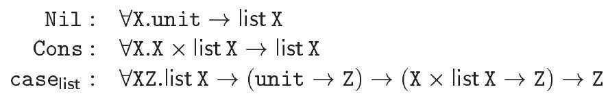

Thus, the value Cons $(\hat{0}, \mathrm{Nil}())$, an integer list of length 1 , has type list int. A function that computes the length of a list may now be written as follows:

因此，值 Cons $(\hat{0}, \mathrm{Nil}())$，一个长度为1的整数列表，具有类型list int。现在可以如下编写计算列表长度的函数：

$$
\text { letrec length }=\lambda l . \text { case } 1\left[\mathrm{Nil}: \lambda \_. \hat{0} \mid \text { Cons }: \lambda z . \hat{1} \hat{+} \text { length }\left(\pi_{2} z\right)\right]
$$

Recall that this notation is syntactic sugar for

回忆一下，这个表示法是语法糖，用于表示


$$
\text { letrec length }=\lambda \text { l.case }_{\text {list }} l\left(\lambda \_. \hat{0}\right)\left(\lambda z . \hat{1} \hat{+} \text { length }\left(\pi_{2} z\right)\right)
$$

The difference with the code in Example 1.9.7 appears minimal: the case construct is now annotated with the data type list. As a result, the type inference algorithm employs the type scheme assigned to case list , which is derived from the definition of list, instead of the type scheme assigned to the anonymous case construct, given in Exercise 1.9.4. This is good for a couple of reasons. First, the former is more informative than the latter, because it contains the type $\mathrm{T}_{i}$ associated with the data constructor $\ell_{i}$. Here, for instance, the generated constraint requires the type of $\mathrm{z}$ to be $\mathrm{X} \times$ list $\mathrm{X}$ for some $\mathrm{X}$, so a good error message would be given if a mistake was made in the second branch, such as omitting the use of $\pi_{2}$. Second, and more fundamentally, the code is now well-typed, even in the absence of recursive types. In Example 1.9.7, a cyclic equation was produced because case required the type of 1 to be a sum type and because a sum type carries the types of its left and right branches as subterms. Here, instead, case list requires 1 to have type list X for some X. This is an abstract type: it does not explicitly contain the types of the branches. As a result, the generated constraint no longer involves a cyclic equation. It is, in fact, satisfiable; the reader may check that length has type $\forall x$. list $X \rightarrow$ int, as expected.

与1.9.7例中的代码差异看起来很小：现在的case构造被注释上了数据类型list。因此，类型推断算法使用了分配给case list的类型方案，这是从list的定义派生而来的，而不是分配给1.9.4练习中给出的匿名case构造的类型方案。这样做有几个好处。首先，前者比后者更具信息性，因为它包含了与数据构造器$\ell_{i}$相关的类型$\mathrm{T}_{i}$。例如，这里生成的约束要求$\mathrm{z}$的类型为$\mathrm{X} \times$ list $\mathrm{X}$，对于某个$\mathrm{X}$，如果在第二个分支中犯了一个错误，比如省略了$\pi_{2}$的使用，就会给出一个好的错误信息。其次，更重要的是，即使在没有递归类型的情况下，代码现在也是类型正确的。在1.9.7例中，产生了循环方程，因为case要求1的类型为和类型，并且和类型将其左右分支的类型作为子项携带。而在这里，case list要求1具有某种X的list类型。这是一个抽象类型：它不显式地包含分支的类型。因此，生成的约束不再涉及循环方程。实际上，它是可满足的；读者可以验证length确实具有预期的类型$\forall x$. list $X \rightarrow$ int。

Example 1.9.11 stresses the importance of using declared, abstract types, as opposed to anonymous, concrete sum or product types, in order to obviate the need for recursive types. The essence of the trick lies in the fact that the type schemes associated with operations on algebraic data types implicitly fold and unfold the data type's definition. More precisely, let us recall the type scheme assigned to the $i^{\text {th }}$ injection in the setting of ( $k$-ary) anonymous sums: it is $\forall \mathrm{X}_{1} \ldots \mathrm{X}_{k} \cdot \mathrm{X}_{i} \rightarrow \mathrm{X}_{1}+\ldots+\mathrm{X}_{k}$, or, more concisely, $\forall \mathrm{x}_{1} \ldots \mathrm{X}_{k} . \mathrm{X}_{i} \rightarrow \sum_{i=1}^{k} \mathrm{X}_{i}$. By instantiating each $\mathrm{X}_{i}$ with $\mathrm{T}_{i}$ and generalizing again, we find that a more specific type scheme is $\forall \overline{\mathrm{X}} . \mathrm{T}_{i} \rightarrow \sum_{i=1}^{k} \mathrm{~T}_{i}$. Perhaps this could have been the type scheme assigned to $\ell_{i}$ ? Instead, however, it is $\forall \overline{\mathrm{X}}$. $\mathrm{T}_{i} \rightarrow \mathrm{D} \overrightarrow{\mathrm{X}}$. We now realize that this type scheme not only reflects the operational behavior of the $i^{\text {th }}$ injection, but also folds the definition of the algebraic data type $\mathrm{D}$ by turning the anonymous sum $\sum_{i=1}^{k} \mathrm{~T}_{i}$-which forms the definition's right-hand side-into the parameterized abstract type $D \vec{X}$ - which is the definition's left-hand side. Conversely, the type scheme assigned to case $_{D}$ unfolds the definition. The
situation is identical in the case of record types: in either case, constructors fold, destructors unfold. In other words, occurrences of data constructors and record labels in the code may be viewed as explicit instructions for the typechecker to fold or unfold an algebraic data type definition. This mechanism is characteristic of isorecursive types.

示例1.9.11强调了使用声明的抽象类型，而不是匿名的具体和或积类型，以避免需要递归类型。这一技巧的本质在于，与代数数据类型上的操作相关联的类型方案会隐式地折叠和展开数据类型的定义。更准确地说，让我们回忆一下在（k元）匿名和的情况下分配给第$i^{\text {th }}$注入的类型方案：它是$\forall \mathrm{X}_{1} \ldots \mathrm{X}_{k} \cdot \mathrm{X}_{i} \rightarrow \mathrm{X}_{1}+\ldots+\mathrm{X}_{k}$，或者更简洁地说，$\forall \mathrm{x}_{1} \ldots \mathrm{X}_{k} . \mathrm{X}_{i} \rightarrow \sum_{i=1}^{k} \mathrm{X}_{i}$。通过将每个$\mathrm{X}_{i}$实例化为$\mathrm{T}_{i}$并再次泛化，我们发现了一个更具体的类型方案$\forall \overline{\mathrm{X}} . \mathrm{T}_{i} \rightarrow \sum_{i=1}^{k} \mathrm{~T}_{i}$。这或许可以成为分配给$\ell_{i}$的类型方案？然而，实际上它是$\forall \overline{\mathrm{X}}$。$\mathrm{T}_{i} \rightarrow \mathrm{D} \overrightarrow{\mathrm{X}}$。我们现在意识到这个类型方案不仅反映了第$i^{\text {th }}$注入的操作行为，还通过将定义右侧的匿名和$\sum_{i=1}^{k} \mathrm{~T}_{i}$转换为定义左侧的参数化抽象类型$D \vec{X}$，折叠了代数数据类型$\mathrm{D}$的定义。相反，分配给case $_{D}$的类型方案展开了定义。在记录类型的情况下情况相同：在任一情况下，构造函数折叠，析构函数展开。换句话说，代码中出现的数据构造器和记录标签可以被视为类型检查器显式地折叠或展开代数数据类型定义的指令。这种机制是等递归类型的特征。

1.9.12 EXERCISE $[\star, \nrightarrow]$ : For a fixed $k$, check that all of the machinery associated with $k$-ary anonymous products - that is, constructors, destructors, reduction rules, and extensions to the initial typing environment-may be viewed as the result of a single algebraic data type definition. Conduct a similar check in the case of $k$-ary anonymous sums.

1.9.12 练习 $[\star, \nrightarrow]$ ：对于固定的 $k$，检查与 $k$ 元匿名乘积相关的所有机制 - 即构造函数、析构函数、归约规则以及对初始类型环境的扩展 - 可以被视为由单个代数数据类型定义的结果。在 $k$ 元匿名和的情况下进行类似的检查。

1.9.13 EXERCISE $[\star \star \star, \nrightarrow]$ : Check that the above definitions meet the requirements of Definition 1.7.6.

1.9.13 练习 $[\star \star \star, \nrightarrow]$ ：检查上述定义是否符合定义1.7.6的要求。

1.9.14 EXERCISE $[\star \star \star, \nrightarrow]$ : For sake of simplicity, we have assumed that data constructors are always of arity one. It is indeed possible to allow data constructors of any arity and define variants as $\mathrm{D} \overrightarrow{\mathrm{X}} \approx \sum_{i=1}^{k} \ell_{i}: \overrightarrow{\mathrm{T}}_{i}$. For instance, the definition of list could then be list $\mathrm{X} \approx \Sigma(\mathrm{Nil}$; Cons $: \mathrm{X} \times$ list $\mathrm{X})$ and for instance $\operatorname{Cons}(\hat{0}, \mathrm{Nil})$ would be a list value. Make the necessary changes in the definitions above and check that they still meet the requirements of Definition 1.7.6.

1.9.14练习 $[\star \star \star, \nrightarrow]$ ：为了简单起见，我们假设数据构造器总是为一元的。实际上，可以允许任何元数的数据构造器，并将变体定义为 $\mathrm{D} \overrightarrow{\mathrm{X}} \approx \sum_{i=1}^{k} \ell_{i}: \overrightarrow{\mathrm{T}}_{i}$。例如，列表的定义可以是 list $\mathrm{X} \approx \Sigma(\mathrm{Nil}$；Cons $: \mathrm{X} \times$ list $\mathrm{X})$，例如 $\operatorname{Cons}(\hat{0}, \mathrm{Nil})$ 就是一个列表值。在上面的定义中进行必要的更改，并检查它们是否仍符合定义1.7.6的要求。

In this formal presentation of algebraic data types, we have assumed that all algebraic data type definitions are known before the program is typechecked. This simplifying assumption is forced on us by the fact that we interpret constraints in a fixed model, that is, we assume a fixed universe of types. In practice, programming languages have module systems, which allow distinct modules to have distinct, partial views of the universe of types. Then, it becomes possible for each module to come with its own data type definitions. Interestingly, it is even possible, in principle, to split the definition of a single data type over several modules, yielding extensible algebraic data types. For instance, module $A$ might declare the existence of a parameterized variant type $\mathrm{D} \overrightarrow{\mathrm{x}}$, without giving its components. Later on, module $B$ might define a component $\ell: \mathrm{T}$, where $f t v(\mathrm{~T}) \subseteq \overline{\mathrm{X}}$. Such a definition makes $\ell$ a unary constructor with type scheme $\forall \overline{\mathrm{X}} . \mathrm{T} \rightarrow \mathrm{D} \overrightarrow{\mathrm{X}}$, as before. It becomes impossible, however, to introduce a destructor $\mathrm{case}_{\mathrm{D}}$, because the definition of an extensible variant type can never be assumed to be complete-other, unknown modules might extend it further. To compensate for its absence, one may supplement every constructor $\ell$ with a destructor $\ell^{-1}$, whose semantics is given by $\ell^{-1}(\ell \mathrm{v}) \mathrm{v}_{1} \mathrm{v}_{2} \xrightarrow{\delta} \mathrm{v}_{1} \mathrm{v}$ and $\ell^{-1}\left(\ell^{\prime} \mathrm{v}\right) \mathrm{v}_{1} \mathrm{v}_{2} \xrightarrow{\delta} \mathrm{v}_{2}\left(\ell^{\prime} \mathrm{v}\right)$ when $\ell \neq \ell^{\prime}$, and whose type scheme is $\forall \overline{\mathrm{x}} \mathrm{Z} . \mathrm{D} \overrightarrow{\mathrm{X}} \rightarrow(\mathrm{T} \rightarrow \mathrm{Z}) \rightarrow(\mathrm{D} \overrightarrow{\mathrm{X}} \rightarrow \mathrm{Z}) \rightarrow \mathrm{Z}$. When
pattern matching is available, $\ell^{-1}$ may in fact be defined in the language. MLthe-programming-language does not offer extensible algebraic data types as a language feature, but does have one built-in extensible variant type, namely the type exn of exceptions. Thus, it is possible to define new constructors for the type exn within any module. The price of this extra flexibility is that no exhaustive case analysis on values of type exn is possible.

在这份代数数据类型的正式介绍中，我们假设在程序类型检查之前已知所有代数数据类型的定义。这种简化假设是由以下事实强加给我们的：我们是在一个固定的模型中解释约束，也就是说，我们假设有一个固定的类型宇宙。在实践中，编程语言有模块系统，允许不同的模块拥有对类型宇宙的不同、部分视图。这样，每个模块都可以有自己的数据类型定义。有趣的是，原则上甚至可以将单个数据类型的定义分散在几个模块中，从而产生可扩展的代数数据类型。例如，模块A可能声明存在一个参数化变体类型D$x$，但不给出其组件。稍后，模块B可能定义一个组件$\ell: \mathrm{T}$，其中$f t v(\mathrm{~T}) \subseteq \overline{\mathrm{X}}$。这样的定义使得$\ell$成为一个一元构造器，其类型方案与之前一样是$\forall \overline{\mathrm{X}} . \mathrm{T} \rightarrow \mathrm{D} \overrightarrow{\mathrm{X}}$。然而，不可能引入一个析构器$\mathrm{case}_{\mathrm{D}}$，因为可扩展变体类型的定义永远不能被认为是完整的——其他未知的模块可能会进一步扩展它。为了补偿它的缺失，可以给每个构造器$\ell$补充一个析构器$\ell^{-1}$，其语义由$\ell^{-1}(\ell \mathrm{v}) \mathrm{v}_{1} \mathrm{v}_{2} \xrightarrow{\delta} \mathrm{v}_{1} \mathrm{v}$和$\ell^{-1}\left(\ell^{\prime} \mathrm{v}\right) \mathrm{v}_{1} \mathrm{v}_{2} \xrightarrow{\delta} \mathrm{v}_{2}\left(\ell^{\prime} \mathrm{v}\right)$给出，当$\ell \neq \ell^{\prime}$，其类型方案是$\forall \overline{\mathrm{x}} \mathrm{Z} . \mathrm{D} \overrightarrow{\mathrm{X}} \rightarrow(\mathrm{T} \rightarrow \mathrm{Z}) \rightarrow(\mathrm{D} \overrightarrow{\mathrm{X}} \rightarrow \mathrm{Z}) \rightarrow \mathrm{Z}$。当模式匹配可用时，$\ell^{-1}$实际上可以在语言中定义。ML编程语言并没有提供作为语言特性的可扩展代数数据类型，但它有一个内置的可扩展变体类型，即异常类型exn。因此，可以在任何模块内为类型exn定义新的构造器。这种额外灵活性的代价是无法对类型为exn的值进行穷举的情况分析。

One significant drawback of algebraic data type definitions resides in the fact that a label $\ell$ cannot be shared by two distinct variant or record type definitions. Indeed, every algebraic data type definition extends the calculus with new constants. Strictly speaking, our presentation does not allow a single constant $\mathrm{c}$ to be associated with two distinct definitions. Even if we did allow such a collision, the initial environment would contain two bindings for c, one of which would then become inaccessible. This phenomenon arises in actual implementations of ML-the-programming-language, where a new algebraic data type definition may hide some of the data constructors or record labels introduced by a previous definition. An elegant solution to this lack of expressiveness is discussed in Section 1.11.

代数数据类型定义的一个重大缺点在于，标签ℓ不能被两个不同的变体或记录类型定义共享。实际上，每个代数数据类型定义都通过新的常量扩展了计算。严格地说，我们的表述不允许将单个常量c与两个不同的定义相关联。即使我们允许这种碰撞，初始环境也会包含c的两个绑定，其中之一将变得无法访问。这种现象在实际的ML编程语言实现中出现，其中一个新的代数数据类型定义可能会隐藏之前定义的一些数据构造器或记录标签。第1.11节讨论了这种表达性不足的优雅解决方案。

## Pattern matching

Our presentation of products, sums and algebraic data types has remained within the setting of ML-the-calculus: that is, data structures have been built out of constructors, while the case analysis and record access operations have been viewed as destructors. Some syntactic sugar has been used to recover standard notations. The language is now expressive enough to allow defining and manipulating complex data structures, such as lists and trees. Yet, experience shows that programming in such a language is still somewhat cumbersome. Indeed, case analysis and record access are low-level operations: the former allows inspecting a tag and branching, while the latter allows dereferencing a pointer. In practice, one often needs to carry out more complex tasks, such as determining whether a data structure has a certain shape or whether two data structures have comparable shapes. Currently, the only way to carry out these tasks is to program an explicit sequence of low-level operations. It would be much preferable to extend the language so that it becomes directly possible to describe shapes, called patterns, and so that checking whether a patterns matches a value becomes an elementary operation. ML-the-programming-language offers this feature, called pattern matching. Although pattern matching may be added to ML-the-calculus by introducing a family of destructors, we rather choose to extend the calculus with a new match construct, which subsumes the existing let construct. This approach appears somewhat simpler and more powerful. We now carry out this

我们的产品、总和以及代数数据类型的呈现一直保持在ML-演算的设定内：也就是说，数据结构是由构造器构建的，而案例分析和记录访问操作被视为析构器。为恢复标准表示法，我们使用了一些语法糖。该语言现在足够表达性，允许定义和操作复杂的数据结构，如列表和树。然而，经验表明，在这种语言中进行编程仍然有些麻烦。实际上，案例分析和记录访问是低级操作：前者允许检查标签和分支，而后者允许取消引用指针。在实践中，通常需要执行更复杂的任务，例如确定数据结构是否具有某种形状或两个数据结构是否具有可比较的形状。目前，执行这些任务的唯一方法是编程一个显式的低级操作序列。如果能够扩展语言，使其直接允许描述称为模式的形状，并使检查模式是否与值匹配成为基本操作，那将更为可取。ML-编程语言提供了这个特性，称为模式匹配。尽管可以通过引入一组析构器将模式匹配添加到ML-演算中，但我们更愿意通过一个新的匹配构造来扩展演算，这个匹配构造包含了现有的let构造。这种方法似乎更简单、更强大。我们现在进行这个操作。

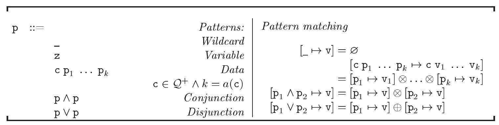

Figure 1-13: Patterns and pattern matching

图1-13：模式和模式匹配

extension.

Let us first define the syntax of patterns (Figure 1-13) and describe (informally, for now) which values they match. To a pattern $\mathrm{p}$, we associate a set of defined program variables $d p i(\mathrm{p})$, whose definition appears in the text that follows. The pattern $\mathrm{p}$ is well-formed if and only if $d p i(\mathrm{p})$ is defined. To begin, the wildcard _ is a pattern, which matches every value and binds no variables. We let $d p i\left(\_\right)=\varnothing$. Although the wildcard may be viewed as an anonymous variable, and we have done so thus far, it is now simpler to view it as a distinct pattern. A program variable $z$ is also a pattern, which matches every value and binds $\mathbf{z}$ to the matched value. We let $d p i(\mathbf{z})=\{\mathbf{z}\}$. Next, if $\mathrm{c}$ is a constructor of arity $k$, then $\mathrm{c} \mathrm{p}_{1} \ldots \mathrm{p}_{k}$ is a pattern, which matches $\mathrm{c} \mathrm{v}_{1} \ldots \mathrm{v}_{k}$ when $\mathrm{p}_{i}$ matches $\mathrm{v}_{i}$ for every $i \in\{1, \ldots, k\}$. We let $d p i\left(\mathrm{c}_{1} \ldots \mathrm{p}_{k}\right)=d p i\left(\mathrm{p}_{1}\right) \uplus \ldots \uplus d p i\left(\mathrm{p}_{k}\right)$. That is, the pattern $\mathrm{c} \mathrm{p}_{1} \ldots \mathrm{p}_{k}$ is well-formed when $\mathrm{p}_{1}, \ldots, \mathrm{p}_{k}$ define disjoint sets of variables. This condition rules out nonlinear patterns such as $(z, z)$. Defining the semantics of such a pattern would require a notion of equality at every type, which introduces various complications, so it is commonly considered ill-formed. The pattern $\mathrm{p}_{1} \wedge \mathrm{p}_{2}$ matches all values that both $\mathrm{p}_{1}$ and $\mathrm{p}_{2}$ match. It is commonly used with $\mathrm{p}_{2}$ a program variable: then, it allows examining the shape of a value and binding a name to it at the same time. Again, we define $d p i\left(\mathrm{p}_{1} \wedge \mathrm{p}_{2}\right)=d p i\left(\mathrm{p}_{1}\right) \uplus d p i\left(\mathrm{p}_{2}\right)$. The pattern $\mathrm{p}_{1} \vee \mathrm{p}_{2}$ matches all values that either $\mathrm{p}_{1}$ or $\mathrm{p}_{2}$ matches. We define $d p i\left(\mathrm{p}_{1} \vee \mathrm{p}_{2}\right)=d p i\left(\mathrm{p}_{1}\right)=d p i\left(\mathrm{p}_{2}\right)$. That is, the pattern $\mathrm{p}_{1} \vee \mathrm{p}_{2}$ is well-formed when $p_{1}$ and $p_{2}$ define the same variables. Thus, $\left(i n j_{1} z\right) \vee\left(i n j_{2} z\right)$ is a wellformed pattern, which binds $z$ to the component of a binary sum, without regard for its tag. However, $\left(i n j_{1} z_{1}\right) \vee\left(i n j_{2} z_{2}\right)$ is ill-formed, because one cannot statically predict whether it defines $z_{1}$ or $z_{2}$.

让我们首先定义模式（图1-13）的语法，并非正式地描述（目前是这样）它们匹配哪些值。对于一个模式p，我们关联一组已定义的程序变量dpi(p)，其定义在下面的文本中出现。模式p是良构的当且仅当dpi(p)是有定义的。首先，通配符_是一个模式，它匹配任何值并且不绑定任何变量。我们让dpi(_) = ∅。尽管通配符可以被看作是一个匿名变量，我们到目前为止都是这样做的，但现在更简单的方法是将其视为一个独特的模式。程序变量z也是一个模式，它匹配任何值并将z绑定到匹配的值。我们让dpi(z) = {z}。接下来，如果c是一个k元构造器，那么c p1 ... pk是一个模式，当且仅当对于每个i∈{1,...,k}，pi匹配vi时，它匹配c v1 ... vk。我们让dpi(c1 ... pk) = dpi(p1) ∪ ... ∪ dpi(pk)。也就是说，当p1,...,pk定义了互不相交的变量集时，模式c p1 ... pk是良构的。这个条件排除了如(z, z)之类的非线性模式。定义这种模式的语义需要在每个类型上都有相等性的概念，这会引入各种复杂性，因此通常被认为是非良构的。模式p1 ∧ p2匹配所有p1和p2都匹配的值。它通常与p2是一个程序变量一起使用：这样，它允许同时检查一个值的形状并将名称绑定到它。再次，我们定义dpi(p1 ∧ p2) = dpi(p1) ∪ dpi(p2)。模式p1 ∨ p2匹配所有p1或p2匹配的值。我们定义dpi(p1 ∨ p2) = dpi(p1) = dpi(p2)。也就是说，当p1和p2定义相同的变量时，模式p1 ∨ p2是良构的。因此，(inj1 z) ∨ (inj2 z)是一个良构的模式，它将z绑定到二元和的组件，而不管它的标签是什么。然而，(inj1 z1) ∨ (inj2 z2)是非良构的，因为静态上无法预测它定义的是z1还是z2。

Let us now formally define whether a pattern $\mathrm{p}$ matches a value $\mathrm{v}$ and how the variables in $d p i(\mathrm{p})$ become bound to values in the process. This is done by introducing a generalized substitution, written $[\mathrm{p} \mapsto \mathrm{v}]$, which is either

让我们现在正式定义一个模式 p 是否与一个值 v 匹配，以及 dp(i(p)) 中的变量在过程中如何绑定到值。这是通过引入一种广义的替换，记作 [p → v]，它可以是以下两种情形之一：

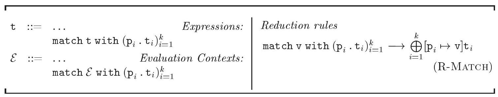

undefined or a substitution of values for the program variables in $d p i(\mathrm{p})$. If the former, then $\mathrm{p}$ does not match $\mathrm{v}$. If the latter, then $\mathrm{p}$ matches $\mathrm{v}$ and, for every $\mathrm{z} \in d p i(\mathrm{p})$, the variable $\mathrm{z}$ becomes bound to the value $[\mathrm{p} \mapsto \mathrm{v}] \mathrm{z}$. Of course, when $\mathrm{p}$ is a variable $\mathrm{z}$, the generalized substitution $[\mathrm{z} \mapsto \mathrm{v}]$ is defined and coincides with the substitution $[\mathrm{z} \mapsto \mathrm{v}]$, which justifies our abuse of notation. To construct generalized substitutions, we use two simple combinators. First, when $\operatorname{dpi}\left(\mathrm{p}_{1}\right)$ and $\operatorname{dpi}\left(\mathrm{p}_{2}\right)$ are disjoint, $\left[\mathrm{p}_{1} \mapsto \mathrm{v}_{1}\right] \otimes\left[\mathrm{p}_{2} \mapsto \mathrm{v}_{2}\right]$ stands for the set-theoretic union of $\left[\mathrm{p}_{1} \mapsto \mathrm{v}_{1}\right]$ and $\left[\mathrm{p}_{2} \mapsto \mathrm{v}_{2}\right]$, if both are defined, and is undefined otherwise. We use this combinator to ensure that $\mathrm{p}_{1}$ matches $\mathrm{v}_{1}$ and $\mathrm{p}_{2}$ matches $\mathrm{v}_{2}$ and to combine the two corresponding sets of bindings. Second, when $o_{1}$ and $o_{2}$ are two possibly undefined mathematical objects that belong to the same space when defined, $o_{1} \oplus o_{2}$ stands for $o_{1}$, if it is defined, and for $o_{2}$ otherwise - that is, $\oplus$ is an angelic choice operator with a left bias. In particular, when $d p i\left(\mathrm{p}_{1}\right)$ and $d p i\left(\mathrm{p}_{2}\right)$ coincide, $\left[\mathrm{p}_{1} \mapsto \mathrm{v}_{1}\right] \oplus\left[\mathrm{p}_{2} \mapsto \mathrm{v}_{2}\right]$ stands for $\left[\mathrm{p}_{1} \mapsto \mathrm{v}_{1}\right]$, if it is defined, and for $\left[\mathrm{p}_{2} \mapsto \mathrm{v}_{2}\right]$ otherwise. We use this combinator to ensure that $\mathrm{p}_{1}$ matches $\mathrm{v}_{1}$ or $\mathrm{p}_{2}$ matches $\mathrm{v}_{2}$ and to retain the corresponding set of bindings. The full definition of generalized substitutions, which relies on these combinators, appears in Figure 1-13. It reflects the informal presentation of the previous paragraph.

未定义，或者是在程序变量 $d p i(p)$ 中的值替换。如果是前者，那么 $p$ 不匹配 $v$。如果是后者，那么 $p$ 匹配 $v$，并且对于每个 $z \in d p i(p)$，变量 $z$ 绑定到值 $[p \mapsto v]z$。当然，当 $p$ 是变量 $z$ 时，广义替换 $[z \mapsto v]$ 是定义良好的，并且与替换 $[z \mapsto v]$ 相同，这证明了我们滥用记号的合理性。为了构建广义替换，我们使用了两个简单的组合子。首先，当 $dpi(p_1)$ 和 $dpi(p_2)$ 不相交时，$[p_1 \mapsto v_1] \otimes [p_2 \mapsto v_2]$ 表示 $[p_1 \mapsto v_1]$ 和 $[p_2 \mapsto v_2]$ 的集合论并集，如果两者都定义良好，否则未定义。我们使用这个组合子确保 $p_1$ 匹配 $v_1$ 和 $p_2$ 匹配 $v_2$，并将两个相应的绑定集合并。其次，当 $o_1$ 和 $o_2$ 是两个可能未定义的数学对象，在定义时属于同一空间，$o_1 \oplus o_2$ 表示 $o_1$（如果它已定义），否则表示 $o_2$——即 $\oplus$ 是一个左倾的天使选择操作符。特别是，当 $dpi(p_1)$ 和 $dpi(p_2)$ 重合时，$[p_1 \mapsto v_1] \oplus [p_2 \mapsto v_2]$ 表示 $[p_1 \mapsto v_1]$（如果它已定义），否则表示 $[p_2 \mapsto v_2]$。我们使用这个组合子确保 $p_1$ 匹配 $v_1$ 或者 $p_2$ 匹配 $v_2$，并保留相应的绑定集。广义替换的完整定义，依赖于这些组合子，出现在图1-13中。它反映了前一段的非正式介绍。

Once patterns and pattern matching are defined, it is straightforward to extend the syntax and operational semantics of ML-the-calculus. We enrich the syntax of expressions with a new construct, match $\mathrm{t}$ with $\left(\mathrm{p}_{i} \cdot \mathrm{t}_{i}\right)_{i=1}^{k}$, where $k \geq 1$. It consists of a term $t$ and a nonempty, ordered list of clauses, each of which is composed of a pattern $\mathrm{p}_{i}$ and a term $\mathrm{t}_{i}$. The syntax of evaluation contexts is extended as well, so that the term $t$ that is being examined is first reduced to a value $\mathrm{v}$. The operational semantics is extended with a new rule, $\mathrm{R}-\mathrm{MATCH}$, which states that match $\mathrm{v}$ with $\left(\mathrm{p}_{i} \cdot \mathrm{t}_{i}\right)_{i=1}^{k}$ reduces to $\left[\mathrm{p}_{i} \mapsto \mathrm{v}\right] \mathrm{t}_{i}$, where $i$ is the least element of $\{1, \ldots, k\}$ such that $\mathrm{p}_{i}$ matches $\mathrm{v}_{i}$. Technically, $\bigoplus_{i=1}^{k}\left[\mathrm{p}_{i} \mapsto \mathrm{v}\right] \mathrm{t}_{i}$ stands for $\left[\mathrm{p}_{1} \mapsto \mathrm{v}\right] \mathrm{t}_{1} \oplus \ldots \oplus\left[\mathrm{p}_{k} \mapsto \mathrm{v}\right] \mathrm{t}_{k}$, so that the reduct is the first term that is defined in this sequence.

一旦定义了模式和模式匹配，扩展ML-演算的语法和操作语义就非常直接。我们将表达式语法丰富为一个新构造，匹配 $\mathrm{t}$ 与 $\left(\mathrm{p}_{i} \cdot \mathrm{t}_{i}\right)_{i=1}^{k}$，其中 $k \geq 1$。它由一个项 $t$ 和一个非空、有序的子句列表组成，每个子句由一个模式 $\mathrm{p}_{i}$ 和一个项 $\mathrm{t}_{i}$ 组成。评估上下文的语法也得到了扩展，使得正在检查的项 $t$ 首先被简化为一个值 $\mathrm{v}$。操作语义通过一个新规则 $\mathrm{R}-\mathrm{MATCH}$ 进行扩展，该规则指出，匹配 $\mathrm{v}$ 与 $\left(\mathrm{p}_{i} \cdot \mathrm{t}_{i}\right)_{i=1}^{k}$ 可简化为 $\left[\mathrm{p}_{i} \mapsto \mathrm{v}\right] \mathrm{t}_{i}$，其中 $i$ 是 $\{1, \ldots, k\}$ 中最小的元素，使得 $\mathrm{p}_{i}$ 匹配 $\mathrm{v}_{i}$。技术上，$\bigoplus_{i=1}^{k}\left[\mathrm{p}_{i} \mapsto \mathrm{v}\right] \mathrm{t}_{i}$ 表示 $\left[\mathrm{p}_{1} \mapsto \mathrm{v}\right] \mathrm{t}_{1} \oplus \ldots \oplus\left[\mathrm{p}_{k} \mapsto \mathrm{v}\right] \mathrm{t}_{k}$，这样简化后的结果是这个序列中第一个定义的项。

As far as semantics is concerned, the match construct may be viewed as a
generalization of the let construct. Indeed, let $z=t_{1}$ in $t_{2}$ may now be viewed as syntactic sugar for match $t_{1}$ with $z . t_{2}$, that is, a match construct with a single clause and a variable pattern. Then, R-LET becomes a special case of R-MATCH.

就语义学而言，匹配构造可以被视为let构造的泛化。实际上，let $z=t_{1}$ in $t_{2}$ 现在可以被视为是 match $t_{1}$ with $z . t_{2}$ 的语法糖，即一个具有单一子句和变量模式的匹配构造。那么，R-LET就成了R-MATCH的一个特例。

It is pleasant to introduce some more syntactic sugar. We write $\lambda\left(\mathrm{p}_{i} \cdot \mathrm{t}_{i}\right)_{i=1}^{k}$ for $\lambda$ z.match $\mathrm{z}$ with $\left(\mathrm{p}_{i} \cdot \mathrm{t}_{i}\right)_{i=1}^{k}$, where $\mathrm{z}$ is fresh for $\left(\mathrm{p}_{i} \cdot \mathrm{t}_{i}\right)_{i=1}^{k}$. Thus, it becomes possible to define functions by cases - a common idiom in ML-theprogramming-language.

引入一些更多的语法糖是令人愉悦的。我们用 $\lambda\left(\mathrm{p}_{i} \cdot \mathrm{t}_{i}\right)_{i=1}^{k}$ 表示 $\lambda$ z.match $\mathrm{z}$ with $\left(\mathrm{p}_{i} \cdot \mathrm{t}_{i}\right)_{i=1}^{k}$，其中 $\mathrm{z}$ 对于 $\left(\mathrm{p}_{i} \cdot \mathrm{t}_{i}\right)_{i=1}^{k}$ 是新鲜的。因此，可以通过案例来定义函数，这是ML编程语言中的一种常见习惯用法。

1.9.15 EXAMPLE: Using pattern matching, a function that computes the length of a list (Example 1.9.11) may now be written as follows:

1.9.15 示例：使用模式匹配，现在可以如下编写计算列表长度（示例1.9.11）的函数：

$$
\text { letrec length }=\lambda\left(\mathrm{Nil}_{\ldots} . \hat{0} \mid \operatorname{Cons}\left(\_, z\right) . \hat{1} \hat{+} \text { length } z\right)
$$

The second pattern matches a nonempty list and binds $\mathrm{z}$ to its tail at the same time, obviating the need for an explicit application of $\pi_{2}$.

第二种模式匹配非空列表，并同时将 $\mathrm{z}$ 绑定到其尾部，这样就无需显式应用 $\pi_{2}$。

1.9.16 Exercise $[\star \star$, Recommended, $\nrightarrow$ ]: Under the above definition of length, consider an application of length to the list Cons( $\hat{0}, \mathrm{Nil}())$. After eliminating the syntactic sugar, determine by which reduction sequence this expression reduces to a value.

1.9.16 练习 $[**$, 推荐, $\nrightarrow$ ]：在上述长度的定义下，考虑长度应用于列表 Cons( $\hat{0}$, $\mathrm{Nil}()$) 的应用。消除语法糖后，确定这个表达式通过哪个归约序列被简化为一个值。

Before we can proceed and extend the type system to deal with the new match construct, we must make two mild extensions to the syntax and meaning of constraints. First, if $\sigma$ is $\forall \overline{\mathrm{X}}[C]$.T, where $\overline{\mathrm{X}} \# f t v\left(\mathrm{~T}^{\prime}\right)$, then $\mathrm{T}^{\prime} \preceq \sigma$ stands for the constraint $\exists \overline{\mathrm{X}} .\left(C \wedge \mathrm{T}^{\prime} \leq \mathrm{T}\right)$. This relation is identical to the instance relation (Definition 1.3.3), except the direction of subtyping is reversed. We extend the syntax of constraints with instantiation constraints of the form $\mathrm{T} \preceq \mathrm{x}$ and define their meaning by adding a symmetric counterpart of CM-

在我们能够继续并将类型系统扩展以处理新的匹配构造之前，我们必须对约束的语法和含义做两个轻微的扩展。首先，如果 $\sigma$ 是 $\forall \overline{\mathrm{X}}[C].T$，其中 $\overline{\mathrm{X}} \# f t v\left(\mathrm{T}^{\prime}\right)$，那么 $\mathrm{T}^{\prime} \preceq \sigma$ 代表约束 $\exists \overline{\mathrm{X}} .(C \wedge \mathrm{T}^{\prime} \leq \mathrm{T})$。这种关系与实例关系（定义1.3.3）相同，只是子类型的方向相反。我们通过引入形式为 $\mathrm{T} \preceq \mathrm{x}$ 的实例化约束来扩展约束的语法，并通过添加CM-的对称对应物来定义它们的含义。

INSTANCE. We remark that, when subtyping is interpreted as equality, the relations $\sigma \preceq \mathrm{T}$ and $\mathrm{T} \preceq \sigma$ coincide, so this extension is unnecessary in that particular case. Second, we extend the syntax of environments so that several successive bindings may share a set of quantifiers and a constraint. That is, we allow writing $\forall \overline{\mathrm{X}}[C] .\left(\mathrm{x}_{1}: \mathrm{T}_{1} ; \ldots ; \mathrm{x}_{k}: \mathrm{T}_{k}\right)$ for $\mathrm{x}_{1}: \forall \overline{\mathrm{x}}[C] . \mathrm{T}_{1} ; \ldots ; \mathrm{x}_{k}$ : $\forall \overline{\mathrm{X}}[C] . \mathrm{T}_{k}$. From a theoretical standpoint, this is little more than syntactic sugar; however, in practice, it is useful to implement this new idiom literally, since it avoids unnecessary copying of the constraint $C$.

实例。我们注意到，当子类型被解释为等价时，关系 $\sigma \preceq \mathrm{T}$ 和 $\mathrm{T} \preceq \sigma$ 是一致的，因此在那个特定情况下这种扩展是不必要的。其次，我们扩展了环境语法，以便连续的多个绑定可以共享一组量词和约束。也就是说，我们允许写成 $\forall \overline{\mathrm{X}}[C] .\left(\mathrm{x}_{1}: \mathrm{T}_{1} ; \ldots ; \mathrm{x}_{k}: \mathrm{T}_{k}\right)$，对于 $\mathrm{x}_{1}: \forall \overline{\mathrm{x}}[C] . \mathrm{T}_{1} ; \ldots ; \mathrm{x}_{k}$ : $\forall \overline{\mathrm{X}}[C] . \mathrm{T}_{k}$。从理论角度来看，这不过是语法糖；然而，在实践中，字面上实现这种新习惯用语是有用的，因为它避免了不必要的复制约束 $C$。

Let us now extend the type system. For the sake of brevity, we extend the constraint generation rules only. Of course, it would also be possible to define corresponding extensions of the rule-based type systems shown earlier, namely $\mathrm{DM}, \operatorname{HM}(X)$, and $\operatorname{PCB}(X)$. We begin by defining a constraint $\llbracket \mathrm{T}: \mathrm{p} \rrbracket$ that represents a necessary and sufficient condition for values of type $\mathrm{T}$ to be acceptable inputs for the pattern $\mathrm{p}$. Its free type variables are a subset of

让我们现在扩展类型系统。为了简洁起见，我们仅扩展约束生成规则。当然，也有可能定义先前展示的基于规则的类型系统相应的扩展，即 $\mathrm{DM}, \operatorname{HM}(X)$ 和 $\operatorname{PCB}(X)$。我们首先定义一个约束 $\llbracket \mathrm{T}: \mathrm{p} \rrbracket$，它表示类型 $\mathrm{T}$ 的值作为模式 $\mathrm{p}$ 可接受输入的必要且充分条件。其自由类型变量是以下子集。

$$
\begin{aligned}
& \llbracket \mathrm{T}: \_\rrbracket=\text { true } \\
& \llbracket \mathrm{T}: \mathrm{z} \rrbracket=\mathrm{T} \preceq \mathrm{z} \\
& \llbracket \mathrm{T}: \mathrm{c} \mathrm{p}_{1} \cdots \mathrm{p}_{k} \rrbracket=\exists \overline{\mathrm{x}} \cdot\left(\overrightarrow{\mathrm{x}} \rightarrow \mathrm{T} \preceq \mathrm{c} \wedge \wedge_{i=1}^{k} \llbracket \mathrm{x}_{i}: \mathrm{p}_{i} \rrbracket\right) \\
& \llbracket \mathrm{T}: \mathrm{p}_{1} \wedge \mathrm{p}_{2} \rrbracket=\llbracket \mathrm{T}: \mathrm{p}_{1} \rrbracket \wedge \llbracket \mathrm{T}: \mathrm{p}_{2} \rrbracket \\
& \llbracket \mathrm{T}: \mathrm{p}_{1} \vee \mathrm{p}_{2} \rrbracket=\llbracket \mathrm{T}: \mathrm{p}_{1} \rrbracket \wedge \llbracket \mathrm{T}: \mathrm{p}_{2} \rrbracket \\
& \llbracket \text { matcht with }\left(\mathrm{p}_{i} \cdot \mathrm{t}_{i}\right)_{i=1}^{k}: \mathrm{T} \rrbracket=\bigwedge_{i=1}^{k} \text { let } \forall \mathrm{x} \overline{\mathrm{x}}_{i}\left[\llbracket \mathrm{t}: \mathrm{x} \rrbracket \wedge \text { let } \overrightarrow{\mathrm{z}}_{i}: \overrightarrow{\mathrm{x}}_{i} \text { in } \llbracket \mathrm{x}: \mathrm{p}_{i} \rrbracket \rrbracket \cdot\left(\overrightarrow{\mathrm{z}}_{i}: \overrightarrow{\mathrm{x}}_{i}\right) \text { in } \llbracket \mathrm{t}_{i}: \mathrm{T} \rrbracket\right. \\
& \text { where } \overrightarrow{\mathrm{z}}_{i}=d p i\left(\mathrm{p}_{i}\right)
\end{aligned}
$$

Figure 1-15: Constraint generation for patterns and pattern matching

图1-15：模式和模式匹配的约束生成

$f t v(T)$, while its free program identifiers are either constructors or program variables bound by $\mathrm{p}$. It is defined in the upper part of Figure 1-15. The first rule states that a wildcard matches values of arbitrary type. The second and third rules govern program variables and constructor applications in patterns. They are identical to the rules that govern these constructs in expressions (page 59), except that the direction of subtyping is reversed. In the absence of subtyping, they would be entirely identical. We write $\overrightarrow{\mathrm{X}}$ for $\mathrm{X}_{1} \ldots \mathrm{X}_{k}$ and $\overrightarrow{\mathrm{X}} \rightarrow \mathrm{T}$ for $\mathrm{X}_{1} \rightarrow \ldots \rightarrow \mathrm{X}_{k} \rightarrow \mathrm{T}$. As usual, the type variables $\mathrm{X}_{1}, \ldots, \mathrm{X}_{k}$ must have kind $\star$ and must be distinct and fresh for the equation's left-hand side. The last two rules simply distribute the type $\mathrm{T}$ to both subpatterns. It is easy to check that $\llbracket \mathrm{T}: \mathrm{p} \rrbracket$ is contravariant in $\mathrm{T}$ :

$f t v(T)$，而其自由程序标识符要么是构造器，要么是由 $\mathrm{p}$ 绑定的程序变量。它定义在图1-15的上部。第一条规则表明通配符匹配任意类型的值。第二条和第三条规则管理模式中的程序变量和构造器应用。它们与表达式中管理这些构造的规则相同（第59页），除了子类型的方向相反。在没有子类型的情况下，它们将是完全相同的。我们用 $\overrightarrow{\mathrm{X}}$ 表示 $\mathrm{X}_{1} \ldots \mathrm{X}_{k}$，用 $\overrightarrow{\mathrm{X}} \rightarrow \mathrm{T}$ 表示 $\mathrm{X}_{1} \rightarrow \ldots \rightarrow \mathrm{X}_{k} \rightarrow \mathrm{T}$。像往常一样，类型变量 $\mathrm{X}_{1}, \ldots, \mathrm{X}_{k}$ 必须具有 $\star$ 类型的种类，并且对于等式的左侧必须是不同且新鲜的。最后两条规则简单地将类型 $\mathrm{T}$ 分发到两个子模式中。很容易检查 $\llbracket \mathrm{T}: \mathrm{p} \rrbracket$ 在 $\mathrm{T}$ 上是反变的：

1.9.17 Lemma: $\mathrm{T}^{\prime} \leq \mathrm{T} \wedge \llbracket \mathrm{T}: \mathrm{p} \rrbracket$ entails $\llbracket \mathrm{T}^{\prime}: \mathrm{p} \rrbracket$.

1.9.17 引理：$\mathrm{T}^{\prime} \leq \mathrm{T} \wedge \llbracket \mathrm{T}: \mathrm{p} \rrbracket$ 推出 $\llbracket \mathrm{T}^{\prime}: \mathrm{p} \rrbracket$.

This property reflects the fact that $\mathrm{T}$ represents the type of an input for the pattern p. Compare it with Lemma 1.6.3.

这个属性反映了事实$\mathrm{T}$代表了模式p的一个输入类型。与引理1.6.3进行比较。

1.9.18 Example: Consider the pattern Cons $\left({ }_{-}, \mathbf{z}\right)$, which appears in Example 1.9.15. We have

1.9.18 示例：考虑在示例1.9.15中出现的形式 Cons $\left({ }_{-}, \mathbf{z}\right)$，我们有


$$
\begin{aligned}
& \llbracket \mathrm{T}: \operatorname{Cons}(-\mathrm{z}) \rrbracket \\
\equiv & \exists \mathrm{Z}_{1} \cdot\left(\llbracket \mathrm{Z}_{1} \rightarrow \mathrm{T}: \text { Cons } \rrbracket \wedge \llbracket \mathrm{Z}_{1}:(, \mathrm{z}) \rrbracket\right) \\
\equiv & \exists \mathrm{Z}_{1} \cdot\left(\mathrm{Z}_{1} \rightarrow \mathrm{T} \preceq \text { Cons } \wedge \exists \mathrm{Z}_{2} \mathrm{Z}_{3} \cdot\left(\llbracket \mathrm{Z}_{2} \rightarrow \mathrm{Z}_{3} \rightarrow \mathrm{Z}_{1}:(\cdot, \cdot) \rrbracket \wedge \llbracket \mathrm{Z}_{2}: \_\rrbracket \wedge \llbracket \mathrm{Z}_{3}: \mathrm{z} \rrbracket\right)\right) \\
\equiv & \exists \mathrm{Z}_{1} \mathrm{Z}_{2} \mathrm{Z}_{3} \cdot\left(\mathrm{Z}_{1} \rightarrow \mathrm{T} \preceq \operatorname{Cons} \wedge \mathrm{Z}_{2} \rightarrow \mathrm{Z}_{3} \rightarrow \mathrm{Z}_{1} \preceq(\cdot, \cdot) \wedge \mathrm{Z}_{3} \preceq \mathrm{z}\right)
\end{aligned}
$$

where $\mathrm{Z}_{1}, \mathrm{Z}_{2}, \mathrm{Z}_{3}$ are fresh for $\mathrm{T}$. Let us now place this constraint within the scope of the initial environment, which assigns type schemes to the constructors Cons and $(\cdot, \cdot)$, and within the scope of a binding of $z$ to some type $\mathrm{T}^{\prime}$.

其中 $\mathrm{Z}_{1}, \mathrm{Z}_{2}, \mathrm{Z}_{3}$ 对 $\mathrm{T}$ 而言是新的。现在让我们将这个约束放在初始环境的范围内，该环境为构造器 Cons 和 $(\cdot, \cdot)$ 分配类型方案，并且在将 $z$ 绑定到某种类型 $\mathrm{T}^{\prime}$ 的范围内。

We find

$$
\begin{aligned}
& \text { let } \Gamma_{0} \text { in let } \mathrm{z}: \mathrm{T}^{\prime} \text { in } \llbracket \mathrm{T}: \text { Cons }(, \mathrm{z}) \rrbracket \\
\equiv & \exists \mathrm{Z}_{1} \mathrm{Z}_{2} \mathrm{Z}_{3} \cdot\left(\exists \mathrm{X} \cdot\left(\mathrm{Z}_{1} \rightarrow \mathrm{T} \leq \mathrm{X} \times \text { list } \mathrm{X} \rightarrow \text { list } \mathrm{X}\right) \wedge\right. \\
\equiv & \left.\exists \mathrm{Y}_{1} \mathrm{Y}_{2} \cdot\left(\mathrm{Z}_{2} \rightarrow \mathrm{Z}_{3} \rightarrow \mathrm{Z}_{1} \leq \mathrm{Y}_{1} \rightarrow \mathrm{Y}_{2} \rightarrow \mathrm{Y}_{1} \times \mathrm{Y}_{2}\right) \wedge \mathrm{Z}_{3} \leq \mathrm{T}^{\prime}\right) \\
\equiv & \exists \mathrm{X} \cdot\left(\mathrm{T} \leq \text { list } \mathrm{X} \wedge \text { list } \mathrm{X} \leq \mathrm{T}^{\prime}\right)
\end{aligned}
$$

where the final simplification relies mainly on C-ARROw, on the corresponding rule for products, and on C-ExTrans, and is left as an exercise to the reader. Thus, the constraint states that the pattern matches values that have type list $\mathrm{X}$ (equivalently, values whose type $\mathrm{T}$ is a subtype of list $\mathrm{X}$ ), for some undetermined element type $\mathrm{X}$, and binds $\mathbf{z}$ to values of type list $\mathrm{X}$ (equivalently, values whose type $T^{\prime}$ is a supertype of list $X$ ).

最终简化主要依赖于C-ARROw、相应产品的规则以及C-ExTrans，并将其留给读者作为一个练习。因此，该约束表明模式匹配具有类型列表X的值（等价地，其类型T是列表X的子类型的值），对于某些未确定的元素类型X，并将z绑定到类型为列表X的值（等价地，其类型$T^{\prime}$是列表X的超类型的值）。

The above example seems to indicate that the constraint generation rules for patterns make some sense. Still, the careful reader may be somewhat puzzled by the third rule, which, compared to its analogue for expressions, reverses the direction of subtyping, but does not reverse the direction of instantiation. Indeed, in order for this rule to make sense, and to be sound, we must formulate a requirement concerning the type schemes assigned to constructors.

上述例子似乎表明，模式生成的约束规则是有一定道理的。然而，细心的读者可能会对第三条规则感到有些困惑，与表达式的情况相比，它颠倒了子类型的方向，却没有颠倒实例化的方向。实际上，为了使这条规则有意义且可靠，我们必须制定一个关于分配给构造器的类型方案的要求。

1.9.19 Definition: A constructor $c$ is invertible if and only if, when $\vec{X}$ and $\vec{X}^{\prime}$ have length $a(\mathrm{c})$, the constraint let $\Gamma_{0}$ in $\left(\overrightarrow{\mathrm{X}}^{\prime} \rightarrow \mathrm{T} \preceq \mathrm{c} \wedge \mathrm{c} \preceq \overrightarrow{\mathrm{X}} \rightarrow \mathrm{T}\right)$ entails $\overrightarrow{\mathrm{X}} \leq \overrightarrow{\mathrm{X}}^{\prime}$. In the following, we assume patterns contain invertible constructors only.

1.9.19 定义：构造函数 $c$ 可逆当且仅当，当 $\vec{X}$ 和 $\vec{X}^{\prime}$ 长度为 $a(\mathrm{c})$ 时，约束 $\Gamma_{0}$ 使得 $\left(\overrightarrow{\mathrm{X}}^{\prime} \rightarrow \mathrm{T} \preceq \mathrm{c} \wedge \mathrm{c} \preceq \overrightarrow{\mathrm{X}} \rightarrow \mathrm{T}\right)$ 推出 $\overrightarrow{\mathrm{X}} \leq \overrightarrow{\mathrm{X}}^{\prime}$。在以下内容中，我们假设模式仅包含可逆构造函数。

Intuitively, when $\mathrm{c}$ is invertible, it is possible to recover the type of every $\mathrm{v}_{i}$ from the type of $c \mathrm{v}_{1} \ldots \mathrm{v}_{k}$, a crucial property for pattern matching to be possible. Please note that, if $\Gamma_{0}(\mathrm{c})$ is monomorphic, then $\mathrm{c}$ is invertible. The following lemma identifies another important class of invertible constructors.

直观地说，当$\mathrm{c}$是可逆的，就有可能从$c \mathrm{v}_{1} \ldots \mathrm{v}_{k}$的类型恢复每个$\mathrm{v}_{i}$的类型，这是模式匹配得以可能的关键属性。请注意，如果$\Gamma_{0}(\mathrm{c})$是单态的，那么$\mathrm{c}$就是可逆的。以下引理识别了另一类重要的可逆构造器。

1.9.20 Lemma: The constructors of algebraic data types are invertible.

1.9.20 引理：代数数据类型的构造函数是可逆的。

Proof: Let $\mathrm{c}$ be a constructor introduced by the definition of an algebraic data type D. Let $k=a(\mathrm{c})$. Then, the type scheme $\Gamma_{0}(\mathrm{c})$ is of the form $\forall \overline{\mathrm{Y}} . \overrightarrow{\mathrm{T}} \rightarrow \mathrm{D} \overrightarrow{\mathrm{Y}}$, where $\overrightarrow{\mathrm{Y}}$ are the parameters of the definition and $\overrightarrow{\mathrm{T}}$, a vector of length $k$, consists of some of the definition's components. (More precisely, $\overrightarrow{\mathrm{T}}$ contains just one component in the case of variant types and contains all components in the case of record types.) Let $\overrightarrow{\mathrm{X}}$ and $\overrightarrow{\mathrm{X}}^{\prime}$ have length $k$. Let $\forall \overrightarrow{\mathrm{Y}}_{1} \cdot \overrightarrow{\mathrm{T}}_{1} \rightarrow \mathrm{D} \overrightarrow{\mathrm{Y}}_{1}$ and $\forall \overline{\mathrm{Y}}_{2} \cdot \overrightarrow{\mathrm{T}}_{2} \rightarrow \mathrm{D} \overrightarrow{\mathrm{Y}}_{2}$ be two $\alpha$-equivalent forms of the type scheme $\Gamma_{0}(\mathrm{c})$, with $\overline{\mathrm{Y}}_{1} \# \overline{\mathrm{Y}}_{2}$ and $\overline{\mathrm{Y}}_{1} \overline{\mathrm{Y}}_{2} \# \operatorname{ftv}\left(\overline{\mathrm{X}}, \overline{\mathrm{X}}^{\prime}, \mathrm{T}\right)$. The constraint let $\Gamma_{0}$ in $\left(\overrightarrow{\mathrm{X}}^{\prime} \rightarrow \mathrm{T} \preceq \mathrm{c} \wedge \mathrm{c} \preceq\right.$ $\overrightarrow{\mathrm{X}} \rightarrow \mathrm{T}$ ) is, by definition, equivalent to $\overrightarrow{\mathrm{X}}^{\prime} \rightarrow \mathrm{T} \prec \Gamma_{0}(\mathrm{c}) \wedge \Gamma_{0}(\mathrm{c}) \prec \overrightarrow{\mathrm{X}} \rightarrow \mathrm{T}$, that is, $\exists \overline{\mathrm{Y}}_{1} \cdot\left(\overrightarrow{\mathrm{X}}^{\prime} \rightarrow \mathrm{T} \leq \overrightarrow{\mathrm{T}}_{1} \rightarrow \mathrm{D} \overrightarrow{\mathrm{Y}}_{1}\right) \wedge \exists \overline{\mathrm{Y}}_{2} \cdot\left(\overrightarrow{\mathrm{T}}_{2} \rightarrow \mathrm{D} \overrightarrow{\mathrm{Y}}_{2} \leq \overrightarrow{\mathrm{X}} \rightarrow \mathrm{T}\right)$. By C-ExAND and CARRow, this may be written $\exists \bar{Y}_{1} \bar{Y}_{2} \cdot\left(D \vec{Y}_{2} \leq T \leq D \vec{Y}_{1} \wedge \vec{X} \leq \vec{T}_{2} \wedge \vec{T}_{1} \leq \vec{X}^{\prime}\right)$. Now,
by Definition 1.9.8, D $\overrightarrow{\mathrm{Y}}_{2} \leq \mathrm{D} \overrightarrow{\mathrm{Y}}_{1}$ entails $\overrightarrow{\mathrm{T}}_{2} \leq \overrightarrow{\mathrm{T}}_{1}$, so the previous constraint entails $\exists \bar{Y}_{1} \overline{\mathrm{Y}}_{2} \cdot\left(\overrightarrow{\mathrm{X}} \leq \overrightarrow{\mathrm{X}}^{\prime}\right)$, that is, $\overrightarrow{\mathrm{X}} \leq \overrightarrow{\mathrm{X}}^{\prime}$.

证明：设 $\mathrm{c}$ 是由代数数据类型 $D$ 的定义引入的构造器。设 $k=a(\mathrm{c})$。那么，类型方案 $\Gamma_{0}(\mathrm{c})$ 具有以下形式 $\forall \overline{\mathrm{Y}} . \overrightarrow{\mathrm{T}} \rightarrow \mathrm{D} \overrightarrow{\mathrm{Y}}$，其中 $\overrightarrow{\mathrm{Y}}$ 是定义的参数，$\overrightarrow{\mathrm{T}}$ 是长度为 $k$ 的向量，包含定义的一些组件。（更准确地说，在变体类型的情况下，$\overrightarrow{\mathrm{T}}$ 只包含一个组件，在记录类型的情况下，包含所有组件。）设 $\overrightarrow{\mathrm{X}}$ 和 $\overrightarrow{\mathrm{X}}^{\prime}$ 的长度为 $k$。设 $\forall \overrightarrow{\mathrm{Y}}_{1} \cdot \overrightarrow{\mathrm{T}}_{1} \rightarrow \mathrm{D} \overrightarrow{\mathrm{Y}}_{1}$ 和 $\forall \overline{\mathrm{Y}}_{2} \cdot \overrightarrow{\mathrm{T}}_{2} \rightarrow \mathrm{D} \overrightarrow{\mathrm{Y}}_{2}$ 是类型方案 $\Gamma_{0}(\mathrm{c})$ 的两个 $\alpha$-等价形式，且 $\overline{\mathrm{Y}}_{1} \# \overline{\mathrm{Y}}_{2}$ 和 $\overline{\mathrm{Y}}_{1} \overline{\mathrm{Y}}_{2} \# \operatorname{ftv}\left(\overline{\mathrm{X}}, \overline{\mathrm{X}}^{\prime}, \mathrm{T}\right)$。根据定义，约束 let $\Gamma_{0}$ in $\left(\overrightarrow{\mathrm{X}}^{\prime} \rightarrow \mathrm{T} \preceq \mathrm{c} \wedge \mathrm{c} \preceq \overrightarrow{\mathrm{X}} \rightarrow \mathrm{T}\right)$ 等价于 $\overrightarrow{\mathrm{X}}^{\prime} \rightarrow \mathrm{T} \prec \Gamma_{0}(\mathrm{c}) \wedge \Gamma_{0}(\mathrm{c}) \prec \overrightarrow{\mathrm{X}} \rightarrow \mathrm{T}$，即 $\exists \overline{\mathrm{Y}}_{1} \cdot\left(\overrightarrow{\mathrm{X}}^{\prime} \rightarrow \mathrm{T} \leq \overrightarrow{\mathrm{T}}_{1} \rightarrow \mathrm{D} \overrightarrow{\mathrm{Y}}_{1}\right) \wedge \exists \overline{\mathrm{Y}}_{2} \cdot\left(\overrightarrow{\mathrm{T}}_{2} \rightarrow \mathrm{D} \overrightarrow{\mathrm{Y}}_{2} \leq \overrightarrow{\mathrm{X}} \rightarrow \mathrm{T}\right)$。根据 C-ExAND 和 CARRow，可以写成 $\exists \bar{Y}_{1} \bar{Y}_{2} \cdot\left(D \vec{Y}_{2} \leq T \leq D \vec{Y}_{1} \wedge \vec{X} \leq \vec{T}_{2} \wedge \vec{T}_{1} \leq \vec{X}^{\prime}\right)$。现在，根据定义 1.9.8，$D \overrightarrow{\mathrm{Y}}_{2} \leq \mathrm{D} \overrightarrow{\mathrm{Y}}_{1}$ 意味着 $\overrightarrow{\mathrm{T}}_{2} \leq \overrightarrow{\mathrm{T}}_{1}$，因此前面的约束蕴含着 $\exists \bar{Y}_{1} \overline{\mathrm{Y}}_{2} \cdot\left(\overrightarrow{\mathrm{X}} \leq \overrightarrow{\mathrm{X}}^{\prime}\right)$，即 $\overrightarrow{\mathrm{X}} \leq \overrightarrow{\mathrm{X}}^{\prime}$。

An important class of noninvertible constructors are those associated with existential type definitions (page 118), where not all quantifiers of the type scheme $\Gamma_{0}(c)$ are parameters of the type constructor D. For instance, under the definition $\mathrm{D} \approx \ell: \exists \mathrm{X} . \mathrm{X}$, the type scheme associated with $\ell$ is $\forall \mathrm{X} . \mathrm{X} \rightarrow \mathrm{D}$. Then, it is easy to check that $\ell$ is not invertible. This reflects the fact that it is not possible to recover the type of $\mathrm{v}$ from the type of $\ell \mathrm{v}$-which must be $D$ in any case-and explains why existential types require special treatment.

与非可逆构造器相关的一个重要类别是与存在类型定义相关的（第118页），其中类型方案$\Gamma_{0}(c)$中的并非所有量词都是类型构造器D的参数。例如，在定义$\mathrm{D} \approx \ell: \exists \mathrm{X} . \mathrm{X}$下，与$\ell$相关的类型方案是$\forall \mathrm{X} . \mathrm{X} \rightarrow \mathrm{D}$。然后，很容易检查出$\ell$是不可逆的。这反映了不可能从$\ell \mathrm{v}$的类型（在任何情况下必须是$D$）恢复$\mathrm{v}$的类型的事实，并解释了为什么存在类型需要特殊处理。

We are now ready to associate a constraint generation rule with the match construct. It is given in the lower part of Figure 1-15. In the rule's right-hand side, we write $\overrightarrow{\mathbf{z}}_{i}$ for the program variables bound by the pattern $\mathrm{p}_{i}$, and we write $\overrightarrow{\mathrm{X}}_{i}$ for a vector of type variables of the same length. The type variables $\mathrm{X} \overline{\mathrm{X}}_{i}$ must have kind $\star$, must be pairwise distinct and must not appear free in the rule's left-hand side. Let us now explain the rule. Its right-hand side is a conjunction, where each conjunct deals with one clause of the match construct, requiring $t_{i}$ to have type $T$ under certain assumptions about the program variables $\vec{z}_{i}$ bound by the pattern $\mathrm{p}_{i}$. There remains to explain how these assumptions are built. First, as in the case of a let construct, we summon a fresh type variable $\mathrm{X}$ and produce $\llbracket \mathrm{t}: \mathrm{x} \rrbracket$, the least specific constraint that guarantees $t$ has type $X$. Then, reflecting the operational semantics, which feeds (the value produced by) $t$ into the pattern $\mathrm{p}_{i}$, we feed the type $\mathrm{X}$ into $\mathrm{p}_{i}$ and produce let $\overrightarrow{\mathrm{z}}_{i}: \overrightarrow{\mathrm{X}}_{i}$ in $\llbracket \mathrm{X}: \mathrm{p}_{i} \rrbracket$, a constraint that guarantees that $\overrightarrow{\mathrm{X}}_{i}$ is a correct vector of type assumptions for the program variables $\vec{z}_{i}$ (see Example 1.9.18). This explains why we may place $\llbracket \mathrm{T}: \mathrm{t}_{i} \rrbracket$ within the scope of $\left(\vec{z}_{i}: \overrightarrow{\mathrm{x}}_{i}\right)$. There remains to point out that, as in the case of the let construct, every assignment of ground types to $\mathrm{X} \overline{\mathrm{X}}_{i}$ that satisfies the constraint $\llbracket \mathrm{t}: \mathrm{X} \rrbracket \wedge$ let $\overrightarrow{\mathrm{z}}_{i}: \overrightarrow{\mathrm{X}}_{i}$ in $\llbracket \mathrm{X}: \mathrm{p}_{i} \rrbracket$ is acceptable, so it is valid to universally quantify these type variables. This allows the program variables $\vec{z}_{i}$ to receive polymorphic type schemes when $t$ itself has polymorphic type.

我们现在准备好将一个约束生成规则与匹配构造关联起来。它在图1-15的下方给出。在规则的右侧，我们用$\overrightarrow{\mathbf{z}}_{i}$表示由模式$\mathrm{p}_{i}$绑定的程序变量，我们用$\overrightarrow{\mathrm{X}}_{i}$表示相同长度的类型变量向量。类型变量$\mathrm{X} \overline{\mathrm{X}}_{i}$必须有种类$\star$，必须是成对不同的，并且不得在规则左侧自由出现。现在让我们解释这个规则。它的右侧是一个合取（逻辑与），其中每个合取处理匹配构造的一个子句，要求在关于模式$\mathrm{p}_{i}$绑定的程序变量$\vec{z}_{i}$的某些假设下，$t_{i}$具有类型$T$。剩下要解释的是这些假设是如何构建的。首先，就像在let构造的情况下一样，我们召唤一个新鲜类型变量$\mathrm{X}$并产生$\llbracket \mathrm{t}: \mathrm{x} \rrbracket$，这是确保$t$具有类型$X$的最不具体的约束。然后，反映操作语义，将（由）$t$产生的值输入到模式$\mathrm{p}_{i}$中，我们将类型$\mathrm{X}$输入到$\mathrm{p}_{i}$并产生 let $\overrightarrow{\mathrm{z}}_{i}: \overrightarrow{\mathrm{X}}_{i}$ in $\llbracket \mathrm{X}: \mathrm{p}_{i} \rrbracket$，这是一个确保$\overrightarrow{\mathrm{X}}_{i}$是程序变量$\vec{z}_{i}$的正确类型假设向量的约束（参见示例1.9.18）。这解释了为什么我们可以在$\left(\vec{z}_{i}: \overrightarrow{\mathrm{x}}_{i}\right)$的作用域内放置$\llbracket \mathrm{T}: \mathrm{t}_{i} \rrbracket$。还需要指出的是，就像在let构造的情况下一样，将地面类型分配给$\mathrm{X} \overline{\mathrm{X}}_{i}$的每一个赋值，只要满足约束$\llbracket \mathrm{t}: \mathrm{X} \rrbracket \wedge$ let $\overrightarrow{\mathrm{z}}_{i}: \overrightarrow{\mathrm{X}}_{i}$ in $\llbracket \mathrm{X}: \mathrm{p}_{i} \rrbracket$都是可接受的，因此普遍量化这些类型变量是有效的。这允许程序变量$\vec{z}_{i}$在$t$本身具有多态类型时接收多态类型方案。

1.9.21 Exercise [ $\star$, Recommended]: We have previously suggested viewing let $\mathrm{z}=\mathrm{t}_{1}$ in $\mathrm{t}_{2}$ as syntactic sugar for match $\mathrm{t}_{1}$ with $\mathrm{z} . \mathrm{t}_{2}$, and shown that the operational semantics validates this view. Check that it is also valid from a typing perspective.

1.9.21 练习 [$\star$, 推荐]：我们之前建议将 let $\mathrm{z}=\mathrm{t}_{1}$ in $\mathrm{t}_{2}$ 视为 match $\mathrm{t}_{1}$ with $\mathrm{z} . \mathrm{t}_{2}$ 的语法糖，并证明了操作语义验证了这一观点。检查从类型的角度来看这也是否有效。

The match constraint generation rule, if implemented literally, takes $k$ copies of the constraint $\llbracket \mathrm{t}: \mathrm{x} \rrbracket$. When $k$ is greater than 1 , this compromises the linear time and space complexity of constraint generation. To remedy this problem, one may modify the rule as follows: replace every copy of $\llbracket t: x \rrbracket$ with $z \preceq x$ and place the constraint within the context let $z: \forall x[\llbracket t: x \rrbracket] . x$ in [] , where $z$ is
a fresh program variable. It is not difficult to check that the logical meaning of the constraint is not affected and that a linear behavior is recovered. In practice, solving the new constraint requires taking instances of the type scheme $\forall x[\llbracket t: x \rrbracket] . x$, which essentially requires copying $\llbracket t: x \rrbracket$ again-however, an efficient solver may now simplify this subconstraint before duplicating it.

匹配约束生成规则，如果按字面意义实现，将取$k$份约束$\llbracket \mathrm{t}: \mathrm{x} \rrbracket$的副本。当$k$大于1时，这会损害约束生成的线性时间和空间复杂度。为了解决这个问题，可以如下修改规则：用$z \preceq x$替换每个$\llbracket t: x \rrbracket$的副本，并将约束置于上下文let $z: \forall x[\llbracket t: x \rrbracket] . x$ in []中，其中$z$是一个新的程序变量。不难验证，这样修改后约束的逻辑含义并未受到影响，并且恢复了线性行为。在实践中，解决新的约束需要取类型方案$\forall x[\llbracket t: x \rrbracket] . x$的实例，这本质上需要再次复制$\llbracket t: x \rrbracket$ —— 然而，一个高效的求解器现在可以在复制它之前简化这个子约束。

The following lemma is a key to establishing subject reduction for RMATCH. It relies on the requirement that constructors be invertible.

以下引理是建立RMATCH主题还原的关键。它依赖于构造函数可逆的要求。

1.9.22 Lemma: Assume $[\mathrm{p} \mapsto \mathrm{v}]$ is defined and maps $\overrightarrow{\mathrm{z}}$ to $\overrightarrow{\mathrm{w}}$, where $\overline{\mathbf{z}}=d p i(\mathrm{p})$. Let $\vec{z}: \vec{T}$ be an arbitrary monomorphic environment of domain $\bar{z}$. Then, let $\Gamma_{0}$ in $(\llbracket \mathrm{v}: \mathrm{T} \rrbracket \wedge$ let $\overrightarrow{\mathrm{z}}: \overrightarrow{\mathrm{T}}$ in $\llbracket \mathrm{T}: \mathrm{p} \rrbracket)$ entails let $\Gamma_{0}$ in $\llbracket \overrightarrow{\mathrm{w}}: \overrightarrow{\mathrm{T}} \rrbracket$.

1.9.22 引理：假设 $[\mathrm{p} \mapsto \mathrm{v}]$ 已定义，并且将 $\overrightarrow{\mathrm{z}}$ 映射到 $\overrightarrow{\mathrm{w}}$，其中 $\overline{\mathbf{z}}=d p i(\mathrm{p})$。令 $\vec{z}: \vec{T}$ 是任意一个域为 $\bar{z}$ 的单态环境。那么，在 $(\llbracket \mathrm{v}: \mathrm{T} \rrbracket \wedge$ 令 $\overrightarrow{\mathrm{z}}: \overrightarrow{\mathrm{T}}$ 在 $\llbracket \mathrm{T}: \mathrm{p} \rrbracket)$ 推导出令 $\Gamma_{0}$ 在 $\llbracket \overrightarrow{\mathrm{w}}: \overrightarrow{\mathrm{T}} \rrbracket$。

We now prove that our extension of ML-the-calculus with pattern matching enjoys subject reduction. We only state that R-MATCH preserves types, and leave the new subcase of R-CONTEXT, where the evaluation context involves a match construct, to the reader. For this subcase to succeed, the value restriction (Definition 1.7.7) must be extended to require that either all constants have pure semantics or all match constructs are in fact of the form match v with $\left(\mathrm{p}_{i} \cdot \mathrm{t}_{i}\right)_{i=1}^{k}$.

我们现在证明，通过对ML-演算进行模式匹配扩展，其具有主题还原性质。我们仅声明R-MATCH保持类型不变，并将涉及到匹配构造的求值上下文的新子情况R-CONTEXT留给读者。为了使这个子情况成功，必须将值限制（定义1.7.7）扩展到要求所有常量具有纯语义，或者所有匹配构造实际上都是形式match v with $(p_i \cdot t_i)_{i=1}^{k}$。

### 1.9.23 ThEOREM [SUBJECT REDUCTION]: (R-MATCH) $\subseteq(\sqsubseteq)$

### 1.9.23 定理 [主题简化]：(R-MATCH) ⊆ (≤)

1.9.24 ExERcise $[\star \star \star, \nrightarrow]$ : For the sake of simplicity, we have omitted the production ref $p$ from the syntax of patterns. The pattern ref $p$ matches every memory location whose content (with respect to the current store) is matched by p. Determine how the previous definitions and proofs must be extended in order to accommodate this new production.

1.9.24练习 $[\star \star \star, \nrightarrow]$ ：为了简化，我们从模式语法中省略了生产引用 $p$ 。模式引用 $p$ 与每个内存位置匹配，其内容（相对于当前存储）与p匹配。确定为了适应这个新的产生式，之前的定义和证明必须如何扩展。

The progress property does not hold in general: for instance, match Nil with (Cons z.z) is well-typed (with type $\forall$ X.X) but is stuck. In actual implementations of ML-the-programming-language, such errors are dynamically detected. This may be considered a weakness of ML-the-typesystem. Fortunately, however, it is often possible to statically prove that a particular match construct is exhaustive and cannot go wrong. Indeed, if match $\mathrm{v}$ with $\left(\mathrm{p}_{i} \cdot \mathrm{t}_{i}\right)_{i=1}^{k}$ is well-typed, then for every $i \in\{1, \ldots, k\}$, the constraint let $\Gamma_{0}$ in $\left(\llbracket \mathrm{v}: \mathrm{X} \rrbracket \wedge \exists \overline{\mathrm{X}}\right.$. let $\overrightarrow{\mathrm{z}}_{i}: \overrightarrow{\mathrm{X}}$ in $\left.\llbracket \mathrm{X}: \mathrm{p}_{i} \rrbracket\right)$, where $\overline{\mathrm{z}}_{i}$ are the program variables bound by $\mathrm{p}_{i}$, must be satisfiable; that is, $\mathrm{v}$ must have some type that is an acceptable input for $\mathrm{p}_{i}$. This fact yields information about $\mathrm{v}$, from which it may be possible to derive that $\mathrm{v}$ must match one of the patterns $\mathrm{p}_{i}$.

进度属性在一般情况下并不成立：例如，匹配Nil与(Cons z.z)是类型正确的（具有类型 $\forall$ X.X），但是却陷入了停滞。在实际的ML编程语言实现中，这样的错误是动态检测到的。这可以被认为是ML类型系统的一个弱点。然而幸运的是，通常可以静态地证明某个特定的匹配构造是穷尽的，不会出错。事实上，如果匹配 $\mathrm{v}$ 与 $\left(\mathrm{p}_{i} \cdot \mathrm{t}_{i}\right)_{i=1}^{k}$ 是类型正确的，那么对于每个 $i \in\{1, \ldots, k\}$，约束 let $\Gamma_{0}$ in $\left(\llbracket \mathrm{v}: \mathrm{X} \rrbracket \wedge \exists \overline{\mathrm{X}}\right.$. let $\overrightarrow{\mathrm{z}}_{i}: \overrightarrow{\mathrm{X}}$ in $\left.\llbracket \mathrm{X}: \mathrm{p}_{i} \rrbracket\right)$，其中 $\overline{\mathrm{z}}_{i}$ 是由 $\mathrm{p}_{i}$ 绑定的程序变量，必须是可满足的；即，$\mathrm{v}$ 必须具有对 $\mathrm{p}_{i}$ 可接受输入的某种类型。这个事实提供了关于 $\mathrm{v}$ 的信息，从中可能可以推导出 $\mathrm{v}$ 必须匹配其中一个模式 $\mathrm{p}_{i}$。

1.9.25 ExAmple: Let $k=2, \mathrm{p}_{1}=\mathrm{Nil}$, and $\mathrm{p}_{2}=$ Cons $\left(\mathbf{z}_{1}, \mathbf{z}_{2}\right)$. Then, the constraints let $\Gamma_{0}$ in $\exists \overline{\mathrm{X}}$.let $\overrightarrow{\mathrm{z}}_{i}: \overrightarrow{\mathrm{X}}$ in $\llbracket \mathrm{X}: \mathrm{p}_{i} \rrbracket$, for $i \in\{1,2\}$, are both equivalent (after simplification, when $i=2$ ) to $\exists \mathrm{Z}$. $\mathrm{X} \leq$ list $\mathrm{Z}$. Because the type constructor list is isolated, every closed value $\mathrm{v}$ whose type $\mathrm{X}$ satisfies this constraint
must be an application of $\mathrm{Nil}$ or Cons. If the latter, because Cons has type $\forall \mathrm{X} . \mathrm{X} \times$ list $\mathrm{X} \rightarrow$ list $\mathrm{X}$, and because the type constructor $\times$ is isolated, the argument to Cons must be a pair. We conclude that $v$ must match either $\mathrm{p}_{1}$ or $\mathrm{p}_{2}$, which guarantees that this match construct is exhaustive and its evaluation cannot go wrong.

1.9.25 示例：设 $k=2, \mathrm{p}_{1}=\mathrm{Nil}$，以及 $\mathrm{p}_{2}=$ Cons $\left(\mathbf{z}_{1}, \mathbf{z}_{2}\right)$。那么，约束条件让 $\Gamma_{0}$ 在 $\exists \overline{\mathrm{X}}$ 中。让 $\overrightarrow{\mathrm{z}}_{i}: \overrightarrow{\mathrm{X}}$ 在 $\llbracket \mathrm{X}: \mathrm{p}_{i} \rrbracket$ 中，对于 $i \in\{1,2\}$，简化后（当 $i=2$ 时）都等价于 $\exists \mathrm{Z}$。 $\mathrm{X} \leq$ list $\mathrm{Z}$。因为类型构造器 list 是孤立的，每个类型为 $\mathrm{X}$ 的闭合值 $\mathrm{v}$ 满足这个约束
必须是对 $\mathrm{Nil}$ 或 Cons 的应用。如果是后者，因为 Cons 有类型 $\forall \mathrm{X} . \mathrm{X} \times$ list $\mathrm{X} \rightarrow$ list $\mathrm{X}$，并且因为类型构造器 $\times$ 是孤立的，Cons 的参数必须是一个对。我们得出结论，$v$ 必须匹配 $\mathrm{p}_{1}$ 或 $\mathrm{p}_{2}$ 中的一个，这保证了这个匹配构造是详尽的，其评估不会出错。

It is beyond the scope of this chapter to give more details about the check for exhaustiveness. The reader is referred to (Sekar, Ramesh, and Ramakrishnan, 1995; Le Fessant and Maranget, 2001).

本章的范围无法详尽地介绍检查详尽性的内容。读者可以参考（Sekar, Ramesh, 和 Ramakrishnan, 1995；Le Fessant 和 Maranget, 2001）。

## Type annotations

So far, we have been interested in a very pure, and extreme, form of type inference. Indeed, in ML-the-calculus, expressions contain no explicit type information whatsoever: it is entirely inferred. In practice, however, it is often useful to insert type annotations within expressions, because they provide a form of machine-checked documentation. Type annotations are also helpful when attempting to trace the cause of a type error: by supplying the typechecker with (supposedly) correct type information, one runs a better chance of finding a type inconsistency near an actual programming mistake.

到目前为止，我们对一种非常纯粹且极端的类型推断形式很感兴趣。实际上，在ML-演算中，表达式完全不包含显式的类型信息：它们完全是被推断出来的。然而，在实践中，在表达式中插入类型注解往往是有用的，因为它们提供了一种由机器检查的文档形式。当试图追踪类型错误的原因时，类型注解也很有帮助：通过向类型检查器提供（假设）正确的类型信息，你更有可能找到接近实际编程错误处的类型不一致问题。

When type annotations are allowed to contain type variables, one must be quite careful about where (at which program point) and how (existentially or universally) these variables are bound. Indeed, the meaning of type annotations cannot be made precise without settling these issues. In what follows, we first explain how to introduce type annotations whose type variables are bound locally and existentially. We show that extending ML-the-calculus with such limited type annotations is again a simple matter of introducing new constants. Then, we turn to a more general case, where type variables may be explicitly existentially introduced at any program point. We defer the discussion of universally bound type variables to Section 1.10.

当类型注解被允许包含类型变量时，人们必须非常小心地考虑这些变量在程序的哪个点（程序点）以及如何（存在性地或普遍性地）绑定。实际上，如果不解决这些问题，就无法精确地定义类型注解的含义。在以下内容中，我们首先解释如何引入局部和存在性地绑定类型变量的类型注解。我们展示，通过添加这种受限的类型注解来扩展ML-计算 calculus只是一个引入新常量的简单问题。然后，我们转向更一般的情况，即类型变量可以在任何程序点明确地存在性地引入。我们将普遍绑定类型变量的讨论推迟到第1.10节。

Let a local existential type annotation $\exists \overline{\mathrm{X}}$. $\mathrm{T}$ be a pair of a set of type variables $\overline{\mathrm{X}}$ and a type $\mathrm{T}$, where $\mathrm{T}$ has kind $\star, \overline{\mathrm{X}}$ is considered bound within $\mathrm{T}$, and $\overline{\mathrm{X}}$ contains $f t v(\mathrm{~T})$. For every such annotation, we introduce a new unary destructor $(\cdot: \exists \overline{\mathrm{X}} . \mathrm{T})$. Such a definition is valid only because a type annotation must be closed, that is, does not have any free type variables. We write $(t: \exists \bar{X} . T)$ for the application $((\cdot: \exists \bar{X} . T)) t$. Since a type annotation does not affect the meaning of a program, the new destructor has identity semantics:

让一个局部存在类型注解 $\exists \overline{\mathrm{X}}$。$\mathrm{T}$ 是一个由类型变量集合 $\overline{\mathrm{X}}$ 和一个类型 $\mathrm{T}$ 组成的二元组，其中 $\mathrm{T}$ 的种类为 $\star$，$\overline{\mathrm{X}}$ 在 $\mathrm{T}$ 中被视为绑定，并且 $\overline{\mathrm{X}}$ 包含 $f t v(\mathrm{~T})$。对于每一个这样的注解，我们引入一个新的一元析构器 $(\cdot: \exists \overline{\mathrm{X}} . \mathrm{T})$。这样的定义之所以有效，仅仅是因为类型注解必须是封闭的，即不含有任何自由类型变量。我们用 $(t: \exists \bar{X} . T)$ 来表示应用 $((\cdot: \exists \bar{X} . T)) t$。由于类型注解不会影响程序的含义，这个新的析构器具有身份语义：

$$
(\mathrm{v}: \exists \overline{\mathrm{X}} . \mathrm{T}) \xrightarrow{\delta} \mathrm{v}
$$

(R-AnNotation)

Its type scheme, however, is not that of the identity, namely $\forall X . X \rightarrow X$ : instead, it is less general, so that annotating an expression restricts its type. Indeed,
we extend the initial environment $\Gamma_{0}$ with the binding

然而，它的类型方案并不是身份类型，即 $\forall X . X \rightarrow X$ ：相反，它更具体，这样对表达式的注解限制了其类型。实际上，
我们将初始环境 $\Gamma_{0}$ 扩展到包含以下绑定：

$$
(\cdot: \exists \overline{\mathrm{X}} . \mathrm{T}): \forall \overline{\mathrm{X}} . \mathrm{T} \rightarrow \mathrm{T}
$$

1.9.26 EXERCISE [ $\star$ ]: Check that $\forall \overline{\mathrm{X}} . \mathrm{T} \rightarrow \mathrm{T}$ is an instance of $\forall \mathrm{X} . \mathrm{X} \rightarrow \mathrm{X}$ in Damas and Milner's sense, that is, the former is obtained from the latter via the rule DM-INST' given in Exercise 1.2.23. Does this allow arguing that the type scheme assigned to $(\cdot: \exists \overline{\mathrm{X}} . \mathrm{T})$ is sound? Check that the above definitions meet the requirements of Definition 1.7.6.

1.9.26 练习 [ $\star$ ]：检查 $\forall \overline{\mathrm{X}} . \mathrm{T} \rightarrow \mathrm{T}$ 是否是根据Damas和Milner的说法，是 $\forall \mathrm{X} . \mathrm{X} \rightarrow \mathrm{X}$ 的一个实例，即前者是通过练习1.2.23中给出的规则DM-INST'从后者得到的。这是否允许我们论证分配给 $(\cdot: \exists \overline{\mathrm{X}} . \mathrm{T})$ 的类型方案是合理的？检查以上定义是否符合定义1.7.6的要求。

Although inserting a type annotation does not change the semantics of the program, it does affect constraint generation, hence type inference. We let the reader check that, assuming $\overline{\mathrm{X}} \# f t v\left(\mathrm{t}, \mathrm{T}^{\prime}\right)$, the following derived constraint generation rule holds:

尽管插入类型注解不会改变程序的语义，但它确实会影响约束生成，从而影响类型推断。我们让读者验证，假设 $\overline{\mathrm{X}} \# f t v\left(\mathrm{t}, \mathrm{T}^{\prime}\right)$，以下派生的约束生成规则成立：

$$
\text { let } \Gamma_{0} \text { in } \llbracket(\mathrm{t}: \exists \overline{\mathrm{X}} . \mathrm{T}): \mathrm{T}^{\prime} \rrbracket \equiv \text { let } \Gamma_{0} \text { in } \exists \overline{\mathrm{X}} \cdot\left(\llbracket \mathrm{t}: \mathrm{T} \rrbracket \wedge \mathrm{T} \leq \mathrm{T}^{\prime}\right)
$$

So far, expressions cannot have free type variables, so the hypothesis $\overline{\mathrm{x}}$ \# $f t v(\mathrm{t})$ may seem superfluous. However, we shall soon allow expressions to contain type annotations with free type variables, so we prefer to make this condition explicit now. According to this rule, the effect of the type annotation is to force the expression $t$ to have type $\mathrm{T}$, for some choice of the type variables $\overline{\mathrm{X}}$. As usual in type systems with subtyping, the expression's final type $\mathrm{T}^{\prime}$ may then be an arbitrary supertype of this particular instance of $\mathrm{T}$. When subtyping is interpreted as equality, $\mathrm{T}^{\prime}$ and $\mathrm{T}$ are equated by the constraint, so this constraint generation rule may be read: a valid type for ( $\mathrm{t}: \exists \overline{\mathrm{X}} \mathrm{T}$ ) must be of the form $\mathrm{T}$, for some choice of the type variables $\overline{\mathrm{x}}$.

到目前为止，表达式不能有自由类型变量，所以假设 $\overline{\mathrm{x}}$ \# $f t v(\mathrm{t})$ 可能看起来是多余的。然而，我们很快将允许表达式中包含带有自由类型变量的类型注释，因此我们更愿意现在就明确这个条件。根据这个规则，类型注释的效果是强制表达式 $t$ 具有某种类型变量 $\overline{\mathrm{X}}$ 选择下的类型 $\mathrm{T}$。与具有子类型的类型系统中的通常情况一样，表达式的最终类型 $\mathrm{T}^{\prime}$ 随后可以是这个特定实例 $\mathrm{T}$ 的任意超类型。当子类型被解释为等式时，$\mathrm{T}^{\prime}$ 和 $\mathrm{T}$ 通过约束被等同起来，因此这个约束生成规则可以理解为：( $\mathrm{t}: \exists \overline{\mathrm{X}} \mathrm{T}$ ) 的有效类型必须是某种类型变量 $\overline{\mathrm{x}}$ 选择下的形式 $\mathrm{T}$。

1.9.27 Example: In DM extended with integers, the expression ( $\lambda z . z:$ int $\rightarrow$ int) has most general type int $\rightarrow$ int, even though the underlying identity function has most general type $\forall \mathrm{X} . \mathrm{X} \rightarrow \mathrm{X}$, so the annotation restricts its type. The expression $(\lambda z . z \hat{+} \hat{1}: \exists X . X \rightarrow X)$ has type int $\rightarrow$ int, which is also the most general type of the underlying function, so the annotation acts merely as documentation in this case. Note that the type variable $\mathrm{X}$ is instantiated to int by the constraint solver. The expression $(\lambda z .(z \hat{1}): \exists X . X \rightarrow$ int) has type (int $\rightarrow$ int) $\rightarrow$ int because the underlying function has type (int $\rightarrow \mathrm{Y}) \rightarrow \mathrm{Y}$, which successfully unifies with $\mathrm{X} \rightarrow$ int by instantiating $\mathrm{X}$ to int $\rightarrow$ int and $\mathrm{Y}$ to int. Last, the expression ( $\lambda \mathrm{z} \cdot(\mathrm{z} \hat{1}): \exists \mathrm{X}$.int $\rightarrow \mathrm{X}$ ) is ill-typedeven though the underlying expression is well-typed-because the equation (int $\rightarrow \mathrm{Y}) \rightarrow \mathrm{Y}=$ int $\rightarrow \mathrm{X}$ is unsatisfiable.

1.9.27 示例：在将整数扩展到DM中，表达式（ $\lambda z . z:$ int $\rightarrow$ int）具有最一般的类型int $\rightarrow$ int，尽管底层的恒等函数具有最一般的类型 $\forall \mathrm{X} . \mathrm{X} \rightarrow \mathrm{X}$，因此注解限制了其类型。表达式 $(\lambda z . z \hat{+} \hat{1}: \exists X . X \rightarrow X)$ 的类型为int $\rightarrow$ int，这也是底层函数的最一般类型，所以在这种情况下注解仅作为文档存在。请注意，类型变量 $\mathrm{X}$ 通过约束求解器实例化为int。表达式 $(\lambda z .(z \hat{1}): \exists X . X \rightarrow$ int) 的类型为 (int $\rightarrow$ int) $\rightarrow$ int，因为底层函数的类型为 (int $\rightarrow \mathrm{Y}) \rightarrow \mathrm{Y}$，通过将 $\mathrm{X}$ 实例化为int $\rightarrow$ int 和 $\mathrm{Y}$ 实例化为int，它与 $\mathrm{X} \rightarrow$ int 成功统一。最后，表达式 ( $\lambda \mathrm{z} \cdot(\mathrm{z} \hat{1}): \exists \mathrm{X}$.int $\rightarrow \mathrm{X}$ ) 类型错误，尽管底层表达式类型正确，因为方程 (int $\rightarrow \mathrm{Y}) \rightarrow \mathrm{Y}=$ int $\rightarrow \mathrm{X}$ 是无法满足的。

1.9.28 ExAmple: In DM extended with pairs, the expression $\lambda z_{1} \cdot \lambda z_{2} \cdot\left(\left(z_{1}:\right.\right.$ $\left.\exists X . X),\left(z_{2}: \exists X . X\right)\right)$ has most general type $\forall X Y . X \rightarrow Y \rightarrow X \times Y$. In other words, the two occurrences of $X$ do not represent the same type. Indeed, one could just as well have written $\lambda z_{1} \cdot \lambda z_{2} \cdot\left(\left(z_{1}: \exists X . X\right),\left(z_{2}: \exists Y . Y\right)\right)$. If one wishes $z_{1}$ and $z_{2}$ to receive the same type, one must lift the type annotations and merge them above the pair constructor, as follows: $\lambda z_{1} \cdot \lambda z_{2} \cdot\left(\left(z_{1}, z_{2}\right): \exists X . X \times X\right)$. In the process, the type constructor $x$ has appeared in the annotation, causing its size to increase.

1.9.28 示例：在带有对的DM扩展中，表达式 $\lambda z_{1} \cdot \lambda z_{2} \cdot\left(\left(z_{1}:\right.\right.$ $\left.\exists X . X),\left(z_{2}: \exists X . X\right)\right)$ 的最一般类型是 $\forall X Y . X \rightarrow Y \rightarrow X \times Y$。换句话说，两个出现的 $X$ 并不表示同一类型。实际上，完全可以写成 $\lambda z_{1} \cdot \lambda z_{2} \cdot\left(\left(z_{1}: \exists X . X\right),\left(z_{2}: \exists Y . Y\right)\right)$。如果希望 $z_{1}$ 和 $z_{2}$ 接收相同类型，必须提升类型注释并将它们合并到对构造函数上方，如下所示：$\lambda z_{1} \cdot \lambda z_{2} \cdot\left(\left(z_{1}, z_{2}\right): \exists X . X \times X\right)$。在这个过程中，类型构造函数 $X$ 出现在注释中，导致其大小增加。

The above example reveals a limitation of this style of type annotations: by requiring every type annotation to be closed, we lose the ability for two separate annotations to share a type variable. Yet, such a feature is sometimes desirable. If the two annotations where sharing is desired are distant in the code, it may be awkward to lift and merge them into a single annotation; so, more expressive power is sometimes truly needed.

上述示例揭示了这种类型注释风格的一个限制：通过要求每个类型注释都是闭合的，我们失去了两个独立注释共享一个类型变量的能力。然而，有时这种特性是可取的。如果希望在代码中远距离共享的两个注释，将其提升并合并为一个注释可能会显得不协调；因此，有时确实需要更多的表达力。

Thus, we are lead to consider more general type annotations, of the form $(\mathrm{t}: \mathrm{T})$, where $\mathrm{T}$ has kind $\star$, and where the type variables that appear within $\mathrm{T}$ are considered free, so that distinct type annotations may refer to shared type variables. For this idea to make sense, however, it is still necessary to specify where these type variables are bound. We do so using expressions of the form $\exists \overline{\mathrm{X}}$.t. Such an expression binds the type variables $\overline{\mathrm{X}}$ within the expression $t$, so that all free occurrences of $X$ (where $X \in \bar{X}$ ) in type annotations inside $t$ stand for the same type. Thus, we break the simple type annotation construct $(\cdot: \exists \overline{\mathrm{X}}$.T) into two more elementary constituents, namely existential type variable introduction $\exists \overline{\mathrm{X}} \cdot$ and type constraint $(\cdot: \mathrm{T})$. Note that both are new forms of expressions; neither can be encoded by adding new constants to the calculus, because it is not possible to assign closed type schemes to them.

因此，我们开始考虑更一般的类型注释，形式为 $(\mathrm{t}: \mathrm{T})$，其中 $\mathrm{T}$ 的种类为 $\star$，并且在 $\mathrm{T}$ 中出现的类型变量被认为是自由的，这样不同的类型注释可以引用共享的类型变量。然而，为了使这个想法有意义，仍然需要指定这些类型变量绑定在哪里。我们使用形式为 $\exists \overline{\mathrm{X}}$.t 的表达式来进行指定。这样的表达式在表达式 $t$ 中绑定了类型变量 $\overline{\mathrm{X}}$，使得在 $t$ 中的类型注释内部所有自由出现的 $X$（其中 $X \in \bar{X}$）都代表相同的类型。因此，我们将简单的类型注释构造 $(\cdot: \exists \overline{\mathrm{X}}$.T) 分解为两个更基本的组成部分，即存在类型变量引入 $\exists \overline{\mathrm{X}} \cdot$ 和类型约束 $(\cdot: \mathrm{T})$。请注意，两者都是新的表达式形式；它们不能通过向演算中添加新常数来编码，因为不可能为它们分配闭合类型方案。

Technically, allowing expressions to contain type variables requires some care. Several constraint generation rules employ auxiliary type variables, which become bound in the generated constraint. These type variables may be chosen in an arbitrary way, provided they do not appear free in the rule's left-hand side - a side-condition intended to avoid inadvertent capture. So far, this side-condition could be read: the auxiliary type variables used to form the constraint $\llbracket t: T \rrbracket$ must not appear free within $\mathrm{T}$. Now, since type annotations may contain free type variables, the side-condition becomes: the auxiliary type variables used to form $\llbracket \mathrm{t}: \mathrm{T} \rrbracket$ must not appear free within $\mathrm{t}$ or $\mathrm{T}$.

技术上，允许表达式中包含类型变量需要谨慎处理。几个约束生成规则使用辅助类型变量，这些变量在生成的约束中被绑定。这些类型变量可以以任意方式选择，只要它们不出现在规则的左侧——这是为了避免意外捕获的附加条件。到目前为止，这个附加条件可以解读为：用来形成约束 $\llbracket t: T \rrbracket$ 的辅助类型变量不得在 $\mathrm{T}$ 中自由出现。现在，由于类型注解可能包含自由类型变量，附加条件变为：用来形成 $\llbracket \mathrm{t}: \mathrm{T} \rrbracket$ 的辅助类型变量不得在 $\mathrm{t}$ 或 $\mathrm{T}$ 中自由出现。

With this extended side-condition in mind, our original constraint generation rules remain unchanged. We add two new rules to describe how the new expression forms affect constraint generation:

考虑到这个扩展的附加条件，我们原始的约束生成规则保持不变。我们添加了两条新规则来描述新的表达式形式如何影响约束生成：

$$
\begin{aligned}
\llbracket \exists \overline{\mathrm{X}} . \mathrm{t}: \mathrm{T} \rrbracket & =\exists \overline{\mathrm{X}} \cdot \llbracket \mathrm{t}: \mathrm{T} \rrbracket & \text { provided } \overline{\mathrm{X}} \# \mathrm{ftv}(\mathrm{T}) \\
\llbracket(\mathrm{t}: \mathrm{T}): \mathrm{T}^{\prime} \rrbracket & =\llbracket \mathrm{t}: \mathrm{T} \rrbracket \wedge \mathrm{T} \leq \mathrm{T}^{\prime} &
\end{aligned}
$$

The effect of these rules is simple. The construct $\exists \bar{x}$.t is an indication to the constraint generator that the type variables $\overline{\mathrm{X}}$, which may occur free within type annotations inside $t$, should be existentially bound at this point. The side-condition $\overline{\mathrm{X}}$ \# $f t v(\mathrm{~T})$ ensures that quantifying over $\overline{\mathrm{X}}$ in the generated constraint does not capture type variables in the expected type T. It can always be satisfied by $\alpha$-conversion of the expression $\exists \overline{\mathrm{X}}$.t. The construct ( $\mathrm{t}: \mathrm{T}$ ) is an indication to the constraint generator that the expression $t$ should have type $\mathrm{T}$, and it is treated as such by generating the subconstraint $\llbracket t: T \rrbracket$. The expression's type may be an arbitrary supertype of $\mathrm{T}$, hence the auxiliary constraint $\mathrm{T} \leq \mathrm{T}^{\prime}$.

这些规则的效果很简单。构造 $\exists \bar{x}$.t 是向约束生成器指示，类型变量 $\overline{\mathrm{X}}$，可能在 $t$ 内部的类型注释中自由出现，此时应存在性地绑定。侧条件 $\overline{\mathrm{X}}$ \# $f t v(\mathrm{~T})$ 确保在生成的约束中对 $\overline{\mathrm{X}}$ 进行量化不会捕获预期类型 T 中的类型变量。它总是可以通过表达式 $\exists \overline{\mathrm{X}}$.t 的 $\alpha$-转换来满足。构造 ( $\mathrm{t}: \mathrm{T}$ ) 是向约束生成器指示表达式 $t$ 应该具有类型 $\mathrm{T}$，并通过生成子约束 $\llbracket t: T \rrbracket$ 来这样处理。表达式的类型可能是 $\mathrm{T}$ 的任意超类型，因此有辅助约束 $\mathrm{T} \leq \mathrm{T}^{\prime}$。

1.9.29 EXAMPlE: In DM extended with pairs, the expression $\lambda z_{1} \cdot \lambda z_{2} \cdot \exists x .\left(\left(z_{1}\right.\right.$ : $\left.\mathrm{X}),\left(\mathrm{z}_{2}: \mathrm{X}\right)\right)$ has most general type $\forall \mathrm{X} . \mathrm{X} \rightarrow \mathrm{X} \rightarrow \mathrm{X} \times \mathrm{X}$. Indeed, the constraint generated for this expression contains the pattern $\exists x .\left(\llbracket z_{1}: x \rrbracket \wedge \llbracket z_{2}: x \rrbracket \wedge \ldots\right)$, which causes $z_{1}$ and $z_{2}$ to receive the same type. Note that this style is more flexible than that employed in Example 1.9.28, where we were forced to use a single, monolithic type annotation to express this sharing constraint.

1.9.29 示例：在通过成对扩展的DM中，表达式 $\lambda z_{1} \cdot \lambda z_{2} \cdot \exists x .\left(\left(z_{1}\right.\right.$ : $\left.\mathrm{X}),\left(\mathrm{z}_{2}: \mathrm{X}\right)\right)$ 具有最一般的类型 $\forall \mathrm{X} . \mathrm{X} \rightarrow \mathrm{X} \rightarrow \mathrm{X} \times \mathrm{X}$。实际上，为这个表达式生成的约束包含了模式 $\exists x .\left(\llbracket z_{1}: x \rrbracket \wedge \llbracket z_{2}: x \rrbracket \wedge \ldots\right)$，这导致 $z_{1}$ 和 $z_{2}$ 接收到相同类型。请注意，这种风格比示例1.9.28中采用的风格更灵活，在示例1.9.28中，我们被迫使用单一、庞大的类型注释来表达这个共享约束。

1.9.30 REMARK: In practice, a type variable is usually represented as a memory cell in the typechecker's heap. So, one cannot say that the source code contains type variables; rather, it contains names that are meant to stand for type variables. Let us write $X$ for such a name, and $T$ for a type made of type constructors and names, rather than of type constructors and type variables. Then, our new expression forms are really $\exists \bar{X}$.t and ( $\mathrm{t}: T$ ). When the constraint generator enters the scope of an introduction form $\exists \bar{X}$.t, it allocates a vector of fresh type variables $\overline{\mathrm{X}}$, and augments an internal environment with the bindings $\bar{X} \mapsto \overline{\mathrm{X}}$. Because the type variables are fresh, the side-condition of the first constraint generation rule above is automatically satisfied. When the constraint generator finds a type annotation ( $t: T$ ), it looks up the internal environment to translate the type annotation $T$ into an internal type $\mathrm{T}$-which fails if $T$ contains a name that is not in scope-and applies the second constraint generation rule above.

1.9.30 备注：实际上，类型变量通常在类型检查器的堆中作为一个内存单元表示。因此，不能说源代码包含类型变量；更准确地说，它包含的是旨在代表类型变量的名字。让我们用 $X$ 来表示这样的名字，用 $T$ 来表示由类型构造器和名字组成的类型，而不是由类型构造器和类型变量组成的类型。那么，我们新的表达式形式实际上是 $\exists \bar{X}$.t 和 ( $\mathrm{t}: T$ )。当约束生成器进入一个引入形式 $\exists \bar{X}$.t 的作用域时，它会分配一个由新类型变量 $\overline{\mathrm{X}}$ 组成的向量，并用绑定 $\bar{X} \mapsto \overline{\mathrm{X}}$ 来增强内部环境。因为类型变量是新的，所以上面第一个约束生成规则的附加条件自动满足。当约束生成器找到一个类型注解 ( $t: T$ ) 时，它会查阅内部环境来将类型注解 $T$ 翻译成一个内部类型 $\mathrm{T}$ —— 如果 $T$ 包含一个不在作用域内的名字，这个操作会失败 —— 并应用上面第二个约束生成规则。

1.9.31 ExERcise $[\star \star, \nrightarrow]$ : Let $\overline{\mathrm{X}} \supseteq f t v(\mathrm{~T})$ and $\overline{\mathrm{X}} \# f t v(\mathrm{t})$. Check that the constraints $\llbracket(\mathrm{t}: \exists \overline{\mathrm{X}} . \mathrm{T}): \mathrm{T}^{\prime} \rrbracket$ and $\llbracket \exists \overline{\mathrm{X}} .(\mathrm{t}: \mathrm{T}): \mathrm{T}^{\prime} \rrbracket$ are equivalent. In other words, the local type annotations introduced earlier may be expressed in terms of the more complex constructs described above.

1.9.31练习 $[\star \star, \nrightarrow]$ ：设 $\overline{\mathrm{X}} \supseteq f t v(\mathrm{~T})$ 且 $\overline{\mathrm{X}} \# f t v(\mathrm{t})$ 。检查约束 $\llbracket(\mathrm{t}: \exists \overline{\mathrm{X}} . \mathrm{T}): \mathrm{T}^{\prime} \rrbracket$ 和 $\llbracket \exists \overline{\mathrm{X}} .(\mathrm{t}: \mathrm{T}): \mathrm{T}^{\prime} \rrbracket$ 是否等价。换句话说，前面引入的局部类型注释可以用上面描述的更复杂构造来表达。

1.9.32 EXERCISE $[\star \star, \nrightarrow]$ : One way of giving identity semantics to our new type annotation constructs is to erase them altogether prior to execution. Give an inductive definition of $\lfloor t\rfloor$, the expression obtained by removing all type annotation constructs from the expression $t$. Check that $\llbracket t: T \rrbracket$ entails $\llbracket\lfloor t\rfloor$ : $\mathrm{T} \rrbracket$ and explain why this is sufficient to ensure type soundness.

1.9.32 练习 $[\star \star, \nrightarrow]$ ：赋予我们新型类型注解构造语义的一种方式是在执行之前完全擦除它们。给出一个归纳定义 $\lfloor t\rfloor$，即通过移除表达式 $t$ 中的所有类型注解构造所得到的表达式。检查 $\llbracket t: T \rrbracket$ 是否意味着 $\llbracket\lfloor t\rfloor$ : $\mathrm{T} \rrbracket$ 并解释为什么这足以确保类型的健全性。

It is interesting to study how explicit introduction of existentially quantified type variables interacts with let-polymorphism. The source of their interaction lies in the difference between the constraints let $\mathrm{z}: \forall \overline{\mathrm{x}}\left[\exists \mathrm{X} . C_{1}\right] . \mathrm{T}$ in $C_{2}$ and $\exists$ x.let $\mathrm{z}: \forall \overline{\mathrm{x}}\left[C_{1}\right] . \mathrm{T}$ in $C_{2}$, which was explained in Example 1.3.28. In the former constraint, every free occurrence of $\mathrm{z}$ inside $C_{2}$ causes a copy of $\exists \mathrm{x} . C_{1}$ to be taken, thus creating its own fresh copy of X. In the latter constraint, on the other hand, every free occurrence of $\mathrm{z}$ inside $C_{2}$ produces a copy of $C_{1}$. All such copies share references to $\mathrm{X}$, because its quantifier was not duplicated. In the former case, one may say that the type scheme assigned to $z$ is polymorphic with respect to $\mathrm{X}$, while in the latter case it is monomorphic. As a result, the placement of type variable introduction expressions with respect to let bindings in the source code is meaningful: introducing a type variable outside of a let construct prevents it from being generalized.

研究存在量化类型变量明确引入与let多态性之间的相互作用是很有趣的。它们之间的交互源自在$C_{2}$中的约束let $\mathrm{z}: \forall \overline{\mathrm{x}}\left[\exists \mathrm{X} . C_{1}\right] . \mathrm{T}$ 与 $\exists$ x.let $\mathrm{z}: \forall \overline{\mathrm{x}}\left[C_{1}\right] . \mathrm{T}$ 之间的区别，这在例子1.3.28中有所解释。在前一个约束中，$C_{2}$内部$\mathrm{z}$的每一次自由出现都会取$\exists \mathrm{x} . C_{1}$的一个副本，从而创建其自己的X的新鲜副本。而在后一个约束中，$C_{2}$内部的每一次$\mathrm{z}$的自由出现都会产生$C_{1}$的一个副本。所有这样的副本都引用$\mathrm{X}$，因为它的量化符没有被复制。在前一种情况下，可以说分配给$z$的类型方案关于$\mathrm{X}$是多态的，而在后一种情况下它是单态的。因此，源代码中类型变量引入表达式相对于let绑定的位置是有意义的：在let构造之外引入类型变量可以防止它被泛化。

1.9.33 ExAmple: In DM extended with integers and Booleans, the program let $f=$ $\exists X . \lambda z .(z: X)$ in (f $0, f$ true $)$ is well-typed. Indeed, the type scheme assigned to $f$ is $\forall X . X \rightarrow X$. However, the program $\exists X$.let $f=\lambda z .(z: X)$ in ( $f 0, f$ true) is ill-typed. Indeed, the type scheme assigned to $f$ is $X \rightarrow X$; then, no value of $X$ satisfies the constraints associated with the applications $f 0$ and $f$ true. The latter behavior is observed in Objective Caml, where type variables are implicitly introduced at the outermost level of expressions:

1.9.33 示例：在DM中扩展了整数和布尔值的情况下，程序 let $f=$ $\exists X . \lambda z .(z: X)$ in (f $0, f$ true) 是类型正确的。实际上，分配给 $f$ 的类型方案是 $\forall X . X \rightarrow X$。然而，程序 $\exists X$.let $f=\lambda z .(z: X)$ in ($f 0, f$ true) 是类型错误的。实际上，分配给 $f$ 的类型方案是 $X \rightarrow X$；然后，没有任何 $X$ 的值满足与应用程序 $f 0$ 和 $f$ true 相关联的约束。后者的行为在Objective Caml中观察到，在那里类型变量在表达式的外部最顶层隐式引入：

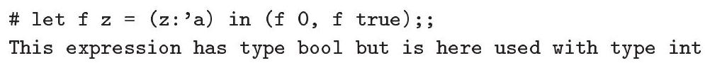

More details about the treatment of type annotations in Standard ML, Objective Caml, and Haskell are given on page 113.

关于标准ML、Objective Caml和Haskell中类型注释的处理，更多细节请参见第113页。

1.9.34 EXERcisE $[\star, \nrightarrow]$ : Determine which constraints are generated for the two programs in Example 1.9.33. Check that the former is indeed well-typed, while the latter is ill-typed.

1.9.34 练习 $[\star, \nrightarrow]$ ：确定在示例1.9.33中的两个程序生成了哪些约束。检查前一个程序确实类型正确，而后一个程序类型错误。

## Recursive types

We have shown that specializing $\operatorname{HM}(X)$ with an equality-only syntactic model yields $\operatorname{HM}(=)$, a constraint-based formulation of Damas and Milner's type system. Similarly, it is possible to specialize $\operatorname{HM}(X)$ with an equalityonly free regular tree model, yielding a constraint-based type system that may be viewed as an extension of Damas and Milner's type discipline with recursive types. This flavor of recursive types is sometimes known as equirecursive, since cyclic equations, such as $\mathrm{X}=\mathrm{X} \rightarrow \mathrm{X}$, are then satisfiable. Our theorems about type inference and type soundness, which are independent of the model, remain valid. The constraint solver described in Section 1.8 may be used in
the setting of an equality-only free regular tree model: the only difference with the syntactic case is that the occurs check is no longer performed.

我们已经证明了，将$\operatorname{HM}(X)$与仅含等式的语法模型进行特化可以得到$\operatorname{HM}(=)$，这是Damas和Milner类型系统的一种基于约束的形式化。类似地，也可以将$\operatorname{HM}(X)$与仅含等式的自由正则树模型进行特化，得到一个可以被视为Damas和Milner类型纪律扩展的基于约束的类型系统，其中包括递归类型。这种递归类型有时被称为等价递归，因为此时循环等式（如$\mathrm{X}=\mathrm{X} \rightarrow \mathrm{X}$）是可以满足的。我们关于类型推断和类型安全性的定理，这些定理与模型无关，仍然有效。第1.8节中描述的约束求解器可以用于仅含等式的自由正则树模型中：与语法情况唯一的不同在于不再执行出现检查。

Please note that, although ground types are regular, types remain finite objects: their syntax is unchanged. The $\mu$ notation commonly employed to describe recursive types may be emulated using type equations: for instance, the notation $\mu \mathrm{X} . \mathrm{X} \rightarrow \mathrm{X}$ corresponds, in our constraint-based approach, to the type scheme $\forall x[X=X \rightarrow X]$. $\mathrm{X}$.

请注意，尽管地面类型是规则的，但类型仍然是有限的对象：它们的语法保持不变。通常用来描述递归类型的 $\mu$ 符号可以使用类型方程来模拟：例如，在基于约束的方法中，记法 $\mu \mathrm{X} . \mathrm{X} \rightarrow \mathrm{X}$ 对应于类型方案 $\forall x[X=X \rightarrow X]$。$\mathrm{X}$。

Although recursive types come for free, as explained above, they have not been adopted in mainstream programming languages based on ML-the-typesystem. The reason is pragmatic: experience shows that many nonsensical expressions are well-typed in the presence of recursive types, whereas they are not in their absence. Thus, the gain in expressiveness is offset by the fact that many programming mistakes are detected later than otherwise possible. Consider, for instance, the following OCaml session:

尽管如上所述，递归类型是免费的，但它们并没有被基于ML类型系统的主流编程语言所采用。原因是实用性的：经验表明，在递归类型的存在下，许多无意义的表达式都是类型正确的，而在没有递归类型的情况下则不是。因此，表达能力的提高被许多编程错误比原来可能更晚被发现的事实所抵消。例如，考虑以下的OCaml会话：

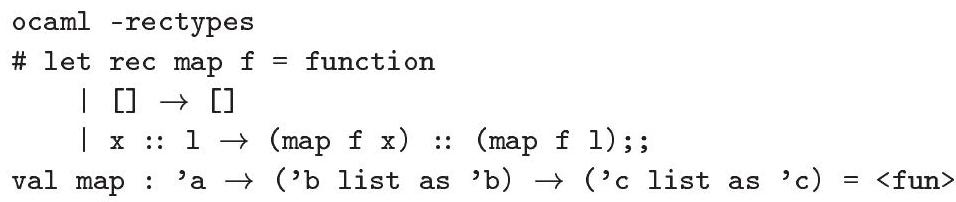

This nonsensical variant of map is essentially useless, yet well-typed. Its principal type scheme, in our notation, is $\forall \mathrm{XYZ}[\mathrm{Y}=$ list $\mathrm{Y} \wedge \mathrm{Z}=$ list $\mathrm{Z}] . \mathrm{X} \rightarrow \mathrm{Y} \rightarrow \mathrm{Z}$. In the absence of recursive types, it is ill-typed, since the constraint $Y=$ list $\mathrm{Y} \wedge \mathrm{Z}=$ list $\mathrm{Z}$ is then false.

这种荒谬的map变体基本上是无用的，但类型却很准确。在我们的表示法中，其主要类型方案是 $\forall \mathrm{XYZ}[\mathrm{Y}=$ 列表 $\mathrm{Y} \wedge \mathrm{Z}=$ 列表 $\mathrm{Z}] . \mathrm{X} \rightarrow \mathrm{Y} \rightarrow \mathrm{Z}$。在没有递归类型的情况下，它是类型不正确的，因为此时约束 $Y=$ 列表 $\mathrm{Y} \wedge \mathrm{Z}=$ 列表 $\mathrm{Z}$ 是错误的。

The need for equirecursive types is usually suppressed by the presence of algebraic data types, which offer isorecursive types, in the language. Yet, they are still necessary in some situations, such as in Objective Caml's objectoriented extension (Rémy and Vouillon, 1998), where recursive object types are commonly inferred. In order to allow recursive object types while still rejecting the above variant of map, Objective Caml's constraint solver implements a selective occurs check, which forbids cycles unless they involve the type constructor $\langle\cdot\rangle$ associated with objects. The corresponding model is a tree model where every infinite path down a tree must encounter the type constructor $\langle\cdot\rangle$ infinitely often.

递归类型的需求通常被语言中提供的代数数据类型所抑制，这些代数数据类型提供了同递归类型。然而，在一些情况下，它们仍然是必要的，比如在Objective Caml的对象导向扩展（Rémy和Vouillon，1998年）中，递归对象类型通常是被推断出来的。为了允许递归对象类型同时拒绝上述map变体，Objective Caml的约束求解器实现了一个选择性的出现检查，它禁止循环，除非它们涉及到与对象关联的类型构造器 $\langle\cdot\rangle$。相应的模型是一个树模型，其中每条从树向下延伸的无限路径都必须无限次地遇到类型构造器 $\langle\cdot\rangle$。

### 1.10 Universal quantification in constraints

### 1.10 约束中的全称量化

The constraint logic studied so far allows a set of variables $\overline{\mathrm{X}}$ to be existentially quantified within a formula $C$. The resulting formula $\exists \overline{\mathrm{x}}$. $C$ receives its standard meaning: it requires $C$ to hold for some $\overline{\mathrm{X}}$. However, we currently have no way of requiring a formula $C$ to hold for all $\overline{\mathrm{X}}$. Is it possible to extend our
logic with universal quantification? If so, what are the new possibilities offered by this extension, in terms of type inference? The present section proposes some answers to these questions.

迄今为止研究的约束逻辑允许一组变量 $\overline{\mathrm{X}}$ 在公式 $C$ 内存在量词化。得到的公式 $\exists \overline{\mathrm{x}}$. $C$ 具有其标准含义：它要求 $C$ 对某些 $\overline{\mathrm{X}}$ 成立。然而，我们目前无法要求公式 $C$ 对所有 $\overline{\mathrm{X}}$ 成立。我们能否用全称量化来扩展我们的逻辑呢？如果是，这种扩展在类型推断方面提供哪些新的可能性？本节提出对这些问题的某些答案。

It is worth noting that, although the standard notation for type schemes involves the symbol $\forall$, type scheme introduction and instantiation constraints do not allow an encoding of universal quantification. Indeed, a universal quantifier in a type scheme is very much like an existential quantifier in a constraint: this is suggested, for instance, by Definition 1.3.3 and by C-LETEx.

值得注意的是，尽管类型方案的标准表示法涉及符号$\forall$，但类型方案的引入和实例化约束并不允许编码全称量化。实际上，类型方案中的全称量词与约束中的存在量词非常相似：这一点例如由定义1.3.3和C-LETEx提出。

## Constraints

We extend the syntax of constraints as follows:

我们以下扩展约束的语法：

$$
C::=\ldots \mid \forall \overline{\mathrm{x}} . C
$$

Universally quantified variables are often referred to as rigid, while existentially quantified variables are known as flexible. The logical interpretation of constraints (Figure 1-5) is extended as follows:

普遍量化的变量通常被称为刚性的，而存在量化的变量被称为柔性的。对约束的逻辑解释（图1-5）如下扩展：

$$
\begin{gather*}
\forall \vec{t} \quad \phi[\overrightarrow{\mathrm{x}} \mapsto \vec{t}] \vdash \operatorname{def} \Gamma \text { in } C \\
\overline{\mathrm{x}} \# f t v(\Gamma)  \tag{CM-ForALL}\\
\hline \vdash \operatorname{def} \Gamma \text { in } \forall \overline{\mathrm{x}} . C
\end{gather*}
$$

We let the reader check that none of the results established in Section 1.3 are affected by this addition. Furthermore, the extended constraint language enjoys the following properties.

我们让读者验证，这一添加并没有影响到1.3节中建立的任何结果。此外，扩展的约束语言具有以下性质。

1.10.1 Lemma: $\forall \overline{\mathrm{x}} . C \Vdash C$. Conversely, $\overline{\mathrm{x}} \# \operatorname{ftv}(C)$ implies $C \Vdash \forall \overline{\mathrm{x}} . C$.

1.10.1 引理：对于所有 $\overline{\mathrm{x}}$ ，$C \Vdash C$ 。反之，如果 $\overline{\mathrm{x}} \# \operatorname{ftv}(C)$ ，那么 $C \Vdash \forall \overline{\mathrm{x}} . C$ 。

1.10.2 Lemma: $\overline{\mathrm{X}} \# \operatorname{ftv}\left(C_{2}\right)$ implies $\forall \overline{\mathrm{x}} .\left(C_{1} \wedge C_{2}\right) \equiv\left(\forall \overline{\mathrm{x}} . C_{1}\right) \wedge C_{2}$.

1.10.2 引理：$\overline{\mathrm{X}} \# \operatorname{ftv}(C_{2})$ 意味着 $\forall \overline{\mathrm{x}} .(C_{1} \wedge C_{2}) \equiv (\forall \overline{\mathrm{x}} . C_{1}) \wedge C_{2}$.

1.10.3 Lemma: $\forall \overline{\mathrm{X}} . \forall \overline{\mathrm{Y}} . C \equiv \forall \overline{\mathrm{X}} \overline{\mathrm{Y}} . C$.

1.10.3 引理：对于所有$\overline{\mathrm{X}}$和$\overline{\mathrm{Y}}$，$C$等价于对于所有$\overline{\mathrm{X}} \overline{\mathrm{Y}}$，$C$。

1.10.4 Lemma: Let $\overline{\mathrm{x}} \# \overline{\mathrm{Y}}$. Then, $\exists \overline{\mathrm{x}} . \forall \overline{\mathrm{Y}} . C$ entails $\forall \overline{\mathrm{Y}} . \exists \overline{\mathrm{X}} . C$. Conversely, if $\exists \overline{\mathrm{Y}} . C$ determines $\overline{\mathrm{X}}$, then $\forall \overline{\mathrm{Y}} . \exists \overline{\mathrm{X}} . C$ entails $\exists \overline{\mathrm{X}} . \forall \overline{\mathrm{Y}} . C$.

1.10.4 引理：设 $\overline{\mathrm{x}} \# \overline{\mathrm{Y}}$。那么，$\exists \overline{\mathrm{x}} . \forall \overline{\mathrm{Y}} . C$ 意味着 $\forall \overline{\mathrm{Y}} . \exists \overline{\mathrm{X}} . C$。反之，如果 $\exists \overline{\mathrm{Y}} . C$ 决定 $\overline{\mathrm{X}}$，那么 $\forall \overline{\mathrm{Y}} . \exists \overline{\mathrm{X}} . C$ 意味着 $\exists \overline{\mathrm{X}} . \forall \overline{\mathrm{Y}} . C$。

## Constraint solving

约束求解##

We briefly explain how to extend the constraint solver described in Section 1.8 with support for universal quantification. (Thus, we again assume an equalityonly free tree model.) Constraint solving in the presence of equations and of existential and universal quantifiers is known as unification under a mixed prefix. It is a particular case of the decision problem for the first-order theory of equality on trees; see e.g. (Comon and Lescanne, 1989). Extending our solver is straightforward: in fact, the treatment of universal quantifiers turns

我们简要说明如何扩展第1.8节中描述的约束求解器，以支持全称量化。（因此，我们再次假设一个仅包含等式的自由树模型。）在方程和存在量词、全称量词的情况下进行的约束求解称为混合前缀下的统一。它是关于树上的第一阶等式理论的决策问题的一个特例；例如参见（Comon和Lescanne，1989年）。扩展我们的求解器是直接的：实际上，全称量词的处理转换成了。

$$
\begin{aligned}
& S ; U ; \forall \overline{\mathrm{x}} . C \quad \rightarrow \quad S[\forall \overline{\mathrm{x}} . \square] ; U ; C \\
& \text { if } \overline{\mathrm{x}} \# f t v(U) \\
& S[\forall \overline{\mathrm{X}} . \exists \overline{\mathrm{Y}} \overline{\mathrm{Z}} .[]] ; U ; \text { true } \quad \rightarrow \quad S[\exists \overline{\mathrm{Y}} . \forall \overline{\mathrm{X}} . \exists \overline{\mathrm{Z}} .[]] ; U ; \text { true } \\
& \text { if } \overline{\mathrm{X}} \# \overline{\mathrm{Y}} \wedge \exists \overline{\mathrm{X}} \overline{\mathrm{Z}} \cdot U \text { determines } \overline{\mathrm{Y}} \\
& S[\forall \overline{\mathrm{x}} \mathrm{X} . \exists \overline{\mathrm{Y}} .[]] ; U ; \text { true } \rightarrow \text { false } \\
& \text { if } \mathrm{X} \notin \overline{\mathrm{Y}} \wedge \mathrm{X} \prec_{U}^{\star} \mathrm{Z} \wedge \mathrm{Z} \notin \mathrm{X} \overline{\mathrm{Y}} \\
& S[\forall \overline{\mathrm{X}} \mathrm{X} . \exists \overline{\mathrm{Y}} . \square] ; \mathrm{X}=\mathrm{T}=\epsilon \wedge U ; \text { true } \rightarrow \text { false } \\
& \text { if } \mathrm{X} \notin \overline{\mathrm{Y}} \wedge \mathrm{T} \notin \mathcal{V} \\
& S[\forall \overline{\mathrm{X}} . \exists \overline{\mathrm{Y}} . \square] ; U_{1} \wedge U_{2} ; \text { true } \rightarrow S ; U_{1} ; \text { true } \\
& \text { if } \overline{\mathrm{X}} \overline{\mathrm{Y}} \# \operatorname{ftv}\left(U_{1}\right) \wedge \exists \overline{\mathrm{Y}} \cdot U_{2} \equiv \text { true }
\end{aligned}
$$

## Figure 1-16: Solving universal constraints

## 图1-16：解决通用约束条件

out to be surprisingly analogous to that of let constraints. To begin, we extend the syntax of stacks with so-called universal frames:

实际上是出人意料地类似于let约束的那个。首先，我们用所谓的通用帧扩展堆栈的语法：

$$
S::=\ldots \mid S[\forall \overline{\mathrm{x}} . \square]
$$

Because existential quantifiers cannot, in general, be hoisted out of universal quantifiers, rules S-Ex-1 to S-Ex-4 now allow floating them up to the nearest enclosing let or universal frame, if any, or to the outermost level, otherwise. Thus, in our machine representation of stacks, where rules S-Ex-1 to S-Ex-4 are applied in an eager fashion, every universal frame carries a list of the type variables that are existentially bound immediately after it, and integer ranks count not only let frames, but also universal frames.

因为一般来说，存在量词不能从全称量词中提升出来，规则S-Ex-1至S-Ex-4现在允许将它们提升到最近的封闭let或全称框架，如果有，否则提升到最外层。因此，在我们的堆栈机表示中，规则S-Ex-1至S-Ex-4以急切的方式应用，每个全称框架都携带一个类型变量的列表，这些变量在它之后立即存在性地绑定，而整数等级不仅计算let框架，还计算全称框架。

The solver's specification is extended with the rules in Figure 1-16. SSolve-All, a forward rule, discovers a universal constraint and enters it, creating a new universal frame to record its existence. S-ALLEx exploits Lemma 1.10.4 to hoist existential quantifiers out of the universal frame. It is analogous to S-LETALL, and its implementation may rely upon the same procedure (Exercise 1.8.8). The next two rules detect failure conditions. SALL-FAIL-1 states that the constraint $\forall \mathrm{X} . \exists \overline{\mathrm{Y}} . U$ is false if the rigid variable $\mathrm{X}$ is directly or indirectly dominated by a free variable $\mathrm{Z}$. Indeed, the value of $\mathrm{X}$ is then determined by that of $\mathrm{Z}$-but a universally quantified variable ranges over all values, so this is a contradiction. In such a case, $\mathrm{X}$ is commonly said to escape its scope. S-ALL-FAIL-2 states that the same constraint is false if $\mathrm{X}$ is equated with a nonvariable term. Indeed, the value of $\mathrm{X}$ is then
partially determined, since its head constructor is known, which again contradicts its universal status. Last, S-POP-ALL splits the current unification constraint into two components $U_{1}$ and $U_{2}$, where $U_{1}$ is made up entirely of old variables and $U_{2}$ constrains young variables only. This decomposition is analogous to that performed by S-POP-LET. Then, it is not difficult to check that $\forall \overline{\mathrm{X}} . \exists \overline{\mathrm{Y}}$. $\left(U_{1} \wedge U_{2}\right)$ is equivalent to $U_{1}$. So, the universal frame, as well as $U_{2}$, are discarded, and the solver proceeds by examining whatever remains on top of the stack $S$.

求解器的规格在图1-16的规则中进行了扩展。SSolve-All是一个前向规则，它发现了一个普遍约束并将其输入，创建了一个新的普遍框架来记录其存在。S-ALLEx利用引理1.10.4将存在量词从普遍框架中提升出来。它类似于S-LETALL，其实现可能依赖于相同的程序（练习1.8.8）。接下来两个规则检测失败条件。SALL-FAIL-1指出，如果刚体变量X直接或间接被自由变量Z支配，那么约束$\forall \mathrm{X} . \exists \overline{\mathrm{Y}} . U$是假的。实际上，X的值那时由Z的值确定，但是普遍量化的变量涵盖所有值，所以这是矛盾的。在这种情况下，通常说X逃出了其作用域。S-ALL-FAIL-2指出，如果X与非变量项相等，则同一约束也是假的。实际上，X的值部分确定，因为其头构造器是已知的，这再次与它的普遍地位相矛盾。最后，S-POP-ALL将当前的统一约束分解为两个组成部分$U_{1}$和$U_{2}$，其中$U_{1}$完全由旧变量组成，而$U_{2}$只约束新变量。这种分解类似于S-POP-LET执行的操作。然后，不难检查$\forall \overline{\mathrm{X}} . \exists \overline{\mathrm{Y}}$。$\left(U_{1} \wedge U_{2}\right)$等价于$U_{1}$。因此，普遍框架以及$U_{2}$都被丢弃，求解器通过检查堆栈S顶部的其余内容继续进行。

It is possible to further extend the treatment of universal frames with two rules analogous to S-COMPRESS and S-UNNAME. In practice, this improves the solver's efficiency, and makes it easier to share code between the treatment of let frames and that of universal frames.

可以进一步扩展通用帧的处理，使用两个类似于S-COMPRESS和S-UNNAME的规则。实际上，这提高了求解器的效率，并使得在let帧处理和通用帧处理之间共享代码变得更加容易。

It is interesting to remark that, as far as the underlying unification algorithm is concerned, there is no difference between existentially and universally quantified type variables. The algorithm solves whatever equations are presented to it, without inquiring about the status of their variables. Equations that lead to failure, because a rigid variable escapes its scope or is equated with a nonvariable term, are detected only when the universal frame is exited. A perhaps more common approach is to mark rigid variables as such, allowing the unification algorithm to signal failure as soon as one of the two error conditions is encountered. In this approach, a rigid variable may successfully unify only with itself or with flexible variables fresher than itself. It is often called a Skolem constructor in the literature (Läufer and Odersky, 1994; Shields and Peyton Jones, 2002). An interesting variant of this approach appears in Dowek, Hardin, Kirchner and Pfenning's treatment of (higher-order) unification $(1995 ; 1998)$, where flexible variables are represented as ordinary variables, while rigid variables are encoded using De Bruijn indices.

值得注意的是，就底层的统一算法而言，存在量化和普遍量化类型变量之间没有区别。该算法解决呈现给它的任何方程，而不询问它们变量的状态。导致失败的那些方程，因为一个刚性变量逃逸了它的作用域，或者与一个非变量项相等，只有在退出普遍框架时才会被检测到。或许更常见的方法是将刚性变量标记为刚性，使得统一算法在遇到两个错误条件之一时立即发出失败信号。在这种方法中，刚性变量可能只成功与自己或比自己更新的灵活变量统一。在文献中，它通常被称为Skolem构造器（Läufer和Odersky，1994；Shields和Peyton Jones，2002）。这种方法的 一种有趣的变体出现在Dowek，Hardin，Kirchner和Pfenning对（高阶）统一处理中（1995；1998年），其中灵活变量被表示为普通变量，而刚性变量则使用De Bruijn索引进行编码。

The properties of our constraint solver are preserved by this extension: it is possible to prove that Lemmas 1.8.9, 1.8.10, and 1.8.11 remain valid.

我们约束求解器的属性通过这个扩展得到了保持：有可能证明引理1.8.9、1.8.10和1.8.11仍然有效。

## Type annotations, continued

类型注解，继续

In Section 1.9, we introduced the expression form ( $t: \exists \overline{\mathrm{X}} . \mathrm{T}$ ), allowing an expression $t$ to be annotated with a type $\mathrm{T}$ whose free variables $\overline{\mathrm{X}}$ are locally and existentially bound. It is now natural to introduce the symmetric expression form ( $\mathrm{t}: \forall \overline{\mathrm{X}} . \mathrm{T}$ ), where $\mathrm{T}$ has kind $\star, \overline{\mathrm{X}}$ is bound within $\mathrm{T}$, and $\overline{\mathrm{X}}$ contains $f t v(\mathrm{~T})$, as before. Its constraint generation rule is as follows:

在1.9节中，我们引入了表达式形式（$t: \exists \overline{\mathrm{X}} . \mathrm{T}$），允许表达式$t$用带有局部和存在性绑定的自由变量$\overline{\mathrm{X}}$的类型$\mathrm{T}$进行注释。现在很自然地引入了对称的表达式形式（$\mathrm{t}: \forall \overline{\mathrm{X}} . \mathrm{T}$），其中$\mathrm{T}$具有种类$\star$，$\overline{\mathrm{X}}$在$\mathrm{T}$内绑定，并且$\overline{\mathrm{X}}$包含$f t v(\mathrm{~T})$，如前所述。其约束生成规则如下：

$$
\llbracket(\mathrm{t}: \forall \overline{\mathrm{X}} \cdot \mathrm{T}): \mathrm{T}^{\prime} \rrbracket=\forall \overline{\mathrm{X}} \cdot \llbracket \mathrm{t}: \mathrm{T} \rrbracket \wedge \exists \overline{\mathrm{X}} \cdot\left(\mathrm{T} \leq \mathrm{T}^{\prime}\right) \quad \text { provided } \overline{\mathrm{X}} \# f t v\left(\mathrm{t}, \mathrm{T}^{\prime}\right)
$$

The first conjunct requires $t$ to have type $T$ for all values of $\overline{\mathrm{X}}$. Here, the type variables $\overline{\mathrm{X}}$ are universally bound, as expected. The second conjunct requires
$\mathrm{T}^{\prime}$ to be some instance of the universal annotation $\forall \overline{\mathrm{X}}$.T. Since $\mathrm{T}^{\prime}$ is only a monotype, it seems difficult to think of another sensible way of constraining $\mathrm{T}^{\prime}$. For this reason, the type variables $\overline{\mathrm{X}}$ are still existentially bound in the second conjunct. This makes the interpretation of the universal quantifier in type annotations a bit more complex than that of the existential quantifier. For instance, when subtyping is interpreted as equality, the constraint generation rule may be read: a valid type for ( $\mathrm{t}: \forall \overline{\mathrm{X}} . \mathrm{T}$ ) is of the form $\mathrm{T}$, for some choice of the type variables $\overline{\mathrm{X}}$, provided $\mathrm{t}$ has type $\mathrm{T}$ for all choices of $\overline{\mathrm{X}}$.

第一个连接词要求对所有$\overline{\mathrm{X}}$的值，$t$具有类型$T$。在这里，类型变量$\overline{\mathrm{X}}$按预期是普遍约束的。第二个连接词要求$\mathrm{T}^{\prime}$是普遍注解$\forall \overline{\mathrm{X}}$.T的某个实例。由于$\mathrm{T}^{\prime}$只是一个单型，似乎很难想到另一种合理的限制$\mathrm{T}^{\prime}$的方法。因此，在第二个连接词中，类型变量$\overline{\mathrm{X}}$仍然存在性约束。这使得类型注解中普遍量词的解释比存在量词的解释要复杂一些。例如，当子类型被解释为等式时，约束生成规则可以这样理解：对于（$\mathrm{t}: \forall \overline{\mathrm{X}} . \mathrm{T}$）的有效类型形式是$\mathrm{T}$，对于类型变量$\overline{\mathrm{X}}$的某些选择，前提是对于所有$\overline{\mathrm{X}}$的选择，$\mathrm{t}$具有类型$\mathrm{T}$。

We remark that ( $t: \forall \overline{\mathrm{X}} . \mathrm{T}$ ) must be a new expression form: it cannot be encoded by adding new constants to the calculus-whereas ( $t: \exists \bar{X} . T$ ) couldbecause none of the existing constraint generation rules produce universally quantified constraints. Like all type annotations, it has identity semantics.

我们注意到（$t: \forall \overline{\mathrm{X}} . \mathrm{T}$）必须是一种新的表达式形式：它不能通过向演算中添加新常量来编码——而（$t: \exists \bar{X} . T$）却可以，因为现有的约束生成规则都不会产生普遍量化约束。与所有类型注释一样，它具有标识语义。

What is the use of universal type annotations, compared with existential type annotations? When a type variable is existentially bound, the typechecker is free to assign it whatever value makes the program well-typed. As a result, the expressions $(\lambda z . z \hat{+} \hat{1}: \exists X . X \rightarrow X)$ and $(\lambda z . z: \exists X . X \rightarrow X)$ are both welltyped: $\mathrm{X}$ is assigned int in the former case, and remains undetermined in the latter. However, it is sometimes useful to be able to insist that an expression should be polymorphic. This effect is naturally achieved by using a universally bound type variable. Indeed, $(\lambda z \cdot z \hat{+} \hat{1}: \forall \mathrm{X} . \mathrm{X} \rightarrow \mathrm{X})$ is ill-typed, because $\forall \mathrm{X} .(\mathrm{X}=$ int) is false, while ( $\lambda z \cdot z: \forall X . X \rightarrow X)$ is well-typed.

通用类型注释与存在类型注释的比较有什么用？当类型变量存在性地绑定时，类型检查器可以自由地给它分配任何使程序类型正确的值。因此，表达式 $(\lambda z . z + 1: \exists X . X \rightarrow X)$ 和 $(\lambda z . z: \exists X . X \rightarrow X)$ 都是类型正确的：在前者情况下，$X$ 被分配为 int，而在后者中则保持未确定。然而，有时坚持表达式应该是多态的很有用。这种效果可以通过使用普遍绑定的类型变量自然地实现。实际上，$(\lambda z . z + 1: \forall X . X \rightarrow X)$ 是类型错误的，因为 $\forall X .(X=$ int) 是假的，而 $(\lambda z . z: \forall X . X \rightarrow X)$ 是类型正确的。

1.10.5 EXERCISE $[\star]$ : Write down the constraints $\exists z \cdot \llbracket(\lambda z \cdot z \hat{+} \hat{1}: \forall \mathrm{X} . \mathrm{X} \rightarrow \mathrm{X}): \mathrm{Z} \rrbracket$ and $\exists Z . \llbracket(\lambda z . z: \forall X . X \rightarrow X): z \rrbracket$, which tell whether these expressions are well-typed. Check that the former is false, while the latter is satisfiable.

1.10.5 练习 $[\star]$ ：写下约束 $\exists z \cdot \llbracket(\lambda z \cdot z \hat{+} \hat{1}: \forall \mathrm{X} . \mathrm{X} \rightarrow \mathrm{X}): \mathrm{Z} \rrbracket$ 和 $\exists Z . \llbracket(\lambda z . z: \forall X . X \rightarrow X): z \rrbracket$，这些约束指明了这些表达式是否类型正确。检查前者是错误的，而后者是可以满足的。

A universal type annotation, as defined above, is nothing but a (closed) Damas-Milner type scheme. Thus, the new construct ( $t: \forall \overline{\mathrm{X}} . \mathrm{T}$ ) gives us the ability to ensure that the expression $t$ admits the type scheme $\forall \overline{\mathrm{X}}$.T. This feature is exploited at the module level in ML-the-programming-language, where it is necessary to check that the inferred type for a module component $t$ is more general than the type scheme $\mathrm{S}$ that appears in the module's signature. In our view, this process simply consists in ensuring that $(t: S)$ is well-typed.

一个通用的类型注释，如上所述，不过是（封闭的）Damas-Milner类型方案。因此，新的构造（$t: \forall \overline{\mathrm{X}} . \mathrm{T}$）使我们能够确保表达式$t$承认类型方案$\forall \overline{\mathrm{X}}.T$。这一特性在ML编程语言的模块级别中被利用，在那里需要检查推断的模块组件$t$的类型比模块签名中出现的类型方案$\mathrm{S}$更为通用。在我们看来，这个过程简单来说就是确保$(t: S)$类型正确。

In Section 1.9, we have pointed out that local (that is, closed) type annotations offer limited expressiveness, because they cannot share type variables. To lift this limitation, we have introduced the expression forms $\exists \overline{\mathrm{X}}$. $\mathrm{t}$ and ( $\mathrm{t}: \mathrm{T}$ ). The former binds the type variables $\overline{\mathrm{X}}$ within $t$, making them available for use in type annotations, and instructs the constraint generator to existentially quantify them at this point. The latter requires $t$ to have $T$. It is natural to proceed in the same manner in the case of universal type annotations. We now introduce the expression form $\forall \overline{\mathrm{X}}$.t, which also binds $\overline{\mathrm{X}}$ within $t$, but comes
with a different constraint generation rule:

在第1.9节中，我们指出局部的（即闭合的）类型注解表达能力有限，因为它们不能共享类型变量。为了克服这个限制，我们引入了表达式形式 $\exists \overline{\mathrm{X}}$. $\mathrm{t}$ 和 ( $\mathrm{t}: \mathrm{T}$ )。前者在 $t$ 中绑定类型变量 $\overline{\mathrm{X}}$，使它们能在类型注解中使用，并指示约束生成器在这个点存在性地量化它们。后者要求 $t$ 具有 $T$。在普遍类型注解的情况下，以同样的方式继续是自然的。我们现在引入表达式形式 $\forall \overline{\mathrm{X}}$.t，它同样在 $t$ 中绑定 $\overline{\mathrm{X}}$，但带有不同的约束生成规则：

$$
\llbracket \forall \overline{\mathrm{x}} . \mathrm{t}: \mathrm{T} \rrbracket=\forall \overline{\mathrm{X}} \cdot \exists \mathrm{Z} \cdot \llbracket \mathrm{t}: \mathrm{Z} \rrbracket \wedge \exists \overline{\mathrm{X}} \cdot \llbracket \mathrm{t}: \mathrm{T} \rrbracket \quad \text { provided } \overline{\mathrm{X}} \# f t v(\mathrm{~T}) \wedge \mathrm{Z} \notin f t v(\mathrm{t})
$$

This rule is a bit more complex than that associated with the expression form $\exists \bar{X}$.t. Again, this is due to the fact that we do not wish to overconstrain T. The first exercise below shows that a more naïve version of the rule does not yield the desired behavior. The second exercise shows that this version does. The third exercise clarifies an efficiency concern.

这条规则比与表达式形式 $\exists \bar{X}$.t 关联的规则要复杂一些。这同样是因为我们不想过度限制 T。下面第一个练习展示了更为天真的版本的规则并不能产生预期的效果。第二个练习显示了这一版本可以。第三个练习则澄清了一个效率问题。

1.10.6 EXERCISE $[\star]$ : Assume that $\llbracket \forall \overline{\mathrm{X}} . \mathrm{t}: \mathrm{T} \rrbracket$ is defined as $\forall \overline{\mathrm{X}}$. $\llbracket \mathrm{t}: \mathrm{T} \rrbracket$, provided $\overline{\mathrm{X}} \# \operatorname{ftv}(\mathrm{T})$. Write down the constraint $\llbracket \forall \mathrm{X} .(\lambda \mathrm{z} \cdot \mathrm{z}: \mathrm{X} \rightarrow \mathrm{X}): \mathrm{Z} \rrbracket$. Can you describe its solutions? Does it have the intended meaning?

1.10.6 练习 $[\star]$ ：假设 $\llbracket \forall \overline{\mathrm{X}} . \mathrm{t}: \mathrm{T} \rrbracket$ 定义为 $\forall \overline{\mathrm{X}}$. $\llbracket \mathrm{t}: \mathrm{T} \rrbracket$，条件是 $\overline{\mathrm{X}} \# \operatorname{ftv}(\mathrm{T})$。写下约束 $\llbracket \forall \mathrm{X} .(\lambda \mathrm{z} \cdot \mathrm{z}: \mathrm{X} \rightarrow \mathrm{X}): \mathrm{Z} \rrbracket$。你能描述它的解吗？它有预期的含义吗？

1.10.7 ExErcise $[\star \star]$ : Let $\overline{\mathrm{x}} \supseteq f t v(\mathrm{~T})$ and $\overline{\mathrm{x}} \# f t v(\mathrm{t})$. Check that the constraints $\llbracket(\mathrm{t}: \forall \overline{\mathrm{X}} . \mathrm{T}): \mathrm{T}^{\prime} \rrbracket$ and $\llbracket \forall \overline{\mathrm{X}} .(\mathrm{t}: \mathrm{T}): \mathrm{T}^{\prime} \rrbracket$ are equivalent. In other words, local universal type annotations may also be expressed in terms of the more complex constructs described above.

1.10.7练习 $[\star \star]$ ：设 $\overline{\mathrm{x}} \supseteq f t v(\mathrm{~T})$ 且 $\overline{\mathrm{x}} \# f t v(\mathrm{t})$ 。检查约束 $\llbracket(\mathrm{t}: \forall \overline{\mathrm{X}} . \mathrm{T}): \mathrm{T}^{\prime} \rrbracket$ 和 $\llbracket \forall \overline{\mathrm{X}} .(\mathrm{t}: \mathrm{T}): \mathrm{T}^{\prime} \rrbracket$ 是否等价。换句话说，局部通用类型注解也可以用上述更复杂结构来表达。

1.10.8 EXERCISE $[\star \star \star \star, \nrightarrow]$ : The constraint generation rule that appears above compromises the linear time and space complexity of constraint generation, because it duplicates the term $t$. It is possible to avoid this problem, but this requires a slight generalization of the constraint language. Let us write let $\mathrm{x}: \forall \underline{\underline{X}} \bar{Y}\left[C_{1}\right] . \mathrm{T}$ in $C_{2}$ for $\forall \overline{\mathrm{X}} . \exists \overline{\mathrm{Y}} . C_{1} \wedge$ def $\mathrm{x}: \forall \overline{\mathrm{X}} \overline{\mathrm{Y}}\left[C_{1}\right] . \mathrm{T}$ in $C_{2}$. In this extended let form, the underlined variables $\overline{\mathrm{x}}$ are interpreted as rigid, instead of flexible, while checking that $C_{1}$ is satisfiable. However, the type scheme associated with $\mathrm{x}$ is not affected. Check that the above constraint generation rule may now be written as follows:

1.10.8 练习 $[\star \star \star \star, \nrightarrow]$ ：上述出现的约束生成规则损害了约束生成的线性时间和空间复杂度，因为它复制了项 $t$。有可能避免这个问题，但这需要对约束语言进行轻微的泛化。让我们在 $C_{2}$ 中写下 $\mathrm{x}:\forall \underline{\underline{X}} \bar{Y}[C_{1}].\mathrm{T}$ 用于 $\forall \overline{\mathrm{X}}.\exists \overline{\mathrm{Y}}.C_{1} \wedge$ 定义 $\mathrm{x}:\forall \overline{\mathrm{X}} \overline{\mathrm{Y}}[C_{1}].\mathrm{T}$ 在 $C_{2}$ 中。在这种扩展的 let 形式中，下划线的变量 $\overline{\mathrm{x}}$ 被解释为刚性的，而不是灵活的，同时在检查 $C_{1}$ 是否可满足时。然而，与 $\mathrm{x}$ 相关联的类型方案不受影响。检查上述约束生成规则现在可以按照以下方式编写：

$$
\llbracket \forall \overline{\mathrm{X}} . \mathrm{t}: \mathrm{T} \rrbracket=\text { let } \mathrm{x}: \forall \underline{\mathrm{x}} \mathrm{z}[\llbracket \mathrm{t}: \mathrm{Z} \rrbracket] . \mathrm{Z} \text { in } \mathrm{x} \preceq \mathrm{T} \quad \text { provided } \mathrm{Z} \notin f t v(\mathrm{t})
$$

Roughly speaking, the new rule forms a most general type scheme for $t$, ensures that the type variables $\overline{\mathrm{X}}$ are unconstrained in it, and checks that $\mathrm{T}$ is an instance of it. Furthermore, it does not duplicate t. To complete the exercise, extend the specification of the constraint solver (Figures 1-12 and 116), as well as its implementation, to deal with this extension of the constraint language.

大致来说，新规则为$t$形成了一种最一般的类型模式，确保类型变量$\overline{\mathrm{X}}$在其中不受限制，并检查$\mathrm{T}$是其一个实例。此外，它不会重复t。为了完成这个练习，扩展约束求解器的规格说明（图1-12和116），以及它的实现，以处理这种约束语言的扩展。

To conclude, let us once again stress that, if $\mathrm{T}$ has free type variables, the effect of the type annotation ( $\mathrm{t}: \mathrm{T}$ ) depends on how and where they are bound. The effect of how stems from the fact that binding a type variable universally, rather than existentially, leads to a stricter constraint. Indeed, we let the reader check that $\llbracket \forall \overline{\mathrm{X}} . \mathrm{t}: \mathrm{T} \rrbracket$ entails $\llbracket \exists \overline{\mathrm{X}} . \mathrm{t}: \mathrm{T} \rrbracket$, while the converse
does not hold in general. The effect of where has been illustrated, in the case of existentially bound type variables, in Section 1.9. It is due, in that case, to the fact that let and $\exists$ do not commute. In the case of universally bound type variables, it may be imputed to the fact that $\forall$ and $\exists$ do not commute. For instance, $\lambda \mathrm{z} . \forall \mathrm{X} .(\mathrm{z}: \mathrm{x})$ is ill-typed, because inside the $\lambda$-abstraction, the program variable $\mathrm{z}$ cannot be said to have every type. However, $\forall \mathrm{X} . \lambda \mathrm{z} .(\mathrm{z}: \mathrm{X})$ is well-typed, because the identity function does have type $\mathrm{X} \rightarrow \mathrm{X}$ for every $\mathrm{X}$.

总之，让我们再次强调，如果$\mathrm{T}$具有自由类型变量，类型注释（$\mathrm{t}: \mathrm{T}$）的效果取决于它们是如何和在哪里绑定的。如何绑定的效果源于这样一个事实：普遍绑定类型变量而非存在性绑定会导致更严格的约束。实际上，我们让读者验证$\llbracket \forall \overline{\mathrm{X}} . \mathrm{t}: \mathrm{T} \rrbracket$蕴含$\llbracket \exists \overline{\mathrm{X}} . \mathrm{t}: \mathrm{T} \rrbracket$，而反之则通常不成立。在哪里绑定的效果，在存在性绑定类型变量的情况下，已在第1.9节中说明。这种情况下的原因在于let和$\exists$不交换。在普遍绑定类型变量情况下，可能归因于$\forall$和$\exists$不交换的事实。例如，$\lambda \mathrm{z} . \forall \mathrm{X} .(\mathrm{z}: \mathrm{x})$是类型错误的，因为在$\lambda$抽象内部，不能说程序变量$\mathrm{z}$具有每种类型。然而，$\forall \mathrm{X} . \lambda \mathrm{z} .(\mathrm{z}: \mathrm{X})$是类型正确的，因为身份函数确实对每个$\mathrm{X}$都有类型$\mathrm{X} \rightarrow \mathrm{X}$。

1.10.9 EXERCISE $[\star]$ : Write down the constraints $\exists Z . \llbracket \lambda z . \forall x .(z: x): z \rrbracket$ and $\exists Z . \llbracket \forall \mathrm{x} . \lambda \mathrm{z} .(\mathrm{z}: \mathrm{X}): \mathrm{Z} \rrbracket$, which tell whether these expressions are well-typed. Is the former satisfiable? Is the latter?

1.10.9 练习 $[\star]$：写下约束 $\exists Z . \llbracket \lambda z . \forall x .(z: x): z \rrbracket$ 和 $\exists Z . \llbracket \forall x . \lambda z .(z: X): Z \rrbracket$，这些约束说明这些表达式是否类型正确。前者是否可满足？后者呢？

In Standard ML and Objective Caml, the type variables that appear in type annotations are implicitly bound. That is, there is no syntax in the language for the constructs $\exists \bar{X}$. $t$ and $\forall \bar{x}$.t. When a type annotation ( $t: T$ ) contains a free type variable $\mathrm{X}$, a fixed convention tells how and where $\mathrm{X}$ is bound. In Standard ML, $\mathrm{X}$ is universally bound at the nearest val binding that encloses all related occurrences of X (Milner, Tofte, and Harper, 1990). The 1997 revision of Standard ML (Milner, Tofte, Harper, and MacQueen, 1997b) slightly improves on this situation by allowing type variables to be explicitly introduced at val bindings. However, they still must be universally bound. In Objective Caml, $\mathrm{X}$ is existentially bound at the nearest enclosing toplevel let binding; this behavior seems to be presently undocumented. We argue that (i) allowing type variables to be implicitly introduced is confusing; and (ii) for expressiveness, both universal and existential quantifiers should be made available to programmers. Surprisingly, these language design and type inference issues seem to have received little attention in the literature, although they have most likely been "folklore" for a long time. Peyton Jones and Shields (2003) study these issues in the context of Haskell, and concur with (i). Concerning (ii), they seem to think that the language designer must choose between existential and universal type variable introduction formswhich they refer to as "type-sharing" and "type-lambda"-whereas we point out that they may and should coexist.

在标准ML和Objective Caml中，类型注释中出现的类型变量是隐式绑定的。也就是说，语言中没有用于构造 $\exists \bar{X}$ 和 $\forall \bar{x}$.t 的语法。当一个类型注释（ $t: T$ ）包含一个自由类型变量 $\mathrm{X}$ 时，一个固定的约定决定了如何以及在哪里绑定 $\mathrm{X}$ 。在标准ML中， $\mathrm{X}$ 在最近的 val 绑定中普遍绑定，这个绑定包含了所有相关的 $\mathrm{X}$ 出现（Milner, Tofte, 和 Harper, 1990）。1997年对标准ML的修订（Milner, Tofte, Harper, 和 MacQueen, 1997b）通过允许在 val 绑定中显式引入类型变量，略微改进了这种情况。然而，它们仍然必须是普遍绑定的。在Objective Caml中， $\mathrm{X}$ 在最近的顶层 let 绑定中存在性地绑定；这种行为似乎目前没有文档记录。我们认为，（i）允许隐式引入类型变量是令人困惑的；以及（ii）为了表达性，应该向程序员提供普遍和存在量词。令人惊讶的是，尽管这些问题很可能已经很长时间被视为“民间传统”，但关于这些语言设计和类型推断的问题在文献中似乎鲜少受到关注。Peyton Jones 和 Shields (2003) 在 Haskell 的背景下研究这些问题，并同意（i）。关于（ii），他们似乎认为语言设计者必须在存在和普遍类型变量引入形式之间进行选择——他们将这两种形式称为“类型共享”和“类型lambda”，而我们指出它们可以也应该共存。

## Polymorphic recursion

多态递归

Example 1.2.10 explains how the letrec construct found in ML-theprogramming-language may be viewed as an application of the constant fix, wrapped inside a normal let construct. Exercise 1.9.6 shows that this gives rise to a somewhat restrictive constraint generation rule: generalization occurs only after the application of fix is typechecked. In other words, in letrec $f=\lambda$ z.t $_{1}$ in $t_{2}$, all occurrences of $f$ within $t_{1}$ must have the same
(monomorphic) type. This restriction is sometimes a nuisance, and seems unwarranted: if the function that is being defined is polymorphic, it should be possible to use it at different types even inside its own definition. Indeed, Mycroft (1984) extended Damas and Milner's type system with a more liberal treatment of recursion, commonly known as polymorphic recursion. The idea is to only request occurrences of $f$ within $t_{1}$ to have the same type scheme. Hence, they may have different types, all of which are instances of a common type scheme. It was later shown that well-typedness in Mycroft's extended type system is undecidable (Henglein, 1993; Kfoury, Tiuryn, and Urzyczyn, 1993). To work around this stumbling block, one solution is to use a semialgorithm, falling back to monomorphic recursion if it does not succeed or fail in reasonable time. Although such a solution might be appealing in the setting of an automated program analysis, it is less so in the setting of a programmer-visible type system, because it may become difficult to understand why a program is ill-typed. Thus, we describe a simpler solution, which consists in requiring the programmer to explicitly supply a type scheme for f. This is an instance of a mandatory type annotation.

例子1.2.10解释了如何在ML编程语言中看待letrec构造，它可以被视为常量fix的一个应用，包装在普通的let构造内部。练习1.9.6表明这产生了一个有些限制性的约束生成规则：泛化仅在fix应用类型检查之后发生。换句话说，在letrec $f=\lambda$ z.t $_{1}$ in $t_{2}$中，$t_{1}$中所有$f$的出现必须具有相同的（单态）类型。这种限制有时很麻烦，似乎没有根据：如果正在定义的函数是多态的，那么即使在其自己的定义内部，也应该能够使用不同的类型。实际上，Mycroft（1984）扩展了Damas和Milner的类型系统，加入了对递归更宽松的处理，通常称为多态递归。这个想法是只要求$t_{1}$中$f$的出现具有相同的类型方案。因此，它们可能有不同的类型，但都是共同类型方案实例。后来证明，在Mycroft扩展的类型系统中，类型良好性是不可判定的（Henglein, 1993; Kfoury, Tiuryn, 和 Urzyczyn, 1993）。为了绕过这个难题，一个解决方案是使用半算法，如果它在合理的时间内不成功或失败，则退回到单态递归。尽管这样的解决方案在自动化程序分析的背景下可能很有吸引力，但在程序员可见的类型系统背景下则不太吸引人，因为它可能变得难以理解为什么程序是类型不良的。因此，我们描述了一个更简单的解决方案，即要求程序员显式地为f提供一个类型方案。这是强制类型注释的一个实例。

To begin, we must change the status of fix, because if fix remains a constant, then $f$ must remain $\lambda$-bound and cannot receive a polymorphic type scheme. We turn fix into a language construct, which binds a program variable $f$, and annotates it with a DM type scheme. The syntax of values and expressions is thus extended as follows:

首先，我们必须改变fix的状态，因为如果fix保持不变，那么$f$必须保持$\lambda$-绑定，并且不能接受多态类型方案。我们将fix转换成一种语言构造，它绑定一个程序变量$f$，并用DM类型方案对其进行注释。因此，值和表达式的语法扩展如下：

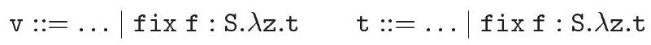

Please note that $f$ is bound within $\lambda$ z.t. The operational semantics is extended as follows.

请注意，$f$ 在 $\lambda$ 中绑定，使得操作语义如下扩展。

$$
\begin{equation*}
(f i x f: S . \lambda z . t) v \longrightarrow(\text { let } f=f i x f: S . \lambda z . t \text { in } \lambda z . t) v \tag{R-FIX'}
\end{equation*}
$$

The type annotation $\mathrm{S}$ plays no essential role in the reduction; it is merely preserved. It is now possible to define letrec $\mathrm{f}: \mathrm{S}=\lambda \mathrm{z}_{\mathrm{t}} \mathrm{t}_{1}$ in $\mathrm{t}_{2}$ as syntactic sugar for let $f=f i x f: S . \lambda z . t_{1}$ in $t_{2}$.

类型注释 $\mathrm{S}$ 在归约中不起重要作用；它只是被保留下来。现在可以定义 letrec $\mathrm{f}: \mathrm{S}=\lambda \mathrm{z}_{\mathrm{t}} \mathrm{t}_{1}$ 在 $\mathrm{t}_{2}$ 中作为语法糖，等同于 let $f=f i x f: S . \lambda z . t_{1}$ 在 $t_{2}$ 中。

We now give a constraint generation rule for fix:

我们现在给出一个用于fix的约束生成规则：

$$
\llbracket f i x f: S . \lambda z . t: T \rrbracket=\text { let } f: S \text { in } \llbracket \lambda z . t: S \rrbracket \wedge S \preceq T
$$

The left-hand conjunct requires the function $\lambda z$.t to have type scheme $S$, under the assumption that $f$ has type $S$. Thus, it is now possible for different occurrences of $f$ within $t$ to receive different types. If $S$ is $\forall \bar{X}$. $T$, where $\overline{\mathrm{X}} \# \mathrm{ftv}(\mathrm{t})$, then we write $\llbracket t: S \rrbracket$ for $\forall \bar{X}$. $\llbracket t: T \rrbracket$. Indeed, checking the validity of a polymorphic type annotation-be it mandatory, as is the case here, or optional, as was previously the case-requires a universally quantified constraint. The right-hand conjunct merely constrains $\mathrm{T}$ to be an instance of $\mathrm{S}$.

左边的连接词要求函数 $\lambda z$.t 具有类型方案 $S$，在假设 $f$ 具有类型 $S$ 的条件下。因此，现在在 $t$ 中的不同出现的 $f$ 可以接收不同的类型。如果 $S$ 是 $\forall \bar{X}$. $T$，其中 $\overline{\mathrm{X}} \# \mathrm{ftv}(\mathrm{t})$，那么我们用 $\llbracket t: S \rrbracket$ 表示 $\forall \bar{X}$. $\llbracket t: T \rrbracket$。实际上，检查多态类型注释的有效性—无论是强制的，正如这里的情况，还是可选的，像之前的情况—需要一个普遍量化的约束。右边的连接词仅仅限制 $\mathrm{T}$ 为 $\mathrm{S}$ 的一个实例。

Given the definition of letrec $f: S=\lambda z \cdot t_{1}$ in $t_{2}$ as syntactic sugar, the above rule leads to the following derived constraint generation rule for letrec:

给定letrec的定义 $f: S=\lambda z \cdot t_{1}$ 在 $t_{2}$ 中作为语法糖，上述规则导致了以下对letrec的派生约束生成规则：

$\llbracket$ letrec $f: S=\lambda$ z.t $t_{1}$ in $t_{2}: T \rrbracket=$ let $f: S$ in $\left(\llbracket \lambda z . t_{1}: S \rrbracket \wedge \llbracket t_{2}: T \rrbracket\right)$

[ 让递归 $f: S=\lambda$ z.t $t_{1}$ 在 $t_{2}: T$ 的意思是：让 $f: S$ 在 $(\llbracket \lambda z . t_{1}: S \rrbracket \wedge \llbracket t_{2}: T \rrbracket)$ ]

This rule is arguably quite natural. The program variable $f$ is assigned the type scheme $S$ throughout its scope, that is, both inside and outside of the function's definition. The function $\lambda$ z.t $_{1}$ must itself have type scheme $\mathrm{S}$. Last, $\mathrm{t}_{2}$ must have type $\mathrm{T}$, as in every let construct.

这条规则可以说是相当自然的。程序变量$f$在其作用域内被赋予类型方案$S$，即无论是在函数定义内部还是外部。函数$\lambda$ z.t $_{1}$本身必须具有类型方案$\mathrm{S}$。最后，$\mathrm{t}_{2}$必须具有类型$\mathrm{T}$，正如每个let构造中那样。

1.10.10 EXERCISE $[\star \star]$ : Prove that the derived constraint generation rule above is indeed valid.

1.10.10 练习 $[\star \star]$ ：证明上述导出的约束生成规则确实是有效的。

It is straightforward to prove that the extended language still enjoys subject reduction. The proof relies on the following lemma: if $t$ has type scheme $S$, then every instance of $S$ is also a valid type for $t$.

证明扩展语言仍然具有主题减少是直接的。这个证明依赖于以下引理：如果 $t$ 具有类型方案 $S$，那么 $S$ 的每个实例也都是 $t$ 的有效类型。

1.10.11 Lemma: $\llbracket \mathrm{t}: \mathrm{S} \rrbracket \wedge \mathrm{S} \preceq \mathrm{T} \Vdash \llbracket \mathrm{t}: \mathrm{T} \rrbracket$.

1.10.11 引理：若 $\llbracket \mathrm{t}: \mathrm{S} \rrbracket \wedge \mathrm{S} \preceq \mathrm{T}$，则 $\Vdash \llbracket \mathrm{t}: \mathrm{T} \rrbracket$.

1.10.12 Theorem [SubJect Reduction]: (R-Fix') $\subseteq(\sqsubseteq)$.

1.10.12 定理 [主题约简]：(R-Fix') ⊆(≤)。

The programming language Haskell (Hudak, Peyton Jones, Wadler, Boutel, Fairbairn, Fasel, Guzman, Hammond, Hughes, Johnsson, Kieburtz, Nikhil, Partain, and Peterson, 1992) offers polymorphic recursion. Interesting details about its typing rules may be found in (Jones, 1999).

Haskell编程语言（Hudak, Peyton Jones, Wadler, Boutel, Fairbairn, Fasel, Guzman, Hammond, Hughes, Johnsson, Kieburtz, Nikhil, Partain, 和 Peterson, 1992）提供了多态递归。关于其类型规则的有趣细节可以在（Jones, 1999）中找到。

It is worth pointing out that some restricted instances of type inference in the presence of polymorphic recursion are decidable. This is typically the case in certain program analyses, where a type derivation for the program is already available, and the goal is only to infer extra atomic annotations, such as binding time or strictness properties. Several papers that exploit this idea are (Dussart, Henglein, and Mossin, 1995a; Jensen, 1998; Rehof and Fähndrich, 2001).

值得指出的是，在某些多态递归情况下，某些受限的类型推断是可决定的。这通常在某些程序分析中是如此，其中程序的类型推导已经可用，目标仅仅是推断额外的原子注释，例如绑定时间或严格性属性。利用这一想法的几篇论文包括（Dussart, Henglein, 和 Mossin, 1995a; Jensen, 1998; Rehof 和 Fähndrich, 2001）。

## Universal types

ML-the-type-system enforces a strict stratification between types and type schemes, or, in other words, allows only prenex universal quantifiers inside types. We have pointed out earlier that there is good reason to do so: type inference for ML-the-type-system is decidable, while type inference for System $\mathrm{F}$, which has no such restriction, is undecidable. Yet, this restriction comes at a cost in expressiveness: it prevents higher-order functions from accepting polymorphic function arguments, and forbids storing polymorphic functions inside data structures. Fortunately, it is in fact possible to circumvent the problem by requiring the programmer to supply additional type information.

ML类型系统在类型和类型方案之间实施严格的分层，换句话说，它只允许在类型内部使用前缀全称量化器。我们之前已经指出这样做是有充分理由的：ML类型系统的类型推断是可判定的，而没有任何此类限制的System F的类型推断是不可判定的。然而，这种限制在表达能力上是有代价的：它阻止了高阶函数接受多态函数参数，并禁止将多态函数存储在数据结构中。幸运的是，实际上可以通过要求程序员提供额外的类型信息来绕过这个问题。

The approach that we are about to describe is reminiscent of the way algebraic data type definitions allow circumventing the problems associated with equirecursive types (Section 1.9). Because we do not wish to extend the syntax of types with universal types of the form $\forall \bar{Y}$.T, we instead allow universal type definitions, of the form

我们即将描述的方法让人联想到代数数据类型定义允许绕过与等递归类型相关的问题（第1.9节）。因为我们不希望用形式为 $\forall \bar{Y}$.T的全局类型来扩展类型的语法，所以我们允许使用以下形式的普遍类型定义：

$$
\mathrm{D} \overrightarrow{\mathrm{X}} \approx \forall \overline{\mathrm{Y}} . \mathrm{T}
$$

where D still ranges over data types. If D has signature $\vec{\kappa} \Rightarrow \star$, then the type variables $\overrightarrow{\mathrm{X}}$ must have kind $\vec{\kappa}$. The type $\mathrm{T}$ must have kind $\star$. The type variables $\overline{\mathrm{X}}$ and $\overline{\mathrm{Y}}$ are considered bound within $\mathrm{T}$, and the definition must be closed, that is, $f t v(\mathrm{~T}) \subseteq \overline{\mathrm{X}} \overline{\mathrm{Y}}$ must hold. Last, the variance of the type constructor D must match its definition - a requirement stated as follows:

其中D仍然表示数据类型。如果D具有签名$\vec{\kappa} \Rightarrow \star$，那么类型变量$\overrightarrow{\mathrm{X}}$必须有种类$\vec{\kappa}$。类型$\mathrm{T}$必须有种类$\star$。类型变量$\overline{\mathrm{X}}$和$\overline{\mathrm{Y}}$被认为在$\mathrm{T}$内是绑定的，并且定义必须是闭合的，即$f t v(\mathrm{~T}) \subseteq \overline{\mathrm{X}} \overline{\mathrm{Y}}$必须成立。最后，类型构造器D的变异性必须与其定义相匹配——这一要求表述如下：

1.10.13 Definition: Let $\mathrm{D} \overrightarrow{\mathrm{X}} \approx \forall \overline{\mathrm{Y}}$. $\mathrm{T}$ and $\mathrm{D} \overrightarrow{\mathrm{X}}^{\prime} \approx \forall \overline{\mathrm{Y}}^{\prime} \cdot \mathrm{T}^{\prime}$ be two $\alpha$-equivalent instances of a single universal type definition, such that $\overline{\mathrm{Y}} \# \operatorname{ftv}\left(\mathrm{T}^{\prime}\right)$ and $\overline{\mathrm{Y}}^{\prime} \# \operatorname{ftv}(\mathrm{T})$. Then, $\mathrm{D} \overrightarrow{\mathrm{X}} \leq \mathrm{D} \overrightarrow{\mathrm{X}}^{\prime} \Vdash \forall \overline{\mathrm{Y}}^{\prime} . \exists \overline{\mathrm{Y}} . \mathrm{T} \leq \mathrm{T}^{\prime}$ must hold.

1.10.13 定义：设 $\mathrm{D} \overrightarrow{\mathrm{X}} \approx \forall \overline{\mathrm{Y}}$。$\mathrm{T}$ 和 $\mathrm{D} \overrightarrow{\mathrm{X}}^{\prime} \approx \forall \overline{\mathrm{Y}}^{\prime} \cdot \mathrm{T}^{\prime}$ 是同一普遍类型定义的两个 $\alpha$-等价实例，使得 $\overline{\mathrm{Y}} \# \operatorname{ftv}\left(\mathrm{T}^{\prime}\right)$ 和 $\overline{\mathrm{Y}}^{\prime} \# \operatorname{ftv}(\mathrm{T})$。那么，$\mathrm{D} \overrightarrow{\mathrm{X}} \leq \mathrm{D} \overrightarrow{\mathrm{X}}^{\prime} \Vdash \forall \overline{\mathrm{Y}}^{\prime} . \exists \overline{\mathrm{Y}} . \mathrm{T} \leq \mathrm{T}^{\prime}$ 必须成立。

This requirement is analogous to that found in Definition 1.9.8. The idea is, if $D \vec{X}$ and $D \vec{X}^{\prime}$ are comparable, then their unfoldings $\forall \bar{Y}$. $T$ and $\forall \bar{Y}^{\prime} \cdot T^{\prime}$ should be comparable as well. The comparison between them is expressed by the constraint $\forall \overline{\mathrm{Y}}^{\prime} . \exists \overline{\mathrm{Y}} . \mathrm{T} \leq \mathrm{T}^{\prime}$, which may be read: every instance of $\forall \overline{\mathrm{Y}}^{\prime} . \mathrm{T}^{\prime}$ is (a supertype of) an instance of $\forall \bar{Y}$.T. Again, when subtyping is interpreted as equality, the requirement of Definition 1.10 .13 is always satisfied; it becomes nontrivial only in the presence of true subtyping.

这个要求与定义1.9.8中找到的要求相似。其理念是，如果$D \vec{X}$和$D \vec{X}^{\prime}$可以比较，那么它们的展开$\forall \bar{Y}$. $T$和$\forall \bar{Y}^{\prime} \cdot T^{\prime}$也应该可以比较。它们之间的比较通过约束$\forall \overline{\mathrm{Y}}^{\prime} . \exists \overline{\mathrm{Y}} . \mathrm{T} \leq \mathrm{T}^{\prime}$表达，其含义可能是：每个$\forall \overline{\mathrm{Y}}^{\prime} . \mathrm{T}^{\prime}$的实例（是一种超类型）都是$\forall \bar{Y}$.T的一个实例。同样，当子类型被解释为等价时，定义1.10.13的要求总是得到满足；只有当真正存在子类型时，它才变得非平凡。

The effect of the universal type definition $D \vec{X} \approx \forall \bar{Y} . T$ is to enrich the programming language with a new construct:

通用类型定义 $D \vec{X} \approx \forall \bar{Y} . T$ 的效果是为编程语言增加了一个新的构造：

$$
\mathrm{v}::=\ldots \mid \text { pack }_{\mathrm{D}} \mathrm{v} \quad \mathrm{t}::=\ldots \mid \text { pack }_{\mathrm{D}} \mathrm{t} \quad \mathcal{E}::=\ldots \mid \text { pack }_{\mathrm{D}} \mathcal{E}
$$

and with a new unary destructor open $\mathrm{D}_{\mathrm{D}}$. Their operational semantics is as follows:

以及一个新的一元析构函数开放 $\mathrm{D}_{\mathrm{D}}$。它们的操作语义如下：

$$
\begin{equation*}
\text { open }_{\mathrm{D}}\left(\operatorname{pack}_{\mathrm{D}} \mathrm{v}\right) \xrightarrow{\delta} \mathrm{v} \tag{R-OPEN-ALL}
\end{equation*}
$$

Intuitively, $\operatorname{pack}_{D}$ and open $_{D}$ are the two coercions that witness the isomorphism between $\mathrm{D} \overrightarrow{\mathrm{X}}$ and $\forall \overline{\mathrm{Y}}$.T. The value $\mathrm{pack}_{\mathrm{D}} \mathrm{v}$ behaves exactly like $\mathrm{v}$, except it is marked, as a hint to the typechecker. As a result, the mark must be removed using open $\mathrm{D}_{\mathrm{D}}$ before the value can be used.

直观地说，$\operatorname{pack}_{D}$ 和 $\operatorname{open}_{D}$ 是证明 $\mathrm{D} \overrightarrow{\mathrm{X}}$ 与 $\forall \overline{\mathrm{Y}}$.T. 之间同构的两个强制转换。值 $\mathrm{pack}_{\mathrm{D}} \mathrm{v}$ 的行为与 $\mathrm{v}$ 完全一样，除了它被标记了，这是给类型检查器的一个提示。因此，在使用该值之前，必须使用 $\mathrm{open}_{\mathrm{D}}$ 移除这个标记。

What are the typing rules for pack $_{D}$ and open ${ }_{D}$ ? In System F, they would receive types $\forall \overline{\mathrm{X}} .(\forall \overline{\mathrm{Y}} . \mathrm{T}) \rightarrow \mathrm{D} \overrightarrow{\mathrm{X}}$ and $\forall \overline{\mathrm{X}}$.D $\overrightarrow{\mathrm{X}} \rightarrow \forall \overline{\mathrm{Y}}$.T, respectively. However, neither of these is a valid type scheme: both exhibit a universal quantifier under an arrow.

pack $_{D}$ 和 open ${ }_{D}$ 的打字规则是什么？在系统F中，它们的类型分别是 $\forall \overline{\mathrm{X}} .(\forall \overline{\mathrm{Y}} . \mathrm{T}) \rightarrow \mathrm{D} \overrightarrow{\mathrm{X}}$ 和 $\forall \overline{\mathrm{X}}$.D $\overrightarrow{\mathrm{X}} \rightarrow \forall \overline{\mathrm{Y}}$.T。然而，这两个都不是有效的类型方案：它们都在箭头下展示了全称量化符。

In the case of $\mathrm{pack}_{\mathrm{D}}$, which has been made a language construct rather than a constant, we work around the problem by embedding this universal
quantifier in the constraint generation rule:

在 $\mathrm{pack}_{\mathrm{D}}$ 的例子中，它已经被制成一个语言构造而不是一个常量，我们通过将这个普遍量词嵌入到约束生成规则中来绕过这个问题：

$$
\llbracket \text { pack }_{\mathrm{D}} \mathrm{t}: \mathrm{T}^{\prime} \rrbracket=\exists \overline{\mathrm{X}} \cdot\left(\llbracket \mathrm{t}: \forall \overline{\mathrm{Y}} \cdot \mathrm{T} \rrbracket \wedge \mathrm{D} \overrightarrow{\mathrm{X}} \leq \mathrm{T}^{\prime}\right)
$$

The rule implicitly requires that $\overline{\mathrm{X}}$ be fresh for the left-hand side and that $\mathrm{D} \overrightarrow{\mathrm{X}} \approx \forall \overline{\mathrm{Y}}$. $\mathrm{T}$ be (an $\alpha$-variant of) the definition of $\mathrm{D}$. The left-hand conjunct requires $t$ to have type scheme $\forall \bar{Y}$.T. The notation $\llbracket t ~: ~ S \rrbracket$ was defined on page 114. The right-hand conjunct states that a valid type for $\mathrm{pack}_{\mathrm{D}} \mathrm{t}$ is (a supertype of) D $\overrightarrow{\mathrm{X}}$.

该规则隐式要求 $\overline{\mathrm{X}}$ 对左侧必须是新鲜的，且要求 $\mathrm{D} \overrightarrow{\mathrm{X}} \approx \forall \overline{\mathrm{Y}}$。$\mathrm{T}$ 是（$\alpha$-变体）$\mathrm{D}$ 的定义。左侧连接要求 $t$ 具有类型方案 $\forall \bar{Y}$.T。符号 $\llbracket t ~: ~ S \rrbracket$ 在第114页定义。右侧连接说明 $\mathrm{pack}_{\mathrm{D}} \mathrm{t}$ 的有效类型是（D $\overrightarrow{\mathrm{X}}$ 的）超类型。

We deal with open as follows. Provided $\overline{\mathrm{X}} \# \overline{\mathrm{Y}}$, we extend the initial environment $\Gamma_{0}$ with the binding open $\mathrm{D}_{\mathrm{D}}: \forall \overline{\mathrm{X}} \mathrm{Y} . \mathrm{D} \overrightarrow{\mathrm{X}} \rightarrow \mathrm{T}$. We have simply hoisted the universal quantifier outside of the arrow - a valid isomorphism in System F.

我们以下面这种方式处理开放。假设 $\overline{\mathrm{X}} \# \overline{\mathrm{Y}}$，我们将初始环境 $\Gamma_{0}$ 扩展为带绑定开放的 $\mathrm{D}_{\mathrm{D}}: \forall \overline{\mathrm{X}} \mathrm{Y} . \mathrm{D} \overrightarrow{\mathrm{X}} \rightarrow \mathrm{T}$。我们只是将全称量化符提到了箭头外面——在System F中这是一种有效的同构。

The proof of the subject reduction theorem must be extended with the following new case:

主题还原定理的证明必须扩展以下新情况：

1.10.14 Theorem [SUbJect Reduction]: (R-OPEn-AlL) $\subseteq(\sqsubseteq)$.

1.10.14 定理 [主体还原]：(R-OPEn-AlL) ⊆(≤)。

Proof: We have

$$
\begin{array}{ll} 
& \text { let } \Gamma_{0} \text { in } \llbracket \text { open }_{\mathrm{D}}\left(\text { pack }_{\mathrm{D}} \mathrm{v}\right): \mathrm{T}_{0} \rrbracket \\
\equiv & \text { let } \Gamma_{0} \text { in } \exists \mathrm{Z} .\left(\text { open }_{\mathrm{D}} \preceq \mathrm{Z} \rightarrow \mathrm{T}_{0} \wedge \llbracket \text { pack }_{\mathrm{D}} \mathrm{v}: \mathrm{Z} \rrbracket\right) \\
\equiv & \text { let } \Gamma_{0} \text { in } \exists \mathrm{Z} \cdot\left(\exists \overline{\mathrm{X}}^{\prime} \overline{\mathrm{Y}}^{\prime} \cdot\left(\mathrm{D} \overrightarrow{\mathrm{X}}^{\prime} \rightarrow \mathrm{T}^{\prime} \leq \mathrm{Z} \rightarrow \mathrm{T}_{0}\right) \wedge \exists \overline{\mathrm{X}} \cdot(\llbracket \mathrm{v}: \forall \overline{\mathrm{Y}} . \mathrm{T} \rrbracket \wedge \mathrm{D} \overrightarrow{\mathrm{X}} \leq \mathrm{Z})\right) \\
\equiv & \text { let } \Gamma_{0} \text { in } \exists \overline{\mathrm{X}} \overline{\mathrm{X}}^{\prime} \overline{\mathrm{Y}}^{\prime} \cdot\left(\llbracket \mathrm{v}: \forall \overline{\mathrm{Y}} \cdot \mathrm{T} \rrbracket \wedge \mathrm{D} \overrightarrow{\mathrm{X}} \leq \mathrm{D} \overrightarrow{\mathrm{X}}^{\prime} \wedge \mathrm{T}^{\prime} \leq \mathrm{T}_{0}\right) \\
\Vdash & \text { let } \Gamma_{0} \text { in } \exists \overline{\mathrm{X}} \overline{\mathrm{X}}^{\prime} \overline{\mathrm{Y}}^{\prime} \cdot\left(\llbracket \mathrm{v}: \forall \overline{\mathrm{Y}} \cdot \mathrm{T} \rrbracket \wedge \mathrm{T} \leq \mathrm{T}^{\prime} \wedge \mathrm{T}^{\prime} \leq \mathrm{T}_{0}\right) \\
\Vdash & \text { let } \Gamma_{0} \text { in } \exists \overline{\mathrm{X}} \overline{\mathrm{Y}} \overline{\mathrm{X}}^{\prime} \overline{\mathrm{Y}}^{\prime} \cdot \llbracket \mathrm{v}: \mathrm{T}_{0} \rrbracket \\
\equiv & \text { let } \Gamma_{0} \text { in } \llbracket \mathrm{v}: \mathrm{T}_{0} \rrbracket \tag{6}
\end{array}
$$

where (1) is by definition of constraint generation for applications and for constants; $\mathrm{Z}$ is fresh; (2) is by definition of constraint generation for pack $_{\mathrm{D}}$ and open ${ }_{\mathrm{D}}$, where $\mathrm{D} \overrightarrow{\mathrm{X}} \approx \forall \overline{\mathrm{Y}}$. $\mathrm{T}$ and $\mathrm{D} \overrightarrow{\mathrm{X}}^{\prime} \approx \forall \overline{\mathrm{Y}}^{\prime} . \mathrm{T}^{\prime}$ are two $\alpha$-equivalent instances of the definition of $\mathrm{D} ; \overline{\mathrm{X}}, \overline{\mathrm{Y}}, \overline{\mathrm{X}}^{\prime}$, and $\overline{\mathrm{Y}}^{\prime}$ are fresh and satisfy $\overline{\mathrm{Y}} \# \mathrm{ftv}\left(\mathrm{T}^{\prime}\right)$ and $\overline{\mathrm{Y}}^{\prime} \# \operatorname{ftv}(\mathrm{T}) ;(3)$ is by C-ExAnd, C-Arrow, and C-ExTrans, which allows eliminating Z; (4) is by Definition 1.10.13, Lemma 1.10.1, and C-ExAnd; (5) is by Lemmas 1.10 .11 and $1.6 .3 ;(6)$ is by C-Ex*.

其中（1）是根据应用和常量的约束生成定义；Z是新的；（2）是根据 pack $_{\mathrm{D}}$ 和 open ${ }_{\mathrm{D}}$ 的约束生成定义，其中 $\mathrm{D} \overrightarrow{\mathrm{X}} \approx \forall \overline{\mathrm{Y}}$。$\mathrm{T}$ 和 $\mathrm{D} \overrightarrow{\mathrm{X}}^{\prime} \approx \forall \overline{\mathrm{Y}}^{\prime} . \mathrm{T}^{\prime}$ 是定义 $\mathrm{D}$ 的两个 $\alpha$-等价实例；$\overline{\mathrm{X}}, \overline{\mathrm{Y}}, \overline{\mathrm{X}}^{\prime}$ 和 $\overline{\mathrm{Y}}^{\prime}$ 都是新的，并且满足 $\overline{\mathrm{Y}} \# \mathrm{ftv}\left(\mathrm{T}^{\prime}\right)$ 和 $\overline{\mathrm{Y}}^{\prime} \# \operatorname{ftv}(\mathrm{T})；（3）$ 是根据 C-ExAnd、C-Arrow 和 C-ExTrans，这允许消除 Z；（4）是根据定义 1.10.13、引理 1.10.1 和 C-ExAnd；（5）是根据引理 1.10 .11 和 1.6 .3；（6）是根据 C-Ex*。

The proof of $(\mathrm{R}-$ CONTEXT $) \subseteq(\sqsubseteq)$ must also be extended with a new subcase, corresponding the new production $\mathcal{E}::=\ldots \mid \operatorname{pack}_{\mathrm{D}} \mathcal{E}$. If the language is pure, this is straightforward. In the presence of side effects, however, this subcase fails, because universal and existential quantifiers in constraints do not commute. The problem is then avoided by restricting pack $_{\mathrm{D}}$ to values, as in Definition 1.7.7.

证明 $(\mathrm{R}-$ 上下文 $) \subseteq(\sqsubseteq)$ 也必须用一个新的子案例来扩展，对应于新的产生式 $\mathcal{E}::=\ldots \mid \operatorname{pack}_{\mathrm{D}} \mathcal{E}$。如果语言是纯的，这很简单。然而，在存在副作用的情况下，这个子案例是失败的，因为约束中的全称和存在量词不交换。然后通过将 pack $_{\mathrm{D}}$ 限制在值上，如定义 1.7.7 中所述，来避免这个问题。

This approach to extending ML-the-type-system with universal (or existential - see below) types has been studied in (Läufer and Odersky, 1994;

这种将ML类型系统扩展为带有普遍类型（或存在类型 - 见下文）的方法已经在（Läufer和Odersky，1994年）中研究过；

Rémy, 1994; Odersky and Läufer, 1996; Shields and Peyton Jones, 2002). Laüfer and Odersky have suggested combining universal or existential type declarations with algebraic data type definitions. This allows suppressing the cumbersome pack $\mathrm{D}_{\mathrm{D}}$ and open $\mathrm{D}_{\mathrm{D}}$ constructs; instead, one simply uses the standard syntax for constructing and deconstructing variants and records.

Rémy, 1994; Odersky和Läufer, 1996; Shields和Peyton Jones, 2002)。Läufer和Odersky建议将通用或存在类型声明与代数数据类型定义相结合。这允许抑制繁琐的pack $\mathrm{D}_{\mathrm{D}}$ 和 open $\mathrm{D}_{\mathrm{D}}$ 结构；相反，只需使用构造和分解变体和记录的标准语法即可。

## Existential types

## 存在类型

Existential types (TAPL Chapter 24) are close cousins of universal types, and may be introduced into ML-the-type-system in the same manner. Actually, existential types have been introduced in ML-the-type-system before universal types. We give a brief description of this extension, insisting mainly on the differences with the case of universal types.

存在类型（TAPL第24章）是与普遍类型紧密相关的，可以以同样的方式引入ML类型系统。实际上，存在类型在ML类型系统中早在普遍类型之前就已经被引入了。我们简要描述了这一扩展，主要强调与普遍类型情况的区别。

We now allow existential type definitions, of the form $\mathrm{D} \overrightarrow{\mathrm{X}} \approx \exists \overline{\mathrm{Y}}$.T. The conditions required of a well-formed definition are unchanged, except the variance requirement, which is dual:

我们现在允许存在类型定义，形式为 $\mathrm{D} \overrightarrow{\mathrm{X}} \approx \exists \overline{\mathrm{Y}}$.T。对于一个良好形成的定义所需的条件没有改变，除了变异性要求，它是双重的：

1.10.15 Definition: Let $\mathrm{D} \overrightarrow{\mathrm{X}} \approx \exists \overline{\mathrm{Y}}$. $\mathrm{T}$ and $\mathrm{D} \overrightarrow{\mathrm{X}}^{\prime} \approx \exists \overline{\mathrm{Y}}^{\prime} \cdot \mathrm{T}^{\prime}$ be two $\alpha$-equivalent instances of a single existential type definition, such that $\overline{\mathrm{Y}} \# \operatorname{ftv}\left(\mathrm{T}^{\prime}\right)$ and $\overline{\mathrm{Y}}^{\prime} \# \operatorname{ftv}(\mathrm{T})$. Then, $\mathrm{D} \overrightarrow{\mathrm{X}} \leq \mathrm{D} \overrightarrow{\mathrm{X}}^{\prime} \Vdash \forall \overline{\mathrm{Y}} \cdot \exists \overline{\mathrm{Y}}^{\prime} . \mathrm{T} \leq \mathrm{T}^{\prime}$ must hold.

1.10.15 定义：设 $\mathrm{D} \overrightarrow{\mathrm{X}} \approx \exists \overline{\mathrm{Y}}$。$\mathrm{T}$ 和 $\mathrm{D} \overrightarrow{\mathrm{X}}^{\prime} \approx \exists \overline{\mathrm{Y}}^{\prime} \cdot \mathrm{T}^{\prime}$ 是同一存在类型定义的两个 $\alpha$-等价实例，使得 $\overline{\mathrm{Y}} \# \operatorname{ftv}\left(\mathrm{T}^{\prime}\right)$ 和 $\overline{\mathrm{Y}}^{\prime} \# \operatorname{ftv}(\mathrm{T})$。那么，$\mathrm{D} \overrightarrow{\mathrm{X}} \leq \mathrm{D} \overrightarrow{\mathrm{X}}^{\prime} \Vdash \forall \overline{\mathrm{Y}} \cdot \exists \overline{\mathrm{Y}}^{\prime} . \mathrm{T} \leq \mathrm{T}^{\prime}$ 必须成立。

The effect of this existential type definition is to enrich the programming language with a new unary constructor pack $_{\mathrm{D}}$ and with a new construct: $t::=\ldots \mid$ open $_{\mathrm{D}} \mathrm{t} t$ and $\mathcal{E}::=\ldots\left|\operatorname{open}_{\mathrm{D}} \mathcal{E} \mathrm{t}\right| \operatorname{open}_{\mathrm{D}} \mathrm{v} \mathcal{E}$. Their operational semantics is as follows:

这种存在类型定义的效果是为编程语言增加一个新的一元构造器 pack $_{\mathrm{D}}$ 以及一个新的构造：$t::=\ldots \mid$ open $_{\mathrm{D}} \mathrm{t} t$ 和 $\mathcal{E}::=\ldots\left|\operatorname{open}_{\mathrm{D}} \mathcal{E} \mathrm{t}\right| \operatorname{open}_{\mathrm{D}} \mathrm{v} \mathcal{E}$. 它们的操作语义如下：

$$
\begin{equation*}
\text { open }_{\mathrm{D}}\left(\text { pack }_{\mathrm{D}} \mathrm{v}_{1}\right) \mathrm{v}_{2} \longrightarrow \mathrm{v}_{2} \mathrm{v}_{1} \tag{R-OPEN-Ex}
\end{equation*}
$$

In the literature, the second argument of open $\mathrm{D}_{\mathrm{D}}$ is often required to be a $\lambda$-abstraction $\lambda$ z.t, so the construct becomes open $_{D} t(\lambda z . t)$, often written open $_{D} t$ as $z$ in $t$.

在文献中，open $\mathrm{D}_{\mathrm{D}}$ 的第二个参数通常需要是一个 $\lambda$-抽象 $\lambda$ z.t，因此构造变为 open $_{D} t(\lambda z . t)$，常写作 open $_{D} t$ 作为 $z$ 在 $t$ 中。

Provided $\overline{\mathrm{X}} \# \overline{\mathrm{Y}}$, we extend the initial environment $\Gamma_{0}$ with the binding pack $_{D}: \forall \bar{X} \bar{Y} . T \rightarrow D \vec{X}$. The constraint generation rule for open ${ }_{D}$ is as follows:

提供了 $\overline{\mathrm{X}} \# \overline{\mathrm{Y}}$，我们将初始环境 $\Gamma_{0}$ 扩展为绑定包 $_{D}: \forall \bar{X} \bar{Y} . T \rightarrow D \vec{X}$。开放 ${ }_{D}$ 的约束生成规则如下：

$$
\llbracket \text { open }_{\mathrm{D}} \mathrm{t}_{1} \mathrm{t}_{2}: \mathrm{T}^{\prime} \rrbracket=\exists \overline{\mathrm{X}} .\left(\llbracket \mathrm{t}_{1}: \mathrm{D} \overrightarrow{\mathrm{X}} \rrbracket \wedge \llbracket \mathrm{t}_{2}: \forall \overline{\mathrm{Y}} . \mathrm{T} \rightarrow \mathrm{T}^{\prime} \rrbracket\right)
$$

The rule implicitly requires that $\overline{\mathrm{X}}$ be fresh for the left-hand side, that $\overline{\mathrm{Y}}$ be fresh for $\mathrm{T}^{\prime}$, and that $\mathrm{D} \overrightarrow{\mathrm{X}} \approx \forall \overline{\mathrm{Y}} . \mathrm{T}$ be (an $\alpha$-variant of) the definition of $\mathrm{D}$. The left-hand conjunct simply requires $t_{1}$ to have type $D \vec{X}$. The right-hand conjunct states that the function $t_{2}$ must be prepared to accept an argument of type $\mathrm{T}$, for any $\overline{\mathrm{Y}}$, and produce a result of the expected type $\mathrm{T}^{\prime}$. In other words, $t_{2}$ must be a polymorphic function.

该规则隐式要求 $\overline{\mathrm{X}}$ 对左侧是新鲜的，$\overline{\mathrm{Y}}$ 对 $\mathrm{T}^{\prime}$ 是新鲜的，且 $\mathrm{D} \overrightarrow{\mathrm{X}} \approx \forall \overline{\mathrm{Y}} . \mathrm{T}$ 是（一个 $\alpha$-变体）$\mathrm{D}$ 的定义。左侧连词简单要求 $t_{1}$ 具有类型 $D \vec{X}$。右侧连词指出函数 $t_{2}$ 必须准备好接受任何 $\overline{\mathrm{Y}}$ 的类型 $\mathrm{T}$ 的参数，并产生预期类型 $\mathrm{T}^{\prime}$ 的结果。换句话说，$t_{2}$ 必须是一个多态函数。

The type scheme of existential pack ${ }_{D}$ resembles that of universal open $\mathrm{D}_{D}$, while the constraint generation rule for existential pen $_{D}$ is a close cousin
of that for universal pack $\mathrm{D}_{\mathrm{D}}$. Thus, the duality between universal and existential types is rather strong. The main difference lies in the fact that the existential open $\mathrm{D}_{\mathrm{D}}$ construct is binary, rather than unary, so as to limit the scope of the newly introduced type variables $\bar{Y}$. The duality may be better understood by studying the encoding of existential types in terms of universal types (Reynolds, 1983b).

存在包 ${ }_{D}$ 的类型方案与普遍开 $\mathrm{D}_{D}$ 类似，而存在笔 $_{D}$ 的约束生成规则与普遍包 $\mathrm{D}_{\mathrm{D}}$ 的规则是近亲。因此，普遍类型与存在类型之间的对偶性相当强。主要区别在于，存在开 $\mathrm{D}_{\mathrm{D}}$ 结构是二元的，而不是一元的，以限制新引入的类型变量 $\bar{Y}$ 的作用域。通过研究以普遍类型表示存在类型的方式（Reynolds, 1983b），可以更好地理解这种对偶性。

As expected, R-OPEn-Ex preserves types.

如预期的那样，R-OPEn-Ex 保留了类型。

1.10.16 Theorem [SubJect Reduction]: (R-OpEn-Ex) $\subseteq(\sqsubseteq)$.

1.10.16 定理 [主体还原]：(R-OpEn-Ex) ⊆(≤)。

1.10.17 ExERcise $[\star \star, \nrightarrow]$ : Prove Theorem 1.10.16. The proof is analogous, although not identical, to that of Theorem 1.10.14.

1.10.17 练习 $[\star \star, \nrightarrow]$ ：证明定理1.10.16。这个证明与定理1.10.14的证明相似，尽管不是完全相同。

In the presence of side effects, the new production $\mathcal{E}::=\ldots \mid$ open $_{D}$ v $\mathcal{E}$ is problematic. The standard workaround is to restrict the second argument to open $_{D}$ to be a value.

在存在副作用的情况下，新的生产$\mathcal{E}::=\ldots \mid$ open $_{D}$ v $\mathcal{E}$是有问题的。标准的解决方法是限制open $_{D}$的第二个参数必须是一个值。

### 1.11 Rows

In Section 1.9, we have shown how to extend ML-the-programming-language with algebraic data types, that is, variant and record type definitions, which we now refer to as simple. This mechanism has a severe limitation: two distinct definitions must define incompatible types. As a result, one cannot hope to write code that uniformly operates over variants or records of different shapes, because the type of such code is not even expressible.

在1.9节中，我们已经展示了如何用代数数据类型扩展ML编程语言，也就是变体和记录类型定义，我们现在称之为简单。这种机制有一个严重的限制：两个不同的定义必须定义不兼容的类型。因此，人们无法希望编写能够统一操作不同形状的变体或记录的代码，因为这类代码的类型甚至无法表达。

For instance, it is impossible to express the type of the polymorphic record access operation, which retrieves the value stored at a particular field $\ell$ inside a record, regardless of which other fields are present. Indeed, if the label $\ell$ appears with type $T$ in the definition of the simple record type $D \vec{X}$, then the associated record access operation has type $\forall \overline{\mathrm{X}}$.D $\overrightarrow{\mathrm{X}} \rightarrow \mathrm{T}$. If $\ell$ appears with type $\mathrm{T}^{\prime}$ in the definition of another simple record type, say $\mathrm{D}^{\prime} \overrightarrow{\mathrm{X}}^{\prime}$, then the associated record access operation has type $\forall \overline{\mathrm{X}}^{\prime} . \mathrm{D}^{\prime} \overrightarrow{\mathrm{X}}^{\prime} \rightarrow \mathrm{T}^{\prime}$; and so on. The most precise type scheme that subsumes all of these incomparable type schemes is $\forall \mathrm{XY} . \mathrm{X} \rightarrow \mathrm{Y}$. It is, however, not a sound type scheme for the record access operation. Another powerful operation whose type is currently not expressible is polymorphic record extension, which copies a record and stores a value at field $\ell$ in the copy, possibly creating the field if it did not previously exist, again regardless of which other fields are present. (If $\ell$ was known to previously exist, the operation is known as polymorphic record update.)

例如，无法表达多态记录访问操作的类型，这种操作检索存储在记录内特定字段ℓ处的值，而不管记录中是否存在其他字段。实际上，如果标签ℓ在简单记录类型$D \vec{X}$的定义中以类型$T$出现，则相关的记录访问操作具有类型$\forall \overline{\mathrm{X}}.D \overrightarrow{\mathrm{X}} \rightarrow \mathrm{T}$。如果ℓ在另一个简单记录类型，比如说$\mathrm{D}^{\prime} \overrightarrow{\mathrm{X}}^{\prime}$的定义中以类型$\mathrm{T}^{\prime}$出现，则相关的记录访问操作具有类型$\forall \overline{\mathrm{X}}^{\prime} . \mathrm{D}^{\prime} \overrightarrow{\mathrm{X}}^{\prime} \rightarrow \mathrm{T}^{\prime}$；依此类推。涵盖所有这些不可比较类型方案的最精确类型方案是$\forall \mathrm{XY} . \mathrm{X} \rightarrow \mathrm{Y}$。然而，这并不是记录访问操作的合适类型方案。另一种目前无法表达类型的强大操作是多态记录扩展，它复制一个记录并在副本中存储字段ℓ的值，如果之前不存在该字段，可能会创建该字段，同样不管记录中是否存在其他字段。（如果已知ℓ之前存在，该操作被称为多态记录更新。）

In order to assign types to polymorphic record operations, we must do away with record type definitions: we must replace named record types, such as D $\overrightarrow{\mathrm{X}}$, with structural record types that provide a direct description of the record's
domain and contents. (Following the analogy between a record and a partial function from labels to values, we use the word domain to refer to the set of fields that are defined in a record.) For instance, a product type is structural: the type $T_{1} \times T_{2}$ is the (undeclared) type of pairs whose first component has type $\mathrm{T}_{1}$ and whose second component has type $\mathrm{T}_{2}$. Thus, we wish to design record types that behave very much like product types. In doing so, we face two orthogonal difficulties. First, as opposed to pairs, records may have different domains. Because the type system must statically ensure that no undefined field is accessed, information about a record's domain must be made part of its type. Second, because we suppress record type definitions, labels must now be predefined. However, for efficiency and modularity reasons, it is impossible to explicitly list every label in existence in every record type.

为了给多态记录操作分配类型，我们必须摒弃记录类型定义：我们必须用提供记录领域和内容的直接描述的结构化记录类型替换命名的记录类型，比如 D $\overrightarrow{\mathrm{X}}$。 （鉴于记录与从标签到值的部分函数之间的类比，我们使用“领域”一词来指代在记录中定义的字段集合。）例如，乘积类型是结构化的：类型$T_{1} \times T_{2}$是未声明类型的对，其第一个组成部分具有类型$\mathrm{T}_{1}$，第二个组成部分具有类型$\mathrm{T}_{2}$。因此，我们希望设计出与乘积类型非常相似的记录类型。在这样做时，我们面临两个正交的困难。首先，与对相比，记录可能具有不同的领域。因为类型系统必须静态确保不会访问未定义的字段，所以关于记录领域的 信息必须成为其类型的一部分。其次，由于我们取消了记录类型定义，标签现在必须预定义。然而，出于效率和模块化的原因，不可能在每一个记录类型中显式列出所有存在的标签。

In what follows, we explain how to address the first difficulty in the simple setting of a finite set of labels. Then, we introduce rows, which allow dealing with an infinite set of labels, and address the second difficulty. We define the syntax and logical interpretation of rows, study the new constraint equivalence laws that arise in their presence, and extend the first-order unification algorithm with support for rows. Then, we review several applications of rows, including polymorphic operations on records, variants, and objects, and discuss alternatives to rows.

在以下内容中，我们解释了如何在简单的有限标签集合设置中解决第一个难题。然后，我们引入了行（rows），这允许处理无限标签集合，并解决第二个难题。我们定义了行的语法和逻辑解释，研究在它们出现时产生的新约束等价定律，并扩展了支持行的第一阶统一算法。接着，我们回顾了行的几个应用，包括对记录、变体和对象的多态操作，并讨论了行的替代方案。

## Records with finite carrier

具有有限承运人的记录##

Let us temporarily assume that $\mathcal{L}$ is finite. In fact, for the sake of definiteness, let us assume that $\mathcal{L}$ is $\left\{\ell_{a}, \ell_{b}, \ell_{c}\right\}$.

让我们暂时假设 $\mathcal{L}$ 是有限的。实际上，为了明确起见，让我们假设 $\mathcal{L}$ 是 $\left\{\ell_{a}, \ell_{b}, \ell_{c}\right\}$。

To begin, let us consider only full records, whose domain is exactly $\mathcal{L}$-in other words, tuples indexed by $\mathcal{L}$. To describe them, it is natural to introduce a type constructor record of signature $\star \otimes \star \otimes \star \Rightarrow \star$. The type record $\mathrm{T}_{a} \mathrm{~T}_{b} \mathrm{~T}_{c}$ represents all records where the field $\ell_{a}$ (resp. $\ell_{b}, \ell_{c}$ ) contains a value of type $\mathrm{T}_{a}$ (resp. $\mathrm{T}_{b}, \mathrm{~T}_{c}$ ). Please note that record is nothing but a product type constructor of arity 3 . The basic operations on records, namely creation of a record out of a default value, which is stored into every field, update of a particular field (say, $\ell_{b}$ ), and access to a particular field (say, $\ell_{b}$ ), may be assigned the following type schemes:

首先，让我们只考虑完整的记录，其域恰好是$\mathcal{L}$——换句话说，由$\mathcal{L}$索引的元组。为了描述它们，很自然地引入一个类型构造器record，其签名是$\star \otimes \star \otimes \star \Rightarrow \star$。类型记录$\mathrm{T}_{a} \mathrm{~T}_{b} \mathrm{~T}_{c}$表示所有这样的记录：其中字段$\ell_{a}$（分别是$\ell_{b}, \ell_{c}$）包含类型为$\mathrm{T}_{a}$（分别是$\mathrm{T}_{b}, \mathrm{~T}_{c}$）的值。请注意，record不过是 arity 3 的乘积类型构造器。对记录的基本操作，即基于默认值创建记录，该默认值存储在每个字段中，更新特定字段（例如$\ell_{b}$），以及访问特定字段（例如$\ell_{b}$），可以分配以下类型方案：

$$
\begin{aligned}
\{\cdot\}: & \forall \mathrm{X} . \mathrm{X} \rightarrow \text { record } \mathrm{X} \mathrm{X} \mathrm{X} \\
\left\{\cdot \text { with } \ell_{b}=\cdot\right\}: & \forall \mathrm{X}_{a} \mathrm{X}_{b} \mathrm{X}_{b}^{\prime} \mathrm{X}_{c} \cdot \text { record } \mathrm{X}_{a} \mathrm{X}_{b} \mathrm{X}_{c} \rightarrow \mathrm{X}_{b}^{\prime} \rightarrow \text { record } \mathrm{X}_{a} \mathrm{X}_{b}^{\prime} \mathrm{X}_{c} \\
\cdot\left\{\ell_{b}\right\}: & \forall \mathrm{X}_{a} \mathrm{X}_{b} \mathrm{X}_{c} \cdot \text { record } \mathrm{X}_{a} \mathrm{X}_{b} \mathrm{X}_{c} \rightarrow \mathrm{X}_{b}
\end{aligned}
$$

Here, polymorphism allows updating or accessing a field without knowledge of the types of the other fields. This flexibility is made possible by the property that all record types are formed using a single record type constructor.

在这里，多态性允许在不了解其他字段类型的情况下更新或访问字段。这种灵活性是由所有记录类型都是使用单个记录类型构造函数形成的属性所实现的。

This is fine, but in general, the domain of a record is not necessarily $\mathcal{L}$ : it may be a subset of $\mathcal{L}$. How may we deal with this fact, while maintaining the above key property? A naïve approach consists in encoding arbitrary records in terms of full records, using the standard algebraic data type option, whose definition is option $\mathrm{X} \approx$ pre $\mathrm{X}+$ abs. We use pre for present and abs for absent: indeed, a field that is defined with value $\mathrm{v}$ is encoded as a field with value pre $\mathrm{v}$, while an undefined field is encoded as a field with value abs. Thus, an arbitrary record whose fields, if present, have types $\mathrm{T}_{a}, \mathrm{~T}_{b}$, and $\mathrm{T}_{c}$, respectively, may be encoded as a full record of type record (option $\mathrm{T}_{a}$ ) (option $\mathrm{T}_{b}$ ) (option $\mathrm{T}_{c}$ ). This naive approach suffers from a serious drawback: record types still contain no domain information. As a result, field access must involve a dynamic check, so as to determine whether the desired field is present: in our encoding, this corresponds to the use of case option .

这很正确，但一般来说，记录的域不一定是 $\mathcal{L}$ ：它可能是 $\mathcal{L}$ 的一个子集。在保持上述关键属性的同时，我们如何处理这个事实？一种朴素的方法是使用标准代数数据类型选项来编码任意记录，其定义为选项 $\mathrm{X} \approx$ pre $\mathrm{X}+$ abs。我们用 pre 表示存在，用 abs 表示缺失：实际上，定义为值 $\mathrm{v}$ 的字段被编码为带有值 pre $\mathrm{v}$ 的字段，而未定义的字段则被编码为带有值 abs 的字段。因此，如果一个任意记录的字段如果存在，分别具有类型 $\mathrm{T}_{a}, \mathrm{~T}_{b}$ 和 $\mathrm{T}_{c}$，则可以编码为类型为 record (option $\mathrm{T}_{a}$ ) (option $\mathrm{T}_{b}$ ) (option $\mathrm{T}_{c}$ ) 的完整记录。这种朴素方法有一个严重的缺点：记录类型仍然不包含域信息。因此，字段访问必须涉及动态检查，以确定所需的字段是否存在：在我们的编码中，这对应于使用 case 选项。

To avoid this overhead and increase programming safety, we must move this check from runtime to compile time. In other words, we must make the type system aware of the difference between pre and abs. To do so, we replace the definition of option by two separate algebraic data type definitions, namely pre $\mathrm{X} \approx$ pre $\mathrm{X}$ and abs $\approx$ abs. In other words, we introduce a unary type constructor pre, whose only associated data constructor is pre, and a nullary type constructor abs, whose only associated data constructor is abs. Record types now contain domain information: for instance, a record of type record abs (pre $\mathrm{T}_{b}$ ) (pre $\mathrm{T}_{c}$ ) must have domain $\left\{\ell_{b}, \ell_{c}\right\}$. Thus, the type of a field tells whether it is defined. Since the type pre has no data constructors other than pre, the accessor pre ${ }^{-1}$, whose type is $\forall \mathrm{X}$.pre $\mathrm{X} \rightarrow \mathrm{X}$, and which allows retrieving the value stored in a field, cannot fail. Thus, the dynamic check has been eliminated.

为了避免这种开销并提高编程安全性，我们必须将这种检查从运行时移动到编译时。换句话说，我们必须让类型系统意识到pre和abs之间的区别。为此，我们用两个独立的代数数据类型定义替换了option的定义，分别是pre X ≈ pre X 和 abs ≈ abs。换句话说，我们引入了一个一元类型构造器pre，它唯一关联的数据构造器是pre，以及一个零元类型构造器abs，它唯一关联的数据构造器是abs。记录类型现在包含了域信息：例如，类型为record abs (pre Tb) (pre Tc)的记录必须有域{lb, lc}。因此，字段的类型表明它是否被定义。由于pre类型除了pre没有其他数据构造器，访问器pre^-1，其类型为∀X.pre X → X，允许检索字段中存储的值，不会失败。因此，动态检查已被消除。

To complete the definition of our encoding, we now define operations on arbitrary records in terms of operations on full records. To distinguish between the two, we write the former with angle braces, instead of curly braces. The empty record \langle\rangle , where all fields are undefined, may be defined as $\{$ abs $\}$. Extension at a particular field (say, $\left.\ell_{b}\right)\left\langle\cdot\right.$ with $\left.\ell_{b}=\cdot\right\rangle$ is defined as $\lambda r . \lambda z .\left\{r\right.$ with $\ell_{b}=$ pre $\left.z\right\}$. Access at a particular field (say, $\left.\ell_{b}\right) \cdot\left\langle\ell_{b}\right\rangle$ is defined as $\lambda$ z.pre ${ }^{-1} z .\left\{\ell_{b}\right\}$. It is straightforward to check that these operations have the following principal type schemes:

为了完成我们编码的定义，我们现在用全记录的操作来定义任意记录的操作。为了区分这两者，我们用尖括号而不是花括号来书写前者。空记录 \langle\rangle ，其中所有字段未定义，可以定义为 $\{ \text{abs} \}$ 。在特定字段（比如说， $\ell_{b}$ ）的扩展 $\left\langle\cdot\right.$ 用 $\left.\ell_{b}=\cdot\right\rangle$ 定义为 $\lambda r . \lambda z .\left\{r\right.$ with $\ell_{b}=$ pre $\left.z\right\}$ 。在特定字段（比如说， $\left.\ell_{b}\right) \cdot\left\langle\ell_{b}\right\rangle$ 的访问定义为 $\lambda$ z.pre ${ }^{-1} z .\left\{\ell_{b}\right\}$ 。很容易验证这些操作具有以下主要类型方案：

$$
\begin{aligned}
\langle\rangle: & \text { record abs abs abs } \\
\left\langle\cdot \text { with } \ell_{b}=\cdot\right\rangle: & \forall \mathrm{X}_{a} \mathrm{X}_{b} \mathrm{X}_{b}^{\prime} \mathrm{X}_{c} \cdot \text { record } \mathrm{X}_{a} \mathrm{X}_{b} \mathrm{X}_{c} \rightarrow \mathrm{X}_{b}^{\prime} \rightarrow \operatorname{record} \mathrm{X}_{a}\left(\text { pre } \mathrm{X}_{b}^{\prime}\right) \mathrm{X}_{c} \\
\cdot\left\langle\ell_{b}\right\rangle: & \forall \mathrm{X}_{a} \mathrm{X}_{b} \mathrm{X}_{c} \text {.record } \mathrm{X}_{a}\left(\text { pre } \mathrm{X}_{b}\right) \mathrm{X}_{c} \rightarrow \mathrm{X}_{b}
\end{aligned}
$$

It is important to notice that the type schemes associated with extension and access at $\ell_{b}$ are polymorphic in $\mathrm{X}_{a}$ and $\mathrm{X}_{c}$, which now means that these operations are insensitive not only to the type, but also to the presence or
absence of the fields $\ell_{a}$ and $\ell_{c}$. Furthermore, extension is polymorphic in $\mathrm{X}_{b}$, which means that it is insensitive to the presence or absence of the field $\ell_{b}$ in its argument. The subterm pre $\mathrm{X}_{b}^{\prime}$ in its result type reflects the fact that $\ell_{b}$ is defined in the extended record. Conversely, the subterm pre $\mathrm{X}_{b}$ in the type of the access operation reflects the requirement that $\ell_{b}$ be defined in its argument.

需要注意的是，与$\ell_{b}$处的扩展和访问相关联的类型方案在$\mathrm{X}_{a}$和$\mathrm{X}_{c}$中是多态的，这意味着这些操作不仅不依赖于类型，而且也不依赖于字段$\ell_{a}$和$\ell_{c}$的存在与否。此外，扩展在$\mathrm{X}_{b}$中是多态的，这意味着它不依赖于其参数中字段$\ell_{b}$的存在与否。其结果类型中的子项pre $\mathrm{X}_{b}^{\prime}$反映了$\ell_{b}$是在扩展记录中定义的事实。相反，访问操作类型中的子项pre $\mathrm{X}_{b}$反映了要求$\ell_{b}$在其参数中定义的要求。

Our encoding of arbitrary records in terms of full records was carried out for pedagogical purposes. In practice, no such encoding is necessary: the data constructors pre and abs have no machine representation, and the compiler is free to lay out records in memory in an efficient manner. The encoding is interesting, however, because it provides a natural way of introducing the type constructors pre and abs, which play an important role in our treatment of polymorphic record operations.

我们对完整记录的任意记录编码是为了教学目的而进行的。实际上，并不需要进行这样的编码：数据构造器pre和abs没有机器表示，编译器可以自由地以高效的方式在内存中布局记录。然而，这种编码很有趣，因为它提供了一种自然的方式来引入类型构造器pre和abs，它们在我们对多态记录操作的处理中扮演着重要角色。

We remark that, in our encoding, the arguments of the type constructor record are expected to be either type variables or formed with pre or abs, while, conversely, the type constructors pre and abs are not intended to appear anywhere else. It is possible to enforce this invariant using kinds. In addition to $\star$, let us introduce the kind $\diamond$ of field types. Then, let us adopt the following signatures: pre: $\star \Rightarrow \diamond$, abs : $\diamond$, and record : $\diamond \otimes \diamond \otimes \diamond \Rightarrow \star$.

我们注意到，在我们的编码中，类型构造函数record的参数预期要么是类型变量，要么是由pre或abs形成的，反之，类型构造函数pre和abs不打算出现在其他任何地方。可以使用种类（kinds）来强制执行这个不变量。除了$\star$，让我们引入字段类型的种类$\diamond$。然后，让我们采用以下签名：pre: $\star \Rightarrow \diamond$，abs: $\diamond$，以及record: $\diamond \otimes \diamond \otimes \diamond \Rightarrow \star$。

1.11.1 Exercise [ $\star$, Recommended, $\rightarrow$ ]: Check that the three type schemes given above are well-kinded. What is the kind of each type variable?

1.11.1 练习 [\star, 推荐, \rightarrow]：检查上述给出的三种类型方案是否具有良好的种类。每个类型变量的种类是什么？

1.11.2 Exercise $[\star \star$, Recommended, $\nrightarrow]$ : Our record types contain information about every field, regardless of whether it is defined: we encode definedness information within the type of each field, using the type constructors pre and abs. A perhaps more natural approach would be to introduce a family of record type constructors, indexed by the subsets of $\mathcal{L}$, so that the types of records with different domains are formed with different constructors. For instance, the empty record would have type \{\} ; a record that defines the field $\ell_{a}$ only would have a type of the form $\left\{\ell_{a}: \mathrm{T}_{a}\right\}$; a record that defines the fields $\ell_{b}$ and $\ell_{c}$ only would have a type of the form $\left\{\ell_{b}: \mathrm{T}_{b} ; \ell_{c}: \mathrm{T}_{c}\right\}$; and so on. Assuming that the type discipline is Damas and Milner's (that is, assuming an equalityonly syntactic model), would it be possible to assign satisfactory type schemes to polymorphic record access and extension? Would it help to equip record types with a nontrivial subtyping relation?

1.11.2 练习 [$\star \star$，推荐，$\nrightarrow$]：我们的记录类型包含关于每个字段的信息，无论它是否被定义：我们在每个字段的类型中使用pre和abs类型构造器来编码定义性信息。也许更自然的方法是引入一个由$\mathcal{L}$的子集索引的记录类型构造器家族，这样具有不同域的记录类型可以使用不同的构造器形成。例如，空记录的类型为\{\}；只定义字段$\ell_{a}$的记录的类型形式为$\left\{\ell_{a}: \mathrm{T}_{a}\right\}$；只定义字段$\ell_{b}$和$\ell_{c}$的记录的类型形式为$\left\{\ell_{b}: \mathrm{T}_{b} ; \ell_{c}: \mathrm{T}_{c}\right\}$；依此类推。假设类型纪律是Damas和Milner的（即，假设一个仅基于等价的语法模型），是否可以为多态记录访问和扩展分配满意的类型方案？如果为记录类型配备非平凡的子类型关系会有帮助吗？

## Records with infinite carrier

## 无限载体的记录

Finite records are insufficient both from practical and theoretical points of view. In practice, the set of labels could become very large, making the type of every record as large as the set of labels itself, even if only a few labels are
actually defined. In principle, the set of labels could even be infinite. Actually, in modular programs the whole set of labels may not be known in advance, which amounts in some way to working with an infinite set of labels. Thus, records must be drawn from an infinite set of labels-whether their domains are finite or infinite. Still, we can restrict our attention to records that are almost constant, that is, records where only a finite number of fields differ. With this restriction, full records (defined everywhere) can always be built by giving explicit definitions for a finite number of fields and a default value for all other fields, as in the finite case. For instance, the record $\{\{\{$ false $\}$ with $\ell=1\}$ with $\ell^{\prime}=$ true $\}$ is the record equal to true on field $\ell^{\prime}$, to 1 on field $\ell$, and to false on any other field.

有限记录从实际和理论角度来看都是不足的。在实际中，标签集合可能会变得非常大，使得每个记录的类型与标签集合本身一样大，即使实际上只有少数几个标签被定义。从原则上讲，标签集合甚至可能是无限的。实际上，在模块化程序中，整个标签集合可能无法提前知道，这在某种意义上等同于与无限标签集合一起工作。因此，记录必须从无限的标签集合中提取——无论它们的域是有限还是无限。然而，我们可以将注意力限制在几乎恒定的记录上，也就是说，只有有限数量的字段不同的记录。有了这个限制，通过为有限数量的字段提供显式定义和所有其他字段的默认值，就可以构建完整的记录（在所有地方定义），就像在有限情况下一样。例如，记录 $\{\{\{$ false $\}$ with $\ell=1\}$ with $\ell^{\prime}=$ true $\}$ 在字段 $\ell^{\prime}$ 上等于 true，在字段 $\ell$ 上等于 1，在任何其他字段上等于 false。

Types of records are functions from labels to types, called rows. However, for sake of generality, we use a unary type constructor, say $\Pi$, as an indirection between rows and record types. Moreover, we further restrict our attention to the case where rows are also almost constant. (The fact that the property holds for record values does not imply that it also holds for record types, for the default value of some record could have a polymorphic type, and one could wish to see each field with a different instance of this polymorphic type. So this is a true restriction, but a reasonable one.) Thus, rows can also be represented by giving explicit types for a finite number of fields and a default type for all other fields. We write $\partial \mathrm{T}$ the row whose type is $\mathrm{T}$ on every field, and $\left(\ell: \mathrm{T} ; \mathrm{T}^{\prime}\right)$ the row whose type is $\mathrm{T}$ on field $\ell$ and $\mathrm{T}^{\prime}$ on other fields. Formally, $\partial$ is a unary type constructor and $\ell$ is a family of binary type constructors, written with syntactic sugar $(\ell: \cdot ; \cdot)$. For example, $\Pi\left(\ell\right.$ : bool ; $\left(\ell^{\prime}\right.$ : int ; $\partial$ bool $\left.)\right)$ is a record type that describes records whose field $\ell$ carries a value of type bool, field $\ell^{\prime}$ carries a value of type int, and all other fields carry values of type bool. In fact, this is a sound type for the record defined above. In fact, the type $\Pi\left(\ell^{\prime}\right.$ : int ; $(\ell$ :bool ; $\partial$ bool $\left.)\right)$ should also be a sound type for this record, since the order in which fields are specified should not matter. We actually treat both types as equivalent. Furthermore, the row $(\ell:$ bool ; $\partial$ bool $)$, which stands for bool on field $\ell$ and $\partial$ bool everywhere else, must also be equivalent to $\partial$ bool, which stands for bool everywhere.

记录类型是从标签到类型的函数，称为行。然而，为了通用性，我们使用一个一元类型构造器，比如 $\Pi$，作为行和记录类型之间的间接层。此外，我们进一步将注意力限制在行几乎是常量的情况下。（这种性质对于记录值成立并不意味着它也适用于记录类型，因为某些记录的默认值可能具有多态类型，人们可能希望每个字段都具有这种多态类型的不同实例。因此这是一个真正的限制，但是一个合理的限制。）因此，行也可以通过为有限数量的字段给出显式类型，以及为所有其他字段给出默认类型来表示。我们用 $\partial \mathrm{T}$ 表示每个字段类型为 $\mathrm{T}$ 的行，以及用 $\left(\ell: \mathrm{T} ; \mathrm{T}^{\prime}\right)$ 表示在字段 $\ell$ 上类型为 $\mathrm{T}$ 而在其他字段上为 $\mathrm{T}^{\prime}$ 的行。形式上，$\partial$ 是一个一元类型构造器，$\ell$ 是一系列二元类型构造器，使用语法糖 $(\ell: \cdot ; \cdot)$ 来书写。例如，$\Pi\left(\ell\right.$ : bool ; $\left(\ell^{\prime}\right.$ : int ; $\partial$ bool $\left.)\right)$ 是一个记录类型，描述了字段 $\ell$ 携带 bool 类型值，字段 $\ell^{\prime}$ 携带 int 类型值，所有其他字段携带 bool 类型值的记录。实际上，这是上面定义的记录的一个有效类型。实际上，类型 $\Pi\left(\ell^{\prime}\right.$ : int ; $(\ell$ :bool ; $\partial$ bool $\left.)\right)$ 也应该是这个记录的有效类型，因为指定字段的顺序不应该重要。我们实际上将这两种类型视为等价的。此外，代表字段 $\ell$ 上为 bool 类型，其他地方为 $\partial$ bool 的行 $(\ell:$ bool ; $\partial$ bool $)$ 必须也等同于 $\partial$ bool，后者代表到处都是 bool 类型。

A record type may also contain type variables. For instance, the record $\lambda z .\{z\}$ that maps any value $\mathrm{v}$ to a record with the default value $\mathrm{v}$ has type $\mathrm{X} \rightarrow \Pi(\partial \mathrm{x})$. Projections of this record on any field will return a value of the same type $\mathrm{X}$. By comparison, the function that reads some field $\ell$ of its (record) argument has type $\Pi(\ell: X ; Y) \rightarrow X$ : this says that the argument must be a record where field $\ell$ has type $\mathrm{X}$ and other fields may have any type. Variable $\mathrm{Y}$ is called a row variable, since it can be instantiated to any row. For instance, Y can be instantiated to $\left(\ell^{\prime}:\right.$ int $\left.; \mathrm{Y}^{\prime}\right)$ and as a result this function can be applied to the record above. Conversely, the row $\partial \mathrm{x}$, which is equal to $\left(\ell^{\prime}: \mathrm{x} ; \mathrm{x}\right)$, can
only be instantiated to rows of the form $\partial \mathrm{T}$, which are equal to $\left(\ell^{\prime}: \mathrm{T} ; \mathrm{T}\right)$, that is, to constant rows.

记录类型也可能包含类型变量。例如，记录 $\lambda z .\{z\}$ 将任何值 $\mathrm{v}$ 映射到一个具有默认值 $\mathrm{v}$ 的记录，其类型为 $\mathrm{X} \rightarrow \Pi(\partial \mathrm{x})$。此记录在任何字段上的投影都将返回相同类型 $\mathrm{X}$ 的值。相比之下，读取其（记录）参数中某个字段 $\ell$ 的函数具有类型 $\Pi(\ell: X ; Y) \rightarrow X$：这意味着参数必须是一个记录，其中字段 $\ell$ 具有类型 $\mathrm{X}$，其他字段可以是任何类型。变量 $\mathrm{Y}$ 被称为行变量，因为它可以实例化为任何行。例如，Y 可以实例化为 $\left(\ell^{\prime}:\right.$ int $\left.; \mathrm{Y}^{\prime}\right)$，结果这个函数可以应用于上面的记录。反之，行 $\partial \mathrm{x}$，等于 $\left(\ell^{\prime}: \mathrm{x} ; \mathrm{x}\right)$，只能实例化为形式 $\partial \mathrm{T}$ 的行，它们等于 $\left(\ell^{\prime}: \mathrm{T} ; \mathrm{T}\right)$，即常量行。

## Syntax of row types

行类型的语法##

Let $\mathcal{L}$ be a denumerable collection of labels. We write $\ell . L$ for $\{\ell\} \uplus L$, which implies $\ell \notin L$. We first introduce kinds, so as to distinguish rows such as ( $\ell$ : int ; $\partial$ bool) from basic types, such as int or int $\rightarrow$ int.

令 $\mathcal{L}$ 为一个可数标签的集合。我们用 $\ell . L$ 表示 $\{\ell\} \uplus L$，这意味着 $\ell \notin L$。我们首先引入“种类”，以便将诸如（$\ell$ : int ; $\partial$ bool）这样的行与基本类型，如int或int $\rightarrow$ int区分开来。

1.11.3 DEFINITION [Row KinDs]: Let row kinds be composed of a particular kind Type and the collection of kinds $\operatorname{Row}(L)$ where $L$ ranges over finite subsets of $\mathcal{L}$. We use letter $s$ to range over row kinds.

1.11.3 定义 [行种类]：行种类由特定的种类类型和由种类 $\operatorname{Row}(L)$ 组成的集合构成，其中 $L$ 在 $\mathcal{L}$ 的有限子集范围内变动。我们使用字母 $s$ 来表示行种类的变动。

Intuitively, a row of kind $\operatorname{Row}(L)$ is a function of domain $\mathcal{L} \backslash L$ to types. That is, $L$ specifies the set of labels that the row must not define. For instance, the (basic) type $\Pi(\ell$ : int ; $\mathrm{x})$ has kind Type, the row $(\ell$ : int ; $\mathrm{x})$ has kind $\operatorname{Row}(\emptyset)$ provided $\mathrm{X}$ has kind $\operatorname{Row}(\{\ell\})$.

直观地说，类型为$\operatorname{Row}(L)$的一行是一个从$\mathcal{L} \backslash L$到类型的函数。也就是说，$L$指定了行不得定义的标签集合。例如，(基本)类型$\Pi(\ell$ : int ; $\mathrm{x})$的类型为Type，如果$\mathrm{X}$的类型为$\operatorname{Row}(\{\ell\})$，那么行$(\ell$ : int ; $\mathrm{x})$的类型为$\operatorname{Row}(\emptyset)$。

To remain abstract the definition of rows is parameterized by a signature $\mathcal{S}_{0}$ for building basic types and a signature $\mathcal{S}_{1}$ for building rows. From those two signatures, we then define a new signature $\mathcal{S}$ that completely specifies the set of types. However, the signature $\mathcal{S}$ must superimposed row kinds on top of the (basic) kinds of the two input signatures $\mathcal{S}_{0}$ and $\mathcal{S}_{1}$. We use product signatures to enlighten this process. More precisely, we build a product signature from two signatures $K \Rightarrow \kappa$ and $K^{\prime} \Rightarrow \kappa^{\prime}$ with the following notations: we write $\kappa . \kappa^{\prime}$ for the pair $\left(\kappa, \kappa^{\prime}\right) ; K . \kappa$ for the mapping $(d \mapsto K(d) . \kappa)^{d \in \operatorname{dom}(K)} ;(K \Rightarrow \kappa) . \kappa^{\prime}$ for the kind signature $K . \kappa \Rightarrow \kappa . \kappa^{\prime}$; and symmetrically, we write $\kappa . K^{\prime}$ and $\kappa .\left(K^{\prime} \Rightarrow \kappa^{\prime}\right)$. The signature $\mathcal{S}$ reuses the same input type constructors as $\mathcal{S}_{0}$ and $\mathcal{S}_{1}$, but at different row kinds. We use superscripts to provide copies of type constructors at different kinds, and thus avoid overloading of kinds.

为了保持抽象，行的定义通过一个签名 $\mathcal{S}_{0}$ 来构建基本类型，以及一个签名 $\mathcal{S}_{1}$ 来构建行。从这两个签名出发，我们定义了一个新的签名 $\mathcal{S}$，它完全指定了类型的集合。然而，签名 $\mathcal{S}$ 必须在两个输入签名 $\mathcal{S}_{0}$ 和 $\mathcal{S}_{1}$ 的（基本）种类之上叠加行种类。我们使用乘积签名来说明这个过程。更准确地说，我们从两个签名 $K \Rightarrow \kappa$ 和 $K^{\prime} \Rightarrow \kappa^{\prime}$ 构建一个乘积签名，并使用以下记法：我们用 $\kappa . \kappa^{\prime}$ 表示对 $\left(\kappa, \kappa^{\prime}\right)$；$K . \kappa$ 表示映射 $(d \mapsto K(d) . \kappa)^{d \in \operatorname{dom}(K)}$；$(K \Rightarrow \kappa) . \kappa^{\prime}$ 表示种类签名 $K . \kappa \Rightarrow \kappa . \kappa^{\prime}$；对称地，我们写出 $\kappa . K^{\prime}$ 和 $\kappa .\left(K^{\prime} \Rightarrow \kappa^{\prime}\right)$。签名 $\mathcal{S}$ 重新使用了与 $\mathcal{S}_{0}$ 和 $\mathcal{S}_{1}$ 相同的输入类型构造函数，但在不同的行种类上。我们使用上标来提供不同种类上的类型构造函数的副本，从而避免种类的重载。

1.11.4 Definition [Row extension of a signature]: Let $\mathcal{S}_{0}$ and $\mathcal{S}_{1}$ be signatures where all symbols of $\mathcal{S}_{1}$ are unary. The row extension of $\mathcal{S}_{0}$ with $\mathcal{S}_{1}$ is the signature $\mathcal{S}$ defined as follows where $\kappa$ ranges over basic kinds (those used in $\mathcal{S}_{0}$ and $\mathcal{S}_{1}$ ) and $s$ ranges over row kinds:

1.11.4 定义[签名行的扩展]：设 $\mathcal{S}_{0}$ 和 $\mathcal{S}_{1}$ 是签名，其中 $\mathcal{S}_{1}$ 中的所有符号都是一元的。以 $\mathcal{S}_{1}$ 对 $\mathcal{S}_{0}$ 的行扩展是指如下定义的签名 $\mathcal{S}$，其中 $\kappa$ 遍历基本种类（即在 $\mathcal{S}_{0}$ 和 $\mathcal{S}_{1}$ 中使用的种类），而 $s$ 遍历行种类。

| $F \in \operatorname{dom}(\mathcal{S})$ | Signature | Conditions |
| :---: | :--- | :--- |
| $G^{s}$ | $(K \Rightarrow \kappa) . s$ | $(G: K \Rightarrow \kappa) \in \mathcal{S}_{0}$ |
| $H$ | K.Row $(\emptyset) \Rightarrow \kappa$. Type | $(H: K \Rightarrow \kappa) \in \mathcal{S}_{1}$ |
| $\partial^{\kappa, L}$ | $\kappa .($ Type $\Rightarrow \operatorname{Row}(L))$ |  |
| $\ell^{\kappa, L}$ | $\kappa .($ Type $\otimes \operatorname{Row}(\ell . L) \Rightarrow \operatorname{Row}(L))$ | $\ell \notin L$ |

We usually write $\ell^{\kappa, L}: \mathrm{t}_{1}$; $\mathrm{t}_{2}$ instead of $\ell^{\kappa, L} \mathrm{t}_{1} \mathrm{t}_{2}$ and let this symbol be right-associative. We often drop the superscripts of type constructors since,
for any type expression $\mathrm{T}$, superscripts can be unambiguously recovered from the kind of $\mathrm{T}$.

我们通常写作 $\ell^{\kappa, L}: \mathrm{t}_{1}$; $\mathrm{t}_{2}$ 而不是 $\ell^{\kappa, L} \mathrm{t}_{1} \mathrm{t}_{2}$，并让这个符号具有右结合性。由于对于任何类型表达式 $\mathrm{T}$，指数可以从不带指数的类型构造器的种类中明确无误地恢复，我们经常省略类型构造器的上标。

1.11.5 EXAmple: Let us assume there is a single basic kind $\star$ and that $\mathcal{S}_{1}$ contain a unique type constructor $\Pi$ (hence of kind $\star \Rightarrow \star$ ). An example of row type is $\mathrm{X}_{0} \rightarrow \Pi\left(\ell_{1}: G ;\left(\mathrm{Y} \rightarrow \partial \mathrm{x}_{0}\right)\right)$. With all superscripts annotations, this type is

1.11.5 示例：假设存在单一的基本种类 $\star$ 并且 $\mathcal{S}_{1}$ 包含一个独特的类型构造器 $\Pi$ （因此它的种类为 $\star \Rightarrow \star$ ）。行类型的一个例子是 $\mathrm{X}_{0} \rightarrow \Pi\left(\ell_{1}: G ;\left(\mathrm{Y} \rightarrow \partial \mathrm{x}_{0}\right)\right)$。带有所有上标注释的情况下，这个类型是

$$
\mathrm{X}_{0} \rightarrow^{\star, \text { Type }} \Pi\left(\ell_{1}^{\star, \text { Row }(\emptyset)}: G^{\text {Type }} ;\left(\mathrm{Y} \rightarrow^{\star, \text { Row }\left(\left\{\ell_{1}\right\}\right)} \partial^{\star, \text { Row }\left(\left\{\ell_{1}\right\}\right)} \mathrm{X}_{0}\right)\right) .
$$

Intuitively, this is the type of a function that takes a value of type $\mathrm{X}_{0}$ and returns a record where field $\ell_{1}$ has type $G$ and all other fields are functions that given a value of an arbitrary type would returns a value of (the same) type $\mathrm{X}_{0}$. An instance of this type is $\mathrm{X}_{0} \rightarrow \Pi\left(\ell_{1}: G ;\left(\left(\ell_{2}: \mathrm{Y}_{2} ; \mathrm{Y}^{\prime}\right) \rightarrow\left(\ell_{2}: \mathrm{X}_{0} ; \partial \mathrm{X}_{0}\right)\right)\right)$, obtained by instantiating row variable $\mathrm{Y}$ and by expanding the constant row $\partial \mathrm{X}_{0}$. As shown below, this type is actually equivalent to $\mathrm{X}_{0} \rightarrow \Pi\left(\ell_{1}: G\right.$; $\left.\ell_{2}: \mathrm{Y}_{2} \rightarrow \mathrm{X}_{0} ;\left(\mathrm{Y}^{\prime} \rightarrow \partial \mathrm{X}_{0}\right)\right)$, by distributivity of type constructor $\rightarrow$ other type constructor $\ell_{2}$. Please, note again the difference between $\mathrm{Y}$, which is a row variable that can expand to different type variables on different labels, and $\partial \mathrm{X}$, which is a constant row that expands to the same type variable $\mathrm{X}$ on all labels.

直观地说，这是一种类型的函数，它接受一个类型为 $\mathrm{X}_{0}$ 的值，并返回一个记录，其中字段 $\ell_{1}$ 的类型为 $G$，而所有其他字段都是这样的函数：给定任意类型的值，它们会返回一个（相同）类型 $\mathrm{X}_{0}$ 的值。这种类型的一个实例是 $\mathrm{X}_{0} \rightarrow \Pi\left(\ell_{1}: G ;\left(\left(\ell_{2}: \mathrm{Y}_{2} ; \mathrm{Y}^{\prime}\right) \rightarrow\left(\ell_{2}: \mathrm{X}_{0} ; \partial \mathrm{X}_{0}\right)\right)\right)$，通过实例化行变量 $\mathrm{Y}$ 并展开常量行 $\partial \mathrm{X}_{0}$ 得到。如下所示，实际上这个类型等同于 $\mathrm{X}_{0} \rightarrow \Pi\left(\ell_{1}: G\right.$; $\left.\ell_{2}: \mathrm{Y}_{2} \rightarrow \mathrm{X}_{0} ;\left(\mathrm{Y}^{\prime} \rightarrow \partial \mathrm{X}_{0}\right)\right)$，这是由于类型构造函数 $\rightarrow$ 对类型构造函数 $\ell_{2}$ 的分配性质。请注意，$\mathrm{Y}$ 是一个行变量，可以展开为在不同标签上的不同类型变量，而 $\partial \mathrm{X}$ 是一个常量行，在所有标签上都展开为相同的类型变量 $\mathrm{X}$。

1.11.6 EXAMPLE [ ILL-KINDED EXPRESSION ]: Under the assumptions of the previous example, the expression $\mathrm{X} \rightarrow \Pi(\mathrm{X})$ is not a row type, since variable $\mathrm{X}$ cannot simultaneously be of row kind Type and $\operatorname{Row}(\emptyset)$ as required by its two occurrences, from left to right respectively. The expression $\left(\ell: \mathrm{x} ; \ell: \mathrm{X}^{\prime} ; \mathrm{x}^{\prime \prime}\right)$ is also ill-kinded, for the inner expression $\left(\ell: \mathrm{X}^{\prime} ; \mathrm{X}^{\prime \prime}\right)$ of row kind $\operatorname{Row}(L)$ with $\ell \notin L$ cannot also have row kind $\operatorname{Row}(\{\ell\})$, as required by its occurrence in the whole expression. Indeed, row kinds prohibit multiple definitions of the same label, as well as using rows in place of basic types and conversely. Notice that $\Pi(\Pi(\mathrm{X}))$ is also ill-formed, since type constructors of $\mathcal{S}_{1}$ are not lifted to row kinds and thus cannot appear in rows, except under the type constructor $\partial$, hence as basic types.

1.11.6 示例 [ 不当的表达式 ]：在先前示例的假设下，表达式 $\mathrm{X} \rightarrow \Pi(\mathrm{X})$ 不是一个行类型，因为变量 $\mathrm{X}$ 不能同时是行类型种类以及按照其从左到右两次出现所需的 $\operatorname{Row}(\emptyset)$。表达式 $\left(\ell: \mathrm{x} ; \ell: \mathrm{X}^{\prime} ; \mathrm{x}^{\prime \prime}\right)$ 也是不当的，因为内部表达式 $\left(\ell: \mathrm{X}^{\prime} ; \mathrm{X}^{\prime \prime}\right)$ 的行种类为 $\operatorname{Row}(L)$ 且 $\ell \notin L$ 不能同时也有行种类 $\operatorname{Row}(\{\ell\})$，正如整个表达式中其出现所要求的。实际上，行种类禁止对同一标签的多次定义，也禁止在基本类型的地方使用行，反之亦然。注意 $\Pi(\Pi(\mathrm{X}))$ 也是不合法的，因为 $\mathcal{S}_{1}$ 的类型构造器没有提升为行种类，因此除了在类型构造器 $\partial$ 下，不能在行中出现，作为基本类型。

1.11.7 EXERCISE $[\star \star \star, \nrightarrow]$ : Design an algorithm that infers superscripts of type constructors of a type expression from its kind. Can the kind of the expression be inferred as well? Can you give an algorithm to check that type expressions are well-kinded when both the superscripts of type constructors and the kinds of the whole type expressions are omitted?

1.11.7 练习 $[\star \star \star, \nrightarrow]$ ：设计一个算法，从类型的种类推断类型表达式中类型构造器的上标。类型的表达式的种类也能被推断吗？当省略类型构造器的上标和整个类型表达式的种类时，你能给出一个检查类型表达式是否良好种类的算法吗？

## Meaning of rows

As mentioned above, a row of kind $\operatorname{Row}(L)$ stands for a function from $\mathcal{L} \backslash L$ to types. Actually, it is simpler to represent this function explicitly as an
infinitely branching tree in the model. For this purpose, we use a collection of constructors $L$ of (infinite but denumerable) arity $\mathcal{L} \backslash L$.

如上所述，类型为 $\operatorname{Row}(L)$ 的一行代表从 $\mathcal{L} \backslash L$ 到类型的函数。实际上，在模型中将其明确表示为一个无限分支的树更为简单。为此，我们使用了一组构造函数 $L$，其（无限但可数）元数为 $\mathcal{L} \backslash L$。

1.11.8 Definition [Row model]: Let $\mathcal{S}$ be the row extension of a signature $\mathcal{S}_{0}$ with a signature $\mathcal{S}_{1}$. Let $\mathcal{S}_{\mathcal{M}}$ be the following signature, where $\kappa$ ranges over basic kinds and $L$ ranges over finite subsets of $\mathcal{L}$ :

1.11.8 定义 [行模型]：设 $\mathcal{S}$ 是通过签名 $\mathcal{S}_{1}$ 对签名 $\mathcal{S}_{0}$ 进行行扩展得到的。设 $\mathcal{S}_{\mathcal{M}}$ 是以下签名，其中 $\kappa$ 遍历基本种类，$L$ 遍历 $\mathcal{L}$ 的有限子集：

| $F \in \operatorname{dom}\left(\mathcal{S}_{\mathcal{M}}\right)$ | Signature | Conditions |
| :--- | :--- | :--- |
| $G$ | $(K \Rightarrow \kappa)$. Type | $(G: K \Rightarrow \kappa) \in \mathcal{S}_{0}$ |
| $H$ | K.Row $(\emptyset) \Rightarrow \kappa$. Type | $(H: K \Rightarrow \kappa) \in \mathcal{S}_{1}$ |
| $L^{\kappa}$ | $\kappa .($ Type $\mathcal{L} \backslash L \Rightarrow \operatorname{Row}(L))$ |  |

Let $\mathcal{M}_{\kappa}$ consist of the regular trees $t$ built over the signature $\mathcal{S}_{\mathcal{M}}$ such that $t(\epsilon)$ has image kind $\kappa$. We interpret a type constructor $F$ of signature $K \Rightarrow \kappa . s$ as a function that maps $T \in \mathcal{M}_{K}$ to $t \in \mathcal{M}_{\kappa . s}$ defined by cases on $F$ and on the basic kind $\kappa$.

让 $\mathcal{M}_{\kappa}$ 由那些在签名 $\mathcal{S}_{\mathcal{M}}$ 上构建的正规树 $t$ 组成，使得 $t(\epsilon)$ 的像类型为 $\kappa$。我们将签名 $K \Rightarrow \kappa . s$ 中的类型构造器 $F$ 解释为一个函数，它将 $\mathcal{M}_{K}$ 中的 $T$ 映射到 $\mathcal{M}_{\kappa . s}$ 中的 $t$，这是通过对 $F$ 以及基本类型 $\kappa$ 进行案例分析来定义的。

| $F \in \mathcal{S}$ | $t(\epsilon)$ | For $d \in \operatorname{dom}(K)$ and $\ell \in \mathcal{L} \backslash L, \ell \neq \ell_{0}$. |
| :--- | :--- | :--- |
| $G^{\text {Type }}$ | $G$ | $t / d=T(d)$ |
| $H$ | $H$ | $t / 1=T(1)$ |
| $G^{\text {Row }(L)}$ | $L^{\kappa}$ | $t(\ell)=G \wedge t /(\ell \cdot d)=T(d) / \ell$ |
| $\partial^{\kappa, L}$ | $L^{\kappa}$ | $t / \ell=T(1)$ |
| $\ell_{0}^{\kappa, L}$ | $L^{\kappa}$ | $t / \ell_{0}=T(1) \wedge t / \ell=T(2) / \ell$ |

In the presence of subtyping, we let type constructors $G$ and $H$ behave in $\mathcal{S}_{\mathcal{M}}$ as in $\mathcal{S}_{0}$ and $\mathcal{S}_{1}$ and type constructors $L^{\kappa}$ be isolated and covariant in every position. Models that define ground types and interpret type constructors in this manner are referred to as row models.

在存在子类型的情况下，我们让类型构造器$G$和$H$在$\mathcal{S}_{\mathcal{M}}$中的行为与$\mathcal{S}_{0}$和$\mathcal{S}_{1}$中一样，而类型构造器$L^{\kappa}$在每个位置上都是孤立的和协变的。以这种方式定义基本类型并解释类型构造器的模型称为行模型。

## Reasoning with row types

## 使用行类型的推理

In this section, we assume a subtyping model. All reasoning principles also apply to the equality-only model, which is a subcase of the subtyping model.

在本节中，我们假设一个子类型模型。所有推理原则也适用于仅相等模型，这是子类型模型的一个子案例。

The meaning of rows has been carefully defined so as to be independent of some syntactical choices. In particular, the order in which the types of significant fields have been declared leaves the meaning of rows unchanged. This is formally stated by the following Lemma.

行的含义已经被仔细定义，以便独立于某些语法选择。特别是，重要字段类型的声明顺序不会改变行的含义。以下引理正式陈述了这一点。

1.11.9 Lemma: The equations of Figure 1-17 are equivalent to true.

1.11.9 引理：图1-17的方程等价于真。

Proof: Each equation can be considered independently. It suffices to see that any ground assignment $\phi$ sends both sides of the equation to the same element

证明：每个方程可以独立考虑。只需看到任何赋值函数 $\phi$ 都会将方程的两边映射到同一个元素上。

$$
\begin{align*}
\left(\ell_{1}: \mathrm{T}_{1} ; \ell_{2}: \mathrm{T}_{2} ; \mathrm{T}_{3}\right) & =\left(\ell_{2}: \mathrm{T}_{2} ; \ell_{1}: \mathrm{T}_{1} ; \mathrm{T}_{3}\right)  \tag{C-Row-LL}\\
\partial \mathrm{T} & =(\ell: \mathrm{T} ; \partial \mathrm{T})  \tag{C-Row-DL}\\
\partial\left(G \mathrm{~T}_{1} \ldots \mathrm{T}_{n}\right) & =G \partial \mathrm{T}_{1} \ldots \partial \mathrm{T}_{n}  \tag{C-Row-DG}\\
G\left(\ell: \mathrm{T}_{1} ; \mathrm{T}_{1}^{\prime}\right) \ldots\left(\ell: \mathrm{T}_{n} ; \mathrm{T}_{n}^{\prime}\right) & =\left(\ell: G \mathrm{~T}_{1} \ldots \mathrm{T}_{n} ; G \mathrm{~T}_{1}^{\prime} \ldots \mathrm{T}_{n}^{\prime}\right) \tag{C-Row-GL}
\end{align*}
$$

## Figure 1-17: Equational reasoning for row types.

## 图1-17：行类型的等式推理。

$$
\begin{aligned}
& \left(\ell_{1}: \mathrm{T}_{1} ; \mathrm{T}_{1}^{\prime}\right)=\left(\ell_{2}: \mathrm{T}_{2} ; \mathrm{T}_{2}^{\prime}\right) \equiv \exists \mathrm{X} \cdot\left(\mathrm{T}_{1}^{\prime}=\left(\ell_{2}: \mathrm{T}_{2} ; \mathrm{X}\right) \wedge \mathrm{T}_{2}^{\prime}=\left(\ell_{1}: \mathrm{T}_{1} ; \mathrm{x}\right)\right) \\
& \text { if } \mathrm{X} \# \operatorname{ftv}\left(\mathrm{T}_{1}, \mathrm{~T}_{1}^{\prime}, \mathrm{T}_{2}, \mathrm{~T}_{2}^{\prime}\right) \wedge \ell_{1} \neq \ell_{2} \\
& \left(\ell: \mathrm{T} ; \mathrm{T}^{\prime}\right)=G \mathrm{~T}_{i}^{I} \equiv \exists\left(\mathrm{x}_{i}, \mathrm{X}_{i}^{\prime}\right)^{I} \cdot\left(\mathrm{T}=G \mathrm{X}_{i}^{I} \wedge \mathrm{T}^{\prime}=G \mathrm{X}_{i}^{\prime} \wedge \mathrm{T}_{i}=\left(\ell: \mathrm{x}_{i} ; \mathrm{X}_{i}^{\prime}\right)\right) \\
& \text { if }\left(\mathrm{X}_{i}, \mathrm{X}_{i}\right)^{I} \# f t v\left(\mathrm{~T}, \mathrm{~T}^{\prime}, \mathrm{T}_{i}^{I}\right) \\
& \text { (C-MuTE-LG) } \\
& \partial \mathrm{T}=G \mathrm{~T}_{i}^{I} \equiv \exists \mathrm{x}_{i}^{I} \cdot\left(\mathrm{T}=G \mathrm{x}_{i}^{I} \wedge\left(\mathrm{T}_{i}=\partial \mathrm{x}_{i}\right)^{I}\right) \\
& \text { if } \mathrm{X}_{i}^{I} \# \operatorname{ftv}\left(\mathrm{T}, \mathrm{T}_{i}^{I}\right) \\
& \partial \mathrm{T}=\left(\ell: \mathrm{T}^{\prime} ; \mathrm{T}^{\prime \prime}\right) \equiv \mathrm{T}=\mathrm{T}^{\prime} \wedge \partial \mathrm{T}=\mathrm{T}^{\prime \prime}
\end{aligned}
$$

## Figure 1-18: Constraint equivalence laws for rows.

## 图1-18：行约束等价定律。

in the model, which follows directly from the meaning of row types. Notice that this fact only depends on the semantics of types and not on the semantics of the subtyping predicate.

在模型中，这直接源自行类型的含义。请注意，这个事实只依赖于类型的语义，而不是子类型谓词的语义。

It follows from those equations that type constructors $\ell, \partial$, and $G$ are never isolated, each equation exhibiting a pair of compatible top symbols. Variances and incompatible pairs of type constructors depend on the signature $\mathcal{S}_{0} \uplus \mathcal{S}_{1}$. However, it is not difficult to see that type constructors $\partial$ and $\ell$ are logically covariant in all directions and that the logical variance of types constructors $G$ of $\operatorname{dom}\left(\mathcal{S}_{0} \uplus \mathcal{S}_{1}\right)$ correspond to their syntactic variance, which, in most cases, will allow the decomposition of equations with the same top symbols. Moreover, an equation between two terms whose top symbols form one of the four compatible pairs derived from the equations of Figure 1-17 holds only if immediate subexpressions can be "conciliated" in some way. There is a transformation quite similar to decomposition, called mutation, that mimics the equations for rows (Figure 1-17) and described by the rules of Figure 1-18. For sake of readability and conciseness, we write $\mathrm{T}_{i}^{I}$ instead of $\mathrm{T}_{i}^{i \in I}$.

从这些方程可以看出，类型构造器$\ell, \partial$和$G$永远不会孤立出现，每个方程都展示了一对兼容的顶级符号。类型构造器的变化性和不兼容的对取决于签名$\mathcal{S}_{0} \uplus \mathcal{S}_{1}$。然而，不难看出，类型构造器$\partial$和$\ell$在所有方向上逻辑上是共变的，且类型构造器$G$在$\operatorname{dom}\left(\mathcal{S}_{0} \uplus \mathcal{S}_{1}\right)$中的逻辑变化性对应于它们的语法变化性，在大多数情况下，这将允许分解具有相同顶级符号的方程。此外，如果两个项的顶级符号形成图1-17方程派生的四个兼容对之一，那么这两个项之间的等式只有在子表达式可以以某种方式“协调”时才成立。有一种与分解非常相似的转换，称为变异，它模仿了图1-17中行的方程，并由图1-18的规则描述。为了提高可读性和简洁性，我们用$\mathrm{T}_{i}^{I}$代替$\mathrm{T}_{i}^{i \in I}$。

1.11.10 Lemma [Mutation]: All equivalence laws in Figure 1-18 hold.

1.11.10 引理 [突变]：图1-18中的所有等价定律成立。

Proof:

- Case C-Mute-LL: Let X \# ftv( $\left.\mathrm{T}_{1}, \mathrm{~T}_{1}^{\prime}, \mathrm{T}_{2}, \mathrm{~T}_{2}^{\prime}\right)(\mathbf{1})$ and $\ell_{1} \neq \ell_{2}$. Let $\operatorname{Row}(L)$ be the row kind of this equation. Let $\phi$ be a ground assignment that validates the constraint $\left(\ell_{1}: \mathrm{T}_{1} ; \mathrm{T}_{1}^{\prime}\right)=\left(\ell_{2}: \mathrm{T}_{2} ; \mathrm{T}_{2}^{\prime}\right)$. That is, $\phi$ sends all terms of the multi-equation to the same ground type $t$ of row kind $\operatorname{Row}(L)$. Moreover, the row-term semantics implies that $t$ satisfies $t(\epsilon)=L, t / \ell_{1}=\phi\left(\mathrm{T}_{1}\right)=$ $\phi\left(\mathrm{T}_{2}^{\prime}\right) / \ell_{1}, t / \ell_{2}=\phi\left(\mathrm{T}_{1}^{\prime}\right) / \ell_{2}=\phi\left(\mathrm{T}_{2}\right)$, and $t / \ell=\phi\left(\mathrm{T}_{2}^{\prime}\right) / \ell=\phi\left(\mathrm{T}_{1}^{\prime}\right) / \ell$ for all $\ell \in \mathcal{L} \backslash \ell_{1} \cdot \ell_{2} . L$ (2). Let $t^{\prime}$ be the tree defined by $t^{\prime}(\epsilon)=\ell_{1} \cdot \ell_{2} . L$ and $t^{\prime} / \ell=t / \ell$ for all $\ell \in \mathcal{L} \backslash \ell_{1} \cdot \ell_{2} . L$. By construction and (2), $\phi\left[\mathrm{X} \mapsto t^{\prime}\right]$ satisfies both equations $\mathrm{T}_{1}^{\prime}=\left(\ell_{2}: \mathrm{T}_{2} ; \mathrm{x}\right)$ and $\mathrm{T}_{2}^{\prime}=\left(\ell_{1}: \mathrm{T}_{1} ; \mathrm{x}\right)$. Thus by CM-ExisTs and (1), $\phi$ satisfies $\exists \mathrm{X} \cdot \mathrm{T}_{1}^{\prime}=\left(\ell_{2}: \mathrm{T}_{2} ; \mathrm{X}\right) \wedge \mathrm{T}_{2}^{\prime}=\left(\ell_{1}: \mathrm{T}_{1} ; \mathrm{X}\right)$. Conversely, we have the entailment:

- 案例C-Mute-LL：设X \# ftv( $\left.\mathrm{T}_{1}, \mathrm{~T}_{1}^{\prime}, \mathrm{T}_{2}, \mathrm{~T}_{2}^{\prime}\right)(\mathbf{1})$ 且 $\ell_{1} \neq \ell_{2}$。设 $\operatorname{Row}(L)$ 为该方程的行类型。设 $\phi$ 是一个验证约束 $\left(\ell_{1}: \mathrm{T}_{1} ; \mathrm{T}_{1}^{\prime}\right)=\left(\ell_{2}: \mathrm{T}_{2} ; \mathrm{T}_{2}^{\prime}\right)$ 的地面赋值。即，$\phi$ 将多方程的所有项发送到行类型 $\operatorname{Row}(L)$ 相同的地面上类型 $t$。此外，行项语义意味着 $t$ 满足 $t(\epsilon)=L, t / \ell_{1}=\phi\left(\mathrm{T}_{1}\right)=\phi\left(\mathrm{T}_{2}^{\prime}\right) / \ell_{1}, t / \ell_{2}=\phi\left(\mathrm{T}_{1}^{\prime}\right) / \ell_{2}=\phi\left(\mathrm{T}_{2}\right)$，且对于所有 $\ell \in \mathcal{L} \backslash \ell_{1} \cdot \ell_{2} . L$ (2)，$t / \ell=\phi\left(\mathrm{T}_{2}^{\prime}\right) / \ell=\phi\left(\mathrm{T}_{1}^{\prime}\right) / \ell$。设 $t^{\prime}$ 是由 $t^{\prime}(\epsilon)=\ell_{1} \cdot \ell_{2} . L$ 和对于所有 $\ell \in \mathcal{L} \backslash \ell_{1} \cdot \ell_{2} . L$，$t^{\prime} / \ell=t / \ell$ 定义的树。通过构造和 (2)，$\phi\left[\mathrm{X} \mapsto t^{\prime}\right]$ 满足两个方程 $\mathrm{T}_{1}^{\prime}=\left(\ell_{2}: \mathrm{T}_{2} ; \mathrm{x}\right)$ 和 $\mathrm{T}_{2}^{\prime}=\left(\ell_{1}: \mathrm{T}_{1} ; \mathrm{x}\right)$。因此，通过CM-ExisTs和 (1)，$\phi$ 满足 $\exists \mathrm{X} \cdot \mathrm{T}_{1}^{\prime}=\left(\ell_{2}: \mathrm{T}_{2} ; \mathrm{X}\right) \wedge \mathrm{T}_{2}^{\prime}=\left(\ell_{1}: \mathrm{T}_{1} ; \mathrm{X}\right)$。反之，我们有蕴含：

$$
\begin{align*}
& \exists \mathrm{X} .\left(\mathrm{T}_{1}^{\prime}=\left(\ell_{2}: \mathrm{T}_{2} ; \mathrm{X}\right) \wedge \mathrm{T}_{2}^{\prime}=\left(\ell_{1}: \mathrm{T}_{1} ; \mathrm{X}\right)\right) \\
& \equiv \exists \mathrm{X} .\left(\left(\ell_{1}: \mathrm{T}_{1} ; \mathrm{T}_{1}^{\prime}\right)=\left(\ell_{1}: \mathrm{T}_{1} ; \ell_{2}: \mathrm{T}_{2} ; \mathrm{X}\right) \wedge\right. \\
&\left.\quad\left(\ell_{2}: \mathrm{T}_{2} ; \mathrm{T}_{2}^{\prime}\right)=\left(\ell_{2}: \mathrm{T}_{2} ; \ell_{1}: \mathrm{T}_{1} ; \mathrm{X}\right)\right)  \tag{3}\\
& \Vdash \exists \mathrm{X} .\left(\ell_{1}: \mathrm{T}_{1} ; \mathrm{T}_{1}^{\prime}\right)=\left(\ell_{2}: \mathrm{T}_{2} ; \mathrm{T}_{2}^{\prime}\right)  \tag{4}\\
& \equiv\left(\ell_{1}: \mathrm{T}_{1} ; \mathrm{T}_{1}^{\prime}\right)=\left(\ell_{2}: \mathrm{T}_{2} ; \mathrm{T}_{2}^{\prime}\right) \tag{5}
\end{align*}
$$

(3) follows by covariance of $\ell_{1}$ and $\ell_{2}$; (4) by C-Row-LL and transitivity of equivalence; (5) by $\mathrm{C}-\mathrm{Ex} *$ and (1).

（3）遵循$\ell_{1}$和$\ell_{2}$的协方差；（4）根据C-Row-LL和等价的传递性；（5）根据$\mathrm{C}-\mathrm{Ex} *$和（1）。

- Cases C-Mute-LG, C-Mute-DG, and C-Mute-DL: The reasoning is similar to the case C-Mute-LL.

- C-Mute-LG、C-Mute-DG和C-Mute-DL案例：推理与C-Mute-LL案例相似。


## Solving row constraints in an equality model

## 在等式模型中解决行约束问题

In this section, we extend the constraint solver for the equality-only free tree model (Figure 1-11), so as to handle rows. We thus assume an equality-only model.

在本节中，我们扩展了仅限于等式的自由树模型（图1-11）的约束求解器，以便处理行。因此，我们假设一个仅限等式的模型。

Mutation is a common technique to solve equations in a large class of nonfree algebras that are described by syntactic theories (Kirchner and Klay, 1990). The equations of Figure 1-17 happen to be a syntactic presentation of an equational theory, from which a unification algorithm could be automatically derived (Rémy, 1993). We recover the same transformation rules directly, without using results on syntactic theories.

突变是在一大类由语法理论描述的非自由代数中求解方程的常见技术（Kirchner和Klay，1990年）。图1-17中的方程恰好是一个等式理论的语法表示，可以从中自动导出统一算法（Rémy，1993年）。我们不使用语法理论的结果，直接恢复相同的转换规则。

The following lemma shows that all pairs of distinct type constructors for which there is no mutation rule are in fact incompatible.

以下引理表明，所有没有变异规则的类型构造器对实际上是不可兼容的。

1.11.11 Lemma: All symbols $H \in \mathcal{S}_{1}$ are isolated. Furthermore for every pair of distinct type constructors $G_{1}, G_{2} \in \operatorname{dom}\left(\mathcal{S}_{0} \uplus \mathcal{S}_{1}\right)$, and every row kind $s$, we have $G_{1}^{s} \bowtie G_{2}^{s}$.

1.11.11 引理：所有符号 $H \in \mathcal{S}_{1}$ 都是孤立的。此外，对于每一对不同的类型构造器 $G_{1}, G_{2} \in \operatorname{dom}\left(\mathcal{S}_{0} \uplus \mathcal{S}_{1}\right)$ 和每一种行类型 $s$，都有 $G_{1}^{s} \bowtie G_{2}^{s}$。

Proof: Terms of the form $H \overrightarrow{\mathrm{T}}$ are interpreted by ground types with $H$ at occurrence $\epsilon$, and conversely the only interpretations of types with $H$ at occurrence $\epsilon$ are terms of the form $H \overrightarrow{\mathrm{T}}$. Hence, no ground assignment can ever

证明：形式为 $H \overrightarrow{\mathrm{T}}$ 的项被解释为带有 $H$ 在出现 $\epsilon$ 位置的地面类型，反之，唯一解释带有 $H$ 在出现 $\epsilon$ 位置的类型的项就是形式 $H \overrightarrow{\mathrm{T}}$。因此，不可能有任何地面赋值可以永远。

$$
\begin{aligned}
& \left(\ell_{1}: \mathrm{X}_{1} ; \mathrm{X}_{1}^{\prime}\right)=\left(\ell_{2}: \mathrm{T}_{2} ; \mathrm{T}_{2}^{\prime}\right)=\epsilon \quad \rightarrow \quad \exists \mathrm{Y} .\left(\mathrm{X}_{1}^{\prime}=\left(\ell_{2}: \mathrm{T}_{2} ; \mathrm{Y}\right) \wedge \mathrm{T}_{2}^{\prime}=\left(\ell_{1}: \mathrm{X}_{1} ; \mathrm{Y}\right)\right) \\
& \wedge\left(\ell_{1}: \mathrm{X}_{1} ; \mathrm{X}_{1}^{\prime}\right)=\epsilon \\
& \text { if } \mathrm{Y} \# \operatorname{ftv}\left(\mathrm{X}_{1}, \mathrm{X}_{1}^{\prime}, \mathrm{T}_{2}, \mathrm{~T}_{2}^{\prime}\right) \wedge \ell_{1} \neq \ell_{2} \\
& \left(\ell: \mathrm{X} ; \mathrm{X}^{\prime}\right)=G \mathrm{~T}_{i}^{i \in I}=\epsilon \quad \rightarrow \quad \exists\left(\mathrm{Y}_{i}, \mathrm{Y}_{i}^{\prime}\right)^{i \in I} \cdot\left(\mathrm{X}=G \mathrm{Y}_{i}^{i \in I} \wedge \mathrm{X}^{\prime}=G \mathrm{Y}_{i}^{\prime}{ }_{i}^{i \in I} \wedge \mathrm{T}_{i}=\left(\ell: \mathrm{Y}_{i} ; \mathrm{Y}_{i}^{\prime}\right)\right) \\
& \wedge\left(\ell: X ; X^{\prime}\right)=\epsilon \\
& \text { if }\left(\mathrm{Y}_{i}, \mathrm{Y}_{i}^{\prime}\right)^{i \in I} \# f t v\left(\mathrm{X}, \mathrm{X}^{\prime}, \mathrm{T}_{i}^{i \in I}\right) \\
& \partial \mathrm{X}=G \mathrm{~T}_{i}^{i \in I}=\epsilon \quad \rightarrow \quad \exists \mathrm{Y}_{i}^{i \in I} \cdot\left(\mathrm{X}=G \mathrm{Y}_{i}^{i \in I} \wedge\left(\mathrm{T}_{i}=\partial \mathrm{Y}_{i}\right)^{i \in I}\right) \\
& \wedge \partial \mathrm{x}=\epsilon \\
& \text { if } \mathrm{Y}_{i}^{i \in I} \# f t v\left(\mathrm{X}, \mathrm{T}_{i}^{i \in I}\right) \\
& \partial \mathrm{x}=\left(\ell: \mathrm{T} ; \mathrm{T}^{\prime}\right)=\epsilon \quad \rightarrow \quad \mathrm{X}=\mathrm{T} \wedge \partial \mathrm{x}=\mathrm{T}^{\prime} \wedge \partial \mathrm{x}=\epsilon \\
& G \overrightarrow{\mathrm{T}}=G^{\prime} \overrightarrow{\mathrm{T}}^{\prime}=\epsilon \rightarrow \text { false } \\
& \text { if } F \bowtie F^{\prime}
\end{aligned}
$$

## Figure 1-19: Unification addendum for row types

## 图1-19：行类型的统一附录

send $H \overrightarrow{\mathrm{T}}$ and $F \overrightarrow{\mathrm{T}^{\prime}}$ to the same ground term when $F \neq H$ and, as a result, $H$ is isolated.

将 $H \overrightarrow{\mathrm{T}}$ 和 $F \overrightarrow{\mathrm{T}^{\prime}}$ 发送到相同的地面术语，当 $F \neq H$ 时，结果是 $H$ 被孤立。

Let $G_{1}$ and $G_{2}$ be two type constructors of $\mathcal{S}_{0}$. For $s=$ Type, the interpretations of terms of the form $G_{1}^{s} \overrightarrow{\mathrm{T}}$ and $G_{2}^{s} \overrightarrow{\mathrm{T}}^{\prime}$ are ground types with symbols $G_{1}$ and $G_{2}$ at occurrence $\epsilon$, respectively. Hence they cannot be made equal under any ground assignment. For $s=\operatorname{Row}(L)$, the interpretations of terms of the form $G_{1}^{s} \overrightarrow{\mathrm{T}}$ and $G_{2}^{s} \overrightarrow{\mathrm{T}}^{\prime}$ are ground types with constructor $L$ at occurrence $\epsilon$ and constructors $G_{1}$ and $G_{2}$ at occurrence 1, respectively. Hence they cannot be made equal under any ground assignment.

令$G_{1}$和$G_{2}$是$\mathcal{S}_{0}$的两个类型构造器。对于$s=$类型，形式为$G_{1}^{s} \overrightarrow{\mathrm{T}}$和$G_{2}^{s} \overrightarrow{\mathrm{T}}^{\prime}$的项的解释分别是带有符号$G_{1}$和$G_{2}$在出现$\epsilon$处的地面类型。因此，在任何地面赋值下，它们都不能被设置为相等。对于$s=\operatorname{Row}(L)$，形式为$G_{1}^{s} \overrightarrow{\mathrm{T}}$和$G_{2}^{s} \overrightarrow{\mathrm{T}}^{\prime}$的项的解释分别是带有构造器$L$在出现$\epsilon$处和构造器$G_{1}$和$G_{2}$在出现1处的地面类型。因此，在任何地面赋值下，它们也不能被设置为相等。

Any other combination of type constructors forms a compatible pair, as illustrated by equations of Figure 1-17 and can be transformed by mutation rules of Figure 1-18. The constraint solver for row-terms is the relation $\rightarrow^{\dagger}$ defined by the rewriting rules of Figure 1-11, except Rule S-CLASH, which is replaced by the set of rules of Figure 1-19.

任何其他类型构造器的组合形成了兼容的对，如图1-17的方程所示，可以通过图1-18的变异规则进行转换。行项的约束求解器是由图1-11的重写规则定义的关系$\rightarrow^{\dagger}$，除了规则S-CLASH，它被图1-19的一组规则所取代。

1.11.12 Lemma: The rewriting system $\rightarrow^{\dagger}$ is strongly normalizing.

1.11.12 引理：重写系统 $\rightarrow^{\dagger}$ 是强归约的。

Please, note that the termination of $\rightarrow^{\dagger}$ relies on types being well-kinded. In particular, $\rightarrow^{\dagger}$ would not terminate on the ill-kinded system of equations $\mathrm{X}=\ell: \mathrm{T} ; \mathrm{X}^{\prime} \wedge \mathrm{X}^{\prime}=\ell^{\prime}: \mathrm{T} ; \mathrm{X}$.

请注意，$\rightarrow^{\dagger}$ 的终止依赖于类型具有良好的分类。特别是，在类型分类不良的方程系统 $\mathrm{X}=\ell: \mathrm{T} ; \mathrm{X}^{\prime} \wedge \mathrm{X}^{\prime}=\ell^{\prime}: \mathrm{T} ; \mathrm{X}$ 中，$\rightarrow^{\dagger}$ 不会终止。

1.11.13 Lemma: If $U \rightarrow^{\dagger} U^{\prime}$, then $U \equiv U^{\prime}$.

1.11.13 引理：如果 $U \rightarrow^{\dagger} U^{\prime}$，那么 $U \equiv U^{\prime}$。

Proof: It suffices to check the property independently for each rule defining $\rightarrow^{\dagger}$. The proof for rules of Figure 1-11 but S-CLASH remain valid for row terms. For S-Decompose, it follows by the invariance of all type constructors, which is preserved for row terms. For rule S-CLASS-I it follows by Lemma 1.11.11 and for mutation rules, it follows by Lemma 1.11.10.

证明：只需独立地为每个定义 $\rightarrow^{\dagger}$ 的规则检查该属性。图1-11中的规则除S-CLASH之外的证明对行项同样有效。对于S-Decompose规则，它遵循所有类型构造器的不变性，这一点对于行项是保持的。对于规则S-CLASS-I，它遵循引理1.11.11，对于变异规则，它遵循引理1.11.10。

Although reductions $\rightarrow$ are not sound for row types, hence $\rightarrow$ cannot be used for computation over row types, it has some interest. In particular, the following property shows that normal forms for row types are identical to normal forms for regular types.

尽管缩减对于行类型来说并不严谨，因此不能用于行类型的计算，但它仍有一些意义。特别是，以下属性表明行类型的正常形式与常规类型的正常形式是相同的。

1.11.14 Lemma: A system $U$ in normal form for $\rightarrow^{\dagger}$ is also in normal form for $\rightarrow$.

1.11.14 引理：对于 $\rightarrow^{\dagger}$ 的正规形式系统 $U$ 也是 $\rightarrow$ 的正规形式。

Proof: The only rule of $\rightarrow$ that is not in $\rightarrow^{\dagger}$ is S-CLASH. Thus, it suffices to observe that if Rule S-CLASH would be applicable, then either Rule S-CLASS-I or a mutation rule would be applicable as well.

证明：唯一不在 $\rightarrow^{\dagger}$ 中的 $\rightarrow$ 规则是S-CLASH。因此，只需观察如果规则S-CLASH适用，那么规则S-CLASS-I 或者一个变异规则也同样适用。

As a corollary, Lemma 1.8.6 extends to row types.

作为一个推论，引理1.8.6扩展到行类型。

## Operations on records

## 记录操作

We now illustrate the use of rows for typechecking operations on records. The simplest application of rows are full records with infinite carrier. Records types are expressed with rows instead of a simple product type. The basic operations are the same as in the finite case, that is, creation, polymorphic update, and polymorphic access, but labels are now taken from an infinite set. However, creation and polymorphic update, which where destructors are now taken as constructors and used to represent records as association lists. The access of a record $\mathrm{v}$ at a field $\ell$ is obtained by linearly searching $\mathrm{v}$ for a definition of field $\ell$ and returning this definition, or returning the default value if no definition has been found for $\ell$.

我们现在举例说明在记录上使用行来进行类型检查操作。行最简单的应用是带有无限载体的完整记录。记录类型用行表示，而不是简单的积类型。基本操作与有限情况下的操作相同，即创建、多态更新和多态访问，但现在标签取自一个无限集。然而，创建和多态更新，其中析构函数现在被视为构造函数，并用于将记录表示为关联列表。访问记录$v$在字段$\ell$处的值，是通过线性搜索$v$中字段$\ell$的定义，并返回该定义，如果在$\ell$中没有找到定义，则返回默认值。

1.11.15 Example [Full Records]: We assume a unique basic kind $\star$ and a unique covariant isolated type constructor $\Pi$ in $\mathcal{S}_{1}$. Let $\{\cdot\}$ be a unary constructor, $(\{\cdot \text { with } \cdot=\ell\})^{\ell \in \mathcal{L}}$ a collection of binary constructors, and $(\ell .\{\cdot\})^{\ell \in \mathcal{L}}$ a collection of unary destructors with the following reduction rules:

1.11.15 示例 [完整记录]：我们在 $\mathcal{S}_{1}$ 中假设有一个唯一的基本种类 $\star$ 和一个唯一的协变孤立类型构造器 $\Pi$。设 $\{\cdot\}$ 为一个一元构造器，$(\{\cdot \text { with } \cdot=\ell\})^{\ell \in \mathcal{L}}$ 为一组二元构造器集合，以及 $(\ell .\{\cdot\})^{\ell \in \mathcal{L}}$ 为一组一元析构器，具有以下归约规则：

$$
\begin{array}{rllr}
\{\mathrm{v}\} \cdot\{\ell\} & \xrightarrow{\delta} & \mathrm{v} & \\
\{\mathrm{w} \text { with } \ell=\mathrm{v}\} \cdot\{\ell\} & \xrightarrow{\delta} & \mathrm{v} & \\
\left\{\mathrm{w} \text { with } \ell^{\prime}=\mathrm{v}\right\} \cdot\{\ell\} & & \\
& \mathrm{w} .\{\ell\} & \text { if } \ell \neq \ell^{\prime} & \text { (RD-DEFAULT) } \\
\text { (RD-FOLLOw) }
\end{array}
$$

Let the initial environment $\Gamma_{0}$ contain the following bindings

让初始环境 $\Gamma_{0}$ 包含以下绑定

$$
\begin{aligned}
\{\cdot\}: & \forall \mathrm{X} . \mathrm{X} \rightarrow \Pi(\partial \mathrm{X}) \\
\{\cdot \text { with } \ell=\cdot\}: & \forall \mathrm{XX} \mathrm{Y} . \Pi(\ell: \mathrm{X} ; \mathrm{Y}) \rightarrow \mathrm{X}^{\prime} \rightarrow \Pi\left(\ell: \mathrm{X}^{\prime} ; \mathrm{Y}\right) \\
\cdot\{\ell\}: & \forall \mathrm{XY} . \Pi(\ell: \mathrm{X} ; \mathrm{Y}) \rightarrow \mathrm{X}
\end{aligned}
$$

1.11.16 ExERcise [Full Records, $\star \star \star, \nrightarrow]$ : Check that these definitions meet the requirements of Definition 1.7.6.

1.11.16 练习 [完整记录, $\star \star \star, \nrightarrow$] ：检查这些定义是否符合定义1.7.6的要求。

1.11.17 ExErcise [Field Exchange, $\star \star$ ]: Add an operation to permute two fields of a record: give the reduction rules and the typing assumptions and check that the requirements of Definition 1.7.6 are preserved.

1.11.17 练习 [字段交换，$\star \star$ ]：向记录中添加一个操作以交换两个字段：给出简化规则和类型假设，并检查定义1.7.6的要求是否得到保持。

1.11.18 ExErcise [Normal forms For Records, $\star \star \star \star$ ]: Record values may contain repetitions. For instance, $\left\{\{\mathrm{w}\right.$ with $\ell=\mathrm{v}\}$ with $\left.\ell=\mathrm{v}^{\prime}\right\}$ is a value that is in fact observationally equivalent to $\left\{\mathrm{w}\right.$ with $\left.\ell=\mathrm{v}^{\prime}\right\}$. So are the two record values $\left\{\{\mathrm{w}\right.$ with $\ell=\mathrm{v}\}$ with $\left.\ell^{\prime}=\mathrm{v}^{\prime}\right\}$ and $\left\{\left\{\mathrm{w}\right.\right.$ with $\left.\ell^{\prime}=\mathrm{v}^{\prime}\right\}$ with $\left.\ell=\mathrm{v}\right\}$ when $\ell^{\prime} \neq \ell$. Modify the semantics, so that two record values of the same type have similar structure and records do not contain inaccessible values.

1.11.18 练习 [记录的正常形式，$\star \star \star \star$ ]：记录值可能包含重复。例如，$\left\{\{\mathrm{w}\right.$ with $\ell=\mathrm{v}\}$ with $\left.\ell=\mathrm{v}^{\prime}\right\}$ 实际上是一个与 $\left\{\mathrm{w}\right.$ with $\left.\ell=\mathrm{v}^{\prime}\right\}$ 观察等价的价值。同样，当 $\ell^{\prime} \neq \ell$ 时，两个记录值 $\left\{\{\mathrm{w}\right.$ with $\ell=\mathrm{v}\}$ with $\left.\ell^{\prime}=\mathrm{v}^{\prime}\right\}$ 和 $\left\{\left\{\mathrm{w}\right.\right.$ with $\left.\ell^{\prime}=\mathrm{v}^{\prime}\right\}$ with $\left.\ell=\mathrm{v}\right\}$ 也是如此。修改语义，使得相同类型的两个记录值具有相似的结构，且记录不包含无法访问的值。

1.11.19 ExERcise [Map Apply, $\star \star$ ]: Add a binary operation map such that the expressions (map v $\mathrm{w}$ ). $\{\ell\}$ and v. $\{\ell\}$ w. $\{\ell\}$ reduce to the same value for every label $\ell$.

1.11.19 练习 [映射应用，$\star \star$ ]：添加一个二元运算映射，使得表达式 (map v $\mathrm{w}$ ). $\{\ell\}$ 和 v. $\{\ell\}$ w. $\{\ell\}$ 对于每个标签 $\ell$ 都简化为相同的值。

1.11.20 EXERCISE $[\star, \nrightarrow]$ : So far, full records are almost constants. This condition is not necessary for values, but only for types. As an example, introduce a primitive record, that is a nullary record constructor, that maps every label to a distinct integer. Give its typing assumption and review the semantics of records.

1.11.20 练习 $[\star, \nrightarrow]$ ：到目前为止，完整的记录几乎都是常数。这种条件对于值来说不是必需的，只对类型是必需的。作为一个例子，引入一个原始记录，即一个nullary记录构造器，它将每个标签映射到不同的整数。给出其类型假设并回顾记录的语义。

As opposed to full records, standard records are partial and their domains are finite (but with infinite carrier) and statically determined from their types. Standard records can be built by extending the empty record on a finite number of fields. We refer to such records as records with polymorphic extension. Record with polymorphic extension can be obtained by means of encoding into full records, much as in the finite case.

与完整记录相比，标准记录是局部的，它们的域是有限的（但具有无限的载体）并且从它们的类型静态确定。可以通过在有限数量的字段上扩展空记录来构建标准记录。我们将这种记录称为具有多态扩展的记录。通过将编码到完整记录中的方式，可以获得具有多态扩展的记录，就像在有限情况下一样。

1.11.21 Example [Encoding of POLymorphic eXtension]: Reusing the two type definitions abs and pre that have introduced for the finite case, we let abs encodes an undefined field and prev encode a field with value v. We use the following syntactic sugar with their meaning and principal types:

1.11.21 示例 [多态扩展的编码]：重新使用为有限情况引入的两个类型定义abs和pre，我们让abs编码一个未定义的字段，而prev编码一个具有值v的字段。我们使用以下语法糖及其含义和主要类型：

$$
\begin{aligned}
& \langle\rangle \stackrel{\text { def }}{=}\{a b s\} \\
& : \Pi(\partial \mathrm{abs}) \\
& \langle\cdot \text { with } \ell=\cdot\rangle \stackrel{\text { def }}{=} \lambda \mathrm{v} \cdot \lambda \mathrm{w} \cdot\{\mathrm{w} \text { with } \ell=\text { pre } \mathrm{v}\} \\
& : \forall \mathrm{XX}^{\prime} \mathrm{Y} . \Pi(\ell: \mathrm{X} ; \mathrm{Y}) \rightarrow \mathrm{X}^{\prime} \rightarrow \Pi\left(\ell: \text { pre } \mathrm{X}^{\prime} ; \mathrm{Y}\right) \\
& \cdot\langle\ell\rangle \stackrel{\text { def }}{=} \lambda \mathrm{v} \cdot \mathrm{pre}^{-1}(\mathrm{v} \cdot\{\ell\}) \\
& : \forall \mathrm{XY} . \Pi(\ell: \text { pre } \mathrm{X} ; \mathrm{Y}) \rightarrow \mathrm{X}
\end{aligned}
$$

1.11.22 ExERcise [Recommended, $\star$ ]: Extension may actually override an existing field. Can you define a version polymorphic extension that prevents this situation from happening? Add an operation that hide some particular field of a record.

1.11.22 练习（推荐，$\star$）：扩展可能会实际上覆盖一个已存在的字段。你能定义一个版本多态的扩展，以防止这种情况发生吗？添加一个操作，隐藏记录中的一些特定字段。

Extensible records can also be implemented directly, without encoding into full records. In fact, this requires only a tiny variation on full records.

可扩展记录也可以直接实现，无需编码成完整的记录。实际上，这只需要对完整记录进行微小的变化。

1.11.23 EXample [Records With Polymorphic eXtension]: Let $\star$ and $\diamond$ be two basic kinds. Let the basic signature $\mathcal{S}_{0}$ contain (in addition to $\rightarrow$ ) the covariant isolated type constructors pre of kind $\star \Rightarrow \diamond$ and abs of kind $\diamond$. In the presence of subtyping, we may assume pre $\leqslant$ abs. Let $\mathcal{S}_{1}$ contain the unique covariant isolated type constructor $\Pi$ of kind $\diamond \Rightarrow \star$. Let \langle\rangle be a unary constructor, $\left(\{\cdot \text { with } \cdot=\ell)^{\ell \in \mathcal{L}}\right.$ be a binary constructor, and $(\ell .\{\cdot\})^{\ell \in \mathcal{L}}$ be a unary destructor with the following reduction rules:

1.11.23 示例 [具有多态扩展的记录]：设 $\star$ 和 $\diamond$ 为两种基本类型。基本签名 $\mathcal{S}_{0}$ 包含（除了 $\rightarrow$ ）协变孤立类型构造器 pre 类型为 $\star \Rightarrow \diamond$ 和 abs 类型为 $\diamond$。在存在子类型的情况下，我们可以假设 pre $\leqslant$ abs。设 $\mathcal{S}_{1}$ 包含唯一的协变孤立类型构造器 $\Pi$ 类型为 $\diamond \Rightarrow \star$。设 \langle\rangle 为一元构造器，$\left(\{\cdot \text { with } \cdot=\ell)^{\ell \in \mathcal{L}}\right.$ 为二元构造器，以及 $(\ell .\{\cdot\})^{\ell \in \mathcal{L}}$ 为具有以下归约规则的一元析构器：

$$
\begin{aligned}
& \langle\mathrm{w} \text { with } \ell=\mathrm{v}\rangle .\langle\ell\rangle \quad \xrightarrow{\delta} \quad \mathrm{v} \quad \text { (ER-FOUnd) } \\
& \left\langle\text { w with } \ell^{\prime}=\mathrm{v}\right\rangle .\langle\ell\rangle \quad \xrightarrow{\delta} \quad \text { w. }\{\ell\} \quad \text { if } \ell \neq \ell^{\prime} \quad \text { (ER-FOLLOw) }
\end{aligned}
$$

Let $\Gamma_{0}$ contain the following typing assumptions:

让 $\Gamma_{0}$ 包含以下类型假设：

$$
\begin{aligned}
\langle\rangle: & \Pi(\partial \mathrm{abs}) \\
\langle\cdot \text { with } \ell=\cdot\rangle & \forall \mathrm{XX} \mathrm{Y} . \Pi(\ell: \mathrm{X} ; \mathrm{Y}) \rightarrow \mathrm{X}^{\prime} \rightarrow \Pi\left(\ell: \text { pre } \mathrm{X}^{\prime} ; \mathrm{Y}\right) \\
\cdot\langle\ell\rangle: & \forall \mathrm{XY} . \Pi(\ell: \text { pre X } ; \mathrm{Y}) \rightarrow \mathrm{X}
\end{aligned}
$$

Notice that the typing assumptions obtained from the direct approach are identical to those obtained via the encoding into full records in Example 1.11.21.

注意，直接方法获得的打字假设与示例1.11.21中编码成完整记录所获得的是相同的。

1.11.24 EXERCISE $[\star \star \star \star, \nrightarrow]$ : Prove the equivalence between the direct semantics and the semantics via the encoding into records with a default.

1.11.24 练习 $[\star \star \star \star, \nrightarrow]$ ：证明直接语义与通过具有默认值的记录编码的语义之间的等价性。

1.11.25 Exercise [Recommended, $\star \star, \nrightarrow$ ]: Prove that type soundness for extensible records hold in both the subtyping model and equality-only models.

1.11.25 练习 [推荐, $\star \star, \nrightarrow$ ]：证明可扩展记录的类型安全性在子类型模型和仅等式模型中都成立。

1.11.26 Exercise [Recommended, $\star, \nrightarrow$ ]: Check that in the subtyping a record with more fields can be used in place of records with fewer fields. Check that this is not the case in the equality-only model.

1.11.26 练习 [推荐, $\star, \nrightarrow$ ]：检查在子类型中，具有更多字段的记录可以替代具有较少字段的记录。检查在仅考虑相等性的模型中并非如此。

1.11.27 EXAMPLE [REFINEMENT OF RECORD TYPES]: In an equality-only model, records with more fields cannot be used in place of records with fewer fields. However, this may be partially recovered by a small refinement of the structure of types. The presence of fields can actually be split form their types, thus enabling some polymorphism over the presence of fields while type of fields themselves remains fixed. Let o be a new basic kind. Let type constructors abs and pre be both of kind $\circ$ and let $\cdot$ be a new type constructor of kind $\circ \otimes \star \Rightarrow \diamond$. Let $\Gamma_{0}$ contain the following typing assumptions:

1.11.27 示例 [记录类型的细化]：在仅等价的模型中，包含更多字段的记录不能替代包含较少字段的记录。然而，通过对类型结构的微小细化，这可能部分得到恢复。字段的存在实际上可以从它们的类型中分离出来，从而在字段本身类型固定的情况下，允许对字段存在的一些多态性。设o是一种新的基本种类。设类型构造器abs和pre都属于种类$\circ$，并且设$\cdot$是一种新的类型构造器，其种类为$\circ \otimes \star \Rightarrow \diamond$。设$\Gamma_{0}$包含以下类型假设：

$$
\begin{aligned}
\langle\rangle: & \forall \mathrm{X} . \Pi(\partial(\text { abs } \cdot \mathrm{X})) \\
\langle\cdot \text { with } \ell=\cdot\rangle: & \forall \mathrm{ZXX}^{\prime} \mathrm{Y} . \Pi(\ell: \mathrm{X} ; \mathrm{Y}) \rightarrow \mathrm{X}^{\prime} \rightarrow \Pi\left(\ell: \mathrm{Z} \cdot \mathrm{X}^{\prime} ; \mathrm{Y}\right) \\
\cdot\langle\ell\rangle: & \forall \mathrm{XY} . \Pi(\ell: \operatorname{pre} \cdot \mathrm{X} ; \mathrm{Y}) \rightarrow \mathrm{X}
\end{aligned}
$$

The semantics of records remain unchanged. The new signature strictly generalizes the previous one (strictly more programs can be typed) while preserving type soundness. Here is a program that can now be typed and that could not be typed before:

记录的语义保持不变。新的签名严格推广了以前的签名（严格来说更多的程序可以被类型检查），同时保持了类型的健全性。这里有一个程序现在可以被类型检查，而之前则不能：

$$
\text { (if } a \text { then }\left\langle\left\langle\langle\rangle \text { with } \ell^{\prime}=\text { true) with } \ell=1\right\rangle \text { else }\langle\langle\rangle \text { with } \ell=2\rangle \text { ). }\langle\ell\rangle\right.
$$

Notice however, that when a present field is forgotten, the type of the field is not. Therefore two records defining the same field but with incompatible types can still not be mixed, which is possible in the subtyping model.

请注意，当一个现有字段被遗忘时，字段的类型并没有被遗忘。因此，定义了相同字段但类型不兼容的两个记录仍然不能混合，这在子类型模型中是可能的。

1.11.28 EXAmple [REFINED SUbTypIng]: The previous refinement for an equalityonly model is not much interesting in the case of a subtyping model.

1.11.28 示例 [精致子类型化]：在子类型化模型的情况下，对等式模型的前一次精化并不是很有趣。

The subtyping assumption pre $\leqslant$ abs makes abs play the role of $T$ for fields. That is, abs encodes the absence of information and not the information of absence. In other words, a value whose field $\ell$ has type abs may either be undefined or defined on field $\ell$; in the latter case, the fact that field $\ell$ is actually defined has just been forgotten. Thus, types only provides a lower approximation of the actual domain of records. This is a lost of accuracy by comparison with the equality-only model, where a record domain is known from its type. As a result, some optimizations in the representation of records that are only possible when the exact domain of a record is statically known are lost.

子类型假设 pre $\leqslant$ abs 让 abs 在字段中扮演 $T$ 的角色。也就是说，abs 编码的是信息的缺失，而不是缺失的信息。换句话说，字段 $\ell$ 具有类型 abs 的值可能未定义或在该字段 $\ell$ 上定义；在后一种情况下，字段 $\ell$ 实际上已定义的事实只是被遗忘了。因此，类型只提供了记录实际域的一个下界近似。与仅基于等价的模型相比，这降低了精度，在后者中，记录的域可以从其类型得知。因此，一些只有在静态知道记录的确切域时才可能的记录表示优化就丢失了。

Fortunately, there is a way to recover such accuracy. A conservative solution could of course to drop the inequality pre $\leqslant$ abs. Notice that this would still be more expressive than using an equality model since, for instance $\Pi(\ell$ : pre $\left.\left(\mathrm{T}_{1} \rightarrow \mathrm{T}_{2}\right) ; \mathrm{T}\right) \leq \Pi(\ell$ : pre $\top ; \mathrm{T})$ would still hold, as long as $\rightarrow \leq \top$ does hold. This solution is known as depth-only subtyping for records, while the previous one provided both depth and width record subtyping. Conversely, one could also keep width subtyping and disallow depth subtyping, by preserving
the relation pre $\leqslant$ abs while requiring pre to be invariant; in this case, presence of fields can be forgotten as a whole, but the types of fields cannot be weakened as long as fields remain visible.

幸运的是，有一种方法可以恢复这种准确性。一个保守的解决方案当然是放弃不等式前缀 $\leqslant$ abs。请注意，这仍然会比使用等式模型更具表现力，因为例如 $\Pi(\ell$ : pre $\left(\mathrm{T}_{1} \rightarrow \mathrm{T}_{2}\right) ; \mathrm{T}\right) \leq \Pi(\ell$ : pre $\top ; \mathrm{T})$ 仍然成立，只要 $\rightarrow \leq \top$ 成立。这个解决方案被称为仅深度子类型化记录，而之前的解决方案提供了深度和宽度记录子类型化。相反，也可以保持宽度子类型化并禁止深度子类型化，通过保持关系 pre $\leqslant$ abs 同时要求 pre 不变；在这种情况下，可以整体忽略字段的存在的，但只要字段仍然可见，字段的类型就不能被弱化。

Another more interesting solution consists in introducing another type constructor either of signature $\diamond$ and assuming that pre $\leqslant$ either and abs $\leqslant$ either (but pre $\nless$ abs). Here, either plays the role of $T$ for fields and means either present (and forgotten) or absent. while abs really means absent. The accuracy of typechecking can be formally stated as the fact that a record value of type $\Pi(\ell$ : abs $; \mathrm{T})$ cannot define field $\ell$.

另一个更有趣的解决方案在于引入另一种类型构造器，其签名可以是 $\diamond$，并假设 pre $\leqslant$ either 且 abs $\leqslant$ either（但 pre $\nless$ abs）。在这里，either 在字段中扮演 $T$ 的角色，意味着字段要么是存在的（但被遗忘），要么是缺失的。而 abs 真正意味着缺失。类型检查的准确性可以正式表述为这样一个事实：类型为 $\Pi(\ell$ : abs $; \mathrm{T})$ 的记录值不能定义字段 $\ell$。

1.11.29 Example [miXed subtyping]: It is tempting to mix all variations of Example 1.11.28 together. As a first attempt, we may assume that the basic signature $\mathcal{S}_{0}$ contains covariant type constructors pre and maybe and invariant type constructors pre $_{=}$and maybe $=$, all of kind $\star \Rightarrow \diamond$ and two type constructors abs and either of kind $\diamond$, and that the subtype ordering $\leqslant$ is defined by the following diagram:

1.11.29 示例[混合子类型化]：我们很容易想把所有1.11.28示例的变化形式混在一起。作为第一次尝试，我们可以假设基本签名 $\mathcal{S}_{0}$ 包含共变类型构造器 pre 和 maybe 以及不变类型构造器 pre $_{=}$ 和 maybe $=$，它们的类型种类都是 $\star \Rightarrow \diamond$，还有两个类型构造器 abs 和 either，它们的类型种类是 $\diamond$，并且子类型顺序 $\leqslant$ 是由以下图表定义的：

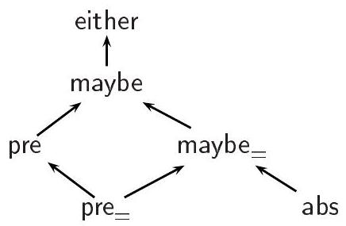

Intuitively, we wish that pre $=$ and maybe $=$ be logically invariant, pre and maybe be logically covariant, and the equivalences pre $=\mathrm{T} \leq$ maybe $_{=} \mathrm{T}^{\prime} \equiv \mathrm{T}=\mathrm{T}^{\prime}$ and

直观上，我们希望pre $=$ 和 maybe $=$ 在逻辑上是不变的，pre 和 maybe 在逻辑上是协变的，并且等价关系 pre $=\mathrm{T} \leq$ maybe $_{=} \mathrm{T}^{\prime} \equiv \mathrm{T}=\mathrm{T}^{\prime}$ 和

$$
\begin{equation*}
\text { pre }=\mathrm{T} \leq \text { pre } \mathrm{T}^{\prime} \equiv \text { pre } \mathrm{T} \leq \text { maybe } \mathrm{T}^{\prime} \equiv \text { maybe }_{=} \mathrm{T} \leq \text { maybe } \mathrm{T}^{\prime} \equiv \mathrm{T} \leq \mathrm{T}^{\prime} \tag{1}
\end{equation*}
$$

simultaneously hold. However, (1) requires, for instance, type constructors pre $=$ and pre to have the same direction, which is not currently possible since they do not have the same variance. Interestingly, this restriction may be relaxed by assigning variances of directions on a per type constructor basis and define structural subtyping accordingly (See Exercise 1.11.30). Then, replacing all occurrences of pre by pre $=$ in $\Gamma_{0}$ preserves type soundness and allows for both accurate record types and flexible subtyping in the same setting.

同时持有。然而，（1）要求例如类型构造器pre $=$和pre具有相同的方向，这在目前是不可能的，因为它们不具有相同的变异性。有趣的是，通过为每个类型构造器分配方向的可变性，并相应地定义结构子类型（参见练习1.11.30），这个限制可能被放宽。然后，在$\Gamma_{0}$中用pre $=$替换所有pre的出现，可以保持类型的健全性，并在同一设置下允许精确的记录类型和灵活的子类型。

1.11.30 ExERcise [RELaXed variances, $\star \star \star, \nrightarrow]$ : Let $\emptyset$ be allowed as a new variance, let extend the composition of variances defined in Example 1.3.9 with $\nu \emptyset=\emptyset$, and let $\leqslant \emptyset$ stands for the full relation on type constructors. Let each type constructor $F$ of signature $K \Rightarrow \kappa$ now come with a mapping $\vartheta(F)$ from $\operatorname{dom}(K)$ to variances. Let $\vartheta\left(t, t^{\prime}, \pi\right)$ be the variance of two
ground types $t$ and $t^{\prime}$ at a path $\pi$ recursively defined by $\vartheta\left(t, t^{\prime}, d \cdot \pi\right)=$ $\left(\vartheta(t(\epsilon))(d) \cap \vartheta\left(t^{\prime}(\epsilon)\right)(d)\right) \vartheta\left(t / d, t^{\prime} / d, \pi\right)$ and $\vartheta\left(t, t^{\prime}, \epsilon\right)=+$. Then define the interpretation of subtyping as follows: if $t, t^{\prime} \in \mathcal{M}_{\kappa}$, let $t \leq t^{\prime}$ hold if and only if for all path $\pi \in \operatorname{dom}(t) \cap \operatorname{dom}\left(t^{\prime}\right), t(\pi) \leqslant^{\vartheta\left(t, t^{\prime}, \pi\right)} t^{\prime}(\pi)$ holds.

1.11.30练习[宽松变量, $\star \star \star, \nrightarrow$]：设$\emptyset$可以作为新的变量，扩展例1.3.9中定义的变量组合，记$\nu \emptyset=\emptyset$，并且$\leqslant \emptyset$表示类型构造器上的全关系。现在，每个具有签名$K \Rightarrow \kappa$的类型构造器$F$都带有一个从$\operatorname{dom}(K)$到变量映射$\vartheta(F)$。定义$\vartheta\left(t, t^{\prime}, \pi\right)$为两个地面类型$t$和$t^{\prime}$在路径$\pi$上的变量，递归定义为$\vartheta\left(t, t^{\prime}, d \cdot \pi\right)=$ $\left(\vartheta(t(\epsilon))(d) \cap \vartheta\left(t^{\prime}(\epsilon)\right)(d)\right) \vartheta\left(t / d, t^{\prime} / d, \pi\right)$，且$\vartheta\left(t, t^{\prime}, \epsilon\right)=+$。然后以下定义子类型的解释：如果$t, t^{\prime} \in \mathcal{M}_{\kappa}$，则只有当对所有路径$\pi \in \operatorname{dom}(t) \cap \operatorname{dom}\left(t^{\prime}\right)$，$t(\pi) \leqslant^{\vartheta\left(t, t^{\prime}, \pi\right)} t^{\prime}(\pi)$成立时，$t \leq t^{\prime}$才成立。

Check that the relation $\leq$ remains a partial ordering. Check that a type constructor whose direction $d$ has been syntactically declared covariant (respectively contravariant, invariant) is still logically covariant (respectively contravariant, invariant) in $d$.

检查关系 $\leq$ 仍然是一个偏序关系。检查已声明为协变（分别对应逆变、不变）的类型构造器在 $d$ 方向上逻辑上仍然是协变（分别对应逆变、不变）的。

## Record concatenation

记录拼接

Record concatenation takes two records and combines them into a new record whose fields are taken from whatever argument defines them. Of course, there is an ambiguity when the two records do not have disjoint domains and a choice should be made to disambiguate such cases. Symmetric concatenation let concatenation be undefined in this case (Harper and Pierce, 1991), while asymmetric concatenation let one-side (usually the right side) always take priority. Despite a rather simple semantics, record concatenation remains hard to type (with either a strict or a priority semantics). Solutions to type inference for record concatenation may be found, for instance, in (Wand, 1989; Rémy, 1992; Pottier, 2000).

记录连接会取两个记录并将它们组合成一个新的记录，其字段来源于定义它们的任意参数。当然，当两个记录不具有不相交的定义域时，就会存在歧义，此时应该做出选择以消除此类情况的不明确性。对称连接在这种情况下让连接未定义（Harper和Pierce，1991年），而非对称连接则让一侧（通常是右侧）始终优先。尽管记录连接的语义相当简单，但其类型判断仍然很难（无论是严格的还是优先级语义）。在例如（Wand，1989年；Rémy，1992年；Pottier，2000年）中可以找到关于记录连接的类型推论解决方案。

## Polymorphic variants

多态变体

Variants can be defined via algebraic data-type definitions. However, as fields for records, variant tags are taken from a relatively small, finite collection of labels and two variant definitions will have incompatible types. Thus, to remain compatible, two variants must chose their tag among a larger collection that is a superset of all the possible tags of either variant. In general, this reduces the accuracy of types and forces useless dynamic checks for tags that could otherwise be known not to occur. Extensible variants (page 93) allow to work with an arbitrary large collection of tags, but do not improve accuracy. Polymorphic variants refers to a more precise typechecking mechanism for variants, where types more accurately describes the tags that may actually occur. They allow to build values of sum types out of a large, potentially infinite predefined set of tags and call polymorphic functions to explore them. As for record, this problem could be tackled by first considering polymorphic operations over variants built from a finite set of tags and total variants with an infinite set of tag independently and then by combining both approaches together. We propose a direct solution by a simple analogy with records.

变体可以通过代数数据类型定义来定义。然而，作为记录的字段，变体标签来自一个相对较小、有限的标签集合，两个变体定义将具有不兼容的类型。因此，为了保持兼容性，两个变体必须选择一个更大的集合中的标签，这个集合是所有可能标签的超集。一般来说，这降低了类型的准确性，并强制进行无用的动态标签检查，否则这些标签本可以知道不会出现。可扩展变体（第93页）允许使用任意大的标签集合，但并没有提高准确性。多态变体指的是一种更精确的变体类型检查机制，其中类型更准确地描述了实际可能出现的标签。它们允许从大量、潜在无限的预定义标签集合中构建和类型的值，并调用多态函数来探索它们。对于记录，这个问题可以通过首先分别考虑基于有限集合标签构建的变体的多态操作和具有无限标签集合的总变体，然后将两种方法结合起来来解决。我们提出了一个直接解决方案，通过与记录的简单类比。

Indeed, type constructor pre can be used to distinguish a (finite) set of tags
that the variant may actually carry, from other tags that are certain not to occur and typed with abs. For example, a variant $\ell$.v, built from a value $\mathrm{v}$ with a constructor tag $\ell$ of arity one. may be assigned the principal type scheme $\forall \mathrm{X} . \Sigma(\ell:$ pre $\mathrm{T} ; \mathrm{X})$ where $\mathrm{T}$ is the type of $\mathrm{v}$. The unary type constructor $\Sigma$ is used to coerce rows to variant types-thus, variant types and record types may share the same inner row structure and be simply distinguished by their top symbol. An instance of this polymorphic type is $\forall \mathrm{X} . \Sigma(\ell$ :pre $\mathrm{T}$; abs $)$, which tells that the variant must have been built with tag $\ell$ and no other tag, thus retaining exact information about the shape of the value. Another instance of the variant polymorphic type is $\Sigma\left(\ell:\right.$ pre $\mathrm{T} ; \ell^{\prime}:$ pre $\mathrm{T}^{\prime}$; abs $)$. Indeed, it is sound to assume that the value might also have been built with some other $\operatorname{tag} \ell^{\prime}$, even if we know that this is not actually the case. Interestingly, both values $\ell$.v and $\ell^{\prime}$.v have this type and can be mixed at this type.

确实，类型构造器pre可以用来区分变体可能实际携带的（有限）标签集合，与那些确定不会出现并用abs标记的标签。例如，一个变体$\ell$.v，由一个带有构造器标签$\ell$（arity为1）的值$\mathrm{v}$构建，可以赋予它主要类型方案$\forall \mathrm{X} . \Sigma(\ell:$ pre $\mathrm{T} ; \mathrm{X})$，其中$\mathrm{T}$是$\mathrm{v}$的类型。一元类型构造器$\Sigma$用于将行强制转换为变体类型——因此，变体类型和记录类型可能共享相同的内部行结构，并通过它们的顶部符号简单地区分。这种多态类型的一个实例是$\forall \mathrm{X} . \Sigma(\ell$ :pre $\mathrm{T}$; abs $)$，它表示变体必须用标签$\ell$构建，没有其他标签，因此保留了关于值形状的确切信息。变体多态类型的另一个实例是$\Sigma\left(\ell:\right.$ pre $\mathrm{T} ; \ell^{\prime}:$ pre $\mathrm{T}^{\prime}$; abs $)$。确实，假设值也可能用其他$\operatorname{tag} \ell^{\prime}$构建是合理的，即使我们知道实际上并非如此。有趣的是，这两个值$\ell$.v和$\ell^{\prime}$.v都有这个类型，并且可以在这种类型下混合。

We use filters to explore variants. A filter $\left[\ell: \mathrm{v} \mid \mathrm{v}^{\prime}\right]$ is a function that expects a variant argument, thus of the form $\ell^{\prime}$.w. It then proceeds with either $\mathrm{v} \mathrm{w}$, if $\ell^{\prime}=\ell$, or $\mathrm{v}^{\prime} \mathrm{w}$ otherwise. The type of this filter is $\Sigma\left(\ell:\right.$ pre $\left.\mathrm{T} ; \mathrm{T}^{\prime}\right) \rightarrow \mathrm{T}^{\prime \prime}$ where $\mathrm{T}$ is the type of values accepted by $\mathrm{v}, \Sigma\left(\ell: \mathrm{T}^{\prime \prime \prime} ; \mathrm{T}^{\prime}\right)$ is the type of values accepted by $\mathrm{v}^{\prime}$, and $\mathrm{T}^{\prime \prime}$ is the type of values returned by both $\mathrm{v}$ and $\mathrm{v}^{\prime}$. Any type $\mathrm{T}^{\prime \prime \prime}$ would do, including, in particular, abs. Indeed, when w is passed to $\mathrm{v}^{\prime}$, it is known not to have tag $\ell$, so the behavior of $\mathrm{v}^{\prime}$ on $\ell$ does not matter. The null filter [] can be used for $\mathrm{v}^{\prime}$. This filter should actually never be applied, which we ensure by assigning $\square$ the type $\forall \mathrm{X} . \Sigma(\partial \mathrm{abs}) \rightarrow \mathrm{X}$, for no variant value has type $\Sigma(\partial \mathrm{abs})$. For instance, the filter $\left[\ell: \mathrm{v}_{\ell} \mid\left[\ell^{\prime}: \mathrm{v}_{\ell^{\prime}} \mid[]\right]\right]$, which may be abbreviated as $\left[\ell: \mathrm{v}_{\ell} \mid \ell^{\prime}: \mathrm{v}_{\ell^{\prime}}\right]$ can be applied to either $\ell$.v or $\ell^{\prime} . \mathrm{v}^{\prime}$. The following example formalizes polymorphic variants.

我们使用过滤器来探索变体。一个过滤器 $\left[\ell: \mathrm{v} \mid \mathrm{v}^{\prime}\right]$ 是一个期望变体参数的函数，因此形式为 $\ell^{\prime}$.w。然后它继续进行 $\mathrm{v} \mathrm{w}$（如果 $\ell^{\prime}=\ell$），否则进行 $\mathrm{v}^{\prime} \mathrm{w}$。此过滤器的类型是 $\Sigma\left(\ell:\right.$ pre $\left.\mathrm{T} ; \mathrm{T}^{\prime}\right) \rightarrow \mathrm{T}^{\prime \prime}$，其中 $\mathrm{T}$ 是 $\mathrm{v}$ 接受的值的类型，$\Sigma\left(\ell: \mathrm{T}^{\prime \prime \prime} ; \mathrm{T}^{\prime}\right)$ 是 $\mathrm{v}^{\prime}$ 接受的值的类型，而 $\mathrm{T}^{\prime \prime}$ 是 $\mathrm{v}$ 和 $\mathrm{v}^{\prime}$ 都返回的值的类型。任何类型 $\mathrm{T}^{\prime \prime \prime}$ 都可以，尤其是 abs。实际上，当 w 传递给 $\mathrm{v}^{\prime}$ 时，已知它不具有标签 $\ell$，因此 $\mathrm{v}^{\prime}$ 对 $\ell$ 的行为无关紧要。可以为 $\mathrm{v}^{\prime}$ 使用空过滤器 []。这个过滤器实际上不应该被应用，我们通过分配 $\square$ 类型 $\forall \mathrm{X} . \Sigma(\partial \mathrm{abs}) \rightarrow \mathrm{X}$ 来确保这一点，因为没有变体值的类型是 $\Sigma(\partial \mathrm{abs})$。例如，过滤器 $\left[\ell: \mathrm{v}_{\ell} \mid\left[\ell^{\prime}: \mathrm{v}_{\ell^{\prime}} \mid[]\right]\right]$，可以简写为 $\left[\ell: \mathrm{v}_{\ell} \mid \ell^{\prime}: \mathrm{v}_{\ell^{\prime}}\right]$，可以应用于 $\ell$.v 或 $\ell^{\prime} . \mathrm{v}^{\prime}$。以下示例形式化了多态变体。

1.11.31 Example [Polymorphic variants]: Let $\star$ and $\diamond$ be two basic kinds. Let $\mathcal{S}$ contain in addition to the arrow type constructor the two type constructors pre of kind $\star \Rightarrow \diamond$ and abs of kind $\diamond$. In the presence of subtyping we may assume abs $\leqslant$ pre. Let $\mathcal{S}_{1}$ contain the unique covariant isolated type constructor $\Sigma$ of kind $\diamond \Rightarrow \star$. Let $\Gamma_{0}$ be composed of unary constructors $(\ell . \cdot)^{\ell \in \mathcal{L}}$ and primitives [ of arity 0 and $([\ell: \cdot \mid \cdot] \cdot)^{\ell \in \mathcal{L}}$ of arity 3 , given with the following reduction rules:

1.11.31 示例 [多态变体]：设 $\star$ 和 $\diamond$ 是两种基本类型。除了箭头类型构造器之外，设 $\mathcal{S}$ 还包含两种类型构造器，pre 的类型为 $\star \Rightarrow \diamond$，abs 的类型为 $\diamond$。在子类型存在的情况下，我们可以假设 abs $\leqslant$ pre。设 $\mathcal{S}_{1}$ 包含唯一的一个协变孤立类型构造器 $\Sigma$，其类型为 $\diamond \Rightarrow \star$。设 $\Gamma_{0}$ 由一元构造器 $(\ell . \cdot)^{\ell \in \mathcal{L}}$ 和原始操作 [，其 arity 为 0 以及 $([\ell: \cdot \mid \cdot] \cdot)^{\ell \in \mathcal{L}}$，其 arity 为 3 组成，并给出以下归约规则：

$$
\begin{aligned}
& {\left[\ell: \mathrm{v} \mid \mathrm{v}^{\prime}\right] \ell . \mathrm{w} \quad \xrightarrow{\delta} \quad \mathrm{v} \mathrm{w}} \\
& {\left[\ell: \mathrm{v} \mid \mathrm{v}^{\prime}\right] \ell^{\prime} . \mathrm{w} \quad \xrightarrow{\delta} \quad \mathrm{v}^{\prime} \mathrm{w} \quad \text { if } \ell \neq \ell^{\prime}}
\end{aligned}
$$

and contain the following typing assumptions:

包含以下输入假设：

$$
\begin{aligned}
\ell . \cdot: & \forall \mathrm{XY} . \mathrm{X} \rightarrow \Sigma(\ell: \text { pre } \mathrm{X} ; \mathrm{Y}) \\
{[]: } & \forall \mathrm{X} . \Sigma(\partial \mathrm{abs}) \rightarrow \mathrm{X} \\
{[\ell: \cdot \mid \cdot]: } & \forall \mathrm{XX}^{\prime} \mathrm{YY} \mathrm{Y}^{\prime} .(\mathrm{X} \rightarrow \mathrm{Y}) \rightarrow\left(\Sigma\left(\ell: \mathrm{X}^{\prime} ; \mathrm{Y}^{\prime}\right) \rightarrow \mathrm{Y}\right) \rightarrow \Sigma\left(\ell: \operatorname{pre} \mathrm{X} ; \mathrm{Y}^{\prime}\right) \rightarrow \mathrm{Y}
\end{aligned}
$$

1.11.32 ExERcise [Soundness for Extensible Variants, $\star \star \star \star, \nrightarrow$ ]: Prove type soundness for extensible variants in both equality-only and subtyping models.

1.11.32 练习 [可扩展变体的健全性，$\star \star \star \star, \nrightarrow$ ]：证明在仅相等性和子类型模型中，可扩展变体的类型健全性。

## Other applications of rows

## 行的其他应用

Polymorphic records and variants are the most well-known applications of rows. Besides the many variations on their presentations - we have only illustrated some of them-there are several other interesting applications of rows.

多态记录和变体是行（rows）最知名的应用。除了它们呈现方式的许多变化——我们仅说明了其中一些——行还有其他几个有趣的应用。

Since objects can be viewed as record-of-functions, at least from a typing point of view, rows can also be used to type structural objects (Wand, 1994; Rémy, 1994; Rémy and Vouillon, 1998) and provide, in particular, polymorphic method invocation. This is the key to typechecking objects in Objective Caml (Rémy and Vouillon, 1998). First-class messages (Nishimura, 1998; Müller and Nishimura, 1998; Pottier, 2000) combine records and variants in an interesting way: while filters over variant types enforce all branches to have the same return type, first-class messages treat filters as records of functions (also called objects) rather than functions from a variant type to a shared return type. A message is an element of a variant type. The application of an object to a message, that is of a record of functions to a variant type, selects from the record the branch labeled with the same tag as the message and applies it to the content of the message, much as pattern matching. However, these applications are typechecked more accurately by first restricting the domain of the record to the set of tags that the message may possibly carry, and thus other branches and in particular their return type are left unconstrained.

自从对象可以被看作是函数记录，至少从类型的角度来看是这样，行也可以用来类型结构化对象（Wand, 1994; Rémy, 1994; Rémy和Vouillon, 1998），特别是提供多态方法调用。这是在Objective Caml中类型检查对象的关键（Rémy和Vouillon, 1998）。一等消息（Nishimura, 1998; Müller和Nishimura, 1998; Pottier, 2000）以有趣的方式结合了记录和变体：虽然变体类型的过滤器强制所有分支具有相同的返回类型，但一等消息将过滤器视为函数记录（也称为对象），而不是从变体类型到共享返回类型的函数。消息是变体类型的一个元素。将对象应用于消息，即从函数记录到变体类型的应用，从记录中选择与消息标签相同的分支，并将其应用于消息的内容，这与模式匹配类似。然而，这些应用通过首先将记录的域限制为消息可能携带的标签集合，从而更精确地进行类型检查，因此其他分支尤其是它们的返回类型不受约束。

Row types may also represent set of properties within types or type refinements and be used in type systems for program analysis. Two examples worth mentioning are their application to soft-typing (Cartwright and Fagan, 1991; Wright and Cartwright, 1994) and typechecking of uncaught exceptions (Leroy and Pessaux, 2000).

行类型也可能代表类型内的属性集合或类型细化，并可用于程序分析的类型系统中。值得提及的两个例子是它们在软类型（Cartwright和Fagan，1991；Wright和Cartwright，1994）和未捕获异常的类型检查（Leroy和Pessaux，2000）中的应用。

The key to rows is to decompose the set of row labels into a class of finite partitions that is closed by some operations. Here, those partitions are composed of singleton labels and co-finite sets of labels; the operations are merging (or conversely splitting) a singleton label and a co-finite set of labels. Other decompositions are possible, for instance, one could imagine to consider labels in a two-dimensional space. More generally, labels might also be given internal structure, for instance, one might consider automatons as labels. Notice also that record types are stratified, since rows, that is, expressions of kind $\operatorname{Row}(L)$, may not themselves contain records - constructors of $\mathcal{S}_{1}$ are only given the image row kind Type. This restriction can be partially
relaxed leading to rows of increasing degrees (Rémy, 1992b) ... and complexity! Yet more intriguing are typed-indexed rows where labels are themselves types (Shields and Meijer, 2001).

关键在于将行标签集合分解为某一类有限分区的闭包，这些分区可以通过某些操作来组合。在这里，这些分区由单例标签和余有限标签集合组成；操作包括将单例标签与余有限标签集合合并（或者相反地拆分）。还可能有其他的分解方式，例如，可以想象将标签考虑在二维空间中。更一般地，标签也可能具有内部结构，例如，可以考虑自动机作为标签。还要注意，记录类型是分层的，因为行（即类型为$\operatorname{Row}(L)$的表达式）本身可能不包含记录 - $\mathcal{S}_{1}$的构造函数只给出了图像行类型的Type。这个限制可以部分地放宽，导致行度数的增加（Rémy, 1992b）...以及复杂性的增加！更有趣的是类型索引行，其中标签本身就是类型（Shields和Meijer, 2001）。

## Alternatives to rows

## 行的替代品

The original idea of using rows to describe types of extensible records is due to Wand (Wand, 1987, 1988). A key simplification to row types is to make them total functions from labels to types and encode definiteness explicitly in the structure of fields, for instance with pre and abs type constructors, as presented here. This decomposition reduces the resolution of unification constraints to a simple equational reasoning (Rémy, 1993, 1992a). Other approaches that do not treat rows as total functions seem more $a d$ hoc and have often hard-wired restrictions (Jategaonkar and Mitchell, 1988; Ohori and Buneman, 1989; Berthomieu, 1993; Ohori, 1999). Among these partial solutions, (Ohori, 1999) is quite interesting for its overall simplicity in the case where polymorphic access alone is required. Rows and fields may also be represented within ad-hoc type constraints rather than terms and equality (or subtyping) constraints. For example, qualified types use the predicates ( $\mathrm{T}$ has $\ell: \mathrm{T}^{\prime}$ ) and ( $\mathrm{T}$ lacks $\ell$ ) to mean that field $\ell$ of row $\mathrm{T}$ is defined with type $\mathrm{T}^{\prime}$ or undefined, respectively (Jones, 1994b; Odersky, Sulzmann, and Wehr, 1999b). These constraints are in fact equivalent in our equality-model to $\exists \mathrm{X} . \mathrm{T}=\left(\ell\right.$ :pre $\left.\mathrm{T}^{\prime} ; \mathrm{X}\right)$ and $\exists \mathrm{X} . \mathrm{T}=(\ell:$ abs $; \mathrm{X})$, respectively. Record typechecking has also been widely studied in the presence of subtyping. Usually, record subtyping is given meaning directly and not via rows. While these solutions are quite expressive, thanks to subtyping, they still suffer from their nonstructural treatment of record types and cannot type row extension. Thus, even in subtyping models the use of rows increases expressiveness, and is usually a simplification as well. The subtyping model can then also take advantage of the possibility of enriching type constructors pre and abs with more structure and relate them via subtyping (Pottier, 2000). Notice, that even though rows have been introduced for type inference, they seem to be beneficial to explicitly typed languages as well since even other advanced solutions (Cardelli and Mitchell, 1991; Cardelli, 1992) are limited.

最初使用行（rows）来描述可扩展记录类型的想法归功于Wand（Wand, 1987, 1988）。对行类型（row types）的一个关键简化是使它们成为从标签到类型的总函数，并在字段的结构中明确编码确定性，例如使用pre和abs类型构造函数，正如这里所展示的。这种分解将统一约束的解析简化为简单的等式推理（Rémy, 1993, 1992a）。其他不将行视为总函数的方法似乎更显得临时性，并且通常有硬性限制（Jategaonkar和Mitchell, 1988; Ohori和Buneman, 1989; Berthomieu, 1993; Ohori, 1999）。在这些部分解决方案中，（Ohori, 1999）在对多态访问单独需要的情况下，由于其整体简单性而相当有趣。行和字段也可以在临时类型约束中表示，而不是项和等式（或子类型）约束。例如，合格类型使用谓词（T具有ℓ: T'）和（T缺少ℓ）来表示行T的字段ℓ定义为类型T'或未定义（Jones, 1994b; Odersky, Sulzmann和Wehr, 1999b）。实际上，在我们的等式模型中，这些约束等价于存在X . T=（ℓ: pre T' ; X）和存在X . T=（ℓ: abs ; X）。记录类型检查在子类型存在的情况下也得到了广泛研究。通常，记录子类型是直接给出的，而不是通过行。尽管这些解决方案非常具有表现力，得益于子类型，但它们仍然受到非结构性记录类型处理的影响，不能类型行扩展。因此，即使在子类型模型中，使用行也增加了表现力，通常也是一个简化。然后子类型模型也可以利用增加类型构造函数pre和abs的结构并借助子类型相关联的可能性（Pottier, 2000）。请注意，尽管行是为了类型推断而引入的，但它们似乎对显式类型语言也有益，因为即使是其他高级解决方案（Cardelli和Mitchell, 1991; Cardelli, 1992）也是有限的。

Rules of Figure 1-19 are one way of solving row type constraints. In a model with subtyping constraints, a more direct closure-based resolution may be more appropriate (Pottier, 2003).

图1-19的规则是解决行类型约束的一种方法。在带有子类型约束的模型中，基于闭包的更直接的解析可能更为合适（Pottier，2003）。

B Solutions to Selected Exercises

选定练习的B解决方案

1.2.6 Solution: The definition does not behave as expected, because if is a destructor, whose arguments-according to the call-by-value semantics of MLthe-calculus-are evaluated before R-TRUE or R-FALSE is allowed to fire. As a result, the semantics of the expression if $t_{0}$ then $t_{1}$ else $t_{2}$ is to evaluate both $t_{1}$ and $t_{2}$ before choosing one of them. Since these expressions may have side effects (for instance, they may fail to terminate, or update a reference), this semantics is undesirable. The desired evaluation order can be obtained by placing $t_{1}$ and $t_{2}$ within closures, which delays their evaluation, then invoking the closure returned by the conditional, forcing its body to be evaluated. In other words, the expression if $t_{0}$ then $t_{1}$ else $t_{2}$ should now be viewed as syntactic sugar for if $t_{0}\left(\lambda\right.$ z.t $\left._{1}\right)\left(\lambda z . t_{2}\right) \hat{0}$. The choice of the constant $\hat{0}$ is arbitrary, since it is discarded; any value would do.

1.2.6 解决方案：这个定义并没有按预期工作，因为if是一个析构器，其参数根据ML-演算的按值调用语义，在R-TRUE或R-FALSE被允许触发之前会被求值。因此，表达式if $t_{0}$ then $t_{1}$ else $t_{2}$的语义是在选择其中一个之前先对$t_{1}$和$t_{2}$进行求值。由于这些表达式可能有副作用（例如，它们可能无法终止，或者更新一个引用），这种语义是不希望出现的。可以通过将$t_{1}$和$t_{2}$放入闭包中来获得所需的求值顺序，这会延迟它们的求值，然后调用条件表达式返回的闭包，强制其主体进行求值。换句话说，表达式if $t_{0}$ then $t_{1}$ else $t_{2}$现在应该被视为语法糖，用于if $t_{0}\left(\lambda\right.$ z.t $\left._{1}\right)\left(\lambda z . t_{2}\right) \hat{0}$。常量$\hat{0}$的选择是任意的，因为它会被丢弃；任何值都可以。

1.2.21 Solution: Within Damas and Milner's type system, we have:

1.2.21 解：在Damas和Milner的类型系统中，我们有：

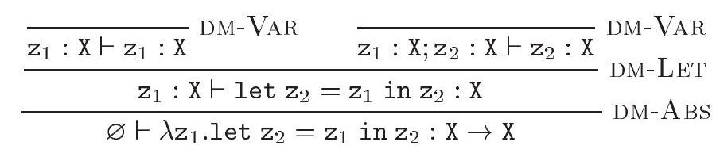

Please note that, because $\mathrm{X}$ occurs free within the environment $\mathrm{z}_{1}: \mathrm{X}$, it is impossible to apply DM-GEN to the judgement $z_{1}: X \vdash z_{1}: X$ in a nontrivial way. For this reason, $z_{2}$ cannot receive the type scheme $\forall x$.X, and the whole expression cannot receive type $\mathrm{X} \rightarrow \mathrm{Y}$, where $\mathrm{X}$ and $\mathrm{Y}$ are distinct.

请注意，因为 $\mathrm{X}$ 在环境 $\mathrm{z}_{1}: \mathrm{X}$ 中自由出现，所以无法以非平凡的方式将 DM-GEN 应用于判断 $z_{1}: X \vdash z_{1}: X$。因此，$z_{2}$ 不能接收类型方案 $\forall x$.X，整个表达式也不能接收类型 $\mathrm{X} \rightarrow \mathrm{Y}$，其中 $\mathrm{X}$ 和 $\mathrm{Y}$ 是不同的。

1.2.22 Solution: It is straightforward to prove that the identity function has type int $\rightarrow$ int:

1.2.22 解：很容易证明恒等函数具有类型 int → int：

$$
\frac{\overline{\Gamma_{0} ; z: \text { int } \vdash \mathrm{z}: \text { int }}}{\Gamma_{0} \vdash \lambda \mathrm{z} . \mathrm{z}: \text { int } \rightarrow \text { int }} \text { DM-ABS }
$$

In fact, nothing in this type derivation depends on the choice of int as the type of $z$. Thus, we may just as well use a type variable $X$ instead. Furthermore, after forming the arrow type $\mathrm{X} \rightarrow \mathrm{X}$, we may employ DM-GEN to quantify universally over $\mathrm{X}$, since it no longer appears in the environment.

实际上，这种类型推导中没有任何内容依赖于将$z$的类型选择为int。因此，我们完全可以使用类型变量$X$来代替。此外，在形成了箭头类型$\mathrm{X} \rightarrow \mathrm{X}$之后，我们可以使用DM-GEN规则来对$\mathrm{X}$进行普遍量化，因为它不再出现在环境中。


It is worth noting that, although the type derivation employs an arbitrary type variable $\mathrm{X}$, the final typing judgement has no free type variables. It is
thus independent of the choice of $\mathrm{x}$. In the following, we refer to the above type derivation as $\Delta_{0}$.

值得注意的是，尽管类型推导使用了一个任意的类型变量X，但最终的类型判断没有自由类型变量。因此，它与x的选择无关。在以下内容中，我们将上述类型推导称为Δ₀。

Next, we prove that the successor function has type int $\rightarrow$ int under the initial environment $\Gamma_{0}$. We write $\Gamma_{1}$ for $\Gamma_{0} ; z$ : int, and make uses of DM-VAR implicit.

接下来，我们证明在初始环境$\Gamma_{0}$下，后继函数具有类型int $\rightarrow$ int。我们用$\Gamma_{1}$表示$\Gamma_{0} ; z$ : int，并使用隐含的DM-VAR。

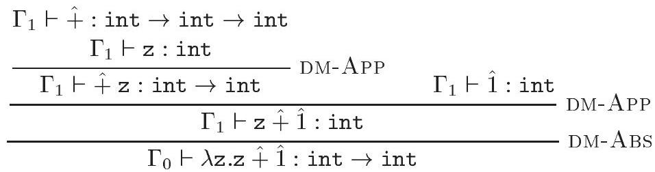

In the following, we refer to the above type derivation as $\Delta_{1}$. We may now build a derivation for the third typing judgement. We write $\Gamma_{2}$ for $\Gamma_{0} ; f$ : int $\rightarrow$ int.

在以下内容中，我们将上述类型推导称为 $\Delta_{1}$。我们现在可以为第三个类型判断构建一个推导。我们用 $\Gamma_{2}$ 表示 $\Gamma_{0} ; f$ : int $\rightarrow$ int。

$$
\frac{\Delta_{1} \frac{\Gamma_{2} \vdash \mathrm{f}: \text { int } \rightarrow \text { int } \quad \Gamma_{2} \vdash \hat{2}: \text { int }}{\Gamma_{2} \vdash \mathrm{f} \hat{2}: \text { int }}}{\Gamma_{0} \vdash \text { let } \mathrm{f}=\lambda \mathrm{z} \cdot \mathrm{z} \hat{+} \hat{1} \text { in } \mathrm{f} \hat{2}: \text { int }} \text { DM-LET }
$$

To derive the fourth typing judgement, we re-use $\Delta_{0}$, which proves that the identity function has polymorphic type. We write $\Gamma_{3}$ for $\Gamma_{0} ; f: \forall \mathrm{X} . \mathrm{X} \rightarrow \mathrm{X}$. By DM-VAR and DM-INST, we have $\Gamma_{3} \vdash \mathrm{f}:($ int $\rightarrow$ int $) \rightarrow($ int $\rightarrow$ int) and $\Gamma_{3} \vdash f:$ int $\rightarrow$ int. Thus, we may build the following derivation:

为了推导出第四个类型判断，我们重新使用 $\Delta_{0}$，这证明了恒等函数具有多态类型。我们用 $\Gamma_{3}$ 表示 $\Gamma_{0} ; f: \forall \mathrm{X} . \mathrm{X} \rightarrow \mathrm{X}$。通过 DM-VAR 和 DM-INST，我们得到 $\Gamma_{3} \vdash \mathrm{f}:($ int $\rightarrow$ int $) \rightarrow($ int $\rightarrow$ int) 以及 $\Gamma_{3} \vdash f:$ int $\rightarrow$ int。因此，我们可以构建以下推导：

$$
\begin{aligned}
& \Gamma_{3} \vdash \mathrm{f}:(\text { int } \rightarrow \text { int }) \rightarrow(\text { int } \rightarrow \text { int })
\end{aligned}
$$


The first and third judgements are valid in the simply-typed $\lambda$-calculus, because they use neither DM-GEN nor DM-INST, and use DM-LET only to introduce the monomorphic binding $\mathrm{f}:$ int $\rightarrow$ int into the environment. The second judgement, of course, is not: because it involves a nontrivial type scheme, it is not even a well-formed judgement in the simply-typed $\lambda$-calculus. The fourth judgement is well-formed, but not derivable, in the simply-typed $\lambda$-calculus. This is because $f$ is used at two incompatible types, namely (int $\rightarrow$ int) $\rightarrow$ (int $\rightarrow$ int) and int $\rightarrow$ int, inside the expression $\mathrm{f} f \hat{2}$. Both of these types are instances of $\forall \mathrm{X} . \mathrm{X} \rightarrow \mathrm{X}$, the type scheme assigned to $f$ in the environment $\Gamma_{3}$.

第一个和第三个判断在简单类型的λ-演算中是有效的，因为它们既不使用DM-GEN也不使用DM-INST，仅使用DM-LET来向环境中引入单态绑定 f: int -> int。当然，第二个判断无效：因为它涉及到非平凡类型方案，它在简单类型的λ-演算中甚至不是一个良好形成的判断。第四个判断在简单类型的λ-演算中是良好形成的，但不可推导。这是因为在表达式 f f 2^ 中，f被用在两种不兼容的类型上，即 (int -> int) -> (int -> int) 和 int -> int。这两种类型都是环境中分配给f的类型方案 ∀X . X -> X 的实例，在环境 Γ_3 中。

By inspection of DM-VAR, DM-GEN, and DM-INST, it is straightforward to see that, if $\Gamma_{0} \vdash \hat{1}: \mathrm{T}$ is derivable, then $\mathrm{T}$ must be int. Since int is not an arrow type, the application $\hat{1} \hat{2}$ cannot be well-typed under $\Gamma_{0}$. In fact, because this expression is stuck, it cannot be well-typed in a sound type system.

通过检查DM-VAR、DM-GEN和DM-INST，可以直观地看出，如果可以从$\Gamma_{0} \vdash \hat{1}: \mathrm{T}$推导出来，那么$\mathrm{T}$必须是整型（int）。由于整型不是箭头类型，表达式$\hat{1} \hat{2}$在$\Gamma_{0}$下不能被良好地类型化。实际上，由于这个表达式是停顿的，它在一个健全的类型系统中不能被良好地类型化。

The expression $\lambda f$. $(f f)$ is ill-typed in the simply-typed $\lambda$-calculus, because no type $\mathrm{T}$ may coincide with a type of the form $\mathrm{T} \rightarrow \mathrm{T}^{\prime}$. Indeed, $\mathrm{T}$ would then be a subterm of itself. For the same reason, this expression is ill-typed in $\mathrm{DM}$ as well. Indeed, it is not difficult to check that the presence of DM-GEN and DM-INST makes no difference: DM-GEN cannot generalize $\mathrm{T}$ as long as the binding $f: T$ appears in the environment, and DM-INST can only instantiate $T$ to $T$ itself. Thus, the self-application $f f$ is well-typed in DM only if $f$ is let-bound, as opposed to $\lambda$-bound. The argument crucially relies on the fact that $f$ must be assigned a monotype. Indeed, the expression $\lambda f .(f f)$ is well-typed in an implicitly-typed variant of System F: one of its types is $(\forall \mathrm{X} . \mathrm{X} \rightarrow \mathrm{X}) \rightarrow(\forall \mathrm{X} . \mathrm{X} \rightarrow \mathrm{X})$. It also relies on the fact that types are finite: indeed, this expression is well-typed in an extension of the simply-typed $\lambda$ calculus with recursive types, where the equation $\mathrm{T}=\mathrm{T} \rightarrow \mathrm{T}^{\prime}$ has a solution.

表达式 $\lambda f$. $(f f)$ 在简单类型的 $\lambda$-演算中类型不正确，因为没有类型 $\mathrm{T}$ 可以与形式 $\mathrm{T} \rightarrow \mathrm{T}^{\prime}$ 的类型相同。实际上，$\mathrm{T}$ 随后会是其自身的子项。同样地，这个表达式在 $\mathrm{DM}$ 中也是类型不正确的。实际上，检查 DM-GEN 和 DM-INST 的存在并没有区别：只要环境中有绑定 $f: T$，DM-GEN 就不能泛化 $\mathrm{T}$，而 DM-INST 只能将 $T$ 实例化为它自己。因此，只有在 $f$ 是 let 绑定而不是 $\lambda$ 绑定时，自应用 $f f$ 在 DM 中才是类型正确的。这个论证关键在于 $f$ 必须分配一个单型。实际上，表达式 $\lambda f .(f f)$ 在 System F 的一个隐式类型变体中是类型正确的：它的一个类型是 $(\forall \mathrm{X} . \mathrm{X} \rightarrow \mathrm{X}) \rightarrow(\forall \mathrm{X} . \mathrm{X} \rightarrow \mathrm{X})$。这也依赖于类型的有限性：实际上，在这个表达式中，扩展了简单类型 $\lambda$ 演算并带有递归类型的系统中是类型正确的，其中方程 $\mathrm{T}=\mathrm{T} \rightarrow \mathrm{T}^{\prime}$ 有解。

1.2.23 Solution: It is clear that the effect of DM-GEN may be obtained by a series of successive applications of DM-GEN'. Conversely, consider an instance of DM-GEN', whose premises are $\Gamma \vdash \mathrm{t}: \mathrm{S}(\mathbf{1})$ and $\mathrm{X} \notin f t v(\Gamma)$ (2). Let us write $\mathrm{S}=\forall \overline{\mathrm{X}} . \mathrm{T}$, where $\overline{\mathrm{X}} \# f t v(\Gamma)$ (3). Applying DM-Inst to (1) and to the identity substitution yields $\Gamma \vdash \mathrm{t}: \mathrm{T}$ (4). Applying DM-GEN to (4), (2) and (3) yields $\Gamma \vdash t: \forall x \bar{x} . T$, that is, $\Gamma \vdash t: \forall X$.S. Thus, the effect of DM-GEN' may be obtained by DM-INST and DM-GEN.

1.2.23 解：很明显，DM-GEN的效果可以通过一系列连续应用DM-GEN'来获得。反之，考虑一个DM-GEN'的实例，其前提是 $\Gamma \vdash \mathrm{t}: \mathrm{S}(\mathbf{1})$ 和 $\mathrm{X} \notin f t v(\Gamma)$ （2）。让我们记 $\mathrm{S}=\forall \overline{\mathrm{X}} . \mathrm{T}$，其中 $\overline{\mathrm{X}} \# f t v(\Gamma)$ （3）。将DM-Inst应用于（1）和恒等替换，得到 $\Gamma \vdash \mathrm{t}: \mathrm{T}$ （4）。将DM-GEN应用于（4），（2）和（3）得到 $\Gamma \vdash t: \forall x \bar{x} . T$，即 $\Gamma \vdash t: \forall X$。S。因此，DM-GEN'的效果可以通过DM-INST和DM-GEN获得。

It is clear that DM-INST is a particular case of DM-INST' where $\bar{Y}$ is empty. Conversely, consider an instance of DM-INST', whose premises are $\Gamma \vdash t$ : $\forall \overline{\mathrm{X}}$.T (1) and $\overline{\mathrm{Y}} \# \operatorname{ftv}(\forall \overline{\mathrm{X}}$. T) (2). Let $\rho$ be a renaming that exchanges $\overline{\mathrm{Y}}$ with $\overline{\mathrm{Z}}$, where $\overline{\mathrm{Z}} \# \operatorname{ftv}(\forall \overline{\mathrm{Y}} .[\overrightarrow{\mathrm{X}} \mapsto \overrightarrow{\mathrm{T}}] \mathrm{T})$ (3) and $\overline{\mathrm{Z}} \# \operatorname{ftv}(\Gamma)$ (4). Applying DM-InsT to (1) yields $\Gamma \vdash \mathrm{t}:[\overrightarrow{\mathrm{X}} \mapsto \rho \overrightarrow{\mathrm{T}}] \mathrm{T}$ (5). Applying DM-GEN to (5) and (4) yields $\Gamma \vdash$ $\mathrm{t}: \forall \overline{\mathrm{Z}} \cdot[\overrightarrow{\mathrm{X}} \mapsto \rho \overrightarrow{\mathrm{T}}] \mathrm{T}$, that is, $\Gamma \vdash \mathrm{t}: \forall \rho \overline{\mathrm{Y}} .[\overrightarrow{\mathrm{X}} \mapsto \rho \overrightarrow{\mathrm{T}}] \mathrm{T}$ (6). Now, by (2) and (3), we have $[\overrightarrow{\mathrm{X}} \mapsto \rho \overrightarrow{\mathrm{T}}] \mathrm{T}=\rho([\overrightarrow{\mathrm{X}} \mapsto \overrightarrow{\mathrm{T}}] \mathrm{T})$, so (6) may be written $\Gamma \vdash \mathrm{t}: \forall \rho \overline{\mathrm{Y}} . \rho([\overrightarrow{\mathrm{X}} \mapsto \overrightarrow{\mathrm{T}}] \mathrm{T})$, that is, $\Gamma \vdash \mathrm{t}: \rho(\forall \overline{\mathrm{Y}} .[\overrightarrow{\mathrm{X}} \mapsto \overrightarrow{\mathrm{T}}] \mathrm{T})(7)$. By (3), this is exactly $\Gamma \vdash \mathrm{t}: \forall \overrightarrow{\mathrm{Y}} \cdot[\overrightarrow{\mathrm{X}} \mapsto \overrightarrow{\mathrm{T}}] \mathrm{T}$. Thus, the effect of DM-INST' may be obtained by DM-INST and DM-GEN.

显然，DM-INST是DM-INST'的一个特例，其中$\bar{Y}$为空。反之，考虑DM-INST'的一个实例，其前提是$\Gamma \vdash t$ : $\forall \overline{\mathrm{X}}$.T (1) 和 $\overline{\mathrm{Y}} \# \operatorname{ftv}(\forall \overline{\mathrm{X}}$. T) (2)。设$\rho$是一个重命名操作，它将$\overline{\mathrm{Y}}$与$\overline{\mathrm{Z}}$交换，其中$\overline{\mathrm{Z}} \# \operatorname{ftv}(\forall \overline{\mathrm{Y}} .[\overrightarrow{\mathrm{X}} \mapsto \overrightarrow{\mathrm{T}}] \mathrm{T})$ (3) 和 $\overline{\mathrm{Z}} \# \operatorname{ftv}(\Gamma)$ (4)。将DM-InsT应用于(1)得到$\Gamma \vdash \mathrm{t}:[\overrightarrow{\mathrm{X}} \mapsto \rho \overrightarrow{\mathrm{T}}] \mathrm{T}$ (5)。将DM-GEN应用于(5)和(4)得到$\Gamma \vdash \mathrm{t}: \forall \overline{\mathrm{Z}} \cdot[\overrightarrow{\mathrm{X}} \mapsto \rho \overrightarrow{\mathrm{T}}] \mathrm{T}$，即$\Gamma \vdash \mathrm{t}: \forall \rho \overline{\mathrm{Y}} .[\overrightarrow{\mathrm{X}} \mapsto \rho \overrightarrow{\mathrm{T}}] \mathrm{T}$ (6)。现在，由(2)和(3)可知，$[\overrightarrow{\mathrm{X}} \mapsto \rho \overrightarrow{\mathrm{T}}] \mathrm{T}=\rho([\overrightarrow{\mathrm{X}} \mapsto \overrightarrow{\mathrm{T}}] \mathrm{T})$，所以(6)可以写成$\Gamma \vdash \mathrm{t}: \forall \rho \overline{\mathrm{Y}} . \rho([\overrightarrow{\mathrm{X}} \mapsto \overrightarrow{\mathrm{T}}] \mathrm{T})$，即$\Gamma \vdash \mathrm{t}: \rho(\forall \overline{\mathrm{Y}} .[\overrightarrow{\mathrm{X}} \mapsto \overrightarrow{\mathrm{T}}] \mathrm{T})(7)$。由(3)，这正是$\Gamma \vdash \mathrm{t}: \forall \overrightarrow{\mathrm{Y}} \cdot[\overrightarrow{\mathrm{X}} \mapsto \overrightarrow{\mathrm{T}}] \mathrm{T}$。因此，DM-INST'的效果可以通过DM-INST和DM-GEN获得。

1.4.4 Solution: Let us recall that a program $t$ is well-typed if and only if a judgement of the form $C, \Gamma \vdash \mathrm{t}: \sigma$, where $C$ is satisfiable, holds. Let us show that it is in fact possible, without loss of generality, to require $\sigma$ to be a monotype.

1.4.4 解决方案：让我们回忆一下，一个程序$t$是类型良好的当且仅当形如$C, \Gamma \vdash \mathrm{t}: \sigma$的判断成立，其中$C$是可以满足的。让我们证明，实际上可以不失一般性地要求$\sigma$是一个单型。

Assume $C, \Gamma \vdash \mathrm{t}: \sigma(\mathbf{1})$ is derivable within $\operatorname{HM}(X)$. Let us write $\sigma=$ $\forall \overline{\mathrm{X}}[D]$.T, where $\overline{\mathrm{X}} \# f t v(C)$ (2). Applying Lemma 1.4.1 to (1) yields $C \Vdash$ $\exists \overline{\mathrm{X}} . D$ (3). By hm-Inst, (1) implies $C \wedge D, \Gamma \vdash \mathrm{t}: \mathrm{T}$ (4). By (3), we have $C \equiv C \wedge \exists \overline{\mathrm{x}} . D \equiv \exists \overline{\mathrm{X}} .(C \wedge D)$. Because $C$ is satisfiable, this implies that $C \wedge D$
is satisfiable as well. Thus, the judgement (4), which involves the monotype $\mathrm{T}$, witnesses that $\mathrm{t}$ is well-typed.

假设在 $\operatorname{HM}(X)$ 中可以推导出 $C, \Gamma \vdash \mathrm{t}: \sigma(\mathbf{1})$。让我们记 $\sigma=$ $\forall \overline{\mathrm{X}}[D].T$，其中 $\overline{\mathrm{X}} \# f t v(C)$（2）。将引理 1.4.1 应用于（1）得到 $C \Vdash$ $\exists \overline{\mathrm{X}} . D$（3）。根据 hm-Inst 规则，（1）意味着 $C \wedge D, \Gamma \vdash \mathrm{t}: \mathrm{T}$（4）。由（3），我们有 $C \equiv C \wedge \exists \overline{\mathrm{x}} . D \equiv \exists \overline{\mathrm{X}} .(C \wedge D)$。因为 $C$ 是可满足的，这意味着 $C \wedge D$ 也是可满足的。因此，涉及单型 $\mathrm{T}$ 的判断（4）证明了 $\mathrm{t}$ 是类型正确的。

We have shown that a program $t$ is well-typed if and only if a judgement of the form $C, \Gamma \vdash \mathrm{t}: \mathrm{T}$, where $C$ is satisfiable, holds. Thus, by Theorems ?? and ??, well-typedness is the same for both rule sets.

我们已经证明了，一个程序$t$是类型良好的当且仅当形如$C, \Gamma \vdash \mathrm{t}: \mathrm{T}$的判断成立，其中$C$是可以满足的。因此，根据定理??和??，类型良好的性质对于两个规则集来说是相同的。

1.4.5 Solution: By Theorem ??, every rule in Figure 1-8 is admissible in $\operatorname{HM}(X)$. Of course, so is HM-GEN. So, every judgement that is derivable via the rules of Figure 1-8 and $\mathrm{HM}-\mathrm{GEN}$ is a valid $\operatorname{HM}(X)$ judgement.

1.4.5 解：根据定理??，图1-8中的每一条规则在$\operatorname{HM}(X)$中都是可接受的。当然，HM-GEN也是如此。因此，通过图1-8的规则和$\mathrm{HM}-\mathrm{GEN}$可推导出的每一个判断都是有效的$\operatorname{HM}(X)$判断。

Conversely, assume $C, \Gamma \vdash \mathrm{t}: \sigma$ (1) holds in $\operatorname{HM}(X)$. We must show that it is derivable via the rules of Figure 1-8 and HM-GEN. Let us write $\sigma=$ $\forall \overline{\mathrm{x}}[D]$.T, where $\overline{\mathrm{x}} \# \mathrm{ftv}(C, \Gamma)$ (2). By HM-Inst and (1), the judgement $C \wedge$ $D, \Gamma \vdash \mathrm{t}: \mathrm{T}$ (3) holds in $\operatorname{HM}(X)$. This judgement involves a monotype, so, by Theorem ??, it is derivable via the rules of Figure 1-8. Furthermore, from (3) and (2), HM-GEN allows deriving $C \wedge \exists \sigma, \Gamma \vdash \mathrm{t}: \sigma$ (4). Applying Lemma 1.4.1 to (1) yields $C \Vdash \exists \sigma$, so the judgement (4) may be written $C, \Gamma \vdash \mathrm{t}: \sigma$. We have shown that (1) is derivable via the rules of Figure 1-8 and HM-GEN. In fact, it is possible to apply HM-GEN only once, at the end of the derivation.

相反，假设在$\operatorname{HM}(X)$中成立$C, \Gamma \vdash \mathrm{t}: \sigma$ (1)。我们必须证明它是可以通过图1-8的规则和HM-GEN推导出来的。设我们写出$\sigma=$ $\forall \overline{\mathrm{x}}[D].T$，其中$\overline{\mathrm{x}} \# \mathrm{ftv}(C, \Gamma)$ (2)。通过HM-Inst和(1)，判断$C \wedge D, \Gamma \vdash \mathrm{t}: \mathrm{T}$ (3)在$\operatorname{HM}(X)$中成立。这个判断涉及到一个单型，所以根据定理??，它可以通过图1-8的规则推导出来。此外，从(3)和(2)，HM-GEN允许推导出$C \wedge \exists \sigma, \Gamma \vdash \mathrm{t}: \sigma$ (4)。将引理1.4.1应用于(1)得到$C \Vdash \exists \sigma$，因此判断(4)可以写成$C, \Gamma \vdash \mathrm{t}: \sigma$。我们已经证明了(1)可以通过图1-8的规则和HM-GEN推导出来。实际上，可以在推导的最后只应用一次HM-GEN。

1.5.1 Solution: Within the type system $\operatorname{PCB}(X)$, we have

1.5.1 解决方案：在类型系统 $\operatorname{PCB}(X)$ 中，我们有


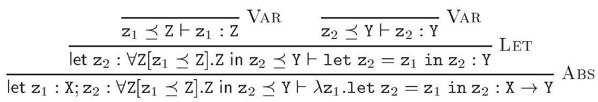

The type variable $z$, which occurs free in the left-hand instance of VAR, is generalized. However, $\mathrm{z}_{2}$ does not receive the type scheme $\forall \mathrm{Z} . \mathrm{Z}$, which, as suggested earlier, is unsound; instead, it receives the constrained type scheme $\forall z\left[z_{1} \preceq z\right] . z$. The latter is more restrictive than the former: indeed, the former claims that $z_{2}$ has every type, while the latter only claims that every valid type for $z_{1}$ is also a valid type for $z_{2}$. Let us now examine the constraint let $z_{1}$ : $\mathrm{X} ; \mathrm{z}_{2}: \forall \mathrm{Z}\left[\mathrm{z}_{1} \preceq \mathrm{Z}\right] . \mathrm{Z}$ in $\mathrm{z}_{2} \preceq \mathrm{Y}$, which appears at the root of the derivation. By C-INID and C-IN*, it is equivalent to let $\mathrm{z}_{1}: \mathrm{X}$ in $\exists \mathrm{Z} .\left(\mathrm{z}_{1} \preceq \mathrm{Z} \wedge \mathrm{Z} \leq \mathrm{Y}\right)$ and to $\exists \mathrm{Z}$. $\mathrm{X} \leq \mathrm{Z} \wedge \mathrm{Z} \leq \mathrm{Y}$ ), which by $\mathrm{C}$-ExTRans is equivalent to $\mathrm{X} \leq \mathrm{Y}$. Thus, the judgement at the root of the above derivation may be written $\mathrm{X} \leq$ $\mathrm{Y} \vdash \lambda \mathrm{z}_{1}$. let $\mathrm{z}_{2}=\mathrm{z}_{1}$ in $\mathrm{z}_{2}: \mathrm{X} \rightarrow \mathrm{Y}$. In other words, the expression let $\mathrm{z}_{2}=$ $\mathrm{z}_{1}$ in $\mathrm{z}_{2}$ has type $\mathrm{X} \rightarrow \mathrm{Y}$ only under the assumption that $\mathrm{X}$ is a subtype of $\mathrm{Y}$, which is sound. Even though LET allows unrestricted generalization of type variables, it remains sound, because the type scheme that it produces typically has free program identifiers, such as $\forall \mathrm{Z}\left[\mathbf{z}_{1} \preceq \mathrm{Z}\right] . \mathrm{Z}$ above.

类型变量 $z$ 在 VAR 的左侧实例中以自由变量的形式出现，并被泛化。然而，$\mathrm{z}_{2}$ 并没有接收到类型方案 $\forall \mathrm{Z} . \mathrm{Z}$，正如之前所暗示的那样，这是不健全的；相反，它接收到的是受限制的类型方案 $\forall z\left[z_{1} \preceq z\right] . z$。后者比前者更具限制性：实际上，前者声称 $z_{2}$ 具有每种类型，而后者仅声称对 $z_{1}$有效的每种类型也对 $z_{2}$ 有效。现在让我们检查一下派生树的根处出现的约束 let $z_{1}$ : $\mathrm{X} ; \mathrm{z}_{2}: \forall \mathrm{Z}\left[\mathrm{z}_{1} \preceq \mathrm{Z}\right] . \mathrm{Z}$ in $\mathrm{z}_{2} \preceq \mathrm{Y}$。通过 C-INID 和 C-IN*，它等价于 let $\mathrm{z}_{1}: \mathrm{X}$ in $\exists \mathrm{Z} .\left(\mathrm{z}_{1} \preceq \mathrm{Z} \wedge \mathrm{Z} \leq \mathrm{Y}\right)$ 以及 $\exists \mathrm{Z}$. $\mathrm{X} \leq \mathrm{Z} \wedge \mathrm{Z} \leq \mathrm{Y}$)，这通过 $\mathrm{C}$-ExTRans 等价于 $\mathrm{X} \leq \mathrm{Y}$。因此，上述派生树的根处的判断可以写成 $\mathrm{X} \leq$ $\mathrm{Y} \vdash \lambda \mathrm{z}_{1}$. let $\mathrm{z}_{2}=\mathrm{z}_{1}$ in $\mathrm{z}_{2}: \mathrm{X} \rightarrow \mathrm{Y}$。换句话说，表达式 let $\mathrm{z}_{2}=$ $\mathrm{z}_{1}$ in $\mathrm{z}_{2}$ 只有在假设 $\mathrm{X}$ 是 $\mathrm{Y}$ 的子类型的情况下才具有类型 $\mathrm{X} \rightarrow \mathrm{Y}$，这是健全的。尽管 LET 允许类型变量的无限制泛化，但它仍然健全，因为它产生的类型方案通常具有自由程序标识符，如上面提到的 $\forall \mathrm{Z}\left[\mathbf{z}_{1} \preceq \mathrm{Z}\right] . \mathrm{Z}$。

1.7.10 Solution: Let $\mathcal{E}=$ let $\mathrm{z}=\mathcal{E}_{1}$ in $\mathrm{t}_{1}$ and $\mathcal{E}_{1}[\mathrm{t}] / \mu \sqsubseteq \mathcal{E}_{1}\left[\mathrm{t}^{\prime}\right] / \mu^{\prime}$ (1). Then,

1.7.10 解法：令 $\mathcal{E}=$ 令 $\mathrm{z}=\mathcal{E}_{1}$ 在 $\mathrm{t}_{1}$ 中，且 $\mathcal{E}_{1}[\mathrm{t}] / \mu \sqsubseteq \mathcal{E}_{1}\left[\mathrm{t}^{\prime}\right] / \mu^{\prime}$ (1)。那么，

$$
\begin{align*}
& \text { let } \Gamma_{0} ; \operatorname{ref} M \text { in } \llbracket \mathcal{E}[\mathrm{t}] / \mu: \mathrm{T} / M \rrbracket \\
= & \text { let } \Gamma_{0} ; \operatorname{ref} M \text { in }\left(\left(\text { let } \mathrm{z}: \forall \mathrm{x}\left[\llbracket \mathcal{E}_{1}[\mathrm{t}]: \mathrm{x} \rrbracket\right] . \mathrm{X} \text { in } \llbracket \mathrm{t}_{1}: \mathrm{T} \rrbracket\right) \wedge \llbracket \mu: M \rrbracket\right)  \tag{2}\\
\equiv & \text { let } \Gamma_{0} ; \operatorname{ref} M ; \mathrm{z}: \forall \mathrm{x}\left[\llbracket \mathcal{E}_{1}[\mathrm{t}] / \mu: \mathrm{X} / M \rrbracket\right] . \mathrm{X} \text { in } \llbracket \mathrm{t}_{1}: \mathrm{T} \rrbracket  \tag{3}\\
\equiv & \text { let } \Gamma_{0} ; \operatorname{ref} M ; \mathrm{z}: \forall \mathrm{x}\left[\text { let } \Gamma_{0} ; \operatorname{ref} M \text { in } \llbracket \mathcal{E}_{1}[\mathrm{t}] / \mu: \mathrm{x} / M \rrbracket\right] . \mathrm{X} \text { in } \llbracket \mathrm{t}_{1}: \mathrm{T} \rrbracket  \tag{4}\\
\Vdash & \text { let } \Gamma_{0} ; \operatorname{ref} M ; \mathrm{z}: \forall \mathrm{x} \overline{\mathrm{Y}}\left[\text { let } \Gamma_{0} ; \operatorname{ref} M^{\prime} \text { in } \llbracket \mathcal{E}_{1}\left[\mathrm{t}^{\prime}\right] / \mu^{\prime}: \mathrm{x} / M^{\prime} \rrbracket\right] . \mathrm{X} \text { in } \llbracket \mathrm{t}_{1}: \mathrm{T} \rrbracket \tag{5}
\end{align*}
$$

where (2) is by definition of constraint generation, where $\mathrm{X} \notin \operatorname{ftv}(\mathrm{T}, M)(\mathbf{6}) ;(3)$ is by (6), C-LETAND, and by definition of constraint generation; (4) is by (6) and C-LetDup; (5) follows from (1) and C-LETEx, for some $\overline{\mathrm{Y}}$ and $M^{\prime}$ such that $\overline{\mathrm{Y}} \# \operatorname{ftv}(\mathrm{X}, M)(\mathbf{7})$ and $f t v\left(M^{\prime}\right) \subseteq \overline{\mathrm{Y}} \cup f t v(M)$ (8) and $\operatorname{dom}\left(M^{\prime}\right)=\operatorname{dom}\left(\mu^{\prime}\right)$ and $M^{\prime}$ extends $M$. Note that (6), (7) and (8) imply $\mathrm{X} \notin f t v\left(M^{\prime}\right)$ (9).

其中（2）是根据约束生成的定义，其中 $\mathrm{X} \notin \operatorname{ftv}(\mathrm{T}, M)(\mathbf{6})$；（3）是根据（6）、C-LETAND 和约束生成的定义；（4）是根据（6）和C-LetDup；（5）是根据（1）和C-LETEx得出的，对于某些 $\overline{\mathrm{Y}}$ 和 $M^{\prime}$，使得 $\overline{\mathrm{Y}} \# \operatorname{ftv}(\mathrm{X}, M)(\mathbf{7})$ 和 $f t v\left(M^{\prime}\right) \subseteq \overline{\mathrm{Y}} \cup f t v(M)$ （8）以及 $\operatorname{dom}\left(M^{\prime}\right)=\operatorname{dom}\left(\mu^{\prime}\right)$ 且 $M^{\prime}$ 扩展了 $M$。注意（6）、（7）和（8）意味着 $\mathrm{X} \notin f t v\left(M^{\prime}\right)$ （9）。

At this point, the type variables $\overline{\mathrm{Y}}$, which determine the types of the newly allocated store cells, are universally quantified in the type scheme assigned to $z$, which is undesirable. We are stuck, because we cannot in general apply C-LETALL to hoist $\exists \bar{Y}$ out of the let constraint. Let us now assume that, by some external means, we are guaranteed $\overline{\mathrm{Y}}=\varnothing \mathbf{( 1 0 )}$. Then, we may proceed as follows:

在这一点上，决定新分配存储单元类型的类型变量 $\overline{\mathrm{Y}}$ 在分配给 $z$ 的类型方案中被普遍量化，这是我们不希望看到的。我们陷入了困境，因为通常我们不能将 C-LETALL 应用于将 $\exists \bar{Y}$ 从 let 约束中提取出来。现在，让我们假设通过某些外部手段，我们得到了保证 $\overline{\mathrm{Y}}=\varnothing \mathbf{( 1 0 )}$。那么，我们可以按如下方式进行：

$$
\begin{align*}
& \equiv \text { let } \Gamma_{0} ; \operatorname{ref} M^{\prime} ; \mathrm{z}: \forall \mathrm{X}\left[\text { let } \Gamma_{0} ; \operatorname{ref} M^{\prime} \text { in } \llbracket \mathcal{E}_{1}\left[\mathrm{t}^{\prime}\right] / \mu^{\prime}: \mathrm{X} / M^{\prime} \rrbracket\right] . \mathrm{X} \text { in } \llbracket \mathrm{t}_{1}: \mathrm{T} \rrbracket  \tag{11}\\
& \equiv \text { let } \Gamma_{0} ; \operatorname{ref} M^{\prime} \text { in } \llbracket \mathcal{E}\left[\mathrm{t}^{\prime}\right] / \mu^{\prime}: \mathrm{T} / M^{\prime} \rrbracket \tag{12}
\end{align*}
$$

where (11) follows from the fact the the memory locations that appear free in $\llbracket \mathrm{t}_{1}: \mathrm{T} \rrbracket$ are members of $\operatorname{dom}(\mu)$, thus are not members of $\operatorname{dom}\left(M^{\prime}\right) \backslash \operatorname{dom}(M)$; (12) is obtained by performing the steps that lead to (4) in reverse.

(11) 是由出现在 $\llbracket \mathrm{t}_{1}: \mathrm{T} \rrbracket$ 中看似空闲的内存位置是 $\operatorname{dom}(\mu)$ 的成员这一事实得出的，因此它们不是 $\operatorname{dom}\left(M^{\prime}\right) \backslash \operatorname{dom}(M)$ 的成员；(12) 是通过逆向执行导致 (4) 的步骤得到的。

The requirement that $\overline{\mathrm{Y}}$ be empty, that is, $f t v(M)=f t v\left(M^{\prime}\right)$, is classic (Tofte, 1988). How is it enforced? Assume that the left-hand side of every let construct is required to be a non-expansive expression. By assumptions (ii) and (iii), this invariant is preserved by reduction. So, $\mathcal{E}_{1}[t]$ must be nonexpansive, which, by assumption (i), guarantees that the reduction step does not allocate new memory cells. Then, $\mu^{\prime}$ is $\mu$, so $M^{\prime}$ is $M$.

要求 $\overline{\mathrm{Y}}$ 为空，即 $f t v(M)=f t v\left(M^{\prime}\right)$，这是经典的（Tofte, 1988）。这是如何实施的？假设每个 let 构造的左侧必须是一个非扩展表达式。根据假设（ii）和（iii），这个不变量通过归约得到保持。所以，$\mathcal{E}_{1}[t]$ 必须是非扩展的，根据假设（i），这保证了归约步骤不会分配新的内存单元。那么，$\mu^{\prime}$ 就是 $\mu$，所以 $M^{\prime}$ 就是 $M$。

1.9.1 Solution: We must first ensure that R-AdD respects $\sqsubseteq$ (Definition 1.7.5). Since the rule is pure, it is sufficient to establish that let $\Gamma_{0}$ in $\llbracket \hat{k}_{1} \hat{+} \hat{k}_{2}: \mathrm{T} \rrbracket$ entails let $\Gamma_{0}$ in $\llbracket \widehat{k_{1}+k_{2}}: \mathrm{T} \rrbracket$. In fact, we have

1.9.1 解决方案：我们首先必须确保 R-AdD 遵守 $\sqsubseteq$ （定义1.7.5）。由于规则是纯的，只需建立让 $\Gamma_{0}$ 在 $\llbracket \hat{k}_{1} \hat{+} \hat{k}_{2}: \mathrm{T} \rrbracket$ 中蕴含让 $\Gamma_{0}$ 在 $\llbracket \widehat{k_{1}+k_{2}}: \mathrm{T} \rrbracket$ 中即可。实际上，我们有以下结果：

$$
\begin{align*}
& \text { let } \Gamma_{0} \text { in } \llbracket \hat{k}_{1} \hat{+} \hat{k}_{2}: \mathrm{T} \rrbracket \\
\equiv & \text { let } \Gamma_{0} \text { in } \exists \mathrm{XY} .\left(\hat{+} \preceq \mathrm{X} \rightarrow \mathrm{Y} \rightarrow \mathrm{T} \wedge \hat{k}_{1} \preceq \mathrm{X} \wedge \hat{k}_{2} \preceq \mathrm{Y}\right)  \tag{1}\\
\equiv & \exists \mathrm{XY} .(\text { int } \rightarrow \text { int } \rightarrow \text { int } \leq \mathrm{X} \rightarrow \mathrm{Y} \rightarrow \mathrm{T} \wedge \text { int } \leq \mathrm{X} \wedge \text { int } \leq \mathrm{Y})  \tag{2}\\
\equiv & \exists \mathrm{XY} .(\mathrm{X}=\operatorname{int} \wedge \mathrm{Y}=\operatorname{int} \wedge \text { int } \leq \mathrm{T})  \tag{3}\\
\equiv & \text { int } \leq \mathrm{T}  \tag{4}\\
\equiv & \text { let } \Gamma_{0} \text { in } \llbracket \widehat{k_{1}+k_{2}}: \mathrm{T} \rrbracket \tag{5}
\end{align*}
$$

where (1) is by definition of constraint generation; (2) is by definition of $\Gamma_{0}$, by C-INID and C-IN*; (3) is by C-ARRow and by antisymmetry of subtyping;

其中（1）是根据约束生成的定义；（2）是根据 $\Gamma_{0}$ 的定义，通过C-INID和C-IN*；（3）是通过C-ARRow和子类型反对称性。

(4) is by C-ExAnd and C-NAmE; (5) is again by definition of $\Gamma_{0}$, by C-InId and $\mathrm{C}-\mathrm{IN}^{*}$, and by definition of constraint generation.

(4)是由C-ExAnd和C-NAmE确定的；(5)再次根据$\Gamma_{0}$的定义，通过C-InId和$\mathrm{C}-\mathrm{IN}^{*}$，以及约束生成的定义得出。

Second, we must check that if the configuration $\mathrm{c} \mathrm{v}_{1} \ldots \mathrm{v}_{k} / \mu$ (where $k \geq 0$ ) is well-typed, then either it is reducible, or $\mathrm{c} \mathrm{v}_{1} \ldots \mathrm{v}_{k}$ is a value.

其次，我们必须检查配置 $\mathrm{c} \mathrm{v}_{1} \ldots \mathrm{v}_{k} / \mu$（其中 $k \geq 0$ ）是否有良好的类型，那么它要么是可约的，要么 $\mathrm{c} \mathrm{v}_{1} \ldots \mathrm{v}_{k}$ 是一个值。

We begin by checking that every value that is well-typed with type int is of the form $\hat{k}$. Indeed, suppose that let $\Gamma_{0} ; \operatorname{ref} M$ in $\llbracket \mathrm{v}:$ int $\rrbracket$ is satisfiable. Then, $v$ cannot be a program variable, for a well-typed value must be closed. v cannot be a memory location $m$, for otherwise ref $M(m) \leq$ int would be satisfiable - but the type constructors ref and int are incompatible. $v$ cannot be $\hat{+}$ or $\hat{+} \mathrm{v}^{\prime}$, for otherwise int $\rightarrow$ int $\rightarrow$ int $\leq$ int or int $\rightarrow$ int $\leq$ int would be satisfiable - but the type constructors $\rightarrow$ and int are incompatible. Similarly, $\mathrm{v}$ cannot be a $\lambda$-abstraction. Thus, $\mathrm{v}$ must be of the form $\hat{k}$, for it is the only case left.

我们首先检查每个类型为int的良类型值是否具有形式$\hat{k}$。确实，假设$\Gamma_{0} ; \operatorname{ref} M$在$\llbracket \mathrm{v}:$ int $\rrbracket$中是可满足的。那么，$v$不能是一个程序变量，因为良类型值必须是闭合的。$v$不能是一个内存位置$m$，否则ref $M(m) \leq$ int将是可满足的——但类型构造器ref和int是不兼容的。$v$不能是$\hat{+}$或$\hat{+} \mathrm{v}^{\prime}$，否则int $\rightarrow$ int $\rightarrow$ int $\leq$ int或int $\rightarrow$ int $\leq$ int将是可满足的——但类型构造器$\rightarrow$和int是不兼容的。同样，$\mathrm{v}$不能是一个$\lambda$-抽象。因此，$\mathrm{v}$必须具有形式$\hat{k}$，因为这是唯一剩下的情况。

Next, we note that, according to the constraint generation rules, if the configuration $\mathrm{c} \mathrm{v}_{1} \ldots \mathrm{v}_{k} / \mu$ is well-typed, then a constraint of the form let $\Gamma_{0}$; ref $M$ in $\left(\mathrm{c} \preceq \mathrm{x}_{1} \rightarrow \ldots \rightarrow \mathrm{x}_{k} \rightarrow \mathrm{T} \wedge \llbracket \mathrm{v}_{1}: \mathrm{x}_{1} \rrbracket \wedge \ldots \wedge \llbracket \mathrm{v}_{k}: \mathrm{x}_{k} \rrbracket\right)$ is satisfiable. We now reason by cases on $c$.

接下来，我们注意到，根据约束生成规则，如果配置 $\mathrm{c} \mathrm{v}_{1} \ldots \mathrm{v}_{k} / \mu$ 是类型正确的，那么形如 let $\Gamma_{0}$; ref $M$ in $\left(\mathrm{c} \preceq \mathrm{x}_{1} \rightarrow \ldots \rightarrow \mathrm{x}_{k} \rightarrow \mathrm{T} \wedge \llbracket \mathrm{v}_{1}: \mathrm{x}_{1} \rrbracket \wedge \ldots \wedge \llbracket \mathrm{v}_{k}: \mathrm{x}_{k} \rrbracket\right)$ 的约束是可以满足的。我们现在根据 $c$ 的不同情况进行推理。

- Case $\mathrm{c}$ is $\hat{k}$. Then, $\Gamma_{0}(\mathrm{c})$ is int. Because the type constructors int and $\rightarrow$ are incompatible with each other, this implies $k=0$. Since $\hat{k}$ is a constructor, the expression is a value.
- Case $\mathrm{c}$ is $\hat{+}$. We may assume $k \geq 2$, because otherwise the expression is a value. Then, $\Gamma_{0}(\mathrm{c})$ is int $\rightarrow$ int $\rightarrow$ int, so, by C-Arrow, the above constraint entails let $\Gamma_{0} ; \operatorname{ref} M$ in $\left(\mathrm{x}_{1} \leq \operatorname{int} \wedge \mathrm{X}_{2} \leq \operatorname{int} \wedge \llbracket \mathrm{v}_{1}: \mathrm{X}_{1} \rrbracket \wedge \llbracket \mathrm{v}_{2}: \mathrm{X}_{2} \rrbracket\right)$, which, by Lemma 1.6.3, entails let $\Gamma_{0} ; \operatorname{ref} M$ in $\left(\llbracket \mathrm{v}_{1}: \operatorname{int} \rrbracket \wedge \llbracket \mathrm{v}_{2}\right.$ : int $\left.\rrbracket\right)$. Thus, $\mathrm{v}_{1}$ and $\mathrm{v}_{2}$ are well-typed with type int. By the remark above, they must be integer literals $\hat{k}_{1}$ and $\hat{k}_{2}$. As a result, the configuration is reducible by R-ADD.

- 情况 $\mathrm{c}$ 是 $\hat{k}$。那么，$\Gamma_{0}(\mathrm{c})$ 是 int。因为类型构造器 int 和 $\rightarrow$ 互不兼容，这意味着 $k=0$。由于 $\hat{k}$ 是一个构造器，表达式是一个值。
- 情况 $\mathrm{c}$ 是 $\hat{+}$。我们可以假设 $k \geq 2$，因为否则表达式是一个值。那么，$\Gamma_{0}(\mathrm{c})$ 是 int $\rightarrow$ int $\rightarrow$ int，因此，根据 C-Arrow 规则，上述约束蕴含了 let $\Gamma_{0} ; \operatorname{ref} M$ in $\left(\mathrm{x}_{1} \leq \operatorname{int} \wedge \mathrm{X}_{2} \leq \operatorname{int} \wedge \llbracket \mathrm{v}_{1}: \mathrm{X}_{1} \rrbracket \wedge \llbracket \mathrm{v}_{2}: \mathrm{X}_{2} \rrbracket\right)$，这通过引理 1.6.3，意味着 let $\Gamma_{0} ; \operatorname{ref} M$ in $\left(\llbracket \mathrm{v}_{1}: \operatorname{int} \rrbracket \wedge \llbracket \mathrm{v}_{2}: \operatorname{int} \rrbracket\right)$。因此，$\mathrm{v}_{1}$ 和 $\mathrm{v}_{2}$ 都是类型为 int 的字面量 $\hat{k}_{1}$ 和 $\hat{k}_{2}$。因此，这个配置是可以通过 R-ADD 还原的。

1.9.5 Solution: We must first ensure that R-Ref, R-Deref and R-Assign respect $\sqsubseteq($ Definition 1.7.5).

1.9.5 解决方案：我们首先必须确保 R-Ref、R-Deref 和 R-Assign 遵守 $\sqsubseteq($ 定义1.7.5)。

- Case R-REF. The reduction is ref v/ $\varnothing \longrightarrow m /(m \mapsto \mathrm{v})$, where $m \notin$ fpi(v) (1). Let $\mathrm{T}$ be an arbitrary type. According to Definition 1.7.5, the goal is to show that there exist a set of type variables $\overline{\mathrm{Y}}$ and a store type $M^{\prime}$ such that $\overline{\mathrm{Y}} \# \operatorname{ftv}(\mathrm{T})$ and $f t v\left(M^{\prime}\right) \subseteq \overline{\mathrm{Y}}$ and $\operatorname{dom}\left(M^{\prime}\right)=\{m\}$ and let $\Gamma_{0}$ in $\llbracket$ ref $\mathrm{v}: \mathrm{T} \rrbracket$
entails $\exists \overline{\mathrm{Y}}$.let $\Gamma_{0}$; ref $M^{\prime}$ in $\llbracket m /(m \mapsto \mathrm{v}): \mathrm{T} / M^{\prime} \rrbracket$. Now, we have

- 案例R-REF。减缩是 ref v/ $\varnothing \longrightarrow m /(m \mapsto \mathrm{v})$，其中 $m \notin$ fpi(v) (1)。令 $\mathrm{T}$ 为任意类型。根据定义1.7.5，目标是证明存在一组类型变量 $\overline{\mathrm{Y}}$ 和一个存储类型 $M^{\prime}$ 使得 $\overline{\mathrm{Y}} \# \operatorname{ftv}(\mathrm{T})$ 且 $f t v\left(M^{\prime}\right) \subseteq \overline{\mathrm{Y}}$ 并且 $\operatorname{dom}\left(M^{\prime}\right)=\{m\}$，并且令 $\Gamma_{0}$ 在 $\llbracket$ ref $\mathrm{v}: \mathrm{T} \rrbracket$
蕴含 $\exists \overline{\mathrm{Y}}$。令 $\Gamma_{0}$; ref $M^{\prime}$ 在 $\llbracket m /(m \mapsto \mathrm{v}): \mathrm{T} / M^{\prime} \rrbracket$。现在，我们有


$$
\begin{align*}
& \text { let } \Gamma_{0} \text { in } \llbracket \operatorname{ref} \mathrm{v}: \mathrm{T} \rrbracket \\
\equiv & \text { let } \Gamma_{0} \text { in } \exists \mathrm{XY} .(\mathrm{Y} \rightarrow \operatorname{ref} \mathrm{Y} \leq \mathrm{X} \rightarrow \mathrm{T} \wedge \llbracket \mathrm{v}: \mathrm{X} \rrbracket)  \tag{2}\\
\equiv & \exists \mathrm{Y} . \text { let } \Gamma_{0} \text { in }(\operatorname{ref} \mathrm{Y} \leq \mathrm{T} \wedge \llbracket \mathrm{v}: \mathrm{Y} \rrbracket)  \tag{3}\\
\equiv & \exists \mathrm{Y} . \text { let } \Gamma_{0} ; \operatorname{ref} M^{\prime} \text { in }\left(m \preceq \mathrm{T} \wedge \llbracket \mathrm{v}: M^{\prime}(m) \rrbracket\right)  \tag{4}\\
\equiv & \exists \mathrm{Y} . \text { let } \Gamma_{0} ; \operatorname{ref} M^{\prime} \text { in } \llbracket m /(m \mapsto \mathrm{v}): \mathrm{T} / M^{\prime} \rrbracket \tag{5}
\end{align*}
$$

where (2) is by definition of constraint generation and by definition of $\Gamma_{0}(\mathrm{ref})$; (3) is by C-Arrow, Lemma 1.6.4, and C-InEx; (4) assumes $M^{\prime}$ is defined as $m \mapsto \mathrm{Y}$, and follows from (1), C-INID and C-IN*; and (5) is by definition of constraint generation.

其中（2）是根据约束生成的定义以及 $\Gamma_{0}(\mathrm{ref})$ 的定义；（3）是根据C-Arrow，引理1.6.4，以及C-InEx；（4）假设 $M^{\prime}$ 定义为 $m \mapsto \mathrm{Y}$，并且由（1），C-INID和C-IN*得出；而（5）则是根据约束生成的定义。

Subcase R-DEREF. The reduction is $! m /(m \mapsto \mathrm{v}) \longrightarrow \mathrm{v} /(m \mapsto \mathrm{v})$. Let $\mathrm{T}$ be an arbitrary type and let $M$ be a store type of domain $\{m\}$. We have

子情况 R-DEREF。减缩为 $! m /(m \mapsto \mathrm{v}) \longrightarrow \mathrm{v} /(m \mapsto \mathrm{v})$。设 $\mathrm{T}$ 为任意类型，且设 $M$ 为域 $\{m\}$ 的存储类型。我们有

$$
\begin{align*}
& \text { let } \Gamma_{0} ; \operatorname{ref} M \text { in } \llbracket ! m /(m \mapsto \mathrm{v}): \mathrm{T} / M \rrbracket \\
\equiv & \text { let } \Gamma_{0} ; \operatorname{ref} M \text { in } \exists \mathrm{XY} .(\operatorname{ref} \mathrm{Y} \rightarrow \mathrm{Y} \leq \mathrm{X} \rightarrow \mathrm{T} \wedge m \preceq \mathrm{X} \wedge \llbracket \mathrm{v}: M(m) \rrbracket)  \tag{1}\\
\equiv & \text { let } \Gamma_{0} ; \operatorname{ref} M \text { in } \exists \mathrm{XY} .(\operatorname{ref} M(m) \leq \mathrm{X} \leq \operatorname{ref} \mathrm{Y} \wedge \mathrm{Y} \leq \mathrm{T} \wedge \llbracket \mathrm{v}: M(m) \rrbracket)  \tag{2}\\
\equiv & \text { let } \Gamma_{0} ; \operatorname{ref} M \text { in } \exists \mathrm{Y} .(M(m)=\mathrm{Y} \wedge \mathrm{Y} \leq \mathrm{T} \wedge \llbracket \mathrm{v}: M(m) \rrbracket)  \tag{3}\\
\equiv & \text { let } \Gamma_{0} ; \operatorname{ref} M \text { in }(M(m) \leq \mathrm{T} \wedge \llbracket \mathrm{v}: M(m) \rrbracket)  \tag{4}\\
\Vdash & \text { let } \Gamma_{0} ; \operatorname{ref} M \text { in }(\llbracket \mathrm{v}: \mathrm{T} \rrbracket \wedge \llbracket \mathrm{v}: M(m) \rrbracket)  \tag{5}\\
\equiv & \text { let } \Gamma_{0} ; \operatorname{ref} M \text { in } \llbracket \mathrm{v} /(m \mapsto \mathrm{v}): \mathrm{T} / M \rrbracket \tag{6}
\end{align*}
$$

where (1) is by definition of constraint generation and by definition of $\Gamma_{0}(!)$; (2) is by C-Arrow and C-InId; (3) follows from C-ExTrans and from the fact that ref is an invariant type constructor; (4) is by C-NAMEEQ; (5) is by Lemma 1.6.3 and C-DuP; and (6) is again by definition of constraint generation.

其中（1）是根据约束生成定义以及根据 $\Gamma_{0}(!)$ 的定义；（2）是根据C-Arrow和C-InId；（3）是由C-ExTrans以及ref是一个不变类型构造器这一事实得出；（4）是根据C-NAMEEQ；（5）是根据引理1.6.3和C-DuP；而（6）再次根据约束生成的定义得出。

$\circ$ Case R-Assign. The reduction is $m:=\mathrm{v} /\left(m \mapsto \mathrm{v}_{0}\right) \longrightarrow \mathrm{v} /(m \mapsto \mathrm{v})$. Let $\mathrm{T}$ be an arbitrary type and let $M$ be a store type of domain $\{m\}$. We have

案例 R-分配。约简是 $m:=\mathrm{v} /\left(m \mapsto \mathrm{v}_{0}\right) \longrightarrow \mathrm{v} /(m \mapsto \mathrm{v})$。令 $\mathrm{T}$ 为任意类型，令 $M$ 为域 $\{m\}$ 的存储类型。我们有

$$
\begin{align*}
& \text { let } \Gamma_{0} ; \operatorname{ref} M \text { in } \llbracket m:=\mathrm{v} /\left(m \mapsto \mathrm{v}_{0}\right): \mathrm{T} / M \rrbracket \\
\Vdash & \text { let } \Gamma_{0} ; \operatorname{ref} M \text { in } \llbracket m:=\mathrm{v}: \mathrm{T} \rrbracket  \tag{1}\\
\equiv & \text { let } \Gamma_{0} ; \operatorname{ref} M \text { in } \exists \mathrm{XYZ} .(\operatorname{ref} \mathrm{Z} \rightarrow \mathrm{Z} \rightarrow \mathrm{Z} \leq \mathrm{X} \rightarrow \mathrm{Y} \rightarrow \mathrm{T} \wedge m \preceq \mathrm{X} \wedge \llbracket \mathrm{v}: \mathrm{Y} \rrbracket)  \tag{2}\\
\equiv & \text { let } \Gamma_{0} ; \operatorname{ref} M \text { in } \exists \mathrm{XYZ} .(\operatorname{ref} M(m) \leq \mathrm{X} \leq \operatorname{ref} \mathrm{Z} \wedge \mathrm{Z} \leq \mathrm{T} \wedge \llbracket \mathrm{v}: \mathrm{Y} \rrbracket \wedge \mathrm{Y} \leq \mathrm{Z})  \tag{3}\\
\equiv & \text { let } \Gamma_{0} ; \operatorname{ref} M \text { in } \exists \mathrm{Z} .(M(m)=\mathrm{Z} \wedge \mathrm{Z} \leq \mathrm{T} \wedge \llbracket \mathrm{v}: \mathrm{Z} \rrbracket)  \tag{4}\\
\equiv & \text { let } \Gamma_{0} ; \operatorname{ref} M \text { in }(M(m) \leq \mathrm{T} \wedge \llbracket \mathrm{v}: M(m) \rrbracket)  \tag{5}\\
\Vdash & \text { let } \Gamma_{0} ; \operatorname{ref} M \text { in } \llbracket \mathrm{v} /(m \mapsto \mathrm{v}): \mathrm{T} / M \rrbracket \tag{6}
\end{align*}
$$

where (1) and (2) are by definition of constraint generation; (3) is by CArrow and C-InId; (4) is by C-ExTrans, Lemma 1.6.4, and from the fact that ref is an invariant type constructor; (5) is by C-NAMEEQ; and (6) is obtained as in the previous case.

其中（1）和（2）是根据约束生成的定义；（3）是根据CArrow和C-InId；（4）是根据C-ExTrans、引理1.6.4以及ref是一个不变类型构造器的事实；（5）是根据C-NAMEEQ；而（6）则是从前一个案例中获得的。

Second, we must check that if the configuration $\mathrm{c} \mathrm{v}_{1} \ldots \mathrm{v}_{k} / \mu$ (where $k \geq 0$ ) is well-typed, then either it is reducible, or $\mathrm{c} \mathrm{v}_{1} \ldots \mathrm{v}_{k}$ is a value. We only give a sketch of this proof; see the solution to Exercise 1.9.1 for details of a similar proof.

其次，我们必须检查配置 $\mathrm{c} \mathrm{v}_{1} \ldots \mathrm{v}_{k} / \mu$（其中 $k \geq 0$）是否类型正确，如果是，那么它要么是可约的，要么 $\mathrm{c} \mathrm{v}_{1} \ldots \mathrm{v}_{k}$ 是一个值。这里我们只给出了这个证明的概要；具体证明细节可参见练习1.9.1的解答，那里有一个类似证明的详细说明。

We begin by checking that every value that is well-typed with a type of the form ref $\mathrm{T}$ is a memory location. This assertion relies on the fact that the type constructor ref is isolated.

我们首先检查每个类型为 ref $\mathrm{T}$ 的良好类型的值是否都是一个内存位置。这个断言依赖于这样一个事实：类型构造器 ref 是孤立的。

Next, we note that, according to the constraint generation rules, if the configuration $\mathrm{c}_{1} \ldots \mathrm{v}_{k} / \mu$ is well-typed, then a constraint of the form let $\Gamma_{0}$; ref $M$ in $\left(\mathrm{c} \preceq \mathrm{x}_{1} \rightarrow \ldots \rightarrow \mathrm{x}_{k} \rightarrow \mathrm{T} \wedge \llbracket \mathrm{v}_{1}: \mathrm{x}_{1} \rrbracket \wedge \ldots \wedge \llbracket \mathrm{v}_{k}: \mathrm{x}_{k} \rrbracket\right)$ is satisfiable. We now reason by cases on $\mathrm{c}$.

接下来，我们注意到，根据约束生成规则，如果配置 $\mathrm{c}_{1} \ldots \mathrm{v}_{k} / \mu$ 是良好类型的，那么形如 let $\Gamma_{0}$; ref $M$ in $\left(\mathrm{c} \preceq \mathrm{x}_{1} \rightarrow \ldots \rightarrow \mathrm{x}_{k} \rightarrow \mathrm{T} \wedge \llbracket \mathrm{v}_{1}: \mathrm{x}_{1} \rrbracket \wedge \ldots \wedge \llbracket \mathrm{v}_{k}: \mathrm{x}_{k} \rrbracket\right)$ 的约束是可以满足的。我们现在通过$\mathrm{c}$的案例来进行推理。

- Case $\mathrm{c}$ is ref. If $k=0$, then the expression is a value; otherwise, it is reducible by $\mathrm{R}$-REF.
- Case c is !. We may assume $k \geq 1$, because otherwise the expression is a value. Then, by definition of $\Gamma_{0}(!)$, the above constraint entails let $\Gamma_{0} ; \operatorname{ref} M$ in $\exists \mathrm{Y}$.(ref $\left.\mathrm{Y} \rightarrow \mathrm{Y} \leq \mathrm{X}_{1} \rightarrow \ldots \rightarrow \mathrm{X}_{k} \rightarrow \mathrm{T} \wedge \llbracket \mathrm{v}_{1}: \mathrm{X}_{1} \rrbracket\right)$, which, by C-Arrow, Lemma 1.6.3, and C-INEx, entails $\exists \mathrm{Y}$.let $\Gamma_{0} ; \operatorname{ref} M$ in $\llbracket \mathrm{v}_{1}: \operatorname{ref} \mathrm{Y} \rrbracket$. Thus, $\mathrm{v}_{1}$ is well-typed with a type of the form ref $\mathrm{Y}$. By the remark above, $\mathrm{v}_{1}$ must be a memory location $m$. Furthermore, because every well-typed configuration is closed, $m$ must be a member of $\operatorname{dom}(\mu)$. As a result, the configuration ref $\mathrm{v}_{1} \ldots \mathrm{v}_{k} / \mu$ is reducible by R-DEREF.
- Case $\mathrm{c}$ is $:=$. We may assume $k \geq 2$, because otherwise the expression is a value. As above, we check that $v_{1}$ must be a memory location and a member of $\operatorname{dom}(\mu)$. Thus, the configuration is reducible by R-Assign.

- 情况c是引用。如果$k=0$，则表达式是一个值；否则，它可以被$\mathrm{R}$-REF简化。
- 情况c是!。我们可以假设$k \geq 1$，因为否则表达式是一个值。根据$\Gamma_{0}(!)$的定义，上述约束蕴含了 let $\Gamma_{0} ; \operatorname{ref} M$ in $\exists \mathrm{Y}$。(ref $\left.\mathrm{Y} \rightarrow \mathrm{Y} \leq \mathrm{X}_{1} \rightarrow \ldots \rightarrow \mathrm{X}_{k} \rightarrow \mathrm{T} \wedge \llbracket \mathrm{v}_{1}: \mathrm{X}_{1} \rrbracket\right)$，由C-Arrow，引理1.6.3，和C-INEx，蕴含了$\exists \mathrm{Y}$.let $\Gamma_{0} ; \operatorname{ref} M$ in $\llbracket \mathrm{v}_{1}: \operatorname{ref} \mathrm{Y} \rrbracket$。因此，$\mathrm{v}_{1}$是一个类型为ref $\mathrm{Y}$的好类型变量。根据上述备注，$\mathrm{v}_{1}$必须是一个内存位置$m$。此外，因为每个类型良好的配置都是闭合的，$m$必须是$\operatorname{dom}(\mu)$的一个成员。结果是，配置 ref $\mathrm{v}_{1} \ldots \mathrm{v}_{k} / \mu$ 可以被R-DEREF简化。
- 情况c是$:=$。我们可以假设$k \geq 2$，因为否则表达式是一个值。如上所述，我们检查$v_{1}$必须是一个内存位置，并且是$\operatorname{dom}(\mu)$的成员。因此，配置可以被R-Assign简化。

1.9.6 Solution: We must first ensure that R-Fix respects $\sqsubseteq$ (Definition 1.7.5). Since the rule is pure, it is sufficient to establish that let $\Gamma_{0}$ in $\llbracket f i x v_{1} v_{2}: T \rrbracket$ entails let $\Gamma_{0}$ in $\llbracket \mathrm{v}_{1}\left(f i x v_{1}\right) \mathrm{v}_{2}: \mathrm{T} \rrbracket$. Let $C$ stand for the constraint fix $\preceq$ $((\mathrm{X} \rightarrow \mathrm{Y}) \rightarrow(\mathrm{X} \rightarrow \mathrm{Y})) \rightarrow \mathrm{X} \rightarrow \mathrm{Y} \wedge \mathrm{Y} \leq \mathrm{T} \wedge \llbracket \mathrm{v}_{1}:(\mathrm{X} \rightarrow \mathrm{Y}) \rightarrow(\mathrm{X} \rightarrow \mathrm{Y}) \rrbracket \wedge \llbracket \mathrm{v}_{2}: \mathrm{X} \rrbracket$. We have

1.9.6 解法：我们首先必须确保R-Fix尊重$\sqsubseteq$（定义1.7.5）。由于规则是纯的，只需证明让$\Gamma_{0}$在$\llbracket f i x v_{1} v_{2}: T \rrbracket$中蕴含着让$\Gamma_{0}$在$\llbracket \mathrm{v}_{1}(f i x v_{1}) \mathrm{v}_{2}: \mathrm{T} \rrbracket$中即可。设$C$表示约束fix $\preceq$ $((\mathrm{X} \rightarrow \mathrm{Y}) \rightarrow(\mathrm{X} \rightarrow \mathrm{Y})) \rightarrow \mathrm{X} \rightarrow \mathrm{Y} \wedge \mathrm{Y} \leq \mathrm{T} \wedge \llbracket \mathrm{v}_{1}:(\mathrm{X} \rightarrow \mathrm{Y}) \rightarrow(\mathrm{X} \rightarrow \mathrm{Y}) \rrbracket \wedge \llbracket \mathrm{v}_{2}: \mathrm{X} \rrbracket$。我们有

$$
\begin{align*}
& \text { let } \Gamma_{0} \text { in } \llbracket \mathrm{fix} \mathrm{v}_{1} \mathrm{v}_{2}: \mathrm{T} \rrbracket \\
\equiv & \text { let } \Gamma_{0} \text { in } \exists \mathrm{X}_{1} \mathrm{X}_{2} .\left(\mathrm{fix} \preceq \mathrm{X}_{1} \rightarrow \mathrm{X}_{2} \rightarrow \mathrm{T} \wedge \llbracket \mathrm{v}_{1}: \mathrm{X}_{1} \rrbracket \wedge \llbracket \mathrm{v}_{2}: \mathrm{X}_{2} \rrbracket\right)  \tag{1}\\
\equiv & \text { let } \Gamma_{0} \text { in } \exists \mathrm{X}_{1} \mathrm{X}_{2} \mathrm{XY} .\left(((\mathrm{X} \rightarrow \mathrm{Y}) \rightarrow(\mathrm{X} \rightarrow \mathrm{Y})) \rightarrow \mathrm{X} \rightarrow \mathrm{Y} \leq \mathrm{X}_{1} \rightarrow \mathrm{X}_{2} \rightarrow \mathrm{T}\right. \\
& \left.\wedge \llbracket \mathrm{v}_{1}: \mathrm{X}_{1} \rrbracket \wedge \llbracket \mathrm{v}_{2}: \mathrm{X}_{2} \rrbracket\right)  \tag{2}\\
\equiv & \text { let } \Gamma_{0} \text { in } \exists \mathrm{XY} .\left(\mathrm{Y} \leq \mathrm{T} \wedge \llbracket \mathrm{v}_{1}:(\mathrm{X} \rightarrow \mathrm{Y}) \rightarrow(\mathrm{X} \rightarrow \mathrm{Y}) \rrbracket \wedge \llbracket \mathrm{v}_{2}: \mathrm{X} \rrbracket\right)  \tag{3}\\
\equiv & \text { let } \Gamma_{0} \text { in } \exists \mathrm{XY} . C \tag{4}
\end{align*}
$$

where (1) is by definition of constraint generation; (2) is by definition of $\Gamma_{0}(f i x) ;(3)$ is by C-ARrow and Lemma 1.6.4;(4) is by definition of $\Gamma_{0}(f i x)$. By Theorem 1.6.2 and WEAKEn, the judgements $C \vdash \mathrm{v}_{1}:(\mathrm{X} \rightarrow \mathrm{Y}) \rightarrow$
$(\mathrm{X} \rightarrow \mathrm{Y})$ and $C \vdash \mathrm{v}_{2}: \mathrm{X}$ hold. By Var, Weaken, App, and Sub, it follows that $C \vdash \mathrm{v}_{1}\left(f i x v_{1}\right) v_{2}: \mathrm{T}$ holds. By Theorem 1.6.6, this implies $C \Vdash \llbracket \mathrm{v}_{1}\left(f i x \mathrm{v}_{1}\right) \mathrm{v}_{2}: \mathrm{T} \rrbracket$. By congruence of entailment and by C-Ex*, (4) entails let $\Gamma_{0}$ in $\llbracket v_{1}\left(f i x v_{1}\right) v_{2}: T \rrbracket$.

其中（1）是由约束生成的定义；（2）是由 $\Gamma_{0}(f i x)$ 的定义；（3）是由C-ARrow和引理1.6.4；（4）是由 $\Gamma_{0}(f i x)$ 的定义。根据定理1.6.2和WEAKEn，判断 $C \vdash \mathrm{v}_{1}:(\mathrm{X} \rightarrow \mathrm{Y}) \rightarrow (\mathrm{X} \rightarrow \mathrm{Y})$ 和 $C \vdash \mathrm{v}_{2}: \mathrm{X}$ 成立。根据Var，Weaken，App和Sub规则，可以得出 $C \vdash \mathrm{v}_{1}\left(f i x v_{1}\right) v_{2}: \mathrm{T}$ 成立。根据定理1.6.6，这意味着 $C \Vdash \llbracket \mathrm{v}_{1}\left(f i x \mathrm{v}_{1}\right) \mathrm{v}_{2}: \mathrm{T} \rrbracket$ 成立。根据蕴含的相等性和C-Ex*，（4）意味着在 $\llbracket v_{1}\left(f i x v_{1}\right) v_{2}: T \rrbracket$ 中让 $\Gamma_{0}$ 成立。

Second, we must check that if the configuration $f i x v_{1} \ldots v_{k} / \mu$ (where $k \geq 0$ ) is well-typed, then either it is reducible, or $f i x v_{1} \ldots v_{k}$ is a value. This is immediate, for it is a value when $k<2$, and it is reducible by R-FIX when $k \geq 2$.

其次，我们必须检查配置 $f i x v_{1} \ldots v_{k} / \mu$（其中 $k \geq 0$）是否类型正确，如果是，那么它要么是可约的，要么 $f i x v_{1} \ldots v_{k}$ 是一个值。这是显然的，因为当 $k<2$ 时它是一个值，而当 $k \geq 2$ 时它可以通过 R-FIX 规则被约简。

We now recall that the construct letrec $f=\lambda$ z.t $_{1}$ in $t_{2}$ provided by ML-the-programming-language may be viewed as syntactic sugar for let $\mathrm{f}=$ fix $\left(\lambda f . \lambda z . t_{1}\right)$ in $t_{2}$, and set forth to discover the constraint generation rule that arises out of such a definition. We have

我们现在回忆起，ML编程语言提供的letrec构造$f=\lambda$ z.t $_{1}$ 在 $t_{2}$ 可以被视为语法糖，等价于 let $\mathrm{f}=$ fix $\left(\lambda f . \lambda z . t_{1}\right)$ 在 $t_{2}$，并着手发现由这种定义产生的约束生成规则。我们有

$$
\begin{align*}
& \text { let } \Gamma_{0} \text { in } \llbracket \mathrm{fix}\left(\lambda \mathrm{f} . \lambda \mathrm{z} . \mathrm{t}_{1}\right): \mathrm{T} \rrbracket \\
\equiv & \text { let } \Gamma_{0} \text { in } \exists \mathrm{Z} .\left(\mathrm{fix} \preceq \mathrm{Z} \rightarrow \mathrm{T} \wedge \llbracket \lambda \mathrm{f} . \lambda \mathrm{z} \cdot \mathrm{t}_{1}: \mathrm{Z} \rrbracket\right)  \tag{1}\\
\equiv & \text { let } \Gamma_{0} \text { in } \exists \mathrm{XY} .\left(\mathrm{X} \rightarrow \mathrm{Y} \leq \mathrm{T} \wedge \llbracket \lambda f \mathrm{f} . \lambda \mathrm{z} . \mathrm{t}_{1}:(\mathrm{X} \rightarrow \mathrm{Y}) \rightarrow(\mathrm{X} \rightarrow \mathrm{Y}) \rrbracket\right)  \tag{2}\\
\equiv & \text { let } \Gamma_{0} \text { in } \exists \mathrm{XY} .\left(\mathrm{X} \rightarrow \mathrm{Y} \leq \mathrm{T} \wedge \text { let } \mathrm{f}: \mathrm{X} \rightarrow \mathrm{Y} ; \mathrm{z}: \mathrm{X} \text { in } \llbracket \mathrm{t}_{1}: \mathrm{Y} \rrbracket\right) \tag{3}
\end{align*}
$$

where (1) is by definition of constraint generation; (2) is by definition of $\Gamma_{0}$ (fix), by C-ARrow, and by Lemma 1.6.4; and (3) follows from Lemma 1.6.5. This allows us to write

其中（1）是根据约束生成的定义；（2）是根据 $\Gamma_{0}$ （固定）的定义、C-ARrow规则以及引理1.6.4；（3）源自引理1.6.5。这使我们能够写出以下内容：

$$
\begin{aligned}
& \text { let } \Gamma_{0} \text { in } \llbracket \text { let } f=f i x\left(\lambda f . \lambda z . t_{1}\right) \text { in } t_{2}: T \rrbracket \\
& \equiv \text { let } \Gamma_{0} ; f: \forall \mathrm{z}\left[\llbracket \mathrm{fix}\left(\lambda \mathrm{f} \cdot \lambda \mathrm{z} \cdot \mathrm{t}_{1}\right): \mathrm{z} \rrbracket\right] . \mathrm{z} \text { in } \llbracket \mathrm{t}_{2}: \mathrm{T} \rrbracket \\
& \equiv \text { let } \Gamma_{0} ; f: \forall \mathrm{Z}\left[\exists \mathrm{XY} .\left(\mathrm{X} \rightarrow \mathrm{Y} \leq \mathrm{Z} \wedge \text { let } \mathrm{f}: \mathrm{X} \rightarrow \mathrm{Y} ; \mathrm{z}: \mathrm{X} \text { in } \llbracket \mathrm{t}_{1}: \mathrm{Y} \rrbracket\right)\right] . \mathrm{Z} \text { in } \llbracket \mathrm{t}_{2}: \mathrm{T} \rrbracket \\
& \equiv \text { let } \Gamma_{0} ; f: \forall \mathrm{XY}\left[\text { let } \mathrm{f}: \mathrm{X} \rightarrow \mathrm{Y} ; \mathrm{z}: \mathrm{X} \text { in } \llbracket \mathrm{t}_{1}: \mathrm{Y} \rrbracket\right] . \mathrm{X} \rightarrow \mathrm{Y} \text { in } \llbracket \mathrm{t}_{2}: \mathrm{T} \rrbracket
\end{aligned}
$$

where (4) is by definition of constraint generation; (5) follows from C-LETDuP and from the previous series of equivalences; (6) is by C-LETEx, C-ExTrans and Lemma 1.3.22.

其中（4）是根据约束生成的定义；（5）来自C-LETDuP和之前的等价系列；（6）是根据C-LETEx，C-ExTrans和引理1.3.22。

1.9.21 Solution: We have

1.9.21 解决方案：我们有

$$
\begin{align*}
& \text { } \text { match }_{1} \text { with } z \cdot \mathrm{t}_{2}: \mathrm{T} \rrbracket \\
\equiv & \text { let } \forall \mathrm{xX^{ \prime }}\left[\llbracket \mathrm{t}_{1}: \mathrm{x} \rrbracket \wedge \text { let } \mathrm{z}: \mathrm{X}^{\prime} \text { in } \llbracket \mathrm{X}: \mathrm{z} \rrbracket\right] \cdot\left(\mathrm{z}: \mathrm{X}^{\prime}\right) \text { in } \llbracket \mathrm{t}_{2}: \mathrm{T} \rrbracket  \tag{1}\\
\equiv & \text { let } \mathrm{z}: \forall \mathrm{X}^{\prime}\left[\exists \mathrm{X} \cdot\left(\llbracket \mathrm{t}_{1}: \mathrm{x} \rrbracket \wedge \mathrm{X} \leq \mathrm{X}^{\prime}\right)\right] \cdot \mathrm{X}^{\prime} \text { in } \llbracket \mathrm{t}_{2}: \mathrm{T} \rrbracket  \tag{2}\\
\equiv & \text { let } \mathrm{z}: \forall \mathrm{X}^{\prime}\left[\llbracket \mathrm{t}_{1}: \mathrm{X}^{\prime} \rrbracket\right] \cdot \mathrm{X}^{\prime} \text { in } \llbracket \mathrm{t}_{2}: \mathrm{T} \rrbracket  \tag{3}\\
\equiv & \llbracket \text { let } \mathrm{z}=\mathrm{t}_{1} \text { in } \mathrm{t}_{2}: \mathrm{T} \rrbracket \tag{4}
\end{align*}
$$

where (1) is by definition of constraint generation for match; (2) is by definition of constraint generation for patterns, by C-InID, C-IN*, and C-LETEx; (3) is by Lemma $1.6 .4 ;(4)$ is by definition of constraint generation for let.

其中（1）是根据匹配的约束生成的定义；（2）是根据模式约束生成的定义，通过C-InID，C-IN*和C-LETEx；（3）是根据引理1.6.4；（4）是根据let的约束生成的定义。

1.9.26 Solution: The type scheme $\forall \overline{\mathrm{X}} . \mathrm{T} \rightarrow \mathrm{T}$ may be written $\forall \overline{\mathrm{X}}$. $[\mathrm{X} \mapsto \mathrm{T}](\mathrm{X} \rightarrow \mathrm{X})$. Furthermore, $\overline{\mathrm{X}} \# \forall \mathrm{X} . \mathrm{X} \rightarrow \mathrm{X}$ holds. Thus, $\forall \overline{\mathrm{X}} . \mathrm{T} \rightarrow \mathrm{T}$ is an instance of $\forall \mathrm{X} . \mathrm{X} \rightarrow \mathrm{X}$
in the sense of DM-INST'. Since DM-InsT' is an admissible rule for the type system DM, and since it is clear that the identity function $\lambda z . z$ has type $\forall \mathrm{X} . \mathrm{X} \rightarrow \mathrm{X}$, it must also have type $\forall \overline{\mathrm{X}} . \mathrm{T} \rightarrow \mathrm{T}$. (A more direct proof of this fact would not be difficult.) So, the destructor $(\cdot: \exists \overline{\mathrm{X}} . \mathrm{T})$ has not only identity semantics, but also an identity type. This shows that our definitions are sound.

1.9.26 解：类型方案 $\forall \overline{\mathrm{X}} . \mathrm{T} \rightarrow \mathrm{T}$ 可以写成 $\forall \overline{\mathrm{X}}$. $[\mathrm{X} \mapsto \mathrm{T}](\mathrm{X} \rightarrow \mathrm{X})$。此外，$\overline{\mathrm{X}} \# \forall \mathrm{X} . \mathrm{X} \rightarrow \mathrm{X}$ 成立。因此，$\forall \overline{\mathrm{X}} . \mathrm{T} \rightarrow \mathrm{T}$ 是 $\forall \mathrm{X} . \mathrm{X} \rightarrow \mathrm{X}$ 在DM-INST'意义上的一个实例。由于DM-INST'是类型系统DM的一个可允许规则，并且显然恒等函数 $\lambda z . z$ 具有类型 $\forall \mathrm{X} . \mathrm{X} \rightarrow \mathrm{X}$，它也必须有类型 $\forall \overline{\mathrm{X}} . \mathrm{T} \rightarrow \mathrm{T}$。（这一事实的直接证明并不困难。）所以，析构器 $(\cdot: \exists \overline{\mathrm{X}} . \mathrm{T})$ 不仅具有恒等语义，还具有恒等类型。这表明我们的定义是健全的。

Let us now check requirement (i) of Definition 1.7.6. Since R-Annotation is pure, it suffices to show that let $\Gamma_{0}$ in $\llbracket(\mathrm{v}: \exists \overline{\mathrm{X}} . \mathrm{T}): \mathrm{T}^{\prime} \rrbracket$ entails let $\Gamma_{0}$ in $\llbracket \mathrm{v}: \mathrm{T}^{\prime} \rrbracket$.

让我们现在来检查定义1.7.6中的要求(i)。由于R-注释是纯的，因此只需证明在$\llbracket(\mathrm{v}: \exists \overline{\mathrm{X}} . \mathrm{T}): \mathrm{T}^{\prime} \rrbracket$中的let $\Gamma_{0}$蕴含了在$\llbracket \mathrm{v}: \mathrm{T}^{\prime} \rrbracket$中的let $\Gamma_{0}$即可。

Now, we have

$$
\begin{array}{ll} 
& \text { let } \Gamma_{0} \text { in } \llbracket(\mathrm{v}: \exists \overline{\mathrm{X}} . \mathrm{T}): \mathrm{T}^{\prime} \rrbracket \\
\equiv & \text { let } \Gamma_{0} \text { in } \exists \mathrm{X} \overline{\mathrm{X}} \cdot\left(\mathrm{T} \rightarrow \mathrm{T} \leq \mathrm{X} \rightarrow \mathrm{T}^{\prime} \wedge \llbracket \mathrm{v}: \mathrm{X} \rrbracket\right) \\
\equiv & \text { let } \Gamma_{0} \text { in } \exists \mathrm{X} \overline{\mathrm{X}} \cdot\left(\mathrm{X} \leq \mathrm{T} \leq \mathrm{T}^{\prime} \wedge \llbracket \mathrm{v}: \mathrm{X} \rrbracket\right) \\
\Vdash & \text { let } \Gamma_{0} \text { in } \llbracket \mathrm{v}: \mathrm{T}^{\prime} \rrbracket \tag{3}
\end{array}
$$

where (1) is by definition of constraint generation and by definition of $\Gamma_{0}((\cdot$ : $\exists \overline{\mathrm{X}} . \mathrm{T})$ ); (2) is by C-ArRow; and (3) follows from Lemma 1.6.3 and C-EX*.

其中（1）是根据约束生成的定义以及根据 $\Gamma_{0}((\cdot$ : $\exists \overline{\mathrm{X}} . \mathrm{T})$ ) 的定义；（2）是根据C-ArRow；（3）是根据引理1.6.3和C-EX*得出的。

### 1.10.5 Solution: We have

1.10.5 解决方案：我们有

$$
\begin{align*}
& \text { let } \Gamma_{0} \text { in } \exists \mathrm{z} \cdot \llbracket(\lambda \mathrm{z} \cdot \mathrm{z} \hat{+} \hat{1}: \forall \mathrm{X} . \mathrm{X} \rightarrow \mathrm{X}): \mathrm{Z} \rrbracket \\
\equiv & \text { let } \Gamma_{0} \text { in } \exists \mathrm{z} \cdot(\forall \mathrm{x} \cdot \llbracket \lambda \mathrm{z} \cdot \mathrm{z} \hat{+}: \mathrm{X} \rightarrow \mathrm{X} \rrbracket \wedge \exists \mathrm{X} .(\mathrm{X} \rightarrow \mathrm{X} \leq \mathrm{z}))  \tag{1}\\
\equiv & \text { let } \Gamma_{0} \text { in } \forall \mathrm{x} . \text { let } \mathrm{z}: \mathrm{x} \text { in } \llbracket \mathrm{z} \hat{+} \hat{1}: \mathrm{x} \rrbracket  \tag{2}\\
\equiv & \forall \mathrm{x} .(\text { int } \rightarrow \text { int } \rightarrow \text { int } \leq \mathrm{X} \rightarrow \text { int } \rightarrow \mathrm{X})  \tag{3}\\
\equiv & \forall \mathrm{x} .(\mathrm{X}=\text { int })  \tag{4}\\
\equiv & \text { false } \tag{5}
\end{align*}
$$

where (1) is by definition of constraint generation for universal type annotations; (2) is obtained by restricting the scope of $\exists \mathrm{Z}$ to the second conjunct, then dropping the latter altogether, since it is equivalent to true, and by Lemma 1.6.5; (3) is obtained by definition of constraint generation, by definition of $\Gamma_{0}(\hat{+})$ and of $\Gamma_{0}(\hat{1})$, and by a few simple equivalence laws; (4) follows from C-ARrow and antisymmetry of subtyping; (5) follows from the fact that int and (say) int $\rightarrow$ int have distinct interpretations, since the type constructors int and $\rightarrow$ are incompatible. On the other hand, we have

其中（1）是根据通用类型注释的约束生成定义；（2）是通过将 $\exists \mathrm{Z}$ 的作用域限制在第二个连词上，然后完全删除后者，因为它等价于真，根据引理1.6.5；（3）是根据约束生成的定义，根据 $\Gamma_{0}(\hat{+})$ 和 $\Gamma_{0}(\hat{1})$ 的定义，以及一些简单的等价法则；（4）来自C-ARrow和子类型的反对称性；（5）来自这样一个事实，即int和（比如说）int $\rightarrow$ int具有不同的解释，因为类型构造器int和$\rightarrow$是不兼容的。另一方面，我们有：

$$
\begin{align*}
& \text { let } \Gamma_{0} \text { in } \exists \mathrm{Z} \cdot \llbracket(\lambda \mathrm{z} \cdot \mathrm{z}: \forall \mathrm{X} . \mathrm{X} \rightarrow \mathrm{X}): \mathrm{Z} \rrbracket \\
\equiv & \text { let } \Gamma_{0} \text { in } \forall \mathrm{X} . \text { let } \mathrm{z}: \mathrm{X} \text { in } \llbracket \mathrm{z}: \mathrm{X} \rrbracket  \tag{1}\\
\equiv & \forall \mathrm{X} .(\mathrm{X} \leq \mathrm{X})  \tag{2}\\
\equiv & \text { true } \tag{3}
\end{align*}
$$

where (1) is obtained as above; (2) by definition of constraint generation, C-InID and C-IN*; (3) is by reflexivity of subtyping.

其中（1）如上所述获得；（2）根据约束生成的定义，C-InID 和 C-IN*；（3）是由子类型的反射性得出。

1.10.6 Solution: Under the naïve constraint generation rule for universal type variable introduction, the constraint $\llbracket \forall \mathrm{X} .(\lambda \mathrm{z} \cdot \mathrm{z}: \mathrm{X} \rightarrow \mathrm{X}): \mathrm{Z} \rrbracket$ is equivalent to $\forall \mathrm{X} .(\llbracket \lambda z . z: X \rightarrow X \rrbracket \wedge \mathrm{X} \rightarrow \mathrm{X} \leq \mathrm{Z})$. Since the first conjunct is a tautology, this is in turn equivalent to $\forall \mathrm{X}$. $(\mathrm{X} \rightarrow \mathrm{X} \leq \mathrm{Z}$ ). In a nondegenerate free term model where subtyping is interpreted as equality, this constraint is unsatisfiable. In a non-structural subtyping model equipped with a least type $\perp$ and a greatest type $\top$, it is equivalent to $\perp \rightarrow \top \leq \mathrm{Z}$. This is a pretty restrictive constraint: since no value has type $\perp$, a function whose type is (a supertype of) $\perp \rightarrow T$ cannot ever be invoked at runtime. This situation is clearly unsatisfactory. Checking that $\forall \mathrm{X} . \llbracket \lambda z . z: \mathrm{X} \rightarrow \mathrm{X} \rrbracket$ holds was indeed part of our intent, but constraining $\mathrm{Z}$ to be a supertype of $\mathrm{X} \rightarrow \mathrm{X}$ for every $\mathrm{X}$ was not.

1.10.6 解决方案：在通用类型变量引入的朴素约束生成规则下，约束 $\llbracket \forall \mathrm{X} .(\lambda \mathrm{z} \cdot \mathrm{z}: \mathrm{X} \rightarrow \mathrm{X}): \mathrm{Z} \rrbracket$ 等价于 $\forall \mathrm{X} .(\llbracket \lambda z . z: X \rightarrow X \rrbracket \wedge \mathrm{X} \rightarrow \mathrm{X} \leq \mathrm{Z})$。由于第一个合取项是重言式，这进而等价于 $\forall \mathrm{X}$. $(\mathrm{X} \rightarrow \mathrm{X} \leq \mathrm{Z}$)。在一个非退化的自由项模型中，如果子类型被解释为等价，这个约束是不可满足的。在一个配备了最小类型 $\perp$ 和最大类型 $\top$ 的非结构化子类型模型中，它等价于 $\perp \rightarrow \top \leq \mathrm{Z}$。这是一个相当限制性的约束：由于没有任何值具有类型 $\perp$，类型为（$\perp \rightarrow T$ 的超类型）的函数在运行时永远不能被调用。这种情况明显是不满意的。检查 $\forall \mathrm{X} . \llbracket \lambda z . z: \mathrm{X} \rightarrow \mathrm{X} \rrbracket$ 是否成立确实是我们意图的一部分，但让 $\mathrm{Z}$ 成为每个 $\mathrm{X}$ 的 $\mathrm{X} \rightarrow \mathrm{X}$ 的超类型并不是。

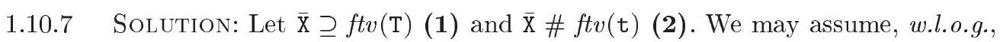
$\overline{\mathrm{X}} \# \mathrm{ftv}\left(\mathrm{T}^{\prime}\right)$ (3). By (1), (2), (3), and by definition of constraint generation for local universal type annotations, $\llbracket(t: \forall \overline{\mathrm{X}} . \mathrm{T}): \mathrm{T}^{\prime} \rrbracket$ is well-defined and is $\forall \overline{\mathrm{X}} . \llbracket \mathrm{t}: \mathrm{T} \rrbracket \wedge \exists \overline{\mathrm{X}} .\left(\mathrm{T} \leq \mathrm{T}^{\prime}\right)$ (4). By (3) and by definition of constraint generation for introduction of universal type variables and for general type annotations, $\llbracket \forall \overline{\mathrm{X}} .(\mathrm{t}: \mathrm{T}): \mathrm{T}^{\prime} \rrbracket$ is $\forall \overline{\mathrm{X}} \cdot \exists \mathrm{Z} .(\llbracket \mathrm{t}: \mathrm{T} \rrbracket \wedge \mathrm{T} \leq \mathrm{Z}) \wedge \exists \overline{\mathrm{X}} .\left(\llbracket \mathrm{t}: \mathrm{T} \rrbracket \wedge \mathrm{T} \leq \mathrm{T}^{\prime}\right)$, where $\mathrm{Z}$ is fresh, which we may immediately simplify to $\forall \overline{\mathrm{X}}$ $\llbracket \mathrm{t}: \mathrm{T} \rrbracket \wedge \exists \overline{\mathrm{X}}$. $\left(\llbracket t: \mathrm{T} \rrbracket \wedge \mathrm{T} \leq \mathrm{T}^{\prime}\right)$ (5). Using C-ExAnd and Lemma 1.10.1, it is straightforward to check that (4) and (5) are equivalent.

1.10.9 Solution: We have

1.10.9 解决方案：我们有

$$
\begin{array}{ll} 
& \exists \mathrm{Z} \cdot \llbracket \lambda \mathrm{z} \cdot \forall \mathrm{X} \cdot(\mathrm{z}: \mathrm{x}): \mathrm{z \rrbracket} \\
\Vdash & \exists \mathrm{Z}_{1} \mathrm{Z}_{2} \cdot \text { let } \mathrm{z}: \mathrm{Z}_{1} \text { in } \llbracket \forall \mathrm{X} .(\mathrm{z}: \mathrm{x}): \mathrm{Z}_{2} \rrbracket \\
\text { IF } & \exists \mathrm{Z}_{1} \cdot \forall \mathrm{X} \cdot\left(\mathrm{Z}_{1} \leq \mathrm{X}\right) \tag{2}
\end{array}
$$

where (1) is by definition of constraint generation for $\lambda$-abstractions, dropping the constraint that relates $\mathrm{Z}, \mathrm{Z}_{1}$, and $\mathrm{Z}_{2} ;(2)$ is by definition of constraint generation for universal type variable introduction, this time dropping information about $\mathrm{Z}_{2}$. Now, in a nondegenerate equality model, the constraint (2) is equivalent to false. In fact, for (2) to be satisfiable, the interpretation of subtyping must admit a least element $\perp$. We now see that $\llbracket \lambda z . \forall \mathrm{X} .(\mathrm{z}: \mathrm{X}): \mathrm{Z} \rrbracket$ is a very restrictive constraint. Indeed, it requires $z$ to have every type at once. Because $z$ is $\lambda$-bound-hence monomorphic-it must in fact have type $\perp$. On the other hand, we have

(1) 是根据 λ-抽象的约束生成定义，丢弃了与 Z, Z1 和 Z2 相关的约束；(2) 是根据普遍类型变量引入的约束生成定义，这次丢弃了关于 Z2 的信息。现在，在一个非退化等价模型中，约束(2)等价于假。实际上，为了使(2)可满足，子类型的解释必须承认一个最小元素 ⊥。我们现在看到，[λz.∀X.(z:X):Z] 是一个非常严格的约束。事实上，它要求 z 同时具有所有类型。因为 z 是 λ-绑定——因此是单态的——它实际上必须具有类型 ⊥。另一方面，我们有

$$
\begin{align*}
& \exists \mathrm{Z} \cdot \llbracket \forall \mathrm{X} \cdot \lambda \mathrm{z} \cdot(\mathrm{z}: \mathrm{X}): \mathrm{Z} \rrbracket \\
\equiv & \forall \mathrm{x} \cdot \exists \mathrm{Z} \cdot \llbracket \lambda \mathrm{z} \cdot(\mathrm{z}: \mathrm{x}): \mathrm{Z} \rrbracket  \tag{1}\\
\equiv & \forall \mathrm{X} \cdot \exists \mathrm{ZZ} \mathrm{Z}_{1} \cdot\left(\mathrm{Z}_{2} \leq \mathrm{X} \wedge \mathrm{X} \leq \mathrm{Z}_{2} \wedge \mathrm{Z}_{1} \rightarrow \mathrm{Z}_{2} \leq \mathrm{Z}\right)  \tag{2}\\
\equiv & \text { true } \tag{3}
\end{align*}
$$

where (1) is by definition of constraint generation for universal type variable introduction, dropping the second conjunct, which is entailed by the first; (2) is by Lemma 1.6.5, by definition of constraint generation for general type annotations, and by a few simple equivalence laws; (3) follows from C-NAMEEQ and the witness substitution $\left[\mathrm{Z}_{1} \mapsto \mathrm{X}, \mathrm{Z}_{2} \mapsto \mathrm{X}, \mathrm{Z} \mapsto(\mathrm{X} \rightarrow \mathrm{X})\right]$.

其中（1）是根据通用类型变量引入的约束生成的定义，省略了第二个连结，它是由第一个连结所蕴含的；（2）是根据引理1.6.5，通用类型注解的约束生成的定义，以及一些简单的等价律；（3）遵循C-NAMEEQ和见证替换 $\left[\mathrm{Z}_{1} \mapsto \mathrm{X}, \mathrm{Z}_{2} \mapsto \mathrm{X}, \mathrm{Z} \mapsto(\mathrm{X} \rightarrow \mathrm{X})\right]$。

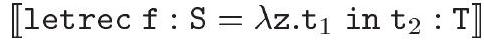

$$
\begin{aligned}
& \equiv \text { let } f: \forall x\left[\llbracket f i x f: S . \lambda z . t_{1}: x \rrbracket\right] . x \text { in } \llbracket t_{2}: T \rrbracket \\
& \equiv \text { let } f: \forall X\left[\text { let } f: S \text { in } \llbracket \lambda z . t_{1}: S \rrbracket \wedge S \preceq X\right] . X \text { in } \llbracket t_{2}: T \rrbracket \\
& \equiv \text { let } f: S \text { in } \llbracket \lambda z . t_{1}: S \rrbracket \wedge \text { let } f: \forall x[S \preceq x] . x \text { in } \llbracket t_{2}: T \rrbracket \\
& \equiv \text { let } f: S \text { in }\left(\llbracket \lambda z \cdot t_{1}: S \rrbracket \wedge \llbracket t_{2}: T \rrbracket\right)
\end{aligned}
$$

where (1) is by definition of the letrec syntactic sugar and by the definition of constraint generation for let constructs; we have $\mathrm{X} \notin f t v\left(\mathrm{~S}, \mathrm{t}_{1}\right)$; (2) is by definition of constraint generation for fix; (3) is by C-LETAND; (4) follows from the equivalence between the type schemes $\forall \mathrm{X}[\mathrm{S} \preceq \mathrm{X}] . \mathrm{X}$ and $\mathrm{S}$ - which itself is a direct consequence of C-ExTRAns-and from C-InAnd.

其中（1）是根据letrec语法糖的定义以及let结构约束生成的定义；我们有 $\mathrm{X} \notin f t v\left(\mathrm{~S}, \mathrm{t}_{1}\right)$；（2）是根据fix的约束生成定义；（3）是根据C-LETAND；（4）是由类型方案$\forall \mathrm{X}[\mathrm{S} \preceq \mathrm{X}] . \mathrm{X}$与$\mathrm{S}$之间的等价性推导出来的——这本身是C-ExTRAns的直接结果——以及C-InAnd。

1.11.16 Solution: We reason simultaneously in both the subtyping model or the equal-only model, that is, we only rely on properties that are valid in both models.

1.11.16 解决方案：我们同时在子类型模型和平等唯一模型中推理，也就是说，我们只依赖在两种模型中都有效的属性。

We must first ensure that rules RD-DEFAULT, RD-Found, and RD-FolLow respect (Definition 1.7.5).

我们必须首先确保规则RD-DEFAULT、RD-Found和RD-Follow遵守（定义1.7.5）。

- Case RD-DEfault. The reduction is $\{\mathrm{v}\} .\{\ell\} \xrightarrow{\delta} \mathrm{v}$, which is pure. Therefore, it is sufficient to establish that let $\Gamma_{0}$ in $\llbracket\{\mathrm{v}\} \cdot\{\ell\}: \mathrm{T} \rrbracket$ entails let $\Gamma_{0}$ in $\llbracket \mathrm{v}: \mathrm{T} \rrbracket$. In fact, we have:

- 案例RD-默认。减化是 $\{\mathrm{v}\} .\{\ell\} \xrightarrow{\delta} \mathrm{v}$，这是纯粹的。因此，只需证明让 $\Gamma_{0}$ 在 $\llbracket\{\mathrm{v}\} \cdot\{\ell\}: \mathrm{T} \rrbracket$ 中蕴含着让 $\Gamma_{0}$ 在 $\llbracket \mathrm{v}: \mathrm{T} \rrbracket$ 中即可。实际上，我们有：

$$
\begin{array}{cc} 
& \text { let } \Gamma_{0} \text { in } \llbracket\{\mathrm{v}\} \cdot\{\ell\}: \mathrm{T} \rrbracket \\
\equiv & \text { let } \Gamma_{0} \text { in } \exists \mathrm{XY} .(\cdot .\{\ell\} \preceq \mathrm{X} \rightarrow \mathrm{T} \wedge\{\cdot\} \preceq \mathrm{Y} \rightarrow \mathrm{X} \wedge \llbracket \mathrm{v}: \mathrm{Y} \rrbracket) \\
\equiv & \text { let } \Gamma_{0} \text { in } \exists \mathrm{XY} .\left(\exists \mathrm{X}_{1} \mathrm{X}_{2} \cdot\left(\Pi\left(\ell: \mathrm{X}_{1} ; \mathrm{X}_{2}\right) \rightarrow \mathrm{X}_{1} \leq \mathrm{X} \rightarrow \mathrm{T}\right)\right. \\
& \left.\wedge \exists \mathrm{Y}_{1} \cdot\left(\mathrm{Y}_{1} \rightarrow \Pi\left(\partial \mathrm{Y}_{1}\right) \leq \mathrm{Y} \rightarrow \mathrm{X}\right) \wedge \llbracket \mathrm{v}: \mathrm{Y} \rrbracket\right) \\
\Vdash & \text { let } \Gamma_{0} \text { in } \exists \mathrm{X}_{2} \mathrm{Y} .\left(\partial \mathrm{Y} \leq\left(\ell: \mathrm{X}_{1} ; \mathrm{X}_{2}\right) \wedge \mathrm{X}_{1} \leq \mathrm{T} \wedge \llbracket \mathrm{v}: \mathrm{Y} \rrbracket\right) \\
\Vdash & \text { let } \Gamma_{0} \text { in } \exists \mathrm{Y} .\left(\mathrm{Y} \leq \mathrm{X}_{1} \wedge \mathrm{X}_{1} \leq \mathrm{T} \wedge \llbracket \mathrm{v}: \mathrm{Y} \rrbracket\right) \\
\Vdash & \text { let } \Gamma_{0} \text { in } \llbracket \mathrm{v}: \mathrm{T} \rrbracket \tag{5}
\end{array}
$$

where (1) is by definition of constraint generation; (2) is by definition of $\Gamma_{0}$, C-InId; (3) by variances of $\Pi, \ell$, and $\rightarrow$, C-And, C-Ex*, C-ExAnd; (4) by C-Row-DL and covariance of $\ell$; (5) by Lemma 1.6.3.

其中（1）是根据约束生成的定义；（2）是根据 $\Gamma_{0}$, C-InId 的定义；（3）根据 $\Pi, \ell$ 以及 $\rightarrow$ 的变化，C-And, C-Ex*, C-ExAnd；（4）根据 C-Row-DL 和 $\ell$ 的协方差；（5）根据引理1.6.3。

○ Case RD-Found: The reduction is $\{\mathrm{w}$ with $\ell=\mathrm{v}\} .\{\ell\} \xrightarrow{\delta} \mathrm{v}$. It suffices to establish let $\Gamma_{0}$ in $\llbracket\{\mathrm{w}$ with $\ell=\mathrm{v}\} \cdot\{\ell\}: \mathrm{T} \rrbracket$ entails let $\Gamma_{0}$ in $\llbracket \mathrm{v}: \mathrm{T} \rrbracket$. In fact, we
have:

案例 RD-发现：减少是 $\{\mathrm{w}$ 与 $\ell=\mathrm{v}\} .\{\ell\} \xrightarrow{\delta} \mathrm{v}$. 只需建立让 $\Gamma_{0}$ 在 $\llbracket\{\mathrm{w}$ 与 $\ell=\mathrm{v}\} \cdot\{\ell\}: \mathrm{T} \rrbracket$ 中蕴含让 $\Gamma_{0}$ 在 $\llbracket \mathrm{v}: \mathrm{T} \rrbracket$ 中。实际上，我们有：

$$
\begin{align*}
& \text { let } \Gamma_{0} \text { in } \llbracket\{\mathrm{w} \text { with } \ell=\mathrm{v}\} \cdot\{\ell\}: \mathrm{T} \rrbracket \\
\equiv & \text { let } \Gamma_{0} \text { in } \exists \mathrm{XYY}^{\prime} \cdot\left(\cdot:\{\ell\} \preceq \mathrm{X} \rightarrow \mathrm{T} \wedge\{\cdot \text { with } \ell=\cdot\} \preceq \mathrm{Y} \rightarrow \mathrm{Y}^{\prime} \rightarrow \mathrm{X} \wedge\right. \\
\wedge & \left.\wedge \llbracket \mathrm{w}: \mathrm{Y} \rrbracket \wedge \llbracket \mathrm{v}: \mathrm{Y}^{\prime} \rrbracket\right)  \tag{1}\\
\equiv & \text { let } \Gamma_{0} \text { in } \exists \mathrm{XYY}^{\prime} \cdot\left(\exists \mathrm{X}_{1} \mathrm{X}_{2} \cdot\left(\Pi\left(\ell: \mathrm{X}_{1} ; \mathrm{X}_{2}\right) \rightarrow \mathrm{X}_{1} \leq \mathrm{X} \rightarrow \mathrm{T}\right)\right. \\
& \wedge \exists \mathrm{Y}_{1} \mathrm{Y}_{2} \mathrm{Y}_{3} \cdot\left(\Pi\left(\ell: \mathrm{Y}_{1} ; \mathrm{Y}_{3}\right) \rightarrow \mathrm{Y}_{2} \rightarrow \Pi\left(\ell: \mathrm{Y}_{2} ; \mathrm{Y}_{3}\right) \leq \mathrm{Y} \rightarrow \mathrm{Y}^{\prime} \rightarrow \mathrm{X}\right) \\
& \left.\wedge \llbracket \mathrm{w}: \mathrm{Y} \rrbracket \wedge \llbracket \mathrm{v}: \mathrm{Y}^{\prime} \rrbracket\right)  \tag{2}\\
I & \text { let } \Gamma_{0} \text { in } \exists \mathrm{Y}^{\prime} \mathrm{X}_{1} \mathrm{Y}_{2} \cdot\left(\mathrm{Y}^{\prime} \leq \mathrm{Y}_{2} \wedge \mathrm{Y}_{2} \leq \mathrm{X}_{1} \wedge \mathrm{X}_{1} \leq \mathrm{T} \wedge \llbracket \mathrm{v}: \mathrm{Y}^{\prime} \rrbracket\right)  \tag{3}\\
I & \text { let } \Gamma_{0} \text { in } \llbracket \mathrm{v}: \mathrm{T} \rrbracket \tag{4}
\end{align*}
$$

where (1) is by definition of constraint generation; (2) is by definition of $\Gamma_{0}$, C-InID; (3) by variances of $\Pi, \ell$, and $\rightarrow$, C-And, C-Ex*, C-ExAnd; (4) by Lemma 1.6.3.

其中（1）是根据约束生成的定义；（2）是根据 $\Gamma_{0}$, C-InID 的定义；（3）根据 $\Pi, \ell$, 以及 $\rightarrow$ 的方差，C-And, C-Ex*, C-ExAnd；（4）根据引理1.6.3。

- Case RD-Follow The proof is similar to the previous case.

- 案例RD-跟进 证据与上一个案例相似。

We must now check that if the configuration $F \mathrm{v}_{1} \ldots \mathrm{v}_{k} / \mu$ is is well-typed, then either it is reducible, or it is a value.

我们必须现在检查，如果配置 $F \mathrm{v}_{1} \ldots \mathrm{v}_{k} / \mu$ 是类型正确的，那么它要么是可约的，要么是一个值。

We begin by checking that every value that is well-typed with type $\Pi \mathrm{T}$ is a record value, that is, either of the form $\left\{\mathrm{v}^{\prime}\right\}$ or $\left\{\mathrm{v}^{\prime \prime}\right.$ with $\left.\ell^{\prime}=\mathrm{v}^{\prime}\right\}$. Indeed, suppose that let $\Gamma_{0}$ in $\llbracket \mathrm{v}: \Pi \mathrm{T} \rrbracket$ is satisfiable. Then, $v$ cannot be a program variable, for a well-typed value must be closed; $v$ cannot be a memory location $m$, for otherwise ref $M(m) \leq \Pi \mathrm{T}$ would be satisfiable - but the top type constructors ref and $\Pi$ are incompatible (since $\Pi$ is isolated); v cannot be a partial application of a constructor or a primitive, nor a $\lambda$-abstraction, since otherwise $\mathrm{T}^{\prime} \rightarrow \mathrm{T}^{\prime \prime} \leq \Pi \mathrm{T}$ would be satisfiable but the top type constructors $\rightarrow$ and $\Pi$ are incompatible (since they are both isolated); thus v must either be of the form $\{\mathrm{v}\}$ or $\{\mathrm{w}$ with $\ell=\mathrm{v}\}$, for these are the only left cases.

我们首先检查每一个类型为 $\Pi \mathrm{T}$ 的良好类型值都是一个记录值，也就是说，它要么是 $\left\{\mathrm{v}^{\prime}\right\}$ 的形式，要么是 $\left\{\mathrm{v}^{\prime \prime}\right.$ 与 $\left.\ell^{\prime}=\mathrm{v}^{\prime}\right\}$ 的形式。实际上，假设 $\Gamma_{0}$ 在 $\llbracket \mathrm{v}: \Pi \mathrm{T} \rrbracket$ 中是可满足的。那么，$v$ 不能是一个程序变量，因为一个良好类型的值必须是闭合的；$v$ 不能是一个内存位置 $m$，否则 ref $M(m) \leq \Pi \mathrm{T}$ 就是可以满足的——但顶级类型构造器 ref 和 $\Pi$ 是不兼容的（因为 $\Pi$ 是孤立的）；$v$ 不能是一个构造器或原语的部分应用，也不能是一个 $\lambda$-抽象，因为否则 $\mathrm{T}^{\prime} \rightarrow \mathrm{T}^{\prime \prime} \leq \Pi \mathrm{T}$ 就是可以满足的，但顶级类型构造器 $\rightarrow$ 和 $\Pi$ 是不兼容的（因为它们都是孤立的）；因此，$v$ 必须是 $\{\mathrm{v}\}$ 或 $\{\mathrm{w}$ 与 $\ell=\mathrm{v}\}$ 的形式，因为这是唯一剩下的情况。

Next, we note that, according to the constraint generation rules, if the configuration $\mathrm{c}_{1} \ldots \mathrm{v}_{k} / \mu$ is well-typed, then a constraint of the form let $\Gamma_{0} ; \operatorname{ref} M$ in $\left(\mathrm{c} \preceq \mathrm{x}_{1} \rightarrow \ldots \rightarrow \mathrm{x}_{k} \rightarrow \mathrm{T} \wedge \llbracket \mathrm{v}_{1}: \mathrm{x}_{1} \rrbracket \wedge \ldots \wedge \llbracket \mathrm{v}_{k}: \mathrm{x}_{k} \rrbracket\right)$ is satisfiable. We now reason by cases on $\mathrm{c}$.

接下来，我们注意到，根据约束生成规则，如果配置 $\mathrm{c}_{1} \ldots \mathrm{v}_{k} / \mu$ 是类型良好的，那么形式的约束 let $\Gamma_{0} ; \operatorname{ref} M$ in $\left(\mathrm{c} \preceq \mathrm{x}_{1} \rightarrow \ldots \rightarrow \mathrm{x}_{k} \rightarrow \mathrm{T} \wedge \llbracket \mathrm{v}_{1}: \mathrm{x}_{1} \rrbracket \wedge \ldots \wedge \llbracket \mathrm{v}_{k}: \mathrm{x}_{k} \rrbracket\right)$ 是可满足的。我们现在按 $\mathrm{c}$ 的不同情况进行推理。

$\circ$ Case $\mathrm{c}$ is $\{\cdot\}$. We may asume $k \geq 2$, since otherwise, the expression is a value. Then $\Gamma_{0}(\mathrm{c})$ is $\forall \mathrm{XY} . \mathrm{X} \rightarrow \Pi(\partial \mathrm{X})$, so by C-INID and C-ARROw the above constraint entails $\exists \mathrm{X} .\left(\Pi(\partial \mathrm{X}) \leq \mathrm{X}_{2} \rightarrow \ldots \rightarrow \mathrm{T}\right)$, which by C-Class-I entails false since $\rightarrow$ and $\Pi$ are imcompatible. Thus, this case cannot occur.

病例c是{}". 我们可以假设k大于等于2，因为否则，该表达式是一个值。那么Γ₀(c)是∀XY. X → Π(∂X)，所以根据C-INID和C-ARROw，上述约束蕴含存在X.（Π(∂X) ≤ X₂ → ... → T），这由C-Class-I蕴含为假，因为"→"和"Π"是不兼容的。因此，这种情况不可能发生。

$\circ$ Case $\mathrm{c}$ is $\{\cdot$ with $\ell=\cdot\}$. Similar to the previous case.

案例c是{·}，其中ℓ=·。与之前的案例相似。

$\circ$ Case $\mathrm{c}$ is $\cdot\{\ell\}$. We may asume $k \geq 1$, since otherwise, the expression is a value. Then $\Gamma_{0}(\mathrm{c})$ is $\forall \mathrm{XY} . \Pi(\ell: \mathrm{X} ; \mathrm{Y}) \rightarrow \mathrm{X}$, so by C-INID and C-ARRow the above constraint entails let $\Gamma_{0} ; \operatorname{ref} M$ in $\left(\exists \mathrm{XY} .\left(\mathrm{X}_{1} \leq \Pi(\ell: \mathrm{X} ; \mathrm{Y})\right) \wedge \llbracket \mathrm{v}_{1}: \mathrm{X}_{1} \rrbracket\right)$, which by lemma 1.6.3 entails let $\Gamma_{0} ; \operatorname{ref} M$ in $\exists \mathrm{XY} . \llbracket \mathrm{v}_{1}: \Pi(\ell: \mathrm{X} ; \mathrm{Y}) \rrbracket$. Thus $\mathrm{v}_{1}$ is a record value, that is, either of the form $\left\{\mathrm{v}^{\prime}\right\}$ and the configuration is reducible
to $\mathrm{v}^{\prime}$ or of the form $\left\{\mathrm{v}^{\prime \prime}\right.$ with $\left.\ell^{\prime}=\mathrm{v}^{\prime}\right\}$ and the configuration is reducible to either $\mathrm{v}^{\prime}$ or $\mathrm{v}^{\prime \prime} .\{\ell\}$.

情况c是·{ℓ}。我们可以假设k≥1，因为否则，该表达式是一个值。那么Γ0(c)是∀XY. Π(ℓ: X ; Y) → X，所以根据C-INID和C-ARRow规则，上述约束蕴含着 let Γ0 ; ref M in (存在XY.(X1 ≤ Π(ℓ: X ; Y)) ∧ [v1: X1])，根据引理1.6.3，这又蕴含着 let Γ0 ; ref M in 存在XY. [v1: Π(ℓ: X ; Y)]。因此v1是一个记录值，即是以下形式之一：{v'}，配置可约至v'；或者形式为{v''}，其中{ℓ'=v'}，配置可约至v'或v''{ℓ}。

1.11.17 Solution: We add a collection of destructors $\cdot\left[\ell_{1} \leftrightarrow \ell_{2}\right]$ of arity 1 for all pairs of distinct labels, with the following semantics:

1.11.17 解：我们为所有不同标签对的集合添加一个析构函数 $\cdot\left[\ell_{1} \leftrightarrow \ell_{2}\right]$，其元数为1，具有以下语义：

$$
\begin{array}{rr}
\{\mathrm{v}\}\left[\ell_{1} \leftrightarrow \ell_{2}\right] \xrightarrow{\delta} \mathrm{v} \\
\{\mathrm{w} \text { with } \ell=\mathrm{v}\}\left[\ell_{1} \leftrightarrow \ell_{2}\right] \xrightarrow{\delta}\left\{\mathrm{w}\left[\ell_{1} \leftrightarrow \ell_{2}\right] \text { with } \ell=\mathrm{v}\right\} & \text { if } \ell \notin\left\{\ell_{1}, \ell_{2}\right\} \\
\{\mathrm{w} \text { with } \ell=\mathrm{v}\}\left[\ell_{1} \leftrightarrow \ell_{2}\right] \xrightarrow{\delta}\left\{\mathrm{w}\left[\ell_{1} \leftrightarrow \ell_{2}\right] \text { with } \bar{\ell}=\mathrm{v}\right\} & \text { if }\{\ell, \bar{\ell}\}=\left\{\ell_{1}, \ell_{2}\right\}
\end{array}
$$

The initial environment $\Gamma_{0}$ must be extended with the following typing asumption:

初始环境 $\Gamma_{0}$ 必须用以下类型假设进行扩展：

$$
\cdot\left[\ell_{1} \leftrightarrow \ell_{2}\right]: \quad \forall \mathrm{X}_{1} \mathrm{X}_{2} \mathrm{Y} \cdot \Pi\left(\ell_{1}: \mathrm{X}_{1} ; \ell_{2}: \mathrm{X}_{2} ; \mathrm{Y}\right) \rightarrow \Pi\left(\ell_{1}: \mathrm{X}_{2} ; \ell_{2}: \mathrm{X}_{1} ; \mathrm{Y}\right)
$$

We must then check subjection reduction for the new primitive. Since we only added a constructor, it sufficies to check progress for the new primitive, that is, that well-typed expressions of the form $\left[\ell_{1} \leftrightarrow \ell_{2}\right] \mathrm{v}_{1} \ldots \mathrm{v}_{n}$ are either value or can be further reduced. Both parts are easy and similar to the corresponding parts in Exercice 1.11.16.

我们必须然后检查新原语的对象减少。由于我们只添加了一个构造器，因此只需检查新原语的前进性，即形式的良好类型表达式 $\left[\ell_{1} \leftrightarrow \ell_{2}\right] \mathrm{v}_{1} \ldots \mathrm{v}_{n}$ 要么是值，要么可以进一步减少。两部分都很容易，与练习1.11.16中的相应部分相似。

1.11.18 Solution: There are several solutions. One of them is to asume a fixed total ordering on row-labels, and to retain as constructors only $\ell^{\kappa, L}$ such that $\ell<L$, that is $\ell<\ell^{\prime}$ for all $\ell^{\prime} \in L$; other constants $\ell^{\kappa, L}$ such that $\ell \nless L$ are moved from constructors to the status of destructors with the following collection of reduction rules:

1.11.18 解法：有几个解法。其中之一是假设行标签上有一个固定的全序，只保留作为构造器的 $\ell^{\kappa, L}$ 使得 $\ell<L$，即对所有 $\ell^{\prime} \in L$ 都有 $\ell<\ell^{\prime}$；其他常量 $\ell^{\kappa, L}$ 使得 $\ell \nless L$ 的则从构造器移动到销毁器的状态，并伴随以下归约规则集：

$$
\left\{\left\{\mathrm{w} \text { with } \ell^{\prime}=\mathrm{v}^{\prime}\right\} \text { with } \ell=\mathrm{v}\right\} \xrightarrow{\delta}\left\{\{\mathrm{w} \text { with } \ell=\mathrm{v}\} \text { with } \ell^{\prime}=\mathrm{v}^{\prime}\right\}
$$

(RD-TRANSPOSE)

for all labels $\ell$ and $\ell^{\prime}$ such that $\ell^{\prime}<\ell$ and

对于所有标签 $\ell$ 和 $\ell^{\prime}$，使得 $\ell^{\prime}<\ell$ 且

$$
\left\{\left\{\mathrm{w} \text { with } \ell=\mathrm{v}^{\prime}\right\} \text { with } \ell=\mathrm{v}\right\} \xrightarrow{\delta}\{\mathrm{w} \text { with } \ell=\mathrm{v}\}
$$

(RD-DISCARD)

for all labels $\ell$. It is now obvious that values are in normal forms, in the sense that explicit fields are never repeated and are always listed in order. Typing rules need not be changed, so requirement (i) of Definition 1.7.6 still holds. Requirement (ii) need to be check, in particular, for the new primitives $\ell^{L}$, which we leave to the reader (the proof for $\cdot .\{\ell\}$ should hold unchanged).

对于所有标签 $\ell$。现在很明显，值处于规范形式，这意味着显式字段永远不会重复，并且总是按顺序列出。类型规则不需要改变，因此定义1.7.6中的要求（i）仍然成立。要求（ii）需要检查，特别是对于新的原语 $\ell^{L}$，我们留给读者去验证（对于 $\cdot .\{\ell\}$ 的证明应该保持不变）。

1.11.19 Solution: Let map have type $\Pi(\mathrm{X} \rightarrow \mathrm{Y}) \rightarrow \Pi(\mathrm{X}) \rightarrow \Pi(\mathrm{Y})$, and the following reduction rules in the semantics with normal forms:

1.11.19 解决方案：让 map 具有类型 $\Pi(\mathrm{X} \rightarrow \mathrm{Y}) \rightarrow \Pi(\mathrm{X}) \rightarrow \Pi(\mathrm{Y})$，并在具有正常形式的语义中使用以下简化规则：

$$
\begin{gathered}
\operatorname{map}\left\{\mathrm{v}^{\prime} \text { with } \ell=\mathrm{v}\right\} \mathrm{w} \xrightarrow{\delta}\left\{\operatorname{map} \mathrm{v}^{\prime} \mathrm{w} \text { with } \ell=\mathrm{v}(\mathrm{w} \cdot\{\ell\})\right\} \\
\operatorname{map} \mathrm{v}\left\{\mathrm{w}^{\prime} \text { with } \ell=\mathrm{w}\right\} \xrightarrow{\delta}\left\{\operatorname{map} \mathrm{v} \mathrm{w}^{\prime} \text { with } \ell=(\mathrm{v} \cdot\{\ell\}) \mathrm{w}\right\} \\
\operatorname{map}\{\mathrm{v}\}\{\mathrm{w}\} \xrightarrow{\delta}\{\mathrm{v} \mathrm{w}\}
\end{gathered}
$$

1.11.22 Solution: To ensure that the field is not present in the argument of extension, it sufficies to restrict its the typing asumptions as follows:

1.11.22 解决方案：为确保字段不在扩展的参数中存在，只需按照以下方式限制其类型假设即可：

$$
\langle\cdot \text { with } \ell=\cdot\rangle: \forall \mathrm{Xx}^{\prime} \mathrm{Y} . \Pi(\ell: \text { abs } ; \mathrm{Y}) \rightarrow \mathrm{X}^{\prime} \rightarrow \Pi\left(\ell: \text { pre } \mathrm{X}^{\prime} ; \mathrm{Y}\right)
$$

To remove an existing field, we can use the following syntactic sugar:

要删除现有字段，我们可以使用以下语法糖：

$$
\begin{aligned}
\cdot \backslash \ell \stackrel{\text { def }}{=} & \lambda \mathrm{v} \cdot\{\mathrm{v} \text { with } \ell=\mathrm{abs}\} \\
& : \forall \mathrm{XY} . \Pi(\ell: \mathrm{X} ; \mathrm{Y}) \rightarrow \Pi(\ell: \text { abs } ; \mathrm{Y})
\end{aligned}
$$

The following weaker typing asumption could also be used to ensure that the field is always present before removal:

以下较弱的类型假设也可以用于确保在移除字段之前该字段始终存在：

$$
\forall X Y . \Pi(\ell: \text { pre } \mathrm{X} ; \mathrm{Y}) \rightarrow \Pi(\ell: \text { abs } ; \mathrm{Y})
$$

1.11.25 Solution: The proof is similar to 1.11 .16 but slightly more complex because we must also check that labels are defined when accessed, and with subtyping.

1.11.25 解答：这个证明与1.11.16类似，但稍微复杂一些，因为我们也必须检查在访问时标签是否被定义，并且涉及到子类型。

We reason simultaneously in both the subtyping model or the equal-only model, that is, we only rely on properties that are valid in both models.

我们同时在这两种模型中进行推理：子类型模型和仅相等模型，也就是说，我们只依赖在这两种模型中都有效的属性。

We must first ensure that rules RE-FOUND and RE-FOLLOW respect (Definition 1.7.5).

我们必须首先确保规则重新确立并遵守尊重（定义1.7.5）。

- Case RE-Found: See Exercice ??. In line ??, field $\ell$ is pre $\mathrm{X}_{1}$ instead of $\mathrm{X}_{1}$ and pre $\mathrm{Y}_{2}$ instead of $\mathrm{Y}_{2}$ and step ?? also uses covariance of pre.
- Case RE-Follow The proof is similar.

- 重新找到案例：见练习??. 在第??行，字段 $\ell$ 应为 pre $\mathrm{X}_{1}$ 而不是 $\mathrm{X}_{1}$，以及 pre $\mathrm{Y}_{2}$ 而不是 $\mathrm{Y}_{2}$，并且步骤??也使用了预前协方差。
- 跟进案例：证明过程类似。

We must then check that if the configuration $F \mathrm{v}_{1} \ldots \mathrm{v}_{k} / \mu$ is is well-typed, then either it is reducible, or it is a value.

我们必须检查，如果配置 $F \mathrm{v}_{1} \ldots \mathrm{v}_{k} / \mu$ 是类型正确的，那么它要么是可约的，要么是一个值。

We begin by checking that every value that is well-typed with type $\Pi \mathrm{T}$ is a record value, that is, either of the form \langle\rangle or $\left\langle\mathrm{v}^{\prime \prime}\right.$ with $\left.\ell^{\prime}=\mathrm{v}^{\prime}\right\rangle$. See Exercice 1.11.16.

我们首先检查每一个类型为 $\Pi \mathrm{T}$ 的良类型值都是一个记录值，也就是说，它要么是 \langle\rangle 的形式，要么是 $\left\langle\mathrm{v}^{\prime \prime}\right.$ 与 $\left.\ell^{\prime}=\mathrm{v}^{\prime}\right\rangle$ 的形式。见练习1.11.16。

Next, we note that, according to the constraint generation rules, if the configuration $c v_{1} \ldots v_{k} / \mu$ is well-typed, then a constraint of the form let $\Gamma_{0} ; \operatorname{ref} M$ in $\left(\mathrm{c} \preceq \mathrm{x}_{1} \rightarrow \ldots \rightarrow \mathrm{x}_{k} \rightarrow \mathrm{T} \wedge \llbracket \mathrm{v}_{1}: \mathrm{x}_{1} \rrbracket \wedge \ldots \wedge \llbracket \mathrm{v}_{k}: \mathrm{x}_{k} \rrbracket\right)$ is satisfiable. We now reason by cases on $\mathrm{c}$.

接下来，我们注意到，根据约束生成规则，如果配置 $c v_{1} \ldots v_{k} / \mu$ 是类型正确的，那么形如 let $\Gamma_{0} ; \operatorname{ref} M$ in $\left(\mathrm{c} \preceq \mathrm{x}_{1} \rightarrow \ldots \rightarrow \mathrm{x}_{k} \rightarrow \mathrm{T} \wedge \llbracket \mathrm{v}_{1}: \mathrm{x}_{1} \rrbracket \wedge \ldots \wedge \llbracket \mathrm{v}_{k}: \mathrm{x}_{k} \rrbracket\right)$ 的约束是可满足的。我们现在通过$\mathrm{c}$的案例来进行推理。

$\circ$ Case $\mathrm{c}$ is \langle\rangle or $\langle\cdot$ with $\ell=\cdot\rangle$. See Exercice 1.11.16.

案例 c 是 ⟨⟩ 或 ⟨· with ℓ=·⟩。见练习 1.11.16。

$\circ$ Case $\mathrm{c}$ is $\cdot\langle\ell\rangle$. We may asume $k \geq 1$, since otherwise, the expression is a value. Then $\Gamma_{0}(\mathrm{c})$ is $\forall \mathrm{XY} . \Pi(\ell$ : pre $\mathrm{X} ; \mathrm{Y}) \rightarrow \mathrm{X}$, so by C-INID and C-ARRow the above constraint entails let $\Gamma_{0} ; \operatorname{ref} M$ in $\left(\exists \mathrm{XY} .\left(\mathrm{X}_{1} \leq \Pi(\ell:\right.\right.$ pre $\left.\left.\mathrm{X} ; \mathrm{Y})\right) \wedge \llbracket \mathrm{v}_{1}: \mathrm{X}_{1} \rrbracket\right)$, which by lemma 1.6.3 entails let $\Gamma_{0} ; \operatorname{ref} M$ in $\exists \mathrm{XY} . \llbracket \mathrm{v}_{1}: \Pi(\ell:$ pre $\mathrm{X} ; \mathrm{Y}) \rrbracket$. Thus $\mathrm{v}_{1}$ is a record value, that is, either of the form \langle\rangle or $\left\langle\mathrm{v}^{\prime \prime}\right.$ with $\left.\ell=\mathrm{v}^{\prime}\right\rangle$. In fact, the former case cannot occur, since let $\Gamma_{0} ; \operatorname{ref} M$ in $\exists X Y . \llbracket\langle\rangle: \Pi(\ell:$ pre X ; Y)】 entails $\exists X Y \Pi(\partial a b s) \leq \Pi(\ell$ : pre X; $)$ by C-INID and C-IN*, which in turns
entails $\exists$ X.abs $\leq$ pre $\mathrm{X}$ by C-Row-DL and covariance of $\Pi$ and $\ell$. However, this constraint is equivalent to false, because $\phi(\mathrm{abs}) \leq \phi$ (pre $\mathrm{X}$ ) does not hold in any ground assignment $\phi$. Thus $\mathrm{v}_{1}$ is $\left\langle\mathrm{v}^{\prime \prime}\right.$ with $\left.\ell^{\prime}=\mathrm{v}^{\prime}\right\rangle$ and the configuration is reducible to $\mathrm{v}^{\prime}$ if $\ell^{\prime}$ is $\ell$ or $\mathrm{v}^{\prime \prime}$ otherwise.

情况c是$\cdot\langle\ell\rangle$。我们可以假设$k \geq 1$，因为否则表达式是一个值。那么$\Gamma_{0}(\mathrm{c})$是$\forall \mathrm{XY} . \Pi(\ell$：pre $\mathrm{X} ; \mathrm{Y}) \rightarrow \mathrm{X}$，因此由C-INID和C-ARRow规则，上面的约束蕴含着 let $\Gamma_{0} ; \operatorname{ref} M$ in $(\exists \mathrm{XY} .(\mathrm{X}_{1} \leq \Pi(\ell:\text{pre} \mathrm{X} ; \mathrm{Y})\rangle) \wedge \llbracket \mathrm{v}_{1}: \mathrm{X}_{1} \rrbracket)$，根据引理1.6.3，这又蕴含着 let $\Gamma_{0} ; \operatorname{ref} M$ in $\exists \mathrm{XY} . \llbracket \mathrm{v}_{1}: \Pi(\ell:\text{pre} \mathrm{X} ; \mathrm{Y}) \rrbracket$。因此$\mathrm{v}_{1}$是一个记录值，即要么是$\langle\rangle$的形式，要么是$\left\langle\mathrm{v}^{\prime \prime}\right.$的形式，其中$\left.\ell=\mathrm{v}^{\prime}\right\rangle$。实际上，前者情况不可能发生，因为 let $\Gamma_{0} ; \operatorname{ref} M$ in $\exists X Y . \llbracket\langle\rangle: \Pi(\ell:\text{pre} X ; Y)】蕴含着 \exists X Y \Pi(\partial a b s) \leq \Pi(\ell$：pre X;$)$，通过C-INID和C-IN*规则，这又蕴含着 \exists$ X.abs $\leq$ pre $\mathrm{X}$，通过C-Row-DL和$\Pi$以及$\ell$的协变性。然而，这个约束等价于假，因为$\phi(\mathrm{abs}) \leq \phi$(pre $\mathrm{X}$)在任何地面赋值$\phi$中都不成立。因此$\mathrm{v}_{1}$是$\left\langle\mathrm{v}^{\prime \prime}\right.$的形式，其中$\left.\ell^{\prime}=\mathrm{v}^{\prime}\right\rangle$，如果$\ell^{\prime}$是$\ell$，则配置可以简化为$\mathrm{v}^{\prime}$，否则简化为$\mathrm{v}^{\prime \prime}$。


[^0]:    The (currently unfinished) code that accompanies this chapter may be found at http: //pauillac.inria.fr/ remy/mlrow/. For space reasons, some material, including proofs, exercises, and more, has been left out of this version. In the future, a full version of this chapter that includes the missing material will be made available at the same address. In spite of these omissions, this chapter is still oversize with respect to Benjamin's 100 page barrier: we currently have roughly 135 pages of text and 15 pages of solutions to exercises. We would appreciate comments and suggestions from the proofreaders as to how this chapter could be made shorter, without severely compromising its interest or readability.

[^0]：本章（目前尚未完成）的配套代码可以在 http://pauillac.inria.fr/remy/mlrow/ 找到。由于篇幅原因，包括证明、习题等在内的某些材料并未包含在此版本中。将来，包含这些遗漏材料的完整版本将在同一地址提供。尽管有这些省略，但这一章节相对于本杰明的100页限制来说仍然篇幅过长：我们目前有大约135页的文本和15页的习题解答。我们非常欢迎校对者就如何在不严重损害其兴趣或可读性的情况下缩短这一章节提出意见和建议。
